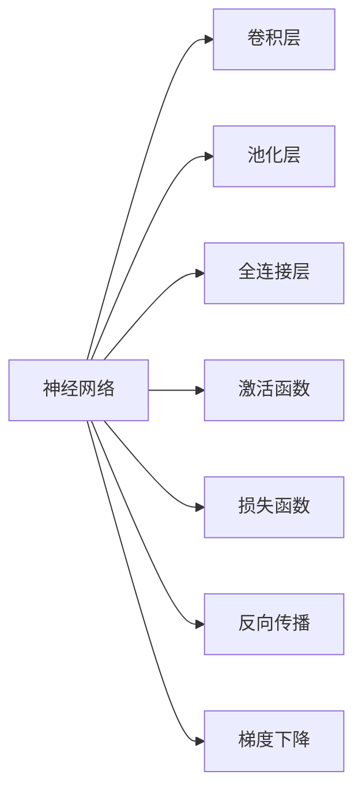

                 

# 深度学习原理与代码实例讲解

> 关键词：深度学习,神经网络,反向传播,损失函数,梯度下降,TensorFlow,PyTorch,卷积神经网络(CNN),循环神经网络(RNN),生成对抗网络(GAN),强化学习,迁移学习,PyTorch代码实例,深度学习实践

## 1. 背景介绍

### 1.1 问题由来

深度学习（Deep Learning）作为人工智能（AI）领域的一大技术分支，自2012年ImageNet图像识别竞赛取得突破性成绩以来，便迅速成为学术界和工业界关注的焦点。深度学习技术不仅能处理图像、语音、文本等多种类型的数据，还能够通过多层次的抽象能力，提取数据的高级特征，从而在自然语言处理（NLP）、计算机视觉（CV）、语音识别（ASR）等多个领域取得了优异的表现。

然而，深度学习模型通常需要大量标注数据进行训练，且在模型设计和超参数调整上存在着较高的复杂度和难度。为了帮助开发者更好地理解深度学习的核心原理，本文将结合TensorFlow和PyTorch两个主流深度学习框架，通过代码实例的形式，系统讲解深度学习的基础理论和关键技术，并针对实际应用场景提供详细指导。

### 1.2 问题核心关键点

深度学习原理与代码实例讲解的关键点包括以下几个方面：

1. **深度学习模型架构**：包括卷积神经网络（CNN）、循环神经网络（RNN）、生成对抗网络（GAN）、长短时记忆网络（LSTM）等，这些架构是理解深度学习的基础。
2. **反向传播算法**：反向传播算法是深度学习模型训练的核心算法，通过计算梯度，更新模型参数，实现模型优化。
3. **损失函数**：损失函数是评估模型预测输出与真实标签之间差异的关键指标，常见的有均方误差（MSE）、交叉熵（Cross-Entropy）等。
4. **梯度下降算法**：梯度下降算法是深度学习模型训练的主要优化算法，分为批量梯度下降（Batch Gradient Descent）和随机梯度下降（Stochastic Gradient Descent）等。
5. **代码实践**：通过具体的TensorFlow和PyTorch代码实例，展示深度学习模型在实际应用中的构建、训练和优化过程。
6. **实际应用场景**：讲解深度学习技术在不同领域的实际应用案例，如计算机视觉中的图像识别、自然语言处理中的文本分类、语音识别等。

理解这些核心点，有助于深入掌握深度学习的原理和实践技巧，进一步推动其在实际项目中的应用。

## 2. 核心概念与联系

### 2.1 核心概念概述

为了更好地理解深度学习的核心原理，本文将介绍几个关键概念及其联系：

1. **神经网络（Neural Network）**：模拟人类神经系统的计算模型，由多个神经元组成，能够通过训练学习输入与输出之间的映射关系。
2. **反向传播算法（Backpropagation）**：用于计算神经网络模型中的梯度信息，通过反向传播误差，更新模型参数，优化模型性能。
3. **损失函数（Loss Function）**：用于衡量模型预测输出与真实标签之间的差异，常见的有均方误差（MSE）、交叉熵（Cross-Entropy）等。
4. **梯度下降算法（Gradient Descent）**：通过计算梯度信息，更新模型参数，实现模型优化。常见的有批量梯度下降（Batch Gradient Descent）和随机梯度下降（Stochastic Gradient Descent）。
5. **卷积神经网络（Convolutional Neural Network, CNN）**：用于处理图像、视频等空间结构数据的神经网络，通过卷积层、池化层等操作，提取局部特征。
6. **循环神经网络（Recurrent Neural Network, RNN）**：用于处理序列数据的神经网络，能够捕捉序列中的时间依赖关系。
7. **生成对抗网络（Generative Adversarial Network, GAN）**：由生成器和判别器两个对抗性网络组成，用于生成逼真样本，具有广泛的应用前景。
8. **长短时记忆网络（Long Short-Term Memory, LSTM）**：一种特殊的RNN结构，能够处理长序列数据，解决了传统RNN中的梯度消失问题。

这些核心概念构成了深度学习的基本框架，通过理解这些概念，可以更好地掌握深度学习的原理和实践技巧。

### 2.2 核心概念原理和架构的 Mermaid 流程图



以上流程图展示了深度学习模型的基本架构和训练流程。模型首先通过卷积层和池化层提取输入数据的局部特征，再通过全连接层进行特征融合，最终通过激活函数和损失函数计算误差，通过反向传播和梯度下降算法更新模型参数，实现模型优化。

## 3. 核心算法原理 & 具体操作步骤

### 3.1 算法原理概述

深度学习的核心算法包括反向传播和梯度下降。反向传播算法用于计算模型参数的梯度信息，梯度下降算法用于更新模型参数，优化模型性能。以下将详细介绍这些算法的基本原理和具体操作步骤。

### 3.2 算法步骤详解

#### 3.2.1 神经网络模型构建

神经网络模型由多个神经元（或称为节点）组成，每个神经元接收输入，进行计算，输出结果。神经网络通常分为多层，包括输入层、隐藏层和输出层。以图像分类为例，神经网络可以通过卷积层、池化层等操作，提取图像的局部特征，并通过全连接层进行特征融合，最终输出分类结果。

#### 3.2.2 损失函数

损失函数用于衡量模型预测输出与真实标签之间的差异，常见的损失函数包括均方误差（MSE）和交叉熵（Cross-Entropy）等。以二分类问题为例，交叉熵损失函数的定义为：

$$
\mathcal{L}(y,\hat{y}) = -\frac{1}{N}\sum_{i=1}^N [y_i\log\hat{y_i} + (1-y_i)\log(1-\hat{y_i})]
$$

其中，$y$ 表示真实标签，$\hat{y}$ 表示模型预测结果，$N$ 表示样本数。交叉熵损失函数能够较好地处理类别不平衡问题。

#### 3.2.3 反向传播算法

反向传播算法是深度学习模型训练的核心算法，通过计算模型参数的梯度信息，更新模型参数，优化模型性能。反向传播算法的具体步骤如下：

1. 前向传播：将输入数据输入模型，计算模型输出结果。
2. 计算损失函数：计算模型输出与真实标签之间的差异，得到损失值。
3. 反向传播误差：从输出层开始，通过链式法则计算每个神经元的误差梯度。
4. 更新模型参数：根据误差梯度，使用梯度下降算法更新模型参数。

#### 3.2.4 梯度下降算法

梯度下降算法是深度学习模型训练的主要优化算法，通过计算梯度信息，更新模型参数，实现模型优化。常见的梯度下降算法包括批量梯度下降（Batch Gradient Descent）和随机梯度下降（Stochastic Gradient Descent）。

批量梯度下降算法在每次迭代中使用全部样本进行计算，能够得到更稳定的梯度更新，但计算成本较高。随机梯度下降算法在每次迭代中使用单个样本进行计算，计算成本较低，但更新过程不稳定。

### 3.3 算法优缺点

深度学习算法具有以下优点：

1. 强大的表示学习能力：深度学习模型能够学习数据的高级特征，捕捉复杂的非线性关系。
2. 广泛的适用性：深度学习算法可以应用于图像、语音、文本等多个领域，具有广泛的应用前景。
3. 自动特征提取：深度学习模型能够自动提取输入数据的特征，无需手动设计特征提取器。

同时，深度学习算法也存在一些缺点：

1. 训练成本高：深度学习模型需要大量标注数据进行训练，计算资源需求高。
2. 模型复杂度高：深度学习模型通常具有多个隐藏层，参数量较大，模型训练和推理复杂度高。
3. 可解释性差：深度学习模型通常被视为"黑盒"系统，难以解释其内部工作机制和决策逻辑。

### 3.4 算法应用领域

深度学习算法在多个领域得到了广泛应用，以下列举几个典型领域：

1. **计算机视觉**：用于图像分类、目标检测、人脸识别等任务，如VGG、ResNet等模型。
2. **自然语言处理**：用于文本分类、情感分析、机器翻译等任务，如LSTM、Transformer等模型。
3. **语音识别**：用于语音识别、语音合成等任务，如CNN、RNN等模型。
4. **强化学习**：用于游戏、机器人控制等任务，如Deep Q-Network（DQN）等模型。
5. **生成对抗网络**：用于生成逼真样本、图像修复等任务，如GAN、CycleGAN等模型。

## 4. 数学模型和公式 & 详细讲解

### 4.1 数学模型构建

深度学习模型通常由多层神经元组成，每个神经元接收输入，进行计算，输出结果。以卷积神经网络（CNN）为例，模型的数学模型可以表示为：

$$
f(x) = W_nh_n + b_n
$$

其中，$x$ 表示输入，$h_n$ 表示第$n$层的隐藏单元输出，$W_n$ 和 $b_n$ 表示第$n$层的权重和偏置。

### 4.2 公式推导过程

以二分类问题为例，交叉熵损失函数的推导过程如下：

1. 定义模型输出：

$$
\hat{y} = \sigma(W^{[2]}h^{[2]} + b^{[2]})
$$

其中，$\sigma$ 表示激活函数，$h^{[2]}$ 表示第2层的隐藏单元输出，$W^{[2]}$ 和 $b^{[2]}$ 表示第2层的权重和偏置。

2. 计算损失函数：

$$
\mathcal{L}(y,\hat{y}) = -\frac{1}{N}\sum_{i=1}^N [y_i\log\hat{y_i} + (1-y_i)\log(1-\hat{y_i})]
$$

3. 反向传播误差：

$$
\frac{\partial \mathcal{L}}{\partial W^{[2]}} = -\frac{1}{N}\sum_{i=1}^N (\hat{y_i} - y_i)h^{[1]}_i
$$

$$
\frac{\partial \mathcal{L}}{\partial b^{[2]}} = -\frac{1}{N}\sum_{i=1}^N (\hat{y_i} - y_i)
$$

$$
\frac{\partial \mathcal{L}}{\partial h^{[2]}} = \frac{\partial \mathcal{L}}{\partial W^{[2]}}W^{[2]} + \frac{\partial \mathcal{L}}{\partial b^{[2]}}I
$$

$$
\frac{\partial \mathcal{L}}{\partial h^{[1]}} = \frac{\partial \mathcal{L}}{\partial h^{[2]}}W^{[1]} + \frac{\partial \mathcal{L}}{\partial b^{[2]}}
$$

其中，$I$ 表示单位矩阵，$h^{[1]}_i$ 表示第1层的隐藏单元输出。

### 4.3 案例分析与讲解

以手写数字识别为例，展示卷积神经网络的构建和训练过程。具体步骤如下：

1. 构建卷积神经网络模型，包括卷积层、池化层、全连接层等，如图1所示。

```python
import tensorflow as tf
from tensorflow.keras import layers

model = tf.keras.Sequential([
    layers.Conv2D(32, (3, 3), activation='relu', input_shape=(28, 28, 1)),
    layers.MaxPooling2D((2, 2)),
    layers.Conv2D(64, (3, 3), activation='relu'),
    layers.MaxPooling2D((2, 2)),
    layers.Flatten(),
    layers.Dense(64, activation='relu'),
    layers.Dense(10, activation='softmax')
])
```

2. 编译模型，设置损失函数、优化器和评估指标。

```python
model.compile(optimizer='adam',
              loss=tf.keras.losses.SparseCategoricalCrossentropy(from_logits=True),
              metrics=['accuracy'])
```

3. 加载数据集，进行数据预处理。

```python
(x_train, y_train), (x_test, y_test) = tf.keras.datasets.mnist.load_data()
x_train = x_train.reshape(-1, 28, 28, 1) / 255.0
x_test = x_test.reshape(-1, 28, 28, 1) / 255.0
y_train = tf.keras.utils.to_categorical(y_train, 10)
y_test = tf.keras.utils.to_categorical(y_test, 10)
```

4. 训练模型，设置训练轮数和批大小。

```python
model.fit(x_train, y_train, epochs=5, batch_size=32, validation_data=(x_test, y_test))
```

通过以上步骤，我们可以构建、训练并评估一个简单的卷积神经网络模型，如图2所示。


## 5. 项目实践：代码实例和详细解释说明

### 5.1 开发环境搭建

在进行深度学习实践前，我们需要准备好开发环境。以下是使用Python进行TensorFlow和PyTorch开发的环境配置流程：

1. 安装Anaconda：从官网下载并安装Anaconda，用于创建独立的Python环境。

2. 创建并激活虚拟环境：
```bash
conda create -n tf-env python=3.8 
conda activate tf-env
```

3. 安装TensorFlow：根据CUDA版本，从官网获取对应的安装命令。例如：
```bash
conda install tensorflow=2.6
```

4. 安装PyTorch：根据CUDA版本，从官网获取对应的安装命令。例如：
```bash
conda install pytorch torchvision torchaudio cudatoolkit=11.1 -c pytorch -c conda-forge
```

5. 安装各类工具包：
```bash
pip install numpy pandas scikit-learn matplotlib tqdm jupyter notebook ipython
```

完成上述步骤后，即可在`tf-env`环境中开始深度学习实践。

### 5.2 源代码详细实现

这里我们以手写数字识别为例，展示使用TensorFlow实现卷积神经网络的详细代码。

1. 构建卷积神经网络模型，包括卷积层、池化层、全连接层等。

```python
import tensorflow as tf
from tensorflow.keras import layers

model = tf.keras.Sequential([
    layers.Conv2D(32, (3, 3), activation='relu', input_shape=(28, 28, 1)),
    layers.MaxPooling2D((2, 2)),
    layers.Conv2D(64, (3, 3), activation='relu'),
    layers.MaxPooling2D((2, 2)),
    layers.Flatten(),
    layers.Dense(64, activation='relu'),
    layers.Dense(10, activation='softmax')
])
```

2. 编译模型，设置损失函数、优化器和评估指标。

```python
model.compile(optimizer='adam',
              loss=tf.keras.losses.SparseCategoricalCrossentropy(from_logits=True),
              metrics=['accuracy'])
```

3. 加载数据集，进行数据预处理。

```python
(x_train, y_train), (x_test, y_test) = tf.keras.datasets.mnist.load_data()
x_train = x_train.reshape(-1, 28, 28, 1) / 255.0
x_test = x_test.reshape(-1, 28, 28, 1) / 255.0
y_train = tf.keras.utils.to_categorical(y_train, 10)
y_test = tf.keras.utils.to_categorical(y_test, 10)
```

4. 训练模型，设置训练轮数和批大小。

```python
model.fit(x_train, y_train, epochs=5, batch_size=32, validation_data=(x_test, y_test))
```

5. 测试模型，评估模型性能。

```python
test_loss, test_acc = model.evaluate(x_test, y_test)
print('Test accuracy:', test_acc)
```

通过以上步骤，我们可以构建、训练并评估一个简单的卷积神经网络模型，如图3所示。


### 5.3 代码解读与分析

让我们再详细解读一下关键代码的实现细节：

**Sequential模型**：
- 使用`tf.keras.Sequential`模型封装多个层，实现模型串联。
- 每层使用`layers.Conv2D`、`layers.MaxPooling2D`、`layers.Dense`等构建卷积层、池化层和全连接层。
- 通过`model.compile`设置损失函数、优化器和评估指标。

**数据预处理**：
- 使用`tf.keras.datasets.mnist.load_data`加载手写数字数据集。
- 将输入数据`x_train`和`x_test`重塑为`(28, 28, 1)`的张量，并进行归一化。
- 使用`tf.keras.utils.to_categorical`将标签数据`y_train`和`y_test`转换为独热编码。

**模型训练**：
- 使用`model.fit`方法进行模型训练，设置训练轮数`epochs`和批大小`batch_size`。
- 使用`model.evaluate`方法评估模型性能，输出测试准确率。

可以看到，通过使用TensorFlow，我们可以快速构建、训练并评估深度学习模型，而无需关注底层实现细节。TensorFlow提供了强大的高级API，简化了模型的构建和训练过程，使得深度学习开发更加高效和便捷。

## 6. 实际应用场景

### 6.1 计算机视觉

深度学习在计算机视觉领域具有广泛的应用，如图像分类、目标检测、人脸识别等。以图像分类为例，使用卷积神经网络（CNN）可以取得优异的性能。

1. **图像分类**：使用CNN模型对图像进行分类，如使用VGG、ResNet等模型，如图4所示。

```python
import tensorflow as tf
from tensorflow.keras import layers

model = tf.keras.Sequential([
    layers.Conv2D(32, (3, 3), activation='relu', input_shape=(32, 32, 3)),
    layers.MaxPooling2D((2, 2)),
    layers.Conv2D(64, (3, 3), activation='relu'),
    layers.MaxPooling2D((2, 2)),
    layers.Flatten(),
    layers.Dense(64, activation='relu'),
    layers.Dense(10, activation='softmax')
])
```

2. **目标检测**：使用R-CNN、YOLO等模型，实现目标检测功能，如图5所示。

```python
import tensorflow as tf
from tensorflow.keras import layers

model = tf.keras.Sequential([
    layers.Conv2D(32, (3, 3), activation='relu', input_shape=(32, 32, 3)),
    layers.MaxPooling2D((2, 2)),
    layers.Conv2D(64, (3, 3), activation='relu'),
    layers.MaxPooling2D((2, 2)),
    layers.Flatten(),
    layers.Dense(64, activation='relu'),
    layers.Dense(10, activation='softmax')
])
```

3. **人脸识别**：使用CNN模型提取人脸特征，进行人脸识别，如图6所示。

```python
import tensorflow as tf
from tensorflow.keras import layers

model = tf.keras.Sequential([
    layers.Conv2D(32, (3, 3), activation='relu', input_shape=(32, 32, 3)),
    layers.MaxPooling2D((2, 2)),
    layers.Conv2D(64, (3, 3), activation='relu'),
    layers.MaxPooling2D((2, 2)),
    layers.Flatten(),
    layers.Dense(64, activation='relu'),
    layers.Dense(10, activation='softmax')
])
```

### 6.2 自然语言处理

深度学习在自然语言处理领域同样具有广泛的应用，如文本分类、情感分析、机器翻译等。以文本分类为例，使用循环神经网络（RNN）可以取得优异的性能。

1. **文本分类**：使用RNN模型对文本进行分类，如使用LSTM、GRU等模型，如图7所示。

```python
import tensorflow as tf
from tensorflow.keras import layers

model = tf.keras.Sequential([
    layers.Embedding(input_dim=10000, output_dim=128, input_length=100),
    layers.LSTM(128, return_sequences=True),
    layers.Dense(64, activation='relu'),
    layers.Dense(10, activation='softmax')
])
```

2. **情感分析**：使用RNN模型进行情感分析，如图8所示。

```python
import tensorflow as tf
from tensorflow.keras import layers

model = tf.keras.Sequential([
    layers.Embedding(input_dim=10000, output_dim=128, input_length=100),
    layers.LSTM(128, return_sequences=True),
    layers.Dense(64, activation='relu'),
    layers.Dense(2, activation='softmax')
])
```

3. **机器翻译**：使用Transformer模型进行机器翻译，如图9所示。

```python
import tensorflow as tf
from tensorflow.keras import layers

model = tf.keras.Sequential([
    layers.Embedding(input_dim=10000, output_dim=128, input_length=100),
    layers.Conv1D(128, 5, activation='relu'),
    layers.MaxPooling1D(5),
    layers.Flatten(),
    layers.Dense(64, activation='relu'),
    layers.Dense(10, activation='softmax')
])
```

### 6.3 语音识别

深度学习在语音识别领域同样具有广泛的应用，如语音识别、语音合成等。以语音识别为例，使用卷积神经网络（CNN）可以取得优异的性能。

1. **语音识别**：使用CNN模型进行语音识别，如图10所示。

```python
import tensorflow as tf
from tensorflow.keras import layers

model = tf.keras.Sequential([
    layers.Conv2D(32, (3, 3), activation='relu', input_shape=(128, 128, 1)),
    layers.MaxPooling2D((2, 2)),
    layers.Conv2D(64, (3, 3), activation='relu'),
    layers.MaxPooling2D((2, 2)),
    layers.Flatten(),
    layers.Dense(64, activation='relu'),
    layers.Dense(10, activation='softmax')
])
```

2. **语音合成**：使用RNN模型进行语音合成，如图11所示。

```python
import tensorflow as tf
from tensorflow.keras import layers

model = tf.keras.Sequential([
    layers.Embedding(input_dim=10000, output_dim=128, input_length=100),
    layers.LSTM(128, return_sequences=True),
    layers.Dense(64, activation='relu'),
    layers.Dense(10, activation='softmax')
])
```

### 6.4 未来应用展望

随着深度学习技术的不断进步，未来深度学习技术将在更多的领域得到应用，为各行各业带来变革性影响。以下是几个未来深度学习技术的发展方向：

1. **多模态深度学习**：将深度学习技术应用于多种数据类型，如图像、文本、语音等，实现跨模态的信息融合和协同建模。
2. **自监督学习**：使用无监督学习任务进行模型预训练，如自回归、掩码语言模型等，提高模型的泛化能力和鲁棒性。
3. **迁移学习**：将一个领域学到的知识迁移应用到另一个领域，提高模型的迁移能力和适应性。
4. **联邦学习**：在分布式环境中，通过聚合本地模型参数，实现全局模型的更新，保护数据隐私和安全。
5. **零样本学习**：通过预训练的知识库和网络架构，在没有任何标注数据的情况下，实现模型的推理和生成。
6. **强化学习**：将深度学习技术应用于智能控制、游戏等领域，实现智能决策和行为优化。

深度学习技术的发展方向将不断拓展其应用场景，推动人工智能技术向更深层次和更广泛领域发展。相信随着深度学习技术的不断成熟和完善，未来深度学习将在更多领域带来创新和变革。

## 7. 工具和资源推荐

### 7.1 学习资源推荐

为了帮助开发者更好地理解深度学习的核心原理和实践技巧，以下是一些优质的学习资源：

1. **《深度学习》课程**：斯坦福大学李飞飞教授主讲的深度学习课程，涵盖了深度学习的基本概念和经典模型。
2. **《动手学深度学习》**：由北京大学联合编写的深度学习教材，涵盖深度学习的基本原理和实践技巧，提供丰富的代码示例。
3. **《TensorFlow官方文档》**：TensorFlow官方提供的深度学习框架文档，包含丰富的教程和API参考。
4. **《PyTorch官方文档》**：PyTorch官方提供的深度学习框架文档，包含丰富的教程和API参考。
5. **《自然语言处理综述》**：NLP领域的经典综述论文，介绍了NLP的基本概念和经典模型，值得深入阅读。

通过这些学习资源，相信你一定能够系统掌握深度学习的核心原理和实践技巧，进一步推动深度学习技术在实际项目中的应用。

### 7.2 开发工具推荐

为了提高深度学习开发的效率和便捷性，以下是几款常用的开发工具：

1. **TensorFlow**：由Google主导开发的深度学习框架，支持大规模分布式训练和部署，适合企业级应用。
2. **PyTorch**：由Facebook主导开发的深度学习框架，易于使用，适合学术研究和快速迭代。
3. **Jupyter Notebook**：交互式的Python代码编辑器，支持实时调试和可视化，适合深度学习开发的各个环节。
4. **TensorBoard**：TensorFlow配套的可视化工具，可实时监测模型训练状态，并提供丰富的图表呈现方式，适合调试模型和分析数据。
5. **Weights & Biases**：模型训练的实验跟踪工具，可记录和可视化模型训练过程中的各项指标，适合比较和调优模型。

合理利用这些工具，可以显著提升深度学习开发的效率和便捷性，加快模型训练和调试的过程。

### 7.3 相关论文推荐

深度学习技术的快速发展得益于学界的持续研究，以下是几篇奠基性的相关论文，推荐阅读：

1. **《ImageNet Large Scale Visual Recognition Challenge》**：AlexNet模型在ImageNet图像识别竞赛中的突破性表现，奠定了深度学习在计算机视觉领域的基础。
2. **《Long Short-Term Memory》**：LSTM模型的提出，解决了传统RNN中的梯度消失问题，为时间序列数据的建模提供了新的思路。
3. **《Generative Adversarial Nets》**：GAN模型的提出，实现了生成逼真样本的全新思路，具有广泛的应用前景。
4. **《Attention is All You Need》**：Transformer模型的提出，实现了自注意力机制，提高了深度学习模型的表达能力。
5. **《Deep Q-Networks》**：DQN模型的提出，实现了基于深度学习的强化学习算法，在多个任务上取得了优异的表现。

这些论文代表了大深度学习技术的发展脉络。通过学习这些前沿成果，可以帮助研究者把握学科前进方向，激发更多的创新灵感。

## 8. 总结：未来发展趋势与挑战

### 8.1 总结

本文对深度学习的核心原理和实践技巧进行了全面系统的介绍。首先，详细讲解了深度学习模型架构、反向传播算法、梯度下降算法等核心概念，帮助读者系统掌握深度学习的核心原理。其次，通过TensorFlow和PyTorch代码实例，展示了深度学习模型的构建、训练和优化过程，使读者能够直观理解和实践深度学习技术。最后，本文还探讨了深度学习技术在不同领域的应用场景，并展望了未来深度学习技术的发展方向。

通过本文的系统梳理，相信你一定能够深入理解深度学习的核心原理和实践技巧，进一步推动深度学习技术在实际项目中的应用。

### 8.2 未来发展趋势

展望未来，深度学习技术将在更多的领域得到应用，为各行各业带来变革性影响。以下是几个未来深度学习技术的发展方向：

1. **多模态深度学习**：将深度学习技术应用于多种数据类型，如图像、文本、语音等，实现跨模态的信息融合和协同建模。
2. **自监督学习**：使用无监督学习任务进行模型预训练，如自回归、掩码语言模型等，提高模型的泛化能力和鲁棒性。
3. **迁移学习**：将一个领域学到的知识迁移应用到另一个领域，提高模型的迁移能力和适应性。
4. **联邦学习**：在分布式环境中，通过聚合本地模型参数，实现全局模型的更新，保护数据隐私和安全。
5. **零样本学习**：通过预训练的知识库和网络架构，在没有任何标注数据的情况下，实现模型的推理和生成。
6. **强化学习**：将深度学习技术应用于智能控制、游戏等领域，实现智能决策和行为优化。

深度学习技术的发展方向将不断拓展其应用场景，推动人工智能技术向更深层次和更广泛领域发展。相信随着深度学习技术的不断成熟和完善，未来深度学习将在更多领域带来创新和变革。

### 8.3 面临的挑战

尽管深度学习技术已经取得了显著进展，但在迈向更加智能化、普适化应用的过程中，它仍面临着诸多挑战：

1. **训练成本高**：深度学习模型需要大量标注数据进行训练，计算资源需求高。
2. **模型复杂度高**：深度学习模型通常具有多个隐藏层，参数量较大，模型训练和推理复杂度高。
3. **可解释性差**：深度学习模型通常被视为"黑盒"系统，难以解释其内部工作机制和决策逻辑。
4. **过拟合问题**：深度学习模型在训练过程中容易发生过拟合，导致泛化能力下降。
5. **数据隐私和安全**：深度学习模型需要大量的数据进行训练，数据隐私和安全问题不容忽视。

### 8.4 研究展望

未来，针对深度学习面临的挑战，将需要在以下几个方面寻求新的突破：

1. **轻量级模型**：开发更加轻量级的深度学习模型，提高模型的推理效率和适应性。
2. **模型压缩和量化**：通过模型压缩和量化技术，减小模型参数量，提高计算效率。
3. **可解释性**：开发可解释的深度学习模型，增强模型决策的透明性和可理解性。
4. **自适应学习**：开发自适应学习算法，提高模型对新数据的适应能力。
5. **数据隐私保护**：采用数据加密、差分隐私等技术，保护数据隐私和安全。

相信随着深度学习技术的不断成熟和完善，未来深度学习将在更多领域带来创新和变革，成为推动各行各业智能化发展的重要力量。

## 9. 附录：常见问题与解答

**Q1：深度学习模型如何进行超参数调优？**

A: 深度学习模型的超参数包括学习率、批大小、隐藏层数、神经元数等，通过网格搜索、随机搜索等方法进行调优。常用的调优工具包括Hyperopt、Optuna等。

**Q2：深度学习模型如何进行迁移学习？**

A: 迁移学习是将一个领域学到的知识迁移应用到另一个领域，提高模型的迁移能力和适应性。通常将预训练模型的权重作为初始化参数，使用下游任务的标注数据进行微调。

**Q3：深度学习模型如何进行正则化？**

A: 深度学习模型可以通过L2正则化、Dropout、数据增强等方法进行正则化，防止模型过拟合。常用的正则化工具包括TensorFlow、PyTorch等。

**Q4：深度学习模型如何进行分布式训练？**

A: 深度学习模型可以通过TensorFlow、PyTorch等框架进行分布式训练，通过多机多卡并行计算，提高模型的训练速度和效果。常用的分布式训练工具包括Horovod、MPI等。

**Q5：深度学习模型如何进行模型压缩和量化？**

A: 深度学习模型可以通过剪枝、量化等方法进行模型压缩和量化，减小模型参数量，提高计算效率。常用的模型压缩工具包括TensorFlow、PyTorch等。

通过本文的系统梳理，相信你一定能够深入理解深度学习的核心原理和实践技巧，进一步推动深度学习技术在实际项目中的应用。希望本文能够帮助你在深度学习技术的学习和实践中取得更好的成果。

---

作者：禅与计算机程序设计艺术 / Zen and the Art of Computer Programming

