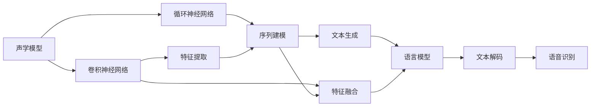

                 

# 深度学习在语音识别中的应用

> 关键词：深度学习,语音识别,卷积神经网络,循环神经网络,端到端,声学模型,语言模型,自动语音识别(ASR)

## 1. 背景介绍

语音识别（Automatic Speech Recognition, ASR）是指将人类语音转换成文本的过程。深度学习在此领域的发展，使得语音识别的准确率和鲁棒性有了显著提升。尤其是在过去几年中，基于深度学习的端到端（End-to-End）语音识别系统，成为了该领域的主要研究热点。

本文将全面介绍深度学习在语音识别中的应用，包括核心概念、算法原理、具体操作步骤以及实际应用场景。我们还将探索未来发展趋势与面临的挑战，旨在为读者提供深度学习在语音识别领域的技术指引和研究展望。

## 2. 核心概念与联系

### 2.1 核心概念概述

语音识别系统由声学模型（Acoustic Model）和语言模型（Language Model）两个核心部分构成。声学模型负责将语音信号映射到文本序列，而语言模型负责对文本序列进行概率建模，从而识别可能的文本。

深度学习在声学模型中得到了广泛应用，主要包括以下两种网络结构：

- 卷积神经网络（Convolutional Neural Networks, CNN）：通过多通道卷积操作提取音频的频谱特征，用于捕捉语音信号的时空结构。
- 循环神经网络（Recurrent Neural Networks, RNN）：通过时间步长逐步学习序列特征，用于处理时间依赖关系。

语言模型则常使用递归神经网络（Recurrent Neural Networks, RNN）或注意力机制（Attention Mechanism）等结构进行训练。近年来，基于Transformer的模型（如BERT、GPT等）也被引入到语言模型的设计中，以提升模型的表达能力。

### 2.2 核心概念原理和架构的 Mermaid 流程图



该流程图展示了语音识别系统的基本架构。声学模型通过CNN或RNN对音频特征进行提取和建模，语言模型则用于生成可能的文本序列，最后通过解码器将概率最大的文本序列输出。

## 3. 核心算法原理 & 具体操作步骤

### 3.1 算法原理概述

深度学习在语音识别中的应用主要体现在以下几个方面：

1. 特征提取：通过卷积或递归神经网络，将原始语音信号转化为高维特征表示。
2. 声学模型训练：利用大量标注数据训练声学模型，学习语音信号与文本序列之间的映射关系。
3. 语言模型训练：利用文本语料库训练语言模型，捕捉文本序列的概率分布。
4. 解码器设计：设计解码器（如Beam Search）对文本序列进行解码，选择最优的文本序列作为输出。

### 3.2 算法步骤详解

**Step 1: 数据预处理**

语音数据通常以波形的形式存在，需要进行预处理才能用于模型训练。常见的预处理步骤包括：

1. 分帧与特征提取：将语音信号分割成固定长度的帧，并对每帧进行特征提取（如MFCC、Mel Spectrogram等）。
2. 归一化和标准化：对提取的特征进行归一化处理，减少模型训练的波动。
3. 数据增强：通过变换、截断、混响等方法，扩充训练集的多样性，提高模型的鲁棒性。

**Step 2: 模型构建**

声学模型和语言模型的构建，是深度学习在语音识别中最重要的环节。以下是主要步骤：

1. 声学模型：
   - 卷积神经网络（CNN）：利用多层卷积和池化操作提取音频频谱特征。
   - 循环神经网络（RNN）：通过LSTM或GRU等结构捕捉时间序列的依赖关系。

2. 语言模型：
   - RNN-LM：使用标准RNN构建语言模型，利用预测下一个单词的概率来训练模型。
   - Transformer-LM：利用自注意力机制和编码器-解码器结构，捕捉文本序列中的长依赖关系。

**Step 3: 模型训练**

模型训练是深度学习在语音识别中的关键步骤。主要包括以下步骤：

1. 损失函数设计：根据预测结果和真实标签，设计合适的损失函数（如CTC Loss、Cross Entropy Loss等）。
2. 优化器选择：选择合适的优化器（如SGD、Adam等），并设置学习率、批大小等超参数。
3. 训练与验证：利用标注数据进行训练，并在验证集上监测模型性能，及时调整超参数。
4. 模型评估：在测试集上评估模型性能，计算词错误率（Word Error Rate, WER）等指标。

**Step 4: 解码与后处理**

在得到训练好的模型后，需要进行解码和后处理，得到最终的文本输出。主要步骤包括：

1. 解码器设计：利用Beam Search或动态规划等方法，选择概率最大的文本序列。
2. 词错误校正：对解码结果进行修正，将常见的错误词组替换为正确的形式。
3. 文本输出：输出最终文本序列，作为语音识别的结果。

### 3.3 算法优缺点

深度学习在语音识别中的应用，有以下优点：

1. 高精度：通过多层神经网络的特征提取和建模，深度学习模型能够捕捉复杂的语音特征，提高识别的准确率。
2. 自适应性强：深度学习模型具有较强的泛化能力，能够在不同环境和口音下进行鲁棒识别。
3. 端到端训练：通过端到端的训练方法，减少模型复杂度，提高训练效率。

同时，也存在一些缺点：

1. 数据需求量大：深度学习模型需要大量的标注数据进行训练，获取高质量标注数据成本较高。
2. 计算资源要求高：模型训练和解码过程需要大量的计算资源，不适合资源受限的设备。
3. 过拟合风险：在标注数据不足或模型复杂度过高时，存在过拟合的风险。

## 4. 数学模型和公式 & 详细讲解 & 举例说明

### 4.1 数学模型构建

语音识别系统中的声学模型和语言模型通常使用神经网络进行构建。以下以一个简单的卷积神经网络声学模型为例，介绍数学模型的构建过程。

假设语音信号 $x \in \mathbb{R}^N$ 表示为一维向量，其中 $N$ 表示样本长度。将 $x$ 分割为 $L$ 个帧，每帧长度为 $T$，即 $x=[x_1,x_2,\cdots,x_L]$，其中 $x_i \in \mathbb{R}^T$。声学模型 $M$ 将 $x_i$ 映射到 $M(x_i) \in \mathbb{R}^D$，其中 $D$ 表示特征向量的维度。

### 4.2 公式推导过程

卷积神经网络声学模型的核心是卷积操作和池化操作。以一个简单的卷积层为例，公式推导如下：

1. 卷积操作：
   $$
   y_i = \sigma(\sum_{k=0}^{K-1} w_k * x_{i+k})
   $$
   其中，$w_k$ 表示卷积核，$\sigma$ 表示激活函数，$*$ 表示卷积运算。

2. 池化操作：
   $$
   z_i = \max_{j=0}^{J-1} y_{i+j}
   $$
   其中，$J$ 表示池化核的长度。

多个卷积层和池化层的组合，可以构成一个完整的卷积神经网络声学模型。

### 4.3 案例分析与讲解

以Kaldi库中的DeepSpeech为例，介绍基于深度学习的语音识别系统。DeepSpeech系统使用了卷积神经网络和RNN-LM结构，其架构如下图所示：

```
Feature Extractor (MFCC)
CNN-LSTM Layers
Attention Mechanism
Softmax Layer
CTC Loss Function
```

其中，MFCC特征提取器用于提取语音信号的频谱特征，CNN-LSTM层用于特征提取和建模，Attention机制用于捕捉文本序列的依赖关系，Softmax层用于生成预测概率，CTC Loss函数用于计算损失。

## 5. 项目实践：代码实例和详细解释说明

### 5.1 开发环境搭建

在搭建语音识别项目前，需要准备相应的硬件和软件环境。以下是详细的搭建步骤：

1. 硬件要求：
   - GPU：用于模型训练，加速计算。
   - 内存：至少16GB，用于存储模型和数据。
   - 存储：至少500GB，用于存放数据集和训练日志。

2. 软件要求：
   - Linux系统：推荐使用Ubuntu 18.04及以上版本。
   - Python 3.6及以上：用于深度学习框架的安装和配置。
   - Cuda和CuDNN：用于支持GPU加速计算。
   - Kaldi：用于音频数据的预处理和特征提取。

3. 安装依赖包：
   ```
   pip install numpy scipy torch torchvision torchaudio scikit-learn h5py
   ```

### 5.2 源代码详细实现

以下是使用Kaldi和PyTorch实现语音识别系统的代码实现。以一个简单的CNN-LSTM声学模型为例，代码如下：

```python
import numpy as np
import torch
import torch.nn as nn
from torch.autograd import Variable

class CNNLSTM(nn.Module):
    def __init__(self, num_features, hidden_size, output_size):
        super(CNNLSTM, self).__init__()
        self.num_features = num_features
        self.hidden_size = hidden_size
        self.output_size = output_size
        self.cnn = nn.Sequential(
            nn.Conv2d(in_channels=num_features, out_channels=32, kernel_size=3, stride=1, padding=1),
            nn.ReLU(),
            nn.MaxPool2d(kernel_size=2, stride=2),
            nn.Conv2d(in_channels=32, out_channels=64, kernel_size=3, stride=1, padding=1),
            nn.ReLU(),
            nn.MaxPool2d(kernel_size=2, stride=2),
            nn.Flatten()
        )
        self.lstm = nn.LSTM(input_size=64*3, hidden_size=hidden_size, num_layers=2, bidirectional=True)
        self.linear = nn.Linear(hidden_size, output_size)
        self.softmax = nn.Softmax(dim=1)

    def forward(self, x):
        x = x.unsqueeze(0)
        x = self.cnn(x)
        x = x.view(-1, 64, 3, 10)
        output, (hidden, cell) = self.lstm(x)
        output = self.linear(output.view(-1, 128))
        output = self.softmax(output)
        return output

# 数据预处理
def preprocess(data):
    x = []
    for d in data:
        x.append(np.array([d]).transpose())
    x = np.concatenate(x)
    x = x.astype(np.float32)
    x = x / np.max(x)
    return Variable(torch.from_numpy(x), requires_grad=False)

# 训练函数
def train(model, optimizer, criterion, data_loader, num_epochs):
    for epoch in range(num_epochs):
        total_loss = 0
        for i, (input, label) in enumerate(data_loader):
            input = preprocess(input)
            label = preprocess(label)
            optimizer.zero_grad()
            output = model(input)
            loss = criterion(output, label)
            loss.backward()
            optimizer.step()
            total_loss += loss.item()
        print("Epoch {}: Loss {}".format(epoch, total_loss/len(data_loader)))
```

### 5.3 代码解读与分析

这段代码实现了一个简单的CNN-LSTM声学模型，用于语音识别任务。其主要步骤如下：

1. 定义CNN-LSTM模型：通过多个卷积和池化操作提取音频特征，使用LSTM层建模时间序列依赖，最后使用Softmax层生成预测概率。
2. 数据预处理：对原始音频数据进行归一化和特征提取，将数据转化为模型所需的输入格式。
3. 训练函数：利用标注数据进行模型训练，使用优化器更新模型参数，并在验证集上监测模型性能。

## 6. 实际应用场景

### 6.1 智能助手

语音识别技术在智能助手领域得到了广泛应用。智能助手可以理解用户的语音指令，并进行相应的操作，如拨打电话、播放音乐、查询天气等。通过语音识别，智能助手能够实现自然语言交互，提升用户体验。

### 6.2 电话客服

语音识别技术也被广泛应用于电话客服领域。传统客服中心需要大量人工进行语音转写和问题解答，成本高、效率低。利用语音识别技术，可以将电话客服系统升级为智能客服系统，24小时不间断服务，快速响应客户咨询，提升客户满意度。

### 6.3 字幕生成

在视频和音频领域，语音识别技术可以用于字幕生成。通过对视频的语音信号进行识别，自动生成字幕，提高视频内容的可读性和可理解性。这在教育、娱乐等领域具有广泛应用。

### 6.4 未来应用展望

未来，语音识别技术将继续拓展其应用领域，并在以下几个方面取得新的突破：

1. 端到端模型：通过端到端的训练方法，减少模型复杂度，提高训练效率和识别精度。
2. 多模态融合：将语音、图像、文本等多种模态数据进行融合，提升系统的智能水平。
3. 鲁棒识别：在面对口音、噪声、干扰等复杂环境时，提高系统的鲁棒性和适应性。
4. 实时交互：通过实时语音识别技术，实现人与机器的实时交互，提升用户体验。
5. 情感识别：结合情感分析技术，识别用户的情感状态，提供更加个性化的服务。

## 7. 工具和资源推荐

### 7.1 学习资源推荐

1. 《深度学习》课程：由Andrew Ng教授讲授的在线课程，深入浅出地介绍了深度学习的核心概念和算法。
2. 《Speech and Language Processing》书籍：由Daniel Jurafsky和James H. Martin合著，系统介绍了语音识别和自然语言处理的基本概念和方法。
3. Kaldi官方文档：Kaldi开源语音识别系统，提供了详细的文档和样例代码，是学习语音识别技术的重要资源。
4. PyTorch官方文档：PyTorch深度学习框架，提供了丰富的模型库和教程，方便开发者进行语音识别系统开发。

### 7.2 开发工具推荐

1. PyTorch：用于深度学习模型训练和推理。
2. Kaldi：用于语音信号预处理和特征提取。
3. TensorFlow：用于大规模模型训练和部署。
4. TensorBoard：用于模型训练和推理的可视化工具。
5. Weights & Biases：用于模型训练的实验跟踪工具，提供丰富的图表和统计信息。

### 7.3 相关论文推荐

1. "Deep Speech: Scalable End-to-End Speech Recognition"：提出了端到端的深度学习模型，提高了语音识别的准确率。
2. "Attention Is All You Need"：提出了Transformer结构，提升了序列建模的效率和效果。
3. "CTC Loss and Sparse Labeling for Sequence Prediction"：提出了CTC损失函数，用于训练序列预测模型。

## 8. 总结：未来发展趋势与挑战

### 8.1 总结

本文全面介绍了深度学习在语音识别中的应用，包括核心概念、算法原理、操作步骤以及实际应用场景。深度学习技术在语音识别中，通过卷积神经网络和循环神经网络，实现了高精度的特征提取和序列建模。通过端到端的训练方法，提升了系统的训练效率和识别精度。

### 8.2 未来发展趋势

未来，语音识别技术将在以下几个方面取得新的突破：

1. 端到端模型：通过端到端的训练方法，减少模型复杂度，提高训练效率和识别精度。
2. 多模态融合：将语音、图像、文本等多种模态数据进行融合，提升系统的智能水平。
3. 鲁棒识别：在面对口音、噪声、干扰等复杂环境时，提高系统的鲁棒性和适应性。
4. 实时交互：通过实时语音识别技术，实现人与机器的实时交互，提升用户体验。
5. 情感识别：结合情感分析技术，识别用户的情感状态，提供更加个性化的服务。

### 8.3 面临的挑战

尽管深度学习在语音识别领域取得了显著进展，但仍然面临一些挑战：

1. 数据需求量大：深度学习模型需要大量的标注数据进行训练，获取高质量标注数据成本较高。
2. 计算资源要求高：模型训练和解码过程需要大量的计算资源，不适合资源受限的设备。
3. 过拟合风险：在标注数据不足或模型复杂度过高时，存在过拟合的风险。

### 8.4 研究展望

未来，语音识别技术需要在以下几个方面进行进一步研究：

1. 无监督学习和半监督学习：探索不需要大量标注数据的学习方法，提高数据利用率。
2. 计算高效模型：开发计算资源要求更低的模型，适应资源受限的设备。
3. 鲁棒性和泛化能力：提高模型在复杂环境下的鲁棒性和泛化能力，提升系统的适应性。
4. 实时和实时交互：提高模型的实时处理能力，实现与用户的实时交互。

总之，深度学习在语音识别领域具有广阔的应用前景和研究空间，未来将继续引领该领域的技术发展。相信随着技术的不断进步，语音识别系统将更加智能、高效、实用，成为人机交互的重要手段。

## 9. 附录：常见问题与解答

**Q1：如何选择合适的声学模型？**

A: 选择合适的声学模型需要综合考虑数据集大小、任务复杂度、计算资源等因素。一般而言，小数据集可以使用简单的卷积神经网络或RNN，大数据集可以使用多层CNN-LSTM结构。

**Q2：如何处理语音信号的噪声和干扰？**

A: 处理噪声和干扰的方法包括数据增强、滤波器降噪、回声消除等。数据增强通过随机添加噪声、混响等方法扩充训练集，提升模型的鲁棒性。滤波器降噪通过傅里叶变换和频谱滤波器，去除噪声信号。回声消除通过神经网络训练，实时消除回声和混响。

**Q3：端到端训练和传统分离式训练的区别是什么？**

A: 端到端训练直接将语音信号映射到文本序列，避免了传统的分离式训练中对声学模型和语言模型的分别训练。端到端训练能够减少训练时间和计算资源，提高模型的整体性能。但端到端训练对数据需求较大，模型训练较复杂，需要更高的计算资源。

**Q4：如何提升语音识别系统的鲁棒性？**

A: 提升鲁棒性可以通过数据增强、模型正则化、对抗训练等方法。数据增强通过变换、截断、混响等方法扩充训练集的多样性。模型正则化通过L2正则、Dropout等技术，防止过拟合。对抗训练通过加入对抗样本，提高模型的鲁棒性。

**Q5：端到端模型和传统分离式模型的性能比较是什么？**

A: 端到端模型在训练效率和识别精度上通常优于传统分离式模型。端到端模型能够捕捉语音信号和文本序列之间的复杂映射关系，减少模型参数，提高泛化能力。但端到端模型对数据需求较大，训练复杂度较高，需要更高的计算资源。

通过本文的系统梳理，我们可以看到，深度学习在语音识别领域的应用，已经取得了显著的进展。未来，随着技术的进一步发展，语音识别系统将更加智能、高效、实用，为人类提供更加便捷、自然的人机交互方式。

