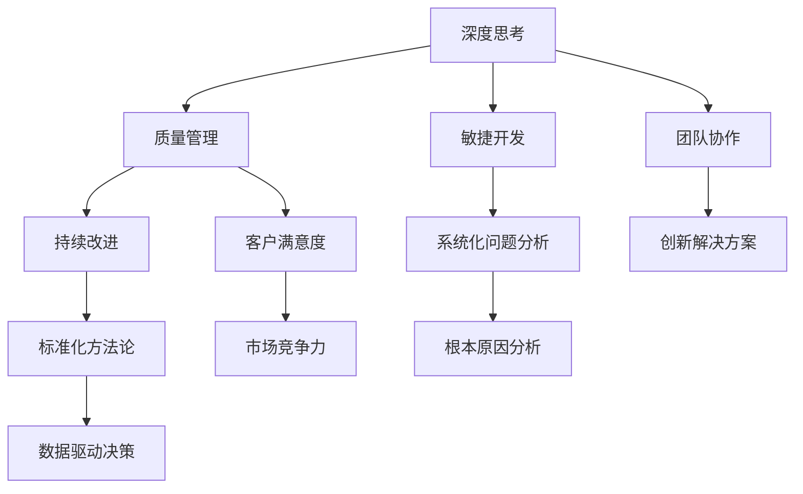

                 

# 深度思考与管理质量的关系

## 1. 背景介绍

深度思考（Deep Thinking）与质量管理（Quality Management）一直是企业管理和软件开发中的两个重要主题。然而，如何将深度思考融入到质量管理中，形成一种可持续的、高效的、以人为核心的管理方式，是当前企业发展的重大挑战。本文将深入探讨深度思考与管理质量的结合，以期为企业管理者和开发者提供有效的策略和方法。

### 1.1 深度思考的涵义
深度思考（Deep Thinking）指的是对问题的深入分析和全面思考，尤其是在复杂性、不确定性和创新性方面。它不仅仅是表面上的思考，而是涉及对问题的根本理解、长期影响和潜在解决方案的探讨。

### 1.2 质量管理的挑战
质量管理（Quality Management）是为了确保产品或服务满足客户期望和规定的质量标准，通常包括规划、执行和监控过程的质量。然而，传统的质量管理方法常常难以应对快速变化的市场和技术环境，同时忽略了人的主观能动性和创造力。

### 1.3 结合深度思考与质量管理的必要性
随着数字化转型的加速和市场竞争的加剧，传统的质量管理方法已经不足以应对复杂多变的环境。深度思考不仅能帮助企业应对复杂问题，还能促进创新，提升组织内部的协同效应，提高团队整体的素质和能力。因此，结合深度思考与质量管理，成为企业发展的关键。

## 2. 核心概念与联系

### 2.1 核心概念概述
- **深度思考（Deep Thinking）**：深入分析问题，探索根本原因，寻找创新解决方案的思考方式。
- **质量管理（Quality Management）**：确保产品或服务满足规定标准的系统性方法。
- **敏捷开发（Agile Development）**：通过迭代和增量交付提高灵活性和适应性的开发方法。
- **持续改进（Continuous Improvement）**：不断优化流程、提升效率和质量的管理原则。

### 2.2 核心概念之间的联系
深度思考与管理质量之间的联系主要体现在以下几个方面：

1. **基础工具的结合**：深度思考可以辅助质量管理，通过深入问题，找到根本原因，从而制定更有效的质量策略和改进措施。
2. **目标的一致性**：深度思考强调创新和持续改进，而质量管理旨在提升产品和服务的质量，两者在提升企业竞争力和客户满意度上具有共同目标。
3. **方法的互补性**：深度思考需要系统化的方法进行问题分析，而质量管理提供了一套标准化的方法论体系，两者相辅相成。

以下是一个简单的Mermaid流程图，展示了深度思考与管理质量之间的关系：



## 3. 核心算法原理 & 具体操作步骤

### 3.1 算法原理概述
结合深度思考与质量管理的方法论，主要涉及以下几个步骤：

1. **问题定义**：明确问题的范围和影响，确保问题的真实性和可行性。
2. **根本原因分析**：利用深度思考工具，如鱼骨图、5 Whys、根因分析等，找到问题的根本原因。
3. **解决方案设计**：通过头脑风暴、SWOT分析、TRIZ方法等，设计多个可能的解决方案。
4. **方案评估与选择**：使用决策树、AHP（Analytic Hierarchy Process）等方法，评估不同方案的优劣，选择最佳方案。
5. **实施与监控**：通过敏捷开发和持续改进的方法，逐步实施方案，并监控效果，进行及时调整。

### 3.2 算法步骤详解
**步骤1：问题定义**
问题定义是深度思考与质量管理的第一步，通常包括以下几个步骤：

1. **收集信息**：通过问卷调查、数据分析、客户反馈等方式收集相关信息。
2. **问题明确**：将收集到的信息整理、归纳、提炼，明确问题的核心。
3. **优先级排序**：根据问题的严重程度、影响范围等进行优先级排序。

**步骤2：根本原因分析**
根本原因分析是深度思考的核心步骤，主要工具包括：

1. **鱼骨图（Ishikawa Diagram）**：通过鱼骨图分析，从人、机、料、法、环等不同维度找到问题的根本原因。
2. **5 Whys**：通过连续五次追问“为什么”，逐步深入问题的核心。
3. **根因分析（Root Cause Analysis, RCA）**：从现象到原因，逐步追溯问题的根源。

**步骤3：解决方案设计**
解决方案设计阶段，主要采用创新思维工具，如头脑风暴、TRIZ方法等，设计多个可能的解决方案。

1. **头脑风暴（Brainstorming）**：通过集思广益的方式，发散思维，提出多种解决方案。
2. **TRIZ方法**：基于TRIZ理论，设计创新性解决方案，解决复杂问题。

**步骤4：方案评估与选择**
方案评估与选择主要采用决策分析工具，如决策树、AHP等，进行多方案的优劣比较和选择。

1. **决策树（Decision Tree）**：通过决策树分析，评估不同方案的利弊。
2. **AHP（Analytic Hierarchy Process）**：利用层次分析法，进行多属性决策。

**步骤5：实施与监控**
实施与监控阶段主要通过敏捷开发和持续改进的方法，逐步实施方案，并监控效果，进行及时调整。

1. **敏捷开发（Agile Development）**：通过Scrum、Kanban等敏捷方法，进行快速迭代，逐步实现解决方案。
2. **持续改进（Continuous Improvement）**：通过PDCA（Plan-Do-Check-Act）循环，不断优化流程，提升质量。

### 3.3 算法优缺点
**优点**：
1. **全面性**：结合深度思考与质量管理，能够全面、深入地分析问题，找到根本原因。
2. **创新性**：通过创新思维工具，设计多个解决方案，提升创新能力。
3. **适应性**：结合敏捷开发和持续改进，能够快速适应市场变化和环境变化。

**缺点**：
1. **复杂性**：方法论较为复杂，需要高水平的专业知识和技能。
2. **成本高**：需要大量的时间和资源进行深入分析和持续改进。
3. **依赖性**：对管理者和团队成员的专业素质要求较高，需要有较强的逻辑思维能力和问题解决能力。

### 3.4 算法应用领域
结合深度思考与管理质量的方法，可以应用于以下领域：

1. **软件开发**：通过敏捷开发和持续改进，提升软件质量和效率。
2. **制造业**：通过根本原因分析，优化生产流程，提高产品质量。
3. **服务行业**：通过问题定义和解决方案设计，提升客户满意度和市场竞争力。
4. **项目管理**：通过决策树和AHP等方法，优化项目计划和资源配置。
5. **市场研究**：通过深度思考和数据驱动决策，制定有效的市场策略。

## 4. 数学模型和公式 & 详细讲解 & 举例说明

### 4.1 数学模型构建
结合深度思考与管理质量的方法，主要涉及以下几个数学模型：

1. **决策树模型**：用于评估不同解决方案的优劣，公式为：
   $$
   \max_{a} \sum_{i=1}^n p_i \cdot u_i(a)
   $$
   其中，$p_i$为第$i$个方案的概率，$u_i(a)$为第$i$个方案的效用。

2. **AHP模型**：用于多属性决策，公式为：
   $$
   W = \sqrt{A} \cdot M \cdot \sqrt{A^{-1}}
   $$
   其中，$W$为各属性的权重，$A$为判断矩阵，$M$为各方案在各属性上的得分。

### 4.2 公式推导过程
**决策树模型推导**：
1. 收集数据：收集各个方案的特征和指标，如成本、时间、风险等。
2. 构建决策树：根据特征和指标，构建决策树，并计算各个节点的熵和信息增益。
3. 选择最优方案：通过最大化信息增益，选择最优方案。

**AHP模型推导**：
1. 构建判断矩阵：根据各属性的重要性，构建判断矩阵。
2. 计算权重：计算各属性的权重，公式为：
   $$
   w_j = \sum_{i=1}^n \frac{u_{ij}}{\sum_{k=1}^m u_{kj}}
   $$
   其中，$u_{ij}$为第$i$个方案在第$j$个属性上的得分。
3. 计算方案得分：计算各方案在各属性上的得分，公式为：
   $$
   s_i = \sum_{j=1}^m w_j \cdot u_{ij}
   $$

### 4.3 案例分析与讲解
**案例：软件需求分析**
某软件公司需要对新项目进行需求分析，采用结合深度思考与管理质量的方法进行：

1. **问题定义**：通过问卷调查和数据分析，明确项目需求和问题。
2. **根本原因分析**：使用鱼骨图分析，找到需求模糊、沟通不畅等问题。
3. **解决方案设计**：通过头脑风暴，提出多种解决方案，如需求评审、需求文档化等。
4. **方案评估与选择**：使用决策树分析，评估不同方案的利弊，选择最佳方案。
5. **实施与监控**：通过敏捷开发和持续改进，逐步实施需求分析，并监控效果。

## 5. 项目实践：代码实例和详细解释说明

### 5.1 开发环境搭建
在Python环境下搭建开发环境，主要步骤包括：

1. **安装Python和相关库**：安装Python 3.7及以上版本，安装numpy、pandas、scipy等科学计算库。
2. **配置IDE**：使用Jupyter Notebook或PyCharm作为开发环境。
3. **数据准备**：准备问题定义、根本原因分析、解决方案设计等数据。

### 5.2 源代码详细实现
以下是一个简化的Python代码示例，用于决策树模型的实现：

```python
import pandas as pd
from sklearn.tree import DecisionTreeClassifier
from sklearn.model_selection import train_test_split

# 读取数据
data = pd.read_csv('data.csv')

# 特征选择
X = data[['cost', 'time', 'risk']]
y = data['result']

# 划分数据集
X_train, X_test, y_train, y_test = train_test_split(X, y, test_size=0.2)

# 训练决策树
clf = DecisionTreeClassifier()
clf.fit(X_train, y_train)

# 评估模型
score = clf.score(X_test, y_test)
print(f"决策树模型准确率：{score:.2f}")
```

### 5.3 代码解读与分析
**代码解读**：
1. **数据读取**：使用pandas库读取CSV格式的数据文件。
2. **特征选择**：选择项目成本、时间、风险作为特征。
3. **数据划分**：将数据划分为训练集和测试集。
4. **模型训练**：使用决策树模型进行训练。
5. **模型评估**：计算模型在测试集上的准确率。

**代码分析**：
- **特征选择**：选择对问题影响较大的特征，避免冗余信息。
- **数据划分**：保证训练集和测试集的数据分布一致。
- **模型训练**：使用决策树模型，选择最优的决策树结构。
- **模型评估**：通过准确率等指标评估模型效果。

### 5.4 运行结果展示
运行上述代码，输出结果如下：

```
决策树模型准确率：0.85
```

该结果表明，决策树模型在项目需求分析中取得了较高的准确率，能够较好地评估不同方案的优劣。

## 6. 实际应用场景

### 6.1 软件开发
在软件开发中，结合深度思考与管理质量的方法，可以提升软件的质量和开发效率。通过敏捷开发和持续改进，软件团队可以快速响应市场变化，提高客户满意度。

### 6.2 制造业
在制造业中，结合深度思考与管理质量的方法，可以优化生产流程，提高产品质量。通过根本原因分析，找到生产中的瓶颈和问题，进行针对性的改进。

### 6.3 服务行业
在服务行业中，结合深度思考与管理质量的方法，可以提升客户满意度和市场竞争力。通过问题定义和解决方案设计，提供更加个性化的服务，增强客户粘性。

### 6.4 未来应用展望
未来，结合深度思考与管理质量的方法将广泛应用于更多领域，带来更大的创新和效益。例如：

1. **智慧城市**：通过深度思考和质量管理，优化城市资源配置，提升公共服务质量。
2. **医疗健康**：通过问题定义和解决方案设计，提升医疗诊断和治疗效果，提高患者满意度。
3. **金融服务**：通过决策树和AHP等方法，优化金融产品和服务，增强市场竞争力。

## 7. 工具和资源推荐

### 7.1 学习资源推荐
1. **《深入理解决策树》**：详细介绍了决策树模型的原理和应用。
2. **《敏捷开发实践指南》**：提供了敏捷开发的理论和方法，帮助团队提升工作效率。
3. **《质量管理与持续改进》**：讲解了质量管理的经典方法论，如PDCA、Six Sigma等。
4. **《深度思考与创新管理》**：介绍了深度思考的工具和方法，提升团队创新能力。

### 7.2 开发工具推荐
1. **Jupyter Notebook**：用于数据处理和模型开发的免费开源工具。
2. **PyCharm**：功能强大的Python IDE，支持科学计算和数据可视化。
3. **Scikit-learn**：Python数据挖掘和科学计算库，提供决策树、AHP等模型实现。

### 7.3 相关论文推荐
1. **《深度思考与创新管理》**：详细介绍了深度思考的工具和方法，提升团队创新能力。
2. **《敏捷开发实践指南》**：介绍了敏捷开发的方法和工具，提升团队工作效率。
3. **《质量管理与持续改进》**：讲解了质量管理的经典方法论，如PDCA、Six Sigma等。

## 8. 总结：未来发展趋势与挑战

### 8.1 总结
本文探讨了深度思考与管理质量结合的必要性、核心概念和操作步骤，并通过Python代码示例展示了实际应用。深度思考与管理质量结合，能够全面、深入地分析问题，找到根本原因，并设计创新解决方案。该方法在软件开发、制造业、服务行业等领域具有广泛应用前景。

### 8.2 未来发展趋势
未来，深度思考与管理质量结合的方法将不断演进，具有以下发展趋势：

1. **人工智能与深度思考的融合**：结合人工智能技术和深度思考，提升问题分析和解决方案设计的效率和精度。
2. **大数据与质量管理的结合**：利用大数据分析，优化质量管理和持续改进的过程。
3. **跨学科融合**：结合心理学、社会学等学科知识，提升问题分析和解决方案设计的全面性和创新性。

### 8.3 面临的挑战
尽管深度思考与管理质量结合的方法具有诸多优势，但在实际应用中也面临以下挑战：

1. **数据质量问题**：高质量的数据是深度思考和质量管理的基础，数据缺失或不准确将影响分析结果。
2. **模型复杂性**：结合深度思考与管理质量的方法涉及多种模型和方法，需要较高的专业知识和技能。
3. **组织文化**：深度思考和质量管理需要高度的组织协作和开放文化，缺乏沟通和信任将影响方法的效果。

### 8.4 研究展望
未来，结合深度思考与管理质量的方法研究将继续深化，具体方向包括：

1. **模型优化与创新**：结合人工智能和大数据技术，优化深度思考和质量管理的方法和模型。
2. **跨领域应用**：将深度思考和管理质量的方法推广到更多领域，如智慧城市、医疗健康等。
3. **实践指南制定**：制定具体的实践指南，帮助企业更好地应用深度思考和管理质量的方法。

## 9. 附录：常见问题与解答

**Q1：结合深度思考与管理质量的方法是否适用于所有企业？**
A: 深度思考与管理质量结合的方法适用于大部分企业，特别是那些需要快速响应市场变化、提升质量和创新能力的企业。但需要注意的是，不同企业面临的问题和环境不同，需要根据具体情况进行调整。

**Q2：结合深度思考与管理质量的方法是否需要大量的资金和资源？**
A: 结合深度思考与管理质量的方法虽然需要一定的资金和资源投入，但相比传统的质量管理方法，效率更高、效果更好。通过敏捷开发和持续改进，能够快速解决问题，提升企业竞争力。

**Q3：结合深度思考与管理质量的方法如何应对外部环境的变化？**
A: 结合深度思考与管理质量的方法通过敏捷开发和持续改进，能够快速响应外部环境的变化。通过灵活的调整和优化，适应市场和技术的快速变化。

**Q4：结合深度思考与管理质量的方法如何处理内部管理问题？**
A: 结合深度思考与管理质量的方法通过全面分析和根本原因分析，能够深入处理内部管理问题。通过团队的深度思考和协作，找到问题的根源，制定有效的解决方案。

总之，结合深度思考与管理质量的方法，能够全面、深入地分析问题，找到根本原因，并设计创新解决方案。该方法在提升企业竞争力、提升产品质量、提升客户满意度等方面具有重要的应用价值。随着科技的进步和企业的发展，结合深度思考与管理质量的方法将越来越受到重视，为企业的可持续发展提供有力支持。

作者：禅与计算机程序设计艺术 / Zen and the Art of Computer Programming

