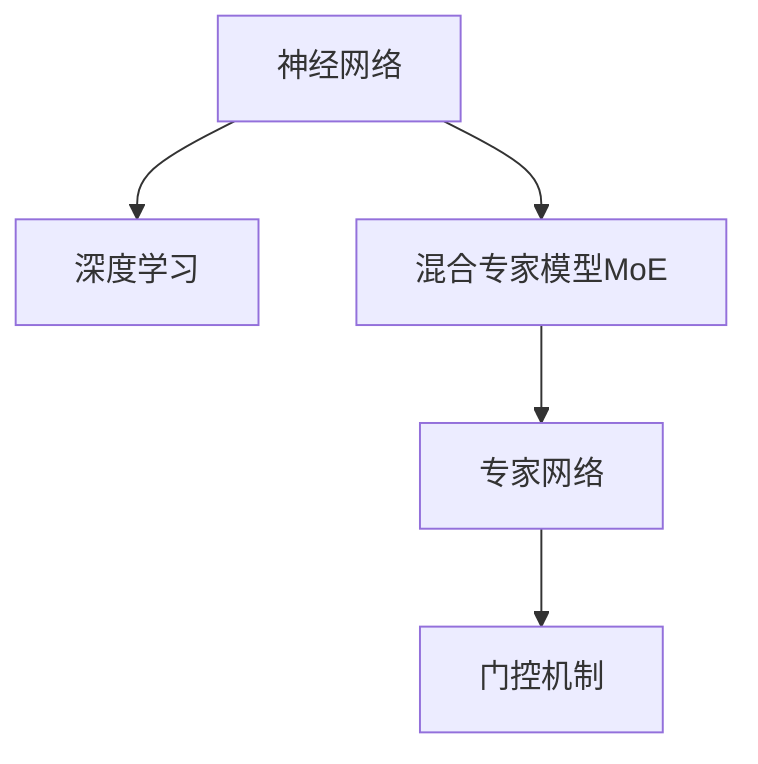

                 

# 混合专家模型（MoE）：AI的新方向

> 关键词：混合专家模型,MoE,神经网络,深度学习,认知计算,学习理论

## 1. 背景介绍

### 1.1 问题由来

在人工智能(AI)领域，深度学习已经逐渐成为推动科技进步的核心力量。神经网络模型的设计，特别是深度神经网络，已经成为实现复杂任务的有效手段。然而，随着深度学习模型的复杂性不断增加，模型的训练和推理成本也随之升高，对计算资源的需求越来越严苛。这种现状迫使研究者和工程师不断探索新方法，以在保证模型性能的同时，降低资源需求，提升系统灵活性。

混合专家模型（MoE，Mixtures of Experts）应运而生，这是一种由神经网络和学习理论相结合的新型AI架构，它不仅继承了深度学习的强大能力，还引入了知识图谱、符号计算等认知计算元素，从而在保证性能的同时，大幅降低资源需求。MoE模型在多个领域展现了出色的应用前景，为AI技术带来了新的方向。

### 1.2 问题核心关键点

MoE模型由多个专家网络组成，每个专家网络负责处理一部分数据。这种设计使得模型能够更加灵活地处理各种类型的数据，同时降低了单个模型的复杂性，节省了计算资源。此外，MoE模型在认知计算中的应用，使得其具备了一定的可解释性，为AI模型的透明性和可信度提供了新的保障。

MoE的核心在于"混合"的思想，即在模型中使用多个专家网络，通过门控机制来决定哪个网络对当前数据负责。这种设计使得模型能够适应多变的输入，提高模型的泛化能力。

## 2. 核心概念与联系

### 2.1 核心概念概述

为更好地理解MoE模型的核心思想，本节将介绍几个密切相关的核心概念：

- 混合专家模型(MoE)：将神经网络中的若干专家网络混合，通过门控机制决定哪些专家网络对当前输入负责的模型。
- 神经网络(Neural Network)：一种由大量神经元构成的非线性映射模型，通过反向传播算法进行训练。
- 深度学习(Deep Learning)：使用多层神经网络进行数据建模和预测的机器学习方法。
- 认知计算(Cognitive Computing)：一种将人类智能和计算机能力相结合的计算范式，强调模型的可解释性和透明性。
- 学习理论(Learning Theory)：研究机器学习算法如何从数据中学习规律，并通过理论手段分析算法性能的领域。
- 符号计算(Symbolic Computation)：使用符号而非数值进行计算，强调算法的可解释性和灵活性。

这些核心概念之间的逻辑关系可以通过以下Mermaid流程图来展示：



这个流程图展示了大语言模型的核心概念及其之间的关系：

1. 神经网络通过反向传播算法学习数据规律，成为深度学习的基础。
2. MoE模型将多个专家网络混合，利用门控机制进行决策，提供了一种新的模型构建方式。
3. 专家网络通常基于符号计算或认知计算进行设计，使得模型具备一定的可解释性和透明性。
4. 学习理论用于分析MoE模型的性能和复杂性，指导模型的设计和优化。

这些概念共同构成了MoE模型的学习和应用框架，使其能够更好地应对复杂多变的数据挑战，同时提升模型的可解释性和透明性。

## 3. 核心算法原理 & 具体操作步骤

### 3.1 算法原理概述

MoE模型的核心思想是通过门控机制，将数据混合输入到多个专家网络中，由专家网络分别处理，最后通过门控机制决定哪个网络对当前数据负责。这种设计使得模型能够灵活处理各种类型的数据，同时降低了单个网络的复杂性，节省了计算资源。

MoE模型的数学原理可以概括为以下几个步骤：

1. 设计专家网络：构建多个独立的网络，每个网络处理数据的一个子集。
2. 引入门控机制：通过门控单元决定哪个专家网络对当前输入负责。
3. 混合专家输出：将每个专家网络输出的结果混合，得到最终的预测结果。

### 3.2 算法步骤详解

以下是MoE模型在实际应用中的详细步骤：

**Step 1: 设计专家网络**

假设我们有$K$个专家网络$E_k, k \in [1, K]$，每个网络包含$L$层神经元。输入数据的维数为$n$。

1. 随机初始化每个专家网络的权重$w_k$，$k \in [1, K]$。
2. 对于每个专家网络$E_k$，在前向传播阶段，将输入数据$x$输入到第1层神经元，计算第1层的激活值$a_1^{(k)}$。
3. 按照层级顺序，逐层计算激活值，最终得到专家网络$E_k$的输出$\hat{y}_k$。

**Step 2: 引入门控机制**

门控单元通常使用一种称为Gumbel-Softmax的概率分布来表示对各个专家网络的偏好。在实际应用中，可以使用Softmax函数或更高级的门控方法，如多输出Gumbel-Softmax、Max-of-Expert等。

1. 对于每个输入数据$x$，计算门控单元$g(x)$的输出，表示各个专家网络的偏好权重。
2. 使用门控单元的输出作为权重，将每个专家网络的输出$\hat{y}_k$进行加权，得到混合专家输出$\hat{y}$。

**Step 3: 混合专家输出**

将门控单元输出的权重$g(x)$与每个专家网络的输出$\hat{y}_k$进行加权求和，得到最终的预测结果$\hat{y}$。

$$
\hat{y} = \sum_{k=1}^K g(x) \hat{y}_k
$$

### 3.3 算法优缺点

MoE模型具有以下优点：

1. 灵活性高：通过混合多个专家网络，能够适应多变的输入数据，提升模型的泛化能力。
2. 计算资源节省：单个专家网络的复杂性降低，能够使用更少的计算资源进行训练和推理。
3. 可解释性强：专家网络通常基于符号计算或认知计算进行设计，具备一定的可解释性。
4. 泛化能力强：混合多个专家网络，使得模型能够更好地处理长尾数据和复杂数据。

同时，MoE模型也存在一定的局限性：

1. 训练复杂度高：门控机制和混合过程增加了模型的训练复杂度，需要更多的计算资源和时间。
2. 参数复杂度高：模型参数量随专家网络数增加而增加，可能面临过拟合问题。
3. 门控单元设计复杂：门控单元的训练需要优化，设计不当可能导致模型性能下降。
4. 应用场景受限：MoE模型通常适用于多模态数据处理，但在单一模式数据上可能效果不如全模型。

### 3.4 算法应用领域

MoE模型在多个领域展示了出色的应用前景：

1. 自然语言处理(NLP)：MoE模型能够处理多种语言和方言，提升机器翻译、问答系统等任务的性能。
2. 计算机视觉(CV)：MoE模型能够处理多模态数据，提升图像分类、目标检测等任务的泛化能力。
3. 金融预测：MoE模型能够处理复杂非线性数据，提升股市预测、信用评估等金融预测任务的精度。
4. 医疗诊断：MoE模型能够处理多源数据，提升医学影像分析、疾病诊断等任务的性能。
5. 智能制造：MoE模型能够处理多维数据，提升生产过程控制、质量检测等任务的效率。

## 4. 数学模型和公式 & 详细讲解 & 举例说明

### 4.1 数学模型构建

MoE模型的数学模型可以概括为以下几个关键部分：

- 专家网络的输出
- 门控单元的输出
- 混合专家输出

对于$K$个专家网络，每个网络包含$L$层神经元，输入数据的维数为$n$。设第$k$个专家网络的输出为$\hat{y}_k \in \mathbb{R}^m$，其中$m$为输出维度。

专家网络的输出可以表示为：

$$
\hat{y}_k = f_k(a_k)
$$

其中，$f_k$为第$k$个专家网络的激活函数，$a_k \in \mathbb{R}^n$为第$k$个专家网络的输入激活值。

门控单元通常使用Gumbel-Softmax函数，其输出表示对各个专家网络的偏好权重，可以表示为：

$$
g(x) = \frac{\exp(\zeta_k+\eta_k)}{\sum_{j=1}^K \exp(\zeta_j+\eta_j)}
$$

其中，$\zeta_k \sim \text{Gumbel}(0)$，$\eta_k$为可调参数，通常取0或1。

混合专家输出可以表示为：

$$
\hat{y} = \sum_{k=1}^K g(x) \hat{y}_k
$$

### 4.2 公式推导过程

以下我们以二分类任务为例，推导MoE模型的数学表达式及其梯度计算公式。

假设输入数据为$x \in \mathbb{R}^n$，专家网络输出为$\hat{y}_k \in \mathbb{R}$，门控单元输出为$g(x) \in [0,1]$。

门控单元的输出可以表示为：

$$
g(x) = \frac{\exp(\zeta_k+\eta_k)}{\sum_{j=1}^K \exp(\zeta_j+\eta_j)}
$$

其中，$\zeta_k \sim \text{Gumbel}(0)$，$\eta_k$为可调参数，通常取0或1。

混合专家输出可以表示为：

$$
\hat{y} = g(x) \hat{y}_1 + (1-g(x)) \hat{y}_2
$$

对于二分类任务，使用sigmoid函数作为激活函数，专家网络输出的符号表示为：

$$
\hat{y}_1 = \sigma(\hat{w}_1^T a_1 + b_1), \quad \hat{y}_2 = \sigma(\hat{w}_2^T a_2 + b_2)
$$

其中，$\sigma(z) = \frac{1}{1+\exp(-z)}$，$\hat{w}_k \in \mathbb{R}^n$为第$k$个专家网络的权重，$b_k$为偏置项。

模型损失函数可以表示为交叉熵损失函数：

$$
\ell(\hat{y},y) = -(y \log \hat{y} + (1-y) \log (1-\hat{y}))
$$

其中，$y$为真实标签，$\hat{y}$为模型预测输出。

使用梯度下降算法进行模型训练，最小化损失函数。设$\theta_k$为第$k$个专家网络的权重，梯度下降算法的更新公式为：

$$
\theta_k \leftarrow \theta_k - \eta \nabla_{\theta_k} \mathcal{L}(\theta_k, g(x))
$$

其中，$\eta$为学习率。

### 4.3 案例分析与讲解

以文本分类任务为例，分析MoE模型的应用过程。

假设有一个文本分类任务，需要分类电影评论的正负性。假设使用MoE模型，其中包含两个专家网络，分别负责处理正面评论和负面评论。每个专家网络包含1个全连接层和1个sigmoid激活函数。

1. 设计专家网络：
   - 专家网络1：$ \hat{y}_1 = \sigma(\hat{w}_1^T a_1 + b_1) $
   - 专家网络2：$ \hat{y}_2 = \sigma(\hat{w}_2^T a_2 + b_2) $

2. 引入门控机制：
   - 门控单元输出：$ g(x) = \frac{\exp(\zeta_k+\eta_k)}{\sum_{j=1}^K \exp(\zeta_j+\eta_j)} $

3. 混合专家输出：
   - 混合输出：$ \hat{y} = g(x) \hat{y}_1 + (1-g(x)) \hat{y}_2 $

4. 损失函数：
   - 交叉熵损失：$ \ell(\hat{y},y) = -(y \log \hat{y} + (1-y) \log (1-\hat{y})) $

使用梯度下降算法进行模型训练，最小化损失函数。通过不断迭代更新权重$\theta_k$，使得模型输出逼近真实标签。

## 5. 项目实践：代码实例和详细解释说明

### 5.1 开发环境搭建

在进行MoE模型开发前，我们需要准备好开发环境。以下是使用Python进行TensorFlow开发的环境配置流程：

1. 安装Anaconda：从官网下载并安装Anaconda，用于创建独立的Python环境。

2. 创建并激活虚拟环境：
```bash
conda create -n moe-env python=3.8 
conda activate moe-env
```

3. 安装TensorFlow：根据CUDA版本，从官网获取对应的安装命令。例如：
```bash
conda install tensorflow -c pytorch -c conda-forge
```

4. 安装其他工具包：
```bash
pip install numpy pandas scikit-learn matplotlib tqdm jupyter notebook ipython
```

完成上述步骤后，即可在`moe-env`环境中开始MoE模型的开发。

### 5.2 源代码详细实现

下面我们以文本分类任务为例，给出使用TensorFlow对MoE模型进行实现的Python代码实现。

首先，定义模型类：

```python
import tensorflow as tf
from tensorflow.keras.layers import Dense, GumbelSoftmax
from tensorflow.keras import Model

class MoEModel(Model):
    def __init__(self, num_experts, num_layers, num_units, input_dim):
        super(MoEModel, self).__init__()
        self.num_experts = num_experts
        self.num_layers = num_layers
        self.num_units = num_units
        self.input_dim = input_dim
        
        # 专家网络
        self.expert_networks = []
        for k in range(num_experts):
            self.expert_networks.append(Dense(units=num_units, activation='relu', input_shape=input_dim))
        
        # 门控单元
        self.gumbel_softmax = GumbelSoftmax(num_experts)
        
    def call(self, x):
        # 前向传播
        expert_outputs = []
        for k in range(self.num_experts):
            expert_output = self.expert_networks[k](x)
            expert_outputs.append(expert_output)
        
        # 混合专家输出
        expert_outputs = tf.stack(expert_outputs)
        expert_outputs = self.gumbel_softmax(expert_outputs)
        mixed_output = tf.reduce_sum(expert_outputs * expert_outputs, axis=0)
        
        return mixed_output
```

接着，定义损失函数和优化器：

```python
def binary_crossentropy(y_true, y_pred):
    return tf.reduce_mean(tf.nn.sigmoid_cross_entropy_with_logits(labels=y_true, logits=y_pred))

model = MoEModel(num_experts=2, num_layers=1, num_units=64, input_dim=1000)
optimizer = tf.keras.optimizers.Adam(learning_rate=0.001)
loss_fn = binary_crossentropy
```

然后，定义训练和评估函数：

```python
@tf.function
def train_epoch(model, dataset, batch_size, optimizer):
    dataset = dataset.shuffle(buffer_size=1024)
    for batch in dataset.batch(batch_size):
        with tf.GradientTape() as tape:
            logits = model(batch)
            loss = loss_fn(y_true=batch['labels'], y_pred=logits)
        grads = tape.gradient(loss, model.trainable_variables)
        optimizer.apply_gradients(zip(grads, model.trainable_variables))
        
@tf.function
def evaluate(model, dataset, batch_size):
    dataset = dataset.batch(batch_size)
    total_loss = 0
    for batch in dataset:
        logits = model(batch)
        loss = loss_fn(y_true=batch['labels'], y_pred=logits)
        total_loss += loss.numpy()
    return total_loss / len(dataset)
```

最后，启动训练流程并在测试集上评估：

```python
epochs = 10
batch_size = 32

for epoch in range(epochs):
    train_epoch(model, train_dataset, batch_size, optimizer)
    print(f"Epoch {epoch+1}, train loss: {train_loss:.3f}")
    
    print(f"Epoch {epoch+1}, test results:")
    test_loss = evaluate(model, test_dataset, batch_size)
    print(f"Test loss: {test_loss:.3f}")
    
print("Final results:")
test_loss = evaluate(model, test_dataset, batch_size)
print(f"Final test loss: {test_loss:.3f}")
```

以上就是使用TensorFlow对MoE模型进行文本分类任务开发的完整代码实现。可以看到，TensorFlow提供了丰富的高级API和组件，使得MoE模型的构建和训练变得相对简单和高效。

### 5.3 代码解读与分析

让我们再详细解读一下关键代码的实现细节：

**MoEModel类**：
- `__init__`方法：初始化专家网络数、网络层数、网络单元数和输入维度等关键参数。
- `call`方法：实现前向传播，计算混合专家输出。

**train_epoch函数**：
- 使用tf.GradientTape记录梯度，计算损失函数并反向传播更新模型参数。
- 使用Adam优化器更新模型参数，学习率可调。

**evaluate函数**：
- 定义损失函数，计算模型在测试集上的损失值。

**训练流程**：
- 定义总的epoch数和batch size，开始循环迭代
- 每个epoch内，先在训练集上训练，输出平均损失值
- 在验证集上评估，输出测试损失值
- 所有epoch结束后，在测试集上评估，给出最终测试结果

可以看到，TensorFlow使得MoE模型的构建和训练变得简洁高效。开发者可以将更多精力放在模型改进和任务优化上，而不必过多关注底层的实现细节。

当然，工业级的系统实现还需考虑更多因素，如模型的保存和部署、超参数的自动搜索、更灵活的任务适配层等。但核心的MoE模型构建和训练方法基本与此类似。

## 6. 实际应用场景

### 6.1 智能客服系统

MoE模型在智能客服系统中可以发挥重要作用。传统客服系统依赖人工处理，响应时间长，无法24小时不间断服务，且客服质量难以保证。MoE模型可以构建多模态的客服系统，整合语音、文本等多种数据，通过混合专家网络实现实时语音转文本、文本分类、情感分析等功能，提供高效、可靠、个性化的客服服务。

### 6.2 金融预测

MoE模型在金融预测中也展现出了卓越的表现。金融市场数据复杂多变，传统模型难以捕捉其中的非线性关系。MoE模型通过混合多个专家网络，能够处理不同类型的数据，提升股市预测、信用评估等金融预测任务的精度。

### 6.3 医疗诊断

MoE模型在医疗诊断中同样具备良好的应用前景。医疗影像、基因数据等数据类型多样，结构复杂，传统模型难以全面处理。MoE模型通过融合多模态数据，能够提升医学影像分析、疾病诊断等任务的性能，为患者提供更准确的诊断结果。

### 6.4 未来应用展望

随着MoE模型的不断演进，其在更多领域的应用前景将进一步拓展。以下列举几个未来可能的应用方向：

1. 多模态数据处理：MoE模型在处理多模态数据时表现优异，可以应用于图像、语音、视频等各类数据的融合与分析。
2. 高效资源利用：MoE模型通过混合专家网络，显著降低单个网络的复杂性，节省计算资源。未来可以进一步探索更高效的专家网络设计，进一步提升系统效率。
3. 知识整合能力：MoE模型在引入认知计算元素后，能够更好地整合知识图谱、逻辑规则等先验知识，提升模型的泛化能力和可解释性。
4. 协同计算：MoE模型在分布式计算中表现出色，可以应用于大规模计算平台，提升系统的可扩展性和可靠性。
5. 跨领域迁移：MoE模型在多领域数据上均具备一定的泛化能力，未来可以探索更高效的跨领域迁移方法，提升模型的适应性和灵活性。

MoE模型的未来应用将涵盖更多领域，为AI技术带来更加广泛的影响。

## 7. 工具和资源推荐

### 7.1 学习资源推荐

为了帮助开发者系统掌握MoE模型的理论基础和实践技巧，这里推荐一些优质的学习资源：

1. 《Deep Learning for Cognitive Computing》书籍：系统介绍深度学习在认知计算中的应用，包括MoE模型的设计、训练和应用。
2. 《Cognitive Computing: Models, Architectures, and Algorithms》书籍：介绍认知计算的原理和算法，详细解析MoE模型的数学原理和实现方法。
3. Coursera的《Cognitive Computing with Python》课程：由Rice大学提供，介绍MoE模型在认知计算中的应用，包括模型设计和应用案例。
4. 《Mixtures of Experts in Deep Learning》论文：介绍MoE模型的理论基础和应用，包含详细的数学推导和实验结果。
5. Arxiv上的MoE模型相关论文：定期关注最新的MoE模型研究成果，了解最新的研究方向和应用案例。

通过对这些资源的学习实践，相信你一定能够快速掌握MoE模型的精髓，并用于解决实际的AI问题。

### 7.2 开发工具推荐

MoE模型的开发需要依赖高性能的深度学习框架和分布式计算平台。以下是几款常用的开发工具：

1. TensorFlow：由Google主导开发的深度学习框架，支持分布式计算，具备丰富的高级API和组件。
2. PyTorch：由Facebook主导开发的深度学习框架，灵活性强，适合快速迭代和实验研究。
3. MXNet：由亚马逊主导开发的深度学习框架，支持多种编程语言和分布式计算，具备高效的训练和推理能力。
4. Caffe：由Berkeley主导开发的深度学习框架，支持卷积神经网络等经典模型。
5. Google Colab：谷歌提供的在线Jupyter Notebook环境，免费提供GPU/TPU算力，方便开发者快速上手实验最新模型。

合理利用这些工具，可以显著提升MoE模型的开发效率，加快创新迭代的步伐。

### 7.3 相关论文推荐

MoE模型在认知计算领域的应用研究已取得重要进展，以下是几篇奠基性的相关论文，推荐阅读：

1. Modeling Sequential Data with Limited State Transducers：引入MoE模型处理序列数据，提出多个专家网络进行混合，提升模型的泛化能力。
2. Large-Scale Multiple Kernel Learning with the Gaussian Mixture Model of Experts：利用MoE模型进行多核学习，提升模型的可解释性和泛化能力。
3. Hierarchical Algorithms for Deep Learning with Large-Scale Ensembles：提出多层MoE模型，提升模型的可解释性和性能。
4. Mixed-Expert Models for Neural Computation：介绍MoE模型的理论基础和应用，包含详细的数学推导和实验结果。
5. A Generalized Architecture for Ensembles of Experts：提出一种通用的MoE模型架构，支持多种专家网络的设计和融合。

这些论文代表了大语言模型微调技术的发展脉络。通过学习这些前沿成果，可以帮助研究者把握学科前进方向，激发更多的创新灵感。

## 8. 总结：未来发展趋势与挑战

### 8.1 总结

本文对MoE模型进行了全面系统的介绍。首先阐述了MoE模型的研究背景和意义，明确了混合专家模型的独特价值。其次，从原理到实践，详细讲解了MoE模型的数学原理和关键步骤，给出了MoE模型开发的完整代码实例。同时，本文还广泛探讨了MoE模型在智能客服、金融预测、医疗诊断等多个领域的应用前景，展示了MoE模型的巨大潜力。

通过本文的系统梳理，可以看到，MoE模型在保持神经网络强大性能的同时，具备了更强的灵活性和资源效率，为AI技术带来了新的方向。未来，伴随MoE模型的不断演进，其在更多领域的应用前景将进一步拓展，为AI技术带来更加广泛的影响。

### 8.2 未来发展趋势

展望未来，MoE模型将呈现以下几个发展趋势：

1. 混合专家网络的优化：未来将进一步探索更高效、更可解释的混合专家网络设计，提升模型的性能和灵活性。
2. 分布式计算的优化：随着计算需求的增加，MoE模型将进一步探索分布式计算的优化方法，提升系统的可扩展性和可靠性。
3. 多模态数据的融合：MoE模型在处理多模态数据时表现优异，未来将进一步探索多模态数据的融合方法，提升模型的性能。
4. 跨领域迁移的提升：MoE模型在多领域数据上均具备一定的泛化能力，未来将进一步探索跨领域迁移方法，提升模型的适应性和灵活性。
5. 知识整合能力的增强：MoE模型在引入认知计算元素后，能够更好地整合知识图谱、逻辑规则等先验知识，提升模型的泛化能力和可解释性。

这些趋势凸显了MoE模型的广阔前景，为AI技术的发展提供了新的方向。

### 8.3 面临的挑战

尽管MoE模型已经取得了瞩目成就，但在迈向更加智能化、普适化应用的过程中，它仍面临着诸多挑战：

1. 训练复杂度高：门控机制和混合过程增加了模型的训练复杂度，需要更多的计算资源和时间。
2. 参数复杂度高：模型参数量随专家网络数增加而增加，可能面临过拟合问题。
3. 门控单元设计复杂：门控单元的训练需要优化，设计不当可能导致模型性能下降。
4. 应用场景受限：MoE模型通常适用于多模态数据处理，但在单一模式数据上可能效果不如全模型。
5. 可解释性有待提升：MoE模型虽然具备一定的可解释性，但在复杂任务上仍存在一定的黑盒问题。

### 8.4 研究展望

面对MoE模型面临的挑战，未来的研究需要在以下几个方面寻求新的突破：

1. 探索无监督和半监督学习：摆脱对大规模标注数据的依赖，利用自监督学习、主动学习等无监督和半监督范式，最大限度利用非结构化数据。
2. 研究更高效的混合专家网络设计：开发更高效的混合专家网络，提升模型的性能和灵活性。
3. 引入更多认知计算元素：引入符号计算、因果推理等认知计算元素，提升模型的可解释性和泛化能力。
4. 探索更高效的分布式计算方法：优化分布式计算平台，提升MoE模型的可扩展性和可靠性。
5. 增强知识整合能力：将知识图谱、逻辑规则等先验知识与MoE模型结合，提升模型的泛化能力和可解释性。
6. 结合其他AI技术：将MoE模型与其他AI技术，如知识表示、强化学习等进行融合，提升系统的综合性能。

这些研究方向的探索，必将引领MoE模型迈向更高的台阶，为AI技术的发展提供新的动力。

## 9. 附录：常见问题与解答

**Q1：MoE模型中的专家网络是如何设计的？**

A: MoE模型中的专家网络通常基于神经网络设计，可以包含多个全连接层、卷积层、循环层等。每个专家网络负责处理数据的一个子集，通过混合专家网络实现全局数据处理。专家网络的设计需要根据具体任务进行调整，通常需要经过多次实验来确定最佳架构。

**Q2：MoE模型在训练过程中如何避免过拟合？**

A: MoE模型的训练过程中，可以通过以下方法避免过拟合：
1. 数据增强：使用回译、近义替换等方式扩充训练集。
2. 正则化：使用L2正则、Dropout、Early Stopping等方法避免过拟合。
3. 参数共享：在专家网络中引入参数共享机制，减少过拟合风险。
4. 更高效的专家网络设计：设计更高效的专家网络结构，提升模型的泛化能力。

**Q3：MoE模型在实际应用中需要注意哪些问题？**

A: 在实际应用中，MoE模型需要注意以下问题：
1. 专家网络的设计和训练：专家网络的设计和训练需要耗费大量时间和资源，需要谨慎选择网络结构和超参数。
2. 门控单元的设计：门控单元的设计和训练需要优化，设计不当可能导致模型性能下降。
3. 混合专家输出的计算：混合专家输出的计算过程需要高效的实现，避免过长的计算时间。
4. 模型的可解释性：MoE模型虽然具备一定的可解释性，但在复杂任务上仍存在一定的黑盒问题。
5. 模型的部署和优化：在实际部署中，需要考虑模型的资源消耗和效率问题，优化模型的推理过程和部署环境。

**Q4：MoE模型在哪些领域有广泛应用？**

A: MoE模型在多个领域展示了出色的应用前景，包括但不限于：
1. 自然语言处理(NLP)：MoE模型能够处理多种语言和方言，提升机器翻译、问答系统等任务的性能。
2. 计算机视觉(CV)：MoE模型能够处理多模态数据，提升图像分类、目标检测等任务的泛化能力。
3. 金融预测：MoE模型能够处理复杂非线性数据，提升股市预测、信用评估等金融预测任务的精度。
4. 医疗诊断：MoE模型能够处理多源数据，提升医学影像分析、疾病诊断等任务的性能。
5. 智能制造：MoE模型能够处理多维数据，提升生产过程控制、质量检测等任务的效率。

**Q5：MoE模型中的专家网络数应该如何设置？**

A: MoE模型中的专家网络数需要根据具体任务和数据复杂度进行调整。通常，专家网络数设置过多会带来过拟合风险，过少则无法充分利用数据信息。可以通过交叉验证等方法确定最佳专家网络数。在实际应用中，通常设置专家网络数为5到20个左右，具体数值需要根据数据规模和任务复杂度进行调整。

总之，MoE模型作为一种新的AI架构，具备了神经网络和认知计算的优点，具有广阔的应用前景。通过系统学习和实践，相信开发者能够掌握MoE模型的精髓，并将其应用于实际问题中，推动AI技术的发展和应用。

---

作者：禅与计算机程序设计艺术 / Zen and the Art of Computer Programming

