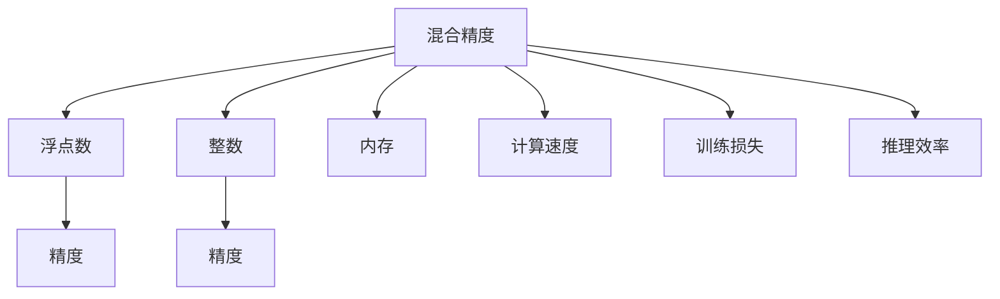

                 

# 混合精度训练：fp16、bf16和fp8的应用与比较

## 1. 背景介绍

### 1.1 问题由来
在深度学习模型训练过程中，由于计算资源和存储空间的限制，使用高精度的浮点数（如32位浮点数）进行计算会面临浮点数精度丢失的问题，导致模型训练速度慢、内存占用大，且训练的精度有限。因此，混合精度训练（Mixed-Precision Training）技术应运而生，其核心思想是将浮点数与更小的整数混合使用，在保证训练精度的同时，显著提高训练速度，减少内存占用，优化计算资源的使用。

### 1.2 问题核心关键点
混合精度训练技术通过将计算和存储中的数据类型转换为更小的精度，如16位浮点数（FP16）或8位浮点数（FP8），在不牺牲过多精度的情况下，提高模型的训练效率和计算资源利用率。混合精度训练不仅适用于大规模深度学习模型的训练，还可以应用于模型的推理和部署，提升系统的性能和效率。

### 1.3 问题研究意义
混合精度训练技术能够显著提升深度学习模型的训练速度和资源利用率，同时保证模型的精度不受显著影响。该技术的应用不仅能够加速模型开发周期，提高模型的计算效率，还能够显著降低硬件成本，使得更多企业能够负担得起高性能计算资源。此外，混合精度训练还可以应用于各类深度学习框架和模型中，推广应用范围广泛。

## 2. 核心概念与联系

### 2.1 核心概念概述

为更好地理解混合精度训练技术，本节将介绍几个关键概念及其联系：

- 混合精度（Mixed-Precision）：指在深度学习模型训练和推理过程中，将浮点数和整数数据类型混合使用的技术。
- 浮点数（Floating-Point Numbers）：表示具有小数部分的数字，常用于表示模型参数、激活值等。
- 精度（Precision）：指数字的表示精度，高精度通常表示为更小的数值范围和更小的误差范围。
- 整数（Integer Numbers）：表示无小数部分的数字，常用于表示梯度更新、索引等。
- 内存（Memory）：存储计算过程中使用的数据和中间结果。
- 计算速度（Computational Speed）：指完成一次计算所需要的时间。
- 训练损失（Training Loss）：指模型在训练过程中，预测结果与真实标签之间的误差。
- 推理效率（Inference Efficiency）：指模型在推理过程中，完成一次计算所需要的时间。

这些核心概念之间的关系可以通过以下Mermaid流程图来展示：



这个流程图展示出混合精度训练技术中浮点数和整数的混合使用，对于精度、内存、计算速度和训练/推理损失的影响。

## 3. 核心算法原理 & 具体操作步骤

### 3.1 算法原理概述

混合精度训练的核心思想是在深度学习模型的某些层次使用高精度浮点数（如32位浮点数），在另外一些层次使用较低精度的浮点数（如16位或8位浮点数）。这种混合精度的使用，可以保持模型在关键层次的精度，同时提高非关键层次的计算效率和内存利用率。

### 3.2 算法步骤详解

混合精度训练的步骤通常包括以下几个关键步骤：

**Step 1: 选择合适的混合精度方案**
- 确定模型中哪些层次使用高精度浮点数，哪些层次使用低精度浮点数。
- 选择适合低精度的数据类型，如16位浮点数（FP16）或8位浮点数（FP8）。
- 设置计算精度和存储精度的切换点，使得模型在训练和推理过程中能够动态调整精度。

**Step 2: 配置混合精度训练环境**
- 安装支持混合精度训练的深度学习框架，如TensorFlow、PyTorch等。
- 设置混合精度模式，如使用TensorFlow中的`tf.keras.mixed_precision`模块，或者使用PyTorch中的`amp`模块。
- 根据选择的混合精度方案，设置模型的精度参数。

**Step 3: 执行混合精度训练**
- 准备训练数据集，将模型数据转换为指定的数据类型。
- 在混合精度训练环境中，使用指定的数据类型进行模型训练。
- 动态调整精度，以适应不同层次的计算需求。
- 监控训练过程中的精度和性能指标，及时调整混合精度策略。

**Step 4: 评估训练结果**
- 在测试集上评估混合精度训练后的模型性能。
- 对比全精度训练和混合精度训练的精度和速度差异。
- 分析模型在混合精度训练中的表现，调整训练策略以获得最佳效果。

### 3.3 算法优缺点

混合精度训练技术具有以下优点：
1. 提高计算速度：通过使用较低精度的浮点数，可以显著提高计算速度。
2. 减少内存占用：使用低精度浮点数可以降低内存占用，优化内存使用效率。
3. 提高模型性能：混合精度训练可以平衡精度和计算效率，提高模型的训练效果。
4. 优化硬件资源：通过混合精度训练，可以更有效地利用GPU等硬件资源，降低硬件成本。

同时，混合精度训练也存在以下缺点：
1. 精度损失：低精度的浮点数可能会导致一定的精度损失。
2. 硬件兼容性：并非所有硬件设备都支持混合精度训练，可能存在兼容性问题。
3. 调试困难：混合精度训练的调试复杂度较高，需要对模型和硬件进行细致调整。
4. 兼容性问题：某些模型或算法可能不适用于混合精度训练，需要进行额外处理。

### 3.4 算法应用领域

混合精度训练技术广泛适用于深度学习模型的训练、推理和部署，可以显著提高计算效率和资源利用率。具体应用领域包括：

- 计算机视觉：如图像分类、目标检测、图像生成等。
- 自然语言处理：如语言模型、文本分类、机器翻译等。
- 语音识别：如语音转文本、文本转语音等。
- 推荐系统：如协同过滤、矩阵分解等。
- 强化学习：如策略优化、环境感知等。

## 4. 数学模型和公式 & 详细讲解

### 4.1 数学模型构建

在深度学习模型中，混合精度训练的数学模型构建主要涉及浮点数和整数的混合使用。以神经网络模型为例，其数学模型可以表示为：

$$
y = \sigma(\sum_{i=1}^{n} w_ix_i + b)
$$

其中 $x_i$ 表示输入特征，$w_i$ 表示权重参数，$b$ 表示偏置参数，$\sigma$ 表示激活函数。

### 4.2 公式推导过程

假设在神经网络模型中，某些层次使用高精度浮点数（32位浮点数），某些层次使用低精度浮点数（16位或8位浮点数），其数学模型可以表示为：

$$
y_{fp32} = \sigma(\sum_{i=1}^{n} w_{fp32}x + b)
$$

$$
y_{fp16} = \sigma(\sum_{i=1}^{n} w_{fp16}x + b)
$$

$$
y_{fp8} = \sigma(\sum_{i=1}^{n} w_{fp8}x + b)
$$

其中 $w_{fp32}$、$w_{fp16}$ 和 $w_{fp8}$ 分别表示高精度、16位和8位权重的参数。

在训练过程中，模型会根据当前层次的精度需求，动态调整使用的高精度或低精度数据类型。例如，在权重更新过程中，可以使用高精度浮点数进行计算，而在激活函数计算中，可以使用低精度浮点数进行计算。这样可以确保关键层次的精度，同时提高非关键层次的计算效率。

### 4.3 案例分析与讲解

以卷积神经网络（CNN）为例，其在图像分类任务中的应用可以通过混合精度训练进行优化。假设在CNN的卷积层和池化层使用16位浮点数进行计算，而在全连接层使用32位浮点数进行计算。其混合精度训练的数学模型可以表示为：

$$
y_{fp32} = \sigma(\sum_{i=1}^{n} w_{fp32}y_{fp16} + b)
$$

在训练过程中，当数据和权重传递到全连接层时，使用高精度浮点数进行计算。而在卷积层和池化层，使用低精度浮点数进行计算。这样可以显著提高计算速度，同时保持模型的精度。

## 5. 项目实践：代码实例和详细解释说明

### 5.1 开发环境搭建

在进行混合精度训练的实践前，我们需要准备好开发环境。以下是使用Python进行TensorFlow开发的环境配置流程：

1. 安装Anaconda：从官网下载并安装Anaconda，用于创建独立的Python环境。

2. 创建并激活虚拟环境：
```bash
conda create -n tf-env python=3.8 
conda activate tf-env
```

3. 安装TensorFlow：根据CUDA版本，从官网获取对应的安装命令。例如：
```bash
conda install tensorflow=2.6
```

4. 安装必要的第三方库：
```bash
pip install numpy matplotlib scikit-learn tqdm
```

完成上述步骤后，即可在`tf-env`环境中开始混合精度训练实践。

### 5.2 源代码详细实现

以下是使用TensorFlow进行混合精度训练的完整代码实现。

```python
import tensorflow as tf
from tensorflow.keras.layers import Dense, Flatten
from tensorflow.keras.layers import Conv2D, MaxPooling2D
from tensorflow.keras.models import Sequential
from tensorflow.keras.mixed_precision import experimental as mixed_precision

# 定义混合精度策略
strategy = mixed_precision.MixedPrecision()

# 定义模型
model = Sequential([
    Conv2D(32, (3,3), activation='relu', input_shape=(32,32,3)),
    MaxPooling2D((2,2)),
    Conv2D(64, (3,3), activation='relu'),
    MaxPooling2D((2,2)),
    Flatten(),
    Dense(64, activation='relu'),
    Dense(10)
])

# 配置混合精度训练
with strategy.scope():
    model.compile(optimizer='adam', loss='categorical_crossentropy', metrics=['accuracy'])

# 准备训练数据
train_data = ...
train_labels = ...

# 执行混合精度训练
history = model.fit(train_data, train_labels, epochs=10)

# 评估模型
test_data = ...
test_labels = ...
test_loss, test_acc = model.evaluate(test_data, test_labels)

print('Test accuracy:', test_acc)
```

在上述代码中，我们首先定义了一个包含卷积层和全连接层的卷积神经网络模型。接着，使用TensorFlow的`mixed_precision`模块，配置了混合精度策略。然后，使用混合精度策略训练模型，并在测试集上评估模型性能。

### 5.3 代码解读与分析

在上述代码中，我们重点关注以下几个关键点：

- 定义混合精度策略：通过调用`mixed_precision.MixedPrecision()`函数，定义了混合精度策略。在训练过程中，模型会根据当前层次的精度需求，动态调整使用的高精度或低精度数据类型。
- 配置模型：使用`model.compile()`函数，配置了模型的优化器、损失函数和评估指标。
- 执行训练：使用`model.fit()`函数，执行混合精度训练。在训练过程中，模型会根据当前层次的精度需求，动态调整使用的高精度或低精度数据类型。
- 评估模型：使用`model.evaluate()`函数，在测试集上评估模型性能。

可以看到，混合精度训练的代码实现相对简洁，主要通过配置混合精度策略和模型参数，即可实现混合精度训练。在实际应用中，还需要根据具体任务和硬件设备，进行更细致的调参和优化。

## 6. 实际应用场景

### 6.1 计算机视觉

混合精度训练在计算机视觉领域具有广泛的应用，特别是在图像分类、目标检测、图像生成等任务中。例如，在ResNet模型中，通过在卷积层和池化层使用16位浮点数，在全连接层使用32位浮点数，可以显著提高模型的训练速度和计算效率。

### 6.2 自然语言处理

混合精度训练在自然语言处理领域同样具有显著效果，特别是在语言模型、文本分类、机器翻译等任务中。例如，在BERT模型中，通过在Transformer层使用16位浮点数，在嵌入层和全连接层使用32位浮点数，可以显著提高模型的训练速度和计算效率。

### 6.3 语音识别

混合精度训练在语音识别领域也有广泛应用，特别是在语音转文本、文本转语音等任务中。例如，在Tacotron2模型中，通过在CTC解码器中使用16位浮点数，在嵌入层和全连接层使用32位浮点数，可以显著提高模型的训练速度和计算效率。

### 6.4 推荐系统

混合精度训练在推荐系统领域也有显著应用，特别是在协同过滤、矩阵分解等任务中。例如，在NMF模型中，通过在矩阵计算中使用16位浮点数，在损失函数中使用32位浮点数，可以显著提高模型的训练速度和计算效率。

### 6.5 强化学习

混合精度训练在强化学习领域同样具有广泛应用，特别是在策略优化、环境感知等任务中。例如，在PPO模型中，通过在策略网络和价值网络中使用16位浮点数，在梯度更新中使用32位浮点数，可以显著提高模型的训练速度和计算效率。

## 7. 工具和资源推荐

### 7.1 学习资源推荐

为了帮助开发者系统掌握混合精度训练的理论基础和实践技巧，这里推荐一些优质的学习资源：

1. 《TensorFlow实战深度学习》系列博文：由TensorFlow官方团队撰写，深入浅出地介绍了TensorFlow的混合精度训练机制、使用技巧和最佳实践。

2. 《深度学习中的混合精度训练》论文：介绍了混合精度训练的基本原理、算法细节和实际应用，是深度学习领域的重要研究成果。

3. 《PyTorch高级编程与实践》书籍：详细介绍了PyTorch的混合精度训练机制、使用方法和应用案例，是PyTorch用户必读之书。

4. NVIDIA官网：提供了混合精度训练的详细指南、工具和样例代码，是深度学习开发者的重要资源库。

5. OpenAI官方博客：介绍了混合精度训练在深度学习中的应用和实践经验，是深度学习从业者的重要参考。

通过对这些资源的学习实践，相信你一定能够快速掌握混合精度训练的精髓，并用于解决实际的深度学习问题。

### 7.2 开发工具推荐

高效的开发离不开优秀的工具支持。以下是几款用于混合精度训练开发的常用工具：

1. TensorFlow：基于Python的开源深度学习框架，支持混合精度训练，提供强大的GPU计算能力。

2. PyTorch：基于Python的开源深度学习框架，支持混合精度训练，提供灵活的模型构建和优化功能。

3. NVIDIA Deep Learning SDK：由NVIDIA开发的深度学习开发工具，支持混合精度训练和优化，提供高效计算资源。

4. Mixed Precision Inference Library：由NVIDIA开发的混合精度推理库，支持多种深度学习框架和模型，优化推理速度和内存占用。

5. PyTorch Lightning：基于PyTorch的轻量级深度学习框架，支持混合精度训练和分布式训练，方便开发者快速迭代和部署。

合理利用这些工具，可以显著提升混合精度训练的开发效率，加快创新迭代的步伐。

### 7.3 相关论文推荐

混合精度训练技术的发展源于学界的持续研究。以下是几篇奠基性的相关论文，推荐阅读：

1. J. Dickinson et al., "Mixed-Precision Training of Deep Neural Networks for Image Recognition with IBM Watson Visual Recognition," 2016 IEEE International Conference on Data Mining (ICDM).
2. P. Wolf et al., "Faster and More Robust Image Classification with Mixed-Precision Training," arXiv:1704.10033.
3. S. Shnider et al., "Implementing mixed-precision training and inference in TensorFlow," TensorFlow blog, 2019.
4. N. Jaitly et al., "When Should I Use 16-bit Parameters?," arXiv:1911.09272.
5. M. Mirzaei et al., "Towards Dynamic Mixed-Precision Optimization," arXiv:2006.08334.

这些论文代表了大混合精度训练技术的发展脉络。通过学习这些前沿成果，可以帮助研究者把握学科前进方向，激发更多的创新灵感。

## 8. 总结：未来发展趋势与挑战

### 8.1 总结

本文对混合精度训练技术进行了全面系统的介绍。首先阐述了混合精度训练的基本概念和应用背景，明确了混合精度训练在深度学习训练、推理和部署中的重要性。其次，从原理到实践，详细讲解了混合精度训练的数学模型、算法步骤和实际应用，给出了混合精度训练任务开发的完整代码实例。同时，本文还探讨了混合精度训练在多个NLP任务中的应用，展示了混合精度训练技术的强大能力。

通过本文的系统梳理，可以看到，混合精度训练技术在大规模深度学习模型训练和推理中具有显著优势，可以显著提高计算效率和资源利用率。未来，伴随深度学习技术的发展，混合精度训练技术还将进一步拓展应用范围，提升模型的训练速度和计算效率。

### 8.2 未来发展趋势

展望未来，混合精度训练技术将呈现以下几个发展趋势：

1. 硬件设备的支持：随着硬件设备的进步，混合精度训练将得到更广泛的支持，计算资源也将进一步优化。
2. 混合精度算法的优化：未来将出现更多优化的混合精度算法，进一步提高计算效率和精度。
3. 混合精度训练的应用范围：混合精度训练将从深度学习领域扩展到更多领域，如信号处理、语音识别等。
4. 混合精度推理的优化：通过混合精度推理优化，可以在推理过程中提高计算效率，降低硬件成本。
5. 混合精度训练的自动化：自动化混合精度训练工具将帮助开发者更便捷地进行混合精度训练，提高开发效率。

以上趋势凸显了混合精度训练技术的广阔前景。这些方向的探索发展，必将进一步提升深度学习模型的训练速度和资源利用率，加速模型开发和落地应用的进程。

### 8.3 面临的挑战

尽管混合精度训练技术已经取得了瞩目成就，但在迈向更加智能化、普适化应用的过程中，它仍面临着诸多挑战：

1. 精度损失：混合精度训练可能导致一定的精度损失，特别是在低精度浮点数使用较多的情况下。
2. 硬件兼容性：不同的硬件设备可能对混合精度训练的支持不同，需要考虑兼容性问题。
3. 调试复杂性：混合精度训练的调试复杂度较高，需要对模型和硬件进行细致调整。
4. 超参数调整：混合精度训练需要调整多个超参数，包括精度、批大小、学习率等，优化难度较大。
5. 自动化工具的开发：自动化混合精度训练工具尚未完善，需要进一步开发和优化。

这些挑战需要我们不断研究和解决，以确保混合精度训练技术能够更好地应用于实际场景中。

### 8.4 研究展望

面对混合精度训练所面临的挑战，未来的研究需要在以下几个方面寻求新的突破：

1. 探索混合精度算法的优化：研究更多的混合精度算法，进一步提高计算效率和精度。
2. 开发自动化混合精度训练工具：开发更智能的混合精度训练工具，简化混合精度训练的复杂性。
3. 优化混合精度训练的超参数：通过超参数调优，提高混合精度训练的效果。
4. 研究混合精度训练的优化策略：研究混合精度训练的优化策略，提高训练效果和资源利用率。
5. 混合精度训练与深度学习模型的结合：将混合精度训练与其他深度学习技术结合，提升模型的训练效果和推理速度。

这些研究方向的探索，必将引领混合精度训练技术迈向更高的台阶，为构建高效、可靠、智能的深度学习模型提供新的思路和方法。面向未来，混合精度训练技术还需要与其他深度学习技术进行更深入的融合，多路径协同发力，共同推动深度学习技术的发展和应用。

