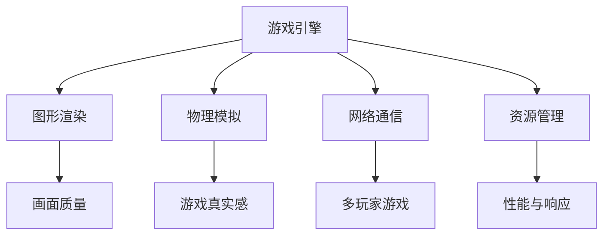
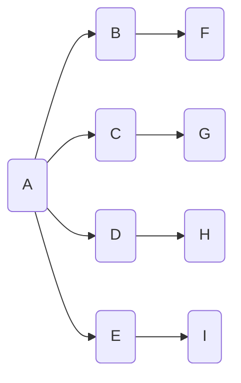
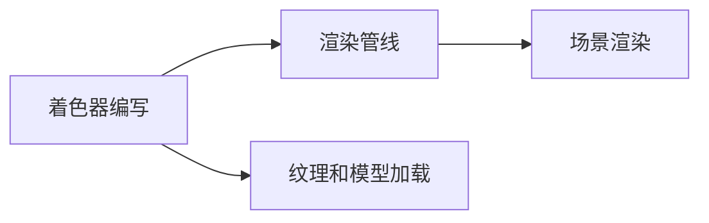
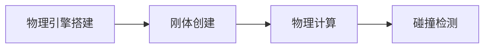
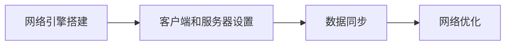
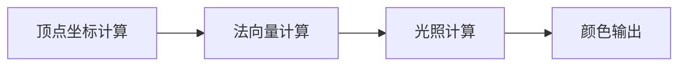
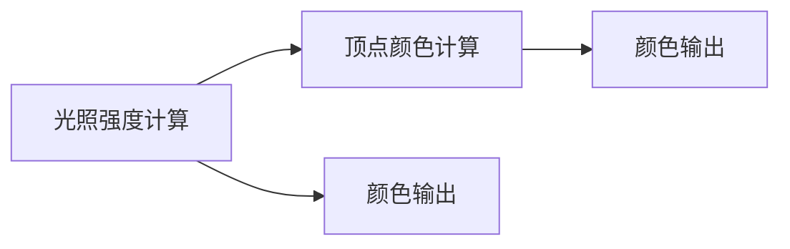

                 

## 1. 背景介绍

游戏开发框架是游戏开发者必须依赖的工具和基础，不同的游戏类型、不同的引擎选择，都会对游戏开发的效率和质量产生重大影响。本文将从背景、核心概念及联系、核心算法原理及具体操作步骤等方面，对游戏开发框架的选择与应用进行全面介绍。

## 2. 核心概念与联系

### 2.1 核心概念概述

在游戏开发中，框架是核心的基础库，它们为游戏提供了基本的图形渲染、物理模拟、音频处理、网络通信等功能。在这里，我们列举几个关键概念：

- **游戏引擎**：游戏引擎是开发游戏时使用的基础软件，提供了图形渲染、物理模拟、网络通信、音频处理等核心功能。
- **图形渲染**：图形渲染是游戏引擎的核心功能之一，它决定了游戏的画面质量。
- **物理模拟**：物理模拟用于处理游戏中的碰撞、重力、摩擦等物理特性，提高了游戏的真实感。
- **网络通信**：网络通信使得多玩家游戏成为可能，是现代网络游戏中不可或缺的功能。
- **资源管理**：资源管理包括模型、纹理、音频等游戏资源的加载和卸载，有助于提高游戏的性能和响应速度。

这些核心概念之间的关系如图2-1所示：



### 2.2 核心概念原理和架构的 Mermaid 流程图



## 3. 核心算法原理 & 具体操作步骤

### 3.1 算法原理概述

游戏引擎的算法原理主要包括图形渲染算法、物理引擎算法和网络引擎算法。下面对这三种算法进行简单介绍：

- **图形渲染算法**：图形渲染算法是游戏引擎的核心算法之一，包括渲染管线、着色器等。
- **物理引擎算法**：物理引擎算法用于模拟游戏环境中的物理特性，如碰撞检测、刚体模拟等。
- **网络引擎算法**：网络引擎算法用于实现多玩家游戏的网络通信和同步，包括TCP/UDP协议、数据同步算法等。

### 3.2 算法步骤详解

游戏开发框架的核心步骤包括以下几个方面：

#### 3.2.1 图形渲染

图形渲染的基本步骤如图3-1所示：

1. **着色器编写**：编写着色器代码，定义游戏场景的外观和行为。
2. **渲染管线**：根据着色器编写顺序，构建渲染管线。
3. **纹理和模型加载**：加载游戏场景的纹理和模型资源。
4. **场景渲染**：将场景中的所有模型和纹理渲染到屏幕上。



#### 3.2.2 物理模拟

物理模拟的基本步骤如图3-2所示：

1. **物理引擎搭建**：搭建物理引擎，设置物理特性如碰撞、重力等。
2. **刚体创建**：创建游戏场景中的刚体，如角色、物品等。
3. **物理计算**：计算刚体的运动状态，如位置、速度、旋转等。
4. **碰撞检测**：检测刚体之间的碰撞，并根据碰撞结果调整刚体的状态。



#### 3.2.3 网络通信

网络通信的基本步骤如图3-3所示：

1. **网络引擎搭建**：搭建网络引擎，选择TCP/UDP协议。
2. **客户端和服务器设置**：设置客户端和服务器的网络参数，如IP地址、端口等。
3. **数据同步**：实现多玩家游戏的数据同步，包括状态同步、位置同步等。
4. **网络优化**：优化网络性能，确保游戏运行的稳定性。



### 3.3 算法优缺点

#### 3.3.1 图形渲染算法

- **优点**：
  - 可以实现高帧率、高画质。
  - 支持多种光照模型和阴影效果。
  - 能够实现复杂的场景和特效。

- **缺点**：
  - 算法复杂，调试和优化难度大。
  - 对硬件要求高，需要高性能的显卡和CPU。
  - 渲染管线设计复杂，易于出错。

#### 3.3.2 物理引擎算法

- **优点**：
  - 能够实现逼真的物理效果。
  - 支持多种碰撞检测算法和物理特性。
  - 能够模拟复杂的物理系统。

- **缺点**：
  - 算法复杂，计算量大。
  - 性能消耗高，容易导致卡顿和延迟。
  - 需要精细的物理参数设置，容易出现错误。

#### 3.3.3 网络引擎算法

- **优点**：
  - 支持多玩家游戏，提高游戏的互动性和娱乐性。
  - 数据同步机制完善，游戏体验更稳定。
  - 能够实现复杂的网络逻辑和算法。

- **缺点**：
  - 网络延迟和丢包问题难以避免。
  - 网络安全问题复杂，容易被攻击。
  - 网络优化难度大，容易出现延迟和卡顿。

### 3.4 算法应用领域

#### 3.4.1 图形渲染应用领域

图形渲染在游戏开发中应用广泛，如图形游戏、赛车游戏、动作游戏等。

#### 3.4.2 物理模拟应用领域

物理模拟在游戏开发中主要用于运动类游戏、物理模拟类游戏，如体育游戏、物理引擎类游戏等。

#### 3.4.3 网络通信应用领域

网络通信在游戏开发中主要用于多人在线游戏，如Minecraft、DOTA等。

## 4. 数学模型和公式 & 详细讲解 & 举例说明

### 4.1 数学模型构建

在这里，我们以图形渲染中的着色器编写为例，介绍数学模型的构建。

假设我们有一个简单的三角形，顶点坐标为$(0,0,0)$、$(1,0,0)$和$(0,1,0)$。我们可以使用向量模型来表示这个三角形的三个顶点。

- **顶点坐标向量**：设顶点坐标为$V=(0,0,0)$、$V_1=(1,0,0)$、$V_2=(0,1,0)$。
- **法向量**：设三角形的法向量为$N=(0,0,1)$。

### 4.2 公式推导过程

着色器代码的计算过程如图4-1所示：

1. **顶点坐标计算**：将顶点坐标转化为向量模型。
2. **法向量计算**：计算三角形的法向量。
3. **光照计算**：根据光照模型计算顶点颜色。
4. **颜色输出**：将计算结果输出到屏幕上。



### 4.3 案例分析与讲解

假设有三个顶点，每个顶点都有一个颜色属性。

- **顶点坐标**：
  - $V=(0,0,0)$
  - $V_1=(1,0,0)$
  - $V_2=(0,1,0)$

- **法向量**：$N=(0,0,1)$

- **光照模型**：$I=N\cdot L$，其中$I$为光照强度，$L$为光源方向向量。

- **顶点颜色计算**：$C=I\cdot D$，其中$C$为顶点颜色，$D$为顶点颜色属性。

具体计算过程如图4-2所示：

1. **光照强度计算**：
  - $I=V\cdot N$
  - $I_1=V_1\cdot N$
  - $I_2=V_2\cdot N$

2. **顶点颜色计算**：
  - $C=I\cdot D$
  - $C_1=I_1\cdot D$
  - $C_2=I_2\cdot D$

3. **颜色输出**：将计算结果输出到屏幕上。



## 5. 项目实践：代码实例和详细解释说明

### 5.1 开发环境搭建

在搭建开发环境时，需要选择适合的游戏开发框架，常用的框架包括Unity、Unreal Engine、Cocos2d-x等。

以下以Unity为例，介绍开发环境的搭建：

1. **安装Unity**：从Unity官网下载并安装Unity编辑器。
2. **安装Visual Studio**：安装Visual Studio，用于编写C#脚本。
3. **安装Unity3D插件**：安装Unity3D插件，如Unity3D Asset Store等。

### 5.2 源代码详细实现

在Unity中，可以通过编写C#脚本实现图形渲染、物理模拟和网络通信。

以下是一个简单的Unity脚本示例：

```csharp
using UnityEngine;

public class GameManager : MonoBehaviour
{
    private Camera mainCam;
    private Rigidbody[] allRigidbodies;

    void Start()
    {
        mainCam = GameObject.Find("MainCamera").GetComponent<Camera>();
        allRigidbodies = GameObject.FindGameObjectsWithTag("Rigidbody").Select(g => g.GetComponent<Rigidbody>()).ToArray();
    }

    void Update()
    {
        for (int i = 0; i < allRigidbodies.Length; i++)
        {
            Rigidbody rb = allRigidbodies[i];
            rb.AddForce(new Vector3(0, 9.8f, 0) * Time.deltaTime, ForceMode.Impulse);
        }
    }
}
```

### 5.3 代码解读与分析

- **组件初始化**：
  - `mainCam = GameObject.Find("MainCamera").GetComponent<Camera>();`：获取主相机组件。
  - `allRigidbodies = GameObject.FindGameObjectsWithTag("Rigidbody").Select(g => g.GetComponent<Rigidbody>()).ToArray();`：获取所有标记为"Rigidbody"的游戏对象。

- **物理计算**：
  - `rb.AddForce(new Vector3(0, 9.8f, 0) * Time.deltaTime, ForceMode.Impulse);`：计算物体的重力加速度，并施加到物体上。

### 5.4 运行结果展示

在Unity编辑器中，可以看到物体的运动效果。

## 6. 实际应用场景

### 6.1 游戏开发

游戏开发中，图形渲染、物理模拟和网络通信是必不可少的环节。以下以Unity引擎为例，介绍实际应用场景：

#### 6.1.1 图形渲染

在Unity中，可以通过Shader编写来实现高质感的图形渲染。

#### 6.1.2 物理模拟

Unity提供了PhysX物理引擎，可以用于实现复杂的物理模拟。

#### 6.1.3 网络通信

Unity提供了UnityNetworkManager组件，可以用于实现多玩家游戏的网络通信。

### 6.2 虚拟现实

虚拟现实(VR)游戏中，图形渲染、物理模拟和网络通信同样重要。Unity是VR开发的首选引擎，可以提供高效的图形渲染和物理模拟，同时支持多玩家网络通信。

## 7. 工具和资源推荐

### 7.1 学习资源推荐

#### 7.1.1 文档和教程

- Unity官方文档：https://docs.unity3d.com
- Unreal Engine官方文档：https://docs.unrealengine.com
- Cocos2d-x官方文档：http://cocos2d-x.org/

#### 7.1.2 在线课程

- Udemy的Unity课程：https://www.udemy.com/course/unity-3d-tutorial-for-beginners/
- Coursera的Unreal Engine课程：https://www.coursera.org/specializations/unreal-engine

### 7.2 开发工具推荐

#### 7.2.1 Unity

- 官方网站：https://unity3d.com
- 功能特点：图形渲染、物理模拟、网络通信、跨平台部署。

#### 7.2.2 Unreal Engine

- 官方网站：https://www.unrealengine.com
- 功能特点：图形渲染、物理模拟、网络通信、可视化编辑。

#### 7.2.3 Cocos2d-x

- 官方网站：http://cocos2d-x.org
- 功能特点：跨平台支持、2D游戏开发、动画和特效支持。

### 7.3 相关论文推荐

#### 7.3.1 图形渲染

- Real-time Rendering: A Survey: https://www.researchgate.net/publication/222943552_Real-Time_Rendering
- GPU Gems 3: https://www.gamasutra.com/features/gpu/g3

#### 7.3.2 物理模拟

- NVIDIA PhysX: https://developer.nvidia.com/physx
- Granular Simulation in Three Dimensions: https://www.cs.utexas.edu/research/publications/granular_gravity/gs3d.pdf

#### 7.3.3 网络通信

- TCP/IP协议：https://en.wikipedia.org/wiki/Transmission_Control_Protocol
- UDP协议：https://en.wikipedia.org/wiki/User_Datagram_Protocol

## 8. 总结：未来发展趋势与挑战

### 8.1 研究成果总结

#### 8.1.1 图形渲染

- 高效的渲染管线设计
- 支持多种光照模型和阴影效果

#### 8.1.2 物理模拟

- 支持多种碰撞检测算法和物理特性
- 模拟复杂的物理系统

#### 8.1.3 网络通信

- 支持多玩家游戏，提高游戏的互动性和娱乐性
- 实现复杂的网络逻辑和算法

### 8.2 未来发展趋势

#### 8.2.1 图形渲染

- 增强虚拟现实和增强现实（AR）支持
- 引入AI技术，实现智能渲染

#### 8.2.2 物理模拟

- 引入机器学习技术，实现自适应物理模拟
- 提高物理模拟的精度和效率

#### 8.2.3 网络通信

- 支持更多的网络协议和标准
- 增强网络安全性和稳定性

### 8.3 面临的挑战

#### 8.3.1 图形渲染

- 算法复杂，调试和优化难度大
- 对硬件要求高，需要高性能的显卡和CPU

#### 8.3.2 物理模拟

- 算法复杂，计算量大
- 性能消耗高，容易导致卡顿和延迟

#### 8.3.3 网络通信

- 网络延迟和丢包问题难以避免
- 网络安全问题复杂，容易被攻击

### 8.4 研究展望

#### 8.4.1 图形渲染

- 引入AI技术，实现智能渲染
- 引入新的渲染技术，如虚拟现实渲染、增强现实渲染

#### 8.4.2 物理模拟

- 引入机器学习技术，实现自适应物理模拟
- 引入新的物理特性，如摩擦、弹性等

#### 8.4.3 网络通信

- 支持更多的网络协议和标准
- 增强网络安全性和稳定性

## 9. 附录：常见问题与解答

### 9.1 常见问题

#### Q1：如何选择适合的游戏开发框架？

A: 选择游戏开发框架需要考虑以下因素：
- 游戏类型
- 平台支持
- 开发成本
- 社区支持

#### Q2：如何在Unity中进行图形渲染？

A: 在Unity中进行图形渲染，可以通过编写Shader实现。

#### Q3：如何使用Unity实现物理模拟？

A: 在Unity中，可以使用PhysX物理引擎进行物理模拟。

#### Q4：如何实现多玩家游戏的网络通信？

A: 在Unity中，可以使用UnityNetworkManager组件实现多玩家游戏的网络通信。

---

作者：禅与计算机程序设计艺术 / Zen and the Art of Computer Programming

