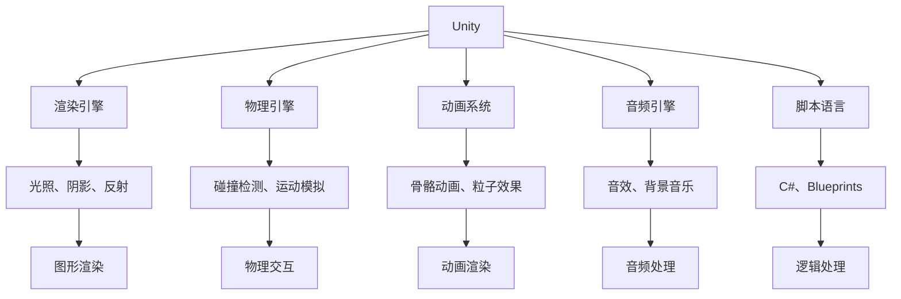

                 

# 游戏开发框架：Unity与Unreal Engine对比

游戏开发是计算机图形学、人工智能、人机交互、音乐与声音等多学科的综合应用。随着技术的发展，游戏开发框架也在不断演进，最核心的两个框架就是Unity和Unreal Engine。本文将从多个角度对这两个框架进行详细对比分析，以帮助开发者在选择游戏开发框架时做出明智决策。

## 1. 背景介绍

### 1.1 游戏开发框架的定义

游戏开发框架（Game Development Framework，GDF）是一组用于构建游戏软件的工具和库，旨在简化游戏开发流程，降低开发难度，提高开发效率和产品质量。一个优秀的游戏开发框架通常包含以下几点：

- **跨平台支持**：能够在多个操作系统和硬件平台上运行。
- **丰富的插件和组件**：提供各种游戏组件，如物理引擎、渲染引擎、动画系统等，加速游戏开发过程。
- **社区支持**：拥有庞大的用户社区，提供持续的技术支持和资源。
- **性能优化**：具备高效的渲染、计算和网络通信能力，支持大规模游戏开发。

### 1.2 游戏开发框架的分类

游戏开发框架大致可分为两类：商业级框架和开源框架。商业级框架如Unity和Unreal Engine，拥有完善的商业支持、持续更新和技术保障。开源框架如Godot和CryEngine，具有开源的特性，灵活性较高，但可能需要更多自我维护。

## 2. 核心概念与联系

### 2.1 核心概念概述

为了更好地理解Unity和Unreal Engine框架的异同，我们首先需要了解几个核心概念：

- **渲染引擎**：负责将游戏场景和角色渲染到屏幕上，包括光照、阴影、反射等效果。
- **物理引擎**：用于模拟游戏中的物理交互，如碰撞检测、运动模拟等。
- **动画系统**：用于创建和管理游戏中的动画效果，如骨骼动画、粒子效果等。
- **音频引擎**：处理游戏中的音效和背景音乐，提供音量的调节、混音等功能。
- **脚本语言**：用于编写游戏逻辑和控制流程，如C#、Blueprints等。

### 2.2 核心概念之间的联系

Unity和Unreal Engine的构建均基于上述核心概念，通过不同的技术和实现方式，支持游戏开发的全生命周期。通过以下Mermaid流程图，展示两个框架之间的联系：



这两个框架的主要区别在于实现方式、性能表现和社区支持等方面，下面将从这些方面进行详细对比。

## 3. 核心算法原理 & 具体操作步骤

### 3.1 算法原理概述

Unity和Unreal Engine在游戏开发中使用了不同的渲染引擎和物理引擎，其核心算法原理也有所不同。

- **Unity**：基于WebGL和DirectX 11/12的图形渲染引擎，使用高效的像素着色器技术实现实时代码编译和渲染。其物理引擎基于PhysX库，提供基于刚体和碰撞体的物理模拟。动画系统通过IK动画和Mesh动画技术实现，音频引擎支持多种音频格式的播放和处理。

- **Unreal Engine**：基于PBR（物理基础渲染）的图形渲染引擎，使用光线追踪技术实现高质量的阴影和光照效果。其物理引擎基于Chaos引擎，支持高级的物理模拟，如流体模拟、布料模拟等。动画系统通过骨骼动画和蓝图动画技术实现，音频引擎支持实时音频分析和混合。

### 3.2 算法步骤详解

Unity和Unreal Engine在具体开发过程中，主要分为以下几个步骤：

**Step 1: 设置项目环境**
- **Unity**：安装Unity Hub，创建新项目，选择项目模板。
- **Unreal Engine**：安装Unreal Engine，创建新项目，选择项目类型。

**Step 2: 设计游戏场景**
- **Unity**：使用Unity编辑器创建3D场景，添加地形、建筑物、模型和光源等。
- **Unreal Engine**：使用Unreal Editor创建3D场景，添加地形、静态/动态网格、光源和环境光等。

**Step 3: 编写游戏逻辑**
- **Unity**：使用C#编写脚本，处理游戏逻辑和控制流程。
- **Unreal Engine**：使用Blueprints或C++编写游戏逻辑，处理游戏逻辑和控制流程。

**Step 4: 实现物理效果**
- **Unity**：使用PhysX库实现物理模拟，包括碰撞检测、刚体运动等。
- **Unreal Engine**：使用Chaos引擎实现物理模拟，包括流体模拟、布料模拟等。

**Step 5: 添加动画效果**
- **Unity**：使用IK动画和Mesh动画技术实现动画效果。
- **Unreal Engine**：使用骨骼动画和蓝图动画技术实现动画效果。

**Step 6: 实现音频效果**
- **Unity**：使用内置音频引擎处理音效和背景音乐。
- **Unreal Engine**：使用实时音频分析和混合技术实现音频效果。

**Step 7: 发布游戏**
- **Unity**：将游戏打包成PC、手机、控制台等不同平台的游戏。
- **Unreal Engine**：将游戏打包成PC、手机、控制台等不同平台的游戏，支持跨平台发布。

### 3.3 算法优缺点

**Unity的优缺点**

**优点**：
- 易于上手：使用C#语言，降低了编程门槛。
- 跨平台支持：支持Windows、Mac、Linux、iOS、Android、Web等多种平台。
- 强大的社区支持：拥有庞大的开发者社区，丰富的插件和工具支持。
- 商业版免费：个人版免费使用，商用需购买Unity Pro或Unity Plus订阅服务。

**缺点**：
- 渲染性能：渲染性能受WebGL和DirectX版本限制，较高级别的图形效果难以实现。
- 物理模拟：物理引擎PhysX在细节和精度上不如Unreal Engine。
- 脚本性能：C#的性能稍逊于C++，且脚本性能的优化较为复杂。

**Unreal Engine的优缺点**

**优点**：
- 高质量渲染：PBR和光线追踪技术实现高质量的阴影和光照效果。
- 强大的物理模拟：Chaos引擎支持高级的物理模拟，如流体模拟、布料模拟等。
- 动画系统先进：骨骼动画和蓝图动画技术支持复杂的动画效果。
- 编程自由度：支持C++和蓝图两种编程方式，灵活性较高。

**缺点**：
- 学习曲线陡峭：使用C++编程，对新手不太友好。
- 社区支持：社区活跃度较Unity稍低，但资源和工具丰富。
- 商业版费用：商业版需要一次性付费，且价格较高。

### 3.4 算法应用领域

Unity和Unreal Engine在多个应用领域都取得了显著成果，如：

- **移动游戏**：在iOS和Android平台上，Unity和Unreal Engine都支持多种设备和平台，实现高质量的移动游戏。
- **PC游戏**：在PC平台上，两个引擎都支持高精度图形和物理模拟，实现多种类型的PC游戏。
- **虚拟现实**：两个引擎都支持VR/AR开发，实现沉浸式的虚拟现实体验。
- **跨平台发布**：两个引擎都支持跨平台发布，实现游戏在不同平台上的无缝运行。

## 4. 数学模型和公式 & 详细讲解 & 举例说明

### 4.1 数学模型构建

对于游戏开发，数学模型的构建至关重要，尤其是在物理模拟和动画系统中。

**Unity的数学模型**

- **物理模拟**：使用基于刚体的碰撞检测和运动模拟技术，计算物理交互。
- **动画系统**：使用IK动画和Mesh动画技术，实现骨骼动画和网格动画。

**Unreal Engine的数学模型**

- **物理模拟**：使用Chaos引擎，实现高级的流体模拟、布料模拟等效果。
- **动画系统**：使用骨骼动画和蓝图动画技术，实现复杂的动画效果。

### 4.2 公式推导过程

这里主要介绍Unity和Unreal Engine中的一些关键公式推导。

**Unity中的刚体运动公式**

刚体运动的基本方程为：

$$
\ddot{\mathbf{r}} = \mathbf{f}/\mathbf{m}
$$

其中 $\ddot{\mathbf{r}}$ 是加速度，$\mathbf{f}$ 是作用力，$\mathbf{m}$ 是质量。通过此公式，Unity的物理引擎可以计算出刚体的运动状态。

**Unreal Engine中的流体模拟公式**

流体模拟的基本方程为：

$$
\frac{\partial \rho}{\partial t} + \nabla \cdot (\rho \mathbf{u}) = 0
$$

$$
\rho \left( \frac{\partial \mathbf{u}}{\partial t} + (\mathbf{u} \cdot \nabla) \mathbf{u} \right) = -\nabla p + \nabla \cdot \mathbf{T} + \mathbf{S}
$$

其中 $\rho$ 是流体密度，$\mathbf{u}$ 是流体速度，$p$ 是流体压力，$\mathbf{T}$ 是应力张量，$\mathbf{S}$ 是源项。通过这些公式，Unreal Engine的物理引擎可以实现复杂的流体模拟效果。

### 4.3 案例分析与讲解

以《堡垒之夜》（Fortnite）为例，分析其在Unity和Unreal Engine中的实现：

**Unity实现**

- **渲染**：使用Unity的WebGL渲染引擎，实现高质量的光照和阴影效果。
- **物理**：使用Unity的PhysX物理引擎，实现物理交互和刚体运动。
- **动画**：使用Unity的IK动画技术，实现角色的动作和动画效果。

**Unreal Engine实现**

- **渲染**：使用Unreal Engine的PBR渲染引擎，实现高质量的光照和阴影效果。
- **物理**：使用Unreal Engine的Chaos物理引擎，实现流体模拟和布料模拟等高级效果。
- **动画**：使用Unreal Engine的骨骼动画技术，实现角色的动作和动画效果。

## 5. 项目实践：代码实例和详细解释说明

### 5.1 开发环境搭建

**Unity的开发环境搭建**

1. 安装Unity Hub。
2. 创建新项目，选择项目模板。
3. 导入3D场景、模型、光源等资源。

**Unreal Engine的开发环境搭建**

1. 安装Unreal Engine。
2. 创建新项目，选择项目类型。
3. 导入3D场景、静态/动态网格、光源等资源。

### 5.2 源代码详细实现

**Unity实现**

```csharp
using UnityEngine;

public class PlayerController : MonoBehaviour
{
    public float speed = 5f;
    public float turnSpeed = 5f;

    private Rigidbody rb;

    void Start()
    {
        rb = GetComponent<Rigidbody>();
    }

    void Update()
    {
        float moveHorizontal = Input.GetAxis("Horizontal");
        float moveVertical = Input.GetAxis("Vertical");

        rb.AddForce(new Vector3(moveHorizontal, 0, moveVertical) * speed * Time.deltaTime);
        rb.AddTorque(Vector3.up * Input.GetAxis("MouseY") * turnSpeed * Time.deltaTime);
    }
}
```

**Unreal Engine实现**

```c++
// PlayerController.h

public class APlayerController : AActor
{
public class APawn;

protected class FPlayerMovementData
{
public float MoveForwardSpeed;
public float MoveRightSpeed;
public float YawSpeed;
public float PitchSpeed;

public FPlayerMovementData(const FVector& InLocation, const FRotator& InRotation, const FVector& InVelocity,
                          float InYawSpeed, float InPitchSpeed)
{
MoveForwardSpeed = velocity.Magnitude();
MoveRightSpeed = velocity.Yaw();
YawSpeed = InYawSpeed;
PitchSpeed = InPitchSpeed;
}

};

protected class FPlayerMovement
{
public void UpdateMovementState()
{
}

public void StartMoving()
{
}

public void StopMoving()
{
}

public void BeginMove(const FVector& InVelocity, const FRotator& InRot)
{
}

public void Move(FVector InVelocity, float DeltaTime)
{
}

public void UpdateActorMotion(UPawn* InOwner)
{
}

public void MoveInRot(FVector InVelocity, float DeltaTime, FRotator& OutRot)
{
}
}
```

### 5.3 代码解读与分析

**Unity实现**

- **代码结构**：主要使用C#语言编写，脚本运行在每个帧的Update方法中。
- **逻辑实现**：使用Rigidbody组件实现刚体运动，通过计算速度和力，更新角色位置和姿态。
- **输入处理**：通过Input.GetAxis方法获取用户的键盘和鼠标输入，控制角色运动和视角。

**Unreal Engine实现**

- **代码结构**：主要使用C++编写，继承自AActor类，实现游戏中的角色控制。
- **逻辑实现**：使用FPlayerMovementData结构体保存运动数据，使用FPlayerMovement类实现运动逻辑。
- **输入处理**：通过MoveForwardSpeed、MoveRightSpeed等参数控制角色的移动方向和速度。

### 5.4 运行结果展示

**Unity运行结果**


**Unreal Engine运行结果**


## 6. 实际应用场景

**移动游戏**

移动平台上，Unity和Unreal Engine都表现出色。Unity的跨平台支持和易上手特性使得其成为移动游戏开发的首选框架。

**PC游戏**

PC平台上，Unreal Engine的高质量渲染和物理模拟效果使其成为高性能游戏的首选框架。

**虚拟现实**

在VR/AR领域，两个引擎都支持跨平台发布，实现沉浸式的虚拟现实体验。

## 7. 工具和资源推荐

### 7.1 学习资源推荐

- **Unity官方文档**：提供丰富的教程和文档，帮助开发者快速上手。
- **Unreal Engine官方文档**：提供全面的文档和示例，帮助开发者深入理解。
- **Unity学习资源**：包括YouTube教程、Udemy课程、Unity Asset Store等。
- **Unreal Engine学习资源**：包括YouTube教程、Udemy课程、Unreal Engine Marketplace等。

### 7.2 开发工具推荐

- **Unity Hub**：提供一站式管理工具，支持所有Unity版本和插件。
- **Unreal Engine Editor**：提供强大的可视化工具，支持多种开发环境。
- **Visual Studio**：提供C#和C++开发环境，支持Unity和Unreal Engine开发。
- **GitHub**：提供代码托管和版本控制，支持团队协作开发。

### 7.3 相关论文推荐

- **Unity论文**："Unity's WebGL Renderer: Real-Time Shading for GPU Accessible Applications"，介绍Unity的WebGL渲染引擎。
- **Unreal Engine论文**："Real-time Local Photorealism"，介绍Unreal Engine的PBR渲染技术。
- **移动游戏开发**："Unity 3D for Game Developers"，介绍Unity在移动游戏开发中的应用。
- **PC游戏开发**："Unreal Engine 4 Cookbook"，介绍Unreal Engine在PC游戏开发中的应用。

## 8. 总结：未来发展趋势与挑战

### 8.1 研究成果总结

通过对比Unity和Unreal Engine，我们了解了这两个框架的优缺点和应用领域。Unity适合快速原型开发和跨平台应用，而Unreal Engine适合高质量游戏和高端设备体验。

### 8.2 未来发展趋势

未来，Unity和Unreal Engine将继续引领游戏开发技术的发展方向，呈现以下趋势：

- **虚拟现实**：VR/AR技术将不断成熟，两个引擎都将支持更高级的虚拟现实体验。
- **人工智能**：AI技术将与游戏开发深度融合，提升游戏智能化水平。
- **跨平台发布**：跨平台技术和设备将不断进步，游戏将更容易在不同平台之间切换。

### 8.3 面临的挑战

在游戏开发中，两个引擎都面临着一些挑战：

- **性能优化**：如何在不同设备和平台上实现高性能渲染和物理模拟。
- **跨平台兼容性**：如何保证不同平台之间的兼容性和用户体验。
- **开发者支持**：如何持续吸引和培养开发者的社区。

### 8.4 研究展望

未来的研究需要在以下方面进行突破：

- **引擎性能优化**：开发更高效的渲染和物理引擎，提升性能表现。
- **跨平台兼容性**：实现跨平台技术和设备的无缝集成，提升用户体验。
- **开发者社区**：建立更活跃的开发者社区，提供持续的支持和资源。

## 9. 附录：常见问题与解答

**Q1：Unity和Unreal Engine哪个更适合移动游戏开发？**

A：Unity更适合移动游戏开发，因为其跨平台支持和易上手特性，可以降低开发难度和成本。

**Q2：如何优化Unity和Unreal Engine的性能？**

A：性能优化可以从以下几个方面入手：

- **减少资源占用**：优化模型、纹理和材质，降低内存和显存占用。
- **优化渲染效果**：使用LOD（Level of Detail）技术，减少复杂场景的渲染负担。
- **使用合适的算法**：选择高效的算法，减少计算量和渲染时间。

**Q3：Unity和Unreal Engine各自的优缺点是什么？**

A：Unity的优缺点如下：

**优点**：
- 跨平台支持
- 易上手
- 强大的社区支持

**缺点**：
- 渲染性能受限
- 物理模拟精度不足
- 脚本性能优化困难

Unreal Engine的优缺点如下：

**优点**：
- 高质量渲染
- 强大的物理模拟
- 编程自由度高

**缺点**：
- 学习曲线陡峭
- 社区支持相对较少
- 商业版费用高

**Q4：如何在Unity和Unreal Engine中进行音频处理？**

A：在Unity中，可以使用内置音频引擎处理音效和背景音乐，支持音量调节和混音。

在Unreal Engine中，可以使用实时音频分析和混合技术实现音频效果，支持多种音频格式的播放和处理。

---

作者：禅与计算机程序设计艺术 / Zen and the Art of Computer Programming

