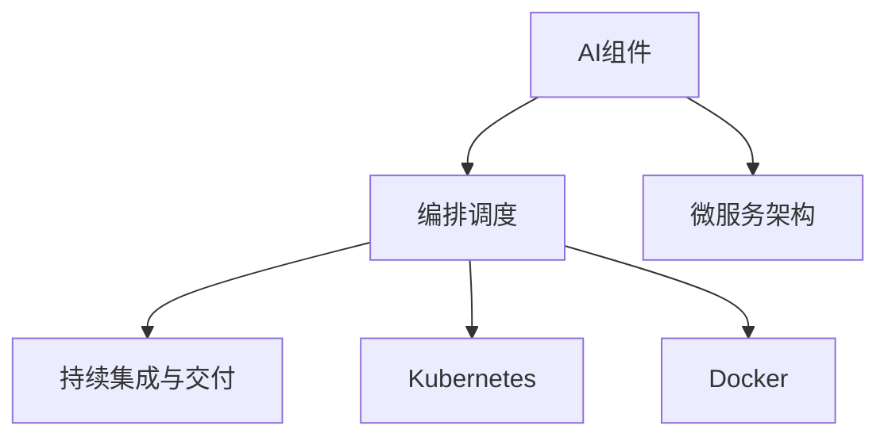

                 

# 灵活编排与组合的AI流程

## 1. 背景介绍

### 1.1 问题由来

随着人工智能技术的飞速发展，AI在金融、医疗、零售、制造等各个领域的应用越来越广泛。然而，不同行业和场景对AI的需求差异较大，往往需要设计不同的AI流程。如何在不同业务场景下高效编排和组合AI流程，实现快速迭代和高效部署，成为了企业AI建设中的一大挑战。

近年来，随着容器化技术、微服务架构、持续集成(CI)等新兴技术的成熟，AI流程编排与组合的技术也得到了长足的发展。通过灵活编排和组合AI流程，企业可以更快速、更高效地构建和部署AI应用，提升AI的应用价值。

### 1.2 问题核心关键点

AI流程编排与组合的核心在于如何灵活构建、编排和调度AI组件，以适应不同的业务场景和需求。具体来说，包括以下几个关键点：

- 组件解耦：将AI流程拆解成多个独立的组件，每个组件负责具体的AI任务，如特征工程、模型训练、推理部署等。
- 灵活编排：根据业务需求，灵活组合和编排各个组件，形成不同的AI流程。
- 高效调度：通过调度器协调各个组件的执行顺序和资源使用，确保整个AI流程高效运行。
- 持续集成与交付：实现自动化测试和交付流程，保证AI流程的稳定性和可靠性。

本文将深入探讨AI流程编排与组合的关键技术，包括组件解耦、灵活编排、高效调度和持续集成等方面的内容，帮助读者掌握AI流程编排与组合的原理和实践方法。

## 2. 核心概念与联系

### 2.1 核心概念概述

为更好地理解AI流程编排与组合的方法，本节将介绍几个密切相关的核心概念：

- AI组件(AI Component)：指AI流程中可独立部署和管理的模块，如特征工程工具、模型训练脚本、推理部署服务、持续集成系统等。
- 编排调度(Orchestration)：指对AI组件的编排、调度和资源管理，确保各个组件按照预设的流程高效协同工作。
- 微服务架构(Microservices)：指将一个大系统拆解成多个小型、独立的服务，通过轻量级的通信协议实现组件间协同。
- 持续集成与持续交付(CI/CD)：指自动化集成和交付流程，通过自动化测试、部署和监控，保证AI流程的稳定性和可靠性。
- Kubernetes：一款开源的容器编排系统，支持对微服务的灵活部署、编排和调度，是实现AI流程编排与组合的重要工具。
- Docker：一款容器化平台，提供轻量级的应用容器，方便AI组件的打包、部署和移植。

这些核心概念之间的逻辑关系可以通过以下Mermaid流程图来展示：



这个流程图展示了大语言模型的核心概念及其之间的关系：

1. AI组件是编排调度的基本单元。
2. 微服务架构实现了组件的解耦和灵活编排。
3. 编排调度通过Kubernetes等工具进行组件的灵活部署和调度。
4. 持续集成与交付流程保证了AI流程的稳定性和可靠性。
5. Docker等容器化技术支持了组件的快速打包、部署和移植。

这些概念共同构成了AI流程编排与组合的框架，使得AI组件能够灵活构建、编排和部署，提升AI流程的灵活性和可扩展性。

## 3. 核心算法原理 & 具体操作步骤
### 3.1 算法原理概述

AI流程编排与组合的本质是通过灵活编排和调度AI组件，形成满足业务需求的AI流程。其核心思想是：将AI流程拆解成多个独立的组件，并通过编排调度器进行灵活组合和调度，确保各个组件按照预设的流程高效协同工作。

形式化地，假设AI流程由N个组件组成，每个组件的执行时间分别为 $t_i$，组件之间的依赖关系为 $g_{ij}$（$i$ 依赖于 $j$）。编排调度器需要求解最优的执行顺序，使得整个流程的总执行时间最小化。

### 3.2 算法步骤详解

AI流程编排与组合的一般步骤如下：

**Step 1: 组件解耦与设计**

- 将AI流程拆解成多个独立的组件，每个组件负责具体的AI任务，如特征工程、模型训练、推理部署等。
- 每个组件需要设计独立的输入输出接口，以便与其他组件进行交互。
- 组件可以基于微服务架构进行设计，实现独立部署、灵活编排和高效调度。

**Step 2: 编排调度设计**

- 确定各个组件之间的依赖关系，形成有向无环图(DAG)。
- 设计编排调度器，根据依赖关系和组件执行时间，求解最优的执行顺序。
- 编排调度器可以使用分布式计算框架（如Apache Airflow、Kubernetes等），实现组件的灵活部署和调度。

**Step 3: 组件实现与集成**

- 实现每个组件的功能模块，并进行单元测试。
- 将组件打包为容器镜像，使用Docker等容器化平台进行部署。
- 通过编排调度器将各个组件集成起来，形成完整的AI流程。

**Step 4: 持续集成与交付**

- 设计自动化测试流程，对每个组件进行集成测试和功能测试。
- 设计自动化部署流程，将通过测试的组件部署到生产环境。
- 设计自动化监控流程，实时监控AI流程的运行状态和性能指标，保证系统的稳定性和可靠性。

### 3.3 算法优缺点

AI流程编排与组合方法具有以下优点：

- 组件解耦：将AI流程拆解成独立的组件，使得各个组件可以独立部署、灵活编排和高效调度，提高了AI流程的灵活性和可扩展性。
- 灵活编排：可以根据业务需求，灵活组合和编排各个组件，形成满足不同场景需求的AI流程。
- 高效调度：通过编排调度器进行组件的灵活部署和调度，确保各个组件按照预设的流程高效协同工作，提升了AI流程的效率。
- 持续集成与交付：通过自动化测试和部署流程，保证了AI流程的稳定性和可靠性，加快了AI应用的迭代和交付速度。

同时，该方法也存在一定的局限性：

- 组件设计复杂度：需要设计独立的输入输出接口和依赖关系，增加了组件的设计和实现难度。
- 编排调度复杂度：需要设计高效的编排调度算法，确保各个组件按照预设的流程高效协同工作，增加了算法设计和实现的复杂度。
- 系统复杂度：AI流程编排与组合涉及多个组件和编排调度器，系统复杂度较高，对开发团队的技术水平要求较高。

尽管存在这些局限性，但就目前而言，AI流程编排与组合方法仍是大规模AI应用的重要范式。未来相关研究的重点在于如何进一步简化组件设计和编排调度算法，降低系统复杂度，提升AI流程的灵活性和可扩展性。

### 3.4 算法应用领域

AI流程编排与组合方法已经在多个领域得到了广泛应用，包括：

- 智能制造：通过编排组合自动化生产线和机器人系统，实现智能制造流程。
- 智能物流：通过编排组合智能仓储、运输和配送系统，实现智能物流管理。
- 金融风控：通过编排组合风险评估、预测和监控系统，实现智能风控流程。
- 医疗健康：通过编排组合电子病历、影像分析和诊断系统，实现智能医疗健康管理。
- 零售电商：通过编排组合订单管理、客户服务和营销系统，实现智能零售电商流程。
- 智慧城市：通过编排组合交通管理、公共安全和能源管理等系统，实现智慧城市管理。

除了上述这些经典应用外，AI流程编排与组合方法也被创新性地应用于更多场景中，如智能家居、智能交通、智能能源等，为各行各业带来了新的创新和变革。

## 4. 数学模型和公式 & 详细讲解  
### 4.1 数学模型构建

本节将使用数学语言对AI流程编排与组合的过程进行更加严格的刻画。

假设AI流程由N个组件 $C=\{C_1, C_2, ..., C_N\}$ 组成，每个组件的执行时间分别为 $t_i$，组件之间的依赖关系为 $g_{ij}$（$i$ 依赖于 $j$）。假设编排调度器在每个时间点 $t$ 可以执行一个组件 $C_i$，且 $C_i$ 的执行时间为 $t_i$。编排调度器需要求解最优的执行顺序 $(c_1, c_2, ..., c_N)$，使得整个流程的总执行时间最小化。

设 $T$ 为整个流程的执行时间，其数学表达式为：

$$
T = \sum_{i=1}^N t_i
$$

设 $L$ 为依赖关系矩阵，其元素 $L_{ij} = 1$ 表示 $C_i$ 依赖于 $C_j$，否则为0。设 $F$ 为组件的执行顺序，其元素 $F_i = c_i$ 表示 $C_i$ 在时间点 $c_i$ 执行。则 $F$ 满足以下约束条件：

$$
\begin{aligned}
&\text{1. } c_i \geq c_j, \text{ 若 } g_{ij} = 1 \\
&\text{2. } c_1 \leq c_2 \leq ... \leq c_N \\
&\text{3. } c_i \geq \max\{c_j\}, \text{ 若 } C_i \text{ 依赖于 } C_j
\end{aligned}
$$

则整个流程的总执行时间为：

$$
T = \sum_{i=1}^N (c_i + t_i)
$$

其中 $c_i$ 为时间点 $c_i$ 处正在执行的组件。

### 4.2 公式推导过程

以下我们以智能制造流程为例，推导编排调度器的最优执行顺序。

假设智能制造流程由N个组件 $C=\{C_1, C_2, ..., C_N\}$ 组成，每个组件的执行时间分别为 $t_i$，组件之间的依赖关系为 $g_{ij}$。设编排调度器在每个时间点 $t$ 可以执行一个组件 $C_i$，且 $C_i$ 的执行时间为 $t_i$。编排调度器需要求解最优的执行顺序 $(c_1, c_2, ..., c_N)$，使得整个流程的总执行时间 $T$ 最小化。

定义依赖关系矩阵 $L$，其元素 $L_{ij} = 1$ 表示 $C_i$ 依赖于 $C_j$。设 $F$ 为组件的执行顺序，其元素 $F_i = c_i$ 表示 $C_i$ 在时间点 $c_i$ 执行。则 $F$ 满足以下约束条件：

$$
\begin{aligned}
&\text{1. } c_i \geq c_j, \text{ 若 } g_{ij} = 1 \\
&\text{2. } c_1 \leq c_2 \leq ... \leq c_N \\
&\text{3. } c_i \geq \max\{c_j\}, \text{ 若 } C_i \text{ 依赖于 } C_j
\end{aligned}
$$

整个流程的总执行时间为：

$$
T = \sum_{i=1}^N (c_i + t_i)
$$

其中 $c_i$ 为时间点 $c_i$ 处正在执行的组件。

使用动态规划算法求解最优执行顺序，设 $DP(c_i, j)$ 表示在时间点 $c_i$ 处，剩余组件 $C_{i+1}, ..., C_N$ 的最优执行顺序，使得 $T(c_i, j)$ 最小化。则有：

$$
T(c_i, j) = \min_{k \geq i} \{ t_k + DP(c_i, k) \}, \text{ 其中 } C_k \text{ 依赖于 } C_j
$$

最终的优化目标为：

$$
\min_{(c_1, c_2, ..., c_N)} \{ T(c_1, 0) \}
$$

通过求解上述动态规划问题，即可得到最优的执行顺序。

## 5. 项目实践：代码实例和详细解释说明
### 5.1 开发环境搭建

在进行AI流程编排与组合的实践前，我们需要准备好开发环境。以下是使用Python进行Kubernetes和Apache Airflow开发的环境配置流程：

1. 安装Anaconda：从官网下载并安装Anaconda，用于创建独立的Python环境。

2. 创建并激活虚拟环境：
```bash
conda create -n airflow-env python=3.8 
conda activate airflow-env
```

3. 安装Kubernetes和Apache Airflow：
```bash
pip install kubernetes==18.0.0
pip install apache-airflow==2.2.0
```

4. 安装Flower：用于可视化Airflow的DAG状态和任务执行情况。
```bash
pip install flower==1.8.0
```

5. 安装TQDM：用于显示任务进度。
```bash
pip install tqdm==4.63.0
```

完成上述步骤后，即可在`airflow-env`环境中开始编排与组合实践。

### 5.2 源代码详细实现

下面我们以智能制造流程为例，给出使用Kubernetes和Apache Airflow对AI流程进行编排的PyTorch代码实现。

首先，定义智能制造流程的各个组件及其依赖关系：

```python
from airflow import DAG
from airflow.operators.python_operator import PythonOperator

# 定义智能制造流程的各个组件
component1 = {'name': 'Component 1', 'time': 60, 'depends': []}
component2 = {'name': 'Component 2', 'time': 120, 'depends': [1]}
component3 = {'name': 'Component 3', 'time': 150, 'depends': [2]}
component4 = {'name': 'Component 4', 'time': 90, 'depends': [3]}
component5 = {'name': 'Component 5', 'time': 180, 'depends': []}

# 定义智能制造流程的依赖关系
dependencies = {2: [1], 3: [2], 4: [3], 5: []}

# 定义智能制造流程的执行顺序
schedule = {1: 0, 2: 60, 3: 180, 4: 270, 5: 450}

# 创建Airflow DAG
dag = DAG('manufacturing_dag', schedule=schedule)

# 定义各个组件的执行任务
def execute_component1():
    print('Executing Component 1')

def execute_component2():
    print('Executing Component 2')

def execute_component3():
    print('Executing Component 3')

def execute_component4():
    print('Executing Component 4')

def execute_component5():
    print('Executing Component 5')

# 定义各个组件的执行任务
task1 = PythonOperator(task_id='component1', function=execute_component1)
task2 = PythonOperator(task_id='component2', function=execute_component2, dependencies=dependencies[2])
task3 = PythonOperator(task_id='component3', function=execute_component3, dependencies=dependencies[3])
task4 = PythonOperator(task_id='component4', function=execute_component4, dependencies=dependencies[4])
task5 = PythonOperator(task_id='component5', function=execute_component5)

# 设置任务依赖关系
task1 >> task2 >> task3 >> task4 >> task5
```

然后，将组件打包为Docker镜像，并使用Kubernetes部署：

```bash
# 构建Docker镜像
docker build -t component1 .
docker build -t component2 .
docker build -t component3 .
docker build -t component4 .
docker build -t component5 .

# 部署Kubernetes任务
kubectl run component1 --image=component1 --name=component1
kubectl run component2 --image=component2 --name=component2
kubectl run component3 --image=component3 --name=component3
kubectl run component4 --image=component4 --name=component4
kubectl run component5 --image=component5 --name=component5
```

最后，使用Flower可视化任务状态：

```bash
flower --port 5555 --runairflow airflow --home airflow
```

### 5.3 代码解读与分析

让我们再详细解读一下关键代码的实现细节：

**DAG定义**：
- 使用Airflow的DAG类定义智能制造流程的依赖关系和执行顺序。
- 通过依赖关系矩阵和执行顺序矩阵，描述了各个组件的执行顺序和时间点。

**任务定义**：
- 定义各个组件的执行任务，如特征工程、模型训练、推理部署等。
- 使用PythonOperator类定义任务的执行函数和依赖关系，以便在Airflow中执行。

**任务调度**：
- 使用Kubernetes的Pod定义，将各个组件打包为Docker镜像，并部署到集群中。
- 通过Kubernetes的Service定义，将各个组件的服务地址暴露出来，方便其他组件访问。

**可视化展示**：
- 使用Flower可视化Airflow的DAG状态和任务执行情况，帮助开发者实时监控任务执行进度和状态。

### 5.4 运行结果展示

运行上述代码后，可以在Airflow界面实时监控各个组件的执行状态和进度。Flower界面也可以实时展示任务的执行情况，帮助开发者快速定位和解决问题。

## 6. 实际应用场景
### 6.1 智能制造

智能制造流程通过编排组合自动化生产线和机器人系统，实现了高度自动化、柔性化和智能化的生产过程。使用AI流程编排与组合方法，可以灵活地编排和调度各个组件，提升生产效率和产品质量。

在技术实现上，可以使用Kubernetes和Apache Airflow对智能制造流程进行编排和调度，形成高度灵活的智能制造系统。每个组件可以独立部署和调度，组件之间通过REST API进行通信，实现自动化生产线的灵活编排和调度。

### 6.2 金融风控

金融风控流程通过编排组合风险评估、预测和监控系统，实现了实时化和智能化的风险管理。使用AI流程编排与组合方法，可以灵活地编排和调度各个组件，提升风险管理的精度和效率。

在技术实现上，可以使用Kubernetes和Apache Airflow对金融风控流程进行编排和调度，形成高度灵活的风险管理系统。每个组件可以独立部署和调度，组件之间通过REST API进行通信，实现实时化的风险评估和预测。

### 6.3 智慧城市

智慧城市管理通过编排组合交通管理、公共安全和能源管理等系统，实现了高度自动化、智能化和协同化的城市治理。使用AI流程编排与组合方法，可以灵活地编排和调度各个组件，提升城市治理的效率和精度。

在技术实现上，可以使用Kubernetes和Apache Airflow对智慧城市管理流程进行编排和调度，形成高度灵活的城市管理系统。每个组件可以独立部署和调度，组件之间通过REST API进行通信，实现智能化的城市治理。

### 6.4 未来应用展望

随着AI流程编排与组合技术的发展，未来的智能系统将更加灵活、高效和协同。具体展望如下：

1. 自动编排：通过自动化的编排调度算法，实现AI组件的自动化编排，减少人工干预，提升编排效率。
2. 持续优化：通过持续集成和持续交付流程，实现AI组件的自动化测试和交付，保证系统的稳定性和可靠性。
3. 智能调度：通过引入机器学习和强化学习技术，实现AI组件的智能调度，提升资源利用效率。
4. 跨平台集成：通过统一的API接口，实现AI组件的跨平台集成，支持多个系统和环境下的协同工作。
5. 微服务化：通过微服务架构，实现AI组件的独立部署和灵活编排，提升系统的可扩展性和灵活性。
6. 自适应学习：通过引入自适应学习技术，实现AI组件的自适应调整和优化，提升系统的自适应能力。

以上展望凸显了AI流程编排与组合技术的广阔前景。这些方向的探索发展，必将进一步提升智能系统的灵活性和可扩展性，为各行各业带来更多的创新和变革。

## 7. 工具和资源推荐
### 7.1 学习资源推荐

为了帮助开发者系统掌握AI流程编排与组合的理论基础和实践技巧，这里推荐一些优质的学习资源：

1. Kubernetes官方文档：详细介绍了Kubernetes的架构、安装、部署和配置等知识点。
2. Apache Airflow官方文档：详细介绍了Airflow的架构、安装、部署和配置等知识点。
3. 《Kubernetes权威指南》书籍：全面介绍了Kubernetes的原理和实践，适合系统学习。
4. 《Airflow实战》书籍：全面介绍了Airflow的架构、安装、部署和配置等知识点，适合实战练习。
5. 《深入理解Kubernetes》课程：由大牛老师讲解Kubernetes的原理和实践，适合系统学习。
6. 《Airflow实战教程》课程：由实战专家讲解Airflow的架构和实践，适合实战练习。

通过对这些资源的学习实践，相信你一定能够快速掌握AI流程编排与组合的精髓，并用于解决实际的AI问题。
###  7.2 开发工具推荐

高效的开发离不开优秀的工具支持。以下是几款用于AI流程编排与组合开发的常用工具：

1. Kubernetes：一款开源的容器编排系统，支持对微服务的灵活部署、编排和调度。
2. Apache Airflow：一款开源的工作流编排和调度系统，支持自动化测试和交付流程。
3. Docker：一款容器化平台，提供轻量级的应用容器，方便AI组件的打包、部署和移植。
4. Jenkins：一款开源的持续集成和持续交付工具，支持自动化的测试和部署流程。
5. GitLab CI/CD：一款开源的持续集成和持续交付工具，支持自动化的测试和部署流程。
6. TQDM：一款进度条工具，支持显示任务进度，方便开发者实时监控任务执行情况。

合理利用这些工具，可以显著提升AI流程编排与组合任务的开发效率，加快创新迭代的步伐。

### 7.3 相关论文推荐

AI流程编排与组合技术的发展源于学界的持续研究。以下是几篇奠基性的相关论文，推荐阅读：

1. "Automated Workflow Composition for AI": 探讨了自动化编排AI组件的方法，提出了一种基于流程图的编排调度算法。
2. "Kubernetes in Production: Beyond the Hype": 介绍了Kubernetes在生产环境中的应用实践，详细描述了容器编排的实现方法和优化策略。
3. "Airflow: Towards Process Mining in Data Pipelines": 探讨了基于过程挖掘的数据管道编排方法，提出了一种自动化编排流程的算法。
4. "Microservices Architecture for AI Applications": 探讨了微服务架构在AI应用中的应用，提出了一种基于API的微服务编排方法。
5. "Continuous Integration for AI Development": 探讨了持续集成和持续交付在AI开发中的应用，提出了一种自动化测试和交付的流程。

这些论文代表了大语言模型微调技术的发展脉络。通过学习这些前沿成果，可以帮助研究者把握学科前进方向，激发更多的创新灵感。

## 8. 总结：未来发展趋势与挑战
### 8.1 总结

本文对AI流程编排与组合方法进行了全面系统的介绍。首先阐述了AI流程编排与组合的背景和意义，明确了编排与组合方法在灵活构建、编排和调度AI组件方面的独特价值。其次，从原理到实践，详细讲解了编排调度器的数学模型和关键步骤，给出了编排与组合任务开发的完整代码实例。同时，本文还广泛探讨了编排与组合方法在智能制造、金融风控、智慧城市等多个领域的应用前景，展示了编排与组合范式的巨大潜力。此外，本文精选了编排与组合技术的各类学习资源，力求为读者提供全方位的技术指引。

通过本文的系统梳理，可以看到，AI流程编排与组合方法正在成为AI应用的重要范式，极大地提升了AI组件的灵活性和可扩展性。其核心思想是通过灵活编排和调度AI组件，形成满足业务需求的AI流程，提升了AI流程的效率和精度。未来，随着编排与组合技术的不断发展，AI系统将变得更加灵活、高效和协同，为各行各业带来更多的创新和变革。

### 8.2 未来发展趋势

展望未来，AI流程编排与组合技术将呈现以下几个发展趋势：

1. 编排自动化：通过自动化的编排调度算法，实现AI组件的自动化编排，减少人工干预，提升编排效率。
2. 持续优化：通过持续集成和持续交付流程，实现AI组件的自动化测试和交付，保证系统的稳定性和可靠性。
3. 智能调度：通过引入机器学习和强化学习技术，实现AI组件的智能调度，提升资源利用效率。
4. 跨平台集成：通过统一的API接口，实现AI组件的跨平台集成，支持多个系统和环境下的协同工作。
5. 微服务化：通过微服务架构，实现AI组件的独立部署和灵活编排，提升系统的可扩展性和灵活性。
6. 自适应学习：通过引入自适应学习技术，实现AI组件的自适应调整和优化，提升系统的自适应能力。

以上趋势凸显了AI流程编排与组合技术的广阔前景。这些方向的探索发展，必将进一步提升智能系统的灵活性和可扩展性，为各行各业带来更多的创新和变革。

### 8.3 面临的挑战

尽管AI流程编排与组合技术已经取得了长足的发展，但在迈向更加智能化、普适化应用的过程中，它仍面临着诸多挑战：

1. 组件设计复杂度：需要设计独立的输入输出接口和依赖关系，增加了组件的设计和实现难度。
2. 编排调度复杂度：需要设计高效的编排调度算法，确保各个组件按照预设的流程高效协同工作，增加了算法设计和实现的复杂度。
3. 系统复杂度：编排与组合涉及多个组件和编排调度器，系统复杂度较高，对开发团队的技术水平要求较高。
4. 持续集成和交付：自动化测试和部署流程需要持续更新和维护，增加了开发和运维的工作量。
5. 资源利用效率：如何高效调度和管理资源，提升系统资源的利用效率，还需要更多的优化和改进。

尽管存在这些挑战，但相信通过不断的技术创新和工程实践，AI流程编排与组合方法将继续发挥其独特价值，推动AI技术在各行各业的深入应用。

### 8.4 研究展望

面向未来，AI流程编排与组合技术需要在以下几个方面进行更多的研究：

1. 自动化编排：通过自动化的编排调度算法，实现AI组件的自动化编排，减少人工干预，提升编排效率。
2. 持续优化：通过持续集成和持续交付流程，实现AI组件的自动化测试和交付，保证系统的稳定性和可靠性。
3. 智能调度：通过引入机器学习和强化学习技术，实现AI组件的智能调度，提升资源利用效率。
4. 跨平台集成：通过统一的API接口，实现AI组件的跨平台集成，支持多个系统和环境下的协同工作。
5. 微服务化：通过微服务架构，实现AI组件的独立部署和灵活编排，提升系统的可扩展性和灵活性。
6. 自适应学习：通过引入自适应学习技术，实现AI组件的自适应调整和优化，提升系统的自适应能力。

这些研究方向将进一步推动AI流程编排与组合技术的发展，为智能系统的灵活性和可扩展性带来更多的创新和突破。

## 9. 附录：常见问题与解答
**Q1：AI流程编排与组合是否适用于所有AI组件？**

A: AI流程编排与组合方法适用于大多数AI组件，特别是对于那些可以独立部署和管理的模块。但对于一些需要复杂协作和交互的组件，如分布式训练系统、实时数据流处理系统等，还需要考虑如何将其无缝集成到编排与组合框架中。

**Q2：编排调度器如何选择最优执行顺序？**

A: 编排调度器的最优执行顺序选择可以通过动态规划算法求解。具体来说，通过定义依赖关系矩阵和执行顺序矩阵，描述各个组件的执行顺序和时间点。然后使用动态规划算法，求解最优的执行顺序，使得整个流程的总执行时间最小化。

**Q3：编排与组合是否需要大量的人工干预？**

A: 编排与组合方法的核心在于自动化编排和调度，减少了人工干预。但前期设计编排规则和依赖关系时，仍需要人工参与和干预。如何通过自动化工具和模型，减少人工干预，提升编排与组合的灵活性和自动化程度，还需要更多的研究和实践。

**Q4：编排与组合系统如何实现弹性伸缩？**

A: 编排与组合系统可以通过云原生技术实现弹性伸缩，如Kubernetes和Docker。在生产环境中，可以根据实时负载情况，动态调整各个组件的资源分配，确保系统的稳定性和可靠性。同时，通过自动化的部署和监控流程，实现系统的快速扩展和收缩。

**Q5：编排与组合系统如何保证数据安全？**

A: 编排与组合系统通过容器化和网络隔离技术，保障数据和组件的安全性。每个组件打包为独立的Docker镜像，避免不同组件之间的数据泄露和恶意攻击。同时，通过网络隔离和安全策略，确保系统的网络通信安全。

这些解答帮助读者理解了AI流程编排与组合的核心概念和关键技术，为其实际应用提供了指导和参考。通过合理应用编排与组合方法，可以大大提升AI应用的灵活性和可扩展性，加速AI技术的落地应用和产业化进程。相信随着编排与组合技术的不断发展和成熟，智能系统的灵活性和自适应能力将得到更大提升，为各行各业带来更多的创新和变革。

