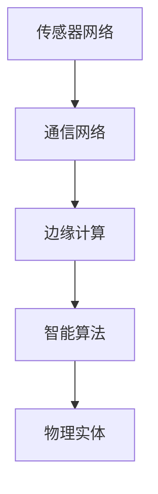

                 

# 物理实体自动化的最新发展

## 1. 背景介绍

### 1.1 问题由来
近年来，随着物联网(IoT)技术和大数据的发展，物理实体自动化成为了智能制造、智慧城市、智能家居等领域的热点话题。物理实体自动化指的是通过传感器、通信网络、计算机算法等技术手段，对物理世界的实体对象进行感知、监测、控制和优化，以实现智能化的自动化管理。物理实体自动化的发展，对提高生产效率、降低运营成本、提升生活质量等方面具有重要意义。

### 1.2 问题核心关键点
物理实体自动化涉及多个核心关键点，包括传感器数据获取、通信网络构建、边缘计算应用、智能算法设计等。其中，智能算法是实现物理实体自动化的核心环节。本节将详细介绍智能算法的基本原理、架构和应用场景，为理解物理实体自动化的最新发展打下基础。

## 2. 核心概念与联系

### 2.1 核心概念概述

为更好地理解物理实体自动化的最新发展，本节将介绍几个密切相关的核心概念：

- 物理实体：指的是存在于物理世界中的实体对象，如工厂的机械装备、城市中的路灯、家居中的家电设备等。物理实体的自动化是指通过传感器、通信网络、计算机算法等技术手段，对这些实体进行智能管理和控制。
- 传感器网络：由多个传感器节点组成的网络，用于感知物理实体的状态和环境信息。传感器网络通常分为传感器节点、汇聚节点、基站等层次结构。
- 通信网络：用于传输传感器网络获取的数据，实现不同设备之间的通信和信息共享。
- 边缘计算：在靠近数据源的本地设备上进行数据处理和分析，以减少延迟、降低网络带宽消耗，提高数据处理的实时性和效率。
- 智能算法：包括机器学习、深度学习、强化学习等多种算法，用于从传感器网络获取的数据中提取知识，实现物理实体的自动化控制和优化。

这些核心概念之间的逻辑关系可以通过以下Mermaid流程图来展示：



这个流程图展示出物理实体自动化的主要流程：首先通过传感器网络获取物理实体的状态信息，然后通过通信网络将这些信息传输到边缘计算设备上，最后由智能算法对数据进行分析，实现对物理实体的控制和优化。

## 3. 核心算法原理 & 具体操作步骤
### 3.1 算法原理概述

物理实体自动化涉及多种智能算法，包括基于规则的决策控制、机器学习、深度学习、强化学习等。其中，基于规则的决策控制是最简单的自动化方法，通过编写条件语句和动作指令，实现对物理实体的自动化管理。而机器学习、深度学习和强化学习等复杂算法，则能够从传感器网络获取的大量数据中提取更丰富的知识，实现更高层次的自动化控制。

### 3.2 算法步骤详解

以机器学习为例，物理实体自动化的基本流程包括：

1. **数据采集与预处理**：通过传感器网络获取物理实体的状态信息，如温度、湿度、位置、速度等，并进行数据清洗和预处理。

2. **特征工程**：从原始数据中提取有用的特征，构建特征向量，用于训练机器学习模型。

3. **模型训练**：选择合适的机器学习模型，如线性回归、决策树、随机森林、神经网络等，利用历史数据进行模型训练。

4. **模型验证与调参**：在验证集上评估模型性能，根据性能指标调整模型参数，直到达到最优性能。

5. **模型应用**：将训练好的模型应用于实际物理实体，进行状态预测和控制决策。

6. **实时优化**：实时监测物理实体的状态变化，根据新的数据对模型进行动态优化，保持系统的稳定性和鲁棒性。

### 3.3 算法优缺点

基于机器学习的物理实体自动化方法具有以下优点：

- 能够从大量数据中提取复杂知识，实现高精度的状态预测和控制决策。
- 适用于各种复杂场景，能够适应不同类型和规模的物理实体。
- 可以通过在线学习和动态优化，保持系统的实时性和高效性。

同时，该方法也存在以下局限性：

- 对数据质量要求较高，数据缺失或异常会导致模型性能下降。
- 模型训练和部署需要较大的计算资源和时间。
- 模型性能和稳定性可能受限于特定的应用场景，难以推广到其他领域。

### 3.4 算法应用领域

物理实体自动化方法已经在智能制造、智慧城市、智能家居、智能交通等多个领域得到广泛应用。

- 智能制造：通过传感器网络实时监测生产线上的机械装备状态，预测设备故障，优化生产流程，提升生产效率。
- 智慧城市：利用传感器网络监测城市基础设施状态，如路灯亮度、交通流量、环境污染等，实现城市管理自动化。
- 智能家居：通过传感器网络监测家庭环境，如温度、湿度、安防状态等，实现家居设备的智能控制和优化。
- 智能交通：利用传感器网络监测交通流量和路况，优化交通信号控制，减少交通拥堵，提高通行效率。

## 4. 数学模型和公式 & 详细讲解 & 举例说明

### 4.1 数学模型构建

物理实体自动化的数学模型构建通常基于机器学习和深度学习的方法，利用传感器数据进行状态预测和控制决策。以下以线性回归模型为例，展示物理实体自动化的数学模型构建过程。

设物理实体的状态向量为 $\mathbf{x} \in \mathbb{R}^n$，目标状态为 $\mathbf{y} \in \mathbb{R}$，根据历史数据集 $D=\{(\mathbf{x}_i, y_i)\}_{i=1}^m$，利用线性回归模型预测目标状态 $y$，其数学表达式为：

$$
y = \mathbf{w}^T \mathbf{x} + b
$$

其中 $\mathbf{w} \in \mathbb{R}^n$ 为模型参数，$b \in \mathbb{R}$ 为偏置项。

### 4.2 公式推导过程

线性回归模型的最小二乘损失函数定义为：

$$
\mathcal{L}(\mathbf{w}, b) = \frac{1}{2m} \sum_{i=1}^m (\mathbf{w}^T \mathbf{x}_i + b - y_i)^2
$$

通过对损失函数求导，得到参数 $\mathbf{w}$ 和 $b$ 的估计值：

$$
\mathbf{w} = (\mathbf{X}^T \mathbf{X})^{-1} \mathbf{X}^T \mathbf{y}, \quad b = \bar{y} - \mathbf{w}^T \bar{\mathbf{x}}
$$

其中 $\mathbf{X} = [\mathbf{x}_1, \mathbf{x}_2, \dots, \mathbf{x}_m] \in \mathbb{R}^{m \times n}$ 为特征矩阵，$\bar{y} = \frac{1}{m} \sum_{i=1}^m y_i$ 为样本均值，$\bar{\mathbf{x}} = \frac{1}{m} \sum_{i=1}^m \mathbf{x}_i$ 为特征均值。

### 4.3 案例分析与讲解

以智能制造中的设备状态预测为例，假设我们要预测一个设备的剩余使用寿命。我们可以收集该设备的温度、振动、电流等传感器数据，利用线性回归模型对这些数据进行训练，得到一个状态预测模型。具体步骤如下：

1. 收集设备的历史传感器数据 $\mathbf{X} \in \mathbb{R}^{m \times n}$，其中每行表示一个时间点的传感器数据，每个特征表示一种传感器类型。

2. 收集设备的历史状态数据 $\mathbf{y} \in \mathbb{R}^m$，其中每个元素表示设备在相应时间点的剩余使用寿命。

3. 利用线性回归模型，计算得到模型参数 $\mathbf{w}$ 和 $b$：

$$
\mathbf{w} = (\mathbf{X}^T \mathbf{X})^{-1} \mathbf{X}^T \mathbf{y}, \quad b = \bar{y} - \mathbf{w}^T \bar{\mathbf{x}}
$$

4. 将新的传感器数据 $\mathbf{x}$ 输入模型，得到设备在当前状态下的预测使用寿命：

$$
y = \mathbf{w}^T \mathbf{x} + b
$$

通过该模型，我们可以在设备运行过程中实时预测其状态，从而及时进行维护和更换，避免设备故障带来的损失。

## 5. 项目实践：代码实例和详细解释说明
### 5.1 开发环境搭建

在进行物理实体自动化项目实践前，我们需要准备好开发环境。以下是使用Python进行TensorFlow开发的环境配置流程：

1. 安装Anaconda：从官网下载并安装Anaconda，用于创建独立的Python环境。

2. 创建并激活虚拟环境：
```bash
conda create -n tf-env python=3.8 
conda activate tf-env
```

3. 安装TensorFlow：根据CUDA版本，从官网获取对应的安装命令。例如：
```bash
conda install tensorflow-gpu=2.6 -c tf -c conda-forge
```

4. 安装各类工具包：
```bash
pip install numpy pandas scikit-learn matplotlib tqdm jupyter notebook ipython
```

完成上述步骤后，即可在`tf-env`环境中开始物理实体自动化的开发实践。

### 5.2 源代码详细实现

这里我们以智能制造中的设备状态预测为例，给出使用TensorFlow进行物理实体自动化的PyTorch代码实现。

首先，定义训练数据集：

```python
import tensorflow as tf
import numpy as np

# 假设收集到的设备传感器数据和状态数据
sensor_data = np.random.rand(100, 5)  # 5种传感器数据
state_data = np.random.rand(100)     # 设备状态

# 将传感器数据和状态数据打包成TensorFlow数据集
dataset = tf.data.Dataset.from_tensor_slices((sensor_data, state_data))

# 定义模型输入和输出
input_tensor = tf.keras.Input(shape=(5,))
output_tensor = tf.keras.layers.Dense(1)(input_tensor)
model = tf.keras.Model(inputs=input_tensor, outputs=output_tensor)

# 定义损失函数和优化器
loss_fn = tf.keras.losses.MeanSquaredError()
optimizer = tf.keras.optimizers.Adam()

# 定义训练过程
@tf.function
def train_step(input, target):
    with tf.GradientTape() as tape:
        predictions = model(input)
        loss = loss_fn(target, predictions)
    gradients = tape.gradient(loss, model.trainable_variables)
    optimizer.apply_gradients(zip(gradients, model.trainable_variables))
    return loss

# 训练模型
model.compile(optimizer=optimizer, loss=loss_fn)
dataset = dataset.shuffle(buffer_size=1024).batch(batch_size=32)
history = model.fit(dataset, epochs=10, validation_split=0.2)
```

然后，定义模型预测函数：

```python
# 定义模型预测函数
@tf.function
def predict_state(sensor_data):
    predictions = model(tf.convert_to_tensor(sensor_data))
    return predictions.numpy()[0][0]
```

最后，启动训练流程并在测试集上评估：

```python
# 预测一个新样本的状态
sensor_data = np.random.rand(1, 5)
predicted_state = predict_state(sensor_data)
print(f"Predicted state: {predicted_state}")
```

以上就是使用TensorFlow对设备状态进行预测的完整代码实现。可以看到，TensorFlow提供了丰富的API和工具，可以方便地构建、训练和评估物理实体自动化的模型。

### 5.3 代码解读与分析

让我们再详细解读一下关键代码的实现细节：

**训练数据集定义**：
- `sensor_data`：随机生成的设备传感器数据，形状为 $(100, 5)$，表示有5种传感器数据。
- `state_data`：随机生成的设备状态数据，形状为 $(100)$，表示有100个状态数据。
- `dataset`：将传感器数据和状态数据打包成TensorFlow数据集，用于训练模型。

**模型定义**：
- `input_tensor`：定义模型输入张量，形状为 $(5)$，表示输入的传感器数据。
- `output_tensor`：定义模型输出张量，形状为 $(1)$，表示预测的设备状态。
- `model`：定义模型结构，使用一个全连接层进行状态预测。

**损失函数和优化器定义**：
- `loss_fn`：定义均方误差损失函数，用于计算模型预测值和真实值之间的差异。
- `optimizer`：定义Adam优化器，用于更新模型参数。

**训练过程定义**：
- `train_step`函数：定义一个训练步骤，计算损失并更新模型参数。
- `dataset`：定义数据集，并使用 `shuffle` 和 `batch` 方法进行数据增强。
- `model.fit`：使用 `fit` 方法训练模型，定义训练轮数和验证集占比。

**模型预测函数定义**：
- `predict_state`函数：定义一个预测函数，将传感器数据输入模型，得到预测的设备状态。

**模型测试**：
- 随机生成一个传感器数据样本，调用 `predict_state` 函数进行状态预测，并输出预测结果。

可以看到，TensorFlow提供了简洁高效的API，使得物理实体自动化的模型开发和训练变得非常便捷。开发者可以将更多精力放在模型设计和调参上，而不必过多关注底层的实现细节。

当然，在实际应用中，还需要考虑更多的因素，如模型的保存和部署、超参数的自动搜索、数据增强和数据预处理等。但核心的物理实体自动化模型基本与此类似。

## 6. 实际应用场景
### 6.1 智能制造

智能制造是物理实体自动化的典型应用场景之一，通过传感器网络实时监测生产线上的机械装备状态，预测设备故障，优化生产流程，提升生产效率。

在技术实现上，可以收集生产线上的各种传感器数据，如温度、振动、电流等，构建物理实体自动化的数据集。利用机器学习或深度学习模型，对这些数据进行训练，得到一个状态预测模型。然后将模型应用于实际生产环境，实时监测设备状态，及时进行维护和更换，避免设备故障带来的损失。

### 6.2 智慧城市

智慧城市也是物理实体自动化的重要应用领域，通过传感器网络实时监测城市基础设施状态，如路灯亮度、交通流量、环境污染等，实现城市管理自动化。

具体而言，可以收集城市的各种传感器数据，如路灯亮度传感器、交通流量传感器、环境污染传感器等，构建智慧城市的数据集。利用机器学习或深度学习模型，对这些数据进行训练，得到一个状态预测模型。然后将模型应用于城市管理系统中，实时监测基础设施状态，优化路灯亮度、交通信号、环保设施等，提高城市管理的智能化水平。

### 6.3 智能家居

智能家居是物理实体自动化的另一重要应用领域，通过传感器网络实时监测家庭环境，如温度、湿度、安防状态等，实现家居设备的智能控制和优化。

具体而言，可以收集家庭中的各种传感器数据，如温度传感器、湿度传感器、门窗传感器等，构建智能家居的数据集。利用机器学习或深度学习模型，对这些数据进行训练，得到一个状态预测模型。然后将模型应用于智能家居系统中，实时监测家庭环境，智能控制家电设备，提升居住体验。

### 6.4 未来应用展望

随着物理实体自动化技术的不断发展，未来将有更多场景得到应用，为生产、生活带来新的变革。

在工业自动化领域，物理实体自动化技术将进一步提升生产线的智能化水平，实现大规模定制化生产，提高生产效率和产品质量。

在智慧城市建设中，物理实体自动化技术将进一步提升城市管理的智能化水平，实现交通流量优化、环保设施智能调控等，提高城市的运行效率和生活质量。

在智能家居领域，物理实体自动化技术将进一步提升家居设备的智能化水平，实现智能化的家居环境控制，提升居住体验。

总之，物理实体自动化技术将在更多领域得到应用，为生产、生活带来新的变革，为社会进步和经济发展注入新的动力。

## 7. 工具和资源推荐
### 7.1 学习资源推荐

为了帮助开发者系统掌握物理实体自动化的理论基础和实践技巧，这里推荐一些优质的学习资源：

1. 《TensorFlow从入门到实践》系列博文：由TensorFlow开发者团队撰写，深入浅出地介绍了TensorFlow的各个组件和应用场景。

2. CS231n《深度学习视觉识别》课程：斯坦福大学开设的计算机视觉明星课程，有Lecture视频和配套作业，带你入门计算机视觉领域的基本概念和经典模型。

3. 《深度学习理论与实践》书籍：DeepLearning.ai的深度学习系列课程，全面介绍了深度学习的基础知识和应用案例，包括物理实体自动化等前沿话题。

4. TensorFlow官方文档：TensorFlow的官方文档，提供了丰富的API和样例代码，是上手实践的必备资料。

5. ArXiv预印本：学术界最新的研究论文，涵盖物理实体自动化、智能制造、智慧城市等各个领域，可以获取最新的学术动态和技术进展。

通过对这些资源的学习实践，相信你一定能够快速掌握物理实体自动化的精髓，并用于解决实际的NLP问题。
###  7.2 开发工具推荐

高效的开发离不开优秀的工具支持。以下是几款用于物理实体自动化开发的常用工具：

1. TensorFlow：由Google主导开发的开源深度学习框架，生产部署方便，适合大规模工程应用。同样有丰富的预训练语言模型资源。

2. PyTorch：基于Python的开源深度学习框架，灵活动态的计算图，适合快速迭代研究。大部分预训练语言模型都有PyTorch版本的实现。

3. Weights & Biases：模型训练的实验跟踪工具，可以记录和可视化模型训练过程中的各项指标，方便对比和调优。与主流深度学习框架无缝集成。

4. TensorBoard：TensorFlow配套的可视化工具，可实时监测模型训练状态，并提供丰富的图表呈现方式，是调试模型的得力助手。

5. Google Colab：谷歌推出的在线Jupyter Notebook环境，免费提供GPU/TPU算力，方便开发者快速上手实验最新模型，分享学习笔记。

合理利用这些工具，可以显著提升物理实体自动化的开发效率，加快创新迭代的步伐。

### 7.3 相关论文推荐

物理实体自动化领域的研究源于学界的持续研究。以下是几篇奠基性的相关论文，推荐阅读：

1. A Survey on Internet of Things (IoT) Security: Threats and Defense Mechanisms：综述物联网安全现状及防御机制，为物理实体自动化提供安全保障。

2. Physical Internet: Concept, Methodology and Basic Architecture：提出物理互联网概念，阐述物理实体自动化的架构和方法，为未来研究提供理论基础。

3. Smart Manufacturing Data Analytics and Visualization：利用大数据和机器学习技术，对智能制造数据进行分析和可视化，提升智能制造效率。

4. IoT-Based Smart Home: From Collecting to Thinking to Caring：研究基于物联网的智能家居系统，实现家庭环境的自动化控制和优化。

5. Internet of Things (IoT) Technologies in Smart City Planning：讨论物联网技术在智慧城市规划中的应用，提升智慧城市的智能化水平。

这些论文代表了大物理实体自动化领域的发展脉络。通过学习这些前沿成果，可以帮助研究者把握学科前进方向，激发更多的创新灵感。

## 8. 总结：未来发展趋势与挑战

### 8.1 总结

本文对物理实体自动化的最新发展进行了全面系统的介绍。首先阐述了物理实体自动化的研究背景和意义，明确了物理实体自动化的核心环节和应用场景。其次，从原理到实践，详细讲解了物理实体自动化的数学模型和关键算法，给出了物理实体自动化模型开发的完整代码实例。同时，本文还广泛探讨了物理实体自动化在智能制造、智慧城市、智能家居等多个领域的应用前景，展示了物理实体自动化的广阔前景。此外，本文精选了物理实体自动化的各类学习资源，力求为读者提供全方位的技术指引。

通过本文的系统梳理，可以看到，物理实体自动化技术正在成为智能制造、智慧城市、智能家居等领域的重要范式，极大地提升了生产效率、降低了运营成本、提升了生活质量。未来，伴随物理实体自动化技术的不断发展，必将进一步拓展其实用场景，为社会进步和经济发展注入新的动力。

### 8.2 未来发展趋势

展望未来，物理实体自动化技术将呈现以下几个发展趋势：

1. 传感器技术的发展。未来的传感器将具备更高的精度和更广的覆盖范围，能够实时感知更多维度的物理实体状态，提供更全面、更准确的数据支持。

2. 边缘计算的普及。随着5G等通信技术的普及，边缘计算设备将变得更加普及，能够实时处理本地数据，提高数据处理的效率和实时性。

3. 机器学习模型的进化。未来的物理实体自动化将进一步集成先进的机器学习模型，如深度学习、强化学习等，提升模型精度和适应性。

4. 数据驱动的决策优化。通过集成更多的数据源和数据融合技术，物理实体自动化将实现更智能的决策优化，提升系统的智能水平。

5. 跨领域应用的推广。物理实体自动化技术将在更多领域得到应用，如智慧农业、智慧医疗、智慧交通等，推动各行业的数字化转型。

以上趋势凸显了物理实体自动化技术的广阔前景。这些方向的探索发展，必将进一步提升物理实体自动化的性能和应用范围，为社会进步和经济发展注入新的动力。

### 8.3 面临的挑战

尽管物理实体自动化技术已经取得了瞩目成就，但在迈向更加智能化、普适化应用的过程中，它仍面临着诸多挑战：

1. 数据隐私和安全问题。物理实体自动化涉及大量的传感器数据，如何保护数据隐私和安全，避免数据泄露和滥用，是一个重要的挑战。

2. 模型性能和可靠性。物理实体自动化模型需要具备高精度和鲁棒性，能够应对各种异常情况，避免因模型错误导致的安全事故。

3. 计算资源和成本问题。物理实体自动化需要大量的计算资源进行模型训练和推理，如何降低计算成本，提高系统效率，是一个重要的挑战。

4. 标准化和互操作性。物理实体自动化技术需要在不同设备、不同系统和不同领域之间实现标准化和互操作性，避免信息孤岛和数据不兼容的问题。

5. 政策法规和伦理问题。物理实体自动化技术需要符合相关的法律法规，避免对人类权利和伦理造成侵犯，如隐私权、知情权等。

正视物理实体自动化面临的这些挑战，积极应对并寻求突破，将是大物理实体自动化技术走向成熟的必由之路。相信随着学界和产业界的共同努力，这些挑战终将一一被克服，物理实体自动化必将在构建智能社会中扮演越来越重要的角色。

### 8.4 研究展望

面对物理实体自动化所面临的种种挑战，未来的研究需要在以下几个方面寻求新的突破：

1. 引入更多的多模态信息。未来的物理实体自动化将进一步集成视觉、听觉、触觉等多模态信息，提升系统的感知能力和智能化水平。

2. 引入更多的先验知识。将符号化的先验知识，如知识图谱、逻辑规则等，与神经网络模型进行巧妙融合，引导物理实体自动化的微调过程，提高系统的智能水平。

3. 引入更加复杂的网络结构。未来的物理实体自动化将进一步引入更加复杂的网络结构，如卷积神经网络、变分自编码器等，提升模型精度和适应性。

4. 引入更加高效的优化算法。未来的物理实体自动化将引入更加高效的优化算法，如分布式优化、差分隐私等，提升模型的性能和可靠性。

5. 引入更加智能的决策机制。未来的物理实体自动化将引入更加智能的决策机制，如因果推断、强化学习等，提升系统的智能水平和决策效果。

6. 引入更加稳健的鲁棒性机制。未来的物理实体自动化将引入更加稳健的鲁棒性机制，如对抗样本训练、模型校验等，提升系统的稳定性和鲁棒性。

这些研究方向的探索，必将引领物理实体自动化技术迈向更高的台阶，为构建智能社会提供新的技术路径。面向未来，物理实体自动化技术还需要与其他人工智能技术进行更深入的融合，如知识表示、因果推理、强化学习等，多路径协同发力，共同推动智能社会的进步。只有勇于创新、敢于突破，才能不断拓展物理实体自动化的边界，让智能技术更好地造福人类社会。

## 9. 附录：常见问题与解答

**Q1：物理实体自动化的主要应用场景有哪些？**

A: 物理实体自动化的主要应用场景包括智能制造、智慧城市、智能家居、智能交通等。

**Q2：物理实体自动化的主要算法有哪些？**

A: 物理实体自动化的主要算法包括基于规则的决策控制、机器学习、深度学习、强化学习等。

**Q3：物理实体自动化面临的主要挑战有哪些？**

A: 物理实体自动化面临的主要挑战包括数据隐私和安全问题、模型性能和可靠性问题、计算资源和成本问题、标准化和互操作性问题、政策法规和伦理问题等。

**Q4：物理实体自动化的未来发展趋势有哪些？**

A: 物理实体自动化的未来发展趋势包括传感器技术的发展、边缘计算的普及、机器学习模型的进化、数据驱动的决策优化、跨领域应用的推广等。

**Q5：如何保障物理实体自动化的数据隐私和安全？**

A: 保障物理实体自动化的数据隐私和安全需要采取多种措施，如数据加密、访问控制、差分隐私等，确保数据的合法使用和保护。

通过本文的系统梳理，可以看到，物理实体自动化技术正在成为智能制造、智慧城市、智能家居等领域的重要范式，极大地提升了生产效率、降低了运营成本、提升了生活质量。未来，伴随物理实体自动化技术的不断发展，必将进一步拓展其实用场景，为社会进步和经济发展注入新的动力。

---

作者：禅与计算机程序设计艺术 / Zen and the Art of Computer Programming

