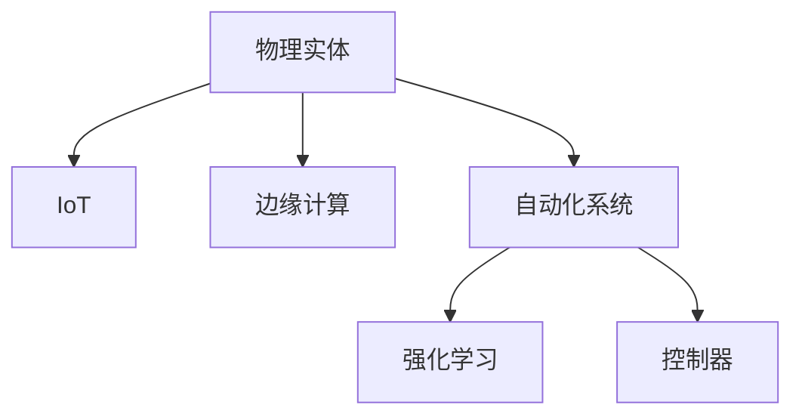

                 

## 1. 背景介绍

在现代社会，物理实体的自动化已成为推动各行各业发展的重要力量。无论是制造业、物流业还是零售业，物理实体的自动化都为提高效率、降低成本、提升用户体验提供了强大支持。

### 1.1 问题由来

随着物联网(IoT)、人工智能(AI)、机器人技术等前沿技术的兴起，物理实体自动化领域的技术也在不断进步。然而，技术实施过程中依然存在诸多挑战：如何实现物理实体与数字系统的无缝对接、如何构建高效稳定的通信网络、如何确保系统的可靠性和安全性等。

### 1.2 问题核心关键点

物理实体自动化的核心关键点包括：

- 自动化系统设计：涵盖感知、决策、执行三个环节，实现物理实体的智能控制。
- 物联网通信：实现物理实体与数字系统的数据传输和交互。
- 数据管理与分析：对物理实体产生的海量数据进行高效存储、处理与分析。
- 智能决策与优化：基于数据驱动，实现物理实体的智能调度与优化。
- 系统安全性与可靠性：确保物理实体自动化系统的安全稳定运行。

### 1.3 问题研究意义

物理实体自动化对提升生产效率、降低运营成本、增强用户体验具有重要意义：

- 生产效率提升：自动化系统可以24小时不间断工作，且错误率低，大幅提升生产速度。
- 运营成本降低：自动化减少了人力需求，减少了人为失误，降低了生产成本。
- 用户体验改善：自动化使生产过程更加精准、可靠，提升了产品质量和服务水平。

## 2. 核心概念与联系

### 2.1 核心概念概述

为更好地理解物理实体自动化的工作原理和优化方向，本节将介绍几个密切相关的核心概念：

- 物理实体(Physical Entities)：如机器人、自动化生产线、物流无人机等，可通过传感器、执行器进行数据采集与操作。
- 物联网(IoT)：连接物理实体的互联网技术，实现设备间的数据通信。
- 边缘计算(Edge Computing)：将数据处理能力从云端分散到边缘节点，以减少网络延迟和带宽占用。
- 自动化系统(Autonomous Systems)：集成感知、决策、执行功能的智能系统，如自动化生产线、智能物流等。
- 强化学习(Reinforcement Learning, RL)：基于奖励机制学习最优决策的机器学习方法。
- 控制器(Controller)：实现物理实体自动化的核心，完成数据处理和决策。

这些核心概念之间的逻辑关系可以通过以下Mermaid流程图来展示：



这个流程图展示了几者之间的逻辑关系：

1. 物理实体通过IoT进行数据采集，并通过边缘计算实现本地处理。
2. 数据处理结果送入自动化系统，用于决策与控制。
3. 决策过程通过强化学习进行优化，提高系统智能性。
4. 控制器执行决策，实现物理实体的自动化操作。

## 3. 核心算法原理 & 具体操作步骤
### 3.1 算法原理概述

物理实体自动化的核心算法是强化学习。其核心思想是：通过奖励机制驱动物理实体学习最优控制策略，在不断试错中优化决策。

具体地，物理实体自动化系统通过以下步骤实现自动化：

1. 感知环节：物理实体使用传感器采集环境数据，并将其转化为数字信号。
2. 决策环节：控制器根据当前环境和历史数据，选择最优的行动方案。
3. 执行环节：执行器根据控制器命令，对物理实体进行操作，如移动、抓取、装配等。
4. 反馈环节：环境对物理实体的行动做出响应，产生新的环境数据。

物理实体自动化的核心流程如下：


### 3.2 算法步骤详解

以下是物理实体自动化的详细算法步骤：

**Step 1: 环境建模**
- 定义物理实体所处环境的数学模型，包括状态空间、行动空间和奖励函数。

**Step 2: 感知与数据采集**
- 物理实体通过传感器获取环境数据，将数据送入控制器进行处理。

**Step 3: 决策与行动**
- 控制器根据感知数据和预设的策略，选择最佳行动方案。
- 执行器根据控制器命令，执行相应的行动。

**Step 4: 反馈与更新**
- 环境对物理实体的行动做出响应，产生新的环境数据。
- 将新数据和奖励反馈给控制器，更新控制策略。

**Step 5: 训练与优化**
- 使用强化学习算法，如Q-learning、Policy Gradient等，不断优化控制策略。
- 通过不断的试错，使物理实体学会在复杂环境中做出最优决策。

### 3.3 算法优缺点

物理实体自动化的强化学习算法具有以下优点：

- 适应性强：强化学习算法可以处理复杂的非线性系统，具有较强的泛化能力。
- 实时性高：强化学习算法能够实时根据环境反馈调整决策，适应动态变化的环境。
- 数据需求少：相比于传统机器学习算法，强化学习算法需要更少的标注数据。

但该算法也存在一些缺点：

- 训练时间长：强化学习算法需要大量的试错，训练时间较长。
- 样本效率低：强化学习算法往往需要更多的训练样本才能获得良好的性能。
- 策略不稳定：学习到的策略在面对新环境时，可能表现不稳定。

### 3.4 算法应用领域

物理实体自动化的强化学习算法已经广泛应用于以下几个领域：

- 制造业：如自动化生产线、机器人臂等。
- 物流业：如智能仓储、无人机配送等。
- 零售业：如无人零售店、自动化拣选系统等。
- 农业：如智能农机、自动化温室等。

此外，物理实体自动化技术还被应用于医疗、能源、交通等领域，推动这些行业实现智能化转型。

## 4. 数学模型和公式 & 详细讲解 & 举例说明

### 4.1 数学模型构建

物理实体自动化的强化学习模型可以形式化为马尔可夫决策过程(MDP)：

- 状态空间 $S$：表示物理实体的当前状态，如位置、速度、温度等。
- 行动空间 $A$：表示物理实体的可执行动作，如移动、抓取、装配等。
- 状态转移概率 $P(s_{t+1}|s_t,a_t)$：表示在状态 $s_t$ 下执行动作 $a_t$ 后，转移到状态 $s_{t+1}$ 的概率。
- 奖励函数 $R(s_t,a_t)$：表示在状态 $s_t$ 下执行动作 $a_t$ 后，获得的即时奖励。

### 4.2 公式推导过程

强化学习算法通常使用价值函数 $V(s)$ 来评估一个状态 $s$ 的长期奖励。价值函数满足以下贝尔曼方程：

$$
V(s) = \max_{a} [R(s,a) + \gamma \sum_{s'} P(s'|s,a) V(s')]
$$

其中 $\gamma$ 为折扣因子，控制奖励的未来价值。

通过求解上述方程，可以求得最优策略 $\pi^*$：

$$
\pi^*(s) = \arg\max_{a} [R(s,a) + \gamma \sum_{s'} P(s'|s,a) V(s')]
$$

常用的强化学习算法有Q-learning、SARSA、Policy Gradient等。这里以Q-learning算法为例，详细推导其核心公式：

设 $Q(s,a)$ 表示在状态 $s$ 下执行动作 $a$ 的累计奖励，Q-learning算法的更新公式为：

$$
Q(s,a) \leftarrow Q(s,a) + \alpha[R(s,a) + \gamma \max_{a'} Q(s',a') - Q(s,a)]
$$

其中 $\alpha$ 为学习率，控制每次更新的大小。

### 4.3 案例分析与讲解

以自动化生产线上机器人的路径规划为例，解释Q-learning算法的工作原理。

**场景描述**：
假设有一个自动化生产线的机器人，需要在多个站点之间移动，将零部件从A站点移动到C站点。机器人可以在A、B、C三个站点中选择停留或者移动，每个站点停留可以获得一定的奖励，移动则无奖励。

**算法流程**：
1. 机器人初始状态为A站点，无行动方案。
2. 通过传感器获取当前状态信息，进入决策环节。
3. 控制器根据当前状态和Q值表，选择最佳行动方案，即Q值最大的行动。
4. 执行所选行动，进入反馈环节。
5. 根据反馈结果更新Q值表，重复以上步骤。


## 5. 项目实践：代码实例和详细解释说明
### 5.1 开发环境搭建

在进行物理实体自动化项目开发前，我们需要准备好开发环境。以下是使用Python进行OpenAI Gym开发的环境配置流程：

1. 安装Anaconda：从官网下载并安装Anaconda，用于创建独立的Python环境。

2. 创建并激活虚拟环境：
```bash
conda create -n gym-env python=3.8 
conda activate gym-env
```

3. 安装OpenAI Gym：
```bash
pip install gym
```

4. 安装PPO算法库：
```bash
pip install stable-baselines3
```

5. 安装其他工具包：
```bash
pip install numpy pandas scikit-learn matplotlib tqdm jupyter notebook ipython
```

完成上述步骤后，即可在`gym-env`环境中开始项目实践。

### 5.2 源代码详细实现

这里以机器人路径规划为例，给出使用OpenAI Gym进行Q-learning算法训练的PyTorch代码实现。

首先，定义环境：

```python
from gym import make

env = make("CartPole-v1")
```

然后，定义Q值表和更新函数：

```python
import numpy as np

# 初始化Q值表
Q = np.zeros((len(env.observation_space), len(env.action_space)))

# Q值更新函数
def q_learning(env, Q, alpha=0.1, gamma=0.9, episodes=1000):
    for episode in range(episodes):
        state = env.reset()
        done = False
        while not done:
            # 根据当前状态选择最佳行动
            Q[state, env.action_space.sample()] += alpha * (env.reward() + gamma * np.max(Q[state, :]) - Q[state, env.action_space.sample()])
            state, done, _ = env.step(env.action_space.sample())
    return Q
```

最后，启动训练流程：

```python
Q = q_learning(env, Q, alpha=0.1, gamma=0.9, episodes=1000)
print(Q)
```

以上就是使用PyTorch和OpenAI Gym对机器人路径规划进行Q-learning算法训练的完整代码实现。可以看到，OpenAI Gym提供了便捷的环境模拟和数据采集接口，可以显著简化模型训练和调试过程。

### 5.3 代码解读与分析

让我们再详细解读一下关键代码的实现细节：

**Gym环境定义**：
- `make`方法用于创建Gym环境，如`CartPole-v1`为经典的小车平衡环境，用于路径规划任务。

**Q值表初始化**：
- `np.zeros`函数用于初始化Q值表，其维数为状态空间的大小和行动空间的大小。

**Q值更新函数**：
- 使用Q-learning算法公式更新Q值表，每次迭代更新一次。
- 通过与环境交互，获取当前状态和行动，根据即时奖励和Q值表更新Q值。
- 重复以上步骤，直到达到预设的迭代次数。

**训练流程**：
- 在定义的Gym环境上，使用Q-learning算法训练模型。
- 在训练完成后，输出Q值表。

可以看到，Q-learning算法通过与环境交互，不断优化Q值表，逐步学习到最优的行动策略。这一过程可以通过调整学习率、折扣因子等超参数进行优化。

## 6. 实际应用场景
### 6.1 智能制造

物理实体自动化在智能制造领域有广泛应用，提升生产效率、降低生产成本、提高产品质量。以下介绍两个典型场景：

**场景一：自动化生产线**
- 智能制造的核心是自动化生产线。通过使用物理实体自动化技术，实现生产的智能化、自动化。
- 在生产过程中，机器人、自动化设备通过物联网技术进行通信，实时监测生产数据，及时调整生产参数，提高生产效率和产品质量。
- 例如，某汽车制造厂在生产线上使用机器人臂进行零部件装配，机器人通过Q-learning算法优化装配路径，极大提升了装配速度和精准度。

**场景二：智能仓储**
- 智能仓储是指通过自动化技术实现仓储管理智能化。物理实体自动化在仓储管理中也有重要应用。
- 在智能仓储中，AGV小车、无人机、自动化货架等物理实体通过物联网进行通信，实时采集和处理库存数据。
- 例如，某电商平台使用AGV小车进行仓储管理，通过Q-learning算法优化路径规划，减少小车在仓储内的穿梭时间，提高了仓储效率和物流速度。

### 6.2 智能物流

物流行业是物理实体自动化的另一个重要应用领域。以下介绍两个典型场景：

**场景一：智能快递**
- 智能快递系统通过物理实体自动化技术，实现快递包裹的智能分拣、配送、监控。
- 在智能快递系统中，机器人、无人机等物理实体通过物联网进行通信，实时监测包裹状态，自动分拣、配送。
- 例如，某快递公司使用无人机进行包裹配送，通过Q-learning算法优化飞行路径，提高了配送速度和安全性。

**场景二：智能仓储**
- 智能仓储是指通过自动化技术实现仓储管理智能化。物理实体自动化在仓储管理中也有重要应用。
- 在智能仓储中，AGV小车、无人机、自动化货架等物理实体通过物联网进行通信，实时采集和处理库存数据。
- 例如，某电商平台使用AGV小车进行仓储管理，通过Q-learning算法优化路径规划，减少小车在仓储内的穿梭时间，提高了仓储效率和物流速度。

## 7. 工具和资源推荐
### 7.1 学习资源推荐

为了帮助开发者系统掌握物理实体自动化的理论基础和实践技巧，这里推荐一些优质的学习资源：

1. 《强化学习：理论与算法》系列博文：由大模型技术专家撰写，深入浅出地介绍了强化学习的原理和算法。

2. CS229《强化学习》课程：斯坦福大学开设的强化学习明星课程，有Lecture视频和配套作业，带你入门强化学习的核心概念和经典算法。

3. 《Reinforcement Learning: An Introduction》书籍：Sutton和Barto的强化学习经典教材，系统介绍了强化学习的理论基础和实践方法。

4. OpenAI Gym官方文档：提供了丰富的环境模拟工具，是进行物理实体自动化研究的重要工具。

5. PyTorch官方文档：提供了强大的深度学习框架，支持TensorBoard、Weights & Biases等工具，是进行物理实体自动化研究的重要工具。

通过对这些资源的学习实践，相信你一定能够快速掌握物理实体自动化的精髓，并用于解决实际的自动化问题。
###  7.2 开发工具推荐

高效的开发离不开优秀的工具支持。以下是几款用于物理实体自动化开发的常用工具：

1. OpenAI Gym：Gym环境模拟工具，提供了丰富的物理实体自动化环境，用于进行模型训练和测试。

2. TensorFlow：由Google主导开发的深度学习框架，生产部署方便，适合大规模工程应用。

3. PyTorch：基于Python的开源深度学习框架，灵活动态的计算图，适合快速迭代研究。

4. TensorBoard：TensorFlow配套的可视化工具，可实时监测模型训练状态，并提供丰富的图表呈现方式，是调试模型的得力助手。

5. Weights & Biases：模型训练的实验跟踪工具，可以记录和可视化模型训练过程中的各项指标，方便对比和调优。

6. Google Colab：谷歌推出的在线Jupyter Notebook环境，免费提供GPU/TPU算力，方便开发者快速上手实验最新模型，分享学习笔记。

合理利用这些工具，可以显著提升物理实体自动化任务的开发效率，加快创新迭代的步伐。

### 7.3 相关论文推荐

物理实体自动化的研究源于学界的持续研究。以下是几篇奠基性的相关论文，推荐阅读：

1. Q-learning: A New Approach to Constraint Satisfaction Problems and Value Function Approximation：提出Q-learning算法，广泛应用于强化学习中。

2. PPO: A Proximal Policy Optimization Algorithm：提出PPO算法，一种更高效的强化学习算法。

3. DeepMind: Human-level control through deep reinforcement learning：展示了通过强化学习实现人类级控制的能力。

4. Robotics: A Survey of Learning Based Methods：全面综述了基于强化学习的机器人控制方法，展示了其在物理实体自动化中的广泛应用。

5. Playing Atari with Deep Reinforcement Learning：展示了大规模强化学习模型在玩游戏中的卓越表现，揭示了物理实体自动化的潜力。

这些论文代表了大模型微调技术的发展脉络。通过学习这些前沿成果，可以帮助研究者把握学科前进方向，激发更多的创新灵感。

## 8. 总结：未来发展趋势与挑战
### 8.1 总结

本文对物理实体自动化的强化学习算法进行了全面系统的介绍。首先阐述了物理实体自动化的研究背景和意义，明确了强化学习在实现自动化控制方面的独特价值。其次，从原理到实践，详细讲解了强化学习的数学模型和关键步骤，给出了强化学习任务开发的完整代码实例。同时，本文还广泛探讨了物理实体自动化技术在智能制造、智能物流等多个行业领域的应用前景，展示了物理实体自动化的巨大潜力。此外，本文精选了物理实体自动化的各类学习资源，力求为读者提供全方位的技术指引。

通过本文的系统梳理，可以看到，强化学习算法在物理实体自动化中发挥着重要的作用，极大地提升了生产效率、降低了运营成本、改善了用户体验。未来，伴随强化学习算法的不断演进和优化，物理实体自动化技术必将在更多行业领域得到广泛应用，进一步推动各行各业的智能化转型。

### 8.2 未来发展趋势

展望未来，物理实体自动化的强化学习技术将呈现以下几个发展趋势：

1. 智能决策提升：未来强化学习算法将更加注重智能决策的优化，通过深度学习、强化学习、因果推理等技术的融合，提升决策的鲁棒性和稳定性。

2. 多模态融合：未来物理实体自动化系统将实现视觉、听觉、触觉等多模态信息的融合，增强系统的感知能力和智能化水平。

3. 模型透明化：未来物理实体自动化系统将注重模型的可解释性，通过可视化、可理解性等技术手段，增强系统的透明度和可信度。

4. 人机协作：未来物理实体自动化系统将更加注重人机协作，通过智能决策与人类干预相结合，实现最优的生产和运作模式。

5. 安全性增强：未来物理实体自动化系统将更加注重安全性，通过防御性设计、冗余机制等技术手段，确保系统的安全稳定运行。

以上趋势凸显了物理实体自动化技术的广阔前景。这些方向的探索发展，必将进一步提升物理实体自动化的智能化水平，为各行各业带来更加智能化、高效化的解决方案。

### 8.3 面临的挑战

尽管物理实体自动化的强化学习技术已经取得了瞩目成就，但在迈向更加智能化、普适化应用的过程中，它仍面临着诸多挑战：

1. 数据需求瓶颈：在强化学习中，需要大量的训练数据来优化模型性能。对于一些特殊任务，如医疗、安全等，数据的获取难度较大，成为制约强化学习应用的瓶颈。

2. 模型鲁棒性不足：强化学习模型在面对新环境时，往往表现不稳定。如何增强模型的鲁棒性，确保其在各种环境下的稳定运行，还需要进一步研究。

3. 计算资源消耗：大规模强化学习模型的训练和推理需要大量的计算资源，如何高效利用资源，降低计算成本，还需要优化模型结构和算法。

4. 决策过程不透明：强化学习模型通常是一个"黑盒"，难以解释其内部决策过程。对于重要决策，模型的可解释性尤为关键。

5. 安全性有待保障：强化学习模型在面对恶意攻击时，容易受到干扰。如何保障模型的安全性，避免恶意攻击，还需要加强模型的防御机制。

6. 人机协作问题：在强化学习中，模型需要与人协作，但模型的决策与人类干预的协调一致，还需要进一步优化。

这些挑战需要在未来的研究中加以解决，才能使物理实体自动化技术得到更加广泛的应用。

### 8.4 研究展望

面对物理实体自动化面临的种种挑战，未来的研究需要在以下几个方面寻求新的突破：

1. 数据增强与泛化：通过数据增强和泛化技术，扩展训练数据集，提高模型的泛化能力。

2. 模型压缩与优化：通过模型压缩和优化技术，减小模型规模，提高计算效率。

3. 可解释性与透明性：通过可视化、可理解性等技术手段，增强模型的透明性和可解释性。

4. 多模态融合与协作：通过多模态信息融合技术，实现人机协作，增强系统的智能化水平。

5. 安全性保障：通过防御性设计、冗余机制等技术手段，增强系统的安全性。

6. 模型验证与评估：通过验证和评估技术，评估模型的性能和鲁棒性，确保系统的可靠性和稳定性。

这些研究方向将引领物理实体自动化技术迈向更高的台阶，为各行各业带来更加智能化、高效化的解决方案。只有勇于创新、敢于突破，才能不断拓展物理实体自动化的边界，让智能化技术更好地造福人类社会。

## 9. 附录：常见问题与解答

**Q1：物理实体自动化是否适用于所有场景？**

A: 物理实体自动化在大多数工业和商业场景中都能发挥重要作用。但对于一些特殊的场景，如环境恶劣、数据难以获取等，仍然需要结合其他技术手段进行优化。

**Q2：强化学习在物理实体自动化中如何应用？**

A: 强化学习在物理实体自动化中的应用主要体现在以下几个方面：
1. 感知：通过传感器采集环境数据，构建状态空间。
2. 决策：控制器根据当前状态和历史数据，选择最佳行动方案。
3. 执行：执行器根据控制器命令，对物理实体进行操作。
4. 反馈：环境对物理实体的行动做出响应，产生新的环境数据。
5. 训练：使用强化学习算法不断优化决策策略，提高系统的智能性。

**Q3：物理实体自动化在开发过程中需要注意哪些问题？**

A: 物理实体自动化在开发过程中需要注意以下几个问题：
1. 数据采集：需要保证数据的准确性和实时性。
2. 环境建模：需要构建准确的状态空间和奖励函数。
3. 控制器设计：需要选择合适的算法和控制策略。
4. 系统集成：需要与物联网、边缘计算等技术进行集成。
5. 测试与优化：需要测试系统的稳定性和性能，优化算法和参数。

**Q4：物理实体自动化在实际应用中有哪些挑战？**

A: 物理实体自动化在实际应用中需要注意以下几个挑战：
1. 数据获取：需要大量的训练数据来优化模型性能。
2. 鲁棒性：模型在面对新环境时，可能表现不稳定。
3. 计算资源：大规模模型需要大量的计算资源，需要优化模型结构和算法。
4. 透明性：模型的决策过程难以解释。
5. 安全性：模型可能受到恶意攻击。
6. 人机协作：模型的决策与人类干预的协调一致。

这些挑战需要在未来的研究中加以解决，才能使物理实体自动化技术得到更加广泛的应用。

**Q5：如何提升物理实体自动化的智能决策能力？**

A: 提升物理实体自动化的智能决策能力可以从以下几个方面进行：
1. 引入深度学习：通过神经网络对传感器数据进行处理，提取高层次的特征。
2. 融合因果推理：通过因果推理模型，增强决策的鲁棒性和稳定性。
3. 多模态融合：通过融合视觉、听觉、触觉等多模态信息，增强系统的感知能力。
4. 动态优化：通过在线学习，实时优化决策策略。

这些技术手段将进一步提升物理实体自动化的智能决策能力，使其在更多场景中发挥作用。

---

作者：禅与计算机程序设计艺术 / Zen and the Art of Computer Programming

