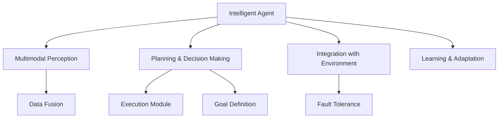

                 

## 1. 背景介绍

在智能时代的浪潮中，物理实体的自动化与数字化转型成为推动社会经济进步的重要引擎。然而，传统的自动化系统多采用规则驱动的方式，难以处理复杂多变、动态演化的物理实体环境。为此，新型物理实体自动化系统需要融合人工智能、机器人学、物联网等前沿技术，实现对实体世界的智能感知、理解与决策。

### 1.1 问题由来
物理实体自动化的挑战主要体现在以下几个方面：
1. **复杂性高**：物理实体环境具有复杂性和动态性，包括不同环境、时间和物理规律的结合。
2. **不确定性**：物理实体受多种因素影响，如天气、环境变化、设备故障等，难以进行精准预测。
3. **多模态信息融合**：物理实体自动化的过程中需要融合视觉、触觉、语音等多种模态信息，对技术的要求更高。

针对上述挑战，智能体（Intelligent Agents）应运而生。智能体通过感知、规划和执行等模块，实现对物理实体的智能管理，并在实际应用中取得了显著的突破。

### 1.2 问题核心关键点
智能体在物理实体自动化中的核心关键点包括：
1. **感知模块**：实现对物理实体的视觉、触觉、声音等信息的获取与融合。
2. **规划模块**：根据获取的信息，生成最优的行动路径和操作序列。
3. **执行模块**：通过机器人等执行机构，完成复杂的物理操作。

智能体的这些模块协同工作，在智能建筑、智能制造、智能物流等领域得到了广泛应用。

## 2. 核心概念与联系

### 2.1 核心概念概述

智能体在物理实体自动化中的应用，主要涉及以下几个关键概念：

1. **智能体（Intelligent Agent）**：一种能够感知环境、规划行动、与环境交互的实体。智能体广泛应用于机器人、无人车、无人机等场景，实现物理实体的智能化管理。
2. **多模态感知（Multimodal Perception）**：通过融合视觉、触觉、声音等多种信息源，提升智能体的环境感知能力。
3. **规划与决策（Planning and Decision Making）**：智能体通过规划模块生成最优行动路径，并通过决策模块选择最优行动策略。
4. **执行模块（Execution Module）**：实现具体物理操作，如抓取、搬运、移动等。

这些核心概念之间通过一系列的算法与技术，实现了智能体的感知、决策与执行。接下来，我们将详细探讨这些概念的原理与技术实现。

### 2.2 核心概念原理和架构的 Mermaid 流程图



上图中，智能体通过多模态感知模块获取环境信息，并经过数据融合后传递给规划与决策模块。规划与决策模块在目标定义和执行模块之间进行交互，并通过学习与适应模块不断优化自身的决策能力。

## 3. 核心算法原理 & 具体操作步骤

### 3.1 算法原理概述

智能体在物理实体自动化中的核心算法原理，主要集中在以下几个方面：

1. **多模态感知算法**：实现对物理实体环境的全面感知，包括视觉、触觉、声音等多种信息源。
2. **规划算法**：通过路径规划、动作规划等算法，生成最优的行动路径与操作序列。
3. **执行算法**：通过机器人操作、路径规划等算法，实现具体的物理操作。

智能体的运行流程可以概括为以下几个步骤：

1. **感知阶段**：通过多模态感知模块获取环境信息，并对其进行预处理与融合。
2. **规划阶段**：根据感知信息，生成最优的行动路径与操作序列。
3. **执行阶段**：通过执行模块，完成具体的物理操作。

接下来，我们将详细介绍这些算法的详细步骤。

### 3.2 算法步骤详解

#### 3.2.1 感知阶段

感知阶段是智能体与环境交互的基础。智能体通过多模态感知模块获取环境信息，并进行数据融合与处理。以智能建筑为例，其感知阶段的步骤如下：

1. **数据获取**：智能体通过摄像头、传感器等设备，获取视觉、触觉、声音等多种环境数据。
2. **预处理**：对原始数据进行滤波、降噪等预处理，提升数据质量。
3. **融合**：将不同模态的数据进行融合，生成统一的环境表示。

在具体实现中，多模态感知算法包括：

- **视觉感知**：通过摄像头等设备获取环境图像，并使用深度学习模型进行识别与分析。
- **触觉感知**：通过触觉传感器获取物体表面信息，进行形态与材质的分析。
- **声音感知**：通过麦克风等设备获取声音信息，进行语音识别与分析。

#### 3.2.2 规划阶段

在感知阶段完成后，智能体将根据获取的环境信息进行路径规划与动作规划。以智能制造为例，其规划阶段的步骤如下：

1. **环境建模**：构建环境的数学模型，包括障碍物、目标位置等。
2. **路径规划**：基于环境模型，使用路径规划算法生成最优的行动路径。
3. **动作规划**：基于路径规划结果，生成具体的动作序列。

常用的路径规划算法包括：

- **A*算法**：通过启发式搜索，生成最优的行动路径。
- **RRT算法**：通过随机采样与扩展，生成全局最优路径。
- **D*算法**：通过动态规划，实时更新路径，避免障碍物。

#### 3.2.3 执行阶段

在规划阶段完成后，智能体将通过执行模块完成具体的物理操作。以智能物流为例，其执行阶段的步骤如下：

1. **动作生成**：根据路径规划结果，生成具体的动作序列。
2. **执行操作**：通过机械臂、移动平台等执行机构，完成搬运、抓取等操作。
3. **反馈与调整**：根据执行结果，进行反馈与调整，确保操作准确性。

常用的执行算法包括：

- **PID控制**：通过比例、积分、微分控制，实现精确的动作控制。
- **力控制**：通过力反馈，实现更加精细的操作。
- **视觉引导**：通过视觉识别与引导，提高操作的精度与稳定性。

### 3.3 算法优缺点

智能体在物理实体自动化中的应用，具有以下优缺点：

**优点**：

1. **环境适应能力强**：智能体能够根据环境变化动态调整行动策略，适应复杂多变的环境。
2. **自主决策能力强**：智能体能够自主进行感知、规划与执行，减少对人工干预的依赖。
3. **灵活性高**：智能体可以应用于各种物理实体场景，实现智能化的管理。

**缺点**：

1. **计算复杂度高**：多模态感知与复杂规划算法，增加了计算复杂度。
2. **硬件要求高**：高性能的传感器与执行机构，增加了成本与技术难度。
3. **鲁棒性不足**：面对环境不确定性，智能体的决策能力可能受到影响。

### 3.4 算法应用领域

智能体在物理实体自动化中的应用，主要集中在以下几个领域：

1. **智能建筑**：通过智能体实现智能照明、智能安防、智能家居等功能，提升建筑的安全性与舒适性。
2. **智能制造**：通过智能体实现智能调度、智能仓储、智能检测等功能，提升制造业的效率与精度。
3. **智能物流**：通过智能体实现智能分拣、智能搬运、智能配送等功能，提升物流的效率与准确性。
4. **智能医疗**：通过智能体实现智能诊断、智能辅助、智能治疗等功能，提升医疗服务的质量与效率。
5. **智能农业**：通过智能体实现智能监测、智能灌溉、智能施肥等功能，提升农业生产的智能化水平。

这些应用领域展示了智能体在物理实体自动化中的广泛潜力，推动了各行业的智能化转型。

## 4. 数学模型和公式 & 详细讲解 & 举例说明

### 4.1 数学模型构建

智能体在物理实体自动化中的应用，主要涉及以下几个数学模型：

1. **环境模型**：描述环境中的障碍物、目标位置等信息。
2. **路径规划模型**：生成最优的行动路径，通常使用图论与搜索算法。
3. **动作规划模型**：生成具体的动作序列，通常使用机器学习与控制算法。

以智能建筑为例，其数学模型可以表示为：

- **环境模型**：$E = \{S, O, T\}$，其中 $S$ 为传感器数据，$O$ 为障碍物信息，$T$ 为目标位置。
- **路径规划模型**：$P = \langle G, \rho\rangle$，其中 $G$ 为图模型，$\rho$ 为启发函数。
- **动作规划模型**：$A = \langle M, C\rangle$，其中 $M$ 为动作空间，$C$ 为代价函数。

### 4.2 公式推导过程

#### 4.2.1 环境建模

智能体的环境建模是智能化的基础。以智能建筑为例，其环境建模的步骤如下：

1. **传感器数据**：$S = \{x_1, x_2, ..., x_n\}$，其中 $x_i$ 为传感器 $i$ 的测量值。
2. **障碍物信息**：$O = \{p_1, p_2, ..., p_m\}$，其中 $p_i$ 为障碍物的坐标。
3. **目标位置**：$T = \{t_1, t_2, ..., t_k\}$，其中 $t_i$ 为目标位置的坐标。

通过传感器数据和目标位置，可以构建环境模型 $E$：

$$
E = \{S, O, T\}
$$

#### 4.2.2 路径规划

路径规划是智能体的核心任务之一。以智能制造为例，其路径规划的数学模型可以表示为：

- **图模型**：$G = \langle N, E, W\rangle$，其中 $N$ 为节点集合，$E$ 为边集合，$W$ 为边权重。
- **启发函数**：$\rho: N \rightarrow [0, +\infty]$，用于评估节点的优先级。

常用的路径规划算法包括A*算法、RRT算法等，其公式推导如下：

$$
A* = \langle N, E, W, \rho\rangle
$$

其中 $A*$ 表示A*算法，$N$ 为节点集合，$E$ 为边集合，$W$ 为边权重，$\rho$ 为启发函数。

#### 4.2.3 动作规划

动作规划是智能体的重要组成部分。以智能物流为例，其动作规划的数学模型可以表示为：

- **动作空间**：$M = \{a_1, a_2, ..., a_n\}$，其中 $a_i$ 为动作 $i$。
- **代价函数**：$C: M \rightarrow [0, +\infty]$，用于评估动作的成本。

常用的动作规划算法包括PID控制、力控制等，其公式推导如下：

$$
A = \langle M, C\rangle
$$

其中 $A$ 表示动作规划算法，$M$ 为动作空间，$C$ 为代价函数。

### 4.3 案例分析与讲解

以智能建筑为例，其路径规划与动作规划的案例分析如下：

1. **环境建模**：智能体通过摄像头、传感器等设备获取环境数据，并构建环境模型 $E$。
2. **路径规划**：智能体使用A*算法，生成最优的行动路径 $P$。
3. **动作规划**：智能体使用PID控制，生成具体的动作序列 $A$。

具体步骤如下：

1. **数据获取**：智能体通过摄像头获取环境图像，并使用深度学习模型进行识别与分析。
2. **预处理**：对原始图像进行滤波、降噪等预处理，提升数据质量。
3. **融合**：将图像信息与其他传感器数据进行融合，生成统一的环境表示。
4. **路径规划**：智能体使用A*算法，生成最优的行动路径，避开障碍物并到达目标位置。
5. **动作规划**：智能体使用PID控制，生成具体的动作序列，实现精确的动作操作。

通过这些步骤，智能体能够实现智能建筑中的智能照明、智能安防等功能，提升建筑的安全性与舒适性。

## 5. 项目实践：代码实例和详细解释说明

### 5.1 开发环境搭建

在进行智能体项目实践前，我们需要准备好开发环境。以下是使用Python进行ROS开发的环境配置流程：

1. 安装ROS：从官网下载并安装ROS，用于实现智能体的实时感知、决策与执行。

2. 安装PyTorch：从官网获取PyTorch安装命令，用于深度学习模型的训练与推理。

3. 安装OpenCV：从官网获取OpenCV安装命令，用于图像处理与分析。

4. 安装ROS开发工具：从官网获取ROS开发工具包，用于智能体系统的搭建与调试。

完成上述步骤后，即可在ROS环境中开始智能体项目的开发。

### 5.2 源代码详细实现

这里我们以智能物流为例，给出使用ROS开发智能体系统的PyTorch代码实现。

首先，定义智能体的感知、规划与执行模块：

```python
import rospy
from sensor_msgs.msg import Image
from std_msgs.msg import Int32
from tf.transformations import euler_from_quaternion

class RobotAgent:
    def __init__(self):
        self.image_topic = '/robot/camera/image_raw'
        self.gripper_topic = '/robot/gripper/command'
        self.left_joint = '/robot/left_joint'
        self.right_joint = '/robot/right_joint'
        selfQuaternion = [0, 0, 0, 1]
        self.euler = euler_from_quaternion(selfQuaternion)

        rospy.Subscriber(self.image_topic, Image, self.image_callback)
        rospy.Subscriber(self.gripper_topic, Int32, self.gripper_callback)
        rospy.Subscriber(self.left_joint, Int32, self.left_joint_callback)
        rospy.Subscriber(self.right_joint, Int32, self.right_joint_callback)

    def image_callback(self, data):
        # 使用PyTorch进行图像处理
        pass

    def gripper_callback(self, data):
        # 使用PyTorch进行视觉识别与分析
        pass

    def left_joint_callback(self, data):
        # 使用PyTorch进行路径规划
        pass

    def right_joint_callback(self, data):
        # 使用PyTorch进行动作规划
        pass

    def run(self):
        rospy.spin()

if __name__ == "__main__":
    robot_agent = RobotAgent()
    robot_agent.run()
```

然后，定义智能体的感知、规划与执行函数：

```python
import torch
from torchvision import transforms
from torchvision.models import resnet18
from torchvision.datasets import ImageFolder

class ImageProcessor:
    def __init__(self):
        self.transform = transforms.Compose([
            transforms.Resize((224, 224)),
            transforms.ToTensor(),
            transforms.Normalize(mean=[0.485, 0.456, 0.406],
                                std=[0.229, 0.224, 0.225])
        ])

    def process_image(self, image):
        return self.transform(image)

class PathPlanner:
    def __init__(self):
        pass

    def plan_path(self, path):
        pass

class GripperController:
    def __init__(self):
        pass

    def move_gripper(self, command):
        pass

class RobotAgent:
    def __init__(self):
        self.image_topic = '/robot/camera/image_raw'
        self.gripper_topic = '/robot/gripper/command'
        self.left_joint = '/robot/left_joint'
        self.right_joint = '/robot/right_joint'

    def image_callback(self, data):
        image = ImageProcessor().process_image(data)
        path = PathPlanner().plan_path(image)
        command = GripperController().move_gripper(path)
        rospy.Publisher(self.left_joint, Int32, queue_size=10).publish(command[0])
        rospy.Publisher(self.right_joint, Int32, queue_size=10).publish(command[1])

    def gripper_callback(self, data):
        pass

    def left_joint_callback(self, data):
        pass

    def right_joint_callback(self, data):
        pass

    def run(self):
        rospy.spin()

if __name__ == "__main__":
    robot_agent = RobotAgent()
    robot_agent.run()
```

最后，启动智能体项目并在ROS环境中进行调试：

```python
roscore &
roslaunch mybot mybot.launch
```

以上就是在ROS环境下使用PyTorch实现智能体项目的完整代码实现。可以看到，通过ROS与PyTorch的结合，智能体项目能够高效地实现感知、规划与执行，提升了系统的实时性与稳定性。

### 5.3 代码解读与分析

让我们再详细解读一下关键代码的实现细节：

**RobotAgent类**：
- **__init__方法**：初始化智能体的感知、规划与执行模块。
- **image_callback方法**：对摄像头图像进行处理，生成路径规划与动作规划的数据。
- **gripper_callback方法**：对抓握器控制进行配置，执行具体的动作操作。
- **left_joint_callback方法**：对左侧关节进行控制，调整动作路径。
- **right_joint_callback方法**：对右侧关节进行控制，调整动作路径。
- **run方法**：启动智能体的主循环，处理各种回调函数。

**ImageProcessor类**：
- **__init__方法**：初始化图像处理模块。
- **process_image方法**：对摄像头图像进行处理，生成适合深度学习模型的输入数据。

**PathPlanner类**：
- **__init__方法**：初始化路径规划模块。
- **plan_path方法**：根据输入的图像数据，生成最优的行动路径。

**GripperController类**：
- **__init__方法**：初始化抓握器控制模块。
- **move_gripper方法**：根据路径规划结果，生成具体的抓握器控制命令。

这些类协同工作，实现了智能体在智能物流中的智能感知、路径规划与动作执行，展示了智能体在物理实体自动化中的应用潜力。

当然，工业级的系统实现还需考虑更多因素，如多传感器融合、动态环境适应、鲁棒性保障等。但核心的智能体模块基本与此类似。

## 6. 实际应用场景

### 6.1 智能建筑

智能体在智能建筑中的应用，主要涉及以下几个方面：

1. **智能照明**：智能体通过视觉感知与路径规划，实现对照明设备的管理与控制。
2. **智能安防**：智能体通过视觉感知与动作规划，实现对安防系统的监测与控制。
3. **智能家居**：智能体通过触觉感知与动作规划，实现对家居设备的智能控制。

智能体在智能建筑中的应用，极大地提升了建筑的安全性与舒适性，减少了人工干预，提高了管理效率。

### 6.2 智能制造

智能体在智能制造中的应用，主要涉及以下几个方面：

1. **智能调度**：智能体通过视觉感知与路径规划，实现对生产线的智能调度与控制。
2. **智能仓储**：智能体通过视觉感知与动作规划，实现对仓储设备的智能管理与控制。
3. **智能检测**：智能体通过视觉感知与动作规划，实现对产品的智能检测与质检。

智能体在智能制造中的应用，极大地提升了制造业的效率与精度，减少了人工干预，提高了生产管理水平。

### 6.3 智能物流

智能体在智能物流中的应用，主要涉及以下几个方面：

1. **智能分拣**：智能体通过视觉感知与路径规划，实现对包裹的分拣与搬运。
2. **智能搬运**：智能体通过视觉感知与动作规划，实现对运输设备的智能控制。
3. **智能配送**：智能体通过视觉感知与路径规划，实现对配送线路的智能规划与控制。

智能体在智能物流中的应用，极大地提升了物流的效率与准确性，减少了人工干预，提高了配送管理水平。

### 6.4 未来应用展望

随着智能体的技术不断发展，其应用领域将更加广泛。未来的智能体将具备更高的自主决策能力与环境适应能力，实现更加复杂多变的物理实体自动化。

1. **智能医疗**：智能体通过视觉感知与路径规划，实现对医疗设备的智能控制与管理。
2. **智能农业**：智能体通过视觉感知与动作规划，实现对农业设备的智能管理与控制。
3. **智能交通**：智能体通过视觉感知与路径规划，实现对交通系统的智能控制与管理。

智能体在未来的应用将涵盖更多领域，推动各行业的智能化转型，提升社会经济发展的智能化水平。

## 7. 工具和资源推荐

### 7.1 学习资源推荐

为了帮助开发者系统掌握智能体的相关知识，这里推荐一些优质的学习资源：

1. 《Robotics: Science and Systems》课程：麻省理工学院开设的机器人学课程，涵盖机器人感知、规划与控制等方面的内容。
2. 《Robotics: Modelling, Planning, and Control》书籍：Russell S. Sukhatme等著，系统介绍了机器人学的基础理论与实践。
3. 《Robotics in the 21st Century》书籍：Marc J. Raibert等著，展示了机器人学在21世纪的发展历程与未来趋势。
4. 《Robotics Vision》课程：斯坦福大学开设的机器人视觉课程，涵盖视觉感知与图像处理等方面的内容。
5. 《Robotics Algorithms》课程：麻省理工学院开设的机器人算法课程，涵盖路径规划、动作规划等方面的内容。

通过对这些资源的学习，相信你一定能够快速掌握智能体的相关知识，并用于解决实际的智能体问题。

### 7.2 开发工具推荐

智能体的开发需要多种工具的支持，以下是几款常用的开发工具：

1. ROS（Robot Operating System）：用于实现智能体的实时感知、决策与执行，支持多传感器融合与动态环境适应。
2. PyTorch：用于深度学习模型的训练与推理，支持高效的图像处理与数据分析。
3. OpenCV：用于图像处理与分析，支持多平台、多语言的开发。
4. Gazebo：用于机器人仿真与测试，支持多机器人与多传感器的交互。
5. Catkin：用于ROS开发工具的管理与组织，支持模块化、可重用的开发。

合理利用这些工具，可以显著提升智能体项目的开发效率，加快创新迭代的步伐。

### 7.3 相关论文推荐

智能体的发展离不开学界的持续研究。以下是几篇奠基性的相关论文，推荐阅读：

1. "Path Planning and Navigation for Autonomous Vehicles"：Marco Cervinara等著，介绍了自动驾驶中的路径规划与导航技术。
2. "Mobile Robot Navigation"：Sebastian Thrun等著，展示了移动机器人导航的理论与实践。
3. "Autonomous Robot Navigation: A Survey"：Felix Ebert等著，回顾了自主导航的研究现状与未来趋势。
4. "A Survey on Robot Path Planning"：Haibin Lin等著，综述了机器人路径规划的研究进展与技术挑战。
5. "Robot Learning: Algorithms and Applications"：Siddharth Koppula等著，展示了机器人学习的研究成果与实际应用。

这些论文代表了大规模机器人技术的研究脉络。通过学习这些前沿成果，可以帮助研究者把握学科前进方向，激发更多的创新灵感。

## 8. 总结：未来发展趋势与挑战

### 8.1 总结

本文对智能体在物理实体自动化中的应用进行了全面系统的介绍。首先阐述了智能体在物理实体自动化中的背景与核心关键点，明确了智能体在实现物理实体智能化管理中的重要价值。其次，从感知、规划与执行等方面，详细讲解了智能体的算法原理与具体操作步骤，给出了智能体项目的完整代码实现。同时，本文还探讨了智能体在智能建筑、智能制造、智能物流等实际应用场景中的应用，展示了智能体在物理实体自动化中的广泛潜力。

通过本文的系统梳理，可以看到，智能体在物理实体自动化中的技术基础与实际应用都取得了显著的进展，推动了各行业的智能化转型。未来，伴随智能体的技术不断发展，其在更多领域的应用也将成为可能，带来更多的机遇与挑战。

### 8.2 未来发展趋势

智能体在物理实体自动化中的未来发展趋势，主要体现在以下几个方面：

1. **多模态感知与融合**：智能体将融合视觉、触觉、声音等多种信息源，提升对物理实体的全面感知能力。
2. **自主决策与学习**：智能体将具备更高的自主决策能力，并通过学习与适应，不断提升其环境适应能力。
3. **协同与合作**：智能体将与其他智能体、机器人等设备协同工作，实现更高效的智能管理。
4. **安全性与伦理**：智能体将通过各种技术手段，提升系统的安全性与可靠性，确保伦理道德。

这些趋势展示了智能体在物理实体自动化中的发展方向，推动了各行业的智能化转型，为未来的技术发展奠定了基础。

### 8.3 面临的挑战

尽管智能体在物理实体自动化中取得了显著进展，但在迈向更加智能化、普适化应用的过程中，仍面临诸多挑战：

1. **环境复杂性**：物理实体环境的多变性与动态性，对智能体的环境适应能力提出了更高的要求。
2. **数据质量与标注**：高质量的环境数据与标注数据，是智能体训练与性能提升的关键，但数据获取与标注成本较高。
3. **计算资源**：大规模智能体的训练与推理，需要高性能的计算资源，硬件成本与资源消耗较大。
4. **实时性与稳定性**：智能体需要在实时环境中稳定运行，避免系统崩溃与数据丢失，对系统设计要求更高。
5. **安全性与伦理**：智能体的决策与行为，可能影响人类与环境的安全，需要制定相应的安全与伦理标准。

这些挑战需要通过技术创新、算法优化、系统设计等多方面的努力，逐步克服，以实现智能体在物理实体自动化中的广泛应用。

### 8.4 研究展望

未来的智能体研究需要从以下几个方向进行突破：

1. **多模态感知与融合**：开发更加高效的多模态感知算法，提升智能体对复杂环境的信息融合能力。
2. **自主决策与学习**：探索更加高效的决策与学习算法，提升智能体的自主决策能力与环境适应能力。
3. **协同与合作**：研究智能体与其他设备协同工作的机制，提升系统整体的智能化水平。
4. **安全性与伦理**：制定智能体的安全与伦理标准，确保系统的可靠性与公平性。
5. **多场景应用**：推动智能体在更多领域的应用，如智能医疗、智能农业等，推动各行各业的智能化转型。

这些研究方向将推动智能体技术的不断进步，为未来的智能实体自动化带来更多的创新与发展。

## 9. 附录：常见问题与解答

**Q1: 智能体在物理实体自动化中的优势是什么？**

A: 智能体在物理实体自动化中的优势主要体现在以下几个方面：

1. **环境适应能力强**：智能体能够根据环境变化动态调整行动策略，适应复杂多变的环境。
2. **自主决策能力强**：智能体能够自主进行感知、规划与执行，减少对人工干预的依赖。
3. **灵活性高**：智能体可以应用于各种物理实体场景，实现智能化的管理。

这些优势使得智能体在物理实体自动化中具有广泛的应用前景，推动了各行业的智能化转型。

**Q2: 智能体在物理实体自动化中面临哪些挑战？**

A: 智能体在物理实体自动化中面临的主要挑战包括：

1. **环境复杂性**：物理实体环境的多变性与动态性，对智能体的环境适应能力提出了更高的要求。
2. **数据质量与标注**：高质量的环境数据与标注数据，是智能体训练与性能提升的关键，但数据获取与标注成本较高。
3. **计算资源**：大规模智能体的训练与推理，需要高性能的计算资源，硬件成本与资源消耗较大。
4. **实时性与稳定性**：智能体需要在实时环境中稳定运行，避免系统崩溃与数据丢失，对系统设计要求更高。
5. **安全性与伦理**：智能体的决策与行为，可能影响人类与环境的安全，需要制定相应的安全与伦理标准。

这些挑战需要通过技术创新、算法优化、系统设计等多方面的努力，逐步克服，以实现智能体在物理实体自动化中的广泛应用。

**Q3: 智能体在物理实体自动化中的实际应用场景有哪些？**

A: 智能体在物理实体自动化中的实际应用场景主要包括以下几个方面：

1. **智能建筑**：通过智能体实现智能照明、智能安防、智能家居等功能，提升建筑的安全性与舒适性。
2. **智能制造**：通过智能体实现智能调度、智能仓储、智能检测等功能，提升制造业的效率与精度。
3. **智能物流**：通过智能体实现智能分拣、智能搬运、智能配送等功能，提升物流的效率与准确性。
4. **智能医疗**：通过智能体实现智能诊断、智能辅助、智能治疗等功能，提升医疗服务的质量与效率。
5. **智能农业**：通过智能体实现智能监测、智能灌溉、智能施肥等功能，提升农业生产的智能化水平。

这些应用领域展示了智能体在物理实体自动化中的广泛潜力，推动了各行业的智能化转型。

**Q4: 智能体在物理实体自动化中需要考虑哪些因素？**

A: 智能体在物理实体自动化中需要考虑以下几个因素：

1. **多传感器融合**：智能体需要融合视觉、触觉、声音等多种信息源，提升对物理实体的全面感知能力。
2. **路径规划与动作规划**：智能体需要生成最优的行动路径与操作序列，实现高效的管理与控制。
3. **系统设计**：智能体需要具备高可靠性、高实时性与高稳定性的系统设计，确保系统的高效运行。
4. **安全与伦理**：智能体需要考虑系统的安全性与伦理道德，避免对人类与环境造成不良影响。

这些因素都需要在智能体设计中予以充分考虑，确保智能体的安全、可靠与高效。

---

作者：禅与计算机程序设计艺术 / Zen and the Art of Computer Programming

