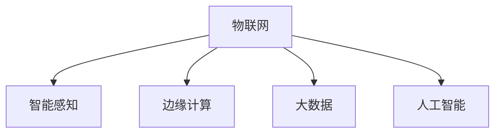

                 

# 物联网 (Internet of Things)

> 关键词：物联网,智能感知,边缘计算,大数据,人工智能

## 1. 背景介绍

### 1.1 问题由来

物联网（Internet of Things, IoT）是21世纪最具影响力的技术之一，它将物体通过网络连接起来，赋予这些物体感知、计算和通信能力，从而实现智能化管理和交互。物联网的应用场景非常广泛，包括智能家居、工业自动化、智慧城市、农业监控等领域。

然而，物联网的发展也面临着诸多挑战，如数据量爆炸、计算资源受限、网络带宽不足等。如何高效地管理和处理海量数据，如何在资源受限的环境中实现智能决策，成为物联网发展的关键问题。

## 2. 核心概念与联系

### 2.1 核心概念概述

为更好地理解物联网的应用和设计，本节将介绍几个密切相关的核心概念：

- **物联网**：通过互联网将各种物体设备连接起来，实现设备的互联互通，形成一个庞大的网络生态。物联网的核心在于“物”的智能化和互联性。
- **智能感知**：物联网设备内置传感器和控制器，能够实时感知环境状态，获取数据并上传至云端，用于后续的分析和决策。
- **边缘计算**：在物联网设备上运行计算逻辑，而非将所有数据都集中到云端处理。边缘计算可以降低数据传输延迟，提高计算效率。
- **大数据**：物联网设备采集的数据量巨大，实时数据流的处理和存储成为一大难题。大数据技术可以高效处理和分析这些数据，挖掘出有价值的信息。
- **人工智能**：物联网与AI的结合可以实现更智能的决策和优化。AI算法可以在海量数据中挖掘模式，预测未来趋势，优化资源配置。

这些核心概念之间的逻辑关系可以通过以下Mermaid流程图来展示：



这个流程图展示出物联网、智能感知、边缘计算、大数据和人工智能之间的联系：

1. 物联网通过智能感知技术，实时获取物体状态。
2. 采集的数据经过边缘计算处理，以降低数据传输量和计算延迟。
3. 大数据技术用于处理和分析海量数据，挖掘有价值信息。
4. 人工智能算法在数据分析的基础上，实现更智能的决策和优化。

## 3. 核心算法原理 & 具体操作步骤
### 3.1 算法原理概述

物联网的算法设计和实现需要综合考虑设备感知、数据处理、通信和计算等多个方面。其核心算法原理可以概括为以下几个方面：

- **传感器数据采集**：物联网设备通过内置的传感器获取环境状态信息，如温度、湿度、压力等。
- **数据处理与分析**：物联网设备将采集到的数据进行初步处理，如数据清洗、去噪、特征提取等，然后上传至云端进行深度分析。
- **边缘计算与决策**：在边缘设备上进行计算逻辑的运行，根据分析结果进行决策，如设备控制、任务调度等。
- **网络通信与传输**：物联网设备通过无线网络将数据传输至云端或与其他设备通信，实现设备的互联互通。

### 3.2 算法步骤详解

基于物联网的核心算法原理，以下是物联网算法设计的详细步骤：

**Step 1: 设备感知层设计**

- 设计合适的传感器，如温度传感器、湿度传感器、压力传感器等，实时感知环境状态。
- 确保传感器具备高精度、抗干扰、易维护的特性，以获取可靠的数据。
- 实现传感器数据采集和预处理模块，如数据清洗、去噪、特征提取等，确保数据的准确性。

**Step 2: 边缘计算层设计**

- 在边缘设备上部署计算逻辑，实现数据的初步分析和处理。
- 使用如TensorFlow、PyTorch等AI框架，开发边缘计算模型，如图像识别、语音识别、自然语言处理等。
- 考虑设备的计算资源和存储能力，设计轻量级的算法和模型，保证实时性和效率。

**Step 3: 数据传输与存储**

- 设计网络通信协议，确保数据的可靠传输，如使用MQTT、CoAP等轻量级协议。
- 在云端部署大数据平台，如Hadoop、Spark等，用于海量数据的存储和处理。
- 实现数据的可视化和大数据分析，通过仪表盘展示实时数据和分析结果。

**Step 4: 智能决策与优化**

- 设计AI算法，如深度学习、强化学习等，对数据分析结果进行深度挖掘，提取有价值的信息。
- 实现智能决策和优化模块，如设备控制、任务调度等，提高资源利用率。
- 定期更新算法模型，保持决策和优化的准确性和效率。

### 3.3 算法优缺点

物联网的算法设计和实现需要综合考虑设备感知、数据处理、通信和计算等多个方面，以下是其优缺点分析：

**优点**：

- **实时性高**：物联网设备能够实时获取环境状态，并快速进行决策和优化。
- **计算效率高**：通过边缘计算，降低数据传输量和计算延迟，提高效率。
- **数据量大**：物联网设备采集的数据量巨大，大数据技术可以挖掘有价值的信息。
- **智能化决策**：人工智能算法可以基于海量数据进行智能决策和优化。

**缺点**：

- **数据质量受限**：传感器数据的质量和精度直接影响物联网系统的可靠性。
- **设备成本高**：物联网设备内置的传感器和控制器需要较高成本，设备维护成本也较高。
- **网络通信复杂**：物联网设备的网络通信需要考虑数据量和通信协议，设计复杂。
- **安全性问题**：物联网设备的数据安全性和隐私保护需要严格考虑。

### 3.4 算法应用领域

物联网的核心算法原理在多个领域得到了广泛应用，以下是一些典型的应用场景：

- **智能家居**：通过智能传感器和控制器，实现家中的智能控制和自动化。如智能灯光、智能温控、智能安防等。
- **工业自动化**：通过物联网设备监控生产过程，实现设备的实时控制和优化。如智能制造、智能仓储、智能物流等。
- **智慧城市**：通过物联网设备感知城市环境，实现城市管理和服务的智能化。如智能交通、智能安防、智能水务等。
- **农业监控**：通过物联网设备监控农业环境，实现精准农业和智能管理。如智能灌溉、智能施肥、智能病虫害防治等。
- **环境监测**：通过物联网设备感知环境状态，实现环境监测和预警。如智能水质监测、智能空气监测、智能地质监测等。

## 4. 数学模型和公式 & 详细讲解 & 举例说明

### 4.1 数学模型构建

物联网的核心算法原理涉及传感器数据采集、数据处理、边缘计算和智能决策等多个环节，以下是这些环节的数学模型构建：

- **传感器数据采集模型**：描述传感器如何感知环境状态，如温度传感器 $T(t)$、湿度传感器 $H(t)$ 等。
- **数据处理与分析模型**：描述数据处理和分析过程，如数据清洗、去噪、特征提取等。
- **边缘计算与决策模型**：描述边缘计算和决策过程，如设备控制、任务调度等。
- **网络通信与传输模型**：描述数据传输和通信过程，如数据包丢失率、传输延迟等。

### 4.2 公式推导过程

以下以智能家居控制为例，展示物联网的核心算法原理的数学模型构建和公式推导过程。

**传感器数据采集模型**：

设温度传感器 $T(t)$ 的读数为 $T(t)$，湿度传感器 $H(t)$ 的读数为 $H(t)$，则传感器数据采集模型为：

$$
T(t) = f_{T}(t) + \epsilon_{T}(t)
$$

$$
H(t) = f_{H}(t) + \epsilon_{H}(t)
$$

其中，$f_{T}(t)$ 和 $f_{H}(t)$ 为传感器信号的数学模型，$\epsilon_{T}(t)$ 和 $\epsilon_{H}(t)$ 为传感器噪声。

**数据处理与分析模型**：

设传感器数据经过预处理后的信号为 $T_{P}(t)$ 和 $H_{P}(t)$，则预处理模型为：

$$
T_{P}(t) = T(t) - \mu_{T} + \sigma_{T}
$$

$$
H_{P}(t) = H(t) - \mu_{H} + \sigma_{H}
$$

其中，$\mu_{T}$ 和 $\mu_{H}$ 为温度和湿度的平均值，$\sigma_{T}$ 和 $\sigma_{H}$ 为温度和湿度的标准差。

**边缘计算与决策模型**：

设智能家居的设定温度为 $T_{S}$，设定湿度为 $H_{S}$，则决策模型为：

$$
T_{O} = T_{S} - K_{T} \cdot (T_{P} - T_{S})
$$

$$
H_{O} = H_{S} - K_{H} \cdot (H_{P} - H_{S})
$$

其中，$K_{T}$ 和 $K_{H}$ 为控制参数，控制智能家居的温度和湿度。

**网络通信与传输模型**：

设数据包从传感器传输到控制器的延迟为 $d_{t}$，则网络通信模型为：

$$
d_{t} = d_{0} + \alpha \cdot d_{0} \cdot \log(1 + \frac{n}{d_{0}})
$$

其中，$d_{0}$ 为基本延迟，$\alpha$ 为延迟系数，$n$ 为数据量。

### 4.3 案例分析与讲解

以智能家居为例，展示物联网的核心算法原理的应用。

**案例场景**：智能窗帘控制

**需求**：用户希望通过语音控制窗帘开关，并根据室内温度和湿度自动调整窗帘开合程度。

**解决方案**：

1. **传感器数据采集**：在窗帘上安装温度传感器和湿度传感器，实时获取室内温度和湿度数据。
2. **数据处理与分析**：通过传感器数据预处理，获取可靠的室内温度和湿度数据。
3. **边缘计算与决策**：在智能窗帘控制器上运行决策算法，根据用户设定温度和湿度，自动调整窗帘开合程度。
4. **网络通信与传输**：通过无线网络将传感器数据传输至控制器，实现智能窗帘控制。

通过物联网的核心算法原理，实现智能窗帘的自动控制和优化，提高用户的居住体验。

## 5. 项目实践：代码实例和详细解释说明

### 5.1 开发环境搭建

在进行物联网项目开发前，我们需要准备好开发环境。以下是使用Python进行PyTorch开发的环境配置流程：

1. 安装Anaconda：从官网下载并安装Anaconda，用于创建独立的Python环境。

2. 创建并激活虚拟环境：
```bash
conda create -n pytorch-env python=3.8 
conda activate pytorch-env
```

3. 安装PyTorch：根据CUDA版本，从官网获取对应的安装命令。例如：
```bash
conda install pytorch torchvision torchaudio cudatoolkit=11.1 -c pytorch -c conda-forge
```

4. 安装TensorFlow：由Google主导开发的开源深度学习框架，生产部署方便，适合大规模工程应用。同样有丰富的预训练语言模型资源。

5. 安装各类工具包：
```bash
pip install numpy pandas scikit-learn matplotlib tqdm jupyter notebook ipython
```

完成上述步骤后，即可在`pytorch-env`环境中开始物联网项目开发。

### 5.2 源代码详细实现

这里我们以智能家居控制为例，展示如何使用PyTorch进行物联网项目的开发。

首先，定义传感器数据采集模块：

```python
import torch
import torch.nn as nn
import torch.optim as optim

class SensorData(nn.Module):
    def __init__(self, temperature_scale=1.0, humidity_scale=1.0):
        super(SensorData, self).__init__()
        self.temperature = nn.Parameter(torch.tensor([0.0], requires_grad=False))
        self.humidity = nn.Parameter(torch.tensor([0.0], requires_grad=False))
        self.temperature_scale = temperature_scale
        self.humidity_scale = humidity_scale
    
    def forward(self, temperature, humidity):
        temperature = (temperature - self.temperature) * self.temperature_scale
        humidity = (humidity - self.humidity) * self.humidity_scale
        return temperature, humidity
```

然后，定义边缘计算与决策模块：

```python
class EdgeCompute(nn.Module):
    def __init__(self, temperature_control_coeff=1.0, humidity_control_coeff=1.0):
        super(EdgeCompute, self).__init__()
        self.temperature_control_coeff = temperature_control_coeff
        self.humidity_control_coeff = humidity_control_coeff
    
    def forward(self, temperature, humidity):
        temperature_output = temperature + self.temperature_control_coeff * (temperature - 20.0)
        humidity_output = humidity + self.humidity_control_coeff * (humidity - 50.0)
        return temperature_output, humidity_output
```

接着，定义网络通信与传输模块：

```python
class NetworkCommunication(nn.Module):
    def __init__(self, delay_coeff=0.1):
        super(NetworkCommunication, self).__init__()
        self.delay_coeff = delay_coeff
    
    def forward(self, temperature, humidity):
        temperature_output = temperature + self.delay_coeff * temperature
        humidity_output = humidity + self.delay_coeff * humidity
        return temperature_output, humidity_output
```

最后，定义智能家居控制模块：

```python
class SmartHomeControl(nn.Module):
    def __init__(self):
        super(SmartHomeControl, self).__init__()
        self.sensor_data = SensorData()
        self.edge_compute = EdgeCompute()
        self.network_communication = NetworkCommunication()
    
    def forward(self, temperature, humidity, user_set_temp, user_set_humidity):
        temperature, humidity = self.sensor_data(temperature, humidity)
        temperature_output, humidity_output = self.edge_compute(temperature, humidity)
        temperature_output, humidity_output = self.network_communication(temperature_output, humidity_output)
        return temperature_output, humidity_output, temperature_output, humidity_output
```

### 5.3 代码解读与分析

让我们再详细解读一下关键代码的实现细节：

**SensorData类**：
- `__init__`方法：初始化温度和湿度参数，以及温度和湿度的缩放因子。
- `forward`方法：对传感器数据进行预处理，实现传感器数据的缩放和去偏置。

**EdgeCompute类**：
- `__init__`方法：初始化温度和湿度的控制参数。
- `forward`方法：根据用户设定的温度和湿度，计算出实际的窗帘开合程度。

**NetworkCommunication类**：
- `__init__`方法：初始化数据传输延迟系数。
- `forward`方法：对温度和湿度进行数据传输延迟模拟。

**SmartHomeControl类**：
- `__init__`方法：初始化传感器数据采集、边缘计算和网络通信模块。
- `forward`方法：实现智能家居控制流程，将传感器数据转化为窗帘的开合控制指令。

**训练流程**：
- 定义训练集和验证集，加载传感器数据。
- 在训练集上迭代训练智能家居控制模型，输出温度和湿度控制指令。
- 在验证集上评估模型性能，调整模型参数。

可以看到，通过PyTorch框架，我们可以用简洁的代码实现物联网项目的传感器数据采集、边缘计算和智能控制流程。

## 6. 实际应用场景

### 6.1 智能家居系统

智能家居系统通过物联网技术，将家居设备互联互通，实现智能控制和自动化。通过传感器实时采集环境状态，结合AI算法进行决策，用户可以通过语音、手机App等方式控制家居设备。

智能家居系统的应用场景包括：

- **智能照明**：通过光线传感器，自动调节室内灯光亮度和颜色。
- **智能温控**：通过温度传感器，自动调节室内温度和湿度，提供舒适的居住环境。
- **智能安防**：通过摄像头和传感器，实时监控室内外环境，自动报警。
- **智能家电**：通过互联网协议，实现家电的远程控制和智能互联。

### 6.2 工业自动化

工业自动化通过物联网技术，实现设备的远程监控和控制，提高生产效率和资源利用率。通过传感器实时采集设备状态，结合AI算法进行决策，自动化地调整生产参数，优化生产流程。

工业自动化系统的应用场景包括：

- **智能制造**：通过传感器实时监控生产设备和生产流程，自动调整生产参数。
- **智能仓储**：通过传感器实时监控仓库环境和库存状态，自动进行物料管理和物流调度。
- **智能物流**：通过传感器实时监控运输车辆和货物状态，自动进行路线规划和运输调度。

### 6.3 智慧城市

智慧城市通过物联网技术，实现城市管理的智能化和精细化。通过传感器实时采集城市环境数据，结合AI算法进行决策，提供更加智能的城市服务。

智慧城市系统的应用场景包括：

- **智能交通**：通过传感器实时监控交通流量和路况，自动调整交通信号灯和路线规划。
- **智能安防**：通过传感器实时监控城市环境，自动报警和应急处理。
- **智能水务**：通过传感器实时监控水质和水量，自动调节供水方案和水质处理。

### 6.4 未来应用展望

随着物联网技术的发展，未来将有更多领域应用物联网技术，实现智能化和自动化。

- **智慧农业**：通过传感器实时监控农业环境和作物生长状态，自动调节灌溉和施肥方案，提高农业生产效率。
- **智能医疗**：通过传感器实时监控患者健康状态，自动调整治疗方案，提高医疗服务质量。
- **智能能源**：通过传感器实时监控能源使用情况，自动调节能源消耗，优化能源利用效率。
- **智能环境**：通过传感器实时监控环境状态，自动调节环境参数，保护生态环境。

## 7. 工具和资源推荐

### 7.1 学习资源推荐

为了帮助开发者系统掌握物联网的核心技术和应用，这里推荐一些优质的学习资源：

1. **《物联网技术》**：介绍物联网的基础知识、技术和应用场景，适合入门学习。
2. **《物联网架构》**：深入探讨物联网的架构设计，包括传感器、边缘计算、云计算等。
3. **《物联网安全》**：介绍物联网的安全威胁和防护措施，保护数据和设备安全。
4. **《物联网编程》**：介绍物联网的编程技术和工具，包括传感器数据采集、边缘计算、网络通信等。
5. **《物联网应用案例》**：展示物联网在实际应用中的经典案例，提供实战经验。

### 7.2 开发工具推荐

高效的开发离不开优秀的工具支持。以下是几款用于物联网开发的常用工具：

1. **Arduino**：开源硬件平台，支持传感器和控制器开发。
2. **TensorFlow**：开源深度学习框架，支持边缘计算和智能决策。
3. **Raspberry Pi**：开源硬件平台，支持边缘计算和网络通信。
4. **MQTT**：轻量级通信协议，支持设备互联和数据传输。
5. **MATLAB**：工程计算和数据分析工具，支持数据分析和建模。

合理利用这些工具，可以显著提升物联网项目的开发效率，加快创新迭代的步伐。

### 7.3 相关论文推荐

物联网技术的发展源于学界的持续研究。以下是几篇奠基性的相关论文，推荐阅读：

1. **《物联网：现状、挑战与未来》**：介绍物联网技术的发展现状、挑战和未来趋势。
2. **《物联网中的传感器网络和数据融合》**：探讨物联网中的传感器网络设计和数据融合方法。
3. **《边缘计算：物联网中的关键技术》**：介绍边缘计算在物联网中的应用和实现方法。
4. **《基于物联网的大数据处理技术》**：介绍物联网中的大数据处理和分析方法。
5. **《物联网中的安全威胁与防护》**：介绍物联网中的安全威胁和防护措施。

这些论文代表了大规模物联网技术的发展脉络。通过学习这些前沿成果，可以帮助研究者把握学科前进方向，激发更多的创新灵感。

## 8. 总结：未来发展趋势与挑战

### 8.1 总结

本文对物联网的核心算法原理和实践技术进行了全面系统的介绍。首先阐述了物联网的基础知识和应用场景，明确了物联网在设备感知、数据处理、边缘计算、大数据和人工智能等多个环节的设计要点。其次，从原理到实践，详细讲解了物联网的核心算法原理和操作步骤，给出了物联网项目开发的完整代码实例。同时，本文还广泛探讨了物联网技术在智能家居、工业自动化、智慧城市等领域的应用前景，展示了物联网技术的巨大潜力。此外，本文精选了物联网技术的各类学习资源，力求为读者提供全方位的技术指引。

通过本文的系统梳理，可以看到，物联网技术通过实时感知、边缘计算和智能化决策，实现设备和数据的互联互通，极大地提升了各领域的智能化水平。未来，伴随物联网设备的普及和数据量的爆炸式增长，物联网技术将在更多领域得到广泛应用，为各行各业带来革命性变革。

### 8.2 未来发展趋势

展望未来，物联网技术将呈现以下几个发展趋势：

1. **设备智能化水平提高**：随着物联网设备的普及和智能化水平提高，设备间的协同和互操作性将更加紧密。
2. **数据处理能力增强**：物联网设备采集的数据量巨大，大数据技术将进一步增强数据处理和分析能力。
3. **边缘计算能力提升**：边缘计算设备将具备更强的计算和存储能力，实现更高效的本地处理。
4. **5G/6G网络普及**：5G/6G网络将提供更高的通信速率和更低的延迟，进一步提升物联网系统的实时性。
5. **人工智能应用普及**：AI算法将更加广泛地应用于物联网系统，实现更智能的决策和优化。
6. **跨领域融合深化**：物联网技术与AI、大数据、区块链等技术的深度融合，将催生更多创新的应用场景。

以上趋势凸显了物联网技术的广阔前景。这些方向的探索发展，将进一步提升物联网系统的性能和应用范围，为各行业带来更加智能化和高效的解决方案。

### 8.3 面临的挑战

尽管物联网技术已经取得了瞩目成就，但在迈向更加智能化、普适化应用的过程中，它仍面临着诸多挑战：

1. **数据质量和隐私保护**：传感器数据的质量和隐私保护是物联网系统可靠性的基础。
2. **设备成本和维护**：物联网设备的高成本和维护复杂性，限制了其大规模应用。
3. **网络通信复杂性**：物联网设备的网络通信需要考虑数据量和通信协议，设计复杂。
4. **计算资源受限**：物联网设备计算资源有限，需优化算法和模型。
5. **安全性问题**：物联网设备的数据安全性和隐私保护需要严格考虑。

### 8.4 研究展望

面对物联网面临的挑战，未来的研究需要在以下几个方面寻求新的突破：

1. **数据质量提升**：采用更先进的传感器和数据处理技术，提高数据质量和准确性。
2. **设备成本降低**：通过模块化设计和技术创新，降低物联网设备的成本和维护难度。
3. **通信协议优化**：设计更高效的网络通信协议，降低数据传输延迟和通信成本。
4. **计算资源优化**：开发轻量级算法和模型，优化物联网设备的计算资源利用。
5. **安全机制完善**：建立更严格的数据安全机制和隐私保护措施，保障数据和设备安全。
6. **跨领域融合**：实现物联网与AI、大数据、区块链等技术的深度融合，拓展应用场景。

这些研究方向的探索，必将引领物联网技术迈向更高的台阶，为构建更加智能化、普适化的物联网系统提供坚实基础。总之，物联网技术需要在数据、设备、通信、计算等多个维度协同发力，才能实现真正的智能化和自动化。未来，伴随技术的不断进步和应用的深入拓展，物联网技术必将为人类社会的智能化发展带来深刻变革。

## 9. 附录：常见问题与解答

**Q1：物联网设备采集的数据有哪些类型？**

A: 物联网设备采集的数据类型多种多样，包括：

1. **传感器数据**：如温度、湿度、压力、光照、声音、气味等。
2. **位置数据**：如GPS定位、Wi-Fi信号强度、移动距离等。
3. **文本数据**：如传感器日志、用户输入等。
4. **图像数据**：如摄像头捕捉到的视频和图片。
5. **语音数据**：如麦克风捕捉到的音频数据。

**Q2：物联网设备如何进行边缘计算？**

A: 物联网设备进行边缘计算的过程如下：

1. **数据预处理**：将传感器数据进行清洗、去噪、特征提取等预处理操作。
2. **模型部署**：在边缘设备上部署预先训练好的机器学习模型，如图像识别、语音识别、自然语言处理等。
3. **实时计算**：边缘设备对采集到的数据进行实时计算，提取有用信息，生成控制指令。
4. **决策优化**：根据实时计算结果进行决策优化，如设备控制、任务调度等。

**Q3：物联网设备的数据传输方式有哪些？**

A: 物联网设备的数据传输方式多种多样，包括：

1. **无线通信**：如Wi-Fi、蓝牙、ZigBee、NFC等。
2. **有线通信**：如RS-232、USB、以太网等。
3. **物联网协议**：如MQTT、CoAP、AMQP等。
4. **传感器协议**：如Modbus、CAN总线等。

**Q4：物联网设备如何实现数据安全？**

A: 物联网设备实现数据安全的方法包括：

1. **数据加密**：对传感器数据进行加密处理，防止数据泄露。
2. **访问控制**：采用身份认证和授权机制，限制设备访问权限。
3. **网络隔离**：将物联网设备隔离在专用网络中，防止外部攻击。
4. **数据备份**：定期备份数据，防止数据丢失。
5. **安全协议**：采用安全的通信协议，防止数据被篡改。

通过以上方法，可以有效保护物联网设备的数据安全，避免数据泄露和篡改。

**Q5：物联网设备如何处理海量数据？**

A: 物联网设备处理海量数据的方法包括：

1. **数据压缩**：对传感器数据进行压缩处理，减小数据量。
2. **数据存储**：将数据存储在云平台或本地存储设备中，方便后续处理。
3. **数据清洗**：对数据进行清洗、去噪、去重等操作，提高数据质量。
4. **数据可视化**：通过数据可视化工具，展示实时数据和分析结果，方便监控和决策。
5. **分布式计算**：利用云计算平台进行分布式计算，提高数据处理效率。

通过以上方法，可以有效处理物联网设备采集的海量数据，提取有用信息，实现智能化决策和优化。

**Q6：物联网设备如何进行智能决策？**

A: 物联网设备进行智能决策的过程如下：

1. **数据采集**：通过传感器实时采集环境状态和设备状态。
2. **数据处理**：对采集到的数据进行预处理和特征提取，提取有用信息。
3. **模型训练**：在云端或边缘设备上训练机器学习模型，如深度学习、强化学习等。
4. **决策优化**：根据模型预测结果，进行智能决策和优化，如设备控制、任务调度等。
5. **反馈机制**：根据实际结果进行反馈调整，不断优化模型和决策策略。

通过以上方法，可以有效实现物联网设备的智能决策和优化，提升系统的智能化水平。

**Q7：物联网设备如何进行设备管理和维护？**

A: 物联网设备进行设备管理和维护的方法包括：

1. **远程监控**：通过网络远程监控设备状态和运行情况，及时发现问题。
2. **远程维护**：通过网络远程维护设备，进行软件更新、参数调整等操作。
3. **设备状态监测**：通过传感器监测设备状态，提前发现故障和异常。
4. **故障诊断**：根据设备状态和运行日志，进行故障诊断和处理。
5. **设备寿命管理**：通过监控设备运行数据，预测设备寿命，及时进行维护和更换。

通过以上方法，可以有效管理和维护物联网设备，确保设备稳定运行和高效利用。

---

作者：禅与计算机程序设计艺术 / Zen and the Art of Computer Programming

