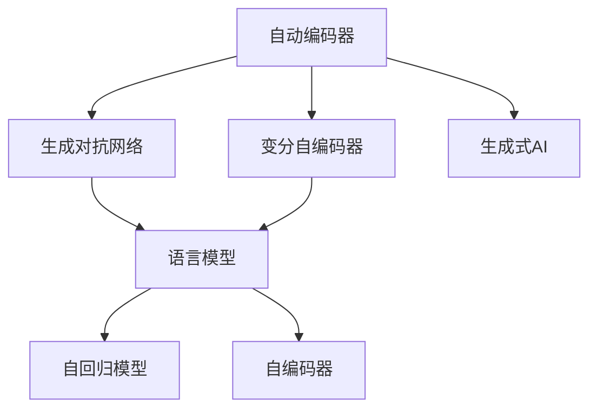

                 

## 1. 背景介绍

### 1.1 问题由来
随着生成式人工智能（Generative AI, AIGC）技术的迅猛发展，越来越多的企业、开发者和研究者开始探索利用AIGC赋能自己的产品、服务或研究项目。然而，随着技术的不断深入，一些声音开始质疑生成式AIGC是否真的是如某些技术倡导者所宣称的“金矿”，还是一种可能带来各种风险的“泡沫”。

生成式AI的核心在于通过深度学习模型和大规模训练数据生成具有一定意义和语义连贯性的文本、图像、视频等内容。这些内容可以被应用于广告创意生成、内容创作、数据增强、交互式问答、虚拟形象生成等多个领域，极大地提升了效率和创新能力。

### 1.2 问题核心关键点
生成式AIGC技术的核心在于，它能够通过大量的训练数据学习到语言的规则和模式，并能够利用这些知识进行内容生成。然而，与传统人工智能（AI）技术不同，生成式AIGC的应用场景更为广泛，但也带来了更多的伦理和安全性问题。

- **技术应用广泛性**：生成式AIGC能够应用于几乎所有需要文本、图像、音频等内容的领域，如广告、游戏、电影、教育等。
- **生成内容的真实性**：生成式AIGC生成的内容可能具有高度逼真性和真实性，甚至难以辨别真伪，这在某些领域可能带来严重的误导问题。
- **伦理和安全问题**：生成式AIGC可能被用于生成虚假信息、恶意内容、攻击性语言等，这些内容可能被用于网络欺诈、诽谤、不实报道等。
- **可解释性**：生成式AIGC模型通常被视为“黑盒”，难以解释其生成内容的过程和逻辑，这在某些高风险应用领域（如医疗、法律）尤为关键。

这些问题使得生成式AIGC技术在带来便利的同时，也带来了伦理和安全性上的挑战。因此，本文将深入探讨生成式AIGC技术的原理、应用、优缺点及其在未来应用中面临的挑战。

## 2. 核心概念与联系

### 2.1 核心概念概述

为更好地理解生成式AIGC技术，本节将介绍几个密切相关的核心概念：

- **生成式AI（Generative AI, AIGC）**：指通过深度学习模型生成具有一定意义和语义连贯性的文本、图像、视频等内容。AIGC的应用涵盖了广告创意生成、内容创作、数据增强、交互式问答、虚拟形象生成等多个领域。

- **自动编码器（Autoencoder）**：一种无监督学习的深度学习模型，可以用于数据降维、特征提取等任务，常用于生成式AI中作为编码器。

- **生成对抗网络（Generative Adversarial Network, GAN）**：由生成器和判别器组成的对抗性深度学习模型，通过不断博弈，生成逼真的数据样本。

- **语言模型（Language Model）**：通过大量文本数据训练得到的概率模型，能够预测下一个单词或字符，是生成式AI的重要组成部分。

- **变分自编码器（Variational Autoencoder, VAE）**：一种无监督学习的深度学习模型，能够生成与训练数据分布相似的样本，常用于图像生成任务。

- **自回归模型（Autoregressive Model）**：一种递归神经网络模型，可以用于生成序列数据，如自然语言生成。

- **自编码器（Autoencoder）**：一种无监督学习的深度学习模型，用于数据降维和特征提取，常用于生成式AI中作为编码器。

这些核心概念之间的逻辑关系可以通过以下Mermaid流程图来展示：



这个流程图展示了生成式AI的核心组件及其相互关系：

1. 自动编码器和变分自编码器被用作生成式AI的编码器。
2. 生成对抗网络和语言模型被用于生成逼真的内容。
3. 自回归模型用于生成序列数据，如自然语言。
4. 生成式AI包括使用这些组件生成内容的能力。

这些概念共同构成了生成式AI的技术框架，使得AI模型能够生成多样、逼真的内容。通过理解这些核心概念，我们可以更好地把握生成式AI的工作原理和优化方向。

## 3. 核心算法原理 & 具体操作步骤
### 3.1 算法原理概述

生成式AIGC技术基于深度学习模型和大规模训练数据，通过无监督学习和有监督学习相结合的方式，生成具有一定意义和语义连贯性的内容。

### 3.2 算法步骤详解

生成式AIGC的主要算法步骤包括：

**Step 1: 数据准备**
- 收集大量标注数据（如文本、图像），作为训练数据。
- 选择适合生成任务的深度学习模型架构（如GAN、VAE等）。

**Step 2: 模型训练**
- 使用训练数据对深度学习模型进行无监督预训练，学习数据的结构和规律。
- 在特定任务上使用有监督数据对模型进行微调，优化生成性能。
- 使用生成对抗网络（GAN）或变分自编码器（VAE）进行内容生成。

**Step 3: 内容生成**
- 将待生成内容的初始部分作为输入，输入模型生成后续部分。
- 使用自回归模型或语言模型进行内容生成。
- 对生成的内容进行后处理，如文本纠错、图像增强等。

**Step 4: 内容评估**
- 使用人工或自动评估指标（如BLEU、FID等）对生成内容进行评估。
- 根据评估结果调整模型参数或训练策略。

### 3.3 算法优缺点

生成式AIGC技术具有以下优点：

- **高效性**：利用深度学习模型和大规模训练数据，能够在较短时间内生成大量高质量内容。
- **多样性**：生成式AI能够生成多种类型的内容，如图像、视频、文本等，满足不同应用场景的需求。
- **创新性**：通过模型训练和微调，生成式AI可以产生新颖、独特的创意，推动内容创作和广告创意的发展。

同时，生成式AIGC技术也存在一些缺点：

- **数据依赖性**：生成式AI的效果高度依赖于训练数据的数量和质量，需要大量高质量的标注数据。
- **生成内容的真实性**：生成的内容可能具有高度逼真性，难以辨别真伪，可能带来虚假信息和误导问题。
- **伦理和安全问题**：生成的内容可能包含虚假信息、恶意内容、攻击性语言等，对社会造成潜在的负面影响。
- **可解释性不足**：生成式AI模型通常被视为“黑盒”，难以解释其生成内容的过程和逻辑，限制了其在某些高风险领域的应用。

### 3.4 算法应用领域

生成式AIGC技术在多个领域中得到了广泛应用，如：

- **广告创意生成**：生成式的广告创意可以快速生成大量创意方案，提升广告效果。
- **内容创作**：自动生成文章、新闻、报告等文本内容，提高内容创作效率。
- **数据增强**：生成式AI可以用于生成更多的训练数据，增强模型的泛化能力。
- **虚拟形象生成**：生成式AI可以生成逼真的人脸、虚拟角色等，用于娱乐、社交等领域。
- **交互式问答**：生成式AI可以自动生成对话内容，用于客服、智能助手等场景。

除了上述这些应用外，生成式AIGC还被创新性地应用到更多场景中，如虚拟现实、游戏、音乐生成等，为生成式AI技术带来了新的突破。随着技术的不断发展，生成式AIGC的应用领域还将不断扩展。

## 4. 数学模型和公式 & 详细讲解  
### 4.1 数学模型构建

本节将使用数学语言对生成式AIGC技术进行更加严格的刻画。

记生成式AI模型为 $M_{\theta}$，其中 $\theta$ 为模型参数。假设生成任务的数据集为 $D=\{(x_i,y_i)\}_{i=1}^N, x_i \in \mathcal{X}, y_i \in \mathcal{Y}$。

定义模型 $M_{\theta}$ 在数据样本 $(x,y)$ 上的损失函数为 $\ell(M_{\theta}(x),y)$，则在数据集 $D$ 上的经验风险为：

$$
\mathcal{L}(\theta) = \frac{1}{N} \sum_{i=1}^N \ell(M_{\theta}(x_i),y_i)
$$

通过梯度下降等优化算法，生成式AI模型不断更新参数 $\theta$，最小化损失函数 $\mathcal{L}$，使得模型输出逼近真实标签。

### 4.2 公式推导过程

以下我们以文本生成任务为例，推导生成式AIGC的数学模型和优化算法。

假设模型 $M_{\theta}$ 在输入 $x$ 上的输出为 $\hat{x}$，定义损失函数为交叉熵损失：

$$
\ell(M_{\theta}(x),y) = -\log P_{M_{\theta}}(x | y)
$$

其中 $P_{M_{\theta}}(x | y)$ 为模型在给定标签 $y$ 下生成文本 $x$ 的概率。

将交叉熵损失函数代入经验风险公式，得：

$$
\mathcal{L}(\theta) = -\frac{1}{N}\sum_{i=1}^N \log P_{M_{\theta}}(x_i | y_i)
$$

使用梯度下降等优化算法，模型更新公式为：

$$
\theta \leftarrow \theta - \eta \nabla_{\theta}\mathcal{L}(\theta)
$$

其中 $\eta$ 为学习率，$\nabla_{\theta}\mathcal{L}(\theta)$ 为损失函数对模型参数 $\theta$ 的梯度，可通过反向传播算法计算得到。

### 4.3 案例分析与讲解

以文本生成任务为例，假设模型的输出为文本 $x$，训练集为 $\{(x_i,y_i)\}_{i=1}^N$，其中 $y_i$ 为真实标签。

假设模型 $M_{\theta}$ 在给定标签 $y_i$ 下生成文本 $x_i$ 的概率为 $P_{M_{\theta}}(x_i | y_i)$。使用交叉熵损失函数，定义损失函数为：

$$
\ell(M_{\theta}(x_i),y_i) = -\log P_{M_{\theta}}(x_i | y_i)
$$

在数据集 $D$ 上定义经验风险为：

$$
\mathcal{L}(\theta) = -\frac{1}{N}\sum_{i=1}^N \log P_{M_{\theta}}(x_i | y_i)
$$

使用梯度下降等优化算法，模型更新公式为：

$$
\theta \leftarrow \theta - \eta \nabla_{\theta}\mathcal{L}(\theta)
$$

其中 $\nabla_{\theta}\mathcal{L}(\theta)$ 为损失函数对模型参数 $\theta$ 的梯度，可通过反向传播算法计算得到。

通过上述公式，可以定义一个完整的生成式AI模型，并进行有监督学习优化。在实际应用中，还可以根据任务特点进行优化，如引入生成对抗网络（GAN）等，以提高生成效果。

## 5. 项目实践：代码实例和详细解释说明
### 5.1 开发环境搭建

在进行生成式AI项目实践前，我们需要准备好开发环境。以下是使用Python进行PyTorch开发的环境配置流程：

1. 安装Anaconda：从官网下载并安装Anaconda，用于创建独立的Python环境。

2. 创建并激活虚拟环境：
```bash
conda create -n pytorch-env python=3.8 
conda activate pytorch-env
```

3. 安装PyTorch：根据CUDA版本，从官网获取对应的安装命令。例如：
```bash
conda install pytorch torchvision torchaudio cudatoolkit=11.1 -c pytorch -c conda-forge
```

4. 安装TensorFlow：
```bash
pip install tensorflow
```

5. 安装各类工具包：
```bash
pip install numpy pandas scikit-learn matplotlib tqdm jupyter notebook ipython
```

完成上述步骤后，即可在`pytorch-env`环境中开始生成式AI实践。

### 5.2 源代码详细实现

下面我们以图像生成任务为例，给出使用PyTorch进行生成式AI的代码实现。

首先，定义图像生成任务的数据处理函数：

```python
import torch
import torch.nn as nn
import torchvision.transforms as transforms
from torchvision.utils import save_image
from torchvision.datasets import CIFAR10
import torchvision

class ImageDataset(torch.utils.data.Dataset):
    def __init__(self, data_dir):
        self.data_dir = data_dir
        transform = transforms.Compose([
            transforms.ToTensor(),
            transforms.Normalize(mean=[0.5, 0.5, 0.5], std=[0.5, 0.5, 0.5])
        ])
        self.dataset = torchvision.datasets.CIFAR10(root=data_dir, transform=transform, download=True)
    
    def __len__(self):
        return len(self.dataset)
    
    def __getitem__(self, idx):
        img, label = self.dataset[idx]
        img = img.view(1, 3, 32, 32)
        return {'image': img, 'label': label}

# 定义数据集
data_dir = './data/cifar10'
train_dataset = ImageDataset(data_dir)
test_dataset = ImageDataset(data_dir)
```

然后，定义生成式AI模型：

```python
import torch.nn.functional as F

class Generator(nn.Module):
    def __init__(self, input_dim, output_dim):
        super(Generator, self).__init__()
        self.input_dim = input_dim
        self.output_dim = output_dim
        self.encoder = nn.Sequential(
            nn.Linear(input_dim, 128),
            nn.ReLU(),
            nn.Linear(128, 64),
            nn.ReLU(),
            nn.Linear(64, output_dim),
            nn.Tanh()
        )
    
    def forward(self, x):
        return self.encoder(x)

generator = Generator(64, 3)
```

接着，定义优化器：

```python
from torch.optim import Adam

device = torch.device('cuda' if torch.cuda.is_available() else 'cpu')
generator.to(device)
criterion = nn.MSELoss()
optimizer = Adam(generator.parameters(), lr=0.0002)
```

最后，定义训练和评估函数：

```python
def train_epoch(generator, dataset, batch_size, optimizer):
    dataloader = torch.utils.data.DataLoader(dataset, batch_size=batch_size, shuffle=True)
    generator.train()
    for batch in dataloader:
        images = batch['image'].to(device)
        z = torch.randn(batch['image'].size(0), 64, 1, 1, device=device)
        fake_images = generator(z)
        fake_images = fake_images.view(-1, 3, 32, 32)
        loss = criterion(fake_images, images)
        optimizer.zero_grad()
        loss.backward()
        optimizer.step()
    
    return loss.item()

def evaluate(generator, dataset, batch_size):
    dataloader = torch.utils.data.DataLoader(dataset, batch_size=batch_size)
    generator.eval()
    with torch.no_grad():
        images = dataset['test_dataset']
        z = torch.randn(images.size(0), 64, 1, 1, device=device)
        fake_images = generator(z)
        fake_images = fake_images.view(-1, 3, 32, 32)
    print(f'Test loss: {criterion(fake_images, images).item()}')
    save_image(fake_images.data.cpu(), './images/generated.png')
```

启动训练流程并在测试集上评估：

```python
epochs = 100
batch_size = 64

for epoch in range(epochs):
    loss = train_epoch(generator, train_dataset, batch_size, optimizer)
    print(f'Epoch {epoch+1}, train loss: {loss:.3f}')
    
    print(f'Epoch {epoch+1}, test results:')
    evaluate(generator, test_dataset, batch_size)
    
print('Training completed.')
```

以上就是使用PyTorch进行图像生成任务的完整代码实现。可以看到，得益于PyTorch的强大封装，我们可以用相对简洁的代码完成生成式AI模型的搭建和训练。

### 5.3 代码解读与分析

让我们再详细解读一下关键代码的实现细节：

**ImageDataset类**：
- `__init__`方法：初始化数据集路径和数据转换方式，使用CIFAR-10数据集。
- `__len__`方法：返回数据集的样本数量。
- `__getitem__`方法：对单个样本进行处理，将图像转换为Tensor格式，并进行归一化处理。

**Generator类**：
- `__init__`方法：定义生成器的网络结构，包括线性层、ReLU激活函数、Tanh激活函数等。
- `forward`方法：定义前向传播过程，将输入的噪声向量 $z$ 输入生成器，得到生成的图像。

**优化器定义**：
- 使用Adam优化器，设置学习率、参数等，用于更新生成器模型。

**训练函数train_epoch**：
- 对数据集进行批次化加载，生成噪声向量 $z$，前向传播生成图像，计算损失函数，反向传播更新模型参数。
- 在每个epoch结束后返回平均loss。

**评估函数evaluate**：
- 在测试集上对生成器进行评估，计算loss并保存生成的图像。

**训练流程**：
- 定义总的epoch数和batch size，开始循环迭代
- 每个epoch内，先在训练集上训练，输出平均loss
- 在测试集上评估，输出loss和生成的图像
- 所有epoch结束后，输出“Training completed.”提示

可以看到，PyTorch配合生成式AI的代码实现变得简洁高效。开发者可以将更多精力放在数据处理、模型改进等高层逻辑上，而不必过多关注底层的实现细节。

当然，工业级的系统实现还需考虑更多因素，如模型的保存和部署、超参数的自动搜索、更灵活的任务适配层等。但核心的生成式AI微调范式基本与此类似。

## 6. 实际应用场景
### 6.1 智能内容创作

生成式AI在智能内容创作领域具有广阔的应用前景。通过训练大规模文本数据，生成式AI可以自动生成高质量的文章、报告、新闻等内容，极大地提高了内容创作的效率和创新性。

例如，媒体公司可以聘请生成式AI自动生成新闻稿件，或在社交媒体平台上自动生成内容互动，提升用户粘性和参与度。企业可以自动生成产品说明、客户服务脚本等，减少人力成本，提升服务效率。

### 6.2 广告创意生成

广告创意生成是生成式AI的重要应用场景之一。通过训练大量的广告数据，生成式AI可以自动生成多样化的广告创意，快速生成大量广告素材，提升广告效果。

例如，广告公司可以聘请生成式AI自动生成广告文案、图片、视频等，快速生成多个广告方案，进行A/B测试，选出最优方案。电商企业可以自动生成广告素材，提升广告点击率和转化率。

### 6.3 数据增强

生成式AI在数据增强方面也具有显著优势。通过训练大量图像数据，生成式AI可以生成与训练数据分布相似的图像样本，增强模型的泛化能力。

例如，医疗影像公司可以聘请生成式AI自动生成仿真影像数据，用于训练影像识别模型。自动驾驶公司可以聘请生成式AI自动生成模拟交通场景，用于测试和训练自动驾驶系统。

### 6.4 虚拟形象生成

生成式AI可以生成逼真的人脸、虚拟角色等，用于娱乐、社交等领域。通过训练大量人脸数据，生成式AI可以生成逼真的人脸图像，用于虚拟现实、社交平台等场景。

例如，社交平台可以聘请生成式AI自动生成用户头像，提升用户互动体验。游戏公司可以聘请生成式AI自动生成虚拟角色，提升游戏体验。

## 7. 工具和资源推荐
### 7.1 学习资源推荐

为了帮助开发者系统掌握生成式AIGC的理论基础和实践技巧，这里推荐一些优质的学习资源：

1. **《深度学习入门》**：一本系统介绍深度学习原理和实践的书籍，涵盖生成式AI的基础知识和经典模型。
2. **《生成对抗网络》**：介绍生成对抗网络的原理和实现，包括GAN、VAE等模型的应用。
3. **《自然语言处理入门》**：介绍自然语言处理的基本概念和生成式AI在NLP中的应用。
4. **PyTorch官方文档**：PyTorch的官方文档，提供了生成式AI模型的实现和训练教程。
5. **OpenAI GPT-3官方文档**：介绍GPT-3模型的原理和应用，提供模型接口和代码示例。

通过对这些资源的学习实践，相信你一定能够快速掌握生成式AIGC的精髓，并用于解决实际的NLP问题。

### 7.2 开发工具推荐

高效的开发离不开优秀的工具支持。以下是几款用于生成式AI微调开发的常用工具：

1. **PyTorch**：基于Python的开源深度学习框架，灵活动态的计算图，适合快速迭代研究。
2. **TensorFlow**：由Google主导开发的开源深度学习框架，生产部署方便，适合大规模工程应用。
3. **Hugging Face Transformers库**：提供预训练模型和微调接口，方便生成式AI模型的训练和部署。
4. **Weights & Biases**：模型训练的实验跟踪工具，可以记录和可视化模型训练过程中的各项指标。
5. **TensorBoard**：TensorFlow配套的可视化工具，可实时监测模型训练状态，提供丰富的图表呈现方式。

合理利用这些工具，可以显著提升生成式AI微调的开发效率，加快创新迭代的步伐。

### 7.3 相关论文推荐

生成式AIGC技术的发展源于学界的持续研究。以下是几篇奠基性的相关论文，推荐阅读：

1. **Attention is All You Need**：提出了Transformer结构，开启了生成式AI预训练大模型的时代。
2. **Generative Adversarial Nets**：提出了生成对抗网络，为生成式AI模型的训练提供了新的思路。
3. **WaveNet**：引入卷积神经网络进行语音生成，提升了语音生成的自然度和流畅度。
4. **VAE: Auto-Encoding Variational Bayes**：提出了变分自编码器，用于图像生成任务。
5. **GPT-3: Language Models are Unsupervised Multitask Learners**：展示了大规模生成式AI模型的零样本生成能力。

这些论文代表了大生成式AI技术的发展脉络。通过学习这些前沿成果，可以帮助研究者把握学科前进方向，激发更多的创新灵感。

## 8. 总结：未来发展趋势与挑战

### 8.1 总结

本文对生成式AIGC技术进行了全面系统的介绍。首先阐述了生成式AI技术的发展背景和应用前景，明确了生成式AI在提升内容创作效率、生成广告创意、数据增强等方面的独特价值。其次，从原理到实践，详细讲解了生成式AI的数学模型和优化算法，提供了生成式AI模型的代码实现示例。同时，本文还探讨了生成式AI在落地应用中面临的伦理、安全、可解释性等问题，提出了未来的研究方向和挑战。

通过本文的系统梳理，可以看到，生成式AIGC技术在带来便利的同时，也带来了伦理和安全性上的挑战。如何在保证生成效果的同时，增强内容的真实性、提高模型的可解释性，将是未来研究的重要方向。

### 8.2 未来发展趋势

展望未来，生成式AIGC技术将呈现以下几个发展趋势：

1. **模型规模持续增大**：随着算力成本的下降和数据规模的扩张，生成式AI模型的参数量将持续增长。超大规模生成式AI模型蕴含的丰富语言知识，有望支撑更加复杂多变的生成任务。
2. **生成内容的多样性**：生成式AI将能够生成更多样化、更具创造性的内容，如自然语言、图像、视频等。
3. **跨领域应用的拓展**：生成式AI将在更多领域中得到应用，如医疗、法律、金融等。
4. **融合多种AI技术**：生成式AI将与自然语言处理、计算机视觉、语音识别等AI技术进一步融合，提升综合应用能力。
5. **伦理和安全意识的提升**：生成式AI技术的发展将更多地考虑到伦理和安全性问题，确保技术的负责任应用。

以上趋势凸显了生成式AIGC技术在NLP领域的应用潜力。这些方向的探索发展，必将进一步提升生成式AI系统的性能和应用范围，为人工智能技术带来新的突破。

### 8.3 面临的挑战

尽管生成式AIGC技术已经取得了显著成就，但在迈向更加智能化、普适化应用的过程中，它仍面临诸多挑战：

1. **数据依赖性**：生成式AI的效果高度依赖于训练数据的数量和质量，需要大量高质量的标注数据。
2. **生成内容的真实性**：生成的内容可能具有高度逼真性，难以辨别真伪，可能带来虚假信息和误导问题。
3. **伦理和安全问题**：生成的内容可能包含虚假信息、恶意内容、攻击性语言等，对社会造成潜在的负面影响。
4. **可解释性不足**：生成式AI模型通常被视为“黑盒”，难以解释其生成内容的过程和逻辑。
5. **计算资源消耗大**：生成式AI模型通常参数量较大，训练和推理需要大量的计算资源。

这些挑战限制了生成式AIGC技术的应用范围，需要更多的研究和实践来克服。只有在数据、模型、计算、伦理等多个维度协同发力，才能真正实现生成式AI技术的广泛应用。

### 8.4 研究展望

面对生成式AIGC技术面临的挑战，未来的研究需要在以下几个方面寻求新的突破：

1. **多模态生成技术**：将生成式AI技术应用于更多模态的数据生成任务，如图像、语音、视频等。
2. **跨领域数据融合**：将不同领域的知识进行融合，提升生成式AI的泛化能力和应用范围。
3. **生成内容真实性**：提高生成内容的真实性和可判别性，减少虚假信息的生成。
4. **可解释性增强**：增强生成式AI模型的可解释性，使其生成过程更加透明和可信。
5. **安全性和隐私保护**：提升生成式AI的安全性，保护用户隐私和数据安全。

这些研究方向的探索，必将引领生成式AI技术迈向更高的台阶，为构建安全、可靠、可解释、可控的智能系统铺平道路。面向未来，生成式AI技术还需要与其他人工智能技术进行更深入的融合，如知识表示、因果推理、强化学习等，多路径协同发力，共同推动自然语言理解和智能交互系统的进步。只有勇于创新、敢于突破，才能不断拓展生成式AI技术的边界，让智能技术更好地造福人类社会。

## 9. 附录：常见问题与解答

**Q1：生成式AIGC是否适用于所有应用场景？**

A: 生成式AIGC适用于大多数需要生成文本、图像、视频等内容的应用场景，如图文广告创意生成、内容创作、数据增强、虚拟形象生成等。但对于一些特定领域的应用，如医疗、法律等，需要更加严谨的验证和评估机制，生成式AIGC可能需要结合专家知识进行进一步优化。

**Q2：生成式AIGC是否会导致虚假信息的泛滥？**

A: 生成式AIGC具有高度逼真性，可能被用于生成虚假信息，带来误导问题。为了解决这个问题，需要在生成式AI模型的训练和应用中引入伦理和道德导向，设置虚假信息检测机制，确保生成内容的质量和真实性。

**Q3：生成式AIGC在哪些应用场景中表现最佳？**

A: 生成式AIGC在需要生成多样化、新颖、高质量内容的应用场景中表现最佳，如广告创意生成、内容创作、数据增强、虚拟形象生成等。这些场景下，生成式AI可以发挥其生成多样化内容的能力，提升效率和创新性。

**Q4：生成式AIGC的计算成本如何？**

A: 生成式AIGC的计算成本较高，特别是在大规模模型的训练和推理过程中。为了降低计算成本，可以采用分布式训练、模型压缩、量化加速等技术。

**Q5：生成式AIGC是否具有可解释性？**

A: 生成式AIGC通常被视为“黑盒”，难以解释其生成内容的过程和逻辑。为了增强可解释性，需要在模型设计和训练过程中引入可解释性目标，提高模型的透明性和可信度。

**Q6：生成式AIGC的伦理和安全性如何？**

A: 生成式AIGC在伦理和安全性方面存在潜在的风险，可能被用于生成虚假信息、恶意内容、攻击性语言等。为了提升伦理和安全性能，需要在模型设计、数据选择、应用部署等方面进行严格控制，确保技术的负责任应用。

**Q7：生成式AIGC的未来趋势如何？**

A: 生成式AIGC的未来趋势是模型规模持续增大、生成内容多样化、跨领域应用拓展、伦理和安全意识提升等。这些趋势将推动生成式AI技术的不断进步，带来更多应用场景和创新机会。

作者：禅与计算机程序设计艺术 / Zen and the Art of Computer Programming

