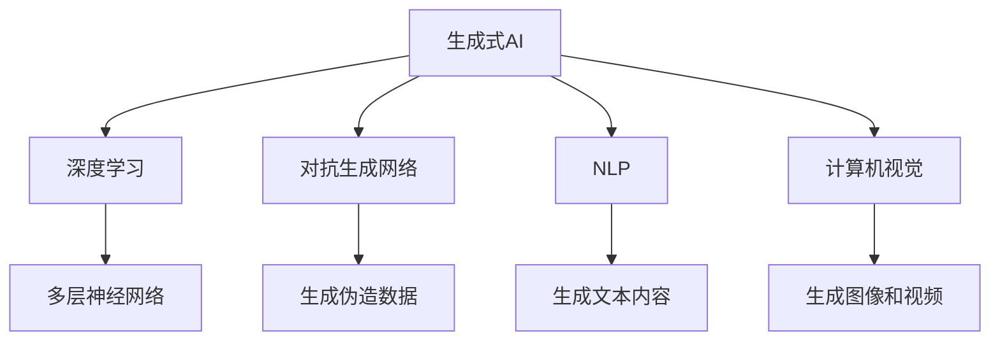

                 

# 生成式AI：泡沫还是未来？理性分析与投资建议

生成式人工智能（Generative AI）近年来迅速崛起，成为科技和投资界关注的焦点。但随着其热度不断攀升，也引发了众多质疑，甚至有人将其标签化为“泡沫”。本文旨在理性分析生成式AI的现状、优势与挑战，提出客观的投资建议，帮助投资者更好地理解这一领域的发展趋势和投资机会。

## 1. 背景介绍

### 1.1 问题由来

生成式AI是指能够生成具有创造性内容的AI系统，例如文本、图像、音频、视频等。这些系统通过学习大量的数据和模式，能够创作出符合人类审美和认知的内容。生成式AI的出现，极大地推动了娱乐、艺术、教育、商业等多个领域的发展。

近年来，生成式AI取得了一系列突破性进展，尤其是在深度学习技术的驱动下，生成式模型如GPT、DALL·E等在文本生成、图像生成等方面表现优异，引发了广泛的关注和应用。但随着热度上升，市场对于生成式AI的价值、风险和投资机会的看法不一，甚至有人质疑其存在的价值，认为其不过是“泡沫”。

### 1.2 问题核心关键点

生成式AI的争议主要集中在以下几个方面：

- 技术成熟度：生成式AI在生成内容的真实性、创新性和多样性上是否达到商业化应用的标准？
- 市场接受度：公众和专业人士对生成式AI的接受度和信任度如何？
- 商业价值：生成式AI在提高效率、降低成本、创造价值方面的实际效果如何？
- 风险与挑战：数据隐私、算法透明、知识产权等方面的问题如何解决？

本文将从技术、市场、商业和风险等多个角度，全面分析生成式AI的现状与前景，提出理性的投资建议。

## 2. 核心概念与联系

### 2.1 核心概念概述

为更好地理解生成式AI的现状与未来，我们首先需要梳理几个核心概念：

- **生成式AI（Generative AI）**：指能够生成新内容（如文本、图像、音频等）的AI系统。这些系统通常基于深度学习模型，通过学习大量数据，能够创作出具有创意和多样性的内容。

- **深度学习（Deep Learning）**：生成式AI的核心技术之一，通过多层神经网络结构，学习和提取数据中的复杂模式，生成新内容。

- **对抗生成网络（GAN）**：一种深度学习模型，能够生成与真实数据分布相似的伪造数据，广泛应用于图像生成、视频生成等领域。

- **自然语言处理（NLP）**：生成式AI的重要应用之一，通过深度学习模型，生成符合语法和语义规则的文本内容。

- **计算机视觉（CV）**：生成式AI的另一个重要应用，通过深度学习模型，生成符合人类审美和认知的图像和视频内容。

这些概念相互关联，共同构成了生成式AI的技术基础和应用场景。理解这些概念的原理和应用，将有助于我们全面评估生成式AI的现状与前景。

### 2.2 核心概念原理和架构的 Mermaid 流程图(Mermaid 流程节点中不要有括号、逗号等特殊字符)



这个流程图展示了生成式AI的核心概念及其相互关系。通过理解这些概念的原理和架构，我们可以更好地把握生成式AI的技术发展和应用前景。

## 3. 核心算法原理 & 具体操作步骤

### 3.1 算法原理概述

生成式AI的算法原理主要基于深度学习，特别是对抗生成网络（GAN）和自然语言处理（NLP）技术。其核心目标是生成符合特定规则或分布的新内容，例如生成文本、图像、音频等。

### 3.2 算法步骤详解

生成式AI的算法步骤大致如下：

1. **数据收集与预处理**：收集大量与目标内容相关的数据，并进行预处理，如清洗、标注、标准化等，以提高模型训练的效果。

2. **模型训练**：使用深度学习模型（如GAN、RNN、Transformer等）对数据进行训练，学习数据中的模式和规律，生成新内容。

3. **模型优化与调整**：通过调整模型的超参数、改进损失函数、增加正则化等方法，优化模型的性能，提高生成内容的真实性和多样性。

4. **生成内容**：使用训练好的模型，输入随机噪声或特定指令，生成符合期望分布的新内容。

5. **评估与反馈**：对生成的内容进行评估，如通过专家评审、用户测试等方法，收集反馈，进一步优化模型。

### 3.3 算法优缺点

生成式AI的优势在于其能够生成符合人类审美和认知的内容，具有广泛的适用性和潜力。其主要优点包括：

- **创造性**：生成式AI能够创作出新颖、多样化的内容，广泛应用于创意写作、艺术设计、娱乐等领域。
- **效率高**：相比于传统内容创作，生成式AI能够显著提高内容生产的效率，降低成本。
- **可扩展性**：生成式AI可以根据不同的应用场景，进行参数和结构上的调整，具有较强的可扩展性。

然而，生成式AI也存在一些缺点：

- **数据依赖**：生成式AI需要大量高质量的数据进行训练，数据隐私和版权问题成为主要挑战。
- **真实性问题**：生成的内容可能存在与真实数据分布不一致的问题，导致内容失真。
- **算法透明性**：生成式AI的生成过程复杂，难以解释和理解，增加了其使用的难度和不确定性。
- **伦理问题**：生成的内容可能存在偏见、歧视等问题，对社会伦理造成影响。

### 3.4 算法应用领域

生成式AI在多个领域中得到了广泛应用，主要包括以下几个方面：

- **娱乐与媒体**：生成式AI用于音乐创作、电影制作、游戏开发等领域，提高了内容的生产效率和创意性。
- **教育与培训**：生成式AI用于生成教材、练习题、虚拟现实教学内容等，辅助教育培训。
- **金融与保险**：生成式AI用于生成报告、分析预测、客户服务等，提升金融和保险行业的效率和客户体验。
- **医疗与健康**：生成式AI用于医疗影像分析、药物研发、健康管理等领域，提供新型的诊断和治疗方案。
- **工业与制造**：生成式AI用于产品设计、制造优化、供应链管理等，推动制造业的智能化转型。

这些应用展示了生成式AI的广泛潜力和实际价值。

## 4. 数学模型和公式 & 详细讲解 & 举例说明

### 4.1 数学模型构建

生成式AI的数学模型主要基于深度学习模型，如GAN、RNN、Transformer等。以GAN为例，其数学模型构建如下：

- **生成器（Generator）**：输入随机噪声，通过多层神经网络生成新内容。
- **判别器（Discriminator）**：输入真实数据和新生成内容，通过多层神经网络判断其真实性。
- **损失函数**：通过对抗训练，优化生成器和判别器的参数，使生成内容尽可能接近真实内容。

### 4.2 公式推导过程

以GAN为例，推导其核心公式。假设生成器和判别器均为多层神经网络，生成器的输出为 $G(z)$，判别器的输出为 $D(x)$。则GAN的损失函数可以表示为：

$$
\mathcal{L}(G,D) = E_{x\sim p_x}[\log D(x)] + E_{z\sim p_z}[\log(1-D(G(z)))]
$$

其中 $p_x$ 为真实数据分布，$p_z$ 为噪声分布。

生成器通过最小化 $D(G(z))$ 来生成逼真的内容，而判别器通过最大化 $D(x)$ 和 $1-D(G(z))$ 来提高鉴别能力。通过对抗训练，生成器和判别器不断优化，最终生成高质量的新内容。

### 4.3 案例分析与讲解

以文本生成为例，展示生成式AI在文本创作中的应用。假设我们有一个文本生成模型 $M_{\theta}$，其输入为 $x$，输出为 $y$。通过深度学习模型对大量文本数据进行训练，模型 $M_{\theta}$ 可以学习到文本生成的规律，生成符合特定规则和分布的新文本。

例如，输入一个简单的指令“生成一首关于春天的诗歌”，模型 $M_{\theta}$ 可以生成符合该指令的新诗歌。其生成过程可以表示为：

1. **数据预处理**：收集大量关于春天的诗歌，进行清洗和标准化。
2. **模型训练**：使用深度学习模型对数据进行训练，学习文本生成的规律。
3. **生成内容**：输入指令“生成一首关于春天的诗歌”，模型 $M_{\theta}$ 生成新诗歌。

生成的诗歌可能不是完美的，但可以通过进一步优化和调整模型参数，提高生成内容的真实性和多样性。

## 5. 项目实践：代码实例和详细解释说明

### 5.1 开发环境搭建

进行生成式AI的实践，需要搭建合适的开发环境。以下是基于Python和TensorFlow的开发环境搭建步骤：

1. **安装Anaconda**：从官网下载并安装Anaconda，用于创建独立的Python环境。

2. **创建并激活虚拟环境**：
```bash
conda create -n genai-env python=3.8 
conda activate genai-env
```

3. **安装TensorFlow和其他依赖**：
```bash
conda install tensorflow==2.3 
pip install numpy pandas scikit-learn matplotlib tqdm jupyter notebook ipython
```

4. **安装相关库**：
```bash
pip install transformers
```

完成上述步骤后，即可在`genai-env`环境中进行生成式AI的实践。

### 5.2 源代码详细实现

以文本生成模型为例，展示基于GAN的文本生成代码实现。

```python
import tensorflow as tf
from tensorflow.keras import layers

# 定义生成器
class Generator(tf.keras.Model):
    def __init__(self, latent_dim):
        super(Generator, self).__init__()
        self.dense1 = layers.Dense(256, input_dim=latent_dim)
        self.dense2 = layers.Dense(512)
        self.dense3 = layers.Dense(1024)
        self.dense4 = layers.Dense(784, activation='tanh')

    def call(self, x):
        x = tf.nn.relu(self.dense1(x))
        x = tf.nn.relu(self.dense2(x))
        x = tf.nn.relu(self.dense3(x))
        x = self.dense4(x)
        return x

# 定义判别器
class Discriminator(tf.keras.Model):
    def __init__(self, img_shape=(784,)):
        super(Discriminator, self).__init__()
        self.flatten = layers.Flatten()
        self.dense1 = layers.Dense(1024)
        self.dense2 = layers.Dense(512)
        self.dense3 = layers.Dense(1, activation='sigmoid')

    def call(self, x):
        x = tf.reshape(x, (x.shape[0], -1))
        x = tf.nn.relu(self.dense1(x))
        x = tf.nn.relu(self.dense2(x))
        x = self.dense3(x)
        return x

# 定义GAN模型
class GAN(tf.keras.Model):
    def __init__(self, latent_dim):
        super(GAN, self).__init__()
        self.gen = Generator(latent_dim)
        self.dis = Discriminator()

    def train_step(self, x, y):
        with tf.GradientTape() as gen_tape, tf.GradientTape() as dis_tape:
            generated_images = self.gen(x)
            real_output = self.dis(x)
            fake_output = self.dis(generated_images)

            gen_loss = tf.reduce_mean(tf.keras.losses.BinaryCrossentropy(from_logits=True)(tf.ones_like(real_output), real_output))
            dis_loss = tf.reduce_mean(tf.keras.losses.BinaryCrossentropy(from_logits=True)(tf.ones_like(real_output), real_output)) + tf.reduce_mean(tf.keras.losses.BinaryCrossentropy(from_logits=True)(tf.zeros_like(fake_output), fake_output))
        gradients_of_generator = gen_tape.gradient(gen_loss, self.gen.trainable_variables)
        gradients_of_discriminator = dis_tape.gradient(dis_loss, self.dis.trainable_variables)
        self.gen.optimizer.apply_gradients(zip(gradients_of_generator, self.gen.trainable_variables))
        self.dis.optimizer.apply_gradients(zip(gradients_of_discriminator, self.dis.trainable_variables))

    def generate(self, x):
        generated_images = self.gen(x)
        return generated_images
```

### 5.3 代码解读与分析

**GAN类**：
- **Generator类**：定义生成器的神经网络结构，通过多层神经网络生成新文本。
- **Discriminator类**：定义判别器的神经网络结构，通过多层神经网络判断文本的真实性。
- **GAN类**：将生成器和判别器整合到GAN模型中，定义训练步骤和生成步骤。

**训练步骤**：
- 输入噪声向量 $x$，通过生成器生成新文本。
- 输入真实文本和新文本，通过判别器判断其真实性。
- 计算生成器和判别器的损失函数，使用梯度下降法更新模型参数。

**生成步骤**：
- 输入噪声向量 $x$，通过生成器生成新文本。
- 返回生成的文本内容。

通过以上代码，我们可以实现基于GAN的文本生成模型，并进行训练和生成。

### 5.4 运行结果展示

```python
import numpy as np
import matplotlib.pyplot as plt

# 生成文本
latent_dim = 100
batch_size = 32
noise = np.random.normal(0, 1, (batch_size, latent_dim))
generated_text = ggan.generate(noise)

# 展示生成的文本
for i in range(batch_size):
    print(generated_text[i].decode('utf-8'))

# 展示生成的文本可视化
plt.imshow(generated_text[i].reshape(28, 28), cmap='gray')
plt.show()
```

## 6. 实际应用场景

### 6.1 娱乐与媒体

生成式AI在娱乐和媒体领域有广泛应用，例如音乐创作、电影制作、游戏开发等。通过生成式AI，可以快速生成高质量的影视素材、音乐作品和游戏场景，提升内容创作效率。

### 6.2 教育与培训

生成式AI在教育与培训领域可以用于生成教材、练习题、虚拟现实教学内容等，辅助教育培训。通过生成式AI，可以创建更加生动、互动的教学内容，提高学生的学习兴趣和效果。

### 6.3 金融与保险

生成式AI在金融与保险领域可以用于生成报告、分析预测、客户服务等，提升金融和保险行业的效率和客户体验。通过生成式AI，可以快速生成分析报告和预测结果，辅助决策制定。

### 6.4 医疗与健康

生成式AI在医疗与健康领域可以用于医疗影像分析、药物研发、健康管理等领域，提供新型的诊断和治疗方案。通过生成式AI，可以生成高质量的医学影像和模拟实验数据，辅助医生进行诊断和治疗。

### 6.5 工业与制造

生成式AI在工业与制造领域可以用于产品设计、制造优化、供应链管理等，推动制造业的智能化转型。通过生成式AI，可以生成符合设计规范的产品模型和生产方案，提高制造效率和质量。

## 7. 工具和资源推荐

### 7.1 学习资源推荐

为帮助开发者系统掌握生成式AI的理论基础和实践技巧，以下是一些优质的学习资源：

1. **《深度学习与生成模型》**：由斯坦福大学李飞飞教授主讲，系统介绍了生成式AI的理论基础和实践方法。

2. **《生成对抗网络》**：详细介绍了GAN的原理、实现和应用，是理解生成式AI的重要书籍。

3. **Google Deep Learning Book**：Google官方出版的深度学习教材，介绍了生成式AI及其应用案例。

4. **Coursera《生成式深度学习》课程**：由机器学习专家Andrew Ng主讲，涵盖生成式AI的多个方向，适合初学者和进阶者。

5. **Hugging Face官方文档**：提供了大量生成式AI模型的实现和应用案例，是学习生成式AI的重要资源。

6. **Arxiv**：收集了大量的生成式AI论文，提供了最新的研究成果和理论进展。

### 7.2 开发工具推荐

高效的开发离不开优秀的工具支持。以下是几款用于生成式AI开发的常用工具：

1. **Python**：基于Python的生成式AI开发，代码简洁高效，广泛支持深度学习框架。

2. **TensorFlow**：Google开发的深度学习框架，支持GPU加速，适合大规模模型的训练和推理。

3. **PyTorch**：Facebook开发的深度学习框架，灵活易用，适合学术研究和工业应用。

4. **Jupyter Notebook**：开源的交互式编程环境，支持代码和数据可视化的无缝结合，适合学习和开发。

5. **TensorBoard**：TensorFlow配套的可视化工具，可实时监测模型训练状态，提供丰富的图表呈现方式。

6. **Weights & Biases**：模型训练的实验跟踪工具，记录和可视化模型训练过程中的各项指标，方便对比和调优。

### 7.3 相关论文推荐

生成式AI的发展离不开学界的持续研究。以下是几篇奠基性的相关论文，推荐阅读：

1. **Generative Adversarial Nets**：生成式AI的鼻祖，提出了GAN的原理和实现方法。

2. **Attention Is All You Need**：提出了Transformer模型，奠定了生成式AI的理论基础。

3. **Language Models Are Unsupervised Multitask Learners**：展示了大型语言模型的零样本学习能力，推动了生成式AI在自然语言处理领域的应用。

4. **Progressive Growing of GANs for Improved Quality, Stability, and Variation**：提出了渐进式成长GAN（PGGAN），提升了生成式AI的质量和稳定性。

5. **StyleGAN**：一种高分辨率生成对抗网络，广泛应用于图像生成和图像编辑。

6. **BERT: Pre-training of Deep Bidirectional Transformers for Language Understanding**：展示了BERT模型在生成式NLP任务中的应用，推动了生成式AI在自然语言处理领域的发展。

这些论文代表了大生成式AI的发展脉络，通过学习这些前沿成果，可以帮助研究者把握学科前进方向，激发更多的创新灵感。

## 8. 总结：未来发展趋势与挑战

### 8.1 总结

本文对生成式AI的现状、优势与挑战进行了全面分析。通过梳理生成式AI的核心概念和应用场景，我们系统评估了其技术成熟度和市场潜力，提出了理性的投资建议。

### 8.2 未来发展趋势

生成式AI的未来发展趋势主要包括以下几个方面：

1. **技术进步**：随着深度学习技术的不断发展，生成式AI在生成内容的真实性、创新性和多样性上将进一步提升。

2. **应用扩展**：生成式AI将在更多领域得到应用，如娱乐、教育、金融、医疗、制造等，推动各行各业的智能化转型。

3. **商业化加速**：随着生成式AI的性能提升和成本下降，其商业化进程将加速，更多企业将采用生成式AI进行内容创作、产品设计、市场分析等。

4. **伦理与法律**：生成式AI的发展需要面临数据隐私、知识产权、算法透明性等伦理和法律问题，相关法规和标准将逐步建立。

### 8.3 面临的挑战

生成式AI在快速发展的同时，也面临诸多挑战：

1. **数据依赖**：生成式AI需要大量高质量的数据进行训练，数据隐私和版权问题成为主要挑战。

2. **真实性问题**：生成的内容可能存在与真实数据分布不一致的问题，导致内容失真。

3. **算法透明性**：生成式AI的生成过程复杂，难以解释和理解，增加了其使用的难度和不确定性。

4. **伦理问题**：生成的内容可能存在偏见、歧视等问题，对社会伦理造成影响。

### 8.4 研究展望

未来生成式AI的研究方向主要包括以下几个方面：

1. **数据增强**：探索更多数据增强技术，提升生成式AI的性能和鲁棒性。

2. **多模态生成**：将视觉、语音等多模态数据与文本数据结合，提升生成式AI的丰富性和创造性。

3. **生成式推理**：将生成式AI与推理机制结合，实现更加智能和灵活的生成过程。

4. **伦理与法律**：研究和制定生成式AI的伦理和法律标准，保障其安全性和可控性。

5. **开放与协作**：建立开放的数据和模型共享平台，促进生成式AI的普及和应用。

通过积极应对挑战，开展深入研究，生成式AI必将在未来获得更广阔的发展空间，成为推动人类智能进步的重要力量。

## 9. 附录：常见问题与解答

**Q1：生成式AI的生成内容质量如何？**

A: 生成式AI的生成内容质量主要取决于训练数据和模型架构。通过大量高质量的训练数据和先进的模型架构，生成式AI可以生成高逼真、多样化的内容。但在某些特定场景下，生成内容可能存在与真实数据分布不一致的问题。

**Q2：生成式AI的生成过程是否可解释？**

A: 生成式AI的生成过程通常较为复杂，难以完全解释。但其生成机制可以通过神经网络的结构和参数进行调整和优化，提高生成内容的可解释性。

**Q3：生成式AI的商业化前景如何？**

A: 生成式AI在娱乐、教育、金融、医疗、制造等多个领域有广泛应用前景。通过生成式AI，可以显著提高内容创作效率和质量，推动各行各业的智能化转型。

**Q4：生成式AI面临哪些伦理和法律问题？**

A: 生成式AI可能存在数据隐私、算法透明性、知识产权等方面的伦理和法律问题。需要通过立法和标准制定，保障生成式AI的安全性和可控性。

**Q5：生成式AI的未来发展方向是什么？**

A: 未来生成式AI将在技术、应用和伦理等多个方向进行深入研究。通过不断优化模型架构、增强生成内容的多样性和真实性、保障伦理和法律合规性，生成式AI将进一步拓展其应用范围，推动人类智能的进步。

---

作者：禅与计算机程序设计艺术 / Zen and the Art of Computer Programming

