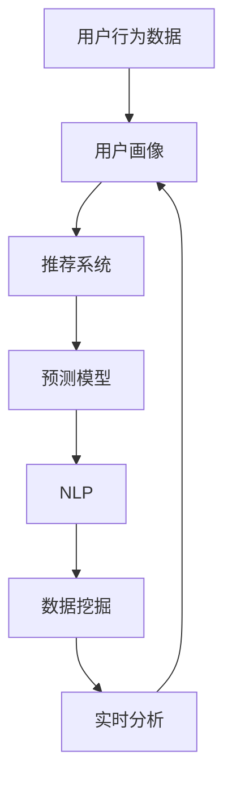

                 

# 用户行为分析系统：AI的实现

> 关键词：用户行为分析, AI系统, 深度学习, 自然语言处理(NLP), 推荐系统, 预测分析, 数据挖掘, 实时分析

## 1. 背景介绍

### 1.1 问题由来
在现代互联网时代，各大电商平台和社交网络平台积累了海量的用户行为数据。通过深入分析这些数据，可以洞悉用户喜好、发现市场趋势、优化用户体验、提高商业效益。然而，面对海量、异构、非结构化的用户行为数据，传统的统计分析方法显得力不从心。因此，借助人工智能特别是深度学习和自然语言处理（NLP）技术，开发用户行为分析系统，成为必然的选择。

### 1.2 问题核心关键点
用户行为分析系统利用AI技术，对用户的浏览、点击、购买、评价等行为数据进行深度学习，构建用户画像，预测用户行为，实现个性化推荐和服务优化。其中，深度学习模型是系统的核心，NLP技术用于文本分析，预测模型用于行为预测，推荐系统用于个性化推荐，数据挖掘技术用于用户行为聚类，实时分析技术用于动态调整策略。

## 2. 核心概念与联系

### 2.1 核心概念概述

为了更好地理解用户行为分析系统的实现过程，本节将介绍几个密切相关的核心概念：

- **用户行为数据**：用户在互联网平台上的浏览、点击、购买、评价等行为记录，通常以日志形式存储在数据库中。
- **用户画像**：通过对用户行为数据的分析，构建的描述用户特征和兴趣的模型，通常包含基本信息、兴趣爱好、行为偏好等。
- **推荐系统**：基于用户画像和商品属性，向用户推荐可能感兴趣的产品的系统，旨在提升用户体验和销售转化率。
- **预测模型**：利用历史行为数据，对用户未来行为进行预测的模型，如协同过滤、神经网络等。
- **自然语言处理(NLP)**：处理和分析自然语言文本数据的技术，如分词、词性标注、情感分析等，用于文本行为数据的分析和处理。
- **数据挖掘**：从用户行为数据中挖掘出隐藏的模式、关联和趋势，如聚类、关联规则挖掘等。
- **实时分析**：对用户行为数据进行实时监测和分析，以便快速响应市场变化和用户需求。

这些概念之间的逻辑关系可以通过以下Mermaid流程图来展示：



这个流程图展示了几大核心概念之间的相互关系：

1. 用户行为数据是用户画像的输入来源。
2. 用户画像是推荐系统的输入来源。
3. 推荐系统需要依赖预测模型进行个性化推荐。
4. 预测模型利用NLP技术进行文本数据的处理。
5. 数据挖掘技术用于发现用户行为中的模式和趋势。
6. 实时分析技术用于对用户行为数据进行动态监测和调整。

这些核心概念共同构成了用户行为分析系统的技术框架，使其能够全面、高效地处理和分析用户行为数据。通过理解这些核心概念，我们可以更好地把握系统的整体架构和工作原理。

## 3. 核心算法原理 & 具体操作步骤
### 3.1 算法原理概述

用户行为分析系统的核心算法原理基于深度学习和NLP技术，利用用户行为数据构建用户画像，预测用户行为，生成个性化推荐。其中，深度学习模型用于提取用户行为特征，预测模型用于预测用户未来行为，NLP技术用于处理文本数据，推荐系统用于实现个性化推荐。

假设用户行为数据为 $D=\{(x_i, y_i)\}_{i=1}^N$，其中 $x_i$ 为行为特征向量，$y_i$ 为行为标签。目标是通过深度学习模型 $M_{\theta}$ 拟合 $D$，使得 $M_{\theta}(x_i)$ 能够最大程度地接近真实行为 $y_i$。

### 3.2 算法步骤详解

基于深度学习的用户行为分析系统通常包括以下几个关键步骤：

**Step 1: 数据预处理**
- 收集用户行为数据，包括浏览记录、点击事件、购买记录等。
- 对数据进行清洗、去重、标准化等预处理，确保数据质量。
- 将行为数据转换为模型可用的特征向量。

**Step 2: 特征工程**
- 设计特征提取算法，从用户行为数据中提取出有意义的特征，如点击率、浏览时长、购买频率等。
- 利用NLP技术处理文本数据，提取文本特征如TF-IDF、词频等。
- 对不同类型的数据进行特征融合，构建综合特征向量。

**Step 3: 模型训练**
- 选择适合的深度学习模型，如神经网络、卷积神经网络（CNN）、长短期记忆网络（LSTM）等。
- 设计损失函数和优化算法，如交叉熵损失、梯度下降等。
- 使用训练集 $D_{train}$ 对模型进行训练，迭代优化模型参数 $\theta$。

**Step 4: 模型评估**
- 在验证集 $D_{valid}$ 上评估模型性能，计算准确率、召回率、F1值等指标。
- 根据评估结果调整模型参数，避免过拟合和欠拟合。

**Step 5: 个性化推荐**
- 对新用户或新行为数据进行预测，构建用户画像。
- 根据用户画像和商品属性，生成个性化推荐列表。
- 对推荐结果进行排序，优先展示相关性高的商品。

**Step 6: 实时分析与调整**
- 对用户实时行为进行监测，动态调整推荐策略。
- 利用数据挖掘技术发现行为模式，优化推荐算法。

### 3.3 算法优缺点

用户行为分析系统的深度学习模型具有以下优点：

1. **自适应性强**。能够自动从用户行为数据中学习模式和规律，无需人工干预。
2. **泛化能力强**。通过大量数据训练，模型能够在新的数据上表现良好。
3. **准确度高**。深度学习模型能够提取出高层次的特征，提高预测的准确性。

同时，该方法也存在一些局限性：

1. **数据依赖性强**。深度学习模型依赖于大量高质量的数据，数据的获取和处理成本较高。
2. **模型复杂度高**。深度学习模型参数较多，计算量大，需要高性能计算资源。
3. **可解释性差**。深度学习模型的决策过程复杂，难以解释模型的内部工作机制。
4. **训练时间长**。深度学习模型训练时间长，需要较强的计算资源和人力投入。

尽管存在这些局限性，但深度学习模型在用户行为分析系统的实现中仍然具有不可替代的优势。未来相关研究的重点在于如何进一步提高模型的可解释性和泛化能力，同时降低对计算资源的需求。

### 3.4 算法应用领域

用户行为分析系统已经在多个领域得到了广泛应用，例如：

- **电商平台**：通过分析用户的浏览、点击、购买行为，生成个性化推荐和营销策略，提升用户体验和销售额。
- **社交网络**：通过分析用户的互动、点赞、评论等行为，生成个性化内容推荐和广告投放，增加用户黏性。
- **金融服务**：通过分析用户的交易、转账、查询等行为，生成风险控制和产品推荐，提高服务效率。
- **医疗健康**：通过分析用户的健康记录、用药行为等数据，生成个性化健康建议和治疗方案，改善用户健康状况。
- **媒体娱乐**：通过分析用户的观看、搜索、评论等行为，生成个性化内容推荐和广告投放，增加用户参与度。

这些领域的应用表明，用户行为分析系统能够有效利用AI技术，提升用户体验和商业价值，具有广泛的市场前景。

## 4. 数学模型和公式 & 详细讲解 & 举例说明
### 4.1 数学模型构建

本节将使用数学语言对用户行为分析系统的实现过程进行更加严格的刻画。

假设用户行为数据为 $D=\{(x_i, y_i)\}_{i=1}^N$，其中 $x_i$ 为行为特征向量，$y_i$ 为行为标签。目标是通过深度学习模型 $M_{\theta}$ 拟合 $D$，使得 $M_{\theta}(x_i)$ 能够最大程度地接近真实行为 $y_i$。

设 $M_{\theta}$ 为深度学习模型，其前向传播函数为 $f_{\theta}(x_i)$，损失函数为 $L$，则模型的训练目标为：

$$
\theta^* = \mathop{\arg\min}_{\theta} \frac{1}{N}\sum_{i=1}^N L(y_i, f_{\theta}(x_i))
$$

常见的损失函数包括交叉熵损失、均方误差损失等。假设 $y_i$ 为二分类标签，交叉熵损失函数定义为：

$$
L(y_i, f_{\theta}(x_i)) = -(y_i \log f_{\theta}(x_i) + (1-y_i) \log (1-f_{\theta}(x_i)))
$$

在实际应用中，通常使用反向传播算法计算梯度，优化模型参数。设 $\nabla_{\theta}L$ 为损失函数对模型参数 $\theta$ 的梯度，则模型的更新规则为：

$$
\theta \leftarrow \theta - \eta \nabla_{\theta}L
$$

其中 $\eta$ 为学习率。

### 4.2 公式推导过程

以神经网络模型为例，推导其前向传播和反向传播过程。

假设输入为 $x_i$，神经网络模型的前向传播过程为：

$$
h_i = \sigma(W h_{i-1} + b)
$$

其中 $W$ 为权重矩阵，$b$ 为偏置向量，$\sigma$ 为激活函数。经过若干个隐藏层后，输出结果为：

$$
f_{\theta}(x_i) = \sigma(W_k f_{k-1}(x_i) + b_k)
$$

其中 $k$ 表示第 $k$ 层。反向传播过程用于计算梯度 $\nabla_{\theta}L$，公式如下：

$$
\nabla_{\theta}L = \frac{\partial L}{\partial f_{\theta}(x_i)} \cdot \frac{\partial f_{\theta}(x_i)}{\partial \theta}
$$

利用链式法则，可得：

$$
\frac{\partial L}{\partial f_{\theta}(x_i)} = -(y_i - f_{\theta}(x_i))
$$

$$
\frac{\partial f_{\theta}(x_i)}{\partial \theta} = \frac{\partial (\sigma(W_k f_{k-1}(x_i) + b_k))}{\partial \theta}
$$

通过反向传播算法，可以高效计算损失函数对模型参数的梯度，从而更新模型参数，完成训练过程。

### 4.3 案例分析与讲解

假设用户行为数据为电商平台的购买记录，其中特征 $x_i$ 包括用户ID、商品ID、购买时间、浏览时长等，标签 $y_i$ 为是否购买。目标是在此基础上构建深度学习模型，生成个性化推荐列表。

**Step 1: 数据预处理**

1. 收集电商平台的购买记录，包括用户ID、商品ID、购买时间、浏览时长等。
2. 对数据进行清洗、去重、标准化等预处理，确保数据质量。
3. 将行为数据转换为模型可用的特征向量，如商品ID、浏览时长等。

**Step 2: 特征工程**

1. 设计特征提取算法，提取有意义的特征，如购买频率、浏览深度、时间分布等。
2. 利用NLP技术处理商品描述，提取文本特征如TF-IDF、词频等。
3. 对不同类型的数据进行特征融合，构建综合特征向量。

**Step 3: 模型训练**

1. 选择适合神经网络模型，如CNN、RNN、LSTM等。
2. 设计交叉熵损失函数和梯度下降优化算法。
3. 使用训练集对模型进行训练，迭代优化模型参数。

**Step 4: 模型评估**

1. 在验证集上评估模型性能，计算准确率、召回率、F1值等指标。
2. 根据评估结果调整模型参数，避免过拟合和欠拟合。

**Step 5: 个性化推荐**

1. 对新用户或新行为数据进行预测，构建用户画像。
2. 根据用户画像和商品属性，生成个性化推荐列表。
3. 对推荐结果进行排序，优先展示相关性高的商品。

**Step 6: 实时分析与调整**

1. 对用户实时行为进行监测，动态调整推荐策略。
2. 利用数据挖掘技术发现行为模式，优化推荐算法。

## 5. 项目实践：代码实例和详细解释说明
### 5.1 开发环境搭建

在进行用户行为分析系统开发前，我们需要准备好开发环境。以下是使用Python进行TensorFlow和Keras开发的环境配置流程：

1. 安装Anaconda：从官网下载并安装Anaconda，用于创建独立的Python环境。

2. 创建并激活虚拟环境：
```bash
conda create -n tf-env python=3.8 
conda activate tf-env
```

3. 安装TensorFlow和Keras：
```bash
pip install tensorflow==2.3
pip install keras==2.4.3
```

4. 安装其他依赖包：
```bash
pip install pandas numpy scikit-learn matplotlib tqdm jupyter notebook ipython
```

完成上述步骤后，即可在`tf-env`环境中开始项目实践。

### 5.2 源代码详细实现

下面我们以电商推荐系统为例，给出使用TensorFlow和Keras进行深度学习模型训练的Python代码实现。

首先，定义数据处理函数：

```python
import pandas as pd
import numpy as np
from sklearn.model_selection import train_test_split
from tensorflow.keras.preprocessing.text import Tokenizer
from tensorflow.keras.preprocessing.sequence import pad_sequences
from tensorflow.keras.models import Sequential
from tensorflow.keras.layers import Embedding, Dense, LSTM

def load_data():
    train_data = pd.read_csv('train.csv')
    test_data = pd.read_csv('test.csv')
    
    train_X = train_data[['user_id', 'item_id', 'time', 'duration']]
    train_y = train_data['purchase']
    
    test_X = test_data[['user_id', 'item_id', 'time', 'duration']]
    test_y = test_data['purchase']
    
    train_X, val_X, train_y, val_y = train_test_split(train_X, train_y, test_size=0.2)
    
    return train_X, val_X, train_y, val_y, test_X, test_y
```

然后，定义模型和优化器：

```python
from tensorflow.keras.optimizers import Adam

model = Sequential()
model.add(Embedding(input_dim=vocab_size, output_dim=embedding_dim, input_length=max_length))
model.add(LSTM(units=64, return_sequences=True))
model.add(LSTM(units=32))
model.add(Dense(1, activation='sigmoid'))

model.compile(loss='binary_crossentropy', optimizer=Adam(lr=0.001), metrics=['accuracy'])
```

接着，定义训练和评估函数：

```python
def train_epoch(model, train_data, batch_size, optimizer):
    model.fit(train_data, epochs=10, batch_size=batch_size, validation_data=val_data)
    return model.evaluate(val_data, verbose=0)

def evaluate(model, test_data, batch_size):
    loss, accuracy = model.evaluate(test_data)
    return loss, accuracy
```

最后，启动训练流程并在测试集上评估：

```python
batch_size = 128
epochs = 10

train_X, val_X, train_y, val_y, test_X, test_y = load_data()

for epoch in range(epochs):
    model.train_epoch(train_X, batch_size, optimizer)
    print(f'Epoch {epoch+1}, validation loss: {model.evaluate(val_X, batch_size)}')

print(f'Test accuracy: {evaluate(test_X, test_y)}')
```

以上就是使用TensorFlow和Keras对电商推荐系统进行深度学习模型训练的完整代码实现。可以看到，TensorFlow和Keras库的使用使得深度学习模型的构建和训练变得简洁高效。

### 5.3 代码解读与分析

让我们再详细解读一下关键代码的实现细节：

**load_data函数**：
- 定义数据加载函数，用于读取和处理电商购买记录数据集。
- 将数据集划分为训练集和验证集，并返回训练集、验证集和测试集的特征和标签。

**模型定义**：
- 使用Keras的Sequential模型，定义嵌入层、LSTM层和全连接层。
- 嵌入层用于将文本特征映射为向量表示。
- LSTM层用于处理序列数据，提取时间依赖性。
- 全连接层用于输出二分类结果。

**模型编译与训练**：
- 使用交叉熵损失函数和Adam优化器，进行模型编译。
- 使用fit方法进行模型训练，迭代10个epoch，每次使用128个样本进行批量训练。

**评估函数**：
- 定义评估函数，计算模型在测试集上的损失和准确率。
- 返回评估结果。

**训练流程**：
- 定义batch size和epochs，开始循环迭代
- 每个epoch内，先在训练集上训练，输出验证集的损失和准确率
- 所有epoch结束后，在测试集上评估模型的性能

可以看到，TensorFlow和Keras库的使用使得深度学习模型的构建和训练变得简洁高效。开发者可以将更多精力放在模型改进、特征工程等高层逻辑上，而不必过多关注底层的实现细节。

当然，工业级的系统实现还需考虑更多因素，如模型的保存和部署、超参数的自动搜索、更灵活的任务适配层等。但核心的模型训练和评估逻辑基本与此类似。

## 6. 实际应用场景
### 6.1 电商推荐系统

基于深度学习的电商推荐系统，能够根据用户的浏览、点击、购买等行为，生成个性化推荐列表，提升用户的购物体验和满意度。推荐系统通常包含用户画像、预测模型和推荐算法三部分。

在技术实现上，可以收集电商平台的购买记录、浏览记录、点击记录等行为数据，通过特征工程提取用户行为特征，构建用户画像。然后使用预测模型，如深度神经网络，预测用户是否会购买某商品。最后，使用推荐算法，如协同过滤、基于内容的推荐等，生成个性化推荐列表。

### 6.2 金融风险控制

金融行业需要实时监测用户的交易行为，预防金融风险，保障资金安全。深度学习模型可以用于分析用户的交易记录，预测其风险等级，从而进行风险控制和预警。

具体而言，可以收集金融交易记录，包括交易时间、金额、交易类型等。利用深度学习模型，如循环神经网络（RNN），提取交易特征，预测用户的风险等级。将高风险用户进行标记，以便及时采取措施。

### 6.3 媒体内容推荐

媒体平台需要根据用户的观看记录、评分、评论等行为数据，推荐用户可能感兴趣的内容，提升用户黏性和平台流量。

在实现上，可以收集用户的观看记录、评分、评论等行为数据，通过特征工程提取用户行为特征，构建用户画像。然后使用预测模型，如深度神经网络，预测用户是否会观看某视频。最后，使用推荐算法，如协同过滤、基于内容的推荐等，生成个性化推荐列表。

### 6.4 未来应用展望

随着深度学习技术的不断发展，基于用户行为分析的系统将在更多领域得到应用，为各行各业带来变革性影响。

在智慧医疗领域，基于用户行为数据的分析，可以提升个性化医疗服务水平，帮助医生制定更科学的诊疗方案。在智能交通领域，基于用户行为数据的分析，可以优化交通管理，减少拥堵，提高交通效率。在智能制造领域，基于用户行为数据的分析，可以优化生产流程，提高产品质量，降低生产成本。

## 7. 工具和资源推荐
### 7.1 学习资源推荐

为了帮助开发者系统掌握用户行为分析系统的理论基础和实践技巧，这里推荐一些优质的学习资源：

1. 《深度学习》系列博文：由大模型技术专家撰写，深入浅出地介绍了深度学习的基本概念和经典模型，如神经网络、卷积神经网络、循环神经网络等。

2. 《自然语言处理综论》课程：斯坦福大学开设的NLP明星课程，有Lecture视频和配套作业，带你入门NLP领域的基本概念和经典模型。

3. 《Python深度学习》书籍：使用Python语言实现深度学习模型的经典教材，讲解了深度学习模型的设计、实现和应用。

4. 《深度学习实战》书籍：讲解深度学习模型的实际应用案例，适合初学者上手实践。

5. TensorFlow官方文档：TensorFlow框架的官方文档，提供了大量预训练模型和完整的实现样例代码，是上手实践的必备资料。

通过对这些资源的学习实践，相信你一定能够快速掌握用户行为分析系统的精髓，并用于解决实际的NLP问题。

### 7.2 开发工具推荐

高效的开发离不开优秀的工具支持。以下是几款用于用户行为分析系统开发的常用工具：

1. TensorFlow：由Google主导开发的开源深度学习框架，生产部署方便，适合大规模工程应用。

2. Keras：基于TensorFlow、Theano和CNTK等深度学习框架的高级API，易于上手，适合快速原型开发。

3. PyTorch：基于Python的开源深度学习框架，灵活动态的计算图，适合快速迭代研究。

4. Scikit-learn：Python数据挖掘和机器学习库，提供了丰富的数据预处理、特征工程和模型评估功能。

5. Pandas：Python数据处理库，提供了高效的数据处理和分析功能。

6. Jupyter Notebook：交互式编程环境，支持Python、R等多种编程语言，适合数据探索和模型调试。

合理利用这些工具，可以显著提升用户行为分析系统的开发效率，加快创新迭代的步伐。

### 7.3 相关论文推荐

用户行为分析系统的发展源于学界的持续研究。以下是几篇奠基性的相关论文，推荐阅读：

1. Collaborative Filtering for Implicit Feedback Datasets：介绍协同过滤推荐算法，基于用户和物品的相似度进行推荐。

2. Learning Deep Architectures for AI：提出深度神经网络模型，通过多层非线性变换提取高层次特征。

3. A Survey of Deep Learning in Recommendation Systems：综述深度学习在推荐系统中的应用，包括深度神经网络、卷积神经网络、循环神经网络等。

4. Attention Is All You Need：提出Transformer模型，使用自注意力机制处理序列数据，提高了模型的计算效率和精度。

5. Generating Sequence with Generative Adversarial Nets：提出生成对抗网络（GAN）模型，通过对抗训练生成高质量的样本。

这些论文代表了大模型技术的发展脉络。通过学习这些前沿成果，可以帮助研究者把握学科前进方向，激发更多的创新灵感。

## 8. 总结：未来发展趋势与挑战

### 8.1 总结

本文对基于深度学习的大用户行为分析系统进行了全面系统的介绍。首先阐述了用户行为分析系统的研究背景和意义，明确了系统在电商推荐、金融风险控制、媒体内容推荐等领域的实际应用价值。其次，从原理到实践，详细讲解了深度学习模型构建、特征工程、模型训练、评估、推荐算法等核心步骤，给出了系统实现的完整代码实例。同时，本文还广泛探讨了用户行为分析系统在更多领域的应用前景，展示了系统的广泛应用价值。

通过本文的系统梳理，可以看到，基于深度学习的用户行为分析系统已经在电商推荐、金融风险控制、媒体内容推荐等多个领域取得了显著的效果，具有广泛的市场前景。未来，伴随深度学习技术的不断发展，基于用户行为分析的系统必将在更多领域得到应用，为各行各业带来变革性影响。

### 8.2 未来发展趋势

展望未来，用户行为分析系统将呈现以下几个发展趋势：

1. **多模态数据融合**：未来用户行为分析系统将从单一的文本数据扩展到图像、视频、音频等多模态数据，实现更加全面和深入的特征提取。

2. **实时数据处理**：实时数据处理技术的发展，使得用户行为分析系统能够对用户实时行为进行动态监测和调整，提高决策的及时性和准确性。

3. **自适应学习**：基于强化学习等自适应学习算法，用户行为分析系统能够根据用户行为动态调整策略，提升用户体验和满意度。

4. **跨领域应用**：用户行为分析系统将从电商、金融、媒体等特定领域，向医疗、交通、制造等更多领域扩展，带来更广泛的市场应用前景。

5. **隐私保护**：随着数据隐私保护的重视，用户行为分析系统将更加注重隐私保护，采用差分隐私、联邦学习等技术，确保数据安全。

6. **知识图谱整合**：结合知识图谱技术，用户行为分析系统能够将结构化的知识与非结构化的用户行为数据结合，提供更全面和准确的推荐结果。

这些趋势凸显了用户行为分析系统的广泛应用前景，以及未来的技术演进方向。

### 8.3 面临的挑战

尽管用户行为分析系统已经在多个领域取得了显著效果，但在向更广泛领域应用的过程中，它仍面临着诸多挑战：

1. **数据隐私保护**：用户行为数据的隐私保护一直是系统设计中的重要问题，如何在确保用户隐私的前提下，进行数据收集和分析，是一个复杂的技术挑战。

2. **模型泛化能力**：用户行为数据往往存在领域偏差，如何在不同的领域和场景中，提升模型的泛化能力和适应性，是一个重要的研究方向。

3. **计算资源需求**：深度学习模型需要大量的计算资源，如何在有限的计算资源下，实现高效的模型训练和推理，是一个重要的技术挑战。

4. **可解释性**：深度学习模型的决策过程复杂，难以解释模型的内部工作机制，如何在保证模型精度的同时，提升模型的可解释性和透明度，是一个重要的研究方向。

5. **实时性能**：实时数据处理技术尚未完全成熟，如何在保证实时性的同时，提升系统的性能和稳定性，是一个重要的技术挑战。

6. **跨领域适用性**：用户行为分析系统在不同领域的应用，需要结合领域知识进行定制化设计，如何实现系统的跨领域适用性，是一个重要的研究方向。

这些挑战凸显了用户行为分析系统在实际应用中面临的复杂性和技术难度，需要未来的研究不断攻克。

### 8.4 研究展望

面对用户行为分析系统所面临的诸多挑战，未来的研究需要在以下几个方面寻求新的突破：

1. **多模态特征融合**：结合图像、视频、音频等多模态数据，提升特征提取和分析能力，实现更加全面和深入的用户行为理解。

2. **实时数据处理**：结合实时数据处理技术，实现对用户行为数据的动态监测和分析，提高系统的响应速度和决策准确性。

3. **自适应学习**：引入强化学习等自适应学习算法，使系统能够根据用户行为动态调整策略，提升用户体验和满意度。

4. **跨领域应用**：结合领域知识，实现系统的跨领域适用性，拓展用户行为分析系统的应用范围。

5. **隐私保护**：结合差分隐私、联邦学习等技术，确保用户数据的隐私保护，提升系统的可信度和安全性。

6. **知识图谱整合**：结合知识图谱技术，将结构化的知识与非结构化的用户行为数据结合，提供更全面和准确的推荐结果。

这些研究方向的探索，必将引领用户行为分析系统迈向更高的台阶，为构建安全、可靠、可解释、可控的智能系统铺平道路。面向未来，用户行为分析系统还需要与其他人工智能技术进行更深入的融合，如知识表示、因果推理、强化学习等，多路径协同发力，共同推动自然语言理解和智能交互系统的进步。只有勇于创新、敢于突破，才能不断拓展语言模型的边界，让智能技术更好地造福人类社会。

## 9. 附录：常见问题与解答

**Q1：用户行为数据包括哪些内容？**

A: 用户行为数据通常包括用户的浏览记录、点击记录、购买记录、评价记录等。这些数据记录了用户在平台上的各种行为，是用户行为分析系统的输入来源。

**Q2：如何构建用户画像？**

A: 用户画像通常包含用户的基本信息、兴趣爱好、行为偏好等。可以通过特征工程，提取用户行为数据中的有意义的特征，如购买频率、浏览深度、时间分布等，构建综合特征向量。然后使用深度学习模型，如神经网络，对用户行为数据进行学习，生成用户画像。

**Q3：如何实现个性化推荐？**

A: 个性化推荐通常包括预测用户行为和生成推荐列表两步。首先使用深度学习模型，如协同过滤、神经网络等，预测用户是否会购买某商品。然后使用推荐算法，如基于内容的推荐、协同过滤等，生成个性化推荐列表。

**Q4：用户行为分析系统有哪些应用？**

A: 用户行为分析系统在电商推荐、金融风险控制、媒体内容推荐等多个领域都有应用。通过分析用户的浏览、点击、购买等行为数据，生成个性化推荐列表，提升用户体验和满意度。

**Q5：如何保护用户隐私？**

A: 用户隐私保护是系统设计中的重要问题。可以通过差分隐私、联邦学习等技术，确保用户数据的隐私保护。同时，对用户行为数据进行匿名化处理，防止数据泄露。

---

作者：禅与计算机程序设计艺术 / Zen and the Art of Computer Programming

