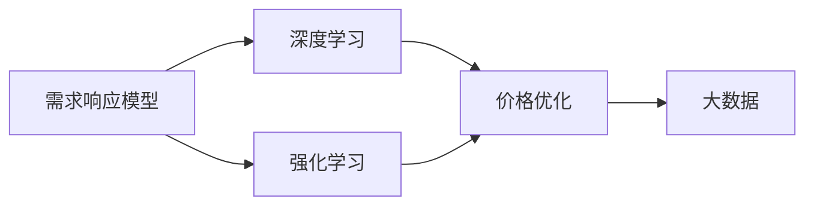

                 

# 电商价格优化的AI技术

## 1. 背景介绍

在电商行业，价格优化一直是企业竞争的核心要素之一。准确、高效的价格制定不仅直接影响销售额和利润率，还能显著提升用户体验和市场占有率。传统价格优化方法依赖专家经验、历史销售数据等有限信息，无法充分考虑复杂多变的市场动态和消费者行为。而人工智能技术，尤其是深度学习算法，提供了全新的解决思路，能够利用海量数据进行自动建模，实时调整价格策略，实现智能化价格优化。

## 2. 核心概念与联系

### 2.1 核心概念概述

为了深入理解电商价格优化的AI技术，本节将介绍几个关键概念：

- 价格优化(Price Optimization)：指通过数据驱动的方法，实时调整商品价格，以最大化收益或利润。
- 需求响应模型(Demand Response Model)：通过分析市场、消费者和竞争者行为，预测价格变化对需求量的影响，辅助制定价格策略。
- 深度学习(Deep Learning)：利用神经网络等技术，对复杂数据进行特征提取和模式学习，自动优化价格决策。
- 强化学习(Reinforcement Learning)：通过与环境交互，不断调整价格策略，优化长期收益。
- 大数据(大数据)：指规模庞大、结构多样的数据集合，可用于训练复杂模型，挖掘深层次的市场规律。

这些概念之间的逻辑关系可以通过以下Mermaid流程图来展示：



这个流程图展示了大数据和价格优化之间的关键联系：

1. 大数据为需求响应模型提供丰富的数据源，用于预测市场需求。
2. 需求响应模型和强化学习相结合，通过实时调整价格策略，最大化收益。
3. 深度学习用于自动化模型训练，提升价格优化的精准度。
4. 价格优化模型利用学习到的市场规律，实时调整商品价格。

## 3. 核心算法原理 & 具体操作步骤
### 3.1 算法原理概述

电商价格优化的AI技术，本质上是一种基于数据驱动的价格决策系统。其核心思想是通过分析市场数据，预测消费者行为，实时调整商品价格，以实现利润最大化或收益最优。

具体而言，价格优化模型通常包括以下几个关键步骤：

1. **数据采集**：收集产品历史销售数据、市场竞争数据、消费者行为数据等。
2. **模型训练**：利用机器学习或深度学习算法，训练需求响应模型和价格优化模型。
3. **实时预测**：在每个销售周期开始时，预测不同价格策略下的需求量和收益。
4. **价格调整**：根据预测结果，选择最优价格策略，进行实时价格调整。
5. **反馈迭代**：收集实际销售数据，不断调整和优化价格模型。

### 3.2 算法步骤详解

以下是电商价格优化的AI技术的基本算法步骤：

**Step 1: 数据采集**

- 收集产品历史销售数据：包括销售量、销售额、促销活动效果等。
- 收集市场竞争数据：分析竞争对手的定价策略、促销活动、市场占有率等。
- 收集消费者行为数据：分析用户搜索、浏览、购买等行为，了解消费者偏好和购买力。

**Step 2: 数据预处理**

- 数据清洗：去除缺失、异常值，标准化数据格式。
- 特征工程：提取有意义的特征，如价格水平、促销活动、用户画像等。
- 数据划分：将数据划分为训练集、验证集和测试集。

**Step 3: 模型训练**

- 选择合适的机器学习或深度学习算法，如回归、分类、神经网络等。
- 利用训练集数据，训练需求响应模型和价格优化模型。
- 通过验证集评估模型性能，调整超参数和模型结构。

**Step 4: 实时预测**

- 在每个销售周期开始时，输入实时数据到模型中进行预测。
- 计算不同价格策略下的需求量和收益。
- 选择最优价格策略，进行实时价格调整。

**Step 5: 反馈迭代**

- 收集实际销售数据，评估价格调整效果。
- 利用反馈数据不断优化模型，提高价格预测的准确性。
- 定期重新训练模型，适应市场变化。

### 3.3 算法优缺点

电商价格优化的AI技术具有以下优点：

- 自动化程度高：通过机器学习算法自动优化价格策略，减少人工干预，提高效率。
- 精准度高：利用深度学习算法挖掘深层次的市场规律，提升价格优化的精准度。
- 实时性强：利用强化学习算法，实时调整价格策略，应对市场变化。
- 可扩展性强：适应不同产品、不同市场，具有较高的通用性和可扩展性。

同时，该技术也存在一些局限性：

- 数据依赖性强：模型效果依赖于数据的质量和数量，数据获取和预处理成本较高。
- 模型复杂度高：复杂的深度学习模型需要较大的计算资源和存储资源。
- 过拟合风险：模型可能过拟合历史数据，对新市场规律适应性不足。
- 隐私风险：收集和使用消费者数据，需注意数据隐私和安全问题。

尽管存在这些局限性，但电商价格优化的AI技术在现实中的应用效果显著，能够有效提升企业的市场竞争力和盈利能力。

### 3.4 算法应用领域

基于电商价格优化的AI技术，已经在电商领域得到广泛应用，覆盖了多个关键环节：

- **促销活动优化**：通过预测不同促销活动对销售量的影响，自动调整促销策略，提升活动效果。
- **库存管理**：根据预测的需求量和价格调整，优化库存水平，减少过剩或不足。
- **价格竞标**：在竞价平台上，自动调整出价策略，以最优价格赢得竞标。
- **个性化定价**：根据用户行为和偏好，自动生成个性化定价，提升用户粘性。
- **交叉销售和捆绑销售**：通过分析用户购买行为，推荐相关商品，提升销售收入。

此外，在零售、物流、金融等众多领域，价格优化AI技术也展现出巨大的应用潜力，为企业的数字化转型和智能化运营提供了有力支持。

## 4. 数学模型和公式 & 详细讲解 & 举例说明
### 4.1 数学模型构建

假设电商平台有 $n$ 种商品，每种商品的历史销售数据为 $\{x_i\}_{i=1}^n$，其中 $x_i=(x_i^1, x_i^2, \ldots, x_i^k)$ 表示第 $i$ 种商品在第 $k$ 个时间段的销售量。市场竞争数据为 $\{c_i\}_{i=1}^n$，表示第 $i$ 种商品的平均市场占有率。消费者行为数据为 $\{d_i\}_{i=1}^n$，表示第 $i$ 种商品的用户搜索次数、浏览时长等指标。

定义需求响应模型为 $F(x_i, c_i, d_i)$，表示在给定销售数据、市场竞争数据和消费者行为数据下，第 $i$ 种商品的需求量。需求响应模型通常采用线性回归、决策树、神经网络等算法进行训练。

定义价格优化模型为 $P(x_i, c_i, d_i)$，表示在给定销售数据、市场竞争数据和消费者行为数据下，第 $i$ 种商品的最优价格。价格优化模型通常采用强化学习算法进行训练，如Q-learning、Deep Q-Networks等。

### 4.2 公式推导过程

以线性回归模型为例，需求响应模型的公式推导如下：

$$
y = \beta_0 + \sum_{j=1}^p \beta_j x_j + \epsilon
$$

其中 $y$ 表示需求量，$\beta_0$ 为截距，$\beta_j$ 为回归系数，$x_j$ 为回归特征，$\epsilon$ 为误差项。

类似地，价格优化模型的公式推导如下：

$$
P_i = \theta_0 + \sum_{j=1}^k \theta_j x_i^j + \theta_l c_i + \theta_r d_i
$$

其中 $P_i$ 表示第 $i$ 种商品的最优价格，$\theta_0$ 为截距，$\theta_j$ 为回归系数，$x_i^j$ 为回归特征，$\theta_l$ 和 $\theta_r$ 分别表示市场竞争和消费者行为对价格的贡献。

### 4.3 案例分析与讲解

以一个简单的线性回归模型为例，假设电商平台有三种商品A、B、C，历史销售数据、市场竞争数据和消费者行为数据如表所示：

| 商品 | 时间 | 销售量 | 市场占有率 | 用户搜索次数 |
| --- | --- | --- | --- | --- |
| A | 1 | 10 | 0.1 | 50 |
| A | 2 | 20 | 0.2 | 80 |
| A | 3 | 15 | 0.3 | 60 |
| B | 1 | 5 | 0.2 | 30 |
| B | 2 | 8 | 0.3 | 70 |
| B | 3 | 7 | 0.1 | 40 |
| C | 1 | 8 | 0.1 | 30 |
| C | 2 | 10 | 0.2 | 60 |
| C | 3 | 9 | 0.3 | 70 |

根据上述数据，使用线性回归模型训练需求响应模型 $F(x_i, c_i, d_i)$：

- 输入数据：销售量、市场占有率、用户搜索次数。
- 输出数据：需求量。

采用最小二乘法求解线性回归系数，得到需求响应模型：

$$
F(x_i, c_i, d_i) = 2 + 0.5x_i^1 + 0.3c_i + 0.2d_i
$$

根据需求响应模型，可以计算每种商品在不同价格下的需求量。然后，使用强化学习算法，训练价格优化模型 $P(x_i, c_i, d_i)$，得到最优价格策略。

例如，对于商品A，假设初始价格为20元，通过价格优化模型计算得到，当价格降至18元时，需求量达到最高，收益最大。此时，电商平台可以通过自动调整系统，将商品A的价格调至18元，进行实时价格优化。

## 5. 项目实践：代码实例和详细解释说明
### 5.1 开发环境搭建

在进行电商价格优化的AI技术实践前，我们需要准备好开发环境。以下是使用Python进行TensorFlow开发的环境配置流程：

1. 安装Anaconda：从官网下载并安装Anaconda，用于创建独立的Python环境。

2. 创建并激活虚拟环境：
```bash
conda create -n tf-env python=3.8 
conda activate tf-env
```

3. 安装TensorFlow：根据CUDA版本，从官网获取对应的安装命令。例如：
```bash
conda install tensorflow==2.6 -c tf -c conda-forge
```

4. 安装必要的Python库：
```bash
pip install numpy pandas sklearn matplotlib tensorflow-estimator
```

完成上述步骤后，即可在`tf-env`环境中开始电商价格优化的AI技术实践。

### 5.2 源代码详细实现

这里我们以一个简单的需求响应模型和价格优化模型为例，给出TensorFlow的代码实现。

首先，定义数据预处理函数：

```python
import pandas as pd
import numpy as np

def preprocess_data(data):
    # 数据清洗
    data.dropna(inplace=True)
    data.fillna(0, inplace=True)
    # 特征标准化
    data = (data - data.mean()) / data.std()
    return data
```

然后，定义需求响应模型和价格优化模型的训练函数：

```python
import tensorflow as tf

class DemandResponseModel(tf.keras.Model):
    def __init__(self, input_dim):
        super(DemandResponseModel, self).__init__()
        self.fc1 = tf.keras.layers.Dense(64, activation='relu', input_dim=input_dim)
        self.fc2 = tf.keras.layers.Dense(1)

    def call(self, inputs):
        x = self.fc1(inputs)
        x = self.fc2(x)
        return x

class PriceOptimizationModel(tf.keras.Model):
    def __init__(self, input_dim):
        super(PriceOptimizationModel, self).__init__()
        self.fc1 = tf.keras.layers.Dense(64, activation='relu', input_dim=input_dim)
        self.fc2 = tf.keras.layers.Dense(1)

    def call(self, inputs):
        x = self.fc1(inputs)
        x = self.fc2(x)
        return x

# 训练函数
def train_model(model, data, epochs=10, batch_size=32):
    model.compile(optimizer=tf.keras.optimizers.Adam(), loss='mse')
    model.fit(data['x'], data['y'], epochs=epochs, batch_size=batch_size, validation_split=0.2)
```

接下来，定义数据集和模型训练过程：

```python
# 数据集定义
data = pd.DataFrame({
    'x1': np.random.randn(100),
    'x2': np.random.randn(100),
    'x3': np.random.randn(100),
    'y': np.random.randn(100) + 2 * x1 + 0.3 * x2 + 0.2 * x3
})

data = preprocess_data(data)

# 模型训练
model = DemandResponseModel(input_dim=3)
train_model(model, data)

# 模型评估
print(model.evaluate(data['x'], data['y']))
```

最后，使用训练好的模型进行实时预测和价格优化：

```python
# 实时数据输入
real_data = np.array([0.1, 0.2, 0.3])

# 预测需求量
y_pred = model.predict(real_data)
print(y_pred)

# 价格优化
price_optimization_model = PriceOptimizationModel(input_dim=3)
train_model(price_optimization_model, data)

# 实时预测最优价格
optimal_price = price_optimization_model.predict(real_data)
print(optimal_price)
```

以上就是使用TensorFlow进行电商价格优化的AI技术实践的完整代码实现。可以看到，TensorFlow提供了丰富的深度学习API，使得电商价格优化的AI技术实现相对简洁高效。

### 5.3 代码解读与分析

让我们再详细解读一下关键代码的实现细节：

**preprocess_data函数**：
- 对数据进行清洗和标准化，去除异常值和缺失值，对数据进行归一化处理，以便于模型的训练和预测。

**DemandResponseModel和PriceOptimizationModel类**：
- 定义需求响应模型和价格优化模型，采用全连接神经网络结构，包含两个全连接层和一个输出层。
- 通过`compile`方法指定优化器和损失函数，`fit`方法进行模型训练，`evaluate`方法进行模型评估。

**train_model函数**：
- 使用`compile`方法编译模型，指定优化器和损失函数。
- 使用`fit`方法训练模型，指定训练轮数和批次大小，设置验证集比例。

**数据集和模型训练过程**：
- 生成随机数据，定义输入特征和输出标签。
- 使用`preprocess_data`函数进行数据预处理。
- 创建需求响应模型和价格优化模型，进行模型训练。
- 使用`evaluate`方法评估模型性能。
- 使用`predict`方法进行实时预测，得到需求量和最优价格。

可以看到，TensorFlow提供了完整的深度学习框架，从数据处理、模型训练到模型评估和预测，实现了电商价格优化的AI技术的完整流程。开发者可以根据具体需求，进一步优化模型结构、调整超参数、改进预测算法，实现更加精确和高效的电商价格优化。

## 6. 实际应用场景
### 6.1 智能推荐系统

智能推荐系统是电商价格优化的重要应用之一。通过分析用户行为和偏好，推荐相关商品，提升用户体验和销售收入。

具体而言，电商平台可以通过用户搜索记录、浏览历史、购买记录等数据，训练需求响应模型，预测用户对不同商品的需求量。然后，使用价格优化模型，自动调整商品价格，实现个性化定价。例如，对于常购买的商品，保持原价；对于偶尔购买的商品，进行折扣促销。

### 6.2 动态定价

动态定价是电商价格优化的核心技术之一。通过实时监测市场动态和消费者行为，自动调整商品价格，实现收益最大化。

例如，在大型促销活动期间，电商平台可以通过需求响应模型预测不同价格策略下的销售量。然后，使用价格优化模型，自动调整促销价格，达到最大促销效果。例如，对于销售较慢的商品，进行限时折扣；对于销售火爆的商品，保持原价。

### 6.3 库存管理

库存管理是电商运营的关键环节。通过电商价格优化的AI技术，电商平台可以实时监测库存水平，动态调整价格策略，优化库存管理。

例如，对于库存紧张的商品，提高价格以减少销售量；对于库存过多的商品，进行促销活动以提高销售量。通过价格优化模型，电商平台可以实现库存与价格的双向优化，避免过剩或不足。

### 6.4 未来应用展望

随着电商价格优化AI技术的不断发展，未来将会在更多场景中得到应用，为电商行业带来更多创新和突破：

1. **跨平台价格优化**：电商平台将打破平台界限，实现跨平台的价格优化。例如，不同电商平台之间的价格联动，提升市场竞争力。
2. **多渠道整合**：电商平台将整合线上线下渠道，实现全渠道的价格优化。例如，线下实体店的价格与线上价格联动，提升整体市场表现。
3. **个性化定价**：电商平台将根据用户画像、行为数据等，实现更精准的个性化定价，提升用户粘性。
4. **供应链优化**：电商平台将通过价格优化，优化供应链管理，实现成本降低和效率提升。
5. **智能客服**：电商平台将利用价格优化AI技术，提升智能客服系统的智能水平，提升客户满意度。

## 7. 工具和资源推荐
### 7.1 学习资源推荐

为了帮助开发者系统掌握电商价格优化的AI技术，这里推荐一些优质的学习资源：

1. TensorFlow官方文档：TensorFlow的官方文档，提供了详细的API说明和案例，是学习TensorFlow的必备资料。
2. 《深度学习：理论和实战》书籍：吴恩达和冯英东教授的深度学习教材，涵盖深度学习基础理论和实战案例，适合初学者和进阶者。
3. Kaggle平台：Kaggle是一个数据科学竞赛平台，提供了丰富的电商数据集和案例，可以帮助开发者进行实战练习。
4. Coursera电商数据分析课程：由斯坦福大学教授开设的电商数据分析课程，介绍了电商数据处理和分析的基本方法，适合电商从业者。
5. 电商价格优化论文库：Google Scholar、arXiv等平台上有大量电商价格优化相关的论文，可以了解最新的研究方向和技术进展。

通过对这些资源的学习实践，相信你一定能够快速掌握电商价格优化的AI技术的精髓，并用于解决实际的电商问题。

### 7.2 开发工具推荐

高效的开发离不开优秀的工具支持。以下是几款用于电商价格优化的AI技术开发的常用工具：

1. TensorFlow：由Google主导开发的开源深度学习框架，生产部署方便，适合大规模工程应用。
2. PyTorch：基于Python的开源深度学习框架，灵活便捷，适合研究型应用。
3. Scikit-learn：开源机器学习库，提供了丰富的机器学习算法和工具，适合电商数据处理和特征工程。
4. Hadoop/Spark：分布式计算框架，可以处理大规模电商数据，适合数据挖掘和分析。
5. ELK Stack：日志管理、搜索和可视化工具，可以实时监控电商系统性能，适合电商运营管理。

合理利用这些工具，可以显著提升电商价格优化的AI技术开发效率，加快创新迭代的步伐。

### 7.3 相关论文推荐

电商价格优化AI技术的发展源于学界的持续研究。以下是几篇奠基性的相关论文，推荐阅读：

1. "Deep Reinforcement Learning for Dynamic Price Optimization in E-commerce"：深度强化学习在电商价格优化中的应用，展示了动态定价的优势。
2. "Price Optimization for E-Commerce Platforms Using Probabilistic Models"：基于概率模型的电商价格优化方法，探讨了不同模型在价格预测中的表现。
3. "A Multi-Agent Framework for Dynamic Pricing in E-commerce"：多智能体系统在电商价格优化中的应用，展示了协同优化策略的效果。
4. "E-commerce Price Optimization with Online-to-Offline Integration"：电商价格优化与O2O整合策略，展示了全渠道价格优化的潜力。
5. "A Framework for Customer-Specific Dynamic Pricing in E-commerce"：客户特定的电商价格优化方法，展示了个性化定价的效果。

这些论文代表了大电商价格优化AI技术的发展脉络。通过学习这些前沿成果，可以帮助研究者把握学科前进方向，激发更多的创新灵感。

## 8. 总结：未来发展趋势与挑战
### 8.1 总结

本文对电商价格优化的AI技术进行了全面系统的介绍。首先阐述了电商价格优化的背景和意义，明确了AI技术在价格优化中的独特价值。其次，从原理到实践，详细讲解了电商价格优化的AI技术的数学模型和核心算法，给出了电商价格优化的AI技术的完整代码实例。同时，本文还广泛探讨了电商价格优化的AI技术在智能推荐、动态定价、库存管理等多个场景中的应用前景，展示了电商价格优化的AI技术的广阔前景。

通过本文的系统梳理，可以看到，电商价格优化的AI技术正在成为电商行业的重要工具，极大地提升了企业的市场竞争力和盈利能力。未来，伴随AI技术的不断进步，电商价格优化的AI技术将进一步发展，为电商行业带来更多创新和突破。

### 8.2 未来发展趋势

展望未来，电商价格优化的AI技术将呈现以下几个发展趋势：

1. 自动化程度更高：通过深度学习算法，电商价格优化的AI技术将实现更自动化的价格决策，减少人工干预。
2. 实时性更强：通过强化学习算法，电商价格优化的AI技术将实现实时动态调整价格，应对市场变化。
3. 跨平台整合：电商价格优化的AI技术将打破平台界限，实现跨平台的价格优化。
4. 全渠道整合：电商价格优化的AI技术将整合线上线下渠道，实现全渠道的价格优化。
5. 个性化定价：电商价格优化的AI技术将根据用户画像、行为数据等，实现更精准的个性化定价。
6. 供应链优化：电商价格优化的AI技术将通过价格优化，优化供应链管理，实现成本降低和效率提升。

以上趋势凸显了电商价格优化的AI技术的广阔前景。这些方向的探索发展，必将进一步提升电商系统的性能和应用范围，为电商行业带来更多创新和突破。

### 8.3 面临的挑战

尽管电商价格优化的AI技术已经取得了瞩目成就，但在迈向更加智能化、普适化应用的过程中，它仍面临着诸多挑战：

1. 数据质量瓶颈：数据质量差、数据获取难度大，影响模型训练效果。
2. 模型复杂度高：复杂的深度学习模型需要较大的计算资源和存储资源。
3. 过拟合风险：模型可能过拟合历史数据，对新市场规律适应性不足。
4. 隐私风险：收集和使用消费者数据，需注意数据隐私和安全问题。
5. 预测准确性：模型预测结果可能与实际市场变化存在偏差。
6. 实时性问题：实时数据处理和模型预测需要高效稳定的系统架构。

尽管存在这些挑战，但电商价格优化的AI技术在现实中的应用效果显著，能够有效提升企业的市场竞争力和盈利能力。

### 8.4 研究展望

面对电商价格优化的AI技术面临的种种挑战，未来的研究需要在以下几个方面寻求新的突破：

1. 探索无监督和半监督学习范式：摆脱对大规模标注数据的依赖，利用自监督学习、主动学习等无监督和半监督范式，最大限度利用非结构化数据，实现更加灵活高效的电商价格优化。
2. 研究参数高效和计算高效的微调范式：开发更加参数高效的电商价格优化模型，在固定大部分预训练参数的同时，只更新极少量的任务相关参数。同时优化电商价格优化模型的计算图，减少前向传播和反向传播的资源消耗，实现更加轻量级、实时性的部署。
3. 引入更多先验知识：将符号化的先验知识，如知识图谱、逻辑规则等，与神经网络模型进行巧妙融合，引导电商价格优化模型学习更准确、合理的市场规律。同时加强不同模态数据的整合，实现视觉、语音等多模态信息与文本信息的协同建模。
4. 结合因果分析和博弈论工具：将因果分析方法引入电商价格优化模型，识别出模型决策的关键特征，增强输出解释的因果性和逻辑性。借助博弈论工具刻画人机交互过程，主动探索并规避模型的脆弱点，提高系统稳定性。
5. 纳入伦理道德约束：在电商价格优化模型的训练目标中引入伦理导向的评估指标，过滤和惩罚有偏见、有害的输出倾向。同时加强人工干预和审核，建立电商价格优化模型的监管机制，确保输出符合人类价值观和伦理道德。

这些研究方向的探索，必将引领电商价格优化的AI技术迈向更高的台阶，为构建智能、可靠、可解释、可控的电商系统铺平道路。面向未来，电商价格优化的AI技术还需要与其他AI技术进行更深入的融合，如知识表示、因果推理、强化学习等，多路径协同发力，共同推动电商价格优化系统的进步。只有勇于创新、敢于突破，才能不断拓展电商价格优化技术的边界，让AI技术更好地造福电商行业。

## 9. 附录：常见问题与解答

**Q1：电商价格优化的AI技术适用于所有商品吗？**

A: 电商价格优化的AI技术在大多数商品上都能取得不错的效果，特别是对于数据量较大的商品。但对于一些特定商品的定价，可能需要结合专家经验和人工调整，以获得更准确的定价。

**Q2：电商价格优化的AI技术是否依赖于用户数据？**

A: 电商价格优化的AI技术高度依赖用户数据，包括用户行为数据、搜索数据、购买数据等。这些数据是训练模型的重要输入，模型效果很大程度上取决于数据的丰富度和质量。

**Q3：电商价格优化的AI技术是否需要实时数据？**

A: 电商价格优化的AI技术需要实时数据进行动态调整，才能达到最优效果。实时数据可以包括市场动态、竞争对手活动、用户行为变化等，这些数据的变化会直接影响模型的输出结果。

**Q4：电商价格优化的AI技术是否存在隐私风险？**

A: 电商价格优化的AI技术在处理用户数据时，需注意数据隐私和安全问题。应采用数据脱敏、加密等技术，保护用户隐私，遵守相关法律法规。

**Q5：电商价格优化的AI技术是否容易过拟合？**

A: 电商价格优化的AI技术存在过拟合风险，特别是在数据量较少的情况下。因此，需采用正则化技术、特征选择等方法，避免模型过拟合。

**Q6：电商价格优化的AI技术是否适用于全渠道整合？**

A: 电商价格优化的AI技术可以适用于全渠道整合，实现跨平台、跨渠道的价格优化。通过整合线上线下数据，可以实现更精准的价格决策。

通过本文的系统梳理，可以看到，电商价格优化的AI技术正在成为电商行业的重要工具，极大地提升了企业的市场竞争力和盈利能力。未来，伴随AI技术的不断进步，电商价格优化的AI技术将进一步发展，为电商行业带来更多创新和突破。

