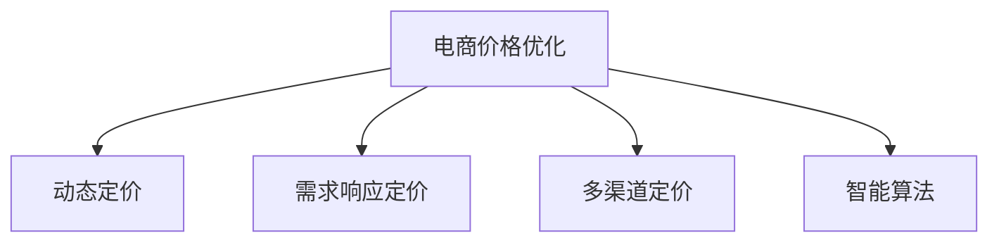

                 

# 电商价格优化的创新应用

## 1. 背景介绍

在竞争激烈的市场环境中，电商企业面临着严峻的价格战挑战。如何在确保利润的前提下，通过优化价格策略，提升销售量和市场份额，成为电商企业关注的焦点。传统价格优化方法依赖大量人工经验和复杂的数学模型，难以应对快速变化的市场需求。为此，电商企业需要借助人工智能技术，进行实时、动态的价格优化，以提升经营效率和市场竞争力。

## 2. 核心概念与联系

### 2.1 核心概念概述

为更好地理解电商价格优化的创新应用，本节将介绍几个核心概念：

- 电商价格优化(e-commerce pricing optimization)：指通过智能算法，实时调整商品价格，以最大化销售收入和利润的过程。
- 动态定价(dynamic pricing)：指根据市场变化，实时调整价格，以优化运营效率和客户体验。
- 需求响应定价(demand responsive pricing)：指根据市场需求变化，动态调整价格，以平衡供需关系。
- 多渠道定价(multi-channel pricing)：指在多个销售渠道（如电商、线下门店、社交媒体等）中，根据不同渠道的特点，制定差异化的定价策略。
- 智能算法(intelligent algorithm)：指使用机器学习、深度学习等人工智能技术，实现自动化的价格优化和调整。

这些概念之间的逻辑关系可以通过以下Mermaid流程图来展示：



这个流程图展示了大语言模型和微调技术的应用流程：

1. 电商价格优化是大语言模型的应用场景，需要通过动态定价、需求响应定价、多渠道定价等策略进行具体实施。
2. 智能算法是电商价格优化的核心技术，通过深度学习等手段实现自动化的价格调整和优化。
3. 动态定价、需求响应定价、多渠道定价是具体的定价策略，需要基于智能算法进行实现。

这些概念共同构成了电商价格优化的完整框架，使其能够在实际应用中发挥强大的价值。通过理解这些核心概念，我们可以更好地把握电商价格优化的原理和策略。

## 3. 核心算法原理 & 具体操作步骤

### 3.1 算法原理概述

电商价格优化的核心原理是通过智能算法，实时动态地调整商品价格，以最大化销售收入和利润。具体而言，算法会根据市场供需、季节变化、竞争对手价格、用户行为等多种因素，计算出最优的价格策略。

算法一般分为两步：
1. 价格预测：根据历史数据和市场变化，预测未来的价格趋势和用户行为。
2. 价格调整：根据价格预测结果，调整商品价格，以优化销售量和利润。

### 3.2 算法步骤详解

以下是电商价格优化的详细步骤：

**Step 1: 数据收集与预处理**
- 收集电商平台的历史销售数据、用户行为数据、市场变化数据等，作为算法的输入。
- 对数据进行清洗、归一化、特征提取等预处理操作，以提高算法的准确性。

**Step 2: 价格预测**
- 使用深度学习模型（如LSTM、RNN、Transformer等）对历史数据进行拟合，建立价格预测模型。
- 模型输入包括时间序列特征、价格变化历史、用户行为数据等，输出为预测价格。
- 根据预测价格，计算每个时间点的销售量和收入。

**Step 3: 价格调整**
- 根据预测价格和销售数据，使用优化算法（如梯度下降、遗传算法等）调整当前价格。
- 设定价格调整的阈值和步长，以控制价格的变动范围和频率。
- 监测价格调整后的销售量、收入、利润等关键指标，进行实时反馈和优化。

**Step 4: 效果评估**
- 定期评估价格调整的效果，如收入增长率、利润率、客户满意度等。
- 根据评估结果，调整算法的参数和策略，以优化价格预测和调整效果。

### 3.3 算法优缺点

电商价格优化的优点：
1. 实时动态：可以实时监控市场变化，及时调整价格，提高运营效率。
2. 智能化决策：基于大量数据和智能算法，自动进行价格优化，减少人工干预。
3. 平衡供需：能够根据市场供需情况动态调整价格，平衡供需关系，提升客户满意度。
4. 个性化定价：能够根据不同渠道和用户群体，制定差异化的定价策略，提高销售效果。

算法缺点：
1. 数据依赖：算法效果依赖于数据的准确性和全面性，数据质量差会影响模型性能。
2. 市场复杂性：市场变化复杂，算法可能难以准确预测价格趋势，导致价格调整失误。
3. 法律风险：过度频繁的价格调整可能导致消费者不信任，影响品牌形象。
4. 技术门槛高：算法开发和实施需要专业知识，对技术人员要求较高。

### 3.4 算法应用领域

电商价格优化在电商行业中的应用广泛，覆盖了以下几个主要领域：

- 智能促销：通过算法分析用户行为，推荐最合适的促销方案，提升销售效果。
- 库存管理：基于价格预测和销售数据，优化库存水平，减少积压和缺货。
- 竞品监控：实时监测竞争对手价格，调整本店商品价格，保持市场竞争力。
- 个性化定价：根据用户属性和购买历史，制定个性化的价格策略，提高客户粘性。
- 多渠道定价：根据不同渠道的特点，制定差异化的价格策略，实现最大收益。

这些应用场景展示了电商价格优化的广泛应用，为电商企业提供了强大的数据支持和智能决策手段。

## 4. 数学模型和公式 & 详细讲解

### 4.1 数学模型构建

电商价格优化的核心数学模型为动态定价模型，其基本思路是通过历史数据和市场变化，预测未来的价格和销售量，然后通过优化算法调整当前价格，以最大化销售收入和利润。

设 $p_t$ 为时间 $t$ 的商品价格，$s_t$ 为时间 $t$ 的销售量，$R_t$ 为时间 $t$ 的总收入，$C_t$ 为时间 $t$ 的成本，则电商价格优化的目标函数为：

$$
\max_{p_t} \sum_{t=1}^T R_t - C_t
$$

其中 $T$ 为总时间窗口，$R_t = p_t \cdot s_t$ 为总收入，$C_t$ 为总成本。

### 4.2 公式推导过程

考虑时间序列的动态特性，假设价格和销售量满足一阶自回归模型：

$$
p_t = \alpha_0 + \alpha_1 p_{t-1} + \epsilon_t
$$

$$
s_t = \beta_0 + \beta_1 s_{t-1} + \delta_t
$$

其中 $\alpha_0, \alpha_1, \beta_0, \beta_1$ 为回归系数，$\epsilon_t, \delta_t$ 为随机扰动项。

对上述模型进行求解，可以得到价格预测和销售量预测的表达式。将预测结果代入目标函数，即可得到价格优化问题的数学表达式。

### 4.3 案例分析与讲解

以下以LSTM模型为例，展示电商价格优化的具体实现。

假设电商平台的销售数据为时间序列，采用LSTM模型进行价格预测和销售量预测。LSTM模型的输入为时间序列数据 $D_t = (p_{t-1}, s_{t-1}, d_{t-1})$，其中 $d_{t-1}$ 为市场变化数据，如节假日、促销活动等。

模型的输出为预测价格 $p_t$ 和预测销售量 $s_t$。将预测价格代入目标函数，得到价格优化问题的数学表达式。通过优化算法，调整当前价格 $p_t$，最大化收入和利润。

## 5. 项目实践：代码实例和详细解释说明

### 5.1 开发环境搭建

在进行电商价格优化的项目实践前，我们需要准备好开发环境。以下是使用Python进行TensorFlow开发的快速入门流程：

1. 安装Anaconda：从官网下载并安装Anaconda，用于创建独立的Python环境。

2. 创建并激活虚拟环境：
```bash
conda create -n tf-env python=3.8 
conda activate tf-env
```

3. 安装TensorFlow：根据CUDA版本，从官网获取对应的安装命令。例如：
```bash
conda install tensorflow=2.4
```

4. 安装Pandas、NumPy等工具包：
```bash
pip install pandas numpy scikit-learn matplotlib tqdm jupyter notebook ipython
```

完成上述步骤后，即可在`tf-env`环境中开始电商价格优化的实践。

### 5.2 源代码详细实现

以下是一个使用LSTM模型进行电商价格优化的完整代码实现：

```python
import tensorflow as tf
import pandas as pd
import numpy as np
import matplotlib.pyplot as plt
from sklearn.metrics import mean_squared_error

# 加载数据
data = pd.read_csv('sales_data.csv', index_col='time')

# 数据预处理
def normalize_data(df):
    mean = df.mean()
    std = df.std()
    df = (df - mean) / std
    return df

# 构建LSTM模型
def build_model(input_shape):
    model = tf.keras.Sequential([
        tf.keras.layers.LSTM(128, input_shape=input_shape),
        tf.keras.layers.Dense(1)
    ])
    model.compile(loss='mse', optimizer='adam')
    return model

# 模型训练
def train_model(model, X_train, y_train):
    model.fit(X_train, y_train, epochs=100, batch_size=32, verbose=2)
    return model

# 模型评估
def evaluate_model(model, X_test, y_test):
    y_pred = model.predict(X_test)
    mse = mean_squared_error(y_test, y_pred)
    return mse

# 数据可视化
def plot_predictions(model, X, y):
    y_pred = model.predict(X)
    plt.plot(y)
    plt.plot(y_pred)
    plt.legend(['Actual', 'Predicted'])
    plt.show()

# 数据预处理
data = data.dropna().reset_index(drop=True)
X = data.drop('sales', axis=1).values
y = data['sales'].values

# 标准化数据
X = normalize_data(X)
y = normalize_data(y)

# 分割数据集
train_size = int(0.8 * len(X))
train_X, test_X = X[:train_size], X[train_size:]
train_y, test_y = y[:train_size], y[train_size:]

# 构建模型
model = build_model((train_X.shape[1], train_X.shape[2]))

# 训练模型
model = train_model(model, train_X, train_y)

# 评估模型
mse = evaluate_model(model, test_X, test_y)
print('Mean Squared Error:', mse)

# 预测价格
prediction = model.predict(test_X)
plt.plot(y_test, label='Actual')
plt.plot(prediction, label='Predicted')
plt.legend()
plt.show()
```

### 5.3 代码解读与分析

让我们再详细解读一下关键代码的实现细节：

**数据预处理函数**：
- `normalize_data`函数：将数据进行标准化处理，以提高模型的收敛速度和预测精度。

**模型构建函数**：
- `build_model`函数：定义了LSTM模型的结构，包括输入层、LSTM层和输出层。

**模型训练函数**：
- `train_model`函数：对模型进行训练，指定损失函数、优化器、训练轮数、批次大小等参数。

**模型评估函数**：
- `evaluate_model`函数：对模型进行评估，计算均方误差（MSE）指标，以衡量模型的预测精度。

**数据可视化函数**：
- `plot_predictions`函数：将模型预测结果与真实数据进行可视化对比，直观展示模型的预测效果。

**主流程代码**：
- 首先加载销售数据，并对其进行标准化预处理。
- 将数据集划分为训练集和测试集，构建LSTM模型。
- 对模型进行训练，并在测试集上进行评估。
- 对预测价格和真实价格进行可视化展示。

## 6. 实际应用场景

### 6.1 智能促销

基于LSTM模型进行价格优化，可以为电商平台提供智能促销方案。通过分析历史销售数据和用户行为，预测未来的销售趋势，从而设计合理的促销策略。例如，对于热销商品，可以适当增加促销力度，以提升销量；对于滞销商品，可以降低价格，促进销售。

智能促销可以提升电商平台的运营效率，同时提高用户满意度。通过实时监控销售数据和用户反馈，动态调整促销方案，可以实现精准营销，最大化销售收入。

### 6.2 库存管理

电商平台的库存管理是一项重要任务。通过LSTM模型进行价格预测和销售量预测，可以优化库存水平，减少积压和缺货。例如，对于销售趋势上升的商品，可以增加库存量，确保供应充足；对于销售趋势下降的商品，可以减少库存量，避免积压。

库存管理的优化，可以降低存货成本，提高资金周转率，提升电商平台的整体运营效率。同时，通过动态调整库存，满足不同时间点的需求，增强用户满意度。

### 6.3 竞品监控

电商平台的运营需要密切关注竞争对手的价格动态，以保持市场竞争力。通过LSTM模型进行价格预测和竞争分析，可以实时监测竞争对手的动态，及时调整本店商品价格。例如，对于竞争对手价格下降的商品，可以适当降低本店价格，保持市场竞争力；对于竞争对手价格上升的商品，可以稍加提价，提升盈利能力。

竞品监控可以确保电商平台在市场竞争中始终占据有利地位，同时提升用户满意度。通过实时调整价格策略，实现动态竞争，最大化销售收入。

### 6.4 个性化定价

每个用户的行为习惯和需求不同，电商平台需要根据用户属性和购买历史，制定个性化的价格策略。通过LSTM模型进行价格预测和个性化定价，可以提升用户粘性和忠诚度。例如，对于高频购买用户，可以适当降低价格，提升用户满意度；对于首次购买用户，可以稍加提价，增加用户尝试率。

个性化定价可以提升用户忠诚度，同时增加用户复购率。通过实时分析用户行为和历史数据，动态调整价格策略，实现精准营销，最大化销售收入。

## 7. 工具和资源推荐

### 7.1 学习资源推荐

为了帮助开发者系统掌握电商价格优化的理论基础和实践技巧，这里推荐一些优质的学习资源：

1. 《深度学习实战》系列书籍：由TensorFlow官方作者撰写，深入浅出地介绍了深度学习模型在电商等领域的实际应用。

2. Coursera《机器学习》课程：由斯坦福大学教授Andrew Ng主讲，涵盖机器学习的基础理论和实践技能，适合初学者和进阶者。

3. Kaggle电商数据集：Kaggle平台提供的电商数据集，包含大量历史销售数据和用户行为数据，可进行价格预测和优化实验。

4. 《TensorFlow实战》书籍：TensorFlow官方文档，提供了全面的API和应用示例，适合快速上手TensorFlow。

5. HuggingFace Transformers库：用于构建深度学习模型和微调的Python库，提供多种预训练模型和微调样例。

通过学习这些资源，相信你一定能够快速掌握电商价格优化的精髓，并用于解决实际的电商问题。

### 7.2 开发工具推荐

高效的开发离不开优秀的工具支持。以下是几款用于电商价格优化开发的常用工具：

1. TensorFlow：由Google主导开发的开源深度学习框架，生产部署方便，适合大规模工程应用。

2. PyTorch：基于Python的开源深度学习框架，灵活动态的计算图，适合快速迭代研究。

3. Jupyter Notebook：交互式编程环境，支持代码编写和可视化展示，适合快速迭代实验。

4. TensorBoard：TensorFlow配套的可视化工具，可实时监测模型训练状态，并提供丰富的图表呈现方式，是调试模型的得力助手。

5. Weights & Biases：模型训练的实验跟踪工具，可以记录和可视化模型训练过程中的各项指标，方便对比和调优。

6. Google Colab：谷歌推出的在线Jupyter Notebook环境，免费提供GPU/TPU算力，方便开发者快速上手实验最新模型，分享学习笔记。

合理利用这些工具，可以显著提升电商价格优化的开发效率，加快创新迭代的步伐。

### 7.3 相关论文推荐

电商价格优化在电商行业中的应用源于学界的持续研究。以下是几篇奠基性的相关论文，推荐阅读：

1. "Online Commodity Pricing: A Machine Learning Approach"（在线商品定价：机器学习方法）：提出了基于机器学习的在线商品定价模型，用于优化电商平台的定价策略。

2. "Dynamic Pricing in E-Commerce: A Review of Literature and Future Directions"（电商中的动态定价：文献综述和未来方向）：综述了电商领域中的动态定价研究，探讨了不同的定价策略和算法。

3. "Optimal Pricing in Dynamic Markets: An Empirical Examination"（动态市场中的最优定价：实证研究）：通过实证研究，分析了电商平台的价格优化策略，并提出了基于数据驱动的优化方法。

4. "A Comparative Study of Machine Learning Algorithms for Dynamic Pricing"（基于机器学习算法的价格优化比较研究）：对比了不同的机器学习算法在价格预测和优化中的应用效果，探讨了算法的选择和优化。

5. "Personalized Pricing Strategies in E-Commerce: A Survey"（电商中的个性化定价策略综述）：综述了电商领域中的个性化定价策略，分析了不同的定价方法和应用场景。

这些论文代表了大语言模型微调技术的发展脉络。通过学习这些前沿成果，可以帮助研究者把握学科前进方向，激发更多的创新灵感。

## 8. 总结：未来发展趋势与挑战

### 8.1 总结

本文对电商价格优化的创新应用进行了全面系统的介绍。首先阐述了电商价格优化的背景和意义，明确了价格预测和价格调整的核心技术。其次，从原理到实践，详细讲解了LSTM模型的构建、训练和评估，给出了电商价格优化的完整代码实现。同时，本文还探讨了价格优化的广泛应用场景，展示了电商价格优化的巨大潜力。

通过本文的系统梳理，可以看到，电商价格优化作为人工智能技术在电商领域的重要应用，正在成为企业数字化转型升级的重要工具。在未来，随着技术的不断进步，电商价格优化有望进一步提升运营效率，实现精准营销，提升用户满意度，为电商企业的持续发展注入新的动力。

### 8.2 未来发展趋势

展望未来，电商价格优化技术将呈现以下几个发展趋势：

1. 实时化：电商价格优化需要实时响应市场变化，快速调整价格，以应对突发事件和需求波动。

2. 智能化：利用深度学习等人工智能技术，实现自动化的价格优化和调整，减少人工干预。

3. 多渠道整合：将线上线下、社交媒体等不同渠道的价格策略进行整合，实现全渠道的统一优化。

4. 个性化定价：根据用户属性和购买历史，制定个性化的价格策略，提升用户粘性和忠诚度。

5. 多模态融合：结合图像、视频、语音等多模态数据，提升价格预测的准确性和鲁棒性。

6. 知识图谱应用：将知识图谱与电商价格优化结合，利用先验知识进行预测和优化。

以上趋势凸显了电商价格优化的广阔前景。这些方向的探索发展，必将进一步提升电商平台的运营效率，增强市场竞争力，提升用户满意度。

### 8.3 面临的挑战

尽管电商价格优化技术已经取得了一定成果，但在迈向更加智能化、普适化应用的过程中，它仍面临着诸多挑战：

1. 数据质量问题：电商平台需要获取大量高质量的数据，但数据质量差会影响模型的性能。

2. 市场复杂性：电商市场变化复杂，算法可能难以准确预测价格趋势，导致价格调整失误。

3. 用户信任问题：过度频繁的价格调整可能导致用户不信任，影响品牌形象。

4. 技术门槛高：算法开发和实施需要专业知识，对技术人员要求较高。

5. 法律风险：过度频繁的价格调整可能违反相关法律法规，带来法律风险。

6. 多渠道整合问题：不同渠道的定价策略可能存在冲突，需要进行协调。

正视电商价格优化面临的这些挑战，积极应对并寻求突破，将是大语言模型微调走向成熟的必由之路。相信随着学界和产业界的共同努力，这些挑战终将一一被克服，电商价格优化必将在构建人机协同的智能时代中扮演越来越重要的角色。

### 8.4 研究展望

面对电商价格优化所面临的种种挑战，未来的研究需要在以下几个方面寻求新的突破：

1. 探索无监督和半监督价格优化方法：摆脱对大量标注数据的依赖，利用自监督学习、主动学习等方法，最大化利用非结构化数据。

2. 研究参数高效和计算高效的优化算法：开发更加参数高效的算法，在固定大部分预训练参数的情况下，只更新极少量的任务相关参数。

3. 引入更多先验知识：将符号化的先验知识，如知识图谱、逻辑规则等，与神经网络模型进行巧妙融合，引导价格预测和优化过程。

4. 引入多模态数据融合技术：结合图像、视频、语音等多模态数据，提升价格预测的准确性和鲁棒性。

5. 结合因果分析和博弈论工具：将因果分析方法引入价格预测过程，识别关键特征，增强预测的因果性和逻辑性。

6. 引入智能推荐系统：结合智能推荐系统，根据用户偏好进行个性化定价，提升用户粘性和满意度。

这些研究方向的探索，必将引领电商价格优化技术迈向更高的台阶，为电商平台提供更加智能、灵活、高效的价格优化方案。

## 9. 附录：常见问题与解答

**Q1：电商价格优化是否适用于所有电商企业？**

A: 电商价格优化在大多数电商企业中都可以取得显著效果，特别是对于规模较大、数据较为完整的平台。但对于一些小型电商平台，由于数据量和数据质量问题，效果可能有限。因此，电商价格优化更适合有一定数据积累和数据处理能力的电商企业。

**Q2：价格预测和价格调整的算法如何选择？**

A: 价格预测和价格调整的算法选择需要根据具体业务场景和数据特点进行。一般来说，可以使用LSTM、RNN、Transformer等深度学习模型进行价格预测。对于价格调整，可以使用梯度下降、遗传算法、强化学习等优化算法，根据市场反馈不断调整价格。

**Q3：价格预测和价格调整的模型如何训练？**

A: 价格预测和价格调整的模型训练需要大量的历史数据和标注数据。可以使用深度学习框架（如TensorFlow、PyTorch）进行模型训练。训练过程中，需要设置合适的损失函数、优化器、学习率等参数，并进行模型调优和评估。

**Q4：价格优化中的数据质量问题如何解决？**

A: 数据质量问题需要通过数据清洗、数据补全、数据增强等方法进行解决。对于缺失的数据，可以采用插值、均值填充等方法进行补全。对于噪声较大的数据，可以采用去噪、滤波等方法进行清洗。对于数据不足的问题，可以通过数据增强、迁移学习等方法进行扩展。

**Q5：价格优化中的用户信任问题如何解决？**

A: 用户信任问题需要通过透明的定价策略、合理的促销活动、良好的客户服务等措施来解决。可以在价格调整前，通过透明的告知和解释，增加用户对价格的信任感。同时，提供合理的促销活动和良好的客户服务，提升用户满意度和忠诚度。

---

作者：禅与计算机程序设计艺术 / Zen and the Art of Computer Programming

