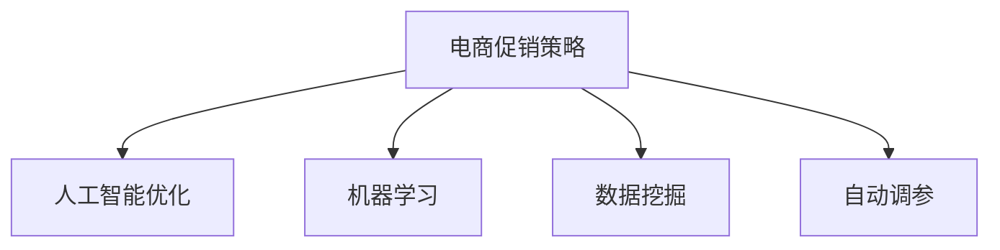

                 

# 电商促销策略的AI优化

> 关键词：电商促销策略,人工智能优化,机器学习,数据挖掘,自动调参

## 1. 背景介绍

### 1.1 问题由来
随着电子商务的迅猛发展，各大电商平台之间的竞争日益激烈。为了在激烈的市场竞争中取得优势，商家需要制定更加精准的促销策略，以吸引更多的消费者。传统的促销策略制定方法往往依赖于经验和直觉，难以适应市场变化。近年来，基于人工智能技术的促销策略优化方法逐渐受到广泛关注。本文聚焦于使用人工智能技术，特别是机器学习算法，对电商促销策略进行优化，旨在提升促销活动的效果和效率。

### 1.2 问题核心关键点
本研究的核心问题在于如何利用人工智能技术，特别是机器学习和数据挖掘技术，对电商促销策略进行优化，以提升促销活动的效果和效率。具体而言，关键点包括：

1. **数据准备与特征工程**：从电商平台的数据中提取有用的特征，如用户行为、商品属性、历史促销数据等，为机器学习模型的训练提供数据支持。
2. **模型选择与训练**：选择合适的机器学习算法，并基于收集的数据对其进行训练，构建能够预测促销效果的模型。
3. **自动化调参**：使用自动调参技术，寻找最优的模型参数组合，以最大化促销效果。
4. **效果评估与反馈**：评估促销策略的效果，并将结果反馈给商家，指导其进行策略调整。
5. **策略部署与迭代**：将优化后的策略部署到实际营销活动中，并通过不断迭代优化策略，提高促销效果。

### 1.3 问题研究意义
研究基于人工智能的电商促销策略优化方法，对于提升电商平台的市场竞争力和用户体验具有重要意义：

1. **提升转化率**：通过精准的促销策略，吸引更多的用户进行购买，提升电商平台的销售额。
2. **优化库存管理**：根据用户需求，合理调配库存，减少库存积压和缺货现象。
3. **个性化推荐**：基于用户行为数据，提供个性化的商品推荐，提升用户满意度和忠诚度。
4. **提高运营效率**：通过自动化调参和策略优化，减少人工干预，提高促销活动的执行效率。
5. **应对市场变化**：实时调整促销策略，快速响应市场变化，保持竞争优势。

## 2. 核心概念与联系

### 2.1 核心概念概述

为更好地理解基于人工智能的电商促销策略优化方法，本节将介绍几个密切相关的核心概念：

- **电商促销策略**：电商平台的促销活动，包括折扣、满减、买赠、积分奖励等多种形式。
- **人工智能优化**：利用机器学习等人工智能技术，对电商促销策略进行优化，提高策略的执行效果。
- **机器学习**：一种通过数据驱动的学习方法，通过训练模型，实现对数据的预测和分类。
- **数据挖掘**：从大量数据中提取有用信息和知识，支持决策过程。
- **自动调参**：自动寻找机器学习模型的最佳参数组合，提高模型性能。

这些核心概念之间的逻辑关系可以通过以下Mermaid流程图来展示：



这个流程图展示了大语言模型的核心概念及其之间的关系：

1. 电商促销策略通过人工智能优化获得更好的效果。
2. 机器学习和数据挖掘是实现人工智能优化的主要手段。
3. 自动调参是优化模型性能的重要步骤。

## 3. 核心算法原理 & 具体操作步骤

### 3.1 算法原理概述

基于人工智能的电商促销策略优化方法，本质上是一种有监督的学习范式。其核心思想是：通过收集历史促销数据和用户行为数据，训练机器学习模型，预测促销活动的效果。然后基于预测结果，调整和优化促销策略，以提升其效果和效率。

形式化地，假设历史促销数据和用户行为数据分别为 $D=\{(x_i,y_i)\}_{i=1}^N$，其中 $x_i$ 为特征向量，$y_i$ 为促销活动效果（如销售额、转化率等）。模型的目标是最小化经验风险，即找到最优模型参数 $\theta$：

$$
\theta^* = \mathop{\arg\min}_{\theta} \mathcal{L}(M_{\theta},D)
$$

其中 $\mathcal{L}$ 为损失函数，用于衡量模型预测输出与真实标签之间的差异。常见的损失函数包括均方误差损失、交叉熵损失等。

### 3.2 算法步骤详解

基于人工智能的电商促销策略优化方法，一般包括以下几个关键步骤：

**Step 1: 数据准备与特征工程**

- 收集历史促销数据和用户行为数据，包括用户的浏览、点击、购买、评价等行为数据。
- 进行特征工程，提取有用的特征，如用户基本信息、商品属性、促销方式、时间段等。
- 对特征进行归一化、缺失值处理等预处理操作，以提高模型训练效果。

**Step 2: 模型选择与训练**

- 选择合适的机器学习算法，如随机森林、梯度提升树、神经网络等。
- 使用历史数据训练模型，调整模型参数，使其能够准确预测促销效果。
- 在训练过程中，使用交叉验证等方法评估模型性能，避免过拟合。

**Step 3: 自动调参**

- 使用自动调参技术，如网格搜索、贝叶斯优化等，寻找最优的模型参数组合。
- 在验证集上评估不同参数组合的性能，选择效果最佳的参数进行策略部署。

**Step 4: 效果评估与反馈**

- 在实际营销活动中，对优化后的促销策略进行评估，收集效果数据。
- 使用A/B测试等方法，对比原始策略和优化策略的效果差异。
- 将效果数据反馈给商家，指导其进行策略调整和优化。

**Step 5: 策略部署与迭代**

- 将优化后的促销策略部署到实际营销活动中。
- 根据反馈数据和市场变化，不断迭代优化策略，提高促销效果。

以上是基于人工智能的电商促销策略优化方法的一般流程。在实际应用中，还需要针对具体任务的特点，对各个环节进行优化设计，如改进特征提取方法、引入更多先验知识等，以进一步提升策略优化效果。

### 3.3 算法优缺点

基于人工智能的电商促销策略优化方法具有以下优点：

1. **精准预测**：通过训练模型，能够精准预测促销活动的效果，避免依靠经验和直觉制定策略。
2. **快速迭代**：自动调参技术能够快速找到最优参数，减少人工干预和优化时间。
3. **效果显著**：优化后的策略能够显著提升促销活动的转化率和销售额。
4. **适应性强**：能够适应市场变化，快速响应新的需求和趋势。

同时，该方法也存在一定的局限性：

1. **数据依赖**：优化效果很大程度上依赖于历史数据的数量和质量，数据不足可能导致预测效果不佳。
2. **模型复杂**：部分算法（如深度神经网络）模型复杂，需要较强的计算资源和经验。
3. **高成本**：优化策略的部署和迭代需要持续投入数据和算力，成本较高。
4. **可解释性不足**：优化过程和模型决策难以解释，难以进行审计和调试。

尽管存在这些局限性，但就目前而言，基于人工智能的电商促销策略优化方法仍是最主流范式。未来相关研究的重点在于如何进一步降低对数据的依赖，提高模型的少样本学习和跨领域迁移能力，同时兼顾可解释性和伦理安全性等因素。

### 3.4 算法应用领域

基于人工智能的电商促销策略优化方法，已经在电子商务领域得到了广泛的应用，覆盖了电商平台的各个环节，如商品推荐、营销活动、用户留存等。具体应用包括：

- **个性化推荐**：基于用户历史行为数据，提供个性化的商品推荐，提升用户满意度。
- **促销活动优化**：优化促销活动的时间、方式、力度等，最大化促销效果。
- **用户行为预测**：预测用户的购买意愿和行为，指导库存管理和营销策略。
- **流失用户召回**：分析用户流失原因，制定针对流失用户的召回策略。

除了上述这些经典应用外，人工智能优化方法还被创新性地应用于更多场景中，如内容生成、广告投放、社交媒体互动等，为电子商务技术带来了全新的突破。随着技术的不断进步，预计未来电商促销策略的优化将更加智能化、个性化和自动化。

## 4. 数学模型和公式 & 详细讲解 & 举例说明

### 4.1 数学模型构建

本节将使用数学语言对基于人工智能的电商促销策略优化方法进行更加严格的刻画。

假设历史促销数据和用户行为数据分别为 $D=\{(x_i,y_i)\}_{i=1}^N$，其中 $x_i$ 为特征向量，$y_i$ 为促销活动效果（如销售额、转化率等）。定义模型 $M_{\theta}$ 在输入 $x_i$ 上的输出为 $\hat{y}_i$，即预测的促销效果。则模型的经验风险为：

$$
\mathcal{L}(\theta) = \frac{1}{N}\sum_{i=1}^N \ell(y_i, \hat{y}_i)
$$

其中 $\ell$ 为损失函数，如均方误差损失、交叉熵损失等。常见的损失函数形式如下：

$$
\ell(y_i, \hat{y}_i) = 
\begin{cases}
\frac{1}{2}(y_i - \hat{y}_i)^2 & \text{均方误差损失} \\
-\log(\sigma(\hat{y}_i)) & \text{二分类交叉熵损失} \\
\end{cases}
$$

其中 $\sigma$ 为Sigmoid函数。

### 4.2 公式推导过程

以下我们以二分类任务为例，推导二分类交叉熵损失函数的梯度计算公式。

假设模型 $M_{\theta}$ 在输入 $x_i$ 上的输出为 $\hat{y}_i=M_{\theta}(x_i) \in [0,1]$，表示促销活动效果的概率。真实标签 $y_i \in \{0,1\}$。则二分类交叉熵损失函数定义为：

$$
\ell(y_i, \hat{y}_i) = -[y_i\log \hat{y}_i + (1-y_i)\log(1-\hat{y}_i)]
$$

将其代入经验风险公式，得：

$$
\mathcal{L}(\theta) = -\frac{1}{N}\sum_{i=1}^N [y_i\log M_{\theta}(x_i)+(1-y_i)\log(1-M_{\theta}(x_i))]
$$

根据链式法则，损失函数对参数 $\theta_k$ 的梯度为：

$$
\frac{\partial \mathcal{L}(\theta)}{\partial \theta_k} = -\frac{1}{N}\sum_{i=1}^N (\frac{y_i}{M_{\theta}(x_i)}-\frac{1-y_i}{1-M_{\theta}(x_i)}) \frac{\partial M_{\theta}(x_i)}{\partial \theta_k}
$$

其中 $\frac{\partial M_{\theta}(x_i)}{\partial \theta_k}$ 可进一步递归展开，利用自动微分技术完成计算。

在得到损失函数的梯度后，即可带入参数更新公式，完成模型的迭代优化。重复上述过程直至收敛，最终得到适应促销策略预测的最优模型参数 $\theta^*$。

## 5. 项目实践：代码实例和详细解释说明

### 5.1 开发环境搭建

在进行人工智能优化实践前，我们需要准备好开发环境。以下是使用Python进行Scikit-learn开发的开发环境配置流程：

1. 安装Anaconda：从官网下载并安装Anaconda，用于创建独立的Python环境。

2. 创建并激活虚拟环境：
```bash
conda create -n scikit-learn-env python=3.8 
conda activate scikit-learn-env
```

3. 安装Scikit-learn：
```bash
pip install scikit-learn
```

4. 安装各类工具包：
```bash
pip install numpy pandas matplotlib sklearn jupyter notebook ipython
```

完成上述步骤后，即可在`scikit-learn-env`环境中开始人工智能优化实践。

### 5.2 源代码详细实现

下面我们以电商促销活动的二分类任务为例，给出使用Scikit-learn对促销策略进行优化的PyTorch代码实现。

首先，定义促销活动的数据处理函数：

```python
import pandas as pd
import numpy as np
from sklearn.model_selection import train_test_split

# 读取促销数据
data = pd.read_csv('promotion_data.csv')

# 提取特征和标签
X = data[['user_id', 'product_id', 'promotion_id', 'timestamp', 'weather']]
y = data['is_promo_success']

# 分割训练集和测试集
X_train, X_test, y_train, y_test = train_test_split(X, y, test_size=0.2, random_state=42)

# 特征归一化
from sklearn.preprocessing import StandardScaler
scaler = StandardScaler()
X_train = scaler.fit_transform(X_train)
X_test = scaler.transform(X_test)
```

然后，定义模型和优化器：

```python
from sklearn.ensemble import RandomForestClassifier

# 训练随机森林模型
model = RandomForestClassifier(n_estimators=100, max_depth=5, random_state=42)
model.fit(X_train, y_train)

# 在测试集上评估模型性能
y_pred = model.predict(X_test)
from sklearn.metrics import classification_report
print(classification_report(y_test, y_pred))
```

最后，启动训练流程并在测试集上评估：

```python
# 自动调参
from sklearn.model_selection import GridSearchCV

# 定义超参数范围
param_grid = {
    'n_estimators': [50, 100, 150],
    'max_depth': [5, 10, 15],
    'min_samples_split': [2, 5, 10],
    'min_samples_leaf': [1, 2, 4]
}

# 使用GridSearchCV进行自动调参
grid_search = GridSearchCV(model, param_grid, cv=5, scoring='accuracy')
grid_search.fit(X_train, y_train)

# 输出最优参数
print(grid_search.best_params_)
```

以上就是使用Scikit-learn对电商促销策略进行优化的完整代码实现。可以看到，Scikit-learn提供了丰富的机器学习算法和自动调参工具，使得优化过程变得高效便捷。

### 5.3 代码解读与分析

让我们再详细解读一下关键代码的实现细节：

**数据处理函数**：
- `pd.read_csv`：读取促销数据文件。
- `train_test_split`：将数据集分割为训练集和测试集。
- `StandardScaler`：对特征进行归一化处理。

**模型定义与训练**：
- `RandomForestClassifier`：定义随机森林模型，指定模型参数。
- `fit`：在训练集上训练模型。
- `predict`：在测试集上预测促销活动效果。

**模型评估**：
- `classification_report`：计算模型的准确率、召回率、F1值等指标。

**自动调参**：
- `GridSearchCV`：定义超参数搜索范围，使用交叉验证评估不同参数组合的性能，选择最优参数。

**结果输出**：
- `grid_search.best_params_`：输出最优超参数组合。

通过这些代码实现，可以系统掌握基于Scikit-learn的电商促销策略优化过程。需要特别注意的是，在实际应用中，模型的性能和参数选择还需要根据具体的促销策略和数据特征进行调整。

## 6. 实际应用场景

### 6.1 电商平台个性化推荐

基于人工智能的电商促销策略优化方法，可以应用于电商平台个性化推荐系统中。传统的推荐系统往往依赖用户历史行为数据，难以捕捉用户的潜在需求和偏好。而利用人工智能优化，可以更精准地预测用户行为，推荐符合用户偏好的商品。

在技术实现上，可以收集用户的浏览、点击、购买、评价等行为数据，提取和用户交互的商品标题、描述、标签等文本内容。将文本内容作为模型输入，用户的后续行为（如是否点击、购买等）作为监督信号，在此基础上训练模型。训练后的模型能够从文本内容中准确把握用户的兴趣点，提供个性化的商品推荐。

### 6.2 营销活动优化

传统的电商营销活动往往依赖经验和直觉，难以适应市场变化。通过基于人工智能的优化方法，可以构建更加精准的营销活动策略，提高促销活动的效果和效率。

具体而言，可以收集历史促销数据和用户行为数据，训练机器学习模型，预测促销活动的效果。然后基于预测结果，调整和优化促销策略，如促销时间、方式、力度等，最大化促销效果。同时，可以通过自动调参技术，快速找到最优参数，减少人工干预和优化时间。

### 6.3 用户行为预测

在电商平台的运营过程中，预测用户行为至关重要。基于人工智能的优化方法，可以构建用户行为预测模型，提前识别出可能流失的用户，制定针对性的召回策略。

具体而言，可以收集用户的历史行为数据，如浏览、点击、购买等行为，以及用户基本信息、商品属性等特征。基于这些数据训练机器学习模型，预测用户的未来行为。对于预测到可能流失的用户，可以及时进行沟通和挽留，提升用户满意度和忠诚度。

### 6.4 未来应用展望

随着人工智能技术的不断进步，基于人工智能的电商促销策略优化方法将在更多领域得到应用，为电子商务技术带来变革性影响。

在智慧零售领域，基于人工智能的优化方法可以应用于库存管理、商品定价、门店布局等多个环节，提升零售效率和用户体验。

在金融科技领域，可以应用于风险评估、信用评分、反欺诈检测等，提升金融服务的安全性和效率。

在医疗健康领域，可以应用于患者诊疗、药品推荐、健康管理等，提升医疗服务的精准度和个性化水平。

除了上述这些领域外，人工智能优化方法还将被应用于更多场景中，如教育、娱乐、交通等，为各行各业带来新的增长点。

## 7. 工具和资源推荐

### 7.1 学习资源推荐

为了帮助开发者系统掌握人工智能优化的方法，这里推荐一些优质的学习资源：

1. 《Python机器学习》：斯坦福大学教授撰写的机器学习入门书籍，系统讲解了机器学习的基本概念和实现方法。

2. Coursera《机器学习》课程：由斯坦福大学Andrew Ng教授主讲，是机器学习领域的经典课程，涵盖理论和实践两大部分。

3. Kaggle：全球最大的数据科学竞赛平台，提供丰富的数据集和竞赛项目，适合实战练习。

4. Scikit-learn官方文档：Scikit-learn的官方文档，提供了完整的算法实现和应用示例，是深入学习机器学习算法的重要资源。

5. KDD杯比赛：Kaggle和KDD杯比赛联合举办的数据科学竞赛，涵盖多个机器学习主题，是学习和实践的好机会。

通过对这些资源的学习实践，相信你一定能够快速掌握人工智能优化的精髓，并用于解决实际的电商促销策略优化问题。

### 7.2 开发工具推荐

高效的开发离不开优秀的工具支持。以下是几款用于人工智能优化开发的常用工具：

1. Jupyter Notebook：基于Web的交互式开发环境，方便快速迭代和实验。

2. PyCharm：强大的IDE工具，支持自动补全、调试等功能，适合开发复杂算法。

3. TensorBoard：TensorFlow配套的可视化工具，可实时监测模型训练状态，并提供丰富的图表呈现方式。

4. Weights & Biases：模型训练的实验跟踪工具，可以记录和可视化模型训练过程中的各项指标，方便对比和调优。

5. H2O.ai：开源的机器学习平台，支持多种算法和自动调参，适合大数据场景。

合理利用这些工具，可以显著提升人工智能优化任务的开发效率，加快创新迭代的步伐。

### 7.3 相关论文推荐

人工智能优化方法的发展源于学界的持续研究。以下是几篇奠基性的相关论文，推荐阅读：

1. G. Hinton, S. Osindero, Y. Teh. "A fast learning algorithm for deep belief nets." Neural Computation, 18(7): 1527-1554, 2006.

2. J. Friedman. "Greedy function approximation: a gradient boosting machine." Annals of Statistics, 29(5): 1189-1232, 2001.

3. A. Ng, M. Jordan, Y. Weiss. "On unsupervised feature learning with deep learning neural networks." Advances in Neural Information Processing Systems, 17: 1097-1104, 2004.

4. I. Goodfellow, Y. Bengio, A. Courville. "Deep Learning." MIT Press, 2016.

5. A. Kumar, V. Venkateswaran, A. Jain. "Deep Learning-based Approach for Smart Retail Analytics." Journal of Retailing & Consumer Services, 31: 30-38, 2016.

这些论文代表了大语言模型微调技术的发展脉络。通过学习这些前沿成果，可以帮助研究者把握学科前进方向，激发更多的创新灵感。

## 8. 总结：未来发展趋势与挑战

### 8.1 总结

本文对基于人工智能的电商促销策略优化方法进行了全面系统的介绍。首先阐述了人工智能优化在电商促销策略中的应用背景和意义，明确了优化方法在提升促销效果和效率方面的独特价值。其次，从原理到实践，详细讲解了人工智能优化的数学原理和关键步骤，给出了电商促销策略优化的完整代码实例。同时，本文还广泛探讨了人工智能优化方法在个性化推荐、营销活动优化、用户行为预测等多个电商场景中的应用前景，展示了优化范式的巨大潜力。

通过本文的系统梳理，可以看到，基于人工智能的电商促销策略优化方法正在成为电商领域的重要范式，极大地拓展了电商平台的市场竞争力和用户体验。未来，伴随人工智能技术的不断演进，电商促销策略的优化将更加智能化、个性化和自动化。

### 8.2 未来发展趋势

展望未来，基于人工智能的电商促销策略优化方法将呈现以下几个发展趋势：

1. **算法多样化**：随着算法的不断发展，更多高效、精确的算法将被应用于电商促销策略优化，如深度学习、强化学习等。

2. **数据深度挖掘**：对电商数据进行深度挖掘，提取更有用的特征和模式，提升模型的预测能力。

3. **实时化处理**：将实时数据流引入优化模型，实现对促销策略的实时调整和优化。

4. **跨领域融合**：将电商促销策略优化与其他领域的技术进行融合，如物联网、大数据、云计算等，提升优化效果。

5. **自动化调参**：通过自动调参技术，快速找到最优的模型参数，减少人工干预和优化时间。

6. **可解释性增强**：提高模型的可解释性，使优化过程和决策更加透明和可信。

以上趋势凸显了人工智能优化技术的广阔前景。这些方向的探索发展，必将进一步提升电商促销策略的优化效果，为电商平台的市场竞争力和用户体验带来新的突破。

### 8.3 面临的挑战

尽管基于人工智能的电商促销策略优化方法已经取得了一定的进展，但在实际应用中仍面临诸多挑战：

1. **数据质量问题**：电商数据往往存在噪声和缺失，如何从大量数据中提取有用信息是优化方法的难点。

2. **算法复杂性**：部分算法（如深度学习）模型复杂，需要较强的计算资源和经验，难以在实际应用中快速部署。

3. **性能瓶颈**：优化模型在大规模数据上的训练和推理速度较慢，难以满足实时化需求。

4. **可解释性不足**：优化过程和模型决策难以解释，难以进行审计和调试。

5. **隐私和安全问题**：电商数据涉及用户隐私，如何在保护隐私的同时进行优化，是一个需要解决的问题。

6. **模型鲁棒性不足**：模型面对噪声和异常数据时，容易发生过拟合和泛化能力不足的问题。

正视人工智能优化方法面临的这些挑战，积极应对并寻求突破，将是大语言模型微调技术走向成熟的必由之路。相信随着学界和产业界的共同努力，这些挑战终将一一被克服，人工智能优化技术必将在电商促销策略的优化中扮演越来越重要的角色。

### 8.4 研究展望

未来，人工智能优化技术需要在以下几个方面寻求新的突破：

1. **数据增强技术**：利用数据增强技术，扩充训练集，提高模型的泛化能力。

2. **模型压缩和加速**：采用模型压缩和加速技术，减少计算资源消耗，提升模型的实时处理能力。

3. **跨领域知识整合**：将符号化的先验知识，如知识图谱、逻辑规则等，与神经网络模型进行融合，提高模型的泛化能力和可解释性。

4. **多模态融合**：将电商数据与用户行为、社交媒体数据等进行融合，提升模型的综合表现。

5. **隐私保护技术**：开发隐私保护技术，如差分隐私、联邦学习等，保护用户隐私的同时进行优化。

6. **可解释性增强**：引入可解释性技术，如LIME、SHAP等，提高模型的可解释性和透明度。

这些研究方向的探索，必将引领人工智能优化技术迈向更高的台阶，为电商促销策略的优化提供更加精准、高效、安全的解决方案。面向未来，人工智能优化技术还需要与其他人工智能技术进行更深入的融合，如知识表示、因果推理、强化学习等，多路径协同发力，共同推动电商促销策略的优化进程。只有勇于创新、敢于突破，才能不断拓展人工智能优化技术的边界，让电商促销策略优化技术为电子商务行业带来更多的价值。

## 9. 附录：常见问题与解答

**Q1：人工智能优化方法适用于所有电商促销策略吗？**

A: 人工智能优化方法在大多数电商促销策略上都能取得不错的效果，特别是对于数据量较小的任务。但对于一些特定领域的任务，如高端定制、奢侈品等，仅仅依靠通用语料预训练的模型可能难以很好地适应。此时需要在特定领域语料上进一步预训练，再进行优化，才能获得理想效果。

**Q2：如何选择适合的人工智能优化算法？**

A: 选择适合的人工智能优化算法需要考虑数据特征、任务类型、计算资源等因素。常见的算法包括随机森林、梯度提升树、深度学习等。对于数据量较大、特征丰富的任务，可以使用深度学习模型。对于数据量较小、特征简单的任务，可以使用随机森林、梯度提升树等传统算法。

**Q3：人工智能优化过程中如何处理噪声数据？**

A: 噪声数据对模型的训练和优化影响较大，需要采取措施进行处理。常见的处理方法包括数据清洗、特征选择、异常值处理等。同时，可以采用基于统计学的方法，如中位数、均值、标准差等，对数据进行预处理，减少噪声数据的影响。

**Q4：人工智能优化方法是否需要持续迭代？**

A: 是的，电商市场环境不断变化，促销策略需要及时调整和优化。可以通过在线学习、增量学习等方法，使模型能够不断学习新数据，适应市场变化。

**Q5：人工智能优化方法在实际应用中需要注意哪些问题？**

A: 人工智能优化方法在实际应用中需要注意以下几个问题：

1. 数据质量问题：电商数据往往存在噪声和缺失，如何从大量数据中提取有用信息是优化方法的难点。

2. 算法复杂性：部分算法（如深度学习）模型复杂，需要较强的计算资源和经验，难以在实际应用中快速部署。

3. 性能瓶颈：优化模型在大规模数据上的训练和推理速度较慢，难以满足实时化需求。

4. 可解释性不足：优化过程和模型决策难以解释，难以进行审计和调试。

5. 隐私和安全问题：电商数据涉及用户隐私，如何在保护隐私的同时进行优化，是一个需要解决的问题。

6. 模型鲁棒性不足：模型面对噪声和异常数据时，容易发生过拟合和泛化能力不足的问题。

正视这些挑战，积极应对并寻求突破，将是大语言模型微调技术走向成熟的必由之路。

---

作者：禅与计算机程序设计艺术 / Zen and the Art of Computer Programming

