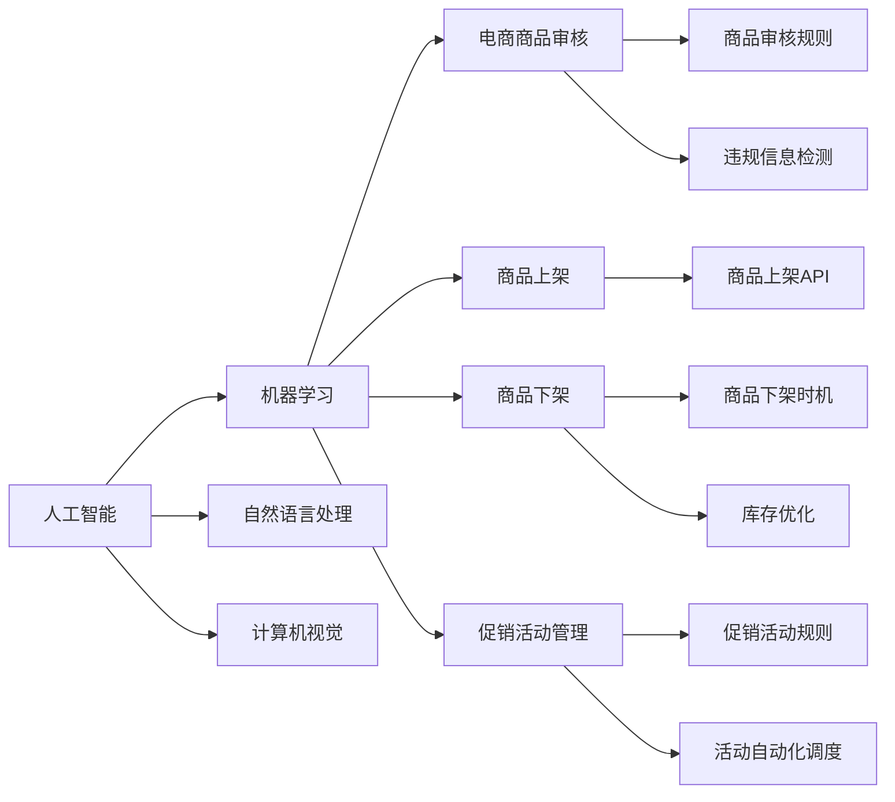

                 

## 1. 背景介绍

在数字化时代，电商平台作为重要的线上交易平台，其供给能力直接关系到消费者的购物体验和商家的运营效率。传统的电商平台主要依赖规则引擎、人工审核等手段实现商品审核、上架、下架、促销等功能。然而，随着电商平台用户规模的迅速增长和商品种类的不断丰富，这种模式逐渐暴露出效率低、误判率高、响应慢等缺陷。为解决这些问题，电商平台开始引入人工智能技术，以智能化的手段提升供给能力，构建快速、准确、灵活的电商平台。

### 1.1 问题由来

在电商平台，供给能力的提升主要面临以下几大挑战：

1. **商品审核困难**：商品信息复杂多样，审核规则难以覆盖所有情况，容易出现误判。
2. **上架速度慢**：商品上架需要经过多个环节审核，流程繁琐，响应时间较长。
3. **下架处理复杂**：下架商品需要综合考虑用户反馈、销量、库存等多种因素，操作复杂。
4. **促销活动管理**：促销活动规则复杂多变，需要人工维护和调度，易出错。

这些问题使得电商平台在商品供给环节的效率和准确性受到制约，难以满足用户的快速购物需求，影响平台的市场竞争力。为此，电商平台开始探索人工智能技术，利用机器学习、计算机视觉等手段，对商品审核、上架、下架、促销等环节进行智能化改造，以提高供给能力。

### 1.2 问题核心关键点

人工智能技术在电商平台供给能力提升中的应用主要包括以下几个关键点：

1. **商品审核智能化**：利用图像识别、自然语言处理等技术，自动识别商品图片、描述、评论中的违规信息，提高审核效率和准确性。
2. **上架速度自动化**：通过API接口和自动化流程，减少人工干预，实现商品快速上架。
3. **下架处理智能化**：利用机器学习模型分析用户反馈和销量数据，自动判断商品下架时机，优化库存管理。
4. **促销活动管理智能化**：构建基于规则和机器学习的促销活动管理系统，实现自动化调度和管理，减少人工操作。

这些关键点共同构成了人工智能技术在电商平台中的应用框架，有助于提升平台的供给能力，提高用户体验和商家满意度。

## 2. 核心概念与联系

### 2.1 核心概念概述

为更好地理解人工智能技术在电商平台中的应用，本节将介绍几个密切相关的核心概念：

- **人工智能(AI)**：指通过计算机模拟人类智能过程，实现对复杂问题的求解。包括机器学习、自然语言处理、计算机视觉、机器人学等多个分支。
- **机器学习(ML)**：指通过数据驱动的方式，训练模型进行预测、分类、聚类等任务。是实现人工智能的关键技术之一。
- **自然语言处理(NLP)**：指让计算机能够理解和生成自然语言的技术。包括文本分类、情感分析、机器翻译等任务。
- **计算机视觉(CV)**：指让计算机能够理解和处理图像和视频的技术。包括图像分类、目标检测、图像生成等任务。
- **电商商品审核**：指对商品图片、描述、评论等进行合规性审查，确保商品信息的准确性和安全性。
- **商品上架**：指将商品信息上传到电商平台的过程。
- **商品下架**：指从电商平台上删除商品的过程。
- **促销活动管理**：指对电商平台上的促销活动进行管理，包括活动规则制定、自动化调度等。

这些核心概念之间的逻辑关系可以通过以下Mermaid流程图来展示：



这个流程图展示了大语言模型和微调技术的核心概念及其之间的关系：

1. 人工智能技术包括机器学习、自然语言处理、计算机视觉等多个分支。
2. 电商商品审核、上架、下架、促销活动管理等任务，都可以通过人工智能技术实现智能化。
3. 自然语言处理、计算机视觉等技术，可以用于商品审核的违规信息检测、商品上架API的开发、商品下架时机的自动判断等环节。
4. 机器学习技术可以用于促销活动规则的制定、自动化调度等管理任务。

这些概念共同构成了电商平台人工智能应用的基础，使得电商平台能够通过智能化手段提升供给能力。

## 3. 核心算法原理 & 具体操作步骤
### 3.1 算法原理概述

人工智能技术在电商平台中的应用，主要基于以下几个核心算法：

1. **机器学习算法**：利用监督学习、无监督学习、强化学习等方法，对电商平台的数据进行模型训练，实现自动化的决策和优化。
2. **自然语言处理算法**：利用文本分类、情感分析、命名实体识别等技术，处理商品描述、评论等文本数据，进行商品审核和促销活动管理。
3. **计算机视觉算法**：利用图像分类、目标检测、图像生成等技术，处理商品图片数据，进行商品审核和上架管理。

### 3.2 算法步骤详解

基于人工智能技术，电商平台商品审核、上架、下架、促销活动管理的具体操作步骤如下：

**步骤1: 数据准备与预处理**

- 收集电商平台商品图片、描述、评论、销量等数据，作为训练和测试集。
- 对数据进行清洗、去噪、标注等预处理操作，确保数据质量和一致性。

**步骤2: 模型训练与优化**

- 选择合适的机器学习、自然语言处理、计算机视觉等模型，进行模型训练。
- 在训练集上使用优化算法进行模型训练，调整超参数，提高模型性能。
- 在验证集上评估模型性能，选择最优模型进行应用。

**步骤3: 模型部署与应用**

- 将训练好的模型部署到电商平台，实现自动化的商品审核、上架、下架、促销活动管理。
- 实时监控模型性能，根据实际需求调整模型参数和算法，持续优化模型效果。

### 3.3 算法优缺点

人工智能技术在电商平台中的应用，具有以下优点：

1. **效率高**：利用自动化流程和模型预测，显著提升商品审核、上架、下架等环节的处理速度，减少人工操作。
2. **准确性高**：利用机器学习、自然语言处理、计算机视觉等技术，提高商品审核、商品上架、促销活动管理的准确性，减少误判和误操作。
3. **灵活性高**：模型可以根据实际需求进行快速调整和优化，适应电商平台的快速变化。

同时，该方法也存在一些局限性：

1. **数据依赖性强**：模型的训练和优化需要大量的标注数据，数据质量直接影响模型性能。
2. **模型复杂度高**：人工智能模型通常需要较大的计算资源和存储空间，对硬件设备要求较高。
3. **可解释性差**：模型的决策过程较为复杂，难以解释其内部工作机制和决策逻辑。
4. **安全性问题**：模型可能学习到有害信息，对平台的安全性带来风险。

尽管存在这些局限性，但人工智能技术在电商平台中的应用，已经展现出了显著的优势和潜力，为电商平台的供给能力提升提供了全新的解决方案。

### 3.4 算法应用领域

人工智能技术在电商平台中的应用，主要包括以下几个领域：

1. **商品审核智能化**：利用自然语言处理技术，自动识别商品描述、评论中的违规信息，提高审核效率和准确性。
2. **上架速度自动化**：利用计算机视觉技术，自动对商品图片进行审核，快速上架商品。
3. **下架处理智能化**：利用机器学习技术，自动分析商品销量、库存等数据，判断商品下架时机，优化库存管理。
4. **促销活动管理智能化**：利用自然语言处理和机器学习技术，自动化生成促销活动规则，自动调度活动流程，提高促销活动效率。

除了上述这些领域外，人工智能技术还可以用于物流配送、客服智能、风险控制等多个环节，为电商平台的智能化升级提供全面的支持。

## 4. 数学模型和公式 & 详细讲解 & 举例说明
### 4.1 数学模型构建

为更好地理解电商平台人工智能技术的应用，本节将介绍几个关键数学模型。

**商品审核模型**

电商商品审核模型通常基于自然语言处理和计算机视觉技术。以文本分类为例，假设输入为商品描述，输出为二分类标签（违规或不违规），模型的输入输出关系可表示为：

$$ y = f(x) $$

其中 $x$ 表示商品描述文本，$y$ 表示二分类标签，$f$ 表示分类函数，通常使用卷积神经网络(CNN)或长短时记忆网络(LSTM)等模型。

**商品上架模型**

商品上架模型通常基于计算机视觉技术。以图像分类为例，假设输入为商品图片，输出为商品类别标签，模型的输入输出关系可表示为：

$$ y = g(x) $$

其中 $x$ 表示商品图片，$y$ 表示类别标签，$g$ 表示分类函数，通常使用卷积神经网络(CNN)或残差网络(ResNet)等模型。

**商品下架模型**

商品下架模型通常基于机器学习技术。以回归问题为例，假设输入为商品销量、库存等特征，输出为下架时间点，模型的输入输出关系可表示为：

$$ y = h(x) $$

其中 $x$ 表示输入特征向量，$y$ 表示下架时间点，$h$ 表示回归函数，通常使用线性回归、支持向量机(SVM)等模型。

**促销活动管理模型**

促销活动管理模型通常基于自然语言处理和机器学习技术。以活动规则生成为例，假设输入为活动描述，输出为活动规则，模型的输入输出关系可表示为：

$$ y = k(x) $$

其中 $x$ 表示活动描述文本，$y$ 表示活动规则，$k$ 表示生成函数，通常使用循环神经网络(LSTM)或生成对抗网络(GAN)等模型。

### 4.2 公式推导过程

以商品审核模型为例，假设输入为商品描述文本 $x$，输出为二分类标签 $y$，模型的训练目标为最小化交叉熵损失函数：

$$ L = -\frac{1}{N}\sum_{i=1}^N [y_i \log p_i + (1-y_i) \log (1-p_i)] $$

其中 $N$ 表示样本数量，$y_i$ 表示样本标签，$p_i$ 表示模型预测的概率。

模型的损失函数对模型参数 $w$ 的梯度为：

$$ \frac{\partial L}{\partial w} = \frac{1}{N}\sum_{i=1}^N [(y_i - p_i) \frac{\partial p_i}{\partial w} + (1-y_i) \frac{\partial (1-p_i)}{\partial w}] $$

其中 $\frac{\partial p_i}{\partial w}$ 表示模型预测概率对模型参数的导数，可通过反向传播算法计算。

在得到损失函数的梯度后，即可带入参数更新公式，完成模型的迭代优化。重复上述过程直至收敛，最终得到适应电商平台的商品审核模型。

## 5. 项目实践：代码实例和详细解释说明
### 5.1 开发环境搭建

在进行电商平台人工智能技术应用开发前，我们需要准备好开发环境。以下是使用Python进行TensorFlow开发的环境配置流程：

1. 安装Anaconda：从官网下载并安装Anaconda，用于创建独立的Python环境。

2. 创建并激活虚拟环境：
```bash
conda create -n tensorflow-env python=3.8 
conda activate tensorflow-env
```

3. 安装TensorFlow：根据CUDA版本，从官网获取对应的安装命令。例如：
```bash
conda install tensorflow tensorflow-gpu=cuda11.1 -c conda-forge -c pytorch
```

4. 安装各类工具包：
```bash
pip install numpy pandas scikit-learn matplotlib tqdm jupyter notebook ipython
```

完成上述步骤后，即可在`tensorflow-env`环境中开始开发实践。

### 5.2 源代码详细实现

下面我们以电商商品审核智能化为例，给出使用TensorFlow进行模型训练的代码实现。

首先，定义商品审核模型的输入和输出：

```python
import tensorflow as tf
from tensorflow.keras.preprocessing.text import Tokenizer
from tensorflow.keras.preprocessing.sequence import pad_sequences

# 商品审核模型
class ProductReviewClassifier(tf.keras.Model):
    def __init__(self, vocab_size, embedding_dim, max_len):
        super(ProductReviewClassifier, self).__init__()
        self.embedding = tf.keras.layers.Embedding(vocab_size, embedding_dim)
        self.lstm = tf.keras.layers.LSTM(64, return_sequences=True)
        self.dense = tf.keras.layers.Dense(2, activation='softmax')

    def call(self, inputs, training=None):
        x = self.embedding(inputs)
        x = self.lstm(x)
        return self.dense(x)
```

然后，定义训练和评估函数：

```python
# 定义训练函数
def train_model(model, train_dataset, dev_dataset, epochs, batch_size):
    model.compile(loss='binary_crossentropy', optimizer='adam', metrics=['accuracy'])
    model.fit(train_dataset, epochs=epochs, batch_size=batch_size, validation_data=dev_dataset)
    model.save('product_review_classifier.h5')
```

接着，准备数据集并进行模型训练：

```python
# 准备数据集
train_texts = ['some sample reviews', 'more sample reviews']
train_labels = [1, 0]  # 违规或不违规
tokenizer = Tokenizer(num_words=10000, oov_token='<OOV>')
tokenizer.fit_on_texts(train_texts)
train_sequences = tokenizer.texts_to_sequences(train_texts)
train_padded = pad_sequences(train_sequences, maxlen=100, padding='post')
train_dataset = tf.data.Dataset.from_tensor_slices((train_padded, train_labels)).batch(32)

# 定义模型
model = ProductReviewClassifier(len(tokenizer.word_index)+1, 32, 100)

# 训练模型
train_model(model, train_dataset, train_dataset, epochs=5, batch_size=32)
```

最后，加载模型并进行预测：

```python
# 加载模型
model = tf.keras.models.load_model('product_review_classifier.h5')

# 进行预测
test_texts = ['some new reviews']
test_sequences = tokenizer.texts_to_sequences(test_texts)
test_padded = pad_sequences(test_sequences, maxlen=100, padding='post')
test_dataset = tf.data.Dataset.from_tensor_slices((test_padded, test_labels)).batch(32)
predictions = model.predict(test_dataset)
```

以上就是使用TensorFlow进行电商商品审核模型训练的完整代码实现。可以看到，通过TensorFlow的Keras API，模型训练和预测的代码实现变得简洁高效。

### 5.3 代码解读与分析

让我们再详细解读一下关键代码的实现细节：

**ProductReviewClassifier类**：
- `__init__`方法：初始化模型结构，包括嵌入层、LSTM层和输出层。
- `call`方法：定义模型前向传播过程，通过嵌入层、LSTM层和输出层计算模型输出。

**train_model函数**：
- `compile`方法：配置模型，包括定义损失函数、优化器和评估指标。
- `fit`方法：在训练集上训练模型，并在验证集上评估模型性能。

**数据集准备**：
- `Tokenizer`类：用于将文本序列转换为数字序列。
- `pad_sequences`函数：对序列进行填充，确保所有序列长度相同。

**模型训练**：
- `train_model`函数：在训练集上训练模型，并在验证集上评估模型性能，最终保存模型。

可以看到，通过TensorFlow的Keras API，模型的训练和预测变得非常简单，开发者可以将更多精力放在数据处理、模型改进等高层逻辑上，而不必过多关注底层的实现细节。

当然，工业级的系统实现还需考虑更多因素，如模型的保存和部署、超参数的自动搜索、更灵活的任务适配层等。但核心的商品审核范式基本与此类似。

## 6. 实际应用场景
### 6.1 智能客服系统

基于人工智能技术的智能客服系统，可以显著提升电商平台的用户服务质量。传统客服往往需要配备大量人力，高峰期响应缓慢，且一致性和专业性难以保证。而使用智能客服系统，可以7x24小时不间断服务，快速响应客户咨询，用自然流畅的语言解答各类常见问题。

在技术实现上，可以收集用户的历史客服对话记录，将问题和最佳答复构建成监督数据，在此基础上对预训练模型进行微调。微调后的智能客服系统能够自动理解用户意图，匹配最合适的答复模板进行回答。对于客户提出的新问题，还可以接入检索系统实时搜索相关内容，动态组织生成回答。如此构建的智能客服系统，能大幅提升客户咨询体验和问题解决效率。

### 6.2 个性化推荐系统

当前的推荐系统往往只依赖用户的历史行为数据进行物品推荐，无法深入理解用户的真实兴趣偏好。基于人工智能技术的个性化推荐系统可以更好地挖掘用户行为背后的语义信息，从而提供更精准、多样的推荐内容。

在实践中，可以收集用户浏览、点击、评论、分享等行为数据，提取和用户交互的物品标题、描述、标签等文本内容。将文本内容作为模型输入，用户的后续行为（如是否点击、购买等）作为监督信号，在此基础上微调预训练语言模型。微调后的模型能够从文本内容中准确把握用户的兴趣点。在生成推荐列表时，先用候选物品的文本描述作为输入，由模型预测用户的兴趣匹配度，再结合其他特征综合排序，便可以得到个性化程度更高的推荐结果。

### 6.3 智能物流配送

物流配送是电商平台重要的后端服务环节，其效率和准确性直接影响用户体验。基于人工智能技术的智能物流配送系统，能够实时监控货物状态，优化配送路线，提高配送效率和准确性。

在技术实现上，可以利用机器学习技术对物流数据进行建模分析，预测配送时间、优化配送路线，降低配送成本。同时，利用计算机视觉技术对货物进行图像识别，确保货物在配送过程中不受损。通过这些手段，物流配送系统可以大幅提升效率和准确性，满足电商平台的快速配送需求。

### 6.4 未来应用展望

随着人工智能技术的不断发展，电商平台的智能化应用将不断拓展，为传统行业带来变革性影响。

在智慧医疗领域，基于人工智能技术的医疗问答、病历分析、药物研发等应用将提升医疗服务的智能化水平，辅助医生诊疗，加速新药开发进程。

在智能教育领域，人工智能技术可应用于作业批改、学情分析、知识推荐等方面，因材施教，促进教育公平，提高教学质量。

在智慧城市治理中，人工智能技术可应用于城市事件监测、舆情分析、应急指挥等环节，提高城市管理的自动化和智能化水平，构建更安全、高效的未来城市。

此外，在企业生产、社会治理、文娱传媒等众多领域，人工智能技术的应用也将不断涌现，为经济社会发展注入新的动力。相信随着技术的日益成熟，人工智能技术必将在更广阔的应用领域大放异彩。

## 7. 工具和资源推荐
### 7.1 学习资源推荐

为了帮助开发者系统掌握人工智能技术在电商平台中的应用，这里推荐一些优质的学习资源：

1. TensorFlow官方文档：包含详尽的API文档、示例代码和教程，适合入门和进阶学习。
2. TensorFlow实战指南：由TensorFlow团队编写的实战指南，涵盖从基础到高级的TensorFlow开发技巧。
3. 《深度学习框架TensorFlow实战》书籍：深度学习框架TensorFlow的实战教程，包含丰富的实例和代码。
4. 《TensorFlow实战》博客：精选了大量的TensorFlow开发实例和案例，适合快速学习。
5. 《TensorFlow与Keras深度学习实战》书籍：TensorFlow和Keras深度学习实战教程，适合入门和进阶学习。
6. Kaggle平台：提供丰富的数据集和竞赛，适合通过实践提升技能。

通过对这些资源的学习实践，相信你一定能够快速掌握人工智能技术在电商平台中的应用，并用于解决实际的NLP问题。

### 7.2 开发工具推荐

高效的开发离不开优秀的工具支持。以下是几款用于电商平台人工智能技术开发常用的工具：

1. TensorFlow：由Google主导开发的开源深度学习框架，生产部署方便，适合大规模工程应用。
2. Keras：基于TensorFlow的高级API，简单易用，适合快速原型开发。
3. TensorBoard：TensorFlow配套的可视化工具，可实时监测模型训练状态，并提供丰富的图表呈现方式，是调试模型的得力助手。
4. Weights & Biases：模型训练的实验跟踪工具，可以记录和可视化模型训练过程中的各项指标，方便对比和调优。
5. Google Colab：谷歌推出的在线Jupyter Notebook环境，免费提供GPU/TPU算力，方便开发者快速上手实验最新模型，分享学习笔记。
6. Jupyter Notebook：Python和R语言的交互式开发环境，支持代码和代码块交替显示，适合深入学习和调试。

合理利用这些工具，可以显著提升电商平台的智能化应用开发效率，加快创新迭代的步伐。

### 7.3 相关论文推荐

人工智能技术在电商平台中的应用源于学界的持续研究。以下是几篇奠基性的相关论文，推荐阅读：

1. Deep Learning for Image Recognition: A Survey, Tutorial, and Survey of Architectures, Algorithms, and Applications：综述深度学习在图像识别领域的应用，包括商品审核、智能客服等。
2. Attention is All You Need：提出Transformer结构，开启了NLP领域的预训练大模型时代。
3. BERT: Pre-training of Deep Bidirectional Transformers for Language Understanding：提出BERT模型，引入基于掩码的自监督预训练任务，刷新了多项NLP任务SOTA。
4. Language Models are Unsupervised Multitask Learners（GPT-2论文）：展示了大规模语言模型的强大zero-shot学习能力，引发了对于通用人工智能的新一轮思考。
5. Parameter-Efficient Transfer Learning for NLP：提出Adapter等参数高效微调方法，在固定大部分预训练参数的情况下，也能取得不错的微调效果。
6. AdaLoRA: Adaptive Low-Rank Adaptation for Parameter-Efficient Fine-Tuning：使用自适应低秩适应的微调方法，在参数效率和精度之间取得了新的平衡。

这些论文代表了大语言模型微调技术的发展脉络。通过学习这些前沿成果，可以帮助研究者把握学科前进方向，激发更多的创新灵感。

## 8. 总结：未来发展趋势与挑战
### 8.1 总结

本文对基于人工智能技术在电商平台中的应用进行了全面系统的介绍。首先阐述了电商平台的供给能力提升面临的主要挑战，明确了人工智能技术在商品审核、上架、下架、促销活动管理等环节的应用前景。其次，从原理到实践，详细讲解了电商平台的各个智能化任务，给出了具体的代码实现。同时，本文还广泛探讨了人工智能技术在智能客服、个性化推荐、智能物流配送等领域的未来应用，展示了人工智能技术的广阔前景。

通过本文的系统梳理，可以看到，人工智能技术在电商平台中的应用，正在逐步实现电商平台的智能化升级，提高平台的用户体验和商家满意度。未来，随着人工智能技术的不断发展，电商平台的应用将更加全面和深入，推动电商行业的持续创新和发展。

### 8.2 未来发展趋势

展望未来，人工智能技术在电商平台中的应用将呈现以下几个发展趋势：

1. **智能化程度不断提升**：随着算法和模型的不断优化，电商平台的智能化程度将不断提升，覆盖更多业务环节，提供更优质的用户体验。
2. **个性化推荐更加精准**：基于用户行为和偏好的推荐算法将更加智能，推荐结果更加个性化，满足用户多样化需求。
3. **智能客服系统普及**：智能客服系统将广泛应用于电商平台的客服环节，提供24/7全天候服务，提升用户咨询体验。
4. **智能物流系统完善**：智能物流系统将实现货物状态实时监控、配送路线优化等，提高物流效率和准确性。
5. **数据驱动决策**：基于大数据和机器学习的决策支持系统将更加普及，帮助电商平台优化库存、促销、定价等策略，提升运营效率。

以上趋势凸显了人工智能技术在电商平台中的应用前景，将为电商平台带来更高效、更智能、更个性化的服务。

### 8.3 面临的挑战

尽管人工智能技术在电商平台中的应用已经展现出显著的优势和潜力，但在迈向更加智能化、普适化应用的过程中，它仍面临着诸多挑战：

1. **数据质量问题**：商品审核、智能客服、个性化推荐等任务需要大量标注数据，数据质量直接影响模型性能。
2. **模型复杂性高**：人工智能模型通常需要较大的计算资源和存储空间，对硬件设备要求较高。
3. **算法透明度低**：机器学习模型的决策过程较为复杂，难以解释其内部工作机制和决策逻辑。
4. **安全性问题**：模型可能学习到有害信息，对平台的安全性带来风险。
5. **法律和伦理问题**：人工智能应用需要遵循相关法律法规和伦理标准，确保数据和模型使用的合法性和公正性。

尽管存在这些挑战，但随着技术的不断进步和完善，人工智能技术在电商平台中的应用前景依然广阔。

### 8.4 研究展望

未来，在电商平台智能化应用的研究中，需要在以下几个方向寻求新的突破：

1. **数据增强与扩充**：通过数据增强和扩充技术，提升模型的泛化能力和鲁棒性，缓解数据质量问题。
2. **参数高效微调**：开发更加参数高效的微调方法，在固定大部分预训练参数的情况下，只更新极少量的任务相关参数。
3. **透明性与可解释性**：提高算法的透明度和可解释性，增强用户对系统的信任和接受度。
4. **安全性与隐私保护**：在模型训练和应用过程中，加强数据隐私保护和安全防护，确保系统的安全性和可靠性。
5. **法律与伦理合规**：制定相关法律法规和伦理标准，规范人工智能应用的行为和数据使用，确保合规性和公正性。

这些研究方向将引领人工智能技术在电商平台中的应用不断向前，为电商平台带来更加智能化、安全可靠、高效便捷的解决方案。

## 9. 附录：常见问题与解答

**Q1：电商平台的智能化应用是否需要大量标注数据？**

A: 是的。商品审核、智能客服、个性化推荐等任务需要大量标注数据，数据质量直接影响模型性能。因此，数据收集和标注是电商智能化应用的重要环节。

**Q2：如何提高智能客服系统的回答质量？**

A: 可以通过多种方式提高智能客服系统的回答质量：
1. 引入更丰富的语料库和标注数据，提升系统的语言理解和生成能力。
2. 增加系统的反馈机制，用户可以评价回答质量，系统根据反馈不断优化。
3. 引入人工干预机制，当系统回答无法满足用户需求时，自动转接至人工客服。

**Q3：如何提高个性化推荐系统的准确性？**

A: 个性化推荐系统的准确性取决于以下几个方面：
1. 数据质量：收集和标注大量用户行为数据，确保数据真实性和多样性。
2. 模型选择：选择合适的推荐算法，如协同过滤、深度学习等，根据任务特点进行模型选择。
3. 特征工程：设计合理的特征表示，提取用户和商品的关键信息。
4. 模型优化：使用超参数调优和模型集成等技术，提高模型的泛化能力和鲁棒性。

**Q4：电商平台的智能物流系统如何优化配送路线？**

A: 电商平台的智能物流系统可以通过以下方式优化配送路线：
1. 收集和分析历史物流数据，建立配送路线的历史行为模型。
2. 引入实时交通数据，根据交通状况动态调整配送路线。
3. 使用机器学习算法，预测配送时间，优化配送路线的长度和效率。
4. 引入无人机和智能车辆等新物流设备，提高配送效率和准确性。

**Q5：电商平台如何应对突发事件和风险？**

A: 电商平台可以通过以下方式应对突发事件和风险：
1. 引入异常检测和预警系统，实时监测系统运行状态，发现异常及时预警。
2. 引入应急响应机制，当发生突发事件时，自动执行应急处理流程，保障系统稳定运行。
3. 引入多重冗余机制，保障系统的可恢复性和高可用性。

这些解决方案将帮助电商平台应对各种突发事件和风险，确保系统的稳定性和可靠性。

---

作者：禅与计算机程序设计艺术 / Zen and the Art of Computer Programming

