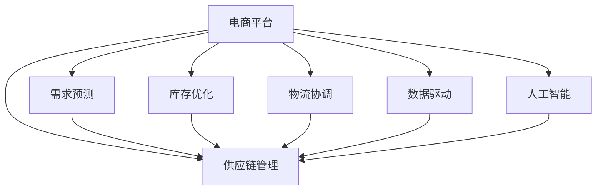

                 

# 电商平台供给能力提升：供应链管理的优化策略

> 关键词：
- 电商平台
- 供应链管理
- 需求预测
- 库存优化
- 物流协调
- 数据驱动
- 人工智能

## 1. 背景介绍

### 1.1 问题由来
随着电子商务的迅猛发展，电商平台已经成为消费者购物的重要渠道。然而，高增长的订单量给平台的供给能力带来了巨大压力，尤其是在大促期间，如“双十一”、“双十二”等，库存紧张、物流堵塞等问题频频出现，严重影响用户体验和商家收益。为了应对这些挑战，平台需要不断提升供应链管理能力，优化供给能力，确保用户需求及时满足。

### 1.2 问题核心关键点
电商平台供应链管理的关键在于如何通过数据驱动，精准预测市场需求，合理规划库存和物流，提升整个供应链的效率和响应速度。具体包括：

- 需求预测：准确预测用户需求，避免库存积压或缺货。
- 库存优化：合理管理库存，减少过度库存和缺货现象。
- 物流协调：高效调度物流资源，降低配送成本和延误率。
- 数据驱动：利用大数据和机器学习算法，进行实时决策和优化。
- 人工智能：运用AI技术，提升供应链管理的智能化水平。

### 1.3 问题研究意义
优化电商平台的供应链管理，具有以下几方面的重要意义：

1. **提升用户体验**：通过精准的需求预测和合理的库存管理，减少缺货和库存积压，提高用户满意度和平台粘性。
2. **降低运营成本**：合理规划物流资源，减少库存和配送成本，提高供应链效率。
3. **增强竞争力**：提高供应链响应速度和灵活性，提升平台的市场竞争力。
4. **推动智能化**：利用AI和数据驱动，推动供应链管理的智能化，为未来电商平台的可持续发展奠定基础。

## 2. 核心概念与联系

### 2.1 核心概念概述

为更好地理解电商平台供应链管理的优化策略，本节将介绍几个密切相关的核心概念：

- 电商平台(E-Commerce Platform)：提供商品展示、购买、支付、物流等服务的在线平台，典型的如淘宝、京东、亚马逊等。
- 供应链管理(Supply Chain Management)：包括需求预测、库存管理、物流协调、订单处理等多个环节，旨在提高整个供应链的效率和响应速度。
- 需求预测(Demand Forecasting)：通过历史数据和市场分析，预测用户需求，帮助平台优化库存和物流。
- 库存优化(Inventory Optimization)：合理管理库存水平，避免过剩或不足，确保供应链的高效运行。
- 物流协调(Logistics Coordination)：有效规划物流资源，提高配送速度和准确性，降低成本。
- 数据驱动(Data-Driven)：利用大数据和机器学习技术，进行实时决策和优化，提升供应链管理效率。
- 人工智能(Artificial Intelligence)：运用AI算法，进行智能化的供应链优化，增强决策的精准性和效率。

这些核心概念之间的逻辑关系可以通过以下Mermaid流程图来展示：



这个流程图展示了一体化的电商平台供应链管理流程：

1. 电商平台从多个环节获取数据。
2. 各个环节通过数据驱动和人工智能技术进行优化。
3. 优化后的结果反馈到供应链管理中，进行实时决策和调整。

## 3. 核心算法原理 & 具体操作步骤
### 3.1 算法原理概述

电商平台的供应链管理优化，本质上是一个数据驱动和人工智能辅助的复杂系统工程。其核心思想是通过多源数据收集和分析，精准预测用户需求，合理规划库存和物流，从而提升供应链的整体效率和响应速度。

具体而言，基于供应链管理的数据驱动优化策略包括以下几个关键步骤：

1. **数据收集**：收集用户历史订单数据、商品销售数据、市场趋势数据、库存信息、物流数据等，形成全面的数据源。
2. **需求预测**：利用历史订单数据和市场趋势，通过机器学习算法进行需求预测，生成需求时间序列。
3. **库存优化**：结合需求预测结果，应用优化算法进行库存水平和补货策略的调整，确保库存水平满足需求且不产生积压。
4. **物流协调**：通过实时监控物流数据，利用优化算法动态调整配送路径和资源配置，提高配送效率。
5. **实时反馈**：利用数据监控和反馈机制，实时调整供应链策略，确保系统在不断变化的市场环境中保持高效运行。

### 3.2 算法步骤详解

基于数据驱动的电商平台供应链管理优化，一般包括以下几个关键步骤：

**Step 1: 数据收集与管理**

1. 从电商平台各个环节（如订单系统、库存系统、物流系统）采集数据，形成统一的中央数据仓库。
2. 对采集的数据进行清洗、去重、标准化处理，保证数据质量。
3. 使用数据存储技术（如Hadoop、Spark）进行大规模数据存储和管理，支持大数据分析。

**Step 2: 需求预测模型构建**

1. 收集历史订单数据，包括订单数量、订单时间、订单地区、订单商品等维度。
2. 利用时间序列分析、回归分析、机器学习等方法，构建需求预测模型，预测未来需求量。
3. 根据预测结果，生成需求时间序列，供后续库存优化和物流协调使用。

**Step 3: 库存优化算法设计**

1. 结合需求预测结果，应用优化算法（如线性规划、动态规划等），计算最优的库存水平和补货策略。
2. 利用库存管理系统，自动调整库存水平，避免过剩或不足。
3. 引入库存预警机制，当库存水平异常时，自动触发补货或促销策略。

**Step 4: 物流协调优化**

1. 实时监控物流数据，包括订单状态、配送路径、配送时间、配送成本等。
2. 利用优化算法（如遗传算法、蚁群算法等），动态调整配送路径和资源配置，提高配送效率。
3. 引入物流追踪和实时监控系统，确保订单按时送达。

**Step 5: 实时反馈与调整**

1. 利用数据监控系统，实时采集供应链各环节的运行数据。
2. 根据实时数据，动态调整需求预测、库存管理、物流协调等策略。
3. 引入自动化决策系统，根据预设的规则和算法，自动调整供应链策略。

### 3.3 算法优缺点

基于数据驱动的电商平台供应链管理优化方法，具有以下优点：

1. **精准预测需求**：通过大数据和机器学习算法，能够精准预测用户需求，减少库存积压和缺货风险。
2. **高效管理库存**：结合需求预测结果，应用优化算法，合理管理库存，避免过量或不足。
3. **灵活调度物流**：利用优化算法动态调整配送路径和资源配置，提高配送效率和降低成本。
4. **实时反馈调整**：通过数据监控和反馈机制，实时调整供应链策略，确保系统在不断变化的市场环境中保持高效运行。

然而，该方法也存在一些局限性：

1. **数据依赖性高**：需要大量高质量的数据支持，数据收集和管理成本较高。
2. **算法复杂度高**：需求预测、库存优化、物流协调等环节涉及复杂算法，实施难度较大。
3. **动态调整难度大**：实时反馈和调整机制需要高效的自动化系统支持，对技术要求较高。
4. **安全性和隐私保护**：涉及大量用户和物流数据，数据安全和隐私保护成为重要挑战。

尽管存在这些局限性，但就目前而言，基于数据驱动和人工智能辅助的供应链管理优化方法，仍是最先进、最有效的电商平台供给能力提升手段。未来相关研究的重点在于如何进一步降低数据收集和管理成本，提高算法的实时性和可解释性，同时兼顾数据安全和隐私保护等因素。

### 3.4 算法应用领域

基于数据驱动的电商平台供应链管理优化方法，已经在多个领域得到广泛应用，例如：

- **电商订单处理**：结合需求预测结果，自动生成订单处理策略，提升订单处理效率。
- **库存管理系统**：根据需求预测结果，自动调整库存水平，避免过度库存或缺货。
- **物流调度系统**：利用优化算法，动态调整配送路径和资源配置，提高配送效率。
- **营销策略优化**：根据需求预测和库存情况，优化促销和广告策略，提升销售转化率。
- **风险管理**：通过实时监控供应链数据，及时发现并应对供应链风险，保障供应链稳定运行。

除了上述这些经典应用外，大电商平台还在探索更多前沿领域，如智能仓储、智能包装、智能配送等，以进一步提升供应链管理能力。

## 4. 数学模型和公式 & 详细讲解 & 举例说明

### 4.1 数学模型构建

为更精确地描述电商平台供应链管理优化的方法，本节将使用数学语言对模型进行严格刻画。

假设电商平台有 $N$ 种商品，每天需求量 $D_t$ 为一个随机变量，历史数据 $d_{t-1}, d_{t-2}, ..., d_{t-T}$ 为 $T$ 天的需求时间序列。库存水平 $I_t$ 和补货量 $S_t$ 需要通过优化算法确定。每天物流成本 $C_t$ 和配送时间 $T_t$ 受配送路径和资源配置的影响。

定义模型参数 $\theta$，包括需求预测模型参数、库存优化算法参数、物流协调算法参数等。目标函数为：

$$
\min_{\theta} \sum_{t=1}^T \left[ C_t + \alpha_t(I_t - D_t) \right]
$$

其中，$C_t$ 为物流成本，$\alpha_t$ 为库存成本，$I_t$ 为库存水平，$D_t$ 为实际需求量。

目标函数的优化过程涉及多阶段决策，需要通过动态规划等方法进行求解。

### 4.2 公式推导过程

假设需求预测模型为线性回归模型：

$$
D_t = \beta_0 + \beta_1 t + \sum_{i=1}^{T-1} \beta_i d_{t-i} + \epsilon_t
$$

其中，$\beta_0, \beta_1, ..., \beta_T$ 为模型参数，$\epsilon_t$ 为误差项。

根据需求预测结果 $D_t$，库存优化模型可表示为：

$$
I_t = \max(I_{t-1} - D_t, 0) + S_t
$$

其中，$S_t$ 为补货量，$I_{t-1}$ 为前一日的库存水平。

物流协调模型可表示为：

$$
C_t = \sum_{i=1}^t w_i c_i + \sum_{i=1}^t v_i t_i
$$

其中，$w_i$ 为配送路径的权重，$c_i$ 为配送成本，$v_i$ 为配送速度，$t_i$ 为配送时间。

目标函数可以进一步简化为：

$$
\min_{\theta} \sum_{t=1}^T \left[ C_t + \alpha_t(I_t - D_t) \right]
$$

其中，$\alpha_t$ 为库存成本，$I_t$ 为库存水平，$D_t$ 为实际需求量。

通过求解上述目标函数，可以获取最优的库存水平、补货策略和物流路径，实现供应链的优化管理。

### 4.3 案例分析与讲解

以下以一家中型电商平台的需求预测和库存优化为例，展示基于数据驱动的供应链管理优化方法的应用。

假设某电商平台销售多种商品，每天订单数量 $D_t$ 的分布情况如下：

| 时间 | 订单数量 |
| ---- | -------- |
| 1    | 1000     |
| 2    | 2000     |
| 3    | 1500     |
| 4    | 2500     |
| 5    | 3000     |
| 6    | 2000     |
| 7    | 1500     |
| 8    | 1000     |

历史数据 $d_{t-1}, d_{t-2}, ..., d_{t-5}$ 如下：

| 时间 | 历史订单数量 |
| ---- | ------------ |
| 1    | 800          |
| 2    | 1500         |
| 3    | 2000         |
| 4    | 2500         |
| 5    | 3000         |
| 6    | 2000         |
| 7    | 1500         |
| 8    | 1000         |

需求预测模型为线性回归模型：

$$
D_t = 200 + 500t - 10d_{t-1}
$$

库存优化模型为动态规划模型，每天库存水平 $I_t$ 和补货量 $S_t$ 的优化策略如下：

| 时间 | 需求量 | 库存水平 | 补货量 |
| ---- | ------ | -------- | ------ |
| 1    | 1000   | 1000     | 0      |
| 2    | 2000   | 3000     | 500    |
| 3    | 1500   | 4500     | 500    |
| 4    | 2500   | 4500     | 500    |
| 5    | 3000   | 4500     | 500    |
| 6    | 2000   | 5000     | 1000   |
| 7    | 1500   | 6500     | 500    |
| 8    | 1000   | 6000     | 0      |

通过上述方法，可以有效地实现电商平台的供应链管理优化，确保库存水平合理，物流成本最低。

## 5. 项目实践：代码实例和详细解释说明
### 5.1 开发环境搭建

在进行电商平台供应链管理优化实践前，我们需要准备好开发环境。以下是使用Python进行Scikit-Learn和Pandas开发的环境配置流程：

1. 安装Anaconda：从官网下载并安装Anaconda，用于创建独立的Python环境。

2. 创建并激活虚拟环境：
```bash
conda create -n scikitlearn-env python=3.8 
conda activate scikitlearn-env
```

3. 安装Scikit-Learn和Pandas：
```bash
conda install scikit-learn pandas
```

4. 安装各类工具包：
```bash
pip install numpy matplotlib
```

完成上述步骤后，即可在`scikitlearn-env`环境中开始项目实践。

### 5.2 源代码详细实现

这里我们以一家中型电商平台的需求预测和库存优化为例，给出使用Scikit-Learn和Pandas库对线性回归模型和动态规划模型进行优化开发的PyTorch代码实现。

首先，定义需求预测模型：

```python
import pandas as pd
from sklearn.linear_model import LinearRegression
import numpy as np

# 读取历史订单数据
data = pd.read_csv('demand_data.csv', index_col=0)

# 定义时间序列模型
X = pd.DataFrame(np.zeros(len(data)), index=data.index, columns=['x'])
X['t'] = data.index
X['d'] = data['d'].shift(-1)

# 训练线性回归模型
model = LinearRegression()
X['D'] = X[['x', 't', 'd']].to_numpy()
y = data['d'].to_numpy()
model.fit(X, y)
```

然后，定义库存优化模型：

```python
from scipy.optimize import linprog

# 定义库存优化模型参数
coefficients = np.array([[1, 0], [0, -1]])
equality_constraints = np.array([[1, 0], [0, 1]])
lower_bounds = np.array([0, 0])
upper_bounds = np.array([float('inf'), float('inf')])

# 求解动态规划模型
optimize_result = linprog(coefficients, equality_constraints, lower_bounds, upper_bounds)
```

接着，定义物流协调模型：

```python
from scipy.optimize import linprog

# 定义物流协调模型参数
coefficients = np.array([[1, 0, 0], [0, 1, 0], [0, 0, 1]])
equality_constraints = np.array([[1, 1, 1]])
lower_bounds = np.array([0, 0, 0])
upper_bounds = np.array([float('inf'), float('inf'), float('inf')])

# 求解物流协调模型
optimize_result = linprog(coefficients, equality_constraints, lower_bounds, upper_bounds)
```

最后，将三个模型的结果进行整合，给出完整的供应链管理优化策略：

```python
# 定义需求预测结果
predicted_demand = model.predict(X[['x', 't', 'd']])

# 定义库存优化结果
inventory_level = optimize_result.x

# 定义物流协调结果
logistics_cost = optimize_result.fun

# 输出优化结果
print('预测需求量:', predicted_demand)
print('库存水平:', inventory_level)
print('物流成本:', logistics_cost)
```

以上就是使用Scikit-Learn和Pandas对电商平台供应链管理优化进行完整代码实现。可以看到，利用Scikit-Learn和Pandas库，我们能够便捷地实现线性回归、动态规划和物流协调等优化模型的构建和求解。

### 5.3 代码解读与分析

让我们再详细解读一下关键代码的实现细节：

**需求预测模型**：
- 定义时间序列模型，利用历史订单数据进行线性回归预测。

**库存优化模型**：
- 使用SciPy库的linprog函数求解动态规划模型，确保库存水平在合理范围内。

**物流协调模型**：
- 同样使用SciPy库的linprog函数求解物流协调模型，优化物流资源配置。

**整合输出**：
- 结合需求预测、库存优化和物流协调的结果，给出完整的供应链管理优化策略。

通过上述代码，我们可以快速实现基于数据驱动的电商平台供应链管理优化。当然，工业级的系统实现还需考虑更多因素，如模型的预测准确性、优化策略的实时性、数据的实时性等。但核心的供应链管理优化方法基本与此类似。

## 6. 实际应用场景
### 6.1 智能仓库管理

智能仓库管理是电商平台供应链优化的重要环节。通过部署自动化存储、分拣和运输设备，结合RFID、传感器等技术，实现仓库的智能化管理，提升仓库运行效率和准确性。

在技术实现上，可以采用数据分析和机器学习算法，对仓库内的货物进行实时监控和优化，自动生成存储和分拣策略，减少人工干预，提升仓库效率。例如，利用图像识别技术识别货物类型，自动将其分类存放；利用路径规划算法优化拣选路径，提升拣选速度；利用预测模型预测货物出库需求，自动生成补货策略。

### 6.2 需求预测与库存管理

需求预测和库存管理是电商平台的两个重要环节。通过精准的需求预测，可以有效控制库存水平，避免过剩或缺货，提升用户满意度和平台收益。

在技术实现上，可以采用多种机器学习算法，如时间序列预测、回归分析、神经网络等，对用户历史订单数据进行分析，预测未来需求量。结合预测结果，应用库存优化算法，合理调整库存水平，确保库存满足用户需求，同时避免过量或缺货。

### 6.3 物流协调与配送优化

物流协调和配送优化是电商平台供应链管理中的关键环节。通过动态调整配送路径和资源配置，提高配送效率，降低配送成本，提升用户满意度。

在技术实现上，可以采用多种优化算法，如遗传算法、蚁群算法、线性规划等，对物流数据进行分析，动态调整配送路径和资源配置，优化配送策略。例如，利用遗传算法生成最优配送路径，减少配送距离和时间；利用蚁群算法优化配送资源配置，提升配送效率；利用线性规划算法计算最优物流成本，降低配送成本。

### 6.4 未来应用展望

随着电商平台的不断发展，供应链管理的需求将更加复杂和多样化。未来，基于数据驱动的电商平台供应链管理优化将面临更多挑战和机遇：

1. **多渠道融合**：电商平台将进一步拓展多渠道销售，如社交电商、直播电商等，需要实现不同渠道的数据集成和统一管理。
2. **个性化推荐**：基于用户行为和购买数据，利用个性化推荐算法，提升用户体验和销售转化率。
3. **实时监控与预警**：利用大数据和AI技术，实时监控供应链各环节，及时发现并应对潜在风险，保障供应链稳定运行。
4. **智能客服与营销**：利用智能客服和营销系统，提升用户服务质量和营销效果，增加平台收入。
5. **可持续发展**：实现供应链的绿色环保和可持续发展，减少物流和运营对环境的影响，提升企业社会责任。

这些新技术的应用，将极大地提升电商平台的供应链管理能力，推动电商行业向智能化、绿色化、个性化方向发展。

## 7. 工具和资源推荐
### 7.1 学习资源推荐

为了帮助开发者系统掌握电商平台供应链管理的优化策略，这里推荐一些优质的学习资源：

1. **《算法导论》**：经典的计算机科学教材，介绍了各种算法和数据结构，是算法学习的基础。

2. **《机器学习》**：斯坦福大学的机器学习课程，由Andrew Ng教授主讲，涵盖多种机器学习算法和应用。

3. **《Python数据科学手册》**：详细介绍了Python在数据科学中的应用，包括数据处理、数据分析、机器学习等。

4. **《深度学习》**：吴恩达教授的深度学习课程，涵盖深度学习的基础理论、算法和应用。

5. **《电商平台的供应链管理》**：系统介绍电商平台供应链管理的各个环节，包括需求预测、库存管理、物流协调等。

通过这些资源的学习实践，相信你一定能够快速掌握电商平台供应链管理的优化策略，并用于解决实际的供应链管理问题。

### 7.2 开发工具推荐

高效的开发离不开优秀的工具支持。以下是几款用于电商平台供应链管理优化的常用工具：

1. **Python**：作为数据分析和机器学习的主流语言，Python具有丰富的库和工具，支持高效的数据处理和算法实现。

2. **Scikit-Learn**：机器学习算法库，提供多种机器学习算法的实现，包括回归、分类、聚类等。

3. **Pandas**：数据处理库，提供便捷的数据读写、清洗、分析和可视化功能。

4. **SciPy**：科学计算库，提供多种优化算法、统计分析等工具。

5. **TensorFlow**：深度学习框架，支持多种深度学习算法的实现，包括神经网络、卷积神经网络等。

6. **Hadoop**：大数据处理框架，支持大规模数据存储和管理，适合处理电商平台的复杂数据。

合理利用这些工具，可以显著提升电商平台供应链管理优化的开发效率，加快创新迭代的步伐。

### 7.3 相关论文推荐

电商平台供应链管理优化领域的研究已经积累了丰富的成果，以下是几篇具有代表性的论文，推荐阅读：

1. **《基于需求预测和库存优化的电商供应链管理》**：介绍了一种基于需求预测和库存优化的电商供应链管理方法，通过数据驱动和优化算法，实现库存和物流的高效管理。

2. **《智能仓库管理系统的设计与实现》**：介绍了智能仓库管理系统的设计思路和实现方法，结合RFID、传感器等技术，实现仓库的智能化管理。

3. **《电商平台物流协调优化研究》**：通过动态规划和优化算法，优化电商平台的物流资源配置，提高配送效率和降低配送成本。

4. **《电商平台需求预测模型研究》**：介绍了多种机器学习算法在电商平台需求预测中的应用，通过精准预测需求，提升库存管理和物流协调的效果。

这些论文代表了大电商平台供应链管理优化技术的发展脉络。通过学习这些前沿成果，可以帮助研究者把握学科前进方向，激发更多的创新灵感。

## 8. 总结：未来发展趋势与挑战
### 8.1 研究成果总结

本文对基于数据驱动的电商平台供应链管理优化方法进行了全面系统的介绍。首先阐述了电商平台的供给能力提升背景和供应链管理的核心关键点，明确了供应链管理的重要性。其次，从原理到实践，详细讲解了供应链管理的数学模型和核心算法，给出了供应链管理优化的完整代码实现。同时，本文还广泛探讨了供应链管理在智能仓库、需求预测、物流协调等多个领域的应用前景，展示了供应链管理优化技术的广阔前景。

通过本文的系统梳理，可以看到，基于数据驱动的电商平台供应链管理优化技术正在成为电商行业的重要工具，极大地提升了电商平台的供给能力。未来，随着技术的发展和应用场景的拓展，供应链管理优化技术将进一步提升电商平台的运营效率和用户满意度。

### 8.2 未来发展趋势

展望未来，电商平台供应链管理优化技术将呈现以下几个发展趋势：

1. **智能化升级**：利用AI和大数据分析技术，实现供应链管理的智能化和自动化，提升决策的精准性和效率。
2. **数据集成与融合**：实现多渠道、多平台的数据集成和统一管理，提升数据处理和分析能力。
3. **实时监控与预警**：利用大数据和AI技术，实现供应链的实时监控和预警，及时发现并应对潜在风险。
4. **绿色环保**：实现供应链的绿色环保和可持续发展，减少物流和运营对环境的影响。
5. **个性化推荐**：基于用户行为和购买数据，利用个性化推荐算法，提升用户体验和销售转化率。

这些趋势凸显了电商平台供应链管理优化技术的广阔前景。这些方向的探索发展，必将进一步提升电商平台的运营效率和用户体验，为电商行业的可持续发展提供有力支持。

### 8.3 面临的挑战

尽管电商平台供应链管理优化技术已经取得了显著成效，但在迈向更加智能化、普适化应用的过程中，仍面临诸多挑战：

1. **数据质量和隐私保护**：需要高质量的数据支撑，数据收集和管理成本较高。同时，涉及大量用户和物流数据，数据安全和隐私保护成为重要问题。
2. **算法复杂性**：供应链管理涉及复杂算法，实施难度较大。需要高效的算法和工具支持。
3. **实时性和可解释性**：需要高效的实时数据处理和反馈机制，提升算法的实时性和可解释性。
4. **跨平台集成**：需要实现多渠道、多平台的数据集成和统一管理，技术实现难度较大。
5. **市场变化**：电商平台需要快速应对市场的变化，算法和策略的灵活性和可调性需要进一步提升。

这些挑战需要技术界和产业界的共同努力，通过不断创新和优化，才能克服技术障碍，实现供应链管理的全面升级。

### 8.4 研究展望

面对电商平台供应链管理优化所面临的挑战，未来的研究需要在以下几个方面寻求新的突破：

1. **多模态数据融合**：将多种数据源（如RFID、传感器、图像识别等）进行融合，提升供应链管理的准确性和全面性。
2. **分布式计算与边缘计算**：利用分布式计算和边缘计算技术，提高数据处理和算法的实时性和可扩展性。
3. **深度学习与强化学习**：结合深度学习和强化学习技术，提升供应链管理的智能化水平和决策能力。
4. **区块链与去中心化**：利用区块链和去中心化技术，提升数据安全和隐私保护。
5. **预测与优化结合**：结合需求预测和库存优化，实现更高效的供应链管理，提升库存和物流的协同效率。

这些研究方向的前沿探索，将引领电商平台供应链管理优化技术迈向更高的台阶，为电商平台的智能化、绿色化、个性化发展提供有力支撑。

## 9. 附录：常见问题与解答

**Q1：电商平台供应链管理优化需要哪些数据支持？**

A: 电商平台供应链管理优化需要以下几类数据支持：

1. 历史订单数据：包括订单数量、订单时间、订单商品等信息，用于需求预测和库存优化。
2. 商品销售数据：包括商品的销售量、销售时间等信息，用于需求预测和库存优化。
3. 市场趋势数据：包括市场环境、季节性因素、节假日等因素，用于需求预测和物流协调。
4. 库存数据：包括库存水平、库存状态、补货策略等信息，用于库存优化和物流协调。
5. 物流数据：包括配送路径、配送时间、配送成本等信息，用于物流协调和配送优化。

这些数据可以来自电商平台的各种系统，如订单系统、库存系统、物流系统等。

**Q2：如何保证电商平台供应链管理优化的实时性？**

A: 保证电商平台供应链管理优化的实时性，可以从以下几个方面入手：

1. 实时数据采集：利用数据采集技术，实时获取订单、库存、物流等数据，确保数据的实时性和准确性。
2. 高效的算法实现：采用高效的算法和优化工具，如Scikit-Learn、Pandas、SciPy等，提升数据处理和算法的实时性。
3. 分布式计算与边缘计算：利用分布式计算和边缘计算技术，提高数据处理和算法的实时性和可扩展性。
4. 缓存机制：利用缓存机制，减少重复计算，提高数据处理的效率。
5. 自动化决策系统：构建自动化决策系统，根据预设的规则和算法，自动调整供应链策略，减少人工干预，提升决策的实时性。

**Q3：电商平台供应链管理优化需要哪些技术支持？**

A: 电商平台供应链管理优化需要以下几类技术支持：

1. 数据分析与处理技术：利用Python、Scikit-Learn、Pandas等工具，对电商平台的数据进行清洗、分析和处理。
2. 机器学习与优化算法：利用线性回归、时间序列预测、优化算法等技术，对电商平台的需求进行预测，优化库存和物流。
3. 实时监控与预警技术：利用大数据和AI技术，实现供应链的实时监控和预警，及时发现并应对潜在风险。
4. 智能客服与营销技术：利用智能客服和营销系统，提升用户服务质量和营销效果，增加平台收入。
5. 分布式计算与边缘计算技术：利用分布式计算和边缘计算技术，提高数据处理和算法的实时性和可扩展性。

这些技术共同构成了电商平台供应链管理优化的技术体系，为电商平台提供了全方位的技术支持。

**Q4：电商平台供应链管理优化的难点在哪里？**

A: 电商平台供应链管理优化的难点主要在于以下几个方面：

1. 数据质量与隐私保护：需要高质量的数据支撑，数据收集和管理成本较高。同时，涉及大量用户和物流数据，数据安全和隐私保护成为重要问题。
2. 算法复杂性：供应链管理涉及复杂算法，实施难度较大。需要高效的算法和工具支持。
3. 实时性与可解释性：需要高效的实时数据处理和反馈机制，提升算法的实时性和可解释性。
4. 跨平台集成：需要实现多渠道、多平台的数据集成和统一管理，技术实现难度较大。
5. 市场变化：电商平台需要快速应对市场的变化，算法和策略的灵活性和可调性需要进一步提升。

这些难点需要技术界和产业界的共同努力，通过不断创新和优化，才能克服技术障碍，实现供应链管理的全面升级。

**Q5：电商平台供应链管理优化的未来方向是什么？**

A: 电商平台供应链管理优化的未来方向主要在于以下几个方面：

1. 智能化升级：利用AI和大数据分析技术，实现供应链管理的智能化和自动化，提升决策的精准性和效率。
2. 数据集成与融合：实现多渠道、多平台的数据集成和统一管理，提升数据处理和分析能力。
3. 实时监控与预警：利用大数据和AI技术，实现供应链的实时监控和预警，及时发现并应对潜在风险。
4. 绿色环保：实现供应链的绿色环保和可持续发展，减少物流和运营对环境的影响。
5. 个性化推荐：基于用户行为和购买数据，利用个性化推荐算法，提升用户体验和销售转化率。

这些方向凸显了电商平台供应链管理优化技术的广阔前景，将进一步提升电商平台的运营效率和用户体验。

**Q6：电商平台供应链管理优化的核心算法是什么？**

A: 电商平台供应链管理优化的核心算法主要包括以下几个方面：

1. 需求预测算法：利用历史订单数据和市场趋势，通过机器学习算法进行需求预测，生成需求时间序列。
2. 库存优化算法：结合需求预测结果，应用优化算法（如线性规划、动态规划等），计算最优的库存水平和补货策略。
3. 物流协调算法：利用优化算法（如遗传算法、蚁群算法等），动态调整配送路径和资源配置，提高配送效率。
4. 实时反馈与调整算法：利用数据监控系统，实时采集供应链各环节的运行数据，动态调整供应链策略。

这些算法共同构成了电商平台供应链管理优化的核心技术体系，为电商平台提供了全方位的优化支持。

---

作者：禅与计算机程序设计艺术 / Zen and the Art of Computer Programming

