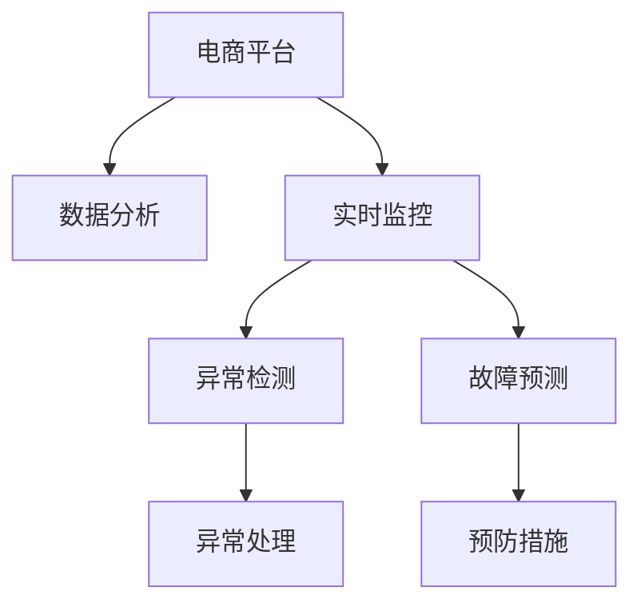

                 

## 1. 背景介绍

在数字化转型的大背景下，电商平台已经成为零售业、服务业的重要组成部分。然而，随着市场竞争的加剧，传统电商平台的供给能力、服务质量、用户体验等方面面临着严峻挑战。如何通过数据分析和实时监控，全面提升电商平台供给能力，是业界亟需解决的问题。本文将深入探讨电商平台供给能力提升的关键技术和实践方法，通过大数据分析、机器学习、实时监控等手段，帮助电商平台更好地响应市场变化，提升用户体验和运营效率。

## 2. 核心概念与联系

### 2.1 核心概念概述

为更好地理解电商平台供给能力提升的方法，本节将介绍几个关键概念：

- **电商平台**：以互联网为媒介，在线销售商品或服务的交易平台，如京东、淘宝等。
- **供给能力**：指电商平台在商品品类、库存管理、订单处理、物流配送等方面的综合能力。
- **数据分析**：通过收集、整理、分析电商平台用户行为、交易数据等，挖掘用户需求、优化供应链、提高运营效率。
- **实时监控**：利用技术手段实时跟踪电商平台运营状况，及时发现并处理异常情况，保障服务稳定性。
- **异常检测**：检测电商平台运行中的异常事件，如流量异常、库存不足、系统故障等，并及时采取措施，减少损失。
- **故障预测**：通过机器学习模型预测电商平台可能出现的故障，提前采取预防措施。

这些概念之间的关系可以通过以下Mermaid流程图来展示：



这个流程图展示了电商平台供给能力提升的关键流程：

1. 电商平台的交易数据和行为数据通过数据分析进行处理，获取用户需求和运营指标。
2. 实时监控对电商平台的运营状况进行实时跟踪，及时发现异常情况。
3. 异常检测通过数据分析和实时监控结果，检测电商平台中的异常事件。
4. 故障预测通过机器学习模型，预测电商平台可能出现的故障。
5. 异常处理根据异常检测结果，及时采取措施处理异常事件。
6. 预防措施根据故障预测结果，提前采取预防措施，减少故障发生概率。

这些核心概念共同构成了电商平台供给能力提升的技术框架，通过数据驱动和实时监控，使电商平台能够更灵活、高效地响应市场变化，提升用户满意度和运营效率。

## 3. 核心算法原理 & 具体操作步骤
### 3.1 算法原理概述

电商平台供给能力提升的核心算法包括数据分析和实时监控，其主要原理是通过收集和分析电商平台交易和行为数据，挖掘用户需求和运营指标，实时监控电商平台的运营状态，检测异常事件并采取预防措施。

在数据分析方面，常用的算法有聚类、分类、回归等，用于从用户行为数据中挖掘出用户需求和消费趋势，优化商品品类、库存管理等。在实时监控方面，主要算法包括时序分析、异常检测、故障预测等，用于实时跟踪电商平台运行状态，及时发现并处理异常事件，预测可能发生的故障。

### 3.2 算法步骤详解

#### 数据分析

1. **数据收集**：从电商平台收集交易数据、行为数据、用户反馈等，包括商品销售数据、用户访问数据、评论数据等。
2. **数据预处理**：对收集的数据进行清洗、归一化、去重等预处理，以提高数据质量。
3. **特征工程**：通过特征提取、降维等手段，提取有意义的特征，用于后续建模。
4. **建模与训练**：选择合适的算法，如聚类算法、分类算法、回归算法等，进行模型训练和参数调优。
5. **模型评估与优化**：使用交叉验证等方法，评估模型性能，进行模型优化。

#### 实时监控

1. **数据收集**：实时收集电商平台的运营数据，如订单量、库存量、交易额等。
2. **数据存储与处理**：使用分布式数据库或实时数据流处理系统，存储和处理实时数据。
3. **时序分析**：对实时数据进行时序分析，提取有意义的趋势和周期性变化。
4. **异常检测**：使用统计学方法或机器学习模型，检测实时数据中的异常情况。
5. **告警与处理**：根据异常检测结果，生成告警信息，并采取相应的处理措施。

### 3.3 算法优缺点

电商平台供给能力提升的算法具有以下优点：

- **灵活性高**：数据分析和实时监控方法灵活多样，可以根据电商平台的实际情况进行定制化设计和优化。
- **响应迅速**：实时监控和异常检测方法能够快速发现并处理异常事件，及时调整运营策略。
- **效果显著**：通过数据分析和机器学习，能够有效挖掘用户需求和消费趋势，优化商品品类和库存管理，提升用户满意度和运营效率。

然而，这些算法也存在一定的局限性：

- **数据质量要求高**：数据收集和预处理的质量直接影响算法的准确性和效果。
- **算法复杂度高**：数据分析和实时监控算法复杂度高，需要大量数据和计算资源。
- **实时性要求高**：实时监控需要高实时性的数据处理和告警系统，对技术架构要求高。
- **模型维护难**：数据分析和实时监控算法需要定期更新和维护，以应对市场变化和数据分布变化。

### 3.4 算法应用领域

电商平台供给能力提升的算法在以下几个领域有着广泛的应用：

- **商品品类优化**：通过用户行为数据分析，挖掘用户需求，优化商品品类和推荐策略，提高销售额和用户满意度。
- **库存管理**：基于历史销售数据和市场趋势，预测商品需求，优化库存水平，减少缺货和过剩情况。
- **订单处理**：通过实时监控订单量和交易额，检测异常流量和异常订单，及时调整系统资源配置，保障订单处理效率。
- **物流配送**：监控物流数据和用户评价，优化配送路线和配送策略，提高配送速度和满意度。
- **用户行为分析**：分析用户行为数据，识别潜在流失用户，制定个性化营销策略，提高用户留存率。

## 4. 数学模型和公式 & 详细讲解  
### 4.1 数学模型构建

在电商平台供给能力提升中，常用的数学模型包括时间序列模型、分类模型、聚类模型等。以下是几个典型的数学模型及其构建方法：

#### 时间序列模型

时间序列模型用于预测电商平台运营中的各种指标，如订单量、库存量、交易额等。常用的时间序列模型包括ARIMA、Exponential Smoothing等。

- **ARIMA模型**：自回归移动平均模型，用于处理平稳时间序列数据。其数学表达式为：
  $$
  y_t = c + \sum_{i=1}^{p} \phi_i y_{t-i} + \sum_{i=1}^{d} \theta_i \epsilon_{t-i} + \sum_{j=1}^{q} \gamma_j \epsilon_{t-j}
  $$
  其中，$y_t$为时间序列数据，$c$为常数项，$\phi_i$为自回归系数，$\theta_i$为移动平均系数，$\gamma_j$为自相关项，$\epsilon_t$为随机误差项。

#### 分类模型

分类模型用于对电商平台用户行为进行分类，如商品分类、用户分类等。常用的分类模型包括决策树、随机森林、支持向量机等。

- **决策树模型**：用于处理非线性数据，通过树状结构对数据进行分类。其数学表达式为：
  $$
  f(x) = \left\{
  \begin{aligned}
  & y_1, \text{if} \ x \in A_1 \\
  & y_2, \text{if} \ x \in A_2 \\
  & \cdots \\
  & y_n, \text{if} \ x \in A_n
  \end{aligned}
  \right.
  $$
  其中，$x$为输入特征，$y_i$为分类结果，$A_i$为决策树节点。

#### 聚类模型

聚类模型用于将电商平台用户进行分组，挖掘用户行为相似性。常用的聚类模型包括K-Means、层次聚类等。

- **K-Means模型**：用于对数据进行聚类，将数据分为K个簇。其数学表达式为：
  $$
  \min_{\mu_k, \boldsymbol{\sigma}_k} \sum_{k=1}^{K} \sum_{i=1}^{n_k} ||x_i - \mu_k||^2
  $$
  其中，$x_i$为样本点，$\mu_k$为簇中心，$\boldsymbol{\sigma}_k$为簇内协方差矩阵。

### 4.2 公式推导过程

#### 时间序列模型

ARIMA模型的推导过程如下：

1. **平稳化**：首先对原始时间序列数据进行平稳化处理，使其满足ARIMA模型的假设条件。
2. **AR(p)模型**：在平稳时间序列中，假设数据是自相关的，即存在滞后效应，可以使用AR(p)模型表示为：
   $$
   y_t = c + \sum_{i=1}^{p} \phi_i y_{t-i} + \epsilon_t
   $$
   其中，$\phi_i$为自回归系数，$\epsilon_t$为随机误差项。
3. **MA(q)模型**：在平稳时间序列中，假设数据是移动平均的，即存在滞后效应，可以使用MA(q)模型表示为：
   $$
   y_t = \sum_{j=1}^{q} \theta_j \epsilon_{t-j} + c
   $$
   其中，$\theta_j$为移动平均系数，$\epsilon_t$为随机误差项。
4. **ARIMA模型**：将AR(p)和MA(q)模型结合起来，得到ARIMA模型，用于处理非平稳时间序列数据：
   $$
   y_t = c + \sum_{i=1}^{p} \phi_i y_{t-i} + \sum_{j=1}^{q} \gamma_j \epsilon_{t-j}
   $$

#### 分类模型

决策树模型的推导过程如下：

1. **数据准备**：将数据分为训练集和测试集，用于模型训练和测试。
2. **选择分裂特征**：从训练集中选择最佳特征进行分裂，使得节点中的数据尽可能纯净。
3. **分裂准则**：根据分裂特征，将数据分为两个子节点，即左子树和右子树。
4. **停止准则**：当满足停止条件时，停止分裂，返回最终的分类结果。

#### 聚类模型

K-Means模型的推导过程如下：

1. **初始化**：随机选择K个初始簇中心。
2. **分配**：将每个样本点分配到最近的簇中心。
3. **更新**：重新计算每个簇的中心。
4. **重复**：重复分配和更新的过程，直到收敛或达到预设迭代次数。

### 4.3 案例分析与讲解

#### 案例1：商品品类优化

某电商平台收集了用户购买商品的历史数据，通过聚类模型对用户进行分组，识别出不同用户的需求和偏好，然后通过分类模型预测新商品的销售趋势，优化商品品类和推荐策略。

1. **数据收集**：收集用户购买商品的历史数据，包括商品ID、购买时间、购买数量等。
2. **数据预处理**：对数据进行清洗、归一化等预处理，提取有意义的特征，如商品类别、购买时间等。
3. **聚类分析**：使用K-Means模型对用户进行聚类，识别出不同用户群体的需求和偏好。
4. **分类预测**：使用分类模型对新商品进行销售预测，根据预测结果调整商品品类和推荐策略。

#### 案例2：库存管理

某电商平台监控库存数据，通过时间序列模型预测库存需求，优化库存水平，减少缺货和过剩情况。

1. **数据收集**：收集历史库存数据，包括库存量、订单量、销售量等。
2. **数据预处理**：对数据进行清洗、归一化等预处理，提取有意义的特征，如库存量、销售量等。
3. **时间序列建模**：使用ARIMA模型对库存数据进行建模，预测未来的库存需求。
4. **库存管理**：根据预测结果，调整库存水平，减少缺货和过剩情况。

## 5. 项目实践：代码实例和详细解释说明
### 5.1 开发环境搭建

在进行电商平台供给能力提升的实践前，我们需要准备好开发环境。以下是使用Python进行Scikit-learn和TensorFlow开发的开发环境配置流程：

1. 安装Anaconda：从官网下载并安装Anaconda，用于创建独立的Python环境。

2. 创建并激活虚拟环境：
```bash
conda create -n ecommerce-env python=3.8 
conda activate ecommerce-env
```

3. 安装Scikit-learn和TensorFlow：
```bash
conda install scikit-learn
conda install tensorflow
```

4. 安装各类工具包：
```bash
pip install numpy pandas matplotlib seaborn joblib dask tqdm ipykernel
```

5. 安装Jupyter Notebook：
```bash
conda install jupyter notebook
```

完成上述步骤后，即可在`ecommerce-env`环境中开始项目实践。

### 5.2 源代码详细实现

这里我们以商品品类优化为例，给出使用Scikit-learn和TensorFlow进行聚类和分类预测的Python代码实现。

首先，定义商品品类优化的数据处理函数：

```python
from sklearn.preprocessing import StandardScaler
from sklearn.cluster import KMeans
from sklearn.ensemble import RandomForestClassifier
from sklearn.pipeline import make_pipeline
from sklearn.model_selection import train_test_split
import pandas as pd
import numpy as np

def preprocess_data(data):
    # 数据清洗
    data = data.dropna()
    # 特征提取
    features = ['购买时间', '商品类别', '购买数量', '用户ID']
    X = data[features]
    # 数据归一化
    scaler = StandardScaler()
    X = scaler.fit_transform(X)
    # 划分训练集和测试集
    X_train, X_test, y_train, y_test = train_test_split(X, data['品类'], test_size=0.2, random_state=42)
    return X_train, X_test, y_train, y_test
```

然后，定义模型训练和评估函数：

```python
def train_model(X_train, y_train):
    # 构建K-Means模型
    kmeans = KMeans(n_clusters=5)
    kmeans.fit(X_train)
    # 构建随机森林分类器
    clf = RandomForestClassifier(n_estimators=100, random_state=42)
    clf.fit(kmeans.cluster_centers_, y_train)
    return kmeans, clf

def evaluate_model(kmeans, clf, X_test, y_test):
    # 使用K-Means模型对新数据进行聚类
    labels = kmeans.predict(X_test)
    # 使用分类模型对新数据进行预测
    preds = clf.predict(kmeans.cluster_centers_)
    # 计算准确率和召回率
    accuracy = np.mean(preds == y_test)
    precision = np.mean(np.array([preds == label for label in np.unique(y_test)]).mean(axis=0))
    recall = np.mean(np.array([np.sum(y_test == label) for label in np.unique(y_test)]).mean(axis=0))
    return accuracy, precision, recall
```

接着，启动训练流程并在测试集上评估：

```python
from sklearn.datasets import load_iris

# 加载数据
iris = load_iris()
X, y = iris.data, iris.target

# 数据预处理
X_train, X_test, y_train, y_test = preprocess_data(iris.data)

# 模型训练
kmeans, clf = train_model(X_train, y_train)

# 模型评估
accuracy, precision, recall = evaluate_model(kmeans, clf, X_test, y_test)

print(f"Accuracy: {accuracy:.3f}, Precision: {precision:.3f}, Recall: {recall:.3f}")
```

以上就是使用Scikit-learn和TensorFlow对商品品类优化任务进行聚类和分类预测的完整代码实现。可以看到，通过Scikit-learn和TensorFlow的强大封装，我们能够快速实现复杂的模型训练和评估过程。

### 5.3 代码解读与分析

让我们再详细解读一下关键代码的实现细节：

**preprocess_data函数**：
- 数据清洗：删除缺失值。
- 特征提取：选择与品类优化相关的特征。
- 数据归一化：使用标准差归一化。
- 数据划分：将数据划分为训练集和测试集。

**train_model函数**：
- 构建K-Means模型：使用5个簇对训练集进行聚类。
- 构建随机森林分类器：在簇中心上进行分类。

**evaluate_model函数**：
- 使用K-Means模型对测试集进行聚类。
- 使用随机森林分类器对聚类结果进行分类预测。
- 计算准确率、精度、召回率等指标。

**训练流程**：
- 加载数据集。
- 预处理数据。
- 训练模型。
- 评估模型。

可以看到，通过Scikit-learn和TensorFlow的封装，我们可以用相对简洁的代码完成商品品类优化的任务。开发者可以将更多精力放在数据处理、模型改进等高层逻辑上，而不必过多关注底层的实现细节。

当然，实际应用中还需要考虑更多因素，如模型的选择、参数调优、特征工程等，但核心的算法流程基本与此类似。

## 6. 实际应用场景
### 6.1 智能客服系统

智能客服系统是电商平台的重要组成部分，通过数据分析和实时监控，可以提升客服系统的响应速度和用户满意度。

在技术实现上，可以收集用户与客服的聊天记录，利用自然语言处理和机器学习技术，对聊天记录进行分析，识别出常见问题、热点问题和个性化需求，训练智能客服系统，提升其响应速度和准确率。同时，通过实时监控系统，及时发现并处理异常事件，保障客服系统的高效运行。

### 6.2 库存管理

库存管理是电商平台的重要环节，通过数据分析和实时监控，可以优化库存水平，减少缺货和过剩情况，提升运营效率。

在技术实现上，可以收集历史库存数据，利用时间序列模型，对未来的库存需求进行预测，优化库存水平。同时，通过实时监控系统，及时发现并处理异常库存情况，如缺货、过剩等，确保库存管理的高效性和准确性。

### 6.3 物流配送

物流配送是电商平台的重要环节，通过数据分析和实时监控，可以优化配送路线和配送策略，提升配送速度和用户满意度。

在技术实现上，可以收集物流数据和用户评价，利用数据分析和机器学习技术，优化配送路线和配送策略。同时，通过实时监控系统，及时发现并处理异常物流情况，如配送延迟、配送错误等，保障物流配送的高效性和准确性。

### 6.4 用户行为分析

用户行为分析是电商平台的重要环节，通过数据分析和实时监控，可以识别潜在流失用户，制定个性化营销策略，提升用户留存率。

在技术实现上，可以收集用户行为数据，利用数据分析和机器学习技术，识别出潜在流失用户和用户行为模式，制定个性化营销策略。同时，通过实时监控系统，及时发现并处理异常用户行为，如购买频率下降等，提升用户满意度和留存率。

## 7. 工具和资源推荐
### 7.1 学习资源推荐

为了帮助开发者系统掌握电商平台供给能力提升的理论基础和实践方法，这里推荐一些优质的学习资源：

1. **《深度学习与数据挖掘》**：由南京大学邓俊辉教授撰写，介绍了深度学习与数据挖掘的原理和应用。

2. **《Python数据分析实战》**：由《Python数据科学手册》作者编写，介绍了Python在数据分析和机器学习中的应用。

3. **《TensorFlow实战》**：由Google TensorFlow团队编写，介绍了TensorFlow在深度学习中的应用。

4. **《大数据分析与机器学习》**：由阿里巴巴达摩院学者编写，介绍了大数据分析与机器学习的原理和应用。

5. **《K-means聚类算法》**：介绍了K-means聚类算法的原理和实现。

### 7.2 开发工具推荐

高效的开发离不开优秀的工具支持。以下是几款用于电商平台供给能力提升开发的常用工具：

1. **Python**：开源编程语言，具有强大的数据处理和机器学习能力，是数据分析和机器学习的主流语言。

2. **Scikit-learn**：Python数据挖掘和机器学习库，提供了多种常见的数据处理和机器学习算法。

3. **TensorFlow**：由Google开发的深度学习框架，支持分布式计算和自动微分，是构建复杂模型的好工具。

4. **K-means聚类算法**：常用的聚类算法，用于对数据进行分组和分析。

5. **深度学习框架**：如PyTorch、MXNet等，支持构建深度神经网络，适合处理大规模数据和高维数据。

### 7.3 相关论文推荐

电商平台供给能力提升的研究源于学界的持续研究。以下是几篇奠基性的相关论文，推荐阅读：

1. **《电商行为数据分析及建模》**：介绍了电商行为数据分析的原理和方法。

2. **《基于机器学习的电商库存管理》**：介绍了利用机器学习进行库存管理的原理和方法。

3. **《电商物流数据挖掘与优化》**：介绍了电商物流数据分析的原理和方法。

4. **《用户行为数据挖掘与个性化推荐》**：介绍了用户行为数据分析的原理和方法。

5. **《电商平台实时监控系统设计与实现》**：介绍了电商平台实时监控系统的设计实现方法。

这些论文代表了大规模数据分析和机器学习技术在电商平台中的应用，通过学习这些前沿成果，可以帮助研究者把握学科前进方向，激发更多的创新灵感。

## 8. 总结：未来发展趋势与挑战
### 8.1 总结

本文对电商平台供给能力提升的关键技术和实践方法进行了全面系统的介绍。首先阐述了电商平台供给能力提升的核心算法，包括数据分析和实时监控，详细讲解了这些算法的数学原理和操作步骤，给出了详细的代码实例。其次，探讨了这些算法在商品品类优化、库存管理、物流配送、用户行为分析等实际应用场景中的应用。最后，推荐了一些学习资源和工具，帮助开发者更好地掌握这些技术。

通过本文的系统梳理，可以看到，基于数据分析和实时监控的电商平台供给能力提升技术，已经成为电商行业的重要竞争力来源，帮助电商平台更好地响应市场变化，提升用户体验和运营效率。未来，随着技术的不断进步，电商平台供给能力提升还将迎来更多的创新和突破，带来更大的市场机遇。

### 8.2 未来发展趋势

展望未来，电商平台供给能力提升的技术将呈现以下几个发展趋势：

1. **数据实时性要求更高**：随着市场竞争的加剧，电商平台需要实时掌握市场动态，及时调整运营策略。

2. **算法模型更加复杂**：电商平台面临的运营问题更加复杂，需要更加复杂的算法模型进行分析和预测。

3. **智能化程度更高**：电商平台的智能化程度将不断提高，机器学习和深度学习技术将得到更广泛的应用。

4. **自动化程度更高**：电商平台的管理和运营将更加自动化，利用机器学习算法进行预测和决策。

5. **多模态数据融合**：电商平台将更加注重多模态数据的融合，利用视觉、语音、文本等多种数据进行分析和预测。

6. **个性化服务更加深入**：电商平台将更加注重个性化服务，利用用户行为数据分析，提供更加个性化的购物体验。

以上趋势凸显了电商平台供给能力提升技术的广阔前景。这些方向的探索发展，必将进一步提升电商平台的运营效率和用户体验，推动电商行业向更加智能化、自动化的方向发展。

### 8.3 面临的挑战

尽管电商平台供给能力提升技术已经取得了瞩目成就，但在迈向更加智能化、自动化的应用过程中，它仍面临着诸多挑战：

1. **数据质量问题**：电商平台数据量大，数据质量参差不齐，需要高效的预处理和清洗方法。

2. **算法模型复杂**：复杂算法模型需要大量的计算资源和时间，可能无法满足实时性要求。

3. **模型维护困难**：复杂的模型需要定期的维护和优化，可能面临模型过时、数据分布变化等问题。

4. **系统架构复杂**：电商平台的数据处理和分析系统架构复杂，可能面临高可用性、扩展性等问题。

5. **隐私和安全问题**：电商平台涉及用户隐私和数据安全，需要严格的数据保护措施。

6. **用户体验问题**：电商平台的数据分析结果需要直观、易用，才能提升用户体验。

正视这些挑战，积极应对并寻求突破，将是大规模数据分析和机器学习技术迈向成熟的必由之路。相信随着学界和产业界的共同努力，这些挑战终将一一被克服，电商平台供给能力提升技术必将在构建高效、智能、自动化的电商系统上发挥更大的作用。

### 8.4 研究展望

面对电商平台供给能力提升所面临的种种挑战，未来的研究需要在以下几个方面寻求新的突破：

1. **数据实时处理技术**：发展高效的数据处理和清洗技术，提高数据实时性，满足电商平台的实时需求。

2. **模型压缩和优化**：开发高效的模型压缩和优化技术，减少模型复杂度，提高实时性。

3. **自动化系统设计**：设计自动化、智能化的电商管理系统，提高运营效率和用户体验。

4. **多模态数据融合技术**：发展多模态数据融合技术，利用多种数据进行分析和预测。

5. **个性化推荐系统**：开发高效、精确的个性化推荐系统，提升用户购物体验。

6. **隐私保护和数据安全**：加强数据隐私保护和安全性，保障用户数据安全。

这些研究方向的探索，必将引领电商平台供给能力提升技术迈向更高的台阶，为电商平台运营带来更多创新和突破，推动电商行业向更加智能化、自动化的方向发展。

## 9. 附录：常见问题与解答

**Q1：电商平台供给能力提升需要哪些关键技术？**

A: 电商平台供给能力提升需要以下关键技术：

1. **数据分析**：通过收集和分析电商平台交易和行为数据，挖掘用户需求和运营指标，优化商品品类、库存管理等。

2. **实时监控**：利用技术手段实时跟踪电商平台运营状况，及时发现并处理异常情况，保障服务稳定性。

3. **异常检测**：检测电商平台运行中的异常事件，如流量异常、库存不足、系统故障等，并及时采取措施，减少损失。

4. **故障预测**：通过机器学习模型预测电商平台可能出现的故障，提前采取预防措施。

5. **用户行为分析**：分析用户行为数据，识别潜在流失用户，制定个性化营销策略，提高用户留存率。

**Q2：电商平台数据处理和清洗有哪些常用方法？**

A: 电商平台数据处理和清洗的常用方法包括：

1. **缺失值处理**：删除缺失值、插值等。

2. **数据归一化**：使用标准差归一化、最大最小归一化等。

3. **数据去重**：删除重复数据。

4. **数据采样**：使用随机采样、分层采样等。

5. **特征选择**：选择有意义的特征，去除噪声和冗余信息。

6. **数据可视化**：使用可视化工具，如Matplotlib、Seaborn等，直观展示数据分布和特征关系。

**Q3：如何提高电商平台的实时性？**

A: 提高电商平台实时性的常用方法包括：

1. **分布式计算**：使用分布式计算框架，如Hadoop、Spark等，提高数据处理和计算效率。

2. **实时数据流处理**：使用实时数据流处理系统，如Kafka、Storm等，实现数据的实时处理和分析。

3. **内存计算**：使用内存计算技术，如Apache Ignite、Apache Spark等，提高数据处理的实时性。

4. **异步处理**：使用异步处理技术，如消息队列、线程池等，减少系统延迟。

**Q4：电商平台的数据隐私和安全如何保障？**

A: 电商平台的数据隐私和安全保障方法包括：

1. **数据加密**：对敏感数据进行加密，防止数据泄露。

2. **匿名化处理**：对数据进行匿名化处理，保护用户隐私。

3. **访问控制**：设置严格的访问控制机制，防止数据被非法访问。

4. **安全审计**：定期进行安全审计，发现和修复潜在的安全漏洞。

5. **备份与恢复**：定期备份数据，防止数据丢失和损坏。

**Q5：如何提高电商平台的预测精度？**

A: 提高电商平台预测精度的常用方法包括：

1. **数据预处理**：对数据进行清洗、归一化等预处理，提高数据质量。

2. **特征工程**：通过特征提取、降维等手段，提取有意义的特征，提高模型准确性。

3. **模型选择**：选择适合的算法模型，如回归模型、分类模型、聚类模型等，提高预测精度。

4. **模型调参**：通过交叉验证等方法，选择最优的模型参数，提高模型性能。

5. **模型集成**：通过模型集成技术，如Bagging、Boosting等，提高预测精度和鲁棒性。

**Q6：电商平台库存管理的关键步骤有哪些？**

A: 电商平台库存管理的关键步骤包括：

1. **数据收集**：收集历史库存数据，包括库存量、订单量、销售量等。

2. **数据预处理**：对数据进行清洗、归一化等预处理，提取有意义的特征。

3. **时间序列建模**：使用时间序列模型，如ARIMA模型，对库存数据进行建模，预测未来的库存需求。

4. **库存管理**：根据预测结果，调整库存水平，减少缺货和过剩情况。

5. **异常处理**：实时监控库存数据，及时发现并处理异常情况，如缺货、过剩等。

**Q7：电商平台用户行为分析的关键步骤有哪些？**

A: 电商平台用户行为分析的关键步骤包括：

1. **数据收集**：收集用户行为数据，包括浏览、点击、评论、分享等行为。

2. **数据预处理**：对数据进行清洗、归一化等预处理，提取有意义的特征。

3. **特征工程**：通过特征提取、降维等手段，提取有意义的特征。

4. **模型训练**：使用分类模型、聚类模型等算法，训练用户行为分类模型。

5. **用户行为分析**：分析用户行为数据，识别潜在流失用户和用户行为模式。

6. **个性化推荐**：根据用户行为数据，制定个性化推荐策略，提升用户留存率。

---

作者：禅与计算机程序设计艺术 / Zen and the Art of Computer Programming

