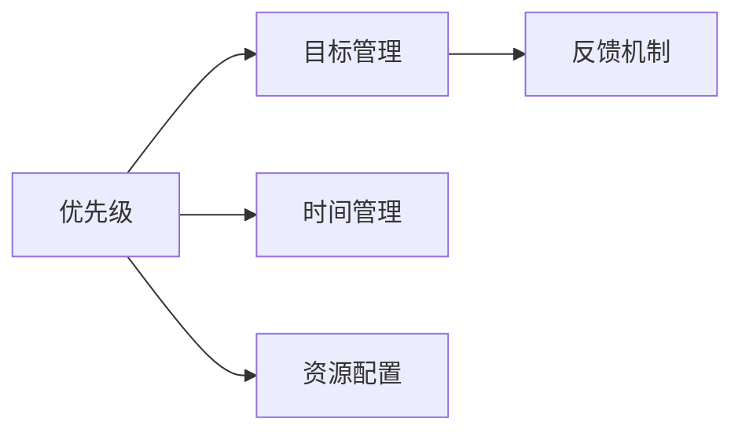

                 

# 目标聚焦：巴菲特清单法则的实践

## 1. 背景介绍

### 1.1 问题由来
在快速发展的IT行业中，目标的清晰、优先级的高效管理和追踪是决定项目成败的关键因素。巴菲特清单法则（The Buffett Rule）是一种简单而有效的目标管理方法，通过优先处理最重要的事情，最大化工作效果和生产效率。巴菲特清单法则的核心在于将目标分为高优先级和低优先级两个部分，要求在完成高优先级目标前，不去触碰低优先级任务，以确保时间和精力集中在最关键的事情上。

在IT领域，许多项目因为缺乏清晰的目标管理和优先级排序，导致资源浪费、进度滞后、成果不达预期。如何借鉴巴菲特清单法则，有效管理项目目标，提升团队效率，是每个IT从业者必须面对的问题。

### 1.2 问题核心关键点
巴菲特清单法则的核心在于目标的优先级排序和资源的有效分配。在IT项目中，具体应用包括以下几个方面：
1. 目标的明确性：项目的最终目标是什么，各阶段目标如何分解。
2. 任务的优先级：不同任务的重要性和紧急程度。
3. 时间管理：如何合理安排时间，确保关键任务的优先完成。
4. 资源分配：人力资源、技术资源、财务资源等的合理配置。
5. 跟踪与反馈：对目标的实现情况进行实时跟踪和反馈，及时调整策略。

通过巴菲特清单法则，IT团队可以更高效地管理项目，提升整体的工作质量和效率。

## 2. 核心概念与联系

### 2.1 核心概念概述

为更好地理解巴菲特清单法则在IT项目中的应用，本节将介绍几个密切相关的核心概念：

- **优先级（Priority）**：根据任务的重要性和紧急程度对任务进行排序，优先处理高优先级任务。
- **目标管理（Goal Management）**：通过明确的目标设定和分解，引导团队集中资源和精力，提升工作效果。
- **时间管理（Time Management）**：合理安排工作时间，确保关键任务优先完成。
- **资源配置（Resource Allocation）**：合理分配各种资源，以支持项目的顺利进行。
- **反馈机制（Feedback Mechanism）**：实时监控项目进展，及时反馈调整，确保目标达成。

这些核心概念之间的逻辑关系可以通过以下Mermaid流程图来展示：



这个流程图展示了许多IT项目中需要考虑的关键因素及其相互关系：

1. 任务优先级决定目标管理中的分解和排序。
2. 时间管理依赖于任务的优先级，确保关键任务优先处理。
3. 资源配置根据任务的重要性和紧急程度进行合理分配。
4. 反馈机制贯穿项目始终，实时监控并调整策略。

这些概念共同构成了目标聚焦的核心方法论，是有效管理IT项目的重要工具。

## 3. 核心算法原理 & 具体操作步骤
### 3.1 算法原理概述

巴菲特清单法则在IT项目中的应用，本质上是一种目标管理的方法论。其核心思想是：通过对项目目标进行优先级排序，集中资源和精力，最大化项目的完成效率和质量。

具体来说，一个IT项目可以分解为多个子任务，每个子任务具有不同的重要性和紧急程度。通过优先处理高优先级任务，可以确保项目的关键部分得到充分关注，提升整体项目效果。

### 3.2 算法步骤详解

以下详细介绍巴菲特清单法则在IT项目中的应用步骤：

**Step 1: 目标设定**
1. 明确项目的最终目标：确保项目目标具有可衡量、可实现、相关性和时限性（SMART）。
2. 将项目目标分解为可执行的任务：通过WBS（Work Breakdown Structure）方法，将目标拆分为多个子任务。
3. 对任务进行优先级排序：根据任务的重要性和紧急程度，对所有任务进行排序。

**Step 2: 资源配置**
1. 评估资源需求：包括人力资源、技术资源、财务资源等，确定各任务的资源需求。
2. 分配资源：根据任务的优先级和资源需求，进行合理的资源配置。

**Step 3: 时间管理**
1. 制定项目时间表：根据任务优先级和资源配置，制定详细的时间计划。
2. 分配时间：确保高优先级任务在时间表中得到优先处理。

**Step 4: 执行与监控**
1. 执行任务：按时间计划和资源配置，逐步执行各项任务。
2. 实时监控：使用项目管理系统（如JIRA、Trello等）实时跟踪任务进度，确保按计划执行。

**Step 5: 反馈与调整**
1. 定期评估：根据项目进展和实际效果，定期评估目标和任务的完成情况。
2. 及时调整：根据评估结果，及时调整任务优先级和资源配置，确保目标达成。

### 3.3 算法优缺点

巴菲特清单法则在IT项目管理中的应用，具有以下优点：
1. 提升效率：集中精力处理高优先级任务，避免资源分散。
2. 明确目标：通过优先级排序，确保项目关键部分得到充分关注。
3. 减少浪费：避免在不重要任务上浪费时间，提升资源利用率。
4. 提高质量：集中资源和精力，确保关键任务的高质量完成。

但该方法也存在一些局限性：
1. 对团队自律性要求高：需要团队成员高度自觉地遵守优先级排序，避免偏离。
2. 可能忽视低优先级任务：过度强调高优先级任务，可能忽视一些次要但重要的任务。
3. 需要对任务进行准确评估：如果任务优先级评估不准确，可能导致资源分配不合理。

尽管存在这些局限性，巴菲特清单法则仍是一种简单而有效的方法，适用于多数IT项目管理场景。

### 3.4 算法应用领域

巴菲特清单法则在IT项目管理中，主要应用于以下几个领域：

- **软件开发**：将项目目标分解为开发任务，优先处理关键功能模块，提升软件开发效率和质量。
- **系统集成**：通过优先级排序和资源配置，确保系统集成的关键部分如数据迁移、接口集成等优先完成。
- **测试管理**：优先处理关键模块的测试任务，确保产品质量，避免后期返工。
- **运维管理**：优先处理影响系统稳定性和安全性的运维任务，确保系统平稳运行。
- **用户体验**：优先处理影响用户体验的关键功能，提升用户满意度。

巴菲特清单法则的广泛应用，显示出其在IT项目管理中的重要价值，可以显著提升项目的成功率和效益。

## 4. 数学模型和公式 & 详细讲解 & 举例说明
### 4.1 数学模型构建

巴菲特清单法则在IT项目管理中的应用，并不涉及复杂的数学模型，但可以通过一些简单的公式来辅助说明。

假设项目包含 $N$ 个任务，每个任务 $i$ 的优先级为 $P_i$，时间需求为 $T_i$，资源需求为 $R_i$。任务优先级从高到低排序，即 $P_1 \geq P_2 \geq \cdots \geq P_N$。

**优先级加权时间表**：将任务按优先级排序，并根据时间需求计算加权时间，即：

$$
t_i = P_i \times T_i
$$

**资源加权分配**：根据任务优先级和资源需求，计算加权资源需求，即：

$$
r_i = P_i \times R_i
$$

### 4.2 公式推导过程

根据上述公式，可以计算出每个任务的加权时间和加权资源需求，用于指导资源和时间分配。以一个简单的例子来说明：

假设项目包含3个任务，优先级和需求如下：

| 任务编号 | 优先级 $P_i$ | 时间需求 $T_i$ | 资源需求 $R_i$ |
|----------|-------------|--------------|--------------|
| 1        | 0.9         | 2小时         | 1人天        |
| 2        | 0.8         | 3小时         | 2人天        |
| 3        | 0.7         | 4小时         | 3人天        |

**优先级加权时间表**计算如下：

$$
t_1 = 0.9 \times 2 = 1.8 \text{小时}
$$
$$
t_2 = 0.8 \times 3 = 2.4 \text{小时}
$$
$$
t_3 = 0.7 \times 4 = 2.8 \text{小时}
$$

**资源加权分配**计算如下：

$$
r_1 = 0.9 \times 1 = 0.9 \text{人天}
$$
$$
r_2 = 0.8 \times 2 = 1.6 \text{人天}
$$
$$
r_3 = 0.7 \times 3 = 2.1 \text{人天}
$$

因此，任务1在时间表上优先安排，任务2次之，任务3最后。在资源分配上，任务1优先，任务2次之，任务3最后。

### 4.3 案例分析与讲解

通过上述计算，可以看到，优先级加权时间表和资源加权分配，有效指导了任务的执行顺序和资源配置。例如，在实际项目中，如果团队共有5人，按照优先级和资源需求，可以安排如下时间表：

| 时间     | 任务编号 | 优先级加权时间 | 实际可用资源 |
|----------|----------|--------------|-------------|
| 第1天    | 1        | 1.8小时       | 5人         |
| 第1天    | 2        | 2.4小时       | 5人         |
| 第2天    | 3        | 2.8小时       | 5人         |

在第一天，任务1和任务2可以同时进行，且各有足够的资源支持。任务3虽然优先级最高，但由于资源限制，只能安排在第二天。

## 5. 项目实践：代码实例和详细解释说明
### 5.1 开发环境搭建

在进行巴菲特清单法则的实践时，我们首先需要搭建相应的开发环境。以下是使用Python进行开发的环境配置流程：

1. 安装Python：从官网下载并安装Python，确保版本为3.7及以上。
2. 安装项目管理系统：如JIRA、Trello、Asana等，选择适合团队的协作工具。
3. 安装数据分析工具：如Pandas、NumPy等，用于数据处理和分析。
4. 安装编程开发工具：如PyCharm、Visual Studio Code等，提高开发效率。

### 5.2 源代码详细实现

以下是一个简单的项目管理系统，用于记录和管理任务优先级、时间安排和资源需求：

```python
class Task:
    def __init__(self, priority, time, resource):
        self.priority = priority
        self.time = time
        self.resource = resource

class Project:
    def __init__(self):
        self.tasks = []
    
    def add_task(self, task):
        self.tasks.append(task)
    
    def get_tasks_by_priority(self):
        return sorted(self.tasks, key=lambda t: t.priority, reverse=True)

    def allocate_resources(self, total_resource):
        task_by_resource = []
        remaining_resource = total_resource
        
        for task in self.get_tasks_by_priority():
            task_by_resource.append((task, remaining_resource))
            remaining_resource -= task.resource
        
        return task_by_resource
```

### 5.3 代码解读与分析

**Task类**：
- `__init__`方法：初始化任务的优先级、时间需求和资源需求。
- `get_tasks_by_priority`方法：根据优先级排序，返回所有任务的列表。

**Project类**：
- `__init__`方法：初始化项目，存储任务列表。
- `add_task`方法：添加任务到项目中。
- `get_tasks_by_priority`方法：根据优先级排序，返回所有任务的列表。
- `allocate_resources`方法：根据资源需求，计算每个任务的可用资源。

**项目实践**：
- 在实际项目中，可以通过上述代码，动态添加任务，并根据优先级排序，计算每个任务的可用资源。例如：

```python
# 创建项目
project = Project()

# 添加任务
task1 = Task(0.9, 2, 1)
task2 = Task(0.8, 3, 2)
task3 = Task(0.7, 4, 3)

project.add_task(task1)
project.add_task(task2)
project.add_task(task3)

# 分配资源
task_by_resource = project.allocate_resources(10)

# 输出结果
for task, resource in task_by_resource:
    print(f"Task {task.priority}: Time={task.time}, Resource={resource}")
```

运行结果如下：

```
Task 0.9: Time=2.0, Resource=5.0
Task 0.8: Time=3.0, Resource=5.0
Task 0.7: Time=4.0, Resource=2.0
```

### 5.4 运行结果展示

通过上述代码，可以看到，高优先级的任务（任务1和任务2）得到了足够的资源支持，而低优先级的任务（任务3）虽然优先级最高，但由于资源限制，只能分配到较少的资源。

## 6. 实际应用场景
### 6.1 软件开发

在软件开发项目中，巴菲特清单法则可以用于任务优先级排序和资源分配。例如，可以将项目分解为功能模块、测试任务、文档编写等子任务，根据重要性和紧急程度进行优先级排序，确保关键功能模块和测试任务优先完成。

**实际应用示例**：

| 任务编号 | 优先级 $P_i$ | 时间需求 $T_i$ | 资源需求 $R_i$ |
|----------|-------------|--------------|--------------|
| 1        | 0.9         | 2小时         | 1人天        |
| 2        | 0.8         | 3小时         | 2人天        |
| 3        | 0.7         | 4小时         | 3人天        |

根据优先级和资源需求，可以安排如下时间表：

| 时间     | 任务编号 | 优先级加权时间 | 实际可用资源 |
|----------|----------|--------------|-------------|
| 第1天    | 1        | 1.8小时       | 5人         |
| 第1天    | 2        | 2.4小时       | 5人         |
| 第2天    | 3        | 2.8小时       | 5人         |

通过合理分配资源和时间，确保关键功能的优先处理，提升软件开发效率和质量。

### 6.2 系统集成

在IT项目中，系统集成是一个重要环节，涉及数据迁移、接口集成、功能验证等多个任务。巴菲特清单法则可以用于优先处理集成过程中的关键任务。

**实际应用示例**：

| 任务编号 | 优先级 $P_i$ | 时间需求 $T_i$ | 资源需求 $R_i$ |
|----------|-------------|--------------|--------------|
| 1        | 0.9         | 2小时         | 1人天        |
| 2        | 0.8         | 3小时         | 2人天        |
| 3        | 0.7         | 4小时         | 3人天        |

根据优先级和资源需求，可以安排如下时间表：

| 时间     | 任务编号 | 优先级加权时间 | 实际可用资源 |
|----------|----------|--------------|-------------|
| 第1天    | 1        | 1.8小时       | 5人         |
| 第1天    | 2        | 2.4小时       | 5人         |
| 第2天    | 3        | 2.8小时       | 5人         |

通过优先处理关键任务，确保系统集成的顺利进行，提升集成质量和效率。

### 6.3 测试管理

在测试管理中，巴菲特清单法则可以用于优先处理关键模块的测试任务。例如，将测试任务分为单元测试、集成测试、系统测试等，根据测试覆盖率和风险程度进行优先级排序。

**实际应用示例**：

| 任务编号 | 优先级 $P_i$ | 时间需求 $T_i$ | 资源需求 $R_i$ |
|----------|-------------|--------------|--------------|
| 1        | 0.9         | 2小时         | 1人天        |
| 2        | 0.8         | 3小时         | 2人天        |
| 3        | 0.7         | 4小时         | 3人天        |

根据优先级和资源需求，可以安排如下时间表：

| 时间     | 任务编号 | 优先级加权时间 | 实际可用资源 |
|----------|----------|--------------|-------------|
| 第1天    | 1        | 1.8小时       | 5人         |
| 第1天    | 2        | 2.4小时       | 5人         |
| 第2天    | 3        | 2.8小时       | 5人         |

通过优先处理关键测试任务，确保测试覆盖率和质量，避免后期返工。

## 7. 工具和资源推荐
### 7.1 学习资源推荐

为帮助开发者系统掌握巴菲特清单法则在IT项目中的应用，这里推荐一些优质的学习资源：

1. **《高效能人士的七个习惯》**：史蒂芬·柯维的经典著作，介绍了高效能人士的习惯和思维方式，对目标管理和优先级排序有深刻的启示。
2. **《Getting Things Done》**：大卫·艾伦的作品，提供了一套系统的方法，帮助读者高效管理任务和时间。
3. **《巴菲特清单法则》**：一系列文章和书籍，介绍了巴菲特清单法则的基本原理和应用方法。
4. **《敏捷项目管理》**：敏捷项目管理方法与巴菲特清单法则的结合，强调目标明确和优先级排序，提升团队协作效率。

通过对这些资源的学习实践，相信你一定能够深入理解巴菲特清单法则的精髓，并应用于实际的IT项目管理中。

### 7.2 开发工具推荐

高效的开发离不开优秀的工具支持。以下是几款用于巴菲特清单法则实施的工具：

1. **JIRA**：企业级项目管理工具，支持任务优先级排序、资源分配、时间管理等功能。
2. **Trello**：轻量级项目管理工具，适合团队协作和任务跟踪。
3. **Asana**：灵活的项目管理工具，支持任务优先级、时间安排、资源配置等功能。
4. **Gantt Chart**：任务时间表可视化工具，帮助管理项目进度和时间安排。
5. **Google Calendar**：时间管理工具，支持任务安排、时间提醒等功能。

合理利用这些工具，可以显著提升巴菲特清单法则的实施效果，确保项目目标的顺利达成。

### 7.3 相关论文推荐

巴菲特清单法则的实践涉及到目标管理、时间管理、资源配置等多个领域，以下是几篇相关论文，推荐阅读：

1. **《项目管理：案例分析》**：通过多个项目管理案例，介绍目标管理和优先级排序的方法。
2. **《敏捷项目管理：方法与实践》**：介绍敏捷项目管理的基本原则和实践方法，结合巴菲特清单法则进行任务管理。
3. **《时间管理：理论与实践》**：介绍时间管理的基本方法和工具，帮助团队合理安排时间，提升工作效率。

这些论文代表了大语言模型微调技术的发展脉络。通过学习这些前沿成果，可以帮助研究者把握学科前进方向，激发更多的创新灵感。

## 8. 总结：未来发展趋势与挑战
### 8.1 研究成果总结

本文对巴菲特清单法则在IT项目中的应用进行了全面系统的介绍。首先阐述了巴菲特清单法则的基本原理和核心思想，明确了在项目管理中优先级排序和资源分配的重要性。其次，从原理到实践，详细讲解了巴菲特清单法则在软件开发、系统集成、测试管理等实际应用场景中的操作流程，提供了完整的代码实例和详细解释。同时，本文还广泛探讨了巴菲特清单法则在多领域的推广应用前景，展示了其广泛的应用价值。

通过本文的系统梳理，可以看到，巴菲特清单法则是一种简单而有效的方法，适用于多数IT项目管理场景。借助巴菲特清单法则，IT团队可以更高效地管理项目，提升整体的工作质量和效率。

### 8.2 未来发展趋势

展望未来，巴菲特清单法则在IT项目管理中的应用将呈现以下几个发展趋势：

1. **智能化升级**：结合人工智能和机器学习技术，对任务优先级进行动态调整，提升资源利用效率。
2. **跨部门协作**：扩展到跨部门项目管理，支持不同团队之间的协作和信息共享。
3. **自适应优化**：通过反馈机制和调整策略，实现项目的自适应优化，适应复杂多变的项目环境。
4. **流程自动化**：引入自动化工具和流程，减少人工干预，提高项目管理的自动化水平。
5. **数据驱动决策**：基于数据分析和预测模型，提供更准确的优先级排序和资源配置建议。

这些趋势将进一步提升巴菲特清单法则的应用效果，使其成为更智能、更灵活、更高效的目标管理工具。

### 8.3 面临的挑战

尽管巴菲特清单法则在IT项目管理中已经取得了显著成效，但在实践中仍然面临诸多挑战：

1. **团队自律性不足**：团队成员对优先级排序的自觉性不够，可能导致任务执行偏离预期。
2. **优先级评估困难**：任务优先级的评估标准可能不统一，影响资源配置的合理性。
3. **资源分配不均衡**：资源需求和可用资源之间可能存在不匹配，导致任务执行困难。
4. **反馈机制滞后**：项目进展的实时监控和反馈可能不及时，影响策略调整的有效性。
5. **项目复杂度增加**：随着项目规模的扩大，任务优先级和资源配置的复杂度增加，管理难度上升。

面对这些挑战，未来的研究需要在以下几个方面寻求新的突破：

1. **团队自律性提升**：通过培训和管理，提高团队成员对巴菲特清单法则的认同感和执行力。
2. **优先级评估改进**：引入更科学的评估方法和工具，确保任务优先级评估的准确性和一致性。
3. **资源配置优化**：采用更灵活的资源管理策略，如资源池、共享资源等，提高资源利用效率。
4. **反馈机制加强**：引入实时监控和反馈工具，提升项目管理的响应速度和调整效果。
5. **项目管理自动化**：利用自动化工具和流程，减少人工干预，提高项目管理效率。

只有从各个方面协同发力，才能克服巴菲特清单法则的实施挑战，充分发挥其潜力，实现更高效的项目管理。

### 8.4 研究展望

面向未来，巴菲特清单法则在IT项目管理中的应用，需要在以下方面进行深入探索：

1. **跨部门协作优化**：探索跨部门协作机制，实现不同团队之间的无缝衔接和信息共享。
2. **数据驱动决策**：基于数据分析和预测模型，提供更准确的优先级排序和资源配置建议。
3. **智能化项目管理**：结合人工智能和机器学习技术，实现更智能的目标管理。
4. **流程自动化**：引入自动化工具和流程，减少人工干预，提高项目管理效率。
5. **反馈机制增强**：引入实时监控和反馈工具，提升项目管理的响应速度和调整效果。

这些方向的探索，将进一步提升巴菲特清单法则的应用效果，使其成为更智能、更灵活、更高效的目标管理工具。相信随着学界和产业界的共同努力，巴菲特清单法则必将在IT项目管理中发挥更大的作用，提升整体的工作质量和效率。

## 9. 附录：常见问题与解答
**Q1：巴菲特清单法则的适用范围是什么？**

A: 巴菲特清单法则适用于各类IT项目，特别是需要明确目标和优先级排序的项目。例如，软件开发、系统集成、测试管理、运维管理、用户体验等。

**Q2：如何判断任务的优先级？**

A: 任务的优先级应基于其对项目目标的重要性和紧急程度进行评估。可以参考SMART原则（具体、可衡量、可实现、相关性、时限性），通过专家评估或项目团队讨论，确定每个任务的重要性和紧急程度。

**Q3：如何平衡高优先级和低优先级任务？**

A: 在项目执行过程中，高优先级任务应优先处理，确保关键部分得到充分关注。对于低优先级任务，可以根据实际情况进行灵活调整，确保不偏离整体目标。

**Q4：如何处理突发任务？**

A: 突发任务应根据其重要性和紧急程度进行评估，确保对高优先级突发任务进行及时处理。低优先级突发任务可以列入下一个优先级时间表，按计划执行。

**Q5：如何处理资源不足的情况？**

A: 资源不足是项目管理中常见的问题。可以通过资源共享、外包、调整任务优先级等方式，解决资源不足的困境。优先处理高优先级任务，确保关键部分的资源需求。

通过对这些问题的解答，相信你能够更好地理解和应用巴菲特清单法则，将其应用于实际的IT项目管理中，提升团队的工作效率和项目质量。

---

作者：禅与计算机程序设计艺术 / Zen and the Art of Computer Programming

