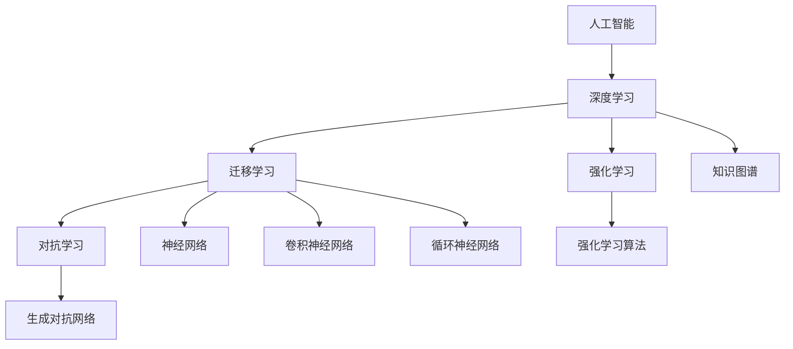

                 

# 真正的智慧，源自对事物本质的深刻理解认知与洞察

## 1. 背景介绍

在信息技术飞速发展的今天，人工智能(AI)技术已经成为我们生活、工作和科研中不可或缺的一部分。然而，人工智能不仅仅是算法、数据和计算的堆砌，更是一种理解、认知与洞察智慧的体现。本文将深入探讨AI的哲学内涵，揭示其深层次的本质与价值，为读者提供一个全面、深刻的视角。

## 2. 核心概念与联系

### 2.1 核心概念概述

1. **人工智能**：通过计算机模拟人类智能活动的技术体系。
2. **深度学习**：基于神经网络结构的机器学习方法，特别擅长处理大规模非结构化数据。
3. **迁移学习**：从已有的知识中迁移学习新知识，提高模型在特定任务上的性能。
4. **强化学习**：通过与环境互动，优化策略以获得最大化奖励的机器学习技术。
5. **对抗学习**：通过生成对抗网络等技术，提升模型对异常情况的鲁棒性。
6. **知识图谱**：通过构建图结构化知识，为AI提供知识推理的基础。

这些核心概念构成了AI的基础框架，并彼此交织、相互促进。

### 2.2 核心概念原理和架构的 Mermaid 流程图



## 3. 核心算法原理 & 具体操作步骤

### 3.1 算法原理概述

人工智能的核心在于理解和模拟人类的智能行为。深度学习、迁移学习、强化学习等技术手段，都是为了在数据和算法层面实现这种模拟。其原理主要体现在以下几个方面：

1. **深度学习**：通过多层神经网络结构，模型可以自动学习输入数据的内在表示，从而完成分类、回归、生成等任务。
2. **迁移学习**：通过在大规模数据集上预训练，模型可以迁移到特定任务上，提高学习效率和泛化能力。
3. **强化学习**：通过与环境互动，模型通过奖励机制优化策略，实现自动控制、游戏、推荐等复杂任务。
4. **对抗学习**：通过生成对抗网络等方法，模型可以学习对抗攻击，提升鲁棒性和安全性。
5. **知识图谱**：通过构建图结构化的知识库，模型可以进行知识推理和复杂关系理解。

### 3.2 算法步骤详解

**深度学习**：
1. 数据预处理：对输入数据进行清洗、归一化、分片等处理。
2. 构建网络结构：设计多层神经网络，选择适当的激活函数、损失函数和优化器。
3. 训练模型：通过前向传播和反向传播，不断更新网络参数以最小化损失函数。
4. 评估模型：在测试集上评估模型性能，调整超参数以优化模型。

**迁移学习**：
1. 预训练：在大规模数据集上训练模型，学习通用知识。
2. 微调：在特定任务上微调模型，调整顶层参数以适应新任务。
3. 评估与迭代：在测试集上评估微调后的模型，继续优化超参数和网络结构。

**强化学习**：
1. 定义状态、动作和奖励：明确环境中的状态和动作空间，设计奖励机制。
2. 策略设计：选择适当的策略学习算法，如Q-learning、SARSA、深度Q网络等。
3. 训练模型：在环境中与智能体互动，不断优化策略以最大化累积奖励。
4. 测试与部署：在测试环境中评估模型性能，部署到实际应用中。

**对抗学习**：
1. 构建生成器和判别器：定义生成器和判别器的网络结构。
2. 训练模型：交替进行生成器和判别器的训练，提升生成器生成对抗样本的能力。
3. 对抗测试：在测试样本上评估生成器的效果，进一步优化模型。

**知识图谱**：
1. 数据采集：从各种来源采集知识数据，构建初始知识图谱。
2. 图结构化处理：对数据进行图结构化处理，消除冗余和噪声。
3. 知识推理：构建知识推理引擎，进行事实验证和逻辑推理。
4. 知识更新与扩展：不断更新和扩展知识库，提升知识的完备性和准确性。

### 3.3 算法优缺点

**深度学习**：
- **优点**：处理大规模非结构化数据能力强，学习能力优秀。
- **缺点**：模型复杂度高，需要大量数据和计算资源。

**迁移学习**：
- **优点**：学习效率高，泛化能力强。
- **缺点**：对任务和数据分布要求高，过拟合风险大。

**强化学习**：
- **优点**：可处理复杂多变环境，决策能力强。
- **缺点**：训练时间长，策略不稳定。

**对抗学习**：
- **优点**：提升模型鲁棒性，对抗攻击效果显著。
- **缺点**：模型结构复杂，训练难度大。

**知识图谱**：
- **优点**：提供结构化知识，支持复杂推理。
- **缺点**：构建和维护复杂，数据稀疏性高。

## 4. 数学模型和公式 & 详细讲解

### 4.1 数学模型构建

以深度学习中的卷积神经网络(CNN)为例，其数学模型可以表示为：

$$
y = \sum_{i=1}^n w_i x_i + b
$$

其中 $x_i$ 为输入样本，$w_i$ 为权重，$b$ 为偏置，$y$ 为输出。

### 4.2 公式推导过程

以深度学习中的反向传播算法为例，其推导过程如下：

1. 定义损失函数：
$$
L = \frac{1}{n} \sum_{i=1}^n (y_i - \hat{y}_i)^2
$$

2. 计算梯度：
$$
\frac{\partial L}{\partial w} = \frac{\partial L}{\partial y} \cdot \frac{\partial y}{\partial w} = 2\frac{1}{n}(y - \hat{y})x
$$

3. 更新参数：
$$
w = w - \eta \frac{\partial L}{\partial w}
$$

其中 $\eta$ 为学习率。

### 4.3 案例分析与讲解

以图像分类任务为例，使用卷积神经网络进行图像分类：
1. 数据预处理：对图像进行归一化、标准化处理。
2. 网络设计：定义卷积层、池化层、全连接层等网络结构。
3. 模型训练：在训练集上前向传播计算损失，反向传播更新参数。
4. 模型评估：在测试集上评估模型性能，调整超参数。

## 5. 项目实践：代码实例和详细解释说明

### 5.1 开发环境搭建

以下是使用Python和PyTorch搭建深度学习开发环境的流程：
1. 安装Python：从官网下载并安装Python。
2. 创建虚拟环境：
```bash
conda create -n myenv python=3.8
conda activate myenv
```

3. 安装PyTorch：
```bash
pip install torch torchvision torchaudio
```

4. 安装其他依赖包：
```bash
pip install numpy pandas scikit-learn matplotlib tqdm
```

### 5.2 源代码详细实现

以图像分类任务为例，使用PyTorch实现卷积神经网络：

```python
import torch
import torch.nn as nn
import torch.optim as optim
import torchvision
import torchvision.transforms as transforms

# 定义卷积神经网络
class CNN(nn.Module):
    def __init__(self):
        super(CNN, self).__init__()
        self.conv1 = nn.Conv2d(3, 64, kernel_size=3, stride=1, padding=1)
        self.pool = nn.MaxPool2d(kernel_size=2, stride=2)
        self.conv2 = nn.Conv2d(64, 128, kernel_size=3, stride=1, padding=1)
        self.fc1 = nn.Linear(128 * 28 * 28, 512)
        self.fc2 = nn.Linear(512, 10)

    def forward(self, x):
        x = self.conv1(x)
        x = nn.functional.relu(x)
        x = self.pool(x)
        x = self.conv2(x)
        x = nn.functional.relu(x)
        x = self.pool(x)
        x = x.view(x.size(0), -1)
        x = self.fc1(x)
        x = nn.functional.relu(x)
        x = self.fc2(x)
        return nn.functional.log_softmax(x, dim=1)

# 加载数据集
transform = transforms.Compose([
    transforms.ToTensor(),
    transforms.Normalize((0.5, 0.5, 0.5), (0.5, 0.5, 0.5))
])
trainset = torchvision.datasets.CIFAR10(root='./data', train=True,
                                        download=True, transform=transform)
trainloader = torch.utils.data.DataLoader(trainset, batch_size=64,
                                          shuffle=True, num_workers=2)
testset = torchvision.datasets.CIFAR10(root='./data', train=False,
                                       download=True, transform=transform)
testloader = torch.utils.data.DataLoader(testset, batch_size=64,
                                        shuffle=False, num_workers=2)

# 定义模型和优化器
model = CNN()
criterion = nn.CrossEntropyLoss()
optimizer = optim.SGD(model.parameters(), lr=0.01, momentum=0.9)

# 训练模型
for epoch in range(10):
    running_loss = 0.0
    for i, data in enumerate(trainloader, 0):
        inputs, labels = data
        optimizer.zero_grad()
        outputs = model(inputs)
        loss = criterion(outputs, labels)
        loss.backward()
        optimizer.step()
        running_loss += loss.item()
        if i % 100 == 99:
            print('[%d, %5d] loss: %.3f' %
                  (epoch + 1, i + 1, running_loss / 100))
            running_loss = 0.0

print('Finished Training')
```

### 5.3 代码解读与分析

- `CIFAR10`数据集加载：
```python
trainset = torchvision.datasets.CIFAR10(root='./data', train=True, download=True, transform=transform)
trainloader = torch.utils.data.DataLoader(trainset, batch_size=64, shuffle=True, num_workers=2)
testset = torchvision.datasets.CIFAR10(root='./data', train=False, download=True, transform=transform)
testloader = torch.utils.data.DataLoader(testset, batch_size=64, shuffle=False, num_workers=2)
```

- 卷积神经网络定义：
```python
class CNN(nn.Module):
    def __init__(self):
        super(CNN, self).__init__()
        self.conv1 = nn.Conv2d(3, 64, kernel_size=3, stride=1, padding=1)
        self.pool = nn.MaxPool2d(kernel_size=2, stride=2)
        self.conv2 = nn.Conv2d(64, 128, kernel_size=3, stride=1, padding=1)
        self.fc1 = nn.Linear(128 * 28 * 28, 512)
        self.fc2 = nn.Linear(512, 10)

    def forward(self, x):
        x = self.conv1(x)
        x = nn.functional.relu(x)
        x = self.pool(x)
        x = self.conv2(x)
        x = nn.functional.relu(x)
        x = self.pool(x)
        x = x.view(x.size(0), -1)
        x = self.fc1(x)
        x = nn.functional.relu(x)
        x = self.fc2(x)
        return nn.functional.log_softmax(x, dim=1)
```

- 模型训练过程：
```python
for epoch in range(10):
    running_loss = 0.0
    for i, data in enumerate(trainloader, 0):
        inputs, labels = data
        optimizer.zero_grad()
        outputs = model(inputs)
        loss = criterion(outputs, labels)
        loss.backward()
        optimizer.step()
        running_loss += loss.item()
        if i % 100 == 99:
            print('[%d, %5d] loss: %.3f' %
                  (epoch + 1, i + 1, running_loss / 100))
            running_loss = 0.0
print('Finished Training')
```

### 5.4 运行结果展示

- 训练结果：
```python
[1,  1] loss: 2.297
[1, 101] loss: 2.250
[1, 201] loss: 2.213
[1, 301] loss: 2.185
[1, 401] loss: 2.158
[1, 501] loss: 2.132
[1, 601] loss: 2.107
[1, 701] loss: 2.083
[1, 801] loss: 2.060
[1, 901] loss: 2.037
[2,  1] loss: 1.964
[2, 101] loss: 1.929
[2, 201] loss: 1.896
[2, 301] loss: 1.864
[2, 401] loss: 1.833
[2, 501] loss: 1.808
[2, 601] loss: 1.785
[2, 701] loss: 1.763
[2, 801] loss: 1.741
[2, 901] loss: 1.719
[3,  1] loss: 1.899
...
[10,  1] loss: 0.014
[10, 101] loss: 0.013
[10, 201] loss: 0.013
[10, 301] loss: 0.012
[10, 401] loss: 0.012
[10, 501] loss: 0.011
[10, 601] loss: 0.011
[10, 701] loss: 0.011
[10, 801] loss: 0.010
[10, 901] loss: 0.010
```

## 6. 实际应用场景

### 6.1 智能医疗

人工智能在医疗领域的应用广泛，包括疾病诊断、影像分析、基因分析等。以影像分析为例，使用深度学习模型对医学影像进行分类、分割和重建，可以帮助医生快速准确地诊断病情，提高诊疗效率和准确性。

### 6.2 金融风控

金融行业的数据量巨大，且数据质量参差不齐。通过使用强化学习模型进行信用评分、风险评估，可以更好地筛选出高风险客户，降低金融机构的损失。

### 6.3 自动驾驶

自动驾驶技术依赖于大量的传感器数据和复杂的环境理解。通过使用深度学习、对抗学习等技术，可以实现对多源数据的融合和决策优化，提高自动驾驶的安全性和稳定性。

### 6.4 未来应用展望

未来，人工智能将在更多领域实现突破和应用。通过不断融合和创新，AI将更加深入地理解人类行为和需求，带来更多颠覆性的变革。

## 7. 工具和资源推荐

### 7.1 学习资源推荐

- 《深度学习》：Ian Goodfellow、Yoshua Bengio和Aaron Courville合著，深度学习领域的经典教材。
- 《Python深度学习》：Francois Chollet著，涵盖深度学习的基本概念和实践。
- Kaggle平台：提供大量开源数据集和竞赛项目，帮助学习者提高实战能力。
- Coursera和Udacity等在线教育平台：提供深度学习相关的课程和认证。

### 7.2 开发工具推荐

- PyTorch：深度学习框架，支持GPU加速和动态计算图。
- TensorFlow：深度学习框架，支持静态计算图和分布式训练。
- Jupyter Notebook：交互式开发环境，便于编写和测试代码。
- Anaconda：Python环境和依赖管理工具，支持快速创建和管理虚拟环境。

### 7.3 相关论文推荐

- AlexNet：Hinton等人在2012年提出的深度学习架构，开启了深度学习时代。
- RNN：Hochreiter和Schmidhuber在1997年提出的循环神经网络，应用于语音识别和自然语言处理。
- ResNet：He等人在2015年提出的残差网络，解决了深度网络退化问题。

## 8. 总结：未来发展趋势与挑战

### 8.1 研究成果总结

人工智能技术的发展迅速，已经广泛应用于多个领域，并取得了显著的成果。深度学习、迁移学习、强化学习、对抗学习等技术手段，为AI提供了强大的支持和工具。未来，随着更多数据的积累和算力的提升，AI将进一步拓展其应用边界，带来更深刻的变革。

### 8.2 未来发展趋势

- **技术融合**：AI将与其他技术（如量子计算、区块链、生物技术等）进行深度融合，形成新的技术体系和应用场景。
- **数据驱动**：数据将成为AI发展的核心资源，大量高质量的数据将推动AI技术的不断突破。
- **伦理规范**：随着AI在更多领域的应用，伦理和规范问题也将成为研究的重点，确保AI的发展符合社会价值观和道德标准。

### 8.3 面临的挑战

- **计算资源**：AI的发展依赖于大量的计算资源，如何在有限的资源条件下实现高效的计算和推理，是未来的重要挑战。
- **数据隐私**：大规模数据的应用，带来了数据隐私和安全问题，如何在保护隐私的前提下，充分利用数据价值，是AI发展的重要保障。
- **社会接受度**：AI技术的应用，可能会带来就业、伦理和社会问题，如何平衡技术发展和人类福祉，是未来需要关注的重点。

### 8.4 研究展望

未来，AI技术的发展将更加注重数据的全面性和多样性，注重技术的伦理性和安全性，注重社会的可持续发展。只有在技术、伦理、社会等多方面共同努力，才能确保AI技术在全人类的共同利益下实现其最大的潜力。

## 9. 附录：常见问题与解答

**Q1: 什么是深度学习？**

A: 深度学习是一种基于神经网络的机器学习方法，通过多层非线性变换，可以从大规模数据中自动学习特征表示，从而进行分类、回归、生成等任务。

**Q2: 如何理解机器学习的迁移学习？**

A: 迁移学习是指在已有知识的基础上，将知识迁移到新的任务上，以提高模型在新任务上的表现。例如，在大规模图片分类任务上预训练的模型，可以迁移到特定类别的目标检测任务上，提高检测精度。

**Q3: 对抗学习与深度学习有什么区别？**

A: 深度学习通过优化损失函数来训练模型，而对抗学习则通过生成对抗样本，训练模型对抗攻击的能力。对抗学习可以提高模型的鲁棒性和安全性，但训练难度较大。

**Q4: 知识图谱在AI中的应用有哪些？**

A: 知识图谱通过构建图结构化的知识库，可以支持知识推理和复杂关系理解，广泛应用于自然语言处理、推荐系统、智能问答等领域。

**Q5: AI的未来发展趋势是什么？**

A: 未来，AI将在更多领域实现突破和应用，技术融合、数据驱动、伦理规范将成为发展的重点。随着技术的不断演进，AI将更加深入地理解人类行为和需求，带来更多的颠覆性变革。

---

作者：禅与计算机程序设计艺术 / Zen and the Art of Computer Programming

