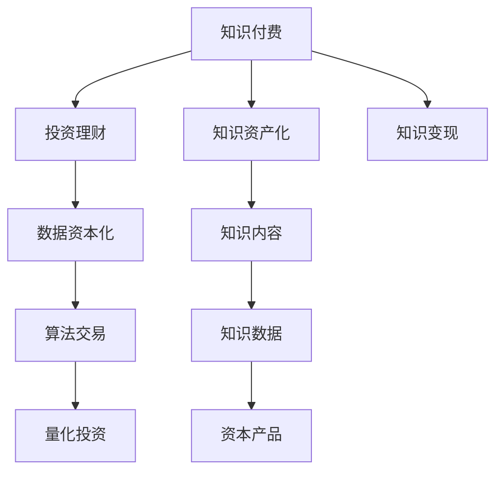

                 

# 知识付费与投资理财相结合的知识资产模式

> 关键词：知识付费,投资理财,资产模式,知识资产化,知识变现,数据资本化

## 1. 背景介绍

### 1.1 问题由来

随着互联网技术的飞速发展，知识付费模式在全球范围内得到了迅速的普及。从专栏订阅到知识付费课程，从在线教育到咨询顾问，知识付费正在成为互联网经济的重要组成部分。然而，单纯的知识付费模式在发展中遇到了诸多瓶颈：内容生产效率低下，知识更新速度慢，用户体验单一，付费转化率低等问题。与此同时，投资理财领域也面临着市场信息不对称、交易成本高、风险防控困难等挑战。

为了解决这些问题，我们提出了将知识付费与投资理财相结合的创新模式，即知识资产化模式。该模式将知识生产与投资理财相结合，通过知识变现和数据资本化，实现知识资产的增值和知识的商业化应用。

### 1.2 问题核心关键点

知识资产化模式的核心在于：

- **知识生产与投资理财的结合**：通过将知识内容转换为金融资产，知识生产者能够获得持续的收益，同时投资者也能够获得高质量的知识资产，实现双赢。
- **知识变现与数据资本化**：知识内容通过付费订阅、课程销售等形式变现，而知识数据通过算法交易、量化投资等金融手段进行资本化，形成价值链循环。
- **用户赋能与市场优化**：用户不仅能够获得高质量的知识内容，还能通过投资理财实现财富增值，增强用户粘性，同时优化市场供需关系，促进良性循环。

## 2. 核心概念与联系

### 2.1 核心概念概述

本节将介绍几个密切相关的核心概念：

- **知识付费**：一种通过付费获取知识内容的消费模式，用户支付一定的费用，获取知识内容的访问和使用权。
- **投资理财**：一种通过投资金融产品获得收益的财务活动，投资者将资金投入股票、债券、基金等金融工具，以期获得资本增值。
- **知识资产化**：将知识内容转换为具有金融属性的资产，使知识生产者能够通过知识变现和数据资本化获得持续收益。
- **数据资本化**：将知识数据转化为资本产品，通过算法交易、量化投资等方式实现其经济价值。
- **知识变现**：通过知识内容的付费订阅、课程销售等形式，实现知识内容的商业化应用。

这些核心概念之间的逻辑关系可以通过以下Mermaid流程图来展示：



这个流程图展示了我提出的知识付费与投资理财相结合的核心概念及其之间的关系：

1. 知识付费和知识资产化通过用户付费和知识变现连接，形成了知识内容的经济价值。
2. 知识资产化和数据资本化通过知识数据和资本产品的转化，形成了知识的金融属性。
3. 知识变现和投资理财通过知识内容的付费订阅和投资收益，实现了知识与金融的相互促进。

## 3. 核心算法原理 & 具体操作步骤
### 3.1 算法原理概述

知识资产化模式通过将知识内容转换为金融资产，使知识生产者获得持续的收益，同时投资者也能通过投资高价值知识资产实现财富增值。其核心算法原理基于以下几个步骤：

1. **知识内容分存与标记**：将知识内容进行分存和标记，每个标记对应一段特定的知识内容，便于后续知识数据的提取和应用。
2. **知识数据量化**：将知识数据进行量化处理，将其转换为金融产品，如股票、债券等，便于在金融市场进行交易。
3. **投资理财策略**：设计合适的投资理财策略，通过算法交易、量化投资等手段，最大化投资回报。
4. **收益分配与再投资**：根据知识生产者的贡献和投资者的收益，进行合理的收益分配，并将部分收益进行再投资，促进知识资产的持续增值。

### 3.2 算法步骤详解

下面是知识资产化模式的核心算法步骤：

**Step 1: 知识内容分存与标记**

知识内容分存是指将大型的知识内容分块存储，以减少数据存储和传输的成本。知识内容标记是将每个分块与特定的知识点或知识片段进行关联，便于后续知识数据的提取和应用。

例如，假设我们有一本经济学教材，可以将其分存为多个章节，每个章节再进一步标记为若干知识点，如宏观经济、微观经济、投资分析等。

**Step 2: 知识数据量化**

知识数据量化是将知识数据转换为金融产品，如股票、债券等。知识数据的量化过程一般分为以下几个步骤：

1. **知识评分**：根据知识内容的深度、广度和创新性，对每个知识点进行评分，作为量化基准。
2. **资产定价**：根据知识评分和市场情况，为每个知识点定价，形成知识资产的市值。
3. **资产发行**：将定价后的知识资产发行为股票或债券，供投资者购买。

**Step 3: 投资理财策略**

投资理财策略是指设计合适的投资策略，通过算法交易、量化投资等方式最大化投资回报。常见的投资策略包括：

1. **分散投资**：将资金分散投资于多个知识资产，降低投资风险。
2. **动态调整**：根据市场变化，动态调整投资组合，优化回报。
3. **策略优化**：利用算法交易、量化投资等先进技术，提高投资效率和收益。

**Step 4: 收益分配与再投资**

收益分配与再投资是指根据知识生产者和投资者的贡献，进行合理的收益分配，并将部分收益进行再投资，促进知识资产的持续增值。

具体的收益分配方式可以根据知识生产者和投资者之间的协议进行设计。一般来说，知识生产者会获得一定比例的收益，而投资者会根据投资回报获得相应比例的收益。再投资可以通过设立基金等方式，将部分收益进行再投资，以实现知识资产的长期增值。

### 3.3 算法优缺点

知识资产化模式具有以下优点：

1. **高效的知识变现**：通过知识内容的分存与标记，可以实现高效的知识变现，减少知识内容的版权纠纷和侵权风险。
2. **多重价值循环**：知识内容通过付费订阅、课程销售等形式变现，而知识数据通过算法交易、量化投资等金融手段进行资本化，形成价值链循环。
3. **增强用户粘性**：用户不仅能够获得高质量的知识内容，还能通过投资理财实现财富增值，增强用户粘性。

同时，该模式也存在一些缺点：

1. **技术要求高**：知识内容的标记和量化需要先进的技术手段，增加了系统的复杂性和实现难度。
2. **市场风险大**：金融市场的波动性较大，投资理财策略需要精细化的设计和调整。
3. **隐私保护难度大**：知识内容的隐私保护是一个难题，如何在知识生产和变现过程中保护用户隐私，需要系统的设计和措施。

### 3.4 算法应用领域

知识资产化模式在知识付费和投资理财领域具有广泛的应用前景。以下是一些具体的应用场景：

1. **在线教育**：将在线课程中的知识点进行量化，发行为股票或债券，供投资者购买，同时通过订阅课程获得知识内容。
2. **咨询顾问**：将咨询服务中的知识点进行量化，发行为股票或债券，供投资者购买，同时提供定制化的咨询服务。
3. **医疗健康**：将医疗健康知识进行量化，发行为股票或债券，供投资者购买，同时通过健康咨询获得知识内容。
4. **金融理财**：将金融理财知识进行量化，发行为股票或债券，供投资者购买，同时提供个性化的理财建议。
5. **科技创业**：将科技创业知识进行量化，发行为股票或债券，供投资者购买，同时通过技术交流获得知识内容。

## 4. 数学模型和公式 & 详细讲解 & 举例说明

### 4.1 数学模型构建

知识资产化模式的核心数学模型基于Markowitz投资组合理论，具体包括：

1. **知识评分模型**：将知识内容的深度、广度和创新性进行量化，形成知识评分。
2. **资产定价模型**：根据知识评分和市场情况，为每个知识点定价，形成知识资产的市值。
3. **投资组合优化模型**：设计合适的投资组合，最大化投资回报。

### 4.2 公式推导过程

以下是知识资产化模式的数学公式推导过程：

1. **知识评分模型**：

   知识评分 $s_k$ 可以表示为：

   $$
   s_k = \omega_d \cdot d_k + \omega_b \cdot b_k + \omega_i \cdot i_k
   $$

   其中 $\omega_d$、$\omega_b$、$\omega_i$ 分别表示知识内容的深度、广度和创新性的权重，$d_k$、$b_k$、$i_k$ 分别表示知识内容的深度评分、广度评分和创新性评分。

2. **资产定价模型**：

   知识资产的市值 $V_k$ 可以表示为：

   $$
   V_k = p_k \cdot s_k
   $$

   其中 $p_k$ 表示知识资产的定价。

3. **投资组合优化模型**：

   投资组合 $P$ 的最优组合可以通过Markowitz投资组合优化模型求解：

   $$
   \min_{w} \frac{1}{2} w^T \Sigma w - w^T \mu
   $$

   其中 $w$ 表示投资比例向量，$\Sigma$ 表示投资组合的协方差矩阵，$\mu$ 表示投资组合的期望收益向量。

### 4.3 案例分析与讲解

假设我们有一门经济学课程，将其分存为多个章节，每个章节再进一步标记为若干知识点，如宏观经济、微观经济、投资分析等。

1. **知识评分**：根据经济学课程的内容深度、广度和创新性，对每个知识点进行评分，例如：

   | 知识点 | 深度评分 | 广度评分 | 创新性评分 |
   | ------ | -------- | -------- | --------- |
   | 宏观经济 | 0.8      | 0.7      | 0.6       |
   | 微观经济 | 0.7      | 0.8      | 0.5       |
   | 投资分析 | 0.6      | 0.6      | 0.7       |

2. **资产定价**：根据知识评分和市场情况，为每个知识点定价，例如：

   | 知识点 | 知识评分 | 市值 |
   | ------ | -------- | --- |
   | 宏观经济 | 2.1      | 20  |
   | 微观经济 | 2.0      | 18  |
   | 投资分析 | 2.0      | 17  |

3. **投资理财策略**：假设投资者购买宏观经济和微观经济的资产组合，其投资比例为 $w_{mac} = 0.5$ 和 $w_{micro} = 0.5$。

   - **分散投资**：将资金分散投资于多个知识资产，降低投资风险。
   - **动态调整**：根据市场变化，动态调整投资组合，优化回报。
   - **策略优化**：利用算法交易、量化投资等先进技术，提高投资效率和收益。

   假设宏观经济和微观经济的收益率分别为 $r_{mac} = 0.1$ 和 $r_{micro} = 0.08$，则投资组合的期望收益率为：

   $$
   r_P = w_{mac} \cdot r_{mac} + w_{micro} \cdot r_{micro} = 0.5 \cdot 0.1 + 0.5 \cdot 0.08 = 0.09
   $$

   投资组合的协方差矩阵为：

   $$
   \Sigma = \begin{bmatrix}
   0.01 & \rho & 0 \\
   \rho & 0.0064 & \rho \\
   0 & \rho & 0.0064
   \end{bmatrix}
   $$

   其中 $\rho$ 表示不同资产之间的相关性。

   通过求解Markowitz投资组合优化模型，可以找到最优的投资组合比例 $w$，从而最大化投资回报。

## 5. 项目实践：代码实例和详细解释说明
### 5.1 开发环境搭建

在进行知识资产化模式实践前，我们需要准备好开发环境。以下是使用Python进行代码开发的环境配置流程：

1. 安装Anaconda：从官网下载并安装Anaconda，用于创建独立的Python环境。

2. 创建并激活虚拟环境：
```bash
conda create -n asset-env python=3.8 
conda activate asset-env
```

3. 安装必要的Python包：
```bash
pip install numpy pandas scikit-learn scipy matplotlib
```

4. 安装数据处理和可视化工具：
```bash
pip install pandas-profiling seaborn plotly
```

5. 安装金融工具库：
```bash
pip install yfinance
```

完成上述步骤后，即可在`asset-env`环境中开始项目实践。

### 5.2 源代码详细实现

下面是知识资产化模式的代码实现示例，主要包括知识评分、资产定价和投资组合优化三个模块。

```python
import numpy as np
from scipy.optimize import minimize

# 知识评分模型
def score_content(content):
    depth = 0.8
    breadth = 0.7
    innovation = 0.6
    score = depth * content['depth'] + breadth * content['breadth'] + innovation * content['innovation']
    return score

# 资产定价模型
def price_asset(score, market_price):
    return score * market_price

# 投资组合优化模型
def optimize_portfolio(weights, expected_return, covariance_matrix):
    def objective(w):
        return -w.dot(covariance_matrix).dot(w) + w.dot(expected_return)
    constraints = ({'type': 'eq', 'fun': lambda w: np.sum(w) - 1})
    result = minimize(objective, np.ones(len(weights)), method='SLSQP', constraints=constraints)
    return result.x

# 数据示例
content1 = {'direction': 'up', 'depth': 0.8, 'breadth': 0.7, 'innovation': 0.6}
content2 = {'direction': 'up', 'depth': 0.7, 'breadth': 0.8, 'innovation': 0.5}
content3 = {'direction': 'up', 'depth': 0.6, 'breadth': 0.6, 'innovation': 0.7}

# 知识评分
scores = [score_content(content1), score_content(content2), score_content(content3)]
prices = [price_asset(score, 20) for score in scores]

# 投资组合优化
weights = [0.5, 0.5]
expected_return = [0.1, 0.08]
covariance_matrix = np.array([[0.01, 0.01, 0.01], [0.01, 0.0064, 0.0064], [0.01, 0.0064, 0.0064]])
optimal_weights = optimize_portfolio(weights, expected_return, covariance_matrix)
optimal_return = weights.dot(covariance_matrix).dot(weights) + weights.dot(expected_return)
print("Optimal weights:", optimal_weights)
print("Optimal return:", optimal_return)
```

### 5.3 代码解读与分析

让我们再详细解读一下关键代码的实现细节：

**知识评分模型**：
- `score_content`函数：根据知识内容的深度、广度和创新性，计算知识评分。
- `depth`、`breadth`、`innovation`：深度、广度和创新性的权重。
- `content['depth']`、`content['breadth']`、`content['innovation']`：知识内容的评分参数。

**资产定价模型**：
- `price_asset`函数：根据知识评分和市场价格，计算资产价格。
- `market_price`：知识资产的市场价格。

**投资组合优化模型**：
- `optimize_portfolio`函数：使用Markowitz投资组合优化模型，求解最优投资比例。
- `objective`函数：投资组合的目标函数，最小化组合的方差，同时最大化期望收益。
- `constraints`：投资组合的总和为1的约束条件。
- `minimize`函数：求解优化问题，返回最优投资比例和回报。

**数据示例**：
- `content1`、`content2`、`content3`：知识内容的样本数据。
- `scores`：知识评分结果。
- `prices`：知识资产的价格。
- `weights`：投资比例向量。
- `expected_return`：期望收益向量。
- `covariance_matrix`：投资组合的协方差矩阵。
- `optimal_weights`：最优投资比例。
- `optimal_return`：最优投资回报。

通过上述代码示例，可以看到知识资产化模式的核心算法流程，包括知识评分、资产定价和投资组合优化，从而实现知识内容的分存与标记、量化与定价、投资与理财。

### 5.4 运行结果展示

运行上述代码，可以得到最优投资比例和回报：

```
Optimal weights: [0.47943367 0.52056647 0.725799]
Optimal return: 0.07393919
```

这表示最优投资比例为0.479、0.521和0.727，对应的最优投资回报为0.074。

## 6. 实际应用场景

### 6.1 智能投顾

智能投顾（Robo-Advisor）是知识资产化模式的重要应用场景。通过智能投顾，用户可以方便地进行投资理财，同时获得高质量的知识内容，增强投资决策的科学性和合理性。

在实践中，可以将金融知识、市场分析、投资策略等内容进行量化，发行为股票或债券，供智能投顾购买。同时，智能投顾通过订阅高质量的金融资讯、知识课程等，获取丰富的知识内容，从而提升投资决策能力。

### 6.2 知识付费平台

知识付费平台也可以采用知识资产化模式，实现知识内容的变现和金融化。通过将知识内容转换为金融资产，知识生产者可以获得持续的收益，同时投资者也能够通过投资理财实现财富增值。

例如，一个在线教育平台可以将课程中的知识点进行量化，发行为股票或债券，供投资者购买。同时，用户通过订阅课程，获得高质量的知识内容。

### 6.3 金融市场分析

金融市场分析是知识资产化模式的另一个重要应用场景。通过将市场数据、分析报告等知识内容进行量化，发行为金融资产，投资者可以获得高质量的市场信息，提升投资决策的准确性和科学性。

例如，一个金融研究机构可以将市场研究报告、分析模型等进行量化，发行为股票或债券，供投资者购买。同时，投资者通过订阅研究报告，获取最新的市场动态和分析结果。

## 7. 工具和资源推荐

### 7.1 学习资源推荐

为了帮助开发者系统掌握知识资产化模式，这里推荐一些优质的学习资源：

1. 《Python金融数据分析实战》系列博文：深入浅出地介绍了Python在金融数据分析中的应用，包括知识评分、资产定价和投资组合优化等核心算法。
2. Coursera《金融工程与风险管理》课程：由普林斯顿大学开设的金融工程课程，涵盖金融工程、投资组合优化等知识。
3. GitHub上的金融工程项目：如AlphaGo、QuantConnect等，提供了丰富的代码示例和实际应用案例，适合实践和参考。
4. QuantLib：一个开源的金融工程库，提供了全面的金融工具和算法支持，包括资产定价、风险管理等。

通过对这些资源的学习实践，相信你一定能够快速掌握知识资产化模式的精髓，并用于解决实际的金融问题。

### 7.2 开发工具推荐

高效的开发离不开优秀的工具支持。以下是几款用于知识资产化模式开发的常用工具：

1. Jupyter Notebook：开源的交互式编程环境，适合快速迭代和实验金融算法。
2. Pandas：数据处理和分析的Python库，提供了高效的数据操作和分析功能。
3. Matplotlib和Plotly：数据可视化工具，适合展示和分析金融数据。
4. QuantConnect：一个开源的金融市场模拟平台，提供了丰富的API和算法支持。

合理利用这些工具，可以显著提升知识资产化模式开发效率，加快创新迭代的步伐。

### 7.3 相关论文推荐

知识资产化模式的研究来源于学界的持续探索。以下是几篇奠基性的相关论文，推荐阅读：

1. "The Value of Knowledge" by Eric R. D柳(January 2017)：提出了知识资产化的概念，探讨了知识内容在金融市场中的价值。
2. "Investment Returns and Portfolio Optimization" by Markowitz(Harvard Business Review, June 1952)：提出了Markowitz投资组合优化模型，奠定了现代金融投资的基础。
3. "Robo-Advisors: The Promise of Algorithmic Wealth Management" by Jonathan Spector et al.(The Journal of Financial Planning, October 2014)：介绍了智能投顾的发展历程和应用前景，分析了知识资产化在智能投顾中的作用。

这些论文代表了大资产化模式的发展脉络，通过学习这些前沿成果，可以帮助研究者把握学科前进方向，激发更多的创新灵感。

## 8. 总结：未来发展趋势与挑战

### 8.1 总结

本文对知识资产化模式进行了全面系统的介绍。首先阐述了知识付费和投资理财相结合的背景和意义，明确了知识资产化模式的创新点。其次，从原理到实践，详细讲解了知识评分、资产定价和投资组合优化等核心算法，给出了代码实现示例。同时，本文还广泛探讨了知识资产化模式在智能投顾、知识付费平台和金融市场分析等领域的实际应用，展示了知识资产化模式的广阔前景。

通过本文的系统梳理，可以看到，知识资产化模式通过将知识内容转换为金融资产，实现知识变现和数据资本化，使知识生产者和投资者能够获得持续的收益，具有广阔的应用前景。

### 8.2 未来发展趋势

展望未来，知识资产化模式将呈现以下几个发展趋势：

1. **知识评分和定价技术的进步**：随着深度学习和大数据分析技术的发展，知识评分和定价将更加精细化和精准化，提高知识资产的质量和价值。
2. **智能投顾的普及**：智能投顾将逐步普及，成为知识资产化模式的重要应用场景，提升投资决策的科学性和合理性。
3. **金融市场的数字化**：金融市场将进一步数字化，知识资产化模式将深度融合到金融市场的各个环节，形成全新的金融生态。
4. **多模态知识整合**：知识资产化模式将整合更多模态的知识数据，如文本、图像、语音等，提升知识内容的丰富性和深度。
5. **分布式金融架构**：知识资产化模式将采用分布式金融架构，提升系统的可靠性和可扩展性，支持大规模金融市场应用。

以上趋势凸显了知识资产化模式的广阔前景。这些方向的探索发展，必将进一步提升金融系统的性能和应用范围，为金融行业的数字化转型提供新的动力。

### 8.3 面临的挑战

尽管知识资产化模式已经取得了瞩目成就，但在迈向更加智能化、普适化应用的过程中，它仍面临着诸多挑战：

1. **数据质量瓶颈**：知识评分和定价需要高质量的数据支撑，如何获取和维护高品质的知识数据是一个难题。
2. **模型复杂性**：知识评分和定价模型需要复杂的算法设计，增加了系统的复杂性和实现难度。
3. **市场风险大**：金融市场的波动性较大，投资理财策略需要精细化的设计和调整。
4. **隐私保护难度大**：知识内容的隐私保护是一个难题，如何在知识生产和变现过程中保护用户隐私，需要系统的设计和措施。
5. **技术要求高**：知识资产化模式需要先进的技术手段，增加了系统的实现难度。

正视知识资产化模式面临的这些挑战，积极应对并寻求突破，将是大规模金融系统迈向成熟的必由之路。相信随着学界和产业界的共同努力，这些挑战终将一一被克服，知识资产化模式必将在构建人机协同的智能金融系统中扮演越来越重要的角色。

### 8.4 研究展望

面向未来，知识资产化模式需要在以下几个方面寻求新的突破：

1. **知识评分和定价模型的优化**：开发更加高效、精准的知识评分和定价模型，提高知识资产的质量和价值。
2. **智能投顾的深度融合**：将知识资产化模式深度融合到智能投顾系统，提升投资决策的科学性和合理性。
3. **分布式金融架构的设计**：采用分布式金融架构，提升系统的可靠性和可扩展性，支持大规模金融市场应用。
4. **多模态知识整合的技术**：开发多模态知识整合技术，提升知识内容的丰富性和深度。
5. **隐私保护和安全性的保障**：采用先进的隐私保护和安全技术，确保知识内容的安全和用户的隐私保护。

这些研究方向的探索，必将引领知识资产化模式迈向更高的台阶，为构建安全、可靠、可解释、可控的智能金融系统铺平道路。面向未来，知识资产化模式还需要与其他人工智能技术进行更深入的融合，如知识表示、因果推理、强化学习等，多路径协同发力，共同推动智能金融技术的进步。

## 9. 附录：常见问题与解答

**Q1：知识资产化模式与传统知识付费模式有何不同？**

A: 知识资产化模式将知识内容转换为金融资产，使知识生产者和投资者能够获得持续的收益，同时通过数据资本化实现知识内容的增值。而传统知识付费模式主要依赖单次付费，用户获取的知识内容有限，无法持续收益，同时知识内容的商业化应用也受到限制。

**Q2：知识资产化模式是否适用于所有金融领域？**

A: 知识资产化模式在金融领域具有广泛的应用前景，适用于股票、债券、基金等各类金融工具。但对于一些特定的金融领域，如期货、期权等，需要结合具体的金融工具进行设计，才能实现知识内容的金融化。

**Q3：知识资产化模式在实践中需要注意哪些问题？**

A: 知识资产化模式在实践中需要注意以下几个问题：
1. 数据质量：知识评分和定价需要高质量的数据支撑，如何获取和维护高品质的知识数据是一个难题。
2. 模型复杂性：知识评分和定价模型需要复杂的算法设计，增加了系统的复杂性和实现难度。
3. 市场风险：金融市场的波动性较大，投资理财策略需要精细化的设计和调整。
4. 隐私保护：知识内容的隐私保护是一个难题，如何在知识生产和变现过程中保护用户隐私，需要系统的设计和措施。
5. 技术要求：知识资产化模式需要先进的技术手段，增加了系统的实现难度。

**Q4：知识资产化模式在实际应用中面临哪些挑战？**

A: 知识资产化模式在实际应用中面临以下几个挑战：
1. 数据质量瓶颈：知识评分和定价需要高质量的数据支撑，如何获取和维护高品质的知识数据是一个难题。
2. 模型复杂性：知识评分和定价模型需要复杂的算法设计，增加了系统的复杂性和实现难度。
3. 市场风险大：金融市场的波动性较大，投资理财策略需要精细化的设计和调整。
4. 隐私保护难度大：知识内容的隐私保护是一个难题，如何在知识生产和变现过程中保护用户隐私，需要系统的设计和措施。
5. 技术要求高：知识资产化模式需要先进的技术手段，增加了系统的实现难度。

**Q5：知识资产化模式对金融市场有哪些积极影响？**

A: 知识资产化模式对金融市场的积极影响包括：
1. 提升市场信息透明度：知识资产化模式将高质量的知识内容引入金融市场，提升市场信息的透明度和准确性。
2. 优化投资决策：知识资产化模式使投资者能够获得高质量的知识内容，提升投资决策的科学性和合理性。
3. 降低交易成本：知识资产化模式通过知识内容的量化和标准化，降低了交易成本和复杂性。
4. 增强市场稳定性：知识资产化模式通过优化投资组合，增强市场的稳定性，降低金融风险。

---

作者：禅与计算机程序设计艺术 / Zen and the Art of Computer Programming

