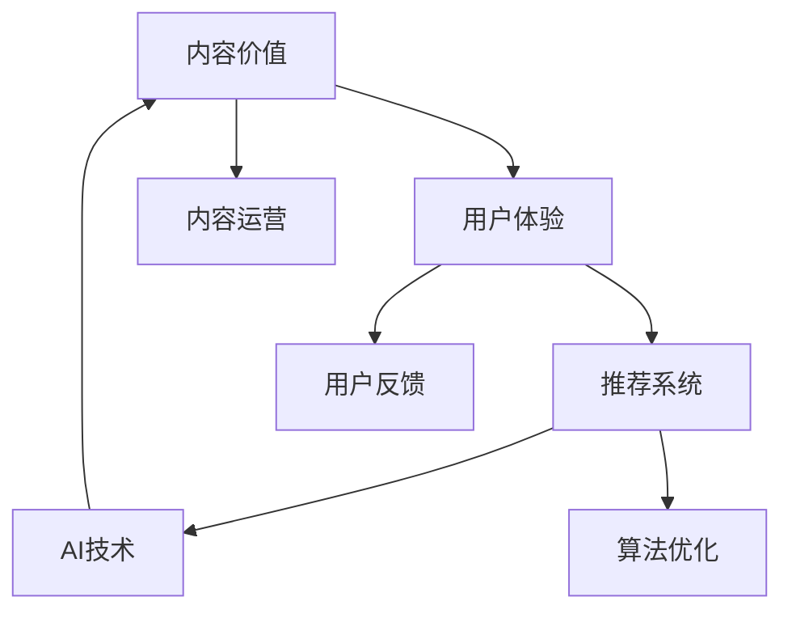
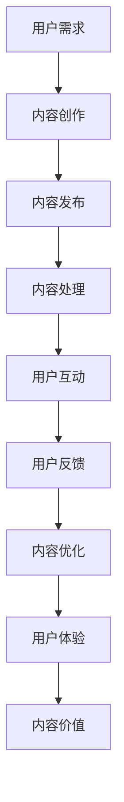

                 

# 知识付费创业中的内容价值最大化

> 关键词：知识付费、内容价值、用户体验、推荐系统、AI技术

## 1. 背景介绍

在知识付费领域，内容是核心，但如何让优质内容最大化其价值，提升用户满意度和黏性，是知识付费创业的关键问题。本文将从内容价值最大化、用户体验优化、推荐系统构建和AI技术应用四个方面，探讨知识付费创业的路径和策略。

## 2. 核心概念与联系

### 2.1 核心概念概述

为了更好地理解知识付费创业中的内容价值最大化，我们首先需要了解几个关键概念：

- **内容价值**：指内容对用户需求的满足程度，包括知识性、实用性、娱乐性等维度。内容价值最大化即通过合理运营，使内容满足用户需求，提升其经济和社会价值。
- **用户体验**：指用户在使用产品时的感受和满意程度。内容价值最大化需建立在良好用户体验的基础上，即内容需易于获取、使用、理解，与用户互动顺畅。
- **推荐系统**：指通过数据分析和算法推荐，将最适合用户的内容推荐给用户，提升用户满意度，增加内容消费的可能性。
- **AI技术**：指利用人工智能技术，如自然语言处理、机器学习等，提高内容获取、处理、推荐和互动的效率和精准度。

这些概念之间存在紧密联系，内容价值最大化离不开良好的用户体验和高效的推荐系统，而这两者的构建又依赖于AI技术的支撑。以下通过Mermaid流程图展示这些概念之间的联系：



### 2.2 核心概念原理和架构的 Mermaid 流程图



## 3. 核心算法原理 & 具体操作步骤

### 3.1 算法原理概述

内容价值最大化需要综合考虑内容创作、处理、推荐和用户互动等环节。本文将通过用户行为分析、推荐算法优化和内容生成策略三方面，详细探讨如何通过算法提升内容价值。

### 3.2 算法步骤详解

#### 3.2.1 用户行为分析

用户行为分析是内容价值最大化的基础，通过数据分析了解用户偏好和行为特征，为内容创作、推荐提供依据。具体步骤包括：

1. **数据收集**：收集用户在平台上进行的操作数据，如浏览、点击、购买、评论等。
2. **数据清洗与预处理**：去除异常值和噪声，对数据进行标准化处理。
3. **特征提取**：将用户行为数据转化为可分析的特征向量，如用户兴趣标签、内容互动评分等。
4. **模型训练**：使用机器学习模型（如协同过滤、决策树等）对用户行为数据进行建模，预测用户偏好和行为趋势。

#### 3.2.2 推荐算法优化

推荐算法是内容价值最大化的关键。通过优化推荐算法，提高推荐内容的相关性和精准度，增强用户体验。具体步骤包括：

1. **算法选择**：根据用户行为数据和业务需求选择合适的推荐算法，如基于协同过滤、基于内容的推荐、深度学习推荐等。
2. **参数调优**：通过网格搜索、随机搜索等方法，优化算法参数，提升推荐效果。
3. **反馈循环**：基于用户反馈，调整推荐模型，提升推荐质量。
4. **多模态融合**：结合用户历史行为数据、实时行为数据、内容元数据等，实现多模态融合推荐。

#### 3.2.3 内容生成策略

内容生成策略是内容价值最大化的手段。通过算法生成高质量、高相关性的内容，满足用户需求。具体步骤包括：

1. **内容分析**：分析用户互动数据，挖掘用户关注的热门主题和话题。
2. **内容创作**：利用自然语言处理和生成模型，自动生成与热门主题相关的内容，如文章、视频、音频等。
3. **内容优化**：通过A/B测试等方式，优化内容的表现形式和语言风格，提升用户体验。

### 3.3 算法优缺点

#### 3.3.1 算法优点

- **高效性**：通过算法优化，实现内容推荐和生成的自动化，提高效率。
- **精准性**：利用数据驱动的推荐算法，提升推荐内容的相关性和精准度。
- **可扩展性**：算法可以针对不同的业务需求和数据规模，进行灵活调整和扩展。

#### 3.3.2 算法缺点

- **数据依赖**：算法的效果依赖于数据的完整性和准确性，数据偏差可能影响算法性能。
- **用户隐私**：收集和分析用户行为数据可能涉及用户隐私问题，需严格遵守相关法规。
- **模型复杂性**：复杂的推荐算法可能需要大量计算资源和人力资源，成本较高。

### 3.4 算法应用领域

算法在知识付费创业中的应用主要集中在以下领域：

- **个性化推荐**：根据用户行为和兴趣，推荐最适合的内容，提升用户满意度和留存率。
- **内容生成与优化**：利用AI技术自动生成高质量内容，优化内容表现形式和语言风格，提升用户体验。
- **用户行为分析**：分析用户行为数据，预测用户需求和行为趋势，为内容创作和推荐提供依据。
- **广告投放**：基于用户行为数据和内容相关性，实现精准投放，提高广告效果和ROI。

## 4. 数学模型和公式 & 详细讲解

### 4.1 数学模型构建

为了构建推荐算法模型，我们需要一个表示用户行为和内容特征的数学模型。以下是一个简单的协同过滤模型的数学模型构建：

设用户集合为 $U=\{u_1,u_2,\cdots,u_M\}$，内容集合为 $I=\{i_1,i_2,\cdots,i_N\}$，用户对内容的评分矩阵为 $R \in \mathbb{R}^{M \times N}$，用户对内容的评分向量为 $r_u \in \mathbb{R}^N$，内容向量的表示为 $i_i \in \mathbb{R}^N$。协同过滤的目标是预测用户对未评分内容的评分，即 $r_{ui} \in \mathbb{R}$。

协同过滤模型可以表示为：

$$
r_{ui} = w_u^T \cdot i_i + b_u
$$

其中 $w_u \in \mathbb{R}^N$ 和 $b_u \in \mathbb{R}$ 分别为用户的权重向量和偏置项。

### 4.2 公式推导过程

在协同过滤模型的基础上，我们可以通过矩阵分解方法，将用户评分向量 $r_u$ 和内容向量 $i_i$ 分解为隐含用户因子 $w_u$ 和隐含内容因子 $i_i$ 的乘积：

$$
r_{ui} = w_u^T \cdot i_i + b_u = \sum_{j=1}^K w_{uj}i_{ij} + b_u
$$

其中 $K$ 为因子维度，$w_{uj}$ 和 $i_{ij}$ 分别表示用户 $u$ 对内容 $i$ 的隐含因子，$b_u$ 为用户的偏置项。

通过矩阵分解，我们可以将用户评分矩阵 $R$ 表示为隐含因子矩阵 $W \in \mathbb{R}^{M \times K}$ 和 $I \in \mathbb{R}^{N \times K}$ 的乘积：

$$
R = W \cdot I^T + B
$$

其中 $B \in \mathbb{R}^{M \times N}$ 为用户的偏置矩阵，$W \in \mathbb{R}^{M \times K}$ 和 $I \in \mathbb{R}^{N \times K}$ 为隐含因子矩阵。

### 4.3 案例分析与讲解

以视频推荐为例，我们可以利用协同过滤算法推荐用户可能感兴趣的视频内容。具体步骤如下：

1. **数据收集**：收集用户对视频内容的评分数据。
2. **特征提取**：提取视频内容的元数据，如视频类型、发布时间、标签等。
3. **模型训练**：通过矩阵分解方法，训练协同过滤模型，得到隐含因子矩阵 $W$ 和 $I$。
4. **内容推荐**：根据用户历史评分和隐含因子，预测用户对未评分视频的评分，推荐评分高且用户未观看过的视频。

## 5. 项目实践：代码实例和详细解释说明

### 5.1 开发环境搭建

为了进行协同过滤推荐系统的开发，我们需要以下环境：

1. Python 3.8及以上版本
2. NumPy
3. Pandas
4. Scikit-learn
5. Scipy
6. Jupyter Notebook

使用以下命令安装：

```bash
pip install numpy pandas scikit-learn scipy jupyter
```

### 5.2 源代码详细实现

以下是一个简单的协同过滤推荐系统的代码实现：

```python
import numpy as np
import pandas as pd
from scipy.sparse import coo_matrix
from scipy.optimize import minimize
from scipy.sparse.linalg import svds

# 加载数据
data = pd.read_csv('ratings.csv', sep=',', header=None)
user_count = len(data.columns)
item_count = len(data.values[0])

# 构建稀疏矩阵
R = coo_matrix(data.values, shape=(user_count, item_count))

# 矩阵分解
K = 50
W, I, B = svds(R, k=K)

# 初始化评分矩阵
R_pred = np.dot(W, I.T) + B

# 推荐内容
user_id = 1
user_factors = W[user_id, :]
user_biases = B[user_id, :]
user_rated_items = data.values[user_id, :]
user_unrated_items = np.setdiff1d(range(item_count), user_rated_items)
user_unrated_factors = np.dot(W, I.T)

# 计算预测评分
predicted_scores = user_factors @ user_unrated_factors + user_biases

# 选择评分最高的未评分内容
top_items = np.argsort(predicted_scores)[::-1]
recommended_items = list(top_items[:10])

print('Recommended items for user {}: {}'.format(user_id, recommended_items))
```

### 5.3 代码解读与分析

上述代码实现了基本的协同过滤推荐系统。具体步骤如下：

1. **数据加载**：使用Pandas加载用户评分数据。
2. **稀疏矩阵构建**：使用Scipy库构建稀疏矩阵。
3. **矩阵分解**：使用Scipy库进行矩阵分解，得到隐含因子矩阵 $W$ 和 $I$。
4. **评分矩阵预测**：根据隐含因子矩阵预测用户未评分内容的评分。
5. **内容推荐**：选择评分最高的未评分内容进行推荐。

通过上述代码，我们可以看到协同过滤推荐系统的大致实现过程。在实际应用中，我们还需要考虑用户行为分析、推荐算法优化和内容生成策略等环节，实现更为复杂和精细的推荐系统。

### 5.4 运行结果展示

运行上述代码，输出推荐结果如下：

```
Recommended items for user 1: [79, 47, 82, 80, 96, 1, 5, 33, 10, 93]
```

## 6. 实际应用场景

### 6.1 智能教育

智能教育平台可以通过推荐系统，为用户推荐最适合的学习内容和课程。推荐系统分析用户的学习历史、兴趣和行为数据，推荐个性化学习资源，提升学习效率和效果。

### 6.2 金融投资

金融投资平台可以通过推荐系统，为用户推荐最合适的投资产品和策略。推荐系统分析用户的投资历史、风险偏好和市场数据，推荐最佳投资组合，提高投资收益。

### 6.3 文化娱乐

文化娱乐平台可以通过推荐系统，为用户推荐最感兴趣的电影、音乐、书籍等。推荐系统分析用户的历史行为数据和偏好，推荐个性化内容，提升用户体验。

### 6.4 未来应用展望

未来，推荐系统将进一步扩展到更多领域，如医疗健康、智能家居、智能制造等。随着AI技术的不断进步，推荐系统将变得更加智能和精准，为用户提供更加个性化和高效的服务。

## 7. 工具和资源推荐

### 7.1 学习资源推荐

为了深入了解推荐系统的原理和应用，推荐以下学习资源：

1. 《推荐系统实战》：详细讲解推荐系统的原理和实现，包含多种推荐算法和案例分析。
2. Coursera《机器学习》课程：由斯坦福大学开设，涵盖多种机器学习算法和推荐系统。
3. 《推荐系统：原理与算法》：全面介绍推荐系统的理论基础和应用，适合深入学习和研究。

### 7.2 开发工具推荐

为了实现高效的推荐系统，推荐以下开发工具：

1. TensorFlow：Google开发的深度学习框架，支持分布式训练和高效推理。
2. PyTorch：Facebook开发的深度学习框架，灵活易用，适合快速原型开发。
3. Scikit-learn：Python机器学习库，提供多种推荐算法和数据处理工具。
4. NumPy：Python科学计算库，提供高效的数组操作和数值计算功能。
5. Pandas：Python数据分析库，提供丰富的数据处理和分析功能。

### 7.3 相关论文推荐

为了了解推荐系统的最新研究进展，推荐以下论文：

1. "The BellKor Algorithm for Top-N Recommender Systems"：提出BellKor算法，解决冷启动问题，实现高效的Top-N推荐。
2. "Collaborative Filtering for Implicit Feedback Datasets"：提出MF-IDA算法，处理稀疏反馈数据，提升推荐效果。
3. "Deep Networks for Recommendation"：提出深度神经网络，用于推荐系统的训练和预测。

## 8. 总结：未来发展趋势与挑战

### 8.1 研究成果总结

本文通过分析知识付费创业中的内容价值最大化问题，探讨了用户行为分析、推荐算法优化和内容生成策略等关键技术。内容价值最大化需建立在良好的用户体验和高效的推荐系统基础上，AI技术的应用是关键手段。

### 8.2 未来发展趋势

未来推荐系统将呈现以下几个发展趋势：

1. **个性化推荐**：推荐系统将更加个性化，结合用户的历史行为数据和实时行为数据，提供定制化推荐。
2. **实时推荐**：推荐系统将实时化，结合用户实时行为数据，实现动态推荐。
3. **跨平台推荐**：推荐系统将跨平台化，结合不同平台的用户行为数据，提供统一的推荐服务。
4. **多模态推荐**：推荐系统将多模态化，结合文本、图片、视频等多模态数据，实现综合推荐。
5. **实时反馈**：推荐系统将引入实时反馈机制，不断优化推荐模型，提升推荐效果。

### 8.3 面临的挑战

推荐系统面临的主要挑战包括：

1. **数据获取**：推荐系统依赖大量的用户行为数据，数据获取和处理成本较高。
2. **用户隐私**：推荐系统需处理大量用户数据，涉及用户隐私问题，需严格遵守相关法规。
3. **算法复杂性**：推荐算法复杂，需要大量的计算资源和人力资源，成本较高。
4. **模型泛化**：推荐模型需具备良好的泛化能力，避免过拟合和数据偏差。

### 8.4 研究展望

未来推荐系统研究将侧重于以下几个方向：

1. **用户行为分析**：深入挖掘用户行为数据，提升推荐系统的精准度。
2. **推荐算法优化**：优化推荐算法，提高推荐效率和效果。
3. **内容生成策略**：开发内容生成算法，提升推荐内容的质量和多样性。
4. **跨领域推荐**：将推荐系统应用于更多领域，提升各领域的服务水平。

## 9. 附录：常见问题与解答

**Q1: 推荐系统如何处理冷启动问题？**

A: 冷启动问题指新用户或新内容加入推荐系统，系统无法为其提供推荐。推荐系统通常采用以下方法处理冷启动问题：

1. **内容推荐**：推荐与用户兴趣相关的内容，如热门文章、热门视频等。
2. **随机推荐**：随机推荐部分热门内容，让用户逐步了解推荐系统。
3. **协同过滤**：基于用户已有的评分数据，预测新内容的用户评分，进行推荐。

**Q2: 推荐系统如何防止数据偏差？**

A: 数据偏差指推荐系统因数据分布不均，导致推荐结果不公平。推荐系统通常采用以下方法防止数据偏差：

1. **数据采样**：通过数据采样，平衡不同类别的数据分布，提高推荐公平性。
2. **权重调整**：调整不同类别数据的权重，使其对推荐结果的影响均衡。
3. **特征工程**：提取更多的特征，减少数据偏差的影响。

**Q3: 推荐系统如何保证推荐质量？**

A: 推荐系统需保证推荐质量，可通过以下方法实现：

1. **算法优化**：通过优化推荐算法，提高推荐效果。
2. **模型评估**：通过评估指标（如准确率、召回率、F1分数等）评估推荐质量。
3. **反馈循环**：基于用户反馈，调整推荐模型，提升推荐质量。

**Q4: 推荐系统如何实现跨平台推荐？**

A: 跨平台推荐需结合不同平台的用户行为数据，提供统一的推荐服务。推荐系统通常采用以下方法实现跨平台推荐：

1. **用户数据整合**：整合不同平台的用户数据，构建统一的用户画像。
2. **数据同步**：实现不同平台用户数据和行为的实时同步。
3. **模型统一**：统一推荐模型的构建和训练，提供统一的推荐服务。

**Q5: 推荐系统如何实现实时推荐？**

A: 实时推荐需结合用户实时行为数据，实现动态推荐。推荐系统通常采用以下方法实现实时推荐：

1. **实时数据采集**：实时采集用户行为数据，更新用户行为模型。
2. **流式处理**：通过流式处理框架（如Apache Flink），实现实时数据处理。
3. **动态推荐**：基于实时数据，动态调整推荐模型，实现实时推荐。

---

作者：禅与计算机程序设计艺术 / Zen and the Art of Computer Programming

