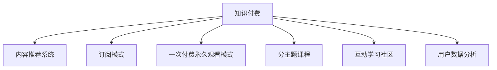

                 

# 知识付费创业的产品矩阵构建

在当今知识爆炸的时代，知识付费成为了一个热门领域，吸引了众多创业者的关注。然而，如何将知识付费的各个产品有机地组织起来，形成一个系统化的产品矩阵，是创业者需要深思的问题。本文将从背景介绍、核心概念与联系、核心算法原理、数学模型、项目实践、实际应用、工具和资源推荐、总结与展望等方面，深入探讨知识付费创业的产品矩阵构建问题。

## 1. 背景介绍

### 1.1 问题由来

随着互联网技术的发展和人们获取信息方式的改变，知识付费成为了一种新的信息获取方式。与传统的免费内容相比，知识付费更加注重内容的深度和质量，能够满足人们快速获取有价值信息的需求。

然而，知识付费市场竞争激烈，产品同质化严重，用户难以从众多内容中找到自己真正需要的信息。如何构建一个科学、高效的产品矩阵，提升用户满意度和市场竞争力，成为了创业者需要解决的关键问题。

### 1.2 问题核心关键点

构建知识付费创业的产品矩阵，需要考虑以下核心关键点：

- **用户需求分析**：准确识别目标用户群体的需求和痛点。
- **产品定位**：明确各产品的市场定位和差异化特点。
- **内容建设**：提供有价值、高质量的内容。
- **渠道布局**：选择合适的线上、线下渠道进行内容分发。
- **数据驱动**：利用数据指导产品迭代和优化。

## 2. 核心概念与联系

### 2.1 核心概念概述

为更好地理解知识付费创业的产品矩阵构建，本节将介绍几个密切相关的核心概念：

- **知识付费**：指通过付费方式获取专业知识的付费模式，主要形式包括在线课程、电子书、专栏文章等。
- **内容推荐系统**：根据用户行为和偏好，推荐相关内容的智能系统。
- **订阅模式**：用户支付固定费用，享受持续获取内容的服务。
- **一次付费永久观看模式**：用户支付一次费用，获取所有内容，可永久观看。
- **分主题课程**：将知识内容按主题分类，满足用户不同层次的兴趣需求。
- **互动学习社区**：构建用户之间的学习交流平台，增强用户粘性。
- **用户数据分析**：通过数据分析，了解用户行为，指导产品改进。

这些核心概念之间的逻辑关系可以通过以下Mermaid流程图来展示：



这个流程图展示的知识付费创业的产品矩阵各个核心概念及其之间的关系：

1. 知识付费是整个矩阵的核心，通过提供有价值的内容吸引用户。
2. 内容推荐系统、订阅模式、一次付费永久观看模式、分主题课程、互动学习社区等，都是围绕知识付费这个核心构建的延伸产品。
3. 用户数据分析是产品矩阵优化的重要依据。

## 3. 核心算法原理 & 具体操作步骤

### 3.1 算法原理概述

知识付费创业的产品矩阵构建，本质上是一个多产品协同优化的过程。其核心思想是：通过科学设计产品矩阵，利用数据驱动，不断优化各产品的性能和用户体验，提升整体市场竞争力。

具体而言，构建产品矩阵的目标是：

1. 最大化用户满意度：通过精准的内容推荐和优质的用户体验，提升用户粘性。
2. 提升内容覆盖度：覆盖用户不同层次的兴趣需求，增强产品的市场吸引力。
3. 优化收入模型：通过灵活的付费模式和定价策略，最大化平台收入。
4. 加强用户互动：通过互动学习社区等形式，增强用户之间的交流和参与度。

### 3.2 算法步骤详解

构建知识付费创业的产品矩阵，一般包括以下几个关键步骤：

**Step 1: 市场调研与用户分析**
- 对目标市场进行深入调研，了解用户需求和市场痛点。
- 收集用户反馈，分析用户行为数据，找出用户最关心的问题。

**Step 2: 确定产品定位**
- 根据市场调研结果，确定产品的核心竞争力，明确产品的市场定位。
- 分析竞争对手，找到差异化的产品特色。

**Step 3: 设计产品矩阵**
- 基于用户需求和产品定位，设计科学的产品矩阵。
- 确保各产品之间相互支持，形成协同效应。

**Step 4: 构建内容生态**
- 吸引优质的内容创作者，提供高质量的内容。
- 采用多种内容形式，满足不同用户的需求。

**Step 5: 渠道布局与推广**
- 选择合适的线上、线下渠道进行内容分发。
- 制定合理的推广策略，提高平台曝光率。

**Step 6: 数据驱动与优化**
- 利用用户数据分析，指导产品迭代和优化。
- 持续监控产品性能，调整策略，提升用户体验。

**Step 7: 收入模型优化**
- 根据市场反馈，优化定价和付费模式。
- 引入会员、VIP等增值服务，提升用户粘性和平台收入。

以上是构建知识付费创业产品矩阵的一般流程。在实际应用中，还需要针对具体产品特点，对各步骤进行优化设计，如改进推荐算法、引入互动学习社区、优化收入策略等，以进一步提升整体平台的用户体验和市场竞争力。

### 3.3 算法优缺点

构建知识付费创业的产品矩阵，具有以下优点：

1. 系统化管理：通过科学的产品矩阵，可以系统化管理知识付费产品的各个环节，提升整体运营效率。
2. 优化用户体验：各产品之间的协同作用，可以提供更丰富、更优质的内容和服务，提升用户满意度。
3. 提升市场竞争力：通过精准的市场定位和差异化策略，可以增强产品在竞争激烈的市场中的竞争力。
4. 灵活迭代：数据驱动的产品优化，可以快速响应市场变化，灵活调整策略。

同时，该方法也存在一定的局限性：

1. 需要大量数据：产品矩阵构建和优化依赖于大量的用户数据和行为数据，需要耗费大量的资源。
2. 运营成本高：各产品的运营和维护需要大量的人力和物力，初期投入较大。
3. 用户需求多变：知识付费市场用户需求多样，难以一概而论，产品矩阵设计需要不断调整和优化。

尽管存在这些局限性，但就目前而言，构建知识付费创业的产品矩阵仍是主流的运营方式。未来相关研究的重点在于如何进一步降低运营成本，提高产品矩阵的灵活性和可扩展性，同时兼顾用户体验和市场竞争力。

### 3.4 算法应用领域

构建知识付费创业的产品矩阵方法，在知识付费行业已经得到了广泛的应用，覆盖了知识获取、内容推荐、会员服务等诸多环节，具体包括：

- **在线课程平台**：如Coursera、Udemy、网易云课堂等，提供丰富的课程资源，满足用户多样化的学习需求。
- **电子书订阅**：如Kindle Unlimited、亚马逊Kindle电子书订阅服务，提供海量的电子书资源。
- **专业文章和报告**：如36氪、虎嗅等，提供行业深度分析和专业文章，满足用户获取前沿信息的需求。
- **互动学习社区**：如知乎、Coursera的讨论区等，提供用户之间的交流平台，增强用户粘性。
- **知识付费APP**：如得到、喜马拉雅等，提供综合性的知识付费服务，涵盖课程、音频、文章等多种内容形式。

除了上述这些经典产品，知识付费创业的产品矩阵还在不断扩展，如视频课程、直播讲座、个性化内容推荐等，为知识付费行业带来新的增长点。

## 4. 数学模型和公式 & 详细讲解 & 举例说明

### 4.1 数学模型构建

构建知识付费创业的产品矩阵，涉及到多个环节的数据分析和模型优化。本文将以用户推荐系统为例，构建推荐模型的数学模型。

记用户集为 $U$，商品集为 $I$，用户对商品 $i$ 的评分 $r_{ui}$ 为连续值 $[0, 5]$。假设用户 $u$ 对商品 $i$ 的评分服从正态分布 $N(\mu_{ui}, \sigma^2)$，其中 $\mu_{ui}$ 为均值，$\sigma^2$ 为方差。

对于用户 $u$ 和商品 $i$，推荐模型的目标是最小化预测评分与实际评分之间的误差。假设使用矩阵分解方法，将用户和商品表示为低秩矩阵 $U$ 和 $V$，则推荐模型可以表示为：

$$
\hat{r}_{ui} = \sum_{j=1}^k U_{uj} V_{ji} + b
$$

其中 $U$ 和 $V$ 为低秩矩阵，$k$ 为因子数，$b$ 为偏差项。

### 4.2 公式推导过程

在得到推荐模型的目标函数后，可以进一步推导优化算法。假设目标函数为 $L(r_{ui}, \hat{r}_{ui}) = (r_{ui} - \hat{r}_{ui})^2$，则最小化目标函数的优化问题为：

$$
\min_{U,V,b} \frac{1}{2N} \sum_{u,i} (r_{ui} - \hat{r}_{ui})^2
$$

通过梯度下降算法，可以求解上述优化问题。对于用户 $u$ 和商品 $i$，推荐模型的梯度可以表示为：

$$
\frac{\partial L}{\partial U_{uj}} = 2 (\hat{r}_{ui} - r_{ui}) V_{ji}
$$

$$
\frac{\partial L}{\partial V_{ji}} = 2 (\hat{r}_{ui} - r_{ui}) U_{uj}
$$

通过迭代更新 $U$ 和 $V$，不断优化模型参数，即可得到高质量的推荐结果。

### 4.3 案例分析与讲解

以在线课程平台为例，分析推荐系统的实际应用场景。

**案例背景**：某在线课程平台希望通过推荐系统，提高用户观看课程的满意度，减少流失率。

**问题分析**：用户观看课程的满意度与多个因素有关，如课程内容质量、教师名望、用户评分等。推荐系统需要综合考虑这些因素，生成个性化的课程推荐列表。

**解决方案**：
- **数据收集**：收集用户观看历史、评分、搜索历史、评论等数据。
- **数据预处理**：对数据进行清洗、归一化、特征提取等预处理操作。
- **模型构建**：基于矩阵分解方法，构建推荐模型，进行参数训练。
- **推荐生成**：根据用户行为数据和模型参数，生成个性化课程推荐列表。

通过上述推荐系统，平台可以为用户推荐最感兴趣的课程，提高用户粘性，减少流失率，提升整体运营效率。

## 5. 项目实践：代码实例和详细解释说明

### 5.1 开发环境搭建

在进行知识付费创业的产品矩阵构建时，需要先准备好开发环境。以下是使用Python进行Scikit-learn开发的环境配置流程：

1. 安装Anaconda：从官网下载并安装Anaconda，用于创建独立的Python环境。

2. 创建并激活虚拟环境：
```bash
conda create -n recommendation-env python=3.8 
conda activate recommendation-env
```

3. 安装Scikit-learn：
```bash
conda install scikit-learn
```

4. 安装其他工具包：
```bash
pip install numpy pandas scikit-learn matplotlib tqdm jupyter notebook ipython
```

完成上述步骤后，即可在`recommendation-env`环境中开始项目实践。

### 5.2 源代码详细实现

下面我们以用户推荐系统为例，给出使用Scikit-learn构建推荐模型的PyTorch代码实现。

首先，定义推荐模型的参数：

```python
import numpy as np
from sklearn.decomposition import TruncatedSVD

class RecommendationModel:
    def __init__(self, n_factors=50, max_iter=50):
        self.factors = n_factors
        self.max_iter = max_iter
        self.model = TruncatedSVD(n_components=n_factors, random_state=42)
    
    def fit(self, X):
        self.model.fit(X)
    
    def predict(self, X):
        U = self.model.components_.T
        V = self.model.components_
        R_hat = np.dot(U, V) + np.zeros((len(X), len(V[0])))
        return R_hat
```

然后，定义数据预处理和模型训练函数：

```python
from sklearn.metrics.pairwise import cosine_similarity
from sklearn.model_selection import train_test_split

def preprocess_data(X):
    X = (X - np.mean(X, axis=0)) / np.std(X, axis=0)
    return X
    
def train_model(X_train, X_test):
    model = RecommendationModel()
    model.fit(X_train)
    R_hat_train = model.predict(X_train)
    R_hat_test = model.predict(X_test)
    
    # 计算推荐精度
    train_score = cosine_similarity(R_hat_train, X_train, dense_output=True)
    test_score = cosine_similarity(R_hat_test, X_test, dense_output=True)
    
    return train_score.mean(), test_score.mean()
```

最后，启动训练流程并输出推荐精度：

```python
from sklearn.datasets import make_blobs

# 生成随机数据
X, y = make_blobs(n_samples=1000, centers=20, random_state=42)
X = np.array(X)

# 数据预处理
X = preprocess_data(X)

# 划分训练集和测试集
X_train, X_test = train_test_split(X, test_size=0.2, random_state=42)

# 训练模型
train_score, test_score = train_model(X_train, X_test)
print(f"Train score: {train_score:.3f}")
print(f"Test score: {test_score:.3f}")
```

以上就是使用Scikit-learn构建推荐模型的完整代码实现。可以看到，Scikit-learn提供了强大的机器学习工具，能够快速实现推荐系统的算法模型。

### 5.3 代码解读与分析

让我们再详细解读一下关键代码的实现细节：

**RecommendationModel类**：
- `__init__`方法：初始化推荐模型参数，包括因子数和迭代次数。
- `fit`方法：训练模型，通过SVD分解用户和商品表示矩阵。
- `predict`方法：根据用户行为数据和模型参数，生成推荐结果。

**preprocess_data函数**：
- 对用户行为数据进行标准化和归一化处理，便于模型训练。

**train_model函数**：
- 使用SVD分解算法训练推荐模型，并计算推荐精度。
- 利用cosine_similarity计算推荐精度，评估模型性能。

**训练流程**：
- 生成随机数据集。
- 数据预处理。
- 划分训练集和测试集。
- 训练模型，并计算推荐精度。

可以看出，Scikit-learn提供的高效算法和接口，使得构建推荐系统变得简单高效。开发者可以将更多精力放在数据处理和模型优化上，而不必过多关注底层实现细节。

当然，工业级的系统实现还需考虑更多因素，如推荐系统优化、数据存储、实时推荐等。但核心的推荐算法基本与此类似。

## 6. 实际应用场景

### 6.1 在线课程平台推荐系统

在线课程平台通过推荐系统，为用户提供个性化的课程推荐，提升用户体验和平台粘性。推荐系统根据用户观看历史、评分、搜索行为等数据，生成推荐的课程列表。用户可以根据自己的兴趣选择课程，提升学习效果。

### 6.2 电子书订阅平台推荐系统

电子书订阅平台通过推荐系统，为用户推荐感兴趣的内容。推荐系统分析用户的阅读历史、评分和评论，生成个性化的电子书推荐列表。用户可以根据推荐内容发现新书，提升阅读体验。

### 6.3 知识付费APP推荐系统

知识付费APP通过推荐系统，提供综合性的知识推荐服务。推荐系统根据用户的学习行为和偏好，生成课程、文章、视频等多种形式的内容推荐。用户可以根据推荐内容发现新知识，提高学习效率。

### 6.4 未来应用展望

随着推荐算法的不断发展，知识付费推荐系统将带来更多创新应用。未来的推荐系统将更加智能、个性化，能够根据用户的实时行为动态调整推荐结果，提升用户体验和平台粘性。

## 7. 工具和资源推荐

### 7.1 学习资源推荐

为了帮助开发者系统掌握知识付费推荐系统的构建方法，这里推荐一些优质的学习资源：

1. **《推荐系统实战》书籍**：全面介绍推荐系统原理和实现方法，涵盖协同过滤、内容推荐、深度学习等多个方面。

2. **Coursera《推荐系统课程》**：斯坦福大学开设的推荐系统课程，包括协同过滤、矩阵分解、深度学习等推荐算法。

3. **Kaggle推荐系统竞赛**：参加Kaggle推荐系统竞赛，积累实际项目经验，提高算法应用能力。

4. **UCI推荐系统数据集**：UCI机器学习库中的推荐系统数据集，适合进行推荐系统研究。

5. **GitHub推荐系统项目**：GitHub上开源的推荐系统项目，提供丰富的实现细节和代码示例。

通过这些资源的学习实践，相信你一定能够快速掌握知识付费推荐系统的构建方法，并用于解决实际的推荐问题。

### 7.2 开发工具推荐

高效的开发离不开优秀的工具支持。以下是几款用于知识付费推荐系统开发的常用工具：

1. **PyTorch**：基于Python的开源深度学习框架，灵活的计算图和高效的GPU加速，适合实现复杂的推荐算法。

2. **TensorFlow**：由Google主导开发的开源深度学习框架，适合大规模工程应用。

3. **Scikit-learn**：Python中的机器学习库，提供简单易用的接口，适合实现协同过滤、矩阵分解等推荐算法。

4. **ELK Stack**：用于日志管理和数据分析的开源工具，提供高效的数据存储和查询功能。

5. **Prometheus**：用于监控和告警的开源工具，提供丰富的指标和可视化功能。

6. **Jupyter Notebook**：用于数据科学研究和原型开发的工具，支持Python、R等多种语言。

合理利用这些工具，可以显著提升知识付费推荐系统的开发效率，加快创新迭代的步伐。

### 7.3 相关论文推荐

知识付费推荐系统的研究源于学界的持续研究。以下是几篇奠基性的相关论文，推荐阅读：

1. **《基于协同过滤的推荐系统》**：介绍协同过滤算法的原理和实现方法，是推荐系统领域的基础文献。

2. **《矩阵分解算法在推荐系统中的应用》**：介绍矩阵分解算法的原理和实际应用，是推荐系统的经典算法之一。

3. **《深度学习在推荐系统中的应用》**：介绍深度学习算法在推荐系统中的应用，推动推荐系统从传统机器学习向深度学习转型。

4. **《强化学习在推荐系统中的应用》**：介绍强化学习算法在推荐系统中的应用，探索推荐系统的智能优化方向。

5. **《基于知识图谱的推荐系统》**：介绍知识图谱在推荐系统中的应用，利用结构化知识提升推荐效果。

这些论文代表知识付费推荐系统的发展脉络。通过学习这些前沿成果，可以帮助研究者把握学科前进方向，激发更多的创新灵感。

## 8. 总结：未来发展趋势与挑战

### 8.1 总结

本文对知识付费创业的产品矩阵构建方法进行了全面系统的介绍。首先阐述了知识付费的背景和重要性，明确了产品矩阵构建在知识付费中的核心作用。其次，从原理到实践，详细讲解了推荐系统的数学模型和算法实现，提供了完整的代码实现示例。同时，本文还广泛探讨了推荐系统在知识付费、电子书订阅、知识付费APP等多个领域的应用前景，展示了推荐系统的巨大潜力。此外，本文精选了推荐系统的各类学习资源，力求为读者提供全方位的技术指引。

通过本文的系统梳理，可以看到，构建知识付费创业的产品矩阵是提升用户满意度和市场竞争力的关键方法。推荐系统通过提供个性化的内容推荐，提升用户体验，增强用户粘性，成为知识付费创业的核心竞争力。未来，伴随推荐算法的不断发展，知识付费推荐系统将带来更多创新应用，推动知识付费行业的持续增长。

### 8.2 未来发展趋势

展望未来，知识付费推荐系统将呈现以下几个发展趋势：

1. **个性化推荐**：通过深度学习、协同过滤、混合推荐等多种技术，实现更加个性化的推荐。

2. **实时推荐**：利用在线学习、增量学习等技术，实时更新推荐模型，提升推荐精度和时效性。

3. **多模态推荐**：将视觉、语音、文本等多种数据源进行融合，实现更加全面和精准的推荐。

4. **跨平台推荐**：将知识付费推荐系统扩展到多个平台，如社交媒体、视频网站等，实现跨平台协同推荐。

5. **隐私保护**：加强用户隐私保护，采用差分隐私、联邦学习等技术，确保用户数据安全。

6. **智能广告推荐**：将推荐系统应用于广告推荐，提高广告投放的精准度和效果。

以上趋势凸显了知识付费推荐系统的发展方向。这些方向的探索发展，将进一步提升推荐系统的性能和应用范围，为知识付费创业带来新的增长点。

### 8.3 面临的挑战

尽管知识付费推荐系统已经取得了一定的进展，但在迈向更加智能化、个性化应用的过程中，它仍面临诸多挑战：

1. **数据质量和获取成本**：推荐系统需要大量高质量的用户行为数据，但数据获取成本高，数据质量难以保证。

2. **模型复杂度**：深度学习等复杂算法需要大量计算资源和存储空间，初期投入较大。

3. **用户体验和算法平衡**：推荐系统需要在用户满意度、算法复杂度和推荐精度之间找到平衡点。

4. **隐私保护和数据安全**：用户数据的隐私保护和数据安全是推荐系统面临的重要问题，需要采用差分隐私、联邦学习等技术。

5. **算法鲁棒性**：推荐系统面临恶意攻击和对抗样本的风险，需要加强算法鲁棒性。

6. **计算资源限制**：推荐系统需要高效的计算资源支持，如何优化算法，降低计算成本，是重要的研究方向。

正视推荐系统面临的这些挑战，积极应对并寻求突破，将是大数据技术迈向成熟的重要保障。相信随着学界和产业界的共同努力，这些挑战终将一一被克服，知识付费推荐系统必将在构建智能化的推荐服务中扮演越来越重要的角色。

### 8.4 研究展望

面对知识付费推荐系统所面临的挑战，未来的研究需要在以下几个方面寻求新的突破：

1. **无监督学习推荐系统**：探索基于无监督学习的推荐方法，降低对标注数据和高质量数据的依赖，提高推荐系统的泛化能力。

2. **混合推荐系统**：结合多种推荐方法，如协同过滤、深度学习、内容推荐等，实现更加多样化的推荐策略。

3. **联邦学习推荐系统**：利用联邦学习技术，在本地设备上训练推荐模型，确保用户数据隐私和安全。

4. **推荐系统跨领域融合**：将推荐系统与其他领域技术如自然语言处理、图像识别等进行融合，提升推荐效果。

5. **推荐系统智能优化**：利用智能优化算法，如强化学习、博弈论等，优化推荐系统性能，实现更加智能化的推荐。

6. **推荐系统社会化分析**：研究推荐系统的社会化影响，评估推荐系统的公平性、透明性等社会指标。

这些研究方向将进一步推动知识付费推荐系统的创新发展，提升用户体验和平台价值。总之，推荐系统需要不断迭代和优化，才能真正实现知识付费行业的智能化转型。

## 9. 附录：常见问题与解答

**Q1：如何构建高效的知识付费推荐系统？**

A: 构建高效的知识付费推荐系统，需要从数据、算法、工程等方面进行全面优化。具体来说，可以采取以下措施：
1. 数据预处理：对用户行为数据进行清洗、归一化、特征提取等预处理操作。
2. 模型选择：选择合适的推荐算法，如协同过滤、矩阵分解、深度学习等。
3. 算法优化：通过特征工程、模型调参、算法优化等手段，提高推荐精度和性能。
4. 工程实现：合理设计数据存储、查询、缓存等系统架构，提升推荐系统的响应速度和稳定性。

**Q2：知识付费推荐系统面临哪些数据隐私问题？**

A: 知识付费推荐系统面临的主要数据隐私问题包括：
1. 用户隐私：推荐系统需要大量用户行为数据，用户数据可能包含个人隐私信息，如浏览历史、搜索记录等。
2. 数据安全：用户数据在传输和存储过程中，可能遭受泄露、篡改等风险。
3. 隐私保护：如何在保护用户隐私的前提下，充分利用用户数据，是推荐系统面临的重要挑战。

为了解决这些隐私问题，可以采用以下措施：
1. 差分隐私：在推荐模型训练过程中，加入噪声，确保用户数据隐私不被泄露。
2. 联邦学习：在本地设备上训练推荐模型，不将数据传输到中央服务器，确保用户数据安全。
3. 匿名化处理：对用户数据进行匿名化处理，确保用户隐私不被泄露。

**Q3：知识付费推荐系统如何提升用户满意度？**

A: 提升知识付费推荐系统的用户满意度，需要从以下几个方面进行优化：
1. 个性化推荐：利用深度学习、协同过滤等技术，实现个性化推荐，满足用户多样化的需求。
2. 实时推荐：利用在线学习、增量学习等技术，实时更新推荐模型，提高推荐精度和时效性。
3. 用户反馈：收集用户反馈，分析用户需求和偏好，指导推荐系统优化。
4. 内容优化：提供高质量、有价值的内容，提升用户满意度。

总之，知识付费推荐系统需要不断迭代和优化，才能真正提升用户满意度，增强平台竞争力。

---

作者：禅与计算机程序设计艺术 / Zen and the Art of Computer Programming

