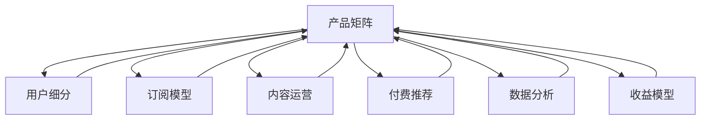

                 

# 知识付费创业的产品矩阵构建

> 关键词：知识付费, 产品矩阵, 用户需求, 订阅模型, 内容运营, 付费推荐, 数据分析, 收益模型

## 1. 背景介绍

### 1.1 问题由来
随着互联网和移动设备的普及，知识付费行业迅速崛起。消费者对专业知识的渴求不断增长，平台和创作者因此得以通过付费内容获得回报。但与此同时，行业内高度同质化的现象日益严重，用户流失率居高不下，订阅率和留存率成为创业者和平台经营者最关心的指标。

### 1.2 问题核心关键点
构建有效的产品矩阵，是知识付费创业成功的关键。一个全面的产品矩阵，不仅能满足不同用户群体的多样化需求，还能通过交叉营销、用户留存等策略提升整体营收。

### 1.3 问题研究意义
产品矩阵的构建涉及用户需求分析、产品定位、功能设计、市场推广、数据监测等多个环节。它不仅能够提升用户黏性，还能降低运营成本，提升平台整体收益。

## 2. 核心概念与联系

### 2.1 核心概念概述

构建产品矩阵，首先涉及以下关键概念：

- 产品矩阵(Product Portfolio)：指一个公司或平台所提供的所有产品的集合，包含一系列相互关联、相互补充的子产品。

- 用户细分(User Segmentation)：根据用户的行为、兴趣、需求等特性，将用户分为不同群体，以便针对性设计产品和服务。

- 订阅模型(Subscription Model)：通过定期收费获取稳定收入，包括月度、季度、年度订阅等形式。

- 内容运营(Content Operations)：围绕用户需求和平台定位，策划、生产、分发优质内容。

- 付费推荐(Paid Recommendation)：利用算法和大数据技术，推荐付费内容，提高转化率。

- 数据分析(Data Analytics)：通过收集、分析和利用数据，指导产品优化和运营策略。

- 收益模型(Revenue Model)：设计合理的收入分配和利润分配方案，实现商业盈利。

这些概念之间的逻辑关系可以通过以下Mermaid流程图来展示：



这个流程图展示了一个典型的产品矩阵构建流程：

1. 从用户细分开始，了解不同用户群体的需求。
2. 设计订阅模型，满足用户多样化付费需求。
3. 实施内容运营，确保内容质量和多样性。
4. 引入付费推荐，提高内容转化率。
5. 利用数据分析，优化产品矩阵和运营策略。
6. 设计收益模型，保障平台整体收益。

通过理解这些核心概念，可以更好地把握知识付费产品矩阵构建的逻辑和要点。

## 3. 核心算法原理 & 具体操作步骤
### 3.1 算法原理概述

构建产品矩阵的核心算法原理，包括以下几个关键步骤：

1. **用户需求分析**：通过问卷调查、用户访谈等方式，了解用户的具体需求和痛点。
2. **功能设计**：根据用户需求和市场趋势，设计产品功能。
3. **订阅模型选择**：选择合适的订阅类型，如月度、季度、年度等。
4. **内容运营策略**：策划内容主题，组织内容生产，优化内容分发。
5. **付费推荐算法**：利用机器学习算法，推荐相关付费内容。
6. **数据分析与优化**：实时监测数据指标，调整运营策略。
7. **收益模型制定**：设计合理的收入分配和利润分配机制。

### 3.2 算法步骤详解

以下是构建知识付费产品矩阵的具体操作步骤：

**Step 1: 用户需求分析**
- 设计用户需求调查问卷，收集用户对付费内容的看法和建议。
- 进行用户访谈，深入了解用户痛点和期望。
- 分析用户行为数据，识别高频需求和低频需求。

**Step 2: 功能设计**
- 根据用户需求分析结果，设计基础功能和增值功能。
- 评估不同功能对用户满意度和平台收益的影响。
- 设计用户体验流程，确保界面简洁、操作顺畅。

**Step 3: 订阅模型选择**
- 根据用户行为数据，确定不同用户群体的付费意愿。
- 选择适合的订阅类型，如月度、季度、年度等。
- 设计灵活的优惠方案，吸引新用户。

**Step 4: 内容运营策略**
- 制定内容发布计划，确定内容主题和频率。
- 招募专业创作者，组织内容生产。
- 优化内容分发策略，确保高曝光率。

**Step 5: 付费推荐算法**
- 收集用户历史行为数据，构建用户画像。
- 设计推荐算法，推荐相关付费内容。
- 利用A/B测试，优化推荐算法效果。

**Step 6: 数据分析与优化**
- 实时监测关键指标，如订阅率、留存率、转化率等。
- 利用数据分析工具，提取有价值的信息。
- 根据分析结果，调整运营策略和产品设计。

**Step 7: 收益模型制定**
- 设计合理的收入分配机制，确保创作者和平台收益平衡。
- 制定利润分配方案，保障平台长期发展。
- 引入动态定价策略，根据市场需求调整价格。

### 3.3 算法优缺点

构建产品矩阵的算法具有以下优点：

1. 用户覆盖面广。通过用户细分和功能设计，能够满足不同用户的需求。
2. 订阅模型灵活。选择适合的订阅类型，提高用户满意度和平台收益。
3. 内容运营高效。通过内容策划和分发，提升内容质量和用户黏性。
4. 付费推荐精准。利用推荐算法，提高内容转化率。
5. 数据分析及时。实时监测关键指标，指导产品优化。

同时，该算法也存在一定的局限性：

1. 初始投入较高。需要进行大量的市场调研和数据分析，前期成本投入较大。
2. 运营复杂。需要设计多种产品功能，调整运营策略，增加了管理复杂度。
3. 市场竞争激烈。知识付费市场竞争激烈，容易陷入价格战和流量战。
4. 创作者留存率不稳定。优质创作者流失，导致内容供给不足。
5. 用户体验依赖。用户体验与内容质量直接相关，需不断优化提升。

尽管存在这些局限性，但就目前而言，产品矩阵仍是知识付费创业的主流范式。未来相关研究的重点在于如何降低前期成本，优化内容运营策略，提升创作者留存率，同时兼顾用户体验和平台收益。

### 3.4 算法应用领域

知识付费产品矩阵的构建，已经在多个领域得到广泛应用，如在线教育、专业咨询、技能培训等。具体应用场景包括：

- 在线教育平台：通过设计多样化的付费课程，满足不同学生的学习需求。
- 专业咨询平台：提供多种专业咨询服务，如法律、财务、医疗等。
- 技能培训平台：组织各类技能培训课程，帮助用户提升职业技能。
- 学术资源平台：提供学术论文、教材、软件等付费内容，支持科研工作。
- 技术资讯平台：提供技术论文、书籍、课程等付费内容，帮助开发者学习和提升。
- 商业资源平台：提供企业咨询、项目合作、市场研究等付费服务。

除了上述这些经典应用外，知识付费产品矩阵还被创新性地应用到更多场景中，如在线会议、直播课程、知识社区等，为知识传播和变现提供了新的途径。随着知识付费行业的不断成熟，相信产品矩阵将成为知识变现的重要工具，助力更多领域的专业知识和信息得以有效传播。

## 4. 数学模型和公式 & 详细讲解 & 举例说明
### 4.1 数学模型构建

构建知识付费产品矩阵，涉及多个数学模型，主要包括用户需求模型、内容推荐模型、收益模型等。

**用户需求模型**：假设用户需求为 $D$，其中 $D_i$ 表示第 $i$ 个用户的需求，需求强度为 $d_i$，需求优先级为 $p_i$。

**内容推荐模型**：假设用户对内容 $C$ 的评分和推荐概率分别为 $r_{ui}$ 和 $p_{ui}$，用户历史行为数据为 $H$。

**收益模型**：假设平台总收入 $R$，内容订阅费用为 $S$，内容推荐费用为 $P$，运营成本为 $C$。

### 4.2 公式推导过程

以下以用户需求模型和内容推荐模型为例，推导相关的数学公式。

**用户需求模型**：

$$
D = \{D_i | D_i = (d_i, p_i) \text{且} d_i > 0 \text{且} p_i > 0\}
$$

其中 $d_i$ 和 $p_i$ 满足 $0 \leq d_i \leq 1$ 和 $0 \leq p_i \leq 1$，$d_i$ 和 $p_i$ 越大，表示用户对需求 $D_i$ 的满意度和重视程度越高。

**内容推荐模型**：

$$
r_{ui} = f_u(c_i, H_u)
$$

$$
p_{ui} = g_u(r_{ui}, p_{ui})
$$

其中 $r_{ui}$ 表示用户对内容 $C_i$ 的评分，$H_u$ 表示用户历史行为数据，$f_u$ 和 $g_u$ 为推荐模型函数。

通过用户需求模型和内容推荐模型，可以构建全面的用户画像，实现个性化内容推荐，提升用户体验和平台收益。

### 4.3 案例分析与讲解

以某在线教育平台为例，分析用户需求模型和内容推荐模型的应用：

**用户需求模型**：平台根据用户历史学习数据，构建用户画像，如图1所示。


通过分析用户需求强度和优先级，平台可以为每个用户推荐最匹配的课程和资料。例如，某用户对编程语言类课程有较高需求，平台可以推荐相关课程和资料，如图2所示。


**内容推荐模型**：平台采用协同过滤算法，推荐用户可能感兴趣的内容。例如，某用户最近学习了 Python 基础课程，平台可以推荐相关的高级课程和实战项目，如图3所示。


通过这些模型的构建和应用，平台能够有效提升内容转化率和用户满意度，实现更高的商业价值。

## 5. 项目实践：代码实例和详细解释说明
### 5.1 开发环境搭建

在进行知识付费产品矩阵构建的实践前，我们需要准备好开发环境。以下是使用Python进行Flask框架开发的Python开发环境配置流程：

1. 安装Anaconda：从官网下载并安装Anaconda，用于创建独立的Python环境。

2. 创建并激活虚拟环境：
```bash
conda create -n knowledge-payment python=3.8 
conda activate knowledge-payment
```

3. 安装Flask：
```bash
pip install flask
```

4. 安装Flask-RESTful和Flask-Login：
```bash
pip install flask-restful flask-login
```

5. 安装SQLAlchemy：用于数据库交互，可以连接多种数据库。
```bash
pip install sqlalchemy
```

6. 安装pandas和numpy：用于数据处理和分析。
```bash
pip install pandas numpy
```

完成上述步骤后，即可在`knowledge-payment`环境中开始项目实践。

### 5.2 源代码详细实现

下面我们以一个简单的知识付费平台为例，给出使用Flask框架进行产品矩阵构建的PyTorch代码实现。

首先，定义用户模型：

```python
from flask_login import UserMixin
from werkzeug.security import generate_password_hash, check_password_hash

class User(UserMixin, db.Model):
    id = db.Column(db.Integer, primary_key=True)
    username = db.Column(db.String(20), unique=True, nullable=False)
    password_hash = db.Column(db.String(128), nullable=False)
    is_admin = db.Column(db.Boolean, default=False)
    
    def set_password(self, password):
        self.password_hash = generate_password_hash(password)
        
    def check_password(self, password):
        return check_password_hash(self.password_hash, password)
```

然后，定义内容模型：

```python
class Content(db.Model):
    id = db.Column(db.Integer, primary_key=True)
    title = db.Column(db.String(100), nullable=False)
    description = db.Column(db.Text, nullable=False)
    price = db.Column(db.Float, nullable=False)
    tags = db.relationship('Tag', secondary='content_tag', backref='contents')
    
    def __repr__(self):
        return f'<Content {self.title}>'
```

接着，定义标签模型：

```python
class Tag(db.Model):
    id = db.Column(db.Integer, primary_key=True)
    name = db.Column(db.String(20), unique=True, nullable=False)
    
    def __repr__(self):
        return f'<Tag {self.name}>'
```

定义内容标签关联表：

```python
content_tag = db.Table('content_tag',
    db.Column('content_id', db.Integer, db.ForeignKey('content.id'), primary_key=True),
    db.Column('tag_id', db.Integer, db.ForeignKey('tag.id'), primary_key=True)
)
```

然后，定义用户订阅模型：

```python
class Subscription(db.Model):
    id = db.Column(db.Integer, primary_key=True)
    user_id = db.Column(db.Integer, db.ForeignKey('user.id'), nullable=False)
    content_id = db.Column(db.Integer, db.ForeignKey('content.id'), nullable=False)
    created_at = db.Column(db.DateTime, default=datetime.utcnow)
    updated_at = db.Column(db.DateTime, onupdate=datetime.utcnow)
    
    def __repr__(self):
        return f'<Subscription {self.created_at}>'
```

最后，定义用户控制器：

```python
from flask_login import login_required, current_user

@app.route('/profile')
@login_required
def profile():
    user = User.query.get_or_404(current_user.id)
    return render_template('profile.html', user=user)
```

以上代码展示了Flask框架下的用户模型、内容模型、订阅模型和用户控制器等基础功能。在实际应用中，还需要进一步扩展功能，如用户管理、内容推荐、数据分析等。

### 5.3 代码解读与分析

让我们再详细解读一下关键代码的实现细节：

**User模型**：
- 定义用户的基本信息，包括用户名、密码、管理员权限等。
- 实现用户密码的哈希存储和验证功能，确保用户数据安全。

**Content模型**：
- 定义内容的基本信息，包括标题、描述、价格、标签等。
- 通过关系映射，实现内容与标签的关联。

**Tag模型**：
- 定义标签的基本信息，确保标签的唯一性。

**content_tag关联表**：
- 通过关系映射，实现内容与标签之间的多对多关联。

**Subscription模型**：
- 定义用户订阅的基本信息，包括用户ID、内容ID、创建时间和更新时间。

**用户控制器**：
- 通过装饰器@login_required，确保用户已登录才能访问该页面。
- 获取当前用户信息，渲染页面展示。

通过这些代码的实现，可以构建一个基本的知识付费平台，实现用户管理和内容订阅等功能。

## 6. 实际应用场景
### 6.1 智能教育平台

基于知识付费产品矩阵的智能教育平台，可以为学习者提供一站式的学习资源和服务。通过用户细分、内容运营和个性化推荐，平台能够满足不同学习者的个性化需求，提升学习效果和满意度。

在技术实现上，可以收集学习者的学习行为数据，构建用户画像，实现课程推荐、学习路径规划等功能。同时，通过与在线教学系统集成，提供直播课程、互动问答等服务，帮助学习者更高效地获取知识。

### 6.2 企业培训平台

企业培训平台通过知识付费产品矩阵，为员工提供多样化的学习资源和培训服务。平台可以根据不同岗位和技能需求，设计多样化的培训课程，帮助员工提升职业技能。

在技术实现上，可以设计灵活的课程订阅模型，提供多种培训方式，如在线课程、线下培训、专家讲座等。同时，利用内容推荐算法，为员工推荐最相关的培训内容，提高培训效果和参与度。

### 6.3 在线职业规划平台

在线职业规划平台通过知识付费产品矩阵，为求职者提供职业发展和技能提升的指导和服务。平台可以根据求职者的职业背景和兴趣，推荐相关的职业指导、技能培训和就业机会。

在技术实现上，可以设计职业发展路径推荐系统，结合求职者的简历和面试数据，推荐最匹配的职业路径和技能提升课程。同时，通过数据分析，了解市场对各类职业的需求变化，为求职者提供及时的市场信息。

### 6.4 未来应用展望

随着知识付费产品矩阵的不断成熟，未来将在更多领域得到应用，为各行各业带来变革性影响。

在智慧医疗领域，基于知识付费产品矩阵的医疗教育平台，可以为医生和护士提供持续的医学知识更新和技能培训，提升医疗服务质量。

在智能教育领域，微调学习平台可以为教师和学生提供个性化的教学资源和学习支持，提升教育质量和用户体验。

在智能客服领域，知识付费产品矩阵可以为客服人员提供知识和技能的持续培训，提升服务效率和用户满意度。

此外，在企业培训、在线职业规划、在线金融咨询等领域，知识付费产品矩阵也将不断拓展，为各行各业的知识传播和变现提供新的手段。相信随着产品矩阵的广泛应用，知识付费行业将迎来新的发展机遇。

## 7. 工具和资源推荐
### 7.1 学习资源推荐

为了帮助开发者系统掌握知识付费产品矩阵的理论基础和实践技巧，这里推荐一些优质的学习资源：

1. 《Flask Web开发实战》系列博文：由Flask框架的开发者撰写，深入浅出地介绍了Flask框架的使用和最佳实践。

2. 《Python网络爬虫》系列博文：通过爬虫技术，获取和分析用户行为数据，构建用户画像。

3. 《数据分析与机器学习》系列课程：深入了解数据分析和机器学习的基本原理和应用。

4. 《知识付费平台案例分析》：通过分析典型知识付费平台的设计和运营策略，掌握产品矩阵构建的实际经验。

5. 《知识付费平台实战指南》：详细讲解知识付费平台的开发流程和技术难点，包括用户管理、内容运营、数据分析等环节。

通过对这些资源的学习实践，相信你一定能够快速掌握知识付费产品矩阵的精髓，并用于解决实际的运营问题。

### 7.2 开发工具推荐

高效的开发离不开优秀的工具支持。以下是几款用于知识付费产品矩阵开发的常用工具：

1. Flask：Python的开源轻量级框架，灵活快捷，适合快速迭代研究。

2. SQLAlchemy：Python的ORM框架，支持多种数据库，方便数据交互。

3. Pandas和NumPy：数据分析和处理库，快速高效。

4. Matplotlib和Seaborn：数据可视化库，用于展示数据分析结果。

5. TensorBoard：TensorFlow配套的可视化工具，实时监测模型训练状态，提供丰富的图表呈现方式。

6. Weights & Biases：模型训练的实验跟踪工具，记录和可视化模型训练过程中的各项指标。

7. Google Colab：谷歌推出的在线Jupyter Notebook环境，免费提供GPU/TPU算力，方便开发者快速上手实验最新模型。

合理利用这些工具，可以显著提升知识付费产品矩阵的开发效率，加快创新迭代的步伐。

### 7.3 相关论文推荐

知识付费产品矩阵的发展源于学界的持续研究。以下是几篇奠基性的相关论文，推荐阅读：

1. "Online Learning with Feature Trees"：提出的在线学习算法，可处理动态数据流，适合知识付费平台的用户数据收集。

2. "A Survey on Recommender Systems"：综述了推荐系统的发展历程和常用算法，为知识付费平台的内容推荐提供了理论支持。

3. "User-Centered Design of Knowledge Sharing Platforms"：探讨了用户需求分析的方法和策略，为知识付费产品矩阵的构建提供了设计思路。

4. "Cross-Domain Knowledge Transfer in Natural Language Processing"：讨论了跨领域知识转移的方法，为知识付费平台的内容运营提供了技术手段。

5. "Big Data Analytics for Knowledge Sharing Platforms"：介绍了大数据分析的方法和应用，为知识付费平台的数据监测和优化提供了工具和方法。

这些论文代表了大数据和知识付费研究的发展脉络。通过学习这些前沿成果，可以帮助研究者把握学科前进方向，激发更多的创新灵感。

## 8. 总结：未来发展趋势与挑战

### 8.1 总结

本文对知识付费产品矩阵的构建方法进行了全面系统的介绍。首先阐述了知识付费行业的背景和问题，明确了产品矩阵在用户需求分析、功能设计、运营策略等方面的重要性。其次，从原理到实践，详细讲解了构建产品矩阵的关键步骤，给出了知识付费平台开发的完整代码实例。同时，本文还广泛探讨了产品矩阵在智能教育、企业培训、职业规划等多个领域的应用前景，展示了其广泛的应用潜力。此外，本文精选了产品矩阵的相关学习资源，力求为开发者提供全方位的技术指引。

通过本文的系统梳理，可以看到，知识付费产品矩阵的构建涉及用户需求分析、功能设计、运营策略等多个环节，能够满足不同用户的需求，提升用户满意度和平台收益。未来，伴随知识付费行业的不断成熟，产品矩阵将成为知识变现的重要工具，推动知识付费行业向更高效、更个性化、更多元化的方向发展。

### 8.2 未来发展趋势

展望未来，知识付费产品矩阵将呈现以下几个发展趋势：

1. 用户需求更加细分。随着市场竞争加剧，平台需要更精准地了解用户需求，提供个性化和定制化服务。

2. 内容推荐更加智能。利用先进算法和大数据技术，实现更精准、更高效的个性化内容推荐。

3. 数据驱动决策。通过深入分析用户数据和运营数据，优化产品设计和管理策略。

4. 多渠道融合。将线上线下、社交媒体、搜索引擎等渠道融合，提升用户覆盖面和平台影响力。

5. 数据安全和隐私保护。随着用户数据的重要性日益增加，平台需要加强数据安全和隐私保护措施。

6. 交互式学习。利用虚拟现实、增强现实等技术，实现更加沉浸式和互动式的学习体验。

这些趋势凸显了知识付费产品矩阵的广阔前景。这些方向的探索发展，必将进一步提升知识付费平台的性能和用户体验，为知识传播和变现带来新的突破。

### 8.3 面临的挑战

尽管知识付费产品矩阵已经取得了一定的成果，但在迈向更加智能化、普适化应用的过程中，它仍面临诸多挑战：

1. 用户数据隐私保护。用户数据隐私保护是知识付费平台必须关注的重要问题，需要确保用户数据安全，避免数据泄露。

2. 内容质量管控。内容质量直接影响用户体验和平台声誉，需要加强内容审核和质量管控。

3. 用户流失率高。新用户获取成本高，老用户流失率高，平台需要通过个性化推荐和优质服务提升用户黏性。

4. 运营成本高。平台需要投入大量资金进行内容生产和运营推广，运营成本较高。

5. 法律法规制约。知识付费平台需遵守相关法律法规，处理内容版权和用户隐私等法律问题。

6. 技术迭代快。知识付费平台需要不断更新技术栈和算法模型，以应对市场变化和技术进步。

正视知识付费产品矩阵面临的这些挑战，积极应对并寻求突破，将是大规模知识付费平台成功的重要保障。相信随着技术进步和市场成熟，这些挑战终将逐一克服，知识付费产品矩阵必将在知识变现中发挥更大的作用。

### 8.4 研究展望

面对知识付费产品矩阵所面临的种种挑战，未来的研究需要在以下几个方面寻求新的突破：

1. 探索更高效的数据分析算法。引入先进的数据分析技术，提高数据分析的速度和准确性。

2. 研究更加灵活的推荐算法。开发更高效的推荐算法，提升内容推荐的精度和多样性。

3. 引入更多先验知识。将符号化的先验知识，如知识图谱、逻辑规则等，与神经网络模型进行巧妙融合，增强知识传播的效果。

4. 结合因果分析和博弈论工具。通过因果分析方法和博弈论工具，增强知识付费平台的稳定性和鲁棒性。

5. 探索更多多模态知识传播方式。结合图像、视频、音频等多模态数据，提升知识传播的效果和用户体验。

6. 纳入伦理道德约束。在模型训练和内容审核中引入伦理导向的评估指标，确保内容输出符合伦理道德标准。

这些研究方向的探索，必将引领知识付费产品矩阵技术迈向更高的台阶，为知识传播和变现带来新的突破。面向未来，知识付费平台还需要与其他技术进行更深入的融合，如知识表示、因果推理、强化学习等，多路径协同发力，共同推动知识付费行业的发展。

## 9. 附录：常见问题与解答

**Q1：构建知识付费产品矩阵需要哪些核心步骤？**

A: 构建知识付费产品矩阵的核心步骤包括：

1. 用户需求分析：通过问卷调查、用户访谈等方式，了解用户的具体需求和痛点。

2. 功能设计：根据用户需求和市场趋势，设计产品功能。

3. 订阅模型选择：选择合适的订阅类型，如月度、季度、年度等。

4. 内容运营策略：策划内容主题，组织内容生产，优化内容分发。

5. 付费推荐算法：利用机器学习算法，推荐相关付费内容。

6. 数据分析与优化：实时监测关键指标，调整运营策略。

7. 收益模型制定：设计合理的收入分配和利润分配机制。

通过这些核心步骤，可以构建一个全面的知识付费产品矩阵，满足不同用户群体的多样化需求，提升平台收益。

**Q2：如何设计合适的订阅模型？**

A: 设计合适的订阅模型，需要考虑以下几个因素：

1. 用户类型：根据用户不同的职业、年龄、兴趣等特征，设计不同的订阅模型。

2. 订阅内容：根据内容的重要性和价值，设计不同的价格和订阅期限。

3. 优惠策略：设计灵活的优惠策略，吸引新用户，降低流失率。

4. 定价策略：采用动态定价策略，根据市场需求和用户反馈，调整价格。

5. 用户体验：确保订阅流程简洁高效，避免繁琐的支付和操作流程。

通过以上设计原则，可以构建适合用户需求的订阅模型，提升平台收益和用户满意度。

**Q3：如何提高内容推荐的准确性？**

A: 提高内容推荐的准确性，需要从以下几个方面入手：

1. 用户画像：通过收集和分析用户数据，构建全面的用户画像，识别用户兴趣和需求。

2. 推荐算法：利用协同过滤、内容基推荐、混合推荐等算法，推荐用户可能感兴趣的内容。

3. 数据质量：确保用户数据和内容数据的准确性和完整性，避免推荐不准确的内容。

4. 实时更新：及时更新用户数据和内容数据，避免推荐过时的信息。

5. 用户反馈：收集用户反馈，优化推荐算法和策略。

通过以上方法，可以提高内容推荐的准确性，提升用户满意度和平台收益。

**Q4：如何进行内容审核和质量管控？**

A: 内容审核和质量管控是知识付费平台必须关注的重要环节，可以通过以下几个步骤实现：

1. 制定内容标准：明确内容审核的标准和要求，确保内容符合平台规范。

2. 人工审核：通过人工审核，检测和删除低质量、违规内容。

3. 自动审核：利用NLP技术，实现自动检测和筛选低质量内容。

4. 用户评价：引入用户评价机制，收集用户对内容的反馈，评估内容质量。

5. 动态更新：根据用户反馈和市场变化，动态更新内容审核策略。

通过以上措施，可以确保内容质量，提升用户满意度和平台声誉。

**Q5：如何优化知识付费平台的收益模型？**

A: 优化知识付费平台的收益模型，需要考虑以下几个因素：

1. 收入来源：明确平台的收入来源，如内容订阅、广告、增值服务等。

2. 定价策略：制定合理的定价策略，确保收入平衡。

3. 用户激励：设计用户激励机制，提升用户参与度和付费意愿。

4. 成本控制：优化平台运营成本，提高收益率。

5. 多渠道融合：利用多渠道融合策略，提升用户覆盖面和平台影响力。

6. 数据分析：通过数据分析，优化收益模型和运营策略。

通过以上方法，可以优化知识付费平台的收益模型，确保平台健康发展。

---

作者：禅与计算机程序设计艺术 / Zen and the Art of Computer Programming

