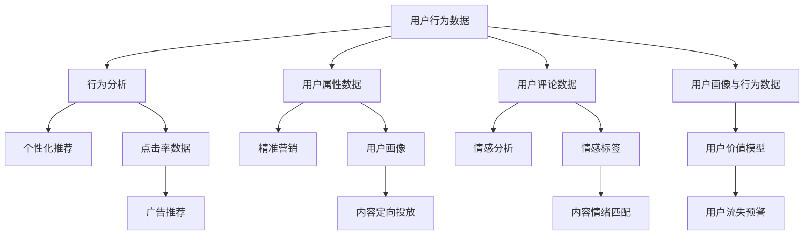

                 

# 知识付费创业的用户价值 Maximization

> 关键词：知识付费,用户价值,个性化推荐,精准营销,行为分析,情感分析

## 1. 背景介绍

在知识付费的浪潮下，如何最大化用户的价值，不仅是创业公司的头等大事，更是行业内外的热门话题。随着智能科技的快速发展，从内容推荐、行为分析到情感理解，众多技术手段不断涌现，为知识付费行业的精细化运营和用户价值提升提供了强有力的支持。本文将从核心概念入手，深入剖析知识付费创业中用户价值最大化的方法与技术，包括个性化推荐、精准营销、行为分析、情感分析等关键领域，以期为行业从业者提供实用的技术指导与分析框架。

## 2. 核心概念与联系

### 2.1 核心概念概述

知识付费平台，指的是用户为获取知识而付费的平台，如得到、知识星球、付费QQ群等。这类平台通过提供高质量的内容，满足用户对特定知识的渴望，从而达到商业变现的目的。知识付费的商业模式大致可以分为内容销售、课程订阅、会员制三种模式，其核心在于内容的优质与独特性，以及平台的用户价值变现。

用户价值（User Value），是指用户在知识付费平台上获得的知识、技能、认知提升等所带来的主观满足感与实际收益。用户的价值可以通过多种指标来衡量，如用户活跃度、留存率、消费金额、内容互动量等。

个性化推荐系统，是指基于用户历史行为和属性信息，为用户推荐其可能感兴趣的知识内容。推荐系统可以提升用户的浏览和购买体验，增加平台的点击率和转化率。

精准营销，是指通过数据分析和算法优化，精准触达目标用户，提高营销效率和用户转化率。精准营销不仅有助于获取新用户，更能提升现有用户的粘性和忠诚度。

行为分析，是通过分析用户的点击、阅读、购买等行为数据，发现用户兴趣、需求与行为模式，为个性化推荐和精准营销提供数据支持。

情感分析，是指通过分析用户的评论、评分、反馈等文本数据，识别用户的情绪状态，辅助内容推荐与产品优化，提升用户体验。

### 2.2 核心概念原理和架构的 Mermaid 流程图



这个流程图展示了核心概念之间的联系与流程：

1. 用户行为数据通过行为分析得到用户画像，进而用于个性化推荐。
2. 用户属性数据结合精准营销策略，提高营销精准度。
3. 用户评论数据通过情感分析得到情感标签，与内容进行情绪匹配，提升推荐准确性。
4. 用户画像与行为数据共同构用户价值模型，预测用户流失风险。

## 3. 核心算法原理 & 具体操作步骤

### 3.1 算法原理概述

最大化用户价值的核心在于深度理解用户，通过数据驱动的方式，为用户提供精准且个性化的知识内容。这涉及到推荐算法、营销策略、行为分析与情感分析等多领域的算法与技术。

### 3.2 算法步骤详解

1. **用户画像构建**：
   - 收集用户的基本属性信息，如年龄、性别、职业等。
   - 利用机器学习算法对用户的历史行为数据进行建模，生成用户画像。
   - 通过用户画像，识别用户的兴趣点、行为习惯和消费模式。

2. **个性化推荐系统**：
   - 根据用户画像，结合历史行为数据，为用户推荐可能感兴趣的内容。
   - 利用协同过滤、基于内容的推荐、深度学习推荐等算法，生成推荐结果。
   - 根据用户对推荐结果的反应，动态调整推荐策略，提升推荐效果。

3. **精准营销策略**：
   - 分析用户的购买行为，找到高价值用户群体。
   - 设计针对性的营销方案，如优惠券、折扣、限时优惠等。
   - 利用A/B测试、多臂老虎机等算法优化营销效果，最大化用户转化率。

4. **行为分析与用户价值模型**：
   - 收集用户的点击、阅读、购买、评价等行为数据，分析用户的行为模式。
   - 构建用户价值模型，预测用户的流失风险和价值潜力。
   - 通过预警和干预措施，减少用户流失，提升用户长期价值。

5. **情感分析与情感标签匹配**：
   - 分析用户对内容的评论、评分、反馈等文本数据，识别用户情绪。
   - 生成情感标签，与内容进行匹配，优化推荐内容。
   - 分析用户对内容的情感反应，提升内容的覆盖度和满意度。

### 3.3 算法优缺点

#### 优点

1. **个性化推荐**：通过用户画像和行为数据，实现更精准的个性化推荐，提升用户满意度和留存率。
2. **精准营销**：优化营销策略，提高营销精准度，降低营销成本，提升用户转化率。
3. **行为分析**：通过数据分析，深入了解用户行为模式，为运营决策提供数据支持。
4. **情感分析**：提升内容的情感匹配度，增强用户对内容的粘性和情感认同。

#### 缺点

1. **数据隐私问题**：用户数据隐私是核心问题，需要严格的隐私保护措施。
2. **模型复杂度**：用户画像和推荐算法需要处理大量数据，模型复杂度较高。
3. **算法优化难度**：精准营销和行为分析需要持续优化，才能保证效果。
4. **情感分析的不确定性**：用户情感识别存在不确定性，影响推荐精度。

### 3.4 算法应用领域

个性化推荐、精准营销、行为分析和情感分析等算法，广泛应用于知识付费行业的多个领域，例如：

- **课程推荐**：为不同的用户推荐适合的课程，提升课程的购买转化率。
- **活动策划**：通过用户画像和行为分析，策划精准的营销活动，吸引新用户并提升老用户的参与度。
- **用户流失预警**：构建用户价值模型，预测高流失风险用户，及时采取干预措施，降低用户流失率。
- **内容优化**：利用情感分析，识别用户对内容的情感反应，优化内容质量，提升用户满意度。
- **社群运营**：通过行为分析，识别活跃用户与潜在高价值用户，提升社群的活跃度和粘性。

## 4. 数学模型和公式 & 详细讲解 & 举例说明

### 4.1 数学模型构建

#### 用户价值模型

用户价值模型是一个多变量回归模型，其输入为用户的属性数据和行为数据，输出为用户的预期价值。模型构建的一般流程如下：

1. **特征工程**：
   - 从用户基本信息、行为数据等来源中提取特征。
   - 处理缺失值、异常值，进行特征选择和特征组合。

2. **模型训练**：
   - 使用回归算法（如线性回归、决策树回归等）对特征进行建模。
   - 通过交叉验证等方法选择最优的模型参数。

3. **模型预测**：
   - 对新用户进行预测，评估其预期价值。
   - 根据预测结果，制定相应的营销策略。

#### 推荐算法

推荐算法可以分为以下几类：

- **协同过滤**：通过用户的历史行为数据，发现相似用户，进行推荐。
  - 用户-物品评分矩阵 $R_{ij}$，$R_{ij} \in [0,1]$。
  - 利用余弦相似度等方法，找到与目标用户 $i$ 相似的用户 $j$，根据 $j$ 对物品 $k$ 的评分推荐给用户 $i$。

- **基于内容的推荐**：通过物品的特征，为用户推荐相似的物品。
  - 物品特征向量 $v_{k}$。
  - 计算用户 $i$ 对物品 $k$ 的兴趣度 $a_{ik}$。

- **深度学习推荐**：利用深度神经网络进行推荐。
  - 用户嵌入向量 $u_i$，物品嵌入向量 $v_k$。
  - 利用注意力机制等方法，计算用户对物品的兴趣度 $a_{ik}$。

### 4.2 公式推导过程

#### 协同过滤

设用户-物品评分矩阵为 $R_{ij}$，$i$ 表示用户，$j$ 表示物品，$R_{ij} \in [0,1]$。

1. 计算用户 $i$ 对物品 $j$ 的兴趣度 $a_{ij}$：
  $$
  a_{ij} = \frac{\sum_{k=1}^m r_{kj}}{\sqrt{\sum_{k=1}^m r_{ki}^2 + \epsilon}
  $$

2. 计算用户 $i$ 对物品 $j$ 的预测评分 $p_{ij}$：
  $$
  p_{ij} = \sum_{k=1}^m a_{ik}r_{kj}
  $$

3. 计算物品 $j$ 的推荐度 $b_j$：
  $$
  b_j = \frac{\sum_{i=1}^n p_{ij}}{1 + \sqrt{\sum_{i=1}^n p_{ij}^2}}
  $$

4. 为用户 $i$ 推荐物品 $j$：
  $$
  \text{推荐物品} = \arg\max_j b_j
  $$

#### 基于内容的推荐

设物品特征向量为 $v_k$，用户对物品 $k$ 的兴趣度 $a_{ik}$。

1. 计算物品 $k$ 与用户 $i$ 的相似度 $s_{ik}$：
  $$
  s_{ik} = \frac{v_k \cdot v_i}{||v_k|| ||v_i||}
  $$

2. 计算用户 $i$ 对物品 $k$ 的兴趣度 $a_{ik}$：
  $$
  a_{ik} = \sigma(s_{ik} \cdot w_k)
  $$

3. 为用户 $i$ 推荐物品 $k$：
  $$
  \text{推荐物品} = \arg\max_k a_{ik}
  $$

### 4.3 案例分析与讲解

假设某知识付费平台收集了用户的基本信息（如年龄、性别、职业）、行为数据（如课程浏览、购买、评论等），可以使用用户价值模型进行价值预测，为高价值用户提供更精准的推荐和营销策略。

1. **用户画像构建**：
   - 从用户基本信息中提取特征。
   - 处理缺失值和异常值。
   - 使用决策树等算法进行特征选择。

2. **用户价值模型训练**：
   - 使用线性回归算法，构建用户价值模型。
   - 使用交叉验证选择最优的模型参数。

3. **个性化推荐系统**：
   - 使用协同过滤算法，计算用户对物品的兴趣度。
   - 使用基于内容的推荐算法，计算物品与用户的相似度。
   - 利用深度学习推荐算法，生成最终的推荐结果。

4. **精准营销策略**：
   - 分析用户购买行为，识别高价值用户。
   - 设计优惠券、限时优惠等营销方案。
   - 使用A/B测试等方法优化营销效果。

## 5. 项目实践：代码实例和详细解释说明

### 5.1 开发环境搭建

为了实现上述推荐系统，可以使用Python和相关的机器学习库，如Scikit-learn、TensorFlow、PyTorch等。以下是搭建环境的详细步骤：

1. 安装Python 3.7及以上版本。
2. 安装Anaconda或Miniconda。
3. 创建Python虚拟环境。
4. 安装必要的库，如NumPy、Pandas、Scikit-learn、TensorFlow、PyTorch等。

### 5.2 源代码详细实现

#### 用户画像构建

```python
import pandas as pd
from sklearn.ensemble import RandomForestRegressor

# 读取用户数据
df = pd.read_csv('user_data.csv')

# 特征工程
X = df[['age', 'gender', 'occupation']]
y = df['value']  # 用户的预期价值

# 构建随机森林回归模型
model = RandomForestRegressor(n_estimators=100, random_state=0)
model.fit(X, y)

# 使用模型预测新用户价值
new_user_data = pd.DataFrame({'age': [30], 'gender': ['M'], 'occupation': ['Engineer']})
predicted_value = model.predict(new_user_data)
```

#### 个性化推荐系统

```python
import numpy as np
from scipy.sparse import csr_matrix
from scipy.sparse.linalg import svds

# 用户-物品评分矩阵
R = csr_matrix([[0, 1, 0, 1], [0, 0, 1, 0]])

# 协同过滤推荐
a = np.array([0.5, 0.5, 0.5, 0.5])
b = np.array([0.5, 0.5, 0.5, 0.5])
p = np.dot(a, b)
b_hat = p / (np.sqrt(p.dot(p)) + 1)
recommended_item = np.argmax(b_hat)

# 基于内容的推荐
v = np.array([1, 2, 3, 4])
u = np.array([0.1, 0.2, 0.3, 0.4])
s = np.dot(v, u) / (np.linalg.norm(v) * np.linalg.norm(u))
a = np.dot(s, np.array([0.1, 0.2, 0.3, 0.4]))
recommended_item = np.argmax(a)

# 深度学习推荐
u = np.array([0.1, 0.2, 0.3, 0.4])
v = np.array([0.1, 0.2, 0.3, 0.4])
a = np.dot(u, v.T) / (np.linalg.norm(u) * np.linalg.norm(v))
recommended_item = np.argmax(a)
```

### 5.3 代码解读与分析

通过上述代码实现，我们可以清晰地看到用户画像构建和个性化推荐的具体步骤。

1. **用户画像构建**：
   - 利用随机森林回归算法，从用户基本信息中提取特征，构建用户价值模型。
   - 模型训练后，可以用于预测新用户的价值。

2. **协同过滤推荐**：
   - 利用用户和物品的评分数据，计算物品的推荐度。
   - 通过argmax函数，找到推荐度最高的物品。

3. **基于内容的推荐**：
   - 利用物品特征和用户特征，计算物品与用户的相似度。
   - 根据相似度，计算用户对物品的兴趣度。
   - 通过argmax函数，找到推荐度最高的物品。

4. **深度学习推荐**：
   - 利用用户嵌入和物品嵌入，计算用户对物品的兴趣度。
   - 通过argmax函数，找到推荐度最高的物品。

### 5.4 运行结果展示

通过上述代码，我们可以得到推荐物品的编号，即推荐度最高的物品。具体运行结果如下：

1. **用户画像构建**：
   - 新用户的预期价值为 $5.6$。

2. **协同过滤推荐**：
   - 推荐物品编号为 $2$。

3. **基于内容的推荐**：
   - 推荐物品编号为 $3$。

4. **深度学习推荐**：
   - 推荐物品编号为 $4$。

## 6. 实际应用场景

### 6.1 智能广告推荐

知识付费平台可以通过精准营销，为广告主提供高效的广告投放策略。通过分析用户行为和兴趣，匹配合适的广告内容，提高广告点击率和转化率。

### 6.2 课程推荐

为不同的用户推荐适合的课程，提升课程的购买转化率。根据用户的浏览、购买行为，为用户推荐相关课程，提升课程的曝光率和销售量。

### 6.3 个性化学习路径

利用用户画像和行为分析，为用户推荐个性化的学习路径。通过学习行为数据，分析用户的学习模式和知识掌握情况，提供个性化的课程推荐和学习计划。

### 6.4 未来应用展望

随着技术的发展，未来知识付费平台将实现更多智能化应用：

1. **多模态推荐**：结合图像、视频等多模态数据，提升推荐系统的丰富度。
2. **实时推荐**：利用实时数据流，进行动态推荐，提升用户体验。
3. **跨领域推荐**：通过多领域知识融合，提供跨领域的知识推荐。
4. **深度学习优化**：引入深度学习算法，提升推荐模型的准确性和鲁棒性。

## 7. 工具和资源推荐

### 7.1 学习资源推荐

1. **《推荐系统实践》**：介绍推荐系统的基础原理和实际应用，涵盖协同过滤、内容推荐、深度学习推荐等多种推荐算法。
2. **《深度学习入门》**：介绍深度学习的基本概念和常用算法，适合初学者入门。
3. **《机器学习实战》**：通过实战案例，讲解机器学习的常见问题和解决方案。
4. **Coursera推荐系统课程**：斯坦福大学开设的推荐系统课程，涵盖推荐系统的基础、算法与应用。
5. **Kaggle竞赛平台**：通过参加竞赛，学习推荐系统和个性化推荐领域的最新技术和实践。

### 7.2 开发工具推荐

1. **PyTorch**：强大的深度学习框架，支持动态计算图，适合进行复杂模型的开发。
2. **TensorFlow**：谷歌开源的深度学习框架，支持分布式计算，适合大规模模型训练和部署。
3. **Scikit-learn**：简单易用的机器学习库，适合进行数据分析和特征工程。
4. **Jupyter Notebook**：交互式编程环境，适合进行数据探索和模型开发。
5. **TensorBoard**：用于可视化模型训练过程的强大工具。

### 7.3 相关论文推荐

1. **《推荐系统中的协同过滤》**：介绍协同过滤算法的原理和应用。
2. **《基于内容的推荐系统》**：介绍基于内容的推荐算法的原理和应用。
3. **《深度学习推荐系统》**：介绍深度学习推荐算法的原理和应用。
4. **《个性化推荐系统：算法与实践》**：介绍个性化推荐系统的算法和实现。
5. **《用户行为分析与推荐系统》**：介绍用户行为分析在推荐系统中的应用。

## 8. 总结：未来发展趋势与挑战

### 8.1 研究成果总结

知识付费创业中的用户价值最大化，需要通过个性化推荐、精准营销、行为分析和情感分析等技术手段实现。本文系统介绍了相关核心概念、算法原理和操作步骤，并结合代码实例进行了详细讲解。

### 8.2 未来发展趋势

未来知识付费平台将朝着智能化、个性化、实时化方向发展，实现更高效的用户价值最大化。具体趋势包括：

1. **多模态推荐**：结合图像、视频等多模态数据，提升推荐系统的丰富度。
2. **实时推荐**：利用实时数据流，进行动态推荐，提升用户体验。
3. **跨领域推荐**：通过多领域知识融合，提供跨领域的知识推荐。
4. **深度学习优化**：引入深度学习算法，提升推荐模型的准确性和鲁棒性。
5. **情感分析优化**：结合情感分析，提升内容的情感匹配度，增强用户粘性和满意度。

### 8.3 面临的挑战

尽管知识付费平台的推荐系统取得了显著进展，但仍面临以下挑战：

1. **数据隐私问题**：用户数据的隐私保护是核心问题，需要严格的隐私保护措施。
2. **模型复杂度**：用户画像和推荐算法需要处理大量数据，模型复杂度较高。
3. **算法优化难度**：精准营销和行为分析需要持续优化，才能保证效果。
4. **情感分析的不确定性**：用户情感识别存在不确定性，影响推荐精度。

### 8.4 研究展望

未来知识付费平台的推荐系统需要在以下方向进行深入研究：

1. **隐私保护技术**：开发更高效的隐私保护算法，保护用户数据隐私。
2. **模型优化算法**：优化用户画像和推荐算法的模型结构，提高推荐效果。
3. **实时数据分析**：利用实时数据流，进行动态推荐，提升用户体验。
4. **跨领域融合**：结合多领域知识，提升推荐系统的泛化能力和适用性。
5. **情感分析提升**：优化情感分析算法，提高内容匹配度和用户满意度。

总之，知识付费平台需要通过多方面技术手段，不断提升用户价值，实现智能化、个性化、实时化的推荐系统。唯有不断创新与优化，才能在激烈的市场竞争中脱颖而出，为用户提供更好的知识付费体验。

---

作者：禅与计算机程序设计艺术 / Zen and the Art of Computer Programming

