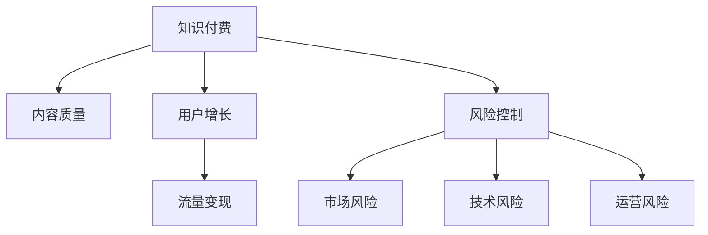

                 

# 知识付费创业的风险控制策略

在互联网时代，知识付费逐渐成为一种重要的商业模式，帮助人们高效获取知识，提升个人能力。然而，创业并非易事，尤其是在知识付费领域，需要考虑多方面的风险，并采取有效策略进行风险控制。本文将深入探讨知识付费创业的风险控制策略，通过逻辑清晰、结构紧凑、简单易懂的语言，为你提供全面的技术指导。

## 1. 背景介绍

### 1.1 问题由来
随着互联网的普及和知识经济的崛起，知识付费已成为一种快速增长的新兴行业。在线教育、知识分享、技术交流等领域的知识付费平台层出不穷，但同时也面临着激烈的市场竞争、用户需求变化、商业模式创新等多重挑战。创业者的成功不仅取决于市场洞察力和技术实力，更需要严谨的风险控制策略。

### 1.2 问题核心关键点
知识付费创业的核心在于如何提供有价值的知识内容，满足用户的学习需求，并实现商业模式的可持续盈利。风险控制策略则涵盖了内容质量管理、用户增长策略、流量变现路径等方面，旨在确保知识付费平台能够稳健发展，规避潜在的风险。

## 2. 核心概念与联系

### 2.1 核心概念概述
为了更好地理解知识付费创业的风险控制策略，本节将介绍几个密切相关的核心概念：

- 知识付费：通过在线平台提供专业知识和技能，用户为获取知识而支付费用的商业模式。
- 内容质量：平台提供知识内容的深度、广度和适用性，直接影响用户体验和满意度。
- 用户增长：吸引并留住用户，扩大市场份额，是知识付费平台成功的关键。
- 流量变现：将用户流量转化为付费用户，实现商业模式闭环。
- 风险控制：通过有效的策略和方法，规避市场风险、技术风险、运营风险等，保障知识付费平台的健康发展。

这些核心概念之间的逻辑关系可以通过以下Mermaid流程图来展示：



这个流程图展示了这个框架下各概念之间的关系：

1. 知识付费平台的核心在于内容质量。
2. 用户增长策略和流量变现路径是知识付费平台成功的关键环节。
3. 风险控制是保障平台稳健发展的基础，包括市场、技术和运营等多方面风险。

这些概念共同构成了知识付费创业的风险控制策略框架，有助于我们全面考虑和处理可能面临的各类风险。

## 3. 核心算法原理 & 具体操作步骤
### 3.1 算法原理概述

知识付费创业的风险控制策略，核心在于构建一个有效的生态系统，保障内容质量，吸引并留住用户，同时将用户流量高效转化为付费用户。这需要从数据收集、用户行为分析、推荐算法等多个方面入手，通过精准的数据分析和智能推荐，提升用户体验，提高用户转化率。

### 3.2 算法步骤详解

构建知识付费平台的风险控制策略，主要包括以下几个关键步骤：

**Step 1: 数据收集与管理**
- 收集用户行为数据，包括点击、浏览、购买等行为，记录用户偏好和消费习惯。
- 收集内容质量数据，包括用户评分、评论、互动等，评估内容质量和用户满意度。
- 确保数据的实时性和准确性，建立数据仓库，存储和管理数据。

**Step 2: 用户行为分析**
- 利用数据挖掘和机器学习技术，分析用户行为模式，识别高价值用户和潜在客户。
- 通过用户画像构建，个性化推荐用户可能感兴趣的内容，提升用户体验和黏性。
- 定期更新用户画像，根据用户行为变化调整推荐策略。

**Step 3: 推荐算法设计**
- 设计推荐算法，基于用户行为和内容质量数据，预测用户可能感兴趣的内容。
- 采用协同过滤、内容推荐、混合推荐等算法，实现个性化的内容推荐。
- 不断优化算法模型，提升推荐准确度和用户满意度。

**Step 4: 风险评估与预警**
- 建立风险评估指标体系，包括用户流失率、内容质量指标、推荐准确度等。
- 通过实时监控和分析，及时发现潜在风险，采取相应措施进行预警和干预。
- 定期进行风险评估，评估风险控制策略的有效性，调整策略以应对变化。

**Step 5: 策略实施与优化**
- 根据风险评估结果，实施风险控制策略，如改进推荐算法、优化用户体验、调整营销策略等。
- 通过A/B测试等方法，评估策略实施效果，优化用户体验和转化率。
- 持续收集用户反馈，不断迭代和优化推荐算法和风险控制策略。

### 3.3 算法优缺点

知识付费创业的风险控制策略具有以下优点：
1. 提升用户体验。通过精准推荐和内容优化，提升用户满意度和黏性，延长用户生命周期。
2. 提高用户转化率。通过用户行为分析，精准识别和触达高价值用户，提升付费转化率。
3. 风险预警及时。通过实时监控和预警机制，及时发现并应对潜在风险，保障平台健康发展。
4. 优化策略效果。通过持续的数据收集和策略调整，不断优化推荐算法和风险控制策略。

同时，该策略也存在一定的局限性：
1. 数据依赖度高。风险控制策略的效果高度依赖于数据的质量和完备性，数据收集和处理需要大量的资源投入。
2. 技术复杂度高。推荐算法的设计和优化需要深厚的技术积累，难以快速部署和实施。
3. 用户隐私问题。用户数据的收集和使用可能引发隐私保护问题，需要严格遵守相关法律法规。
4. 模型泛化性不足。推荐算法可能过度拟合历史数据，难以泛化到新用户和新内容。

尽管存在这些局限性，但就目前而言，基于数据驱动的风险控制策略仍是大规模知识付费平台的首选方案。未来相关研究的重点在于如何进一步降低数据依赖，提升模型泛化性，同时兼顾用户隐私保护和隐私保护等因素。

### 3.4 算法应用领域

基于知识付费创业的风险控制策略，已经在诸多领域得到了应用，包括在线教育、技术交流、职业培训等。具体而言：

- 在线教育平台：通过个性化推荐，提升课程完成率和学员满意度。
- 技术交流平台：利用数据分析和推荐算法，精准匹配技术需求和专家资源。
- 职业培训平台：根据学员的学习行为，推荐适合的培训课程和职业发展建议。

除了这些经典应用外，知识付费创业的风险控制策略还被创新性地应用到更多场景中，如智能客服、内容电商等，为知识付费领域带来了新的突破。随着技术的不断进步，相信知识付费创业的风险控制策略将更加成熟，为知识付费平台提供更稳健的支撑。

## 4. 数学模型和公式 & 详细讲解
### 4.1 数学模型构建

构建知识付费平台的风险控制策略，可以基于多种数学模型，包括回归模型、分类模型、推荐模型等。以下以推荐模型为例，详细讲解其构建和优化过程。

假设用户行为数据为 $X$，内容质量数据为 $Y$，推荐算法目标为最大化用户满意度 $U$。推荐模型的目标函数为：

$$
\min_{\theta} \frac{1}{N} \sum_{i=1}^N \ell_i(U_i, \hat{U}_i)
$$

其中 $\ell_i$ 为用户满意度 $U_i$ 的损失函数，$\hat{U}_i$ 为推荐模型预测的用户满意度。

### 4.2 公式推导过程

推荐模型的构建过程主要包括特征工程、模型选择和参数优化等步骤。以下以协同过滤算法为例，推导推荐模型的构建过程。

1. 特征工程：
   - 用户特征 $U_f$：用户行为数据，如点击次数、浏览时间、购买记录等。
   - 内容特征 $C_f$：内容质量数据，如评分、评论、互动等。
   - 用户-内容交互矩阵 $R$：记录用户与内容的交互行为。

   将用户特征和内容特征拼接，得到用户-内容交互矩阵 $R$。

2. 模型选择：
   - 采用协同过滤算法，预测用户对内容的满意度 $U_i$。
   - 协同过滤算法包括基于用户的协同过滤和基于内容的协同过滤。

   基于用户的协同过滤算法：

   $$
   \hat{U}_{ui} = \sum_{j\neq i} \frac{R_{ui}}{\sqrt{\sum_{k} R_{uk}^2}} \frac{R_{kj}}{\sqrt{\sum_{k} R_{kj}^2}}
   $$

   基于内容的协同过滤算法：

   $$
   \hat{U}_{ui} = \sum_{k} R_{uk} \frac{\sum_{j\neq i} R_{kj}}{\sqrt{\sum_{k} R_{kj}^2}}
   $$

3. 参数优化：
   - 采用梯度下降等优化算法，最小化损失函数 $\ell_i(U_i, \hat{U}_i)$。
   - 通过交叉验证等方法，评估模型的性能和泛化能力。

### 4.3 案例分析与讲解

以Coursera为例，Coursera是一个在线教育平台，通过精准推荐和个性化服务，提升用户满意度和转化率。其推荐算法主要包括以下几个关键步骤：

1. 数据收集：Coursera收集用户行为数据，包括课程浏览、点击、注册、购买等行为，内容质量数据包括课程评分、评论、互动等。

2. 用户行为分析：Coursera利用用户行为数据，构建用户画像，识别高价值用户和潜在客户。

3. 推荐算法设计：Coursera采用基于内容的协同过滤算法，预测用户可能感兴趣的课程。

4. 风险评估与预警：Coursera建立用户流失率、课程完成率等指标，实时监控用户行为和课程表现，及时发现潜在风险。

5. 策略实施与优化：Coursera通过A/B测试等方法，不断优化推荐算法和风险控制策略，提升用户体验和转化率。

通过Coursera的案例，可以看到推荐算法在知识付费平台中的重要作用，以及数据驱动的风险控制策略如何提升平台的稳健性。

## 5. 项目实践：代码实例和详细解释说明
### 5.1 开发环境搭建

在进行知识付费平台的风险控制策略开发前，我们需要准备好开发环境。以下是使用Python进行Scikit-learn开发的推荐算法环境的配置流程：

1. 安装Anaconda：从官网下载并安装Anaconda，用于创建独立的Python环境。

2. 创建并激活虚拟环境：
```bash
conda create -n recommendation-env python=3.8 
conda activate recommendation-env
```

3. 安装Scikit-learn：
```bash
conda install scikit-learn
```

4. 安装NumPy、Pandas等辅助工具：
```bash
pip install numpy pandas
```

5. 安装Flask等Web框架：
```bash
pip install flask
```

完成上述步骤后，即可在`recommendation-env`环境中开始推荐算法开发。

### 5.2 源代码详细实现

下面以协同过滤算法为例，给出使用Scikit-learn进行推荐算法的PyTorch代码实现。

```python
from sklearn.neighbors import NearestNeighbors

# 构建用户-内容交互矩阵
X = pd.DataFrame({'user_id': [1, 2, 3, 4], 'course_id': [1, 2, 3, 4], 'interaction': [1, 0, 1, 0]})
X = X.pivot_table(index='user_id', columns='course_id', values='interaction', fill_value=0)

# 训练协同过滤模型
knn = NearestNeighbors(n_neighbors=5)
knn.fit(X.values)
user_idx = 2
course_idx = 3
distances, indices = knn.kneighbors(X[user_idx].values.reshape(1, -1))
recommended_courses = [X.columns[i] for i in indices.flatten() if i != course_idx]

# 输出推荐结果
print('推荐课程：', recommended_courses)
```

以上就是使用Scikit-learn进行协同过滤算法的完整代码实现。可以看到，Scikit-learn封装了经典的协同过滤算法，使得推荐算法的实现变得简洁高效。

### 5.3 代码解读与分析

让我们再详细解读一下关键代码的实现细节：

**X数据构建**：
- 创建用户-内容交互矩阵X，记录用户对内容的浏览和购买行为。
- 利用Pandas库进行数据透视，将用户行为数据转换成矩阵形式，便于后续算法处理。

**协同过滤模型训练**：
- 使用Scikit-learn的NearestNeighbors类，训练协同过滤模型，找出与用户2交互最多的5门课程。
- 根据模型预测结果，生成推荐课程列表。

**推荐结果输出**：
- 输出推荐课程，可以根据实际应用需求，进行进一步处理和展示。

可以看到，Scikit-learn使得推荐算法的实现变得非常简便，开发者可以专注于算法逻辑的优化和性能提升。

当然，工业级的系统实现还需考虑更多因素，如模型训练的分布式优化、数据存储和访问效率、推荐系统的实时性等。但核心的推荐算法基本与此类似。

## 6. 实际应用场景
### 6.1 在线教育平台

在线教育平台是知识付费创业的重要应用场景之一。通过精准推荐和个性化服务，在线教育平台能够提升课程完成率和学员满意度，从而实现规模化扩张和商业化变现。

具体而言，在线教育平台可以收集用户行为数据，包括课程浏览、点击、注册、购买等行为，内容质量数据包括课程评分、评论、互动等。利用这些数据，平台可以构建推荐算法，预测用户可能感兴趣的课程，提升课程完成率和学员满意度。

### 6.2 技术交流平台

技术交流平台通过精准匹配技术需求和专家资源，为开发者提供高效的技术学习和知识分享平台。推荐算法在技术交流平台中同样至关重要。

具体而言，技术交流平台可以收集用户的行为数据，包括文章浏览、评论、点赞等行为，内容质量数据包括文章评分、互动等。利用这些数据，平台可以构建推荐算法，预测用户可能感兴趣的技术文章，提升用户活跃度和平台粘性。

### 6.3 职业培训平台

职业培训平台通过推荐适合的培训课程和职业发展建议，帮助学员提升职业技能，实现职业成长。推荐算法在职业培训平台中同样发挥着关键作用。

具体而言，职业培训平台可以收集学员的学习行为数据，包括课程选择、完成情况、学习时长等行为，内容质量数据包括课程评分、评价等。利用这些数据，平台可以构建推荐算法，预测学员可能感兴趣的培训课程和职业发展建议，提升学员的学习效果和职业成长。

### 6.4 未来应用展望

随着推荐算法和风险控制策略的不断发展，基于知识付费创业的风险控制策略将在更多领域得到应用，为知识付费领域带来新的突破。

在智慧教育领域，基于推荐算法的在线教育平台将提升教学效果和学习效率，为教育公平和质量提升提供新的手段。

在智能制造领域，基于推荐算法的技术交流平台将提升技术创新和产业协同，为工业4.0提供新的技术支撑。

在职业培训领域，基于推荐算法的职业培训平台将提升职业技能培训效果，为人才发展提供新的途径。

此外，在企业培训、社会治理、智慧城市等众多领域，基于知识付费创业的风险控制策略也将不断涌现，为各行各业的知识创新和智能化转型提供新的动力。相信随着技术的日益成熟，推荐算法和风险控制策略必将进一步提升知识付费平台的用户体验和商业价值，推动知识付费领域向更加智能化、普适化方向发展。

## 7. 工具和资源推荐
### 7.1 学习资源推荐

为了帮助开发者系统掌握知识付费创业的风险控制策略，这里推荐一些优质的学习资源：

1. 《推荐系统原理与实践》系列博文：由推荐系统专家撰写，深入浅出地介绍了推荐系统的原理、算法和实践技巧。

2. 《用户行为分析与推荐系统》课程：斯坦福大学开设的推荐系统明星课程，有Lecture视频和配套作业，带你入门推荐系统领域的基本概念和经典模型。

3. 《推荐系统实战》书籍：介绍推荐系统的实际应用场景和实现细节，涵盖协同过滤、矩阵分解等经典算法。

4. Kaggle竞赛：参加Kaggle上的推荐系统竞赛，实战学习推荐算法和数据处理技巧。

5. GitHub开源项目：推荐系统领域的开源项目众多，可以学习其他开发者如何将推荐算法应用于实际场景。

通过对这些资源的学习实践，相信你一定能够快速掌握知识付费创业的风险控制策略，并用于解决实际的推荐问题。

### 7.2 开发工具推荐

高效的开发离不开优秀的工具支持。以下是几款用于推荐算法开发的常用工具：

1. Scikit-learn：基于Python的机器学习库，提供多种经典算法的实现，包括协同过滤、矩阵分解、混合推荐等。

2. TensorFlow：由Google主导开发的深度学习框架，适合大规模推荐系统的开发。

3. PyTorch：基于Python的深度学习框架，灵活的动态图机制，适合快速迭代研究。

4. Elasticsearch：高效的分布式搜索引擎，适合大规模数据处理和推荐系统实时查询。

5. Apache Spark：分布式计算框架，适合大规模数据处理和实时推荐系统开发。

6. Jupyter Notebook：交互式编程环境，便于代码调试和实验结果展示。

合理利用这些工具，可以显著提升推荐算法开发的效率，加快创新迭代的步伐。

### 7.3 相关论文推荐

推荐算法和风险控制策略的发展源于学界的持续研究。以下是几篇奠基性的相关论文，推荐阅读：

1. Recommendation Systems: Algorithms and Predictive Modelling（Zhou）：综述了推荐系统的主要算法和建模方法。

2. Collaborative Filtering for Implicit Feedback Datasets（Sarwar）：提出协同过滤算法，是推荐系统领域的经典算法之一。

3. Matrix Factorization Techniques for Recommender Systems（Koren）：介绍矩阵分解算法，广泛用于推荐系统的用户-物品协同建模。

4. Adaptive Recommendations in the Presence of Uncertain User Preferences（Chen）：提出适应性推荐算法，在用户偏好不确定的情况下提升推荐效果。

5. Beyond the Matrix: Tensor Factorization for Recommender Systems（Bilgic）：提出张量分解算法，扩展矩阵分解算法的应用范围。

这些论文代表了大规模推荐系统的研究脉络。通过学习这些前沿成果，可以帮助研究者把握学科前进方向，激发更多的创新灵感。

## 8. 总结：未来发展趋势与挑战
### 8.1 总结

本文对知识付费创业的风险控制策略进行了全面系统的介绍。首先阐述了知识付费创业的背景和意义，明确了推荐算法在其中的核心作用。其次，从原理到实践，详细讲解了推荐算法和风险控制策略的构建和优化过程，给出了推荐算法开发的完整代码实例。同时，本文还广泛探讨了推荐算法在在线教育、技术交流、职业培训等多个领域的应用前景，展示了推荐算法的巨大潜力。此外，本文精选了推荐算法的各类学习资源，力求为读者提供全方位的技术指引。

通过本文的系统梳理，可以看到，基于推荐算法的知识付费创业风险控制策略，正在成为知识付费领域的重要范式，极大地提升推荐系统的性能和用户体验，保障平台稳健发展。未来，伴随推荐算法和风险控制策略的不断演进，相信知识付费领域将带来更多的创新突破，为知识付费创业提供更强大的技术支撑。

### 8.2 未来发展趋势

展望未来，推荐算法和风险控制策略将呈现以下几个发展趋势：

1. 算法模型多样化。推荐算法将从基于内容的协同过滤，扩展到基于行为的协同过滤、混合推荐、深度学习推荐等多样化模型。

2. 数据驱动更深入。推荐算法将进一步挖掘用户行为数据，利用多模态数据提升推荐效果，如融合文本、图片、视频等多种数据源。

3. 实时推荐系统普及。推荐算法将从离线推荐系统，扩展到实时推荐系统，提升推荐系统的响应速度和用户体验。

4. 用户交互反馈循环。推荐算法将利用用户反馈数据，不断优化推荐效果，形成用户-推荐系统的良性互动循环。

5. 推荐算法融合多目标优化。推荐算法将综合考虑用户满意度、平台流量、广告收入等多目标，实现更高效的资源配置。

这些趋势凸显了大规模推荐系统的广阔前景。这些方向的探索发展，必将进一步提升推荐系统的性能和应用范围，为知识付费平台带来更多创新和价值。

### 8.3 面临的挑战

尽管推荐算法和风险控制策略已经取得了瞩目成就，但在迈向更加智能化、普适化应用的过程中，仍面临诸多挑战：

1. 数据依赖度高。推荐算法的性能高度依赖于数据的质量和完备性，数据收集和处理需要大量的资源投入。

2. 技术复杂度高。推荐算法的设计和优化需要深厚的技术积累，难以快速部署和实施。

3. 用户隐私问题。用户数据的收集和使用可能引发隐私保护问题，需要严格遵守相关法律法规。

4. 模型泛化性不足。推荐算法可能过度拟合历史数据，难以泛化到新用户和新内容。

5. 推荐系统鲁棒性不足。推荐系统面对域外数据时，泛化性能往往大打折扣。

尽管存在这些挑战，但就目前而言，基于数据驱动的推荐算法仍是大规模知识付费平台的首选方案。未来相关研究的重点在于如何进一步降低数据依赖，提升模型泛化性，同时兼顾用户隐私保护和隐私保护等因素。

### 8.4 研究展望

面对推荐算法和风险控制策略所面临的种种挑战，未来的研究需要在以下几个方面寻求新的突破：

1. 探索无监督和半监督推荐方法。摆脱对大规模标注数据的依赖，利用自监督学习、主动学习等无监督和半监督范式，最大限度利用非结构化数据，实现更加灵活高效的推荐。

2. 研究参数高效和计算高效的推荐范式。开发更加参数高效的推荐方法，在固定大部分预训练参数的情况下，只更新极少量的任务相关参数。同时优化推荐模型的计算图，减少前向传播和反向传播的资源消耗，实现更加轻量级、实时性的部署。

3. 融合因果和对比学习范式。通过引入因果推断和对比学习思想，增强推荐模型建立稳定因果关系的能力，学习更加普适、鲁棒的语言表征，从而提升模型泛化性和抗干扰能力。

4. 引入更多先验知识。将符号化的先验知识，如知识图谱、逻辑规则等，与神经网络模型进行巧妙融合，引导推荐过程学习更准确、合理的用户兴趣和行为模型。

5. 结合因果分析和博弈论工具。将因果分析方法引入推荐模型，识别出模型决策的关键特征，增强输出解释的因果性和逻辑性。借助博弈论工具刻画人机交互过程，主动探索并规避模型的脆弱点，提高系统稳定性。

这些研究方向的探索，必将引领推荐算法和风险控制策略向更高的台阶，为推荐系统带来更多创新和价值。面向未来，推荐算法和风险控制策略还需要与其他人工智能技术进行更深入的融合，如知识表示、因果推理、强化学习等，多路径协同发力，共同推动推荐系统的进步。只有勇于创新、敢于突破，才能不断拓展推荐系统的边界，让知识付费创业更加智能和普适。

## 9. 附录：常见问题与解答
**Q1: 推荐算法如何降低数据依赖？**

A: 推荐算法可以通过引入无监督和半监督学习方法，降低对大规模标注数据的依赖。例如，利用自监督学习、主动学习等方法，利用非结构化数据提升推荐效果。

**Q2: 推荐算法如何在保证推荐效果的同时，降低技术复杂度？**

A: 推荐算法可以通过参数高效和计算高效的方法，降低技术复杂度。例如，利用矩阵分解、张量分解等方法，降低模型的复杂度，提升训练和推理效率。

**Q3: 如何保证用户隐私？**

A: 推荐算法需要严格遵守用户隐私保护法律法规，如GDPR、CCPA等。可以通过匿名化处理、差分隐私等方法，保护用户隐私。

**Q4: 推荐算法如何提升模型泛化性？**

A: 推荐算法可以通过引入多样化的数据源和先验知识，提升模型的泛化性。例如，融合文本、图片、视频等多种数据源，利用知识图谱、逻辑规则等先验知识，提升推荐模型的普适性和鲁棒性。

**Q5: 推荐系统如何提升鲁棒性？**

A: 推荐系统可以通过引入对比学习和因果推断方法，提升系统的鲁棒性。例如，利用对比学习提升模型的泛化能力，利用因果推断增强模型决策的稳定性和可解释性。

这些回答涵盖了推荐算法和风险控制策略中的常见问题，希望能为你提供有益的指导。

