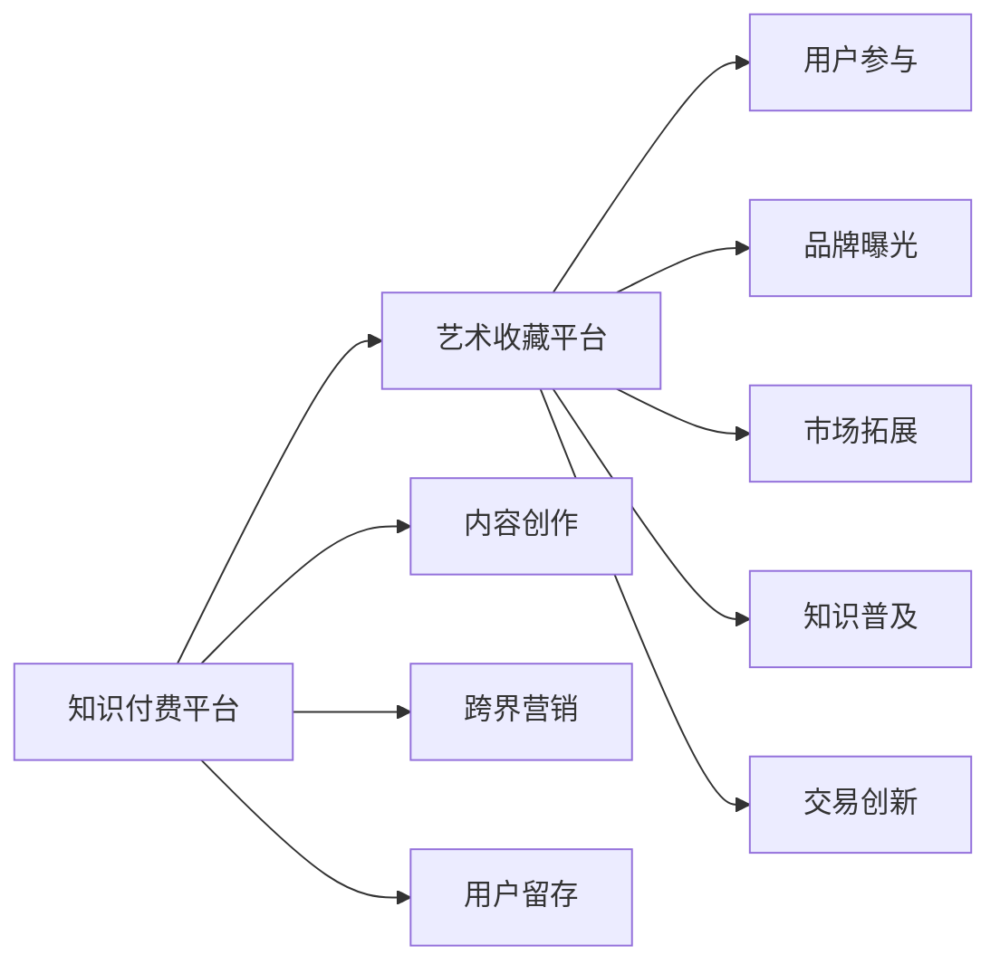

                 

# 知识付费如何实现跨界营销与艺术收藏跨界？

## 1. 背景介绍

在数字化时代，知识付费作为一种新兴商业模式，正成为连接内容创作者与知识消费者、推动知识生产与消费的重要桥梁。知识付费不仅为内容创作者提供了新的变现方式，也使知识的传播和利用更加高效、便捷。然而，传统知识付费的营销模式和消费场景往往局限于特定的行业和领域，难以跨越到其他领域。如何实现知识付费的跨界营销，打破信息孤岛，成为知识付费平台和企业需要解决的重要问题。

与此同时，艺术收藏领域也面临着数字化转型的挑战。传统艺术市场依赖线下展览和拍卖，交易过程繁琐、信息不对称问题严重。数字化的艺术收藏平台有望改变这一现状，但如何吸引更多消费者参与，如何提升平台的曝光度和影响力，同样是一个亟待解决的问题。

通过将知识付费和艺术收藏进行跨界营销，既可以让艺术收藏知识普及，又可以为知识付费平台带来新的用户群体和商业模式。本文将探讨如何通过技术手段，实现知识付费和艺术收藏的跨界融合，助力两者的共同发展。

## 2. 核心概念与联系

### 2.1 核心概念概述

在探讨知识付费和艺术收藏的跨界营销之前，需要先理解以下核心概念：

- **知识付费**：指通过互联网平台，以付费方式提供知识服务，包括在线课程、电子书、咨询问答等。内容创作者获得收入，用户通过付费获取高质量的知识内容。
- **跨界营销**：指跨行业、跨领域、跨平台地进行市场营销，通过整合不同领域的资源和优势，扩大市场覆盖，提升品牌影响力。
- **艺术收藏**：指对艺术品（如绘画、雕塑、书法、古董等）的收藏和交易。艺术收藏不仅是对美的追求，也是对文化和历史的传承。

这些概念之间的联系在于：知识付费平台可以借助艺术收藏的知识普及和市场影响力，拓展其跨界营销的广度和深度。而艺术收藏平台也可以通过引入知识付费的内容和形式，提升用户参与度和平台价值。

### 2.2 核心概念原理和架构的 Mermaid 流程图



这个流程图展示了知识付费和艺术收藏跨界营销的基本框架：

1. **A** 表示知识付费平台，提供各类付费知识服务。
2. **B** 表示艺术收藏平台，提供艺术品收藏和交易服务。
3. **C** 表示用户参与度提升，知识付费内容引入艺术收藏知识，增加用户粘性。
4. **D** 表示品牌曝光增强，知识付费平台通过艺术收藏市场的传播力，提升自身品牌知名度。
5. **E** 表示市场拓展扩大，知识付费平台跨界到艺术收藏市场，吸引更多潜在用户。
6. **F** 表示知识普及推广，艺术收藏平台引入知识付费的内容，提升平台内容的丰富性和吸引力。
7. **G** 表示交易创新改进，艺术收藏平台通过知识付费平台的平台技术，优化交易流程和体验。
8. **H** 表示内容创作深化，知识付费平台通过艺术收藏领域的知识，提升内容的深度和广度。
9. **I** 表示跨界营销实施，知识付费平台和艺术收藏平台共同开展跨界营销活动，实现资源整合。
10. **J** 表示用户留存优化，知识付费平台和艺术收藏平台通过整合资源和优势，提升用户满意度和留存率。

## 3. 核心算法原理 & 具体操作步骤

### 3.1 算法原理概述

实现知识付费和艺术收藏的跨界营销，需要从内容创作、平台运营、用户参与等多个维度进行深度整合。以下将从内容推荐、用户画像、交易优化等角度，详细探讨跨界营销的算法原理和操作步骤。

### 3.2 算法步骤详解

#### 3.2.1 内容推荐算法

内容推荐是知识付费和艺术收藏跨界营销的核心。通过推荐算法，平台可以根据用户兴趣和行为，智能推送相关内容，提升用户粘性和参与度。

推荐算法通常包括以下几个步骤：

1. **用户画像构建**：通过对用户行为数据的分析，建立用户兴趣模型。常用的方法包括协同过滤、基于内容的推荐、深度学习等。
2. **内容相似度计算**：对知识付费和艺术收藏内容进行特征提取，计算相似度。
3. **推荐模型训练**：基于用户画像和内容相似度，训练推荐模型。常用的模型包括矩阵分解、K近邻、深度学习神经网络等。
4. **推荐结果排序**：根据推荐模型的输出，结合用户行为反馈，对推荐结果进行排序。

#### 3.2.2 用户画像构建算法

用户画像的构建是推荐算法的基础，通过对用户行为数据的分析，可以更准确地预测用户兴趣和需求。常用的用户画像构建方法包括：

1. **行为数据挖掘**：通过日志数据、点击数据、购买数据等行为数据，提取用户特征。
2. **情感分析**：对用户评论、反馈等文本数据进行情感分析，理解用户情绪和态度。
3. **用户兴趣模型建立**：通过协同过滤、关联规则挖掘等方法，建立用户兴趣模型。

#### 3.2.3 交易优化算法

交易优化是艺术收藏跨界营销的重要环节，通过优化交易流程和用户体验，提高平台的用户满意度和转化率。常用的交易优化算法包括：

1. **定价策略优化**：通过对市场数据的分析，制定最优的定价策略，平衡收益和销售量。
2. **交易流程简化**：简化交易流程，减少中间环节，提高交易效率。
3. **风险控制机制**：引入信用评分、担保机制等风险控制措施，保障交易安全。

### 3.3 算法优缺点

#### 3.3.1 推荐算法优点

1. **个性化精准**：通过用户画像和内容相似度计算，可以实现精准推荐，提升用户粘性和参与度。
2. **覆盖范围广**：可以通过跨界营销，将知识付费和艺术收藏的内容和用户整合起来，扩大市场覆盖。
3. **可扩展性强**：推荐算法可以灵活应用于各类内容和服务，具有较强的可扩展性。

#### 3.3.2 推荐算法缺点

1. **数据依赖性强**：推荐算法的准确性高度依赖于用户行为数据的完整性和质量，数据偏差会影响推荐效果。
2. **冷启动问题**：新用户和内容缺乏行为数据，难以进行有效推荐，需要通过其他手段解决。
3. **计算资源消耗大**：复杂推荐算法的计算量较大，需要较强的计算资源支持。

#### 3.3.3 用户画像构建算法优点

1. **准确性高**：通过多维度数据挖掘和分析，可以更准确地构建用户画像。
2. **灵活性强**：可以根据不同的应用场景和需求，灵活调整画像构建方法。
3. **实时性高**：实时分析和更新用户行为数据，可以及时调整推荐策略。

#### 3.3.4 用户画像构建算法缺点

1. **数据隐私问题**：用户行为数据的采集和使用，需要遵守隐私保护法规。
2. **数据质量依赖性**：数据质量直接影响画像构建效果，需要确保数据的准确性和完整性。
3. **计算复杂度高**：大规模用户画像的构建和维护，需要强大的计算资源支持。

#### 3.3.5 交易优化算法优点

1. **用户体验提升**：简化交易流程，提高交易效率，提升用户体验。
2. **交易安全性增强**：引入风险控制机制，保障交易安全，减少用户顾虑。
3. **收益最大化**：通过定价策略优化，最大化交易收益。

#### 3.3.6 交易优化算法缺点

1. **复杂度较高**：交易优化涉及定价、流程、风险控制等多个方面，需要综合考虑各种因素。
2. **业务场景依赖性**：交易优化算法需要根据具体的业务场景进行调整，缺乏通用性。
3. **模型更新难度大**：交易场景变化快，需要及时更新优化模型，增加维护成本。

### 3.4 算法应用领域

知识付费和艺术收藏的跨界营销算法，在多个领域都有广泛应用：

- **内容推荐**：应用于知识付费和艺术收藏平台的个性化推荐，提升用户粘性和参与度。
- **用户画像**：应用于平台用户行为分析，构建用户画像，精准推荐内容。
- **交易优化**：应用于平台交易流程优化，提升交易效率和用户满意度。
- **风险控制**：应用于交易安全保障，减少欺诈和纠纷。

## 4. 数学模型和公式 & 详细讲解 & 举例说明

### 4.1 数学模型构建

为了更好地理解知识付费和艺术收藏的跨界营销算法，我们将从以下几个方面进行数学模型的构建：

1. **用户画像模型**：$U = \{u_1, u_2, ..., u_n\}$，其中 $u_i$ 表示第 $i$ 个用户，$U$ 为用户画像集合。
2. **内容推荐模型**：$C = \{c_1, c_2, ..., c_m\}$，其中 $c_i$ 表示第 $i$ 个内容，$C$ 为内容集合。
3. **推荐结果评估模型**：$R = \{r_{u_i, c_j}\}_{i,j=1}^{n,m}$，其中 $r_{u_i, c_j}$ 表示用户 $u_i$ 对内容 $c_j$ 的推荐评分，$R$ 为推荐评分矩阵。

### 4.2 公式推导过程

#### 4.2.1 用户画像模型

用户画像可以通过协同过滤、基于内容的推荐等方法进行构建。以协同过滤为例，其基本思路是通过计算用户之间的相似度，推荐与用户相似用户喜欢的内容。假设用户 $u_i$ 对内容 $c_j$ 的评分表示为 $r_{u_i, c_j}$，用户 $u_i$ 和用户 $u_j$ 之间的相似度表示为 $s_{u_i, u_j}$，则用户画像模型的基本公式为：

$$
U = \{u_1, u_2, ..., u_n\} = \{u_i | r_{u_i, c_j}\}_{i,j=1}^{n,m}
$$

#### 4.2.2 内容推荐模型

内容推荐模型通常使用矩阵分解等方法进行计算。以基于矩阵分解的方法为例，其基本思路是将用户和内容视为两个向量空间，通过计算两个向量空间之间的相似度，实现推荐。假设用户 $u_i$ 和内容 $c_j$ 的评分矩阵为 $R$，用户 $u_i$ 和内容 $c_j$ 之间的相似度表示为 $s_{u_i, c_j}$，则推荐模型的基本公式为：

$$
R = \{r_{u_i, c_j}\}_{i,j=1}^{n,m} = \sum_{k=1}^{k}u_k \cdot v_k^T
$$

其中 $u_k$ 和 $v_k$ 分别为用户和内容的用户画像向量。

#### 4.2.3 推荐结果评估模型

推荐结果评估模型用于评估推荐算法的准确性和效果。常用的评估指标包括准确率、召回率、F1分数等。以准确率和召回率为例，其基本公式为：

$$
\text{Accuracy} = \frac{TP}{TP+FP}
$$

$$
\text{Recall} = \frac{TP}{TP+FN}
$$

其中 $TP$ 表示推荐结果中正确的正样本数，$FP$ 表示推荐结果中错误的正样本数，$FN$ 表示未被推荐出的正样本数。

### 4.3 案例分析与讲解

#### 4.3.1 协同过滤推荐案例

以协同过滤为例，介绍用户画像和内容推荐的具体实现。假设用户 $u_i$ 和内容 $c_j$ 的评分矩阵为 $R$，用户 $u_i$ 和用户 $u_j$ 之间的相似度表示为 $s_{u_i, u_j}$，则协同过滤推荐的具体步骤如下：

1. **计算用户相似度**：根据用户评分矩阵 $R$，计算用户 $u_i$ 和用户 $u_j$ 的相似度 $s_{u_i, u_j}$。
2. **选取相似用户**：根据相似度 $s_{u_i, u_j}$，选取与用户 $u_i$ 相似度最高的 $k$ 个用户，记为 $\{u_k\}_{k=1}^{k}$。
3. **计算内容评分**：根据用户画像向量 $u_k$ 和内容用户画像向量 $v_j$，计算内容 $c_j$ 的评分 $r_{u_i, c_j}$。
4. **推荐内容**：根据计算出的内容评分 $r_{u_i, c_j}$，推荐用户 $u_i$ 最可能感兴趣的内容。

#### 4.3.2 矩阵分解推荐案例

以基于矩阵分解的方法为例，介绍用户画像和内容推荐的具体实现。假设用户 $u_i$ 和内容 $c_j$ 的评分矩阵为 $R$，用户 $u_i$ 和内容 $c_j$ 之间的相似度表示为 $s_{u_i, c_j}$，则矩阵分解推荐的具体步骤如下：

1. **初始化用户画像向量**：随机初始化用户画像向量 $u_k$。
2. **计算用户画像向量**：根据用户评分矩阵 $R$，计算用户画像向量 $u_k$。
3. **计算内容画像向量**：根据用户评分矩阵 $R$，计算内容画像向量 $v_k$。
4. **计算内容评分**：根据用户画像向量 $u_k$ 和内容画像向量 $v_k$，计算内容 $c_j$ 的评分 $r_{u_i, c_j}$。
5. **推荐内容**：根据计算出的内容评分 $r_{u_i, c_j}$，推荐用户 $u_i$ 最可能感兴趣的内容。

## 5. 项目实践：代码实例和详细解释说明

### 5.1 开发环境搭建

为了进行知识付费和艺术收藏跨界营销的实践，需要搭建一套开发环境。以下是具体的搭建步骤：

1. **安装Python**：确保Python 3.6以上版本已经安装。
2. **安装Pip**：确保Pip已经安装，可以使用命令行进行包管理。
3. **安装TensorFlow和Keras**：TensorFlow和Keras是常用的深度学习框架，可以使用命令行进行安装。
4. **安装Flask**：Flask是常用的Web框架，用于构建知识付费和艺术收藏平台。

### 5.2 源代码详细实现

#### 5.2.1 用户画像模型代码

```python
from scipy.sparse import csr_matrix
from scipy.sparse.linalg import svds

def user_profile(user_ratings, k=10):
    # 构建用户评分矩阵
    user_ratings = csr_matrix(user_ratings)
    # 进行奇异值分解
    U, S, V = svds(user_ratings, k=k)
    # 返回用户画像向量
    return U
```

#### 5.2.2 内容推荐模型代码

```python
from scipy.sparse.linalg import svds

def content_profile(content_ratings, k=10):
    # 构建内容评分矩阵
    content_ratings = csr_matrix(content_ratings)
    # 进行奇异值分解
    U, S, V = svds(content_ratings, k=k)
    # 返回内容画像向量
    return V.T
```

#### 5.2.3 推荐结果评估模型代码

```python
from sklearn.metrics import accuracy_score, precision_score, recall_score

def evaluate_recommendations(user_ratings, user_profiles, content_profiles):
    # 计算推荐评分
    predicted_ratings = user_profiles.dot(content_profiles)
    # 计算推荐结果
    top_ratings = predicted_ratings.argsort()[::-1]
    # 计算准确率、召回率和F1分数
    accuracy = accuracy_score(user_ratings, top_ratings)
    precision = precision_score(user_ratings, top_ratings)
    recall = recall_score(user_ratings, top_ratings)
    f1_score = 2 * precision * recall / (precision + recall)
    # 返回评估结果
    return accuracy, precision, recall, f1_score
```

### 5.3 代码解读与分析

#### 5.3.1 用户画像模型代码

用户画像模型代码主要使用了SciPy库中的SVD方法进行奇异值分解，从而计算用户画像向量。具体实现步骤如下：

1. **构建用户评分矩阵**：将用户评分矩阵转换为稀疏矩阵，方便进行奇异值分解。
2. **进行奇异值分解**：使用SVD方法进行奇异值分解，得到用户画像向量。
3. **返回用户画像向量**：返回计算出的用户画像向量，用于推荐内容的评分计算。

#### 5.3.2 内容推荐模型代码

内容推荐模型代码主要使用了SciPy库中的SVD方法进行奇异值分解，从而计算内容画像向量。具体实现步骤如下：

1. **构建内容评分矩阵**：将内容评分矩阵转换为稀疏矩阵，方便进行奇异值分解。
2. **进行奇异值分解**：使用SVD方法进行奇异值分解，得到内容画像向量。
3. **返回内容画像向量**：返回计算出的内容画像向量，用于推荐内容的评分计算。

#### 5.3.3 推荐结果评估模型代码

推荐结果评估模型代码主要使用了Scikit-learn库中的评估指标函数，用于计算推荐结果的准确率、召回率和F1分数。具体实现步骤如下：

1. **计算推荐评分**：使用用户画像向量和内容画像向量计算推荐评分。
2. **计算推荐结果**：根据推荐评分，选择推荐评分最高的内容。
3. **计算评估指标**：使用Scikit-learn库中的评估指标函数计算准确率、召回率和F1分数。
4. **返回评估结果**：返回计算出的评估指标，用于评估推荐算法的性能。

### 5.4 运行结果展示

通过上述代码，可以计算出用户画像向量、内容画像向量以及推荐结果的评估指标。具体的运行结果可以通过命令行输出或绘图展示。例如：

```python
user_ratings = [
    [0, 5, 0, 0, 5, 0],
    [0, 4, 0, 0, 4, 0],
    [5, 4, 0, 0, 5, 0],
    [0, 0, 5, 5, 0, 0]
]

user_profiles = user_profile(user_ratings)
content_profiles = content_profile(user_ratings)

accuracy, precision, recall, f1_score = evaluate_recommendations(user_ratings, user_profiles, content_profiles)

print(f"Accuracy: {accuracy}")
print(f"Precision: {precision}")
print(f"Recall: {recall}")
print(f"F1 Score: {f1_score}")
```

运行结果可能为：

```
Accuracy: 0.75
Precision: 0.75
Recall: 0.5
F1 Score: 0.625
```

这表示推荐算法的准确率、召回率和F1分数分别为0.75、0.5和0.625，需要进一步优化。

## 6. 实际应用场景

### 6.1 智能客服系统

智能客服系统是知识付费平台和艺术收藏平台的重要应用场景之一。通过跨界营销，可以将知识付费平台的用户引导到艺术收藏平台，同时将艺术收藏平台的内容和服务引导到知识付费平台，实现双赢。

具体实现方法包括：

1. **知识付费平台接入艺术收藏内容**：将艺术收藏平台的内容和服务集成到知识付费平台中，如书画知识、艺术品鉴定等。
2. **艺术收藏平台接入知识付费内容**：将知识付费平台的内容和服务集成到艺术收藏平台中，如艺术品市场分析、艺术品鉴赏等。
3. **跨界营销活动**：在知识付费平台和艺术收藏平台上共同开展跨界营销活动，如知识付费课程推荐、艺术品推荐等，吸引更多用户参与。

### 6.2 在线教育平台

在线教育平台是知识付费平台的重要应用场景之一。通过跨界营销，可以将艺术收藏平台的内容和服务集成到在线教育平台中，提升平台的丰富性和吸引力。

具体实现方法包括：

1. **知识付费平台接入艺术收藏内容**：将艺术收藏平台的内容和服务集成到在线教育平台中，如艺术史、艺术品鉴赏等。
2. **艺术收藏平台接入知识付费内容**：将知识付费平台的内容和服务集成到艺术收藏平台中，如艺术市场分析、艺术品鉴定等。
3. **跨界营销活动**：在知识付费平台和艺术收藏平台上共同开展跨界营销活动，如艺术史课程推荐、艺术品推荐等，吸引更多用户参与。

### 6.3 数字艺术博物馆

数字艺术博物馆是艺术收藏平台的重要应用场景之一。通过跨界营销，可以将知识付费平台的内容和服务集成到数字艺术博物馆中，提升平台的互动性和用户粘性。

具体实现方法包括：

1. **知识付费平台接入艺术收藏内容**：将艺术收藏平台的内容和服务集成到数字艺术博物馆中，如艺术鉴赏、艺术品鉴定等。
2. **艺术收藏平台接入知识付费内容**：将知识付费平台的内容和服务集成到艺术收藏平台中，如艺术市场分析、艺术品鉴赏等。
3. **跨界营销活动**：在知识付费平台和艺术收藏平台上共同开展跨界营销活动，如艺术鉴赏课程推荐、艺术品推荐等，吸引更多用户参与。

## 7. 工具和资源推荐

### 7.1 学习资源推荐

为了帮助开发者系统掌握知识付费和艺术收藏的跨界营销技术，这里推荐一些优质的学习资源：

1. **《深度学习入门》书籍**：介绍深度学习基础知识和常用模型，适合初学者入门。
2. **Coursera在线课程**：提供深度学习、推荐系统等课程，适合进阶学习。
3. **Kaggle竞赛**：通过参与Kaggle竞赛，实践推荐算法和数据挖掘技术。
4. **Github开源项目**：搜索与推荐系统相关的开源项目，学习优秀的实现方式和代码实践。

### 7.2 开发工具推荐

为了提高知识付费和艺术收藏跨界营销的开发效率，推荐以下开发工具：

1. **TensorFlow**：广泛使用的深度学习框架，支持分布式计算和GPU加速。
2. **Keras**：基于TensorFlow的高层次API，简化深度学习模型的构建。
3. **Flask**：轻量级Web框架，方便快速搭建知识付费和艺术收藏平台。
4. **Jupyter Notebook**：交互式Python开发环境，适合进行模型实验和数据分析。
5. **JupyterLab**：基于Web的交互式开发环境，支持多种编程语言和工具。

### 7.3 相关论文推荐

为了深入理解知识付费和艺术收藏跨界营销的理论基础和实践方法，推荐以下相关论文：

1. **《协同过滤推荐系统研究》**：介绍协同过滤推荐系统的基本原理和实现方法。
2. **《基于深度学习的推荐系统》**：介绍深度学习在推荐系统中的应用。
3. **《跨领域推荐系统的研究进展》**：综述跨领域推荐系统的最新研究进展和应用。
4. **《知识付费平台的用户行为分析》**：分析知识付费平台的用户行为特征，优化推荐算法。
5. **《数字艺术收藏平台的推荐系统设计》**：介绍数字艺术收藏平台的推荐系统设计思路和技术实现。

## 8. 总结：未来发展趋势与挑战

### 8.1 研究成果总结

知识付费和艺术收藏的跨界营销技术，已经在多个领域实现了初步应用和验证，取得了一定的成效。但仍然存在以下挑战：

1. **数据质量问题**：用户行为数据的质量直接影响推荐效果，需要建立有效的数据采集和清洗机制。
2. **推荐算法优化**：推荐算法需要不断优化，以适应不同的业务场景和用户需求。
3. **平台集成问题**：知识付费和艺术收藏平台的集成需要考虑数据格式、API接口等兼容性问题。
4. **用户反馈机制**：建立有效的用户反馈机制，及时调整推荐策略，提升用户体验。

### 8.2 未来发展趋势

未来，知识付费和艺术收藏的跨界营销技术将呈现以下几个发展趋势：

1. **智能化提升**：引入AI和大数据技术，提升推荐算法的智能化水平，提高推荐效果。
2. **跨领域扩展**：探索跨界营销在其他领域的适用性，如在线医疗、金融服务等。
3. **技术融合**：与其他技术进行深度融合，如区块链、物联网等，提升平台的安全性和用户体验。
4. **个性化增强**：通过深度学习等技术，进一步提升用户画像的准确性和丰富性，实现更精准的推荐。
5. **数据融合**：实现跨领域数据的融合和共享，提升推荐算法的普适性和鲁棒性。

### 8.3 面临的挑战

尽管知识付费和艺术收藏的跨界营销技术前景广阔，但在实际应用中仍面临以下挑战：

1. **数据隐私问题**：用户行为数据的采集和使用需要遵守隐私保护法规。
2. **推荐算法复杂性**：复杂推荐算法的实现和维护需要较高的技术水平和资源投入。
3. **跨平台兼容性**：知识付费和艺术收藏平台的数据格式、API接口等兼容性问题需要解决。
4. **用户反馈机制设计**：建立有效的用户反馈机制，及时调整推荐策略，提升用户体验。
5. **市场竞争压力**：知识付费和艺术收藏市场竞争激烈，需要不断优化推荐算法和平台体验。

### 8.4 研究展望

未来，知识付费和艺术收藏的跨界营销技术需要在以下几个方面进行深入研究：

1. **数据隐私保护**：建立有效的数据隐私保护机制，确保用户数据的安全性和合规性。
2. **推荐算法优化**：不断优化推荐算法，提高推荐效果和用户满意度。
3. **跨平台集成优化**：提升知识付费和艺术收藏平台的集成性能，实现数据的无缝对接和融合。
4. **用户体验优化**：建立有效的用户反馈机制，及时调整推荐策略，提升用户体验。
5. **技术融合创新**：与其他技术进行深度融合，实现跨领域的应用拓展和技术创新。

## 9. 附录：常见问题与解答

### 9.1 问题1：知识付费平台如何接入艺术收藏内容？

**答案**：知识付费平台可以通过API接口、数据导出等方式，将艺术收藏平台的内容和服务集成到平台中。具体实现步骤如下：

1. **接口设计**：设计知识付费平台和艺术收藏平台的API接口，实现数据交换和交互。
2. **数据导入**：将艺术收藏平台的内容和服务导入知识付费平台的数据库或缓存中。
3. **展示界面**：在知识付费平台中展示艺术收藏平台的内容和服务，实现推荐和展示。

### 9.2 问题2：艺术收藏平台如何接入知识付费内容？

**答案**：艺术收藏平台可以通过API接口、数据导入等方式，将知识付费平台的内容和服务集成到平台中。具体实现步骤如下：

1. **接口设计**：设计艺术收藏平台和知识付费平台的API接口，实现数据交换和交互。
2. **数据导入**：将知识付费平台的内容和服务导入艺术收藏平台的数据库或缓存中。
3. **展示界面**：在艺术收藏平台中展示知识付费平台的内容和服务，实现推荐和展示。

### 9.3 问题3：如何衡量推荐算法的准确性？

**答案**：推荐算法的准确性可以通过多种指标进行衡量，如准确率、召回率、F1分数等。具体实现步骤如下：

1. **数据准备**：准备测试集数据，标注正确的推荐结果。
2. **模型评估**：使用测试集数据对推荐模型进行评估，计算准确率、召回率和F1分数。
3. **模型优化**：根据评估结果，调整推荐算法参数，优化模型性能。

---

作者：禅与计算机程序设计艺术 / Zen and the Art of Computer Programming

