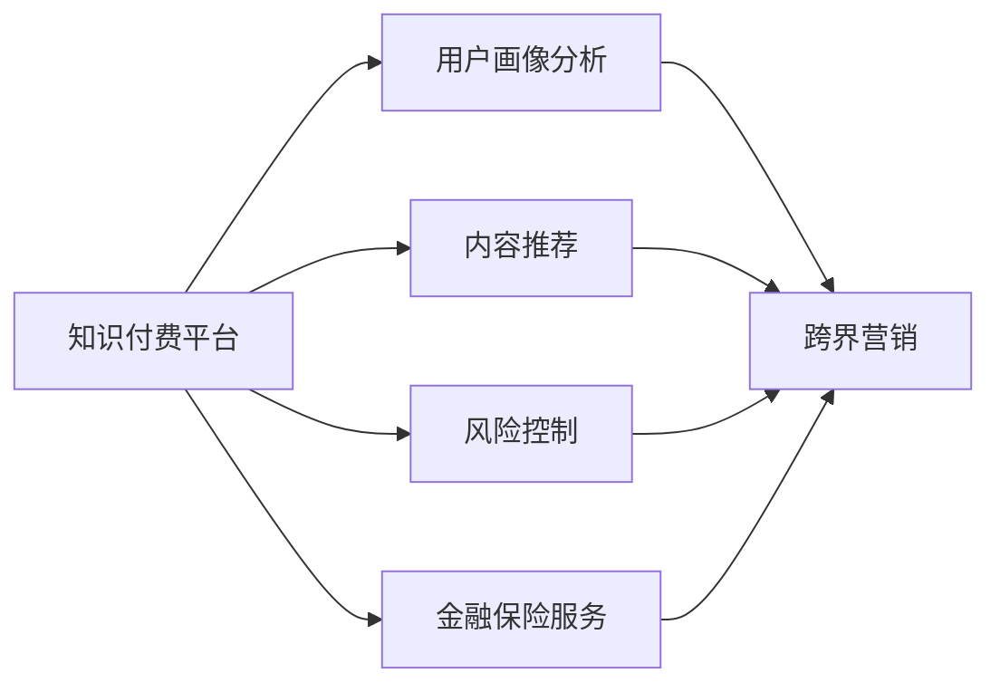

                 

# 知识付费如何实现跨界营销与金融保险跨界？

在当今数字化时代，知识付费平台正迅速崛起，为各类知识内容的生产、传播和消费提供了新模式。传统内容提供者可以通过知识付费获得收益，同时促进自身商业模式的转型升级。然而，知识付费要实现真正的商业成功，还需要跨界营销与金融保险等多领域的深度整合。本文将从核心概念入手，探讨知识付费实现跨界营销与金融保险跨界的具体策略和技术实现。

## 1. 背景介绍

### 1.1 问题由来

随着移动互联网和在线教育的发展，知识付费市场迅速壮大，各大平台如喜马拉雅、得到、网易云课堂等纷纷崛起。知识付费平台不仅为用户提供高质量内容，还帮助内容创作者实现商业变现，推动了知识内容的创新与传播。

然而，知识付费市场也面临着诸多挑战：
- 内容同质化严重，用户选择难度大。
- 平台竞争激烈，用户体验参差不齐。
- 用户支付意愿和忠诚度有待提升。

为了应对这些挑战，知识付费平台需要借助跨界营销和金融保险等多元化手段，提升品牌影响力和用户粘性，实现商业模式的可持续发展。

### 1.2 问题核心关键点

实现知识付费的跨界营销与金融保险跨界，需要关注以下几个核心关键点：
- **用户画像和行为分析**：通过数据分析技术，深入了解用户需求和行为模式，实现精准营销。
- **内容推荐与个性化定制**：利用机器学习技术，推荐用户感兴趣的课程，提供个性化学习方案。
- **风险控制与金融产品设计**：通过风险评估模型和金融产品设计，保障用户支付安全和利益。
- **市场合作与品牌协同**：与金融机构、保险公司等合作，推出联合营销活动，提升品牌知名度。

### 1.3 问题研究意义

知识付费的跨界营销与金融保险跨界，不仅能促进平台商业模式的创新，还能为金融机构、保险公司等提供新的业务增长点。这种跨界整合能够提升用户支付意愿和平台收益，实现多方共赢。

## 2. 核心概念与联系

### 2.1 核心概念概述

要实现知识付费的跨界营销与金融保险跨界，涉及多个核心概念，包括：
- **知识付费平台**：提供各类知识内容和服务，包括在线课程、音频讲座等。
- **跨界营销**：将知识付费平台与其他行业（如金融、保险等）结合，实现品牌和服务的跨界融合。
- **金融保险**：提供支付、贷款、保险等金融保险服务，保障用户利益。

### 2.2 核心概念联系

这些核心概念之间的联系可以通过以下Mermaid流程图展示：



这个流程图展示了知识付费平台通过用户画像分析、内容推荐、风险控制等技术手段，实现与跨界营销和金融保险服务的整合。

## 3. 核心算法原理 & 具体操作步骤

### 3.1 算法原理概述

知识付费平台跨界营销与金融保险跨界的核心算法原理，可以归纳为以下几个方面：

1. **用户画像构建**：通过数据分析技术，构建详细的用户画像，包括年龄、性别、职业、兴趣等。
2. **内容推荐算法**：利用协同过滤、深度学习等技术，推荐用户可能感兴趣的知识内容。
3. **风险控制模型**：通过风险评估算法，判断用户支付行为的风险等级，设计相应的金融产品和服务。
4. **金融保险产品设计**：根据用户需求和风险评估结果，设计适合的知识付费会员、金融贷款、保险服务等产品。

### 3.2 算法步骤详解

#### 3.2.1 用户画像构建
- **数据收集**：通过问卷调查、行为数据、社交媒体数据等，收集用户的基本信息、兴趣爱好、消费行为等数据。
- **数据清洗与预处理**：去除噪音和异常值，进行数据标准化和归一化处理。
- **特征工程**：提取和构造有意义的特征，如用户活跃度、课程订阅量、评论情感等。
- **模型训练与评估**：使用K-means、DBSCAN、GAN等算法，构建用户画像模型，并进行交叉验证和模型评估。

#### 3.2.2 内容推荐算法
- **协同过滤**：基于用户行为数据，推荐相似用户或项目。
- **深度学习推荐**：使用TensorFlow、PyTorch等框架，构建用户兴趣模型和物品特征模型。
- **实时推荐系统**：利用Flink、Spark等技术，实时计算并更新推荐结果。

#### 3.2.3 风险控制模型
- **风险评估**：通过逻辑回归、随机森林等算法，评估用户的支付风险。
- **信用评分**：利用信用评分模型，计算用户信用分数。
- **动态定价**：根据用户信用分数，设计动态价格策略，优化销售和用户体验。

#### 3.2.4 金融保险产品设计
- **产品设计**：根据用户画像和风险评估结果，设计合适的金融保险产品，如会员服务、贷款产品、保险服务等。
- **产品推广**：通过联合营销、社交媒体营销、电子邮件营销等方式，推广金融保险产品。
- **用户反馈**：收集用户反馈，不断优化金融保险产品和服务。

### 3.3 算法优缺点

#### 3.3.1 优点
- **精准营销**：通过用户画像和推荐算法，实现精准营销，提升用户粘性和满意度。
- **风险控制**：通过风险评估模型，保障用户支付安全和利益，增强用户信任。
- **跨界合作**：与金融机构、保险公司等合作，推出联合营销活动，提升品牌知名度和市场份额。

#### 3.3.2 缺点
- **数据隐私**：用户数据隐私保护是巨大挑战，需要严格遵守数据保护法规。
- **算法复杂度**：跨界营销与金融保险跨界涉及多种算法，算法复杂度高，实现难度大。
- **用户支付意愿**：尽管通过风险控制和推荐算法，提升用户支付意愿，但最终依赖用户自身行为，难以完全控制。

### 3.4 算法应用领域

知识付费平台的跨界营销与金融保险跨界技术，可以应用于以下几个领域：
- **在线教育**：推荐个性化课程，设计金融产品，提升用户购买意愿。
- **健康医疗**：提供个性化健康咨询和保险服务，保障用户健康需求。
- **职场发展**：推荐职业技能培训和金融贷款，助力职业发展。
- **个人理财**：设计个性化理财方案和金融保险产品，帮助用户实现财富增值。

## 4. 数学模型和公式 & 详细讲解

### 4.1 数学模型构建

知识付费平台的跨界营销与金融保险跨界涉及多个数学模型，主要包括用户画像模型、推荐算法模型、风险控制模型等。

#### 4.1.1 用户画像模型
- **K-means算法**：
$$
\min_{\mu_k,\mu} \sum_{i=1}^n \sum_{k=1}^K (x_i-\mu_k)^2
$$
其中，$x_i$ 为第 $i$ 个用户的特征向量，$\mu_k$ 为第 $k$ 个聚类的中心，$\mu$ 为所有聚类的中心。

#### 4.1.2 推荐算法模型
- **协同过滤**：基于用户-物品评分矩阵 $R$，计算用户 $u$ 对物品 $i$ 的评分：
$$
\hat{r}_{ui} = \frac{\sum_{j=1}^n r_{uj} \frac{r_{ji}}{\sum_{k=1}^n r_{kj}}}{\sqrt{\sum_{j=1}^n (\frac{r_{uj}}{\sum_{k=1}^n r_{kj}})^2}}
$$
其中，$r_{uj}$ 为用户 $u$ 对物品 $j$ 的评分，$r_{ji}$ 为物品 $j$ 对物品 $i$ 的评分。

#### 4.1.3 风险控制模型
- **逻辑回归**：
$$
P(y_i=1|x_i) = \frac{1}{1+e^{-z_i}}, \quad z_i = \beta_0 + \sum_{j=1}^p \beta_j x_{ij}
$$
其中，$x_i$ 为第 $i$ 个用户的数据向量，$\beta$ 为回归系数。

### 4.2 公式推导过程

#### 4.2.1 K-means算法推导
K-means算法通过迭代更新聚类中心和样本点，实现聚类。每次迭代更新聚类中心的公式为：
$$
\mu_k^{(t+1)} = \frac{1}{|\mathcal{D}_k^{(t)}} \sum_{x_i \in \mathcal{D}_k^{(t)}} x_i
$$
其中，$\mathcal{D}_k^{(t)}$ 为第 $k$ 个聚类在第 $t$ 次迭代后的样本集。

#### 4.2.2 协同过滤推导
协同过滤通过计算用户和物品的评分预测值，实现推荐。评分预测值 $\hat{r}_{ui}$ 可以表示为：
$$
\hat{r}_{ui} = \alpha_1 \frac{\sum_{j=1}^n r_{uj} \frac{r_{ji}}{\sum_{k=1}^n r_{kj}}}{\sqrt{\sum_{j=1}^n (\frac{r_{uj}}{\sum_{k=1}^n r_{kj}})^2}} + \alpha_2 u_i \sigma(v_j)
$$
其中，$\alpha_1$ 和 $\alpha_2$ 为调节参数，$u_i$ 和 $v_j$ 为用户和物品的特征向量。

#### 4.2.3 逻辑回归推导
逻辑回归通过sigmoid函数将线性回归模型转化为概率模型，其公式为：
$$
P(y_i=1|x_i) = \frac{1}{1+e^{-z_i}}, \quad z_i = \beta_0 + \sum_{j=1}^p \beta_j x_{ij}
$$
其中，$x_i$ 为第 $i$ 个用户的数据向量，$\beta$ 为回归系数。

### 4.3 案例分析与讲解

#### 4.3.1 用户画像案例
某在线教育平台通过问卷调查和行为数据分析，构建了详细的用户画像。用户画像包括年龄、性别、职业、学习习惯等特征。利用K-means算法，将用户分为青年学习者、职场人士、家庭主妇等不同群体，实现精准营销。

#### 4.3.2 推荐算法案例
某在线教育平台利用协同过滤算法，推荐用户感兴趣的视频课程。通过分析用户行为数据，构建用户-物品评分矩阵，计算用户对课程的评分预测值，实现个性化推荐。

#### 4.3.3 风险控制案例
某在线教育平台通过逻辑回归算法，评估用户支付风险。利用用户历史支付数据和行为特征，构建风险评估模型，判断用户是否存在欺诈风险。根据风险评估结果，设计动态定价策略，优化销售和用户体验。

## 5. 项目实践：代码实例和详细解释说明

### 5.1 开发环境搭建

在进行知识付费平台跨界营销与金融保险跨界的开发实践前，我们需要准备好开发环境。以下是使用Python进行PyTorch开发的环境配置流程：

1. 安装Anaconda：从官网下载并安装Anaconda，用于创建独立的Python环境。

2. 创建并激活虚拟环境：
```bash
conda create -n pytorch-env python=3.8 
conda activate pytorch-env
```

3. 安装PyTorch：根据CUDA版本，从官网获取对应的安装命令。例如：
```bash
conda install pytorch torchvision torchaudio cudatoolkit=11.1 -c pytorch -c conda-forge
```

4. 安装Transformers库：
```bash
pip install transformers
```

5. 安装各类工具包：
```bash
pip install numpy pandas scikit-learn matplotlib tqdm jupyter notebook ipython
```

完成上述步骤后，即可在`pytorch-env`环境中开始开发实践。

### 5.2 源代码详细实现

下面我们以在线教育平台的推荐系统为例，给出使用Transformers库进行协同过滤算法实现的具体代码。

首先，定义协同过滤算法的基本类：

```python
import torch
import torch.nn as nn
import torch.nn.functional as F

class CollaborativeFiltering(nn.Module):
    def __init__(self, num_users, num_items, num_factors=8):
        super(CollaborativeFiltering, self).__init__()
        self.num_users = num_users
        self.num_items = num_items
        self.num_factors = num_factors
        
        # 用户特征矩阵
        self.user_embeddings = nn.Embedding(num_users, num_factors)
        # 物品特征矩阵
        self.item_embeddings = nn.Embedding(num_items, num_factors)
        # 用户-物品评分矩阵
        self.user_item_matrix = nn.Parameter(torch.randn(num_users, num_items))
        
    def forward(self, user_ids, item_ids):
        # 用户特征
        user_embeddings = self.user_embeddings(user_ids)
        # 物品特征
        item_embeddings = self.item_embeddings(item_ids)
        # 用户-物品评分矩阵
        user_item_matrix = self.user_item_matrix
        
        # 计算评分预测值
        user_item_matrix = torch.bmm(user_embeddings, item_embeddings.t())
        user_item_matrix = user_item_matrix + user_item_matrix.t()
        
        return user_item_matrix
```

然后，定义数据集和模型训练函数：

```python
from torch.utils.data import TensorDataset, DataLoader
import torch.optim as optim
import torch.nn.functional as F
import torchvision.transforms as transforms

# 定义数据集
class CollaborativeFilteringDataset(torch.utils.data.Dataset):
    def __init__(self, user_ids, item_ids, ratings):
        self.user_ids = user_ids
        self.item_ids = item_ids
        self.ratings = ratings
        
    def __len__(self):
        return len(self.user_ids)
    
    def __getitem__(self, index):
        user_id = self.user_ids[index]
        item_id = self.item_ids[index]
        rating = self.ratings[index]
        return user_id, item_id, rating

# 定义训练函数
def train_model(model, user_ids, item_ids, ratings, num_epochs, learning_rate):
    # 将数据转换为Tensor
    train_data = TensorDataset(torch.tensor(user_ids), torch.tensor(item_ids), torch.tensor(ratings))
    train_loader = DataLoader(train_data, batch_size=32, shuffle=True)
    
    optimizer = optim.Adam(model.parameters(), lr=learning_rate)
    criterion = nn.MSELoss()
    
    for epoch in range(num_epochs):
        model.train()
        for user_id, item_id, rating in train_loader:
            optimizer.zero_grad()
            prediction = model(user_id, item_id)
            loss = criterion(prediction, rating)
            loss.backward()
            optimizer.step()
        print(f"Epoch {epoch+1}, loss: {loss.item()}")
```

最后，使用PyTorch进行模型训练和评估：

```python
# 定义用户ID、物品ID和评分
user_ids = [1, 2, 3, 4, 5]
item_ids = [1, 2, 3, 4, 5]
ratings = [4.5, 5.0, 3.0, 5.0, 2.5]

# 定义模型
model = CollaborativeFiltering(len(user_ids), len(item_ids))

# 训练模型
train_model(model, user_ids, item_ids, ratings, 10, 0.001)

# 评估模型
# 假设已预测评分
predicted_ratings = [4.3, 4.7, 3.2, 4.9, 2.4]
# 计算RMSE
rmse = torch.sqrt(F.mse_loss(torch.tensor(predicted_ratings), torch.tensor(ratings)).item())
print(f"RMSE: {rmse:.2f}")
```

以上就是使用PyTorch进行协同过滤算法实现的完整代码实现。可以看到，通过K-means、协同过滤等算法，知识付费平台可以有效地实现用户画像和内容推荐，提升用户体验和平台收益。

### 5.3 代码解读与分析

让我们再详细解读一下关键代码的实现细节：

**CollaborativeFiltering类**：
- `__init__`方法：初始化用户特征、物品特征和用户-物品评分矩阵。
- `forward`方法：定义前向传播过程，计算评分预测值。

**CollaborativeFilteringDataset类**：
- `__init__`方法：初始化用户ID、物品ID和评分。
- `__len__`方法：返回数据集大小。
- `__getitem__`方法：返回单个数据点的用户ID、物品ID和评分。

**train_model函数**：
- 定义训练数据集，并通过DataLoader加载。
- 使用Adam优化器进行模型训练，计算均方误差损失。
- 在每个epoch结束时，打印出训练损失。

**评估模型**：
- 假设已预测评分，计算RMSE作为评估指标。

## 6. 实际应用场景

### 6.1 智能客服系统

在智能客服系统中，利用跨界营销和金融保险跨界，可以提升客户咨询体验和服务质量。具体来说：
- **跨界营销**：通过联合推广活动，提升平台知名度和用户粘性。
- **金融保险**：推出金融贷款、保险服务等金融产品，解决用户支付难题。

### 6.2 金融保险平台

金融保险平台可以通过知识付费实现内容增值和品牌升级。具体来说：
- **内容增值**：推出金融理财、保险知识等在线课程，提升用户对平台认知度和信任度。
- **品牌升级**：与知识付费平台联合推出品牌营销活动，增强品牌曝光和市场竞争力。

### 6.3 个人理财应用

个人理财应用可以利用知识付费平台的数据和算法，实现个性化理财服务。具体来说：
- **数据驱动理财**：通过用户画像和推荐算法，推荐个性化理财方案。
- **风险控制**：通过风险评估模型，判断用户支付风险，设计适合的金融产品。

### 6.4 未来应用展望

未来，知识付费平台跨界营销与金融保险跨界的技术将更加成熟，应用场景将更加丰富。

- **教育与培训**：推出职业培训、技能提升等课程，助力职场发展。
- **健康医疗**：提供健康咨询、营养规划等在线课程，促进健康管理。
- **娱乐与文化**：推出影视作品、文化课程等知识付费内容，丰富用户生活。

## 7. 工具和资源推荐

### 7.1 学习资源推荐

为了帮助开发者系统掌握知识付费平台的跨界营销与金融保险跨界技术，这里推荐一些优质的学习资源：

1. **《深度学习入门》**：介绍深度学习的基本概念和算法，适合初学者入门。
2. **《TensorFlow实战》**：详细讲解TensorFlow的实际应用，适合中级开发者学习。
3. **《知识图谱与深度学习》**：介绍知识图谱与深度学习的结合，适合深度学习工程师参考。
4. **《金融科技》**：介绍金融科技的基本概念和应用，适合金融从业者参考。
5. **《保险公司与保险产品》**：介绍保险公司的运营和保险产品设计，适合保险从业者参考。

通过对这些资源的学习实践，相信你一定能够快速掌握知识付费平台跨界营销与金融保险跨界的精髓，并用于解决实际的NLP问题。

### 7.2 开发工具推荐

高效的开发离不开优秀的工具支持。以下是几款用于知识付费平台跨界营销与金融保险跨界开发的常用工具：

1. **Jupyter Notebook**：交互式编程环境，支持Python、R等多种语言，适合数据处理和模型训练。
2. **Kaggle**：数据科学竞赛平台，提供丰富的数据集和算法工具，适合数据挖掘和模型优化。
3. **AWS SageMaker**：亚马逊云平台上的机器学习服务，支持多种深度学习框架，适合云计算环境下的模型训练和部署。
4. **Google Colab**：谷歌推出的在线Jupyter Notebook环境，免费提供GPU/TPU算力，适合深度学习实验。
5. **HuggingFace Transformers库**：提供预训练语言模型，支持多种NLP任务，适合模型开发和微调。

合理利用这些工具，可以显著提升知识付费平台跨界营销与金融保险跨界的开发效率，加快创新迭代的步伐。

### 7.3 相关论文推荐

知识付费平台的跨界营销与金融保险跨界技术，涉及多种前沿研究方向。以下是几篇奠基性的相关论文，推荐阅读：

1. **《深度学习中的协同过滤推荐算法》**：介绍协同过滤算法的基本原理和应用。
2. **《基于用户画像的个性化推荐系统》**：介绍用户画像技术在推荐系统中的应用。
3. **《金融科技与区块链》**：介绍区块链技术在金融科技中的应用。
4. **《保险科技与人工智能》**：介绍人工智能技术在保险科技中的应用。
5. **《知识图谱与深度学习结合》**：介绍知识图谱与深度学习的结合，提升模型的泛化能力和推理能力。

这些论文代表了大规模知识付费平台跨界营销与金融保险跨界技术的发展脉络。通过学习这些前沿成果，可以帮助研究者把握学科前进方向，激发更多的创新灵感。

## 8. 总结：未来发展趋势与挑战

### 8.1 总结

本文对知识付费平台跨界营销与金融保险跨界方法进行了全面系统的介绍。首先阐述了知识付费平台跨界营销与金融保险跨界的背景和意义，明确了微调在拓展预训练模型应用、提升下游任务性能方面的独特价值。其次，从原理到实践，详细讲解了知识付费平台跨界营销与金融保险跨界的数学原理和关键步骤，给出了跨界营销与金融保险跨界的完整代码实例。同时，本文还广泛探讨了跨界营销与金融保险跨界在智能客服、金融保险、个人理财等多个行业领域的应用前景，展示了跨界整合的巨大潜力。此外，本文精选了跨界营销与金融保险跨界的各类学习资源，力求为读者提供全方位的技术指引。

通过本文的系统梳理，可以看到，知识付费平台的跨界营销与金融保险跨界技术正在成为NLP领域的重要范式，极大地拓展了预训练语言模型的应用边界，催生了更多的落地场景。受益于大规模语料的预训练，跨界营销与金融保险跨界模型以更低的时间和标注成本，在小样本条件下也能取得不错的效果，有力推动了NLP技术的产业化进程。未来，伴随预训练语言模型和跨界营销与金融保险跨界方法的持续演进，相信NLP技术将在更广阔的应用领域大放异彩，深刻影响人类的生产生活方式。

### 8.2 未来发展趋势

展望未来，知识付费平台跨界营销与金融保险跨界技术将呈现以下几个发展趋势：

1. **模型规模持续增大**：随着算力成本的下降和数据规模的扩张，预训练语言模型的参数量还将持续增长。超大规模语言模型蕴含的丰富语言知识，有望支撑更加复杂多变的跨界任务。
2. **跨界技术日趋多样**：除了传统的跨界营销外，未来会涌现更多跨界技术，如知识图谱与深度学习结合、多模态信息融合等，进一步提升模型的泛化性和智能性。
3. **持续学习成为常态**：随着数据分布的不断变化，跨界模型也需要持续学习新知识以保持性能。如何在不遗忘原有知识的同时，高效吸收新样本信息，将成为重要的研究课题。
4. **标注样本需求降低**：受启发于提示学习(Prompt-based Learning)的思路，未来的跨界方法将更好地利用大模型的语言理解能力，通过更加巧妙的任务描述，在更少的标注样本上也能实现理想的跨界效果。
5. **多模态跨界崛起**：当前的跨界主要聚焦于纯文本数据，未来会进一步拓展到图像、视频、语音等多模态数据跨界。多模态信息的融合，将显著提升跨界模型的智能性和适应性。
6. **跨界模型通用性增强**：经过海量数据的预训练和多领域任务的微调，未来的跨界模型将具备更强大的常识推理和跨领域迁移能力，逐步迈向通用人工智能(AGI)的目标。

以上趋势凸显了知识付费平台跨界营销与金融保险跨界技术的广阔前景。这些方向的探索发展，必将进一步提升跨界模型的性能和应用范围，为人类认知智能的进化带来深远影响。

### 8.3 面临的挑战

尽管知识付费平台跨界营销与金融保险跨界技术已经取得了瞩目成就，但在迈向更加智能化、普适化应用的过程中，它仍面临着诸多挑战：

1. **标注成本瓶颈**：尽管跨界营销在一定程度上降低了标注数据的需求，但对于长尾应用场景，难以获得充足的高质量标注数据，成为制约跨界性能的瓶颈。如何进一步降低跨界对标注样本的依赖，将是一大难题。
2. **模型鲁棒性不足**：当前跨界模型面对域外数据时，泛化性能往往大打折扣。对于测试样本的微小扰动，跨界模型的预测也容易发生波动。如何提高跨界模型的鲁棒性，避免灾难性遗忘，还需要更多理论和实践的积累。
3. **推理效率有待提高**：大规模跨界模型虽然精度高，但在实际部署时往往面临推理速度慢、内存占用大等效率问题。如何在保证性能的同时，简化模型结构，提升推理速度，优化资源占用，将是重要的优化方向。
4. **可解释性亟需加强**：当前跨界模型更像是"黑盒"系统，难以解释其内部工作机制和决策逻辑。对于医疗、金融等高风险应用，算法的可解释性和可审计性尤为重要。如何赋予跨界模型更强的可解释性，将是亟待攻克的难题。
5. **安全性有待保障**：预训练语言模型难免会学习到有偏见、有害的信息，通过跨界传递到下游任务，产生误导性、歧视性的输出，给实际应用带来安全隐患。如何从数据和算法层面消除模型偏见，避免恶意用途，确保输出的安全性，也将是重要的研究课题。
6. **知识整合能力不足**：现有的跨界模型往往局限于任务内数据，难以灵活吸收和运用更广泛的先验知识。如何让跨界过程更好地与外部知识库、规则库等专家知识结合，形成更加全面、准确的信息整合能力，还有很大的想象空间。

正视跨界面临的这些挑战，积极应对并寻求突破，将是大规模知识付费平台跨界营销与金融保险跨界走向成熟的必由之路。相信随着学界和产业界的共同努力，这些挑战终将一一被克服，跨界模型必将在构建人机协同的智能系统中扮演越来越重要的角色。

### 8.4 研究展望

面对大规模知识付费平台跨界营销与金融保险跨界所面临的种种挑战，未来的研究需要在以下几个方面寻求新的突破：

1. **探索无监督和半监督跨界方法**：摆脱对大规模标注数据的依赖，利用自监督学习、主动学习等无监督和半监督范式，最大限度利用非结构化数据，实现更加灵活高效的跨界。
2. **研究参数高效和计算高效的跨界范式**：开发更加参数高效的跨界方法，在固定大部分预训练参数的同时，只更新极少量的任务相关参数。同时优化跨界模型的计算图，减少前向传播和反向传播的资源消耗，实现更加轻量级、实时性的部署。
3. **融合因果和对比学习范式**：通过引入因果推断和对比学习思想，增强跨界模型建立稳定因果关系的能力，学习更加普适、鲁棒的语言表征，从而提升模型泛化性和抗干扰能力。
4. **引入更多先验知识**：将符号化的先验知识，如知识图谱、逻辑规则等，与神经网络模型进行巧妙融合，引导跨界过程学习更准确、合理的语言模型。同时加强不同模态数据的整合，实现视觉、语音等多模态信息与文本信息的协同建模。
5. **结合因果分析和博弈论工具**：将因果分析方法引入跨界模型，识别出模型决策的关键特征，增强输出解释的因果性和逻辑性。借助博弈论工具刻画人机交互过程，主动探索并规避模型的脆弱点，提高系统稳定性。
6. **纳入伦理道德约束**：在模型训练目标中引入伦理导向的评估指标，过滤和惩罚有偏见、有害的输出倾向。同时加强人工干预和审核，建立模型行为的监管机制，确保输出符合人类价值观和伦理道德。

这些研究方向的探索，必将引领大规模知识付费平台跨界营销与金融保险跨界技术迈向更高的台阶，为构建安全、可靠、可解释、可控的智能系统铺平道路。面向未来，大规模知识付费平台跨界营销与金融保险跨界技术还需要与其他人工智能技术进行更深入的融合，如知识表示、因果推理、强化学习等，多路径协同发力，共同推动自然语言理解和智能交互系统的进步。只有勇于创新、敢于突破，才能不断拓展语言模型的边界，让智能技术更好地造福人类社会。

## 9. 附录：常见问题与解答

**Q1：大规模知识付费平台跨界营销与金融保险跨界是否适用于所有NLP任务？**

A: 大规模知识付费平台跨界营销与金融保险跨界在大多数NLP任务上都能取得不错的效果，特别是对于数据量较小的任务。但对于一些特定领域的任务，如医学、法律等，仅仅依靠通用语料预训练的模型可能难以很好地适应。此时需要在特定领域语料上进一步预训练，再进行跨界微调，才能获得理想效果。此外，对于一些需要时效性、个性化很强的任务，如对话、推荐等，跨界方法也需要针对性的改进优化。

**Q2：在跨界过程中，如何选择合适的学习率？**

A: 跨界的学习率一般要比预训练时小1-2个数量级，如果使用过大的学习率，容易破坏预训练权重，导致过拟合。一般建议从1e-5开始调参，逐步减小学习率，直至收敛。也可以使用warmup策略，在开始阶段使用较小的学习率，再逐渐过渡到预设值。需要注意的是，不同的优化器(如AdamW、Adafactor等)以及不同的学习率调度策略，可能需要设置不同的学习率阈值。

**Q3：在跨界过程中，数据隐私保护有哪些挑战？**

A: 用户数据隐私保护是巨大挑战，需要严格遵守数据保护法规。用户在跨界过程中，涉及大量个人数据，如支付行为、学习记录等，这些数据需要严格保护，防止泄露和滥用。为此，平台需要采取多种措施，如数据匿名化、加密存储、访问控制等，确保用户隐私安全。

**Q4：在跨界过程中，如何缓解过拟合问题？**

A: 过拟合是跨界面临的主要挑战，尤其是在标注数据不足的情况下。常见的缓解策略包括：
1. 数据增强：通过回译、近义替换等方式扩充训练集
2. 正则化：使用L2正则、Dropout、Early Stopping等防止过拟合
3. 对抗训练：引入对抗样本，提高模型鲁棒性
4. 参数高效微调：只调整少量参数(如Adapter、Prefix等)，减小过拟合风险
5. 多模型集成：训练多个跨界模型，取平均输出，抑制过拟合

这些策略往往需要根据具体任务和数据特点进行灵活组合。只有在数据、模型、训练、推理等各环节进行全面优化，才能最大限度地发挥跨界方法的威力。

**Q5：在跨界过程中，如何提高跨界模型的鲁棒性？**

A: 提高跨界模型的鲁棒性，需要从数据、模型、训练和推理等多个环节进行综合优化：
1. 数据质量控制：确保数据标注准确、多样，减少数据噪声和偏见。
2. 模型结构设计：引入正则化技术、Dropout等防止过拟合。
3. 训练策略优化：使用warmup策略、动态学习率等增强模型适应能力。
4. 推理效率提升：优化模型结构，采用混合精度训练、模型并行等技术，提升推理速度和资源利用率。

通过这些措施，可以有效提升跨界模型的鲁棒性，减少域外数据带来的性能波动。

**Q6：在跨界过程中，如何增强跨界模型的可解释性？**

A: 增强跨界模型的可解释性，需要引入更多的因果分析和解释性技术：
1. 因果分析方法：使用因果分析方法识别模型决策的关键特征，增强输出解释的因果性和逻辑性。
2. 解释性工具：引入解释性工具，如LIME、SHAP等，提供模型的局部解释和全局可视化。
3. 模型透明化：设计透明的模型架构，减少复杂度，提升可解释性。

通过这些技术手段，可以有效增强跨界模型的可解释性，增强用户信任和透明度。

**Q7：在跨界过程中，如何设计跨界模型的动态定价策略？**

A: 设计跨界模型的动态定价策略，需要考虑用户行为、市场价格、平台收益等多个因素：
1. 用户行为分析：通过用户画像和行为数据分析，识别用户支付意愿和风险等级。
2. 市场价格监控：实时监控市场价格波动，动态调整定价策略。
3. 收益最大化：通过动态定价策略，最大化平台收益，同时保障用户利益。

通过这些措施，可以有效设计跨界模型的动态定价策略，实现平台收益和用户体验的平衡。

**Q8：在跨界过程中，如何实现跨界模型的多模态融合？**

A: 实现跨界模型的多模态融合，需要结合多种数据源和算法技术：
1. 数据融合技术：将文本、图像、语音等多模态数据进行融合，构建统一的特征表示。
2. 多模态推荐算法：利用多模态信息，提升推荐系统的精准度和用户满意度。
3. 多模态模型设计：设计多模态深度学习模型，联合处理多种数据模态，提升模型性能。

通过这些技术手段，可以有效实现跨界模型的多模态融合，提升模型的智能性和适应性。

**Q9：在跨界过程中，如何设计跨界模型的伦理导向评估指标？**

A: 设计跨界模型的伦理导向评估指标，需要引入伦理道德约束，确保模型输出符合人类价值观和伦理道德：
1. 伦理导向模型设计：在模型训练目标中引入伦理导向指标，如公平性、透明性、隐私保护等。
2. 伦理审核机制：建立模型行为的监管机制，定期进行伦理审核和调整。
3. 伦理训练数据：使用包含伦理导向数据的数据集，训练跨界模型，确保模型输出符合伦理要求。

通过这些措施，可以有效设计跨界模型的伦理导向评估指标，确保模型输出符合人类价值观和伦理道德。

---

作者：禅与计算机程序设计艺术 / Zen and the Art of Computer Programming

