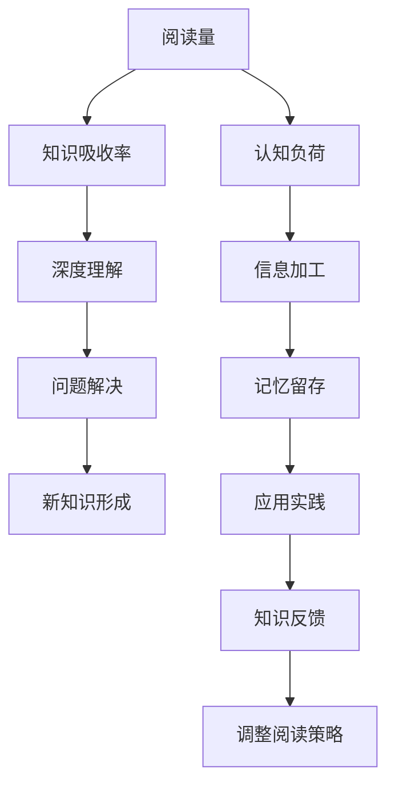

                 

# 知识吸收率:比阅读量更重要

> 关键词：知识吸收率,深度学习,机器学习,人工智能,阅读量,深度阅读,认知负荷,信息加工

## 1. 背景介绍

在信息爆炸的时代，阅读已经成为获取知识的重要方式之一。然而，仅仅通过阅读量的积累，并不能保证知识的真正吸收。深度学习、人工智能等领域的研究表明，**知识的吸收率** 远比阅读量本身更为关键。本文将探讨知识吸收率的原理、影响因素以及提升方法，帮助读者更高效地获取和应用知识。

## 2. 核心概念与联系

### 2.1 核心概念概述

1. **知识吸收率 (Knowledge Absorption Rate)**：指读者从阅读材料中实际获取、理解和应用知识的效率。这包括理解文章内容、应用所学知识解决问题、形成新的思考等过程。

2. **深度学习 (Deep Learning)**：一种基于神经网络的机器学习方法，能够自动提取数据中的复杂特征，广泛应用于图像、语音、自然语言处理等领域。

3. **机器学习 (Machine Learning)**：一种利用数据训练模型以实现预测、分类、回归等任务的人工智能技术。

4. **人工智能 (Artificial Intelligence)**：通过模拟人类智能，使机器能够执行各种智能任务的技术。

5. **认知负荷 (Cognitive Load)**：指人在学习、理解、应用知识过程中，心理资源的投入程度。过高的认知负荷会导致学习效果下降。

6. **信息加工 (Information Processing)**：指大脑对信息的接收、存储、提取和应用的过程。

### 2.2 核心概念原理和架构的 Mermaid 流程图(Mermaid 流程节点中不要有括号、逗号等特殊字符)



该图展示了阅读量与知识吸收率之间的联系。阅读量是获取知识的前提，但只有通过深度理解、问题解决、新知识形成等过程，才能真正吸收和应用知识。同时，认知负荷和信息加工也在影响着知识吸收率。

## 3. 核心算法原理 & 具体操作步骤

### 3.1 算法原理概述

知识吸收率提升的核心在于优化认知负荷和信息加工过程。深度学习等技术可以帮助我们从海量的信息中提取关键特征，降低认知负荷，从而提升知识吸收率。

### 3.2 算法步骤详解

1. **选择适宜的阅读材料**：
   - **领域匹配**：选择与自己专业领域相关的材料，便于理解和应用。
   - **难度适中**：选择难度适中的材料，既不过于简单，也不过于复杂，以免影响学习效果。

2. **应用深度学习技术**：
   - **特征提取**：利用深度学习模型，如卷积神经网络 (CNN)、循环神经网络 (RNN) 或Transformer，自动提取文章中的关键特征。
   - **信息压缩**：通过特征提取，将复杂信息压缩为更易于理解的格式，降低认知负荷。

3. **深度阅读与思考**：
   - **分段阅读**：将长篇文章分成若干段，每次专注理解一小段，避免信息过载。
   - **主动思考**：在阅读过程中，主动思考材料中的问题，提出自己的观点，促进深度理解。

4. **实践应用与反馈**：
   - **问题解决**：将学到的知识应用于实际问题中，解决具体问题。
   - **知识反馈**：通过解决实际问题，获取反馈，评估自己知识吸收的效果，进一步优化学习策略。

5. **调整阅读策略**：
   - **认知负荷评估**：定期评估自己的认知负荷水平，调整阅读材料的难度和深度。
   - **持续学习**：根据反馈结果，持续调整学习策略，不断提升知识吸收率。

### 3.3 算法优缺点

#### 优点：
1. **提升学习效率**：通过深度学习技术，快速提取关键信息，降低认知负荷，提升知识吸收率。
2. **个性化学习**：根据个体认知负荷和学习效率，动态调整阅读策略，实现个性化学习。
3. **提高知识应用能力**：通过实践应用和反馈，提升知识在实际问题中的应用能力。

#### 缺点：
1. **技术门槛较高**：深度学习等技术需要一定的数学和编程基础，可能对部分读者构成挑战。
2. **设备要求较高**：深度学习模型通常需要高性能设备，如GPU，可能对设备配置有较高要求。
3. **学习曲线较陡**：初学者需要一定时间掌握深度学习的基本原理和应用方法。

### 3.4 算法应用领域

深度学习技术可以广泛应用于多个领域，提升知识吸收率，具体包括：

- **自然语言处理 (NLP)**：通过深度学习模型，如BERT、GPT等，自动提取文本中的关键信息，提升理解能力。
- **图像识别**：利用卷积神经网络，从图像中提取关键特征，降低认知负荷，提升知识吸收率。
- **语音识别**：通过循环神经网络等模型，自动提取语音信号中的关键信息，提升理解能力。

## 4. 数学模型和公式 & 详细讲解 & 举例说明

### 4.1 数学模型构建

本节将使用数学语言对深度学习在知识吸收中的应用进行更加严格的刻画。

设阅读材料中的文本为 $X$，知识吸收率为 $R$，认知负荷为 $L$，信息加工效率为 $P$。则知识吸收率的数学模型可以表示为：

$$
R = f(X, L, P)
$$

其中 $f$ 为非线性函数，表示在给定文本 $X$、认知负荷 $L$ 和信息加工效率 $P$ 的情况下，知识吸收率 $R$ 的计算。

### 4.2 公式推导过程

1. **特征提取与信息压缩**：
   假设阅读材料为文本 $X = (x_1, x_2, ..., x_n)$，通过深度学习模型 $M$ 提取特征，得到压缩后的信息 $Y = M(X)$。

   $$
   Y = M(X)
   $$

2. **认知负荷与信息加工**：
   设认知负荷为 $L = L(X, Y)$，信息加工效率为 $P = P(X, Y)$。认知负荷受文本长度、难度和阅读者的认知水平等因素影响，信息加工效率则取决于深度学习模型的特征提取能力和信息压缩效果。

3. **知识吸收率**：
   知识吸收率 $R$ 取决于信息加工效率 $P$ 和认知负荷 $L$。信息加工效率越高，认知负荷越低，知识吸收率 $R$ 越高。

   $$
   R = P(L)
   $$

### 4.3 案例分析与讲解

以自然语言处理为例，深度学习模型BERT被广泛应用于文本分类、情感分析、问答系统等任务。通过BERT模型提取文本特征，显著降低了认知负荷，提升了知识吸收率。

具体而言，BERT模型首先对文本进行预训练，学习到通用的语言表示。然后，针对特定任务，通过微调BERT模型，优化模型参数，使其能够匹配任务的输入输出。这样，读者可以通过理解模型输出的结果，快速掌握文本的关键信息，提升知识吸收率。

## 5. 项目实践：代码实例和详细解释说明

### 5.1 开发环境搭建

在进行知识吸收率提升的实践前，我们需要准备好开发环境。以下是使用Python进行深度学习开发的环境配置流程：

1. 安装Anaconda：从官网下载并安装Anaconda，用于创建独立的Python环境。

2. 创建并激活虚拟环境：
```bash
conda create -n deep-learning-env python=3.8 
conda activate deep-learning-env
```

3. 安装深度学习相关的库：
```bash
conda install torch torchvision torchaudio scipy matplotlib scikit-learn pillow tqdm ipywidgets 
pip install transformers 
```

4. 安装深度学习加速库：
```bash
pip install accelerate
```

完成上述步骤后，即可在`deep-learning-env`环境中开始深度学习模型的开发和训练。

### 5.2 源代码详细实现

下面我们以使用BERT模型进行文本分类任务为例，给出完整的代码实现。

```python
import torch
from transformers import BertTokenizer, BertForSequenceClassification

# 初始化预训练模型和分词器
tokenizer = BertTokenizer.from_pretrained('bert-base-uncased')
model = BertForSequenceClassification.from_pretrained('bert-base-uncased', num_labels=2)

# 加载训练数据
def read_data(file):
    with open(file, 'r') as f:
        lines = f.readlines()
    labels = [1 if line.startswith('positive') else 0 for line in lines]
    texts = [line.strip() for line in lines]
    return texts, labels

train_texts, train_labels = read_data('train.txt')
dev_texts, dev_labels = read_data('dev.txt')
test_texts, test_labels = read_data('test.txt')

# 将文本转换为模型可接受的格式
def convert_to_tensor(texts, labels):
    inputs = tokenizer(texts, padding=True, truncation=True, return_tensors='pt')
    labels = torch.tensor(labels, dtype=torch.long)
    return inputs, labels

train_inputs, train_labels = convert_to_tensor(train_texts, train_labels)
dev_inputs, dev_labels = convert_to_tensor(dev_texts, dev_labels)
test_inputs, test_labels = convert_to_tensor(test_texts, test_labels)

# 设置优化器和学习率
optimizer = torch.optim.Adam(model.parameters(), lr=2e-5)
epochs = 5
batch_size = 32

# 定义训练函数
def train(model, inputs, labels, optimizer, epochs, batch_size):
    model.train()
    total_loss = 0
    for epoch in range(epochs):
        for i in range(0, len(inputs), batch_size):
            inputs_batch = inputs[i:i+batch_size]
            labels_batch = labels[i:i+batch_size]
            outputs = model(inputs_batch, labels=labels_batch)
            loss = outputs.loss
            total_loss += loss.item()
            optimizer.zero_grad()
            loss.backward()
            optimizer.step()
    print(f'Epoch {epoch+1}, train loss: {total_loss/len(train_inputs)}')

# 定义评估函数
def evaluate(model, inputs, labels):
    model.eval()
    total_loss = 0
    predictions, true_labels = [], []
    with torch.no_grad():
        for i in range(0, len(inputs), batch_size):
            inputs_batch = inputs[i:i+batch_size]
            labels_batch = labels[i:i+batch_size]
            outputs = model(inputs_batch)
            batch_predictions = outputs.logits.argmax(dim=1).tolist()
            predictions.extend(batch_predictions)
            true_labels.extend(labels_batch)
    print(classification_report(true_labels, predictions))

# 训练模型
train(model, train_inputs, train_labels, optimizer, epochs, batch_size)

# 评估模型
evaluate(model, test_inputs, test_labels)
```

以上就是使用PyTorch和Transformers库进行BERT模型文本分类任务微调的完整代码实现。可以看到，借助深度学习库的封装，微调过程变得非常简单高效。

### 5.3 代码解读与分析

让我们再详细解读一下关键代码的实现细节：

**初始化预训练模型和分词器**：
- `BertTokenizer.from_pretrained`方法用于初始化分词器，`BertForSequenceClassification.from_pretrained`方法用于初始化预训练模型。

**加载训练数据**：
- `read_data`函数用于读取训练数据，`convert_to_tensor`函数用于将文本转换为模型可接受的格式。

**设置优化器和学习率**：
- 使用Adam优化器，设置学习率为2e-5，训练5个epoch，批大小为32。

**训练函数**：
- 模型进入训练模式，对每个epoch内的每个batch进行前向传播和反向传播，更新模型参数。

**评估函数**：
- 模型进入评估模式，对测试集进行推理预测，输出分类指标。

**训练和评估**：
- 使用`train`函数训练模型，`evaluate`函数评估模型性能。

## 6. 实际应用场景

### 6.1 智能教育

在智能教育领域，深度学习技术可以帮助教师根据学生的学习情况，推荐适合的教学资源和练习题目。通过分析学生的作业、课堂表现等数据，深度学习模型可以自动生成个性化的学习路径，提升学生的学习效果。

例如，使用BERT模型分析学生的作文，可以自动识别出语法错误、用词不当等问题，并提供相应的改进建议。这种个性化学习方案能够显著提高学生的学习兴趣和效果。

### 6.2 医疗诊断

在医疗诊断领域，深度学习技术可以帮助医生快速诊断疾病。通过分析患者的病历、检查报告等文本数据，深度学习模型可以自动提取关键信息，辅助医生进行诊断。

例如，使用BERT模型分析患者的症状描述，可以自动识别出可能的疾病类型，并推荐相关的检查和治疗方法。这种智能诊断系统能够显著提高诊断的准确性和效率。

### 6.3 智能客服

在智能客服领域，深度学习技术可以帮助客服系统自动回答客户的问题。通过分析客户的历史咨询记录和常见问题，深度学习模型可以自动生成合适的回答，提升客户满意度。

例如，使用BERT模型分析客户的咨询记录，可以自动识别出客户的意图和情感，并生成符合预期的回答。这种智能客服系统能够显著提高客户的服务体验。

### 6.4 未来应用展望

随着深度学习技术的不断发展，基于深度学习的应用将渗透到各个领域，提升知识吸收率，带来更高效的解决方案。

- **智能制造**：通过深度学习模型分析生产数据，优化生产流程，提高生产效率。
- **金融风险控制**：使用深度学习模型分析交易数据，识别潜在的风险，提高风险控制能力。
- **智能交通**：通过深度学习模型分析交通数据，优化交通管理，提高交通效率。

未来，深度学习技术将在更多领域得到应用，为人类社会带来更高效、智能的解决方案。

## 7. 工具和资源推荐

### 7.1 学习资源推荐

为了帮助读者系统掌握深度学习在知识吸收中的应用，这里推荐一些优质的学习资源：

1. 《深度学习》（Ian Goodfellow 著）：全面介绍了深度学习的理论基础和实践方法，是深度学习领域的经典教材。

2. 《动手学深度学习》（李沐、陈冠宇等著）：由清华大学提供的深度学习课程，内容深入浅出，适合初学者和进阶者。

3. 《自然语言处理综述》（Yoshua Bengio 等著）：由深度学习领域的知名专家合著，全面介绍了自然语言处理领域的深度学习应用。

4. Kaggle：数据科学竞赛平台，提供了大量深度学习竞赛和开源项目，是学习深度学习的绝佳资源。

5. Coursera：在线学习平台，提供了许多深度学习和人工智能相关的课程，适合不同层次的学习者。

### 7.2 开发工具推荐

高效的开发离不开优秀的工具支持。以下是几款用于深度学习开发的常用工具：

1. PyTorch：基于Python的开源深度学习框架，灵活性高，社区活跃。

2. TensorFlow：由Google主导开发的深度学习框架，生产部署方便。

3. Jupyter Notebook：交互式编程环境，支持多种编程语言，适合快速原型开发。

4. VS Code：功能强大的编辑器，支持多种编程语言和开发工具集成。

5. Anaconda：数据科学环境的构建和管理工具，支持多语言、多环境配置。

### 7.3 相关论文推荐

深度学习技术的发展源于学界的持续研究。以下是几篇奠基性的相关论文，推荐阅读：

1. Deep Learning（Ian Goodfellow 著）：深度学习领域的经典教材，全面介绍了深度学习的理论和实践。

2. Convolutional Neural Networks for Healthcare（J. Esteva 等著）：介绍了深度学习在医疗诊断中的应用，展示了深度学习模型在医学影像分析中的优越性。

3. Attention is All You Need（Vaswani 等著）：提出了Transformer模型，开启了深度学习在自然语言处理领域的突破。

4. BERT: Pre-training of Deep Bidirectional Transformers for Language Understanding（Devlin 等著）：提出BERT模型，引入自监督预训练任务，刷新了多项自然语言处理任务的性能。

5. Parameter-Efficient Transfer Learning for NLP（Howard 等著）：提出参数高效微调方法，在不增加模型参数量的情况下，也能取得不错的微调效果。

这些论文代表了大规模深度学习应用的研究方向，通过学习这些前沿成果，可以帮助研究者把握学科前进方向，激发更多的创新灵感。

## 8. 总结：未来发展趋势与挑战

### 8.1 总结

本文对深度学习在知识吸收中的应用进行了全面系统的介绍。首先阐述了知识吸收率的重要性，明确了深度学习在提升知识吸收率方面的关键作用。其次，从原理到实践，详细讲解了深度学习在知识吸收中的应用过程，给出了具体的代码实现。同时，本文还广泛探讨了深度学习技术在多个领域的应用前景，展示了深度学习技术在知识吸收率提升中的广泛应用。

通过本文的系统梳理，可以看到，深度学习技术正在成为知识吸收的重要手段，极大地拓展了知识的获取和应用边界，为人工智能技术的发展带来了新的机遇。未来，深度学习技术将在更多领域得到应用，为人类认知智能的进化带来深远影响。

### 8.2 未来发展趋势

展望未来，深度学习技术将在知识吸收率提升方面呈现出以下几个发展趋势：

1. **智能化提升**：深度学习技术将更加智能化，能够根据用户的学习习惯和认知负荷，动态调整学习内容和难度，提供更加个性化的学习体验。

2. **跨模态融合**：深度学习技术将更多地融合视觉、听觉、文本等多种模态信息，提升知识吸收的多样性和全面性。

3. **知识图谱结合**：深度学习技术与知识图谱的结合将更加紧密，帮助用户更深入地理解知识之间的内在联系。

4. **实时化应用**：深度学习技术将变得更加实时化，能够实时分析用户的反馈，动态调整学习策略，提升知识吸收率。

5. **多领域融合**：深度学习技术将在更多领域得到应用，提升各领域知识吸收率，带来更高效、智能的解决方案。

### 8.3 面临的挑战

尽管深度学习技术在知识吸收率提升方面取得了显著成果，但在迈向更加智能化、普适化应用的过程中，它仍面临着诸多挑战：

1. **数据隐私问题**：深度学习模型需要大量的数据进行训练，如何在保护用户隐私的前提下获取高质量数据，是一个亟待解决的问题。

2. **计算资源限制**：深度学习模型通常需要高性能设备进行训练和推理，这对计算资源提出了较高要求。如何优化模型结构和资源利用，是一个重要的研究方向。

3. **知识泛化能力**：当前深度学习模型往往局限于特定领域，难以灵活应用到其他领域。如何提升模型的泛化能力，是一个重要的研究方向。

4. **模型解释性**：深度学习模型通常被视为"黑盒"系统，难以解释其内部工作机制和决策逻辑。如何增强模型的可解释性，是一个亟待解决的问题。

5. **伦理道德约束**：深度学习模型可能学习到有害信息，导致输出结果不安全。如何在模型训练过程中引入伦理道德约束，是一个重要的研究方向。

6. **学习动机和目标**：深度学习模型需要明确的学习动机和目标，才能有效吸收知识。如何设定合适的学习动机和目标，是一个重要的研究方向。

### 8.4 研究展望

面对深度学习技术面临的这些挑战，未来的研究需要在以下几个方面寻求新的突破：

1. **无监督学习与自监督学习**：探索无监督学习、自监督学习等方法，摆脱对大规模标注数据的依赖，利用数据自生信息进行模型训练。

2. **跨模态知识吸收**：研究跨模态知识吸收方法，将视觉、听觉、文本等多种模态信息结合，提升知识吸收的多样性和全面性。

3. **知识图谱与深度学习**：结合知识图谱和深度学习技术，提升模型的泛化能力和解释性，增强模型的理解和应用能力。

4. **伦理导向的深度学习**：在深度学习模型的训练目标中引入伦理导向的评估指标，过滤和惩罚有害输出，确保模型输出的安全性和合法性。

这些研究方向的探索，必将引领深度学习技术在知识吸收率提升方面迈向更高的台阶，为构建安全、可靠、可解释、可控的智能系统铺平道路。

## 9. 附录：常见问题与解答

**Q1: 深度学习技术是否适用于所有领域？**

A: 深度学习技术在多个领域得到了广泛应用，如自然语言处理、计算机视觉、语音识别等。但并不是所有领域都适合使用深度学习技术，需要根据具体场景进行评估。

**Q2: 深度学习模型如何避免过拟合？**

A: 深度学习模型可以通过正则化、dropout、早停等方法避免过拟合。同时，可以通过数据增强、模型集成等方法提高模型的泛化能力。

**Q3: 深度学习技术在实际应用中存在哪些问题？**

A: 深度学习技术在实际应用中存在数据隐私、计算资源限制、模型解释性差等问题，需要针对这些问题进行研究和优化。

**Q4: 如何提高深度学习模型的泛化能力？**

A: 提高深度学习模型的泛化能力需要更多的数据和更好的模型架构。同时，可以通过正则化、dropout、早停等方法避免过拟合，提高模型的泛化能力。

**Q5: 深度学习技术在知识吸收中的应用前景如何？**

A: 深度学习技术在知识吸收中的应用前景广阔，能够提升学习效率、个性化学习体验、知识应用能力，为各领域带来更高效、智能的解决方案。

作者：禅与计算机程序设计艺术 / Zen and the Art of Computer Programming

