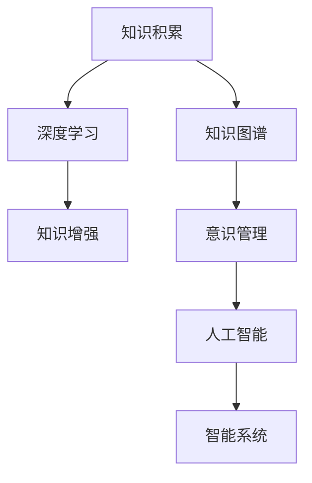

                 

# 知识积累在意识管理中的作用

> 关键词：知识积累, 意识管理, 人工智能, 知识图谱, 深度学习, 知识增强, 智能系统

## 1. 背景介绍

### 1.1 问题由来
随着信息技术的发展，知识管理在各行业中的应用日益广泛。知识管理不仅仅是知识的存储和检索，更重要的是知识的理解、分析和应用。意识的形成和发展离不开知识的积累，如何有效地管理知识和应用知识，使得意识形成更加高效和智能化，是当前知识管理的重要研究方向。

### 1.2 问题核心关键点
知识管理的目标是使组织和个人能够更好地利用知识，从而提高决策质量和效率。而意识的形成和发展则依赖于知识的积累和应用，因此如何通过知识管理提升意识的形成和发展，是知识管理研究的关键点。

### 1.3 问题研究意义
研究知识积累在意识管理中的作用，对于提高意识管理效率、促进智能系统发展、推动组织和个人能力的提升具有重要意义。意识管理是人工智能、人机交互等前沿技术的重要组成部分，了解其背后的知识管理机制，将有助于设计和构建更加智能化的人机交互系统。

## 2. 核心概念与联系

### 2.1 核心概念概述

为更好地理解知识积累在意识管理中的作用，本节将介绍几个关键概念：

- **知识积累**：指通过学习、实践、阅读等途径，获得和存储的知识不断积累的过程。知识积累不仅包括静态的知识，也包括动态的知识生成和应用。
- **意识管理**：指通过认知、感知、记忆等心理过程，将外界信息转化为个人意识的形成和发展的过程。意识管理是人的认知能力和智能系统的重要组成部分。
- **人工智能**：通过模拟人类的智能行为，使机器能够执行复杂的认知任务，如图像识别、语音识别、自然语言处理等。
- **知识图谱**：一种知识表示方法，将知识以图的形式组织起来，用于描述知识之间的关联和关系。
- **深度学习**：一种机器学习算法，通过多层神经网络对数据进行特征提取和模式识别，适用于复杂的认知任务。
- **知识增强**：通过知识图谱、深度学习等方法，增强人工智能系统的知识表示能力和推理能力，提升意识管理的效果。
- **智能系统**：具备自主学习和适应能力，能够通过不断积累知识和应用知识，实现智能决策和任务执行的系统。

这些概念之间的关系可以通过以下Mermaid流程图来展示：



这个流程图展示了知识积累通过知识图谱和深度学习等技术增强意识管理，进而提升人工智能系统能力和智能系统的逻辑关系。

## 3. 核心算法原理 & 具体操作步骤
### 3.1 算法原理概述

知识积累在意识管理中的作用，可以通过以下几个步骤来实现：

1. **知识获取**：通过阅读、学习、实践等途径，获取大量的知识和信息。
2. **知识存储**：将获取的知识存储在知识图谱中，形成结构化的知识表示。
3. **知识推理**：通过深度学习模型，对知识图谱中的知识进行推理和挖掘，发现新的知识关系。
4. **知识应用**：将推理出来的知识应用于意识管理中，通过智能系统实现高效的决策和任务执行。

### 3.2 算法步骤详解

**Step 1: 知识获取**
- **数据采集**：通过爬虫、API调用、用户输入等方式，获取相关的知识数据。
- **数据预处理**：清洗、去重、标准化处理，保证数据的质量和一致性。
- **数据存储**：将预处理后的数据存储在知识图谱中，形成结构化的知识表示。

**Step 2: 知识存储**
- **知识图谱构建**：设计知识图谱的节点和边，描述知识之间的关系。
- **知识图谱更新**：动态更新知识图谱，及时添加新的知识和关系。
- **知识图谱查询**：提供便捷的知识查询接口，支持多种查询方式，如实体查询、关系查询等。

**Step 3: 知识推理**
- **知识图谱嵌入**：将知识图谱中的知识进行向量化表示，形成高维向量空间。
- **知识推理模型**：构建深度学习模型，如神经网络、图神经网络等，对知识图谱进行推理和挖掘。
- **推理结果应用**：根据推理结果，提取有用的知识关系和信息，应用于意识管理中。

**Step 4: 知识应用**
- **智能系统集成**：将知识应用到智能系统中，如自然语言处理、图像识别、语音识别等。
- **智能决策支持**：通过智能系统进行决策支持，辅助用户做出更明智的选择。
- **任务执行优化**：根据推理结果，优化任务执行流程，提升任务执行的效率和质量。

### 3.3 算法优缺点

知识积累在意识管理中的应用，有以下优点：

1. **提高决策质量**：通过知识推理和应用，可以更好地理解问题和环境，做出更明智的决策。
2. **增强智能系统能力**：通过知识的积累和应用，提升智能系统的智能水平和应用效果。
3. **促进意识发展**：知识积累有助于形成更丰富的认知图式，促进意识的形成和发展。

同时，也存在一些局限性：

1. **数据获取难度大**：获取高质量的知识数据需要投入大量人力物力，存在较大的难度。
2. **知识图谱构建复杂**：知识图谱的构建需要专业知识和技能，存在较高的技术门槛。
3. **推理模型复杂**：深度学习模型需要大量的数据和计算资源，存在较大的实现难度。
4. **应用场景有限**：知识管理的效果和应用效果受限于具体的应用场景和领域。

尽管存在这些局限性，但知识积累在意识管理中的应用，仍然具有重要的研究价值和应用潜力。

### 3.4 算法应用领域

知识积累在意识管理中的应用，主要集中在以下几个领域：

- **自然语言处理**：通过知识图谱和深度学习，提高自然语言处理的准确性和智能化水平，辅助语言理解和生成。
- **智能推荐系统**：通过知识推理和应用，提供更加个性化和智能化的推荐结果，提升用户体验。
- **智能客服**：通过知识图谱和智能推理，实现智能化的客户服务和问题解决，提高服务效率和质量。
- **医疗诊断**：通过知识图谱和深度学习，辅助医生进行疾病诊断和决策，提升医疗服务质量。
- **金融风控**：通过知识图谱和智能推理，提高金融风险的预测和防范能力，保障金融安全。

这些领域的应用展示了知识积累在意识管理中的广泛前景和巨大潜力。

## 4. 数学模型和公式 & 详细讲解  
### 4.1 数学模型构建

本节将使用数学语言对知识积累在意识管理中的作用进行更加严格的刻画。

设知识图谱中的节点为$v$，关系为$e$，知识图谱的结构可以用图$G=(V,E)$表示。知识推理的目标是挖掘知识图谱中的潜在关系和模式，可以使用图神经网络（GNN）模型进行表示和推理。

知识图谱中的节点嵌入向量可以表示为$\vec{v}=\{\vec{v}_i\}_{i=1}^n$，其中$\vec{v}_i$为节点$i$的向量表示。知识图谱中的关系嵌入向量可以表示为$\vec{e}=\{\vec{e}_j\}_{j=1}^m$，其中$\vec{e}_j$为关系$j$的向量表示。

知识推理模型的目标是通过对知识图谱的节点和关系进行嵌入表示，然后对嵌入向量进行加权求和，得到节点或关系的表示向量。可以使用如下公式表示：

$$
\vec{h} = \sum_{j=1}^m W_e \vec{e}_j \vec{v}_j + \sum_{i=1}^n W_v \vec{v}_i
$$

其中$W_e$和$W_v$为节点和关系的权重矩阵。

### 4.2 公式推导过程

知识推理模型的具体实现可以采用图神经网络（GNN），如GCN、GAT等。以下以GCN模型为例，推导知识推理的具体公式。

GCN模型对节点$i$的嵌入表示$\vec{h}_i$的计算公式为：

$$
\vec{h}_i = \frac{1}{d_i} \sum_{j \in N(i)} \vec{v}_j \vec{e}_{ij}
$$

其中$d_i$为节点$i$的度数，$N(i)$为节点$i$的邻居节点集合。

GCN模型对关系$j$的嵌入表示$\vec{h}_j$的计算公式为：

$$
\vec{h}_j = \frac{1}{d_j} \sum_{i \in N(j)} \vec{v}_i \vec{e}_{ij}
$$

其中$d_j$为关系$j$的度数，$N(j)$为关系$j$的邻居节点集合。

GCN模型通过将节点和关系进行向量化表示，然后对向量进行加权求和，得到最终的节点和关系嵌入表示。这个嵌入表示可以作为推理模型的输出，用于辅助决策和任务执行。

### 4.3 案例分析与讲解

以智能推荐系统为例，分析知识推理在其中的作用。

在智能推荐系统中，用户和物品之间的关系可以通过知识图谱进行建模。假设知识图谱中包含用户$u$和物品$i$的关系$(u:i)$，知识图谱的节点表示为$v_{u,i}$，关系表示为$e_{u,i}$。

通过GCN模型对用户和物品的关系进行嵌入表示，可以得到用户和物品的嵌入向量$\vec{h}_u$和$\vec{h}_i$。这些嵌入向量可以作为推荐模型的输入，用于计算用户对物品的评分预测。

通过知识推理模型，可以进一步挖掘用户和物品之间的关系和模式，提高推荐模型的准确性和智能化水平。例如，可以推理出用户的历史行为和偏好，预测用户可能感兴趣的物品，从而提供更加个性化和智能化的推荐结果。

## 5. 项目实践：代码实例和详细解释说明
### 5.1 开发环境搭建

在进行知识推理实践前，我们需要准备好开发环境。以下是使用Python进行PyTorch开发的环境配置流程：

1. 安装Anaconda：从官网下载并安装Anaconda，用于创建独立的Python环境。

2. 创建并激活虚拟环境：
```bash
conda create -n graph-env python=3.8 
conda activate graph-env
```

3. 安装PyTorch：根据CUDA版本，从官网获取对应的安装命令。例如：
```bash
conda install pytorch torchvision torchaudio cudatoolkit=11.1 -c pytorch -c conda-forge
```

4. 安装Graph Neural Network库：
```bash
pip install pyg nnpy networkx
```

5. 安装各类工具包：
```bash
pip install numpy pandas scikit-learn matplotlib tqdm jupyter notebook ipython
```

完成上述步骤后，即可在`graph-env`环境中开始知识推理实践。

### 5.2 源代码详细实现

这里我们以知识图谱中的关系推理为例，给出使用PyTorch进行知识图谱嵌入和推理的PyTorch代码实现。

首先，定义知识图谱的节点和关系：

```python
import torch
from pyg.data import DGLGraph
from pyg.nn import GATConv, MLP

# 构建知识图谱
g = DGLGraph(([1, 2, 2, 1], [0, 0, 1, 2]))

# 定义节点和关系表示
v = torch.randn((5, 10))
e = torch.randn((4, 10))

# 定义节点和关系嵌入层
mlp_v = MLP(10, 10)
mlp_e = MLP(10, 10)

# 将节点和关系嵌入层应用于图
g.ndata['v'] = mlp_v(v)
g.edata['e'] = mlp_e(e)
```

然后，定义知识推理的GATConv层：

```python
# 定义GATConv层
conv = GATConv(g, g.ndata['v'].shape[1], g.edata['e'].shape[1], heads=1, num_layers=1)

# 将GATConv层应用于图
h = conv(g)
```

最后，输出知识推理的结果：

```python
# 输出节点嵌入向量
print(h.data)
```

以上就是使用PyTorch进行知识图谱嵌入和推理的完整代码实现。可以看到，通过PyTorch和PyG等工具，可以很方便地实现知识图谱的嵌入和推理，为知识管理的应用提供了强大的技术支撑。

### 5.3 代码解读与分析

让我们再详细解读一下关键代码的实现细节：

**知识图谱构建**：
- `DGLGraph`：使用PyG库构建知识图谱，其中`([1, 2, 2, 1], [0, 0, 1, 2])`表示节点的邻居关系，即节点1和节点2之间有两条边。

**节点和关系嵌入层**：
- `MLP`：定义一个全连接神经网络，用于对节点和关系进行嵌入表示。
- `v`和`e`：定义节点的特征向量和关系的特征向量。
- `mlp_v`和`mlp_e`：将节点和关系的特征向量通过MLP层进行嵌入表示。

**知识推理层**：
- `GATConv`：定义GATConv层，用于对知识图谱进行推理。
- `conv`：将GATConv层应用于知识图谱。
- `h`：输出节点嵌入向量。

可以看到，通过简单的代码实现，就可以对知识图谱进行嵌入和推理，进而辅助决策和任务执行。

## 6. 实际应用场景
### 6.1 智能推荐系统

在智能推荐系统中，知识推理可以用于挖掘用户和物品之间的关系和模式，提高推荐模型的准确性和智能化水平。

具体而言，可以收集用户和物品的历史行为数据，构建知识图谱，并对其进行嵌入表示。通过知识推理模型，可以发现用户和物品之间的潜在关系和模式，预测用户可能感兴趣的物品，从而提供更加个性化和智能化的推荐结果。

### 6.2 智能客服

在智能客服系统中，知识推理可以用于辅助问题解决和用户对话，提升客服系统的智能化水平。

具体而言，可以收集用户的历史对话记录和问题，构建知识图谱，并对其进行嵌入表示。通过知识推理模型，可以发现用户问题的潜在模式和解决方案，引导智能客服系统提供更准确的答案和解决方案。

### 6.3 医疗诊断

在医疗诊断中，知识推理可以用于辅助医生进行疾病诊断和决策，提升医疗服务质量。

具体而言，可以构建医疗知识图谱，包含疾病、症状、诊断等关系和信息。通过知识推理模型，可以发现患者的症状和疾病的潜在关系，辅助医生进行疾病诊断和决策。

### 6.4 未来应用展望

随着知识图谱和深度学习技术的发展，知识推理在智能系统中的应用将更加广泛和深入。未来的研究方向可能包括：

1. **多模态知识推理**：将视觉、听觉、文本等不同模态的知识进行融合，构建多模态知识图谱，提高知识推理的全面性和准确性。
2. **自适应知识推理**：通过自适应学习算法，实时更新知识图谱和推理模型，提高知识推理的动态性和灵活性。
3. **跨领域知识推理**：将不同领域之间的知识进行融合和推理，提高跨领域知识应用的泛化性和鲁棒性。
4. **知识推理与深度学习结合**：将知识推理与深度学习技术相结合，构建更加智能和高效的决策支持系统。

这些技术的发展，将进一步推动知识推理在智能系统中的应用，提升系统的智能化水平和应用效果。

## 7. 工具和资源推荐
### 7.1 学习资源推荐

为了帮助开发者系统掌握知识积累在意识管理中的作用，这里推荐一些优质的学习资源：

1. 《知识图谱理论与应用》系列博文：由知识图谱领域的专家撰写，深入浅出地介绍了知识图谱的原理、构建和应用。

2. 《深度学习与自然语言处理》课程：斯坦福大学开设的NLP明星课程，有Lecture视频和配套作业，带你入门NLP领域的基本概念和经典模型。

3. 《自然语言处理中的知识表示与推理》书籍：全面介绍了自然语言处理中的知识表示和推理技术，包括知识图谱、深度学习等前沿话题。

4. Stanford Knowledge Graphs：斯坦福大学推出的知识图谱库，包含大规模的语义数据和推理模型，是学习和研究知识图谱的绝佳资源。

5. Semantic Scholar：知识图谱和深度学习领域的开源项目平台，提供丰富的论文和代码资源，方便开发者学习和实践。

通过对这些资源的学习实践，相信你一定能够快速掌握知识积累在意识管理中的作用，并用于解决实际的智能系统问题。

### 7.2 开发工具推荐

高效的开发离不开优秀的工具支持。以下是几款用于知识推理开发的常用工具：

1. PyTorch：基于Python的开源深度学习框架，灵活动态的计算图，适合快速迭代研究。大部分知识推理模型都有PyTorch版本的实现。

2. TensorFlow：由Google主导开发的开源深度学习框架，生产部署方便，适合大规模工程应用。同样有丰富的知识图谱和推理模型资源。

3. PyG：一个用于图神经网络的库，支持大规模的图数据处理和推理模型构建，适合大规模的图推理应用。

4. NetworkX：一个用于构建、操作和分析复杂网络结构的库，适合知识图谱的构建和分析。

5. Jupyter Notebook：一个交互式的编程环境，方便开发者快速迭代和验证知识推理模型的效果。

合理利用这些工具，可以显著提升知识推理任务的开发效率，加快创新迭代的步伐。

### 7.3 相关论文推荐

知识推理的研究源于学界的持续研究。以下是几篇奠基性的相关论文，推荐阅读：

1. Transductive Learning via Spectral Embedding：提出图谱嵌入算法，用于对知识图谱进行嵌入表示和推理。

2. Reasoning over Knowledge Graphs using Neural Tensor Networks：提出基于神经张量网络的知识推理模型，用于对知识图谱进行推理和模式挖掘。

3. Knowledge Graph Reasoning with Graph Neural Networks：提出基于图神经网络的知识推理模型，用于对知识图谱进行推理和关系发现。

4. Graph Convolutional Networks：提出图卷积网络（GCN），用于对图数据进行嵌入表示和推理。

5. Learning with Self-Attentional Graph Networks：提出自注意力图网络（GAT），用于对图数据进行嵌入表示和推理。

这些论文代表了大语言模型微调技术的发展脉络。通过学习这些前沿成果，可以帮助研究者把握学科前进方向，激发更多的创新灵感。

## 8. 总结：未来发展趋势与挑战

### 8.1 总结

本文对知识积累在意识管理中的作用进行了全面系统的介绍。首先阐述了知识管理的目标和意识管理的本质，明确了知识积累在意识管理中的关键作用。其次，从原理到实践，详细讲解了知识积累和应用的具体步骤，给出了知识推理任务开发的完整代码实例。同时，本文还广泛探讨了知识推理在多个领域的应用前景，展示了知识推理范式的巨大潜力。此外，本文精选了知识推理技术的各类学习资源，力求为读者提供全方位的技术指引。

通过本文的系统梳理，可以看到，知识积累在意识管理中的应用，正在成为智能系统的重要组成部分，极大地提升了系统的智能水平和应用效果。知识推理技术的发展，将进一步推动智能系统的智能化进程，为人类认知智能的进化带来深远影响。

### 8.2 未来发展趋势

展望未来，知识推理技术将呈现以下几个发展趋势：

1. **知识图谱的智能化**：随着深度学习和大数据技术的发展，知识图谱将变得更加智能化和动态化，能够自动发现和更新知识关系。
2. **跨领域知识融合**：将不同领域之间的知识进行融合和推理，提高跨领域知识应用的泛化性和鲁棒性。
3. **多模态知识推理**：将视觉、听觉、文本等不同模态的知识进行融合，构建多模态知识图谱，提高知识推理的全面性和准确性。
4. **自适应知识推理**：通过自适应学习算法，实时更新知识图谱和推理模型，提高知识推理的动态性和灵活性。
5. **跨领域知识推理**：将不同领域之间的知识进行融合和推理，提高跨领域知识应用的泛化性和鲁棒性。
6. **知识推理与深度学习结合**：将知识推理与深度学习技术相结合，构建更加智能和高效的决策支持系统。

这些趋势凸显了知识推理技术的广阔前景。这些方向的探索发展，将进一步提升智能系统的性能和应用范围，为人类认知智能的进化带来深远影响。

### 8.3 面临的挑战

尽管知识推理技术已经取得了瞩目成就，但在迈向更加智能化、普适化应用的过程中，它仍面临着诸多挑战：

1. **数据获取难度大**：获取高质量的知识数据需要投入大量人力物力，存在较大的难度。
2. **知识图谱构建复杂**：知识图谱的构建需要专业知识和技能，存在较高的技术门槛。
3. **推理模型复杂**：深度学习模型需要大量的数据和计算资源，存在较大的实现难度。
4. **应用场景有限**：知识推理的效果和应用效果受限于具体的应用场景和领域。
5. **知识推理的动态性**：知识图谱需要定期更新和维护，保持动态性。
6. **知识推理的鲁棒性**：知识推理模型需要在噪声数据下保持稳定和鲁棒性。

尽管存在这些挑战，但知识推理技术的发展潜力巨大，未来仍需进一步优化和改进，才能充分发挥其在智能系统中的作用。

### 8.4 研究展望

面对知识推理面临的挑战，未来的研究需要在以下几个方面寻求新的突破：

1. **自动化知识图谱构建**：通过自动学习算法，自动构建和更新知识图谱，减少人工干预。
2. **跨领域知识融合**：研究如何通过知识融合技术，提高跨领域知识推理的准确性和泛化性。
3. **多模态知识推理**：研究如何通过多模态融合技术，提高知识推理的全面性和准确性。
4. **知识推理与深度学习结合**：研究如何将知识推理与深度学习技术相结合，提高知识推理的效果和智能系统的性能。
5. **知识推理的鲁棒性**：研究如何提高知识推理的鲁棒性，使其在噪声数据下保持稳定。

这些研究方向将推动知识推理技术的发展，为智能系统的智能化和普适化提供技术支撑。通过不断的探索和优化，相信知识推理技术必将在未来人工智能的发展中发挥重要作用，为人类认知智能的进化带来新的突破。

## 9. 附录：常见问题与解答

**Q1：知识推理在智能系统中如何应用？**

A: 知识推理在智能系统中的应用非常广泛，主要体现在以下几个方面：
1. 自然语言处理：通过知识推理，可以更好地理解语言和语义，提高自然语言处理的准确性和智能化水平。
2. 智能推荐系统：通过知识推理，可以发现用户和物品之间的潜在关系和模式，提高推荐系统的个性化和智能化水平。
3. 智能客服：通过知识推理，可以发现用户问题的潜在模式和解决方案，提升客服系统的智能化水平。
4. 医疗诊断：通过知识推理，可以发现患者的症状和疾病的潜在关系，辅助医生进行疾病诊断和决策。

**Q2：知识推理的实现难度有多大？**

A: 知识推理的实现难度较大，主要体现在以下几个方面：
1. 知识图谱构建：知识图谱的构建需要大量的数据和专业技能，存在较高的技术门槛。
2. 知识推理模型的设计：知识推理模型需要考虑节点和关系的嵌入表示、关系推理等复杂问题，设计难度较大。
3. 数据获取和处理：知识推理需要大量的高质量数据，数据获取和处理难度较大。
4. 知识推理的动态性：知识图谱需要定期更新和维护，保持动态性。

尽管存在这些挑战，但知识推理技术的发展潜力巨大，未来仍需进一步优化和改进，才能充分发挥其在智能系统中的作用。

**Q3：知识推理与深度学习的关系是什么？**

A: 知识推理与深度学习的关系非常密切，二者可以相互促进和互补。
1. 深度学习可以用于知识图谱的构建和嵌入表示，提高知识推理的全面性和准确性。
2. 知识推理可以用于深度学习的训练和优化，提高深度学习的泛化性和鲁棒性。
3. 二者可以结合使用，构建更加智能和高效的决策支持系统。

通过深入研究和结合，知识推理和深度学习将进一步推动智能系统的发展，为人类认知智能的进化带来新的突破。

**Q4：知识推理在智能系统中的应用前景如何？**

A: 知识推理在智能系统中的应用前景非常广阔，未来将有以下几个发展方向：
1. 多模态知识推理：将视觉、听觉、文本等不同模态的知识进行融合，构建多模态知识图谱，提高知识推理的全面性和准确性。
2. 跨领域知识融合：将不同领域之间的知识进行融合和推理，提高跨领域知识应用的泛化性和鲁棒性。
3. 自适应知识推理：通过自适应学习算法，实时更新知识图谱和推理模型，提高知识推理的动态性和灵活性。
4. 知识推理与深度学习结合：将知识推理与深度学习技术相结合，构建更加智能和高效的决策支持系统。
5. 知识推理的鲁棒性：研究如何提高知识推理的鲁棒性，使其在噪声数据下保持稳定。

这些研究方向将推动知识推理技术的发展，为智能系统的智能化和普适化提供技术支撑。

**Q5：知识推理与传统的知识管理有何不同？**

A: 知识推理与传统的知识管理有以下几个不同之处：
1. 知识推理更加智能化和动态化，能够自动发现和更新知识关系。
2. 知识推理更加注重知识的推理和应用，而不仅仅是知识的存储和检索。
3. 知识推理可以应用于多个领域，而不仅仅是数据存储和检索。
4. 知识推理需要大量的高质量数据和专业技能，而不仅仅是简单的数据存储和检索。
5. 知识推理的目标是提高智能系统的智能化水平和应用效果，而不仅仅是知识管理。

总之，知识推理是知识管理的新方向，代表了知识管理的发展趋势。

---

作者：禅与计算机程序设计艺术 / Zen and the Art of Computer Programming

