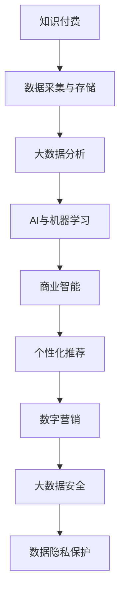

                 

# 知识经济下知识付费的云计算与大数据服务

> 关键词：知识付费, 云计算, 大数据, AI, 商业智能, 个性化推荐, 数字营销, 大数据安全, 数据隐私保护

## 1. 背景介绍

### 1.1 问题由来

在知识经济时代，知识付费已成为推动内容消费和知识传播的重要模式。传统知识传播往往依赖于书籍、杂志、电视等媒介，难以达到广泛覆盖和精准传播的效果。而知识付费则通过订阅制、按需购买等方式，将知识内容与用户个性化需求紧密结合，极大地提升了知识传播的效率和质量。

云计算与大数据技术的结合，使得知识付费平台能够更加高效地存储、处理和分析海量数据，提供更加精准和个性化的知识服务。云计算平台提供了弹性的计算和存储资源，大数据技术则通过数据挖掘和分析，挖掘出用户行为和偏好的规律，实现了从内容推荐到服务定制的全面升级。

### 1.2 问题核心关键点

知识付费的云计算与大数据服务主要包括三个核心环节：

1. **数据采集与存储**：通过云计算平台收集和存储用户行为数据，如浏览记录、购买记录、评价反馈等。
2. **数据分析与处理**：运用大数据技术进行用户行为分析，预测用户需求，提供个性化的知识推荐和服务。
3. **服务部署与优化**：基于云计算平台，动态部署知识服务应用，根据用户反馈实时优化推荐算法和服务质量。

这三个环节相互关联，共同构成了知识付费平台的云大服务体系。

## 2. 核心概念与联系

### 2.1 核心概念概述

- **知识付费**：基于互联网平台，通过订阅或付费方式，提供高质量、高价值的知识内容，满足用户个性化、专业化的学习需求。
- **云计算**：通过互联网提供计算资源和服务的分布式计算模式，具有高弹性、高可扩展性，适用于大数据处理和分布式应用。
- **大数据**：指规模巨大、复杂多样、实时更新的数据集合，通过分析挖掘可以揭示有价值的信息和知识，为决策提供支持。
- **AI与机器学习**：利用算法和模型对数据进行分析和预测，提升数据处理和知识服务的能力。
- **商业智能(BI)**：通过数据挖掘和分析，帮助企业实现业务优化和决策支持。
- **个性化推荐**：根据用户历史行为和偏好，推荐符合其兴趣和需求的内容和服务。
- **数字营销**：利用云计算和大数据分析技术，实现精准的用户行为分析和市场细分，提高营销效果。
- **大数据安全**：保护数据隐私和安全，防止数据泄露和滥用。
- **数据隐私保护**：确保用户数据不被滥用，保护用户隐私权益。

这些概念之间的联系可以通过以下Mermaid流程图来展示：



这个流程图展示了大数据在知识付费平台中的应用流程：

1. 通过云计算平台采集用户行为数据。
2. 利用大数据技术对用户数据进行分析和处理。
3. 运用AI和机器学习算法，构建推荐系统和决策模型。
4. 基于商业智能技术，实现业务优化和策略调整。
5. 提供个性化推荐和精准的数字营销服务。
6. 确保数据安全，保护用户隐私。

## 3. 核心算法原理 & 具体操作步骤
### 3.1 算法原理概述

知识付费平台的云计算与大数据服务主要依赖于以下几项关键算法：

- **用户行为分析算法**：通过大数据技术，分析用户浏览、购买、评价等行为数据，挖掘出用户兴趣和需求。
- **推荐算法**：基于用户历史行为和偏好，推荐符合其兴趣的内容和服务。
- **情感分析算法**：分析用户评论和反馈，挖掘用户对内容和服务的主观评价。
- **实时优化算法**：根据用户反馈和行为变化，实时调整推荐算法和服务策略，提升用户体验和满意度。

这些算法共同构成了知识付费平台的云大服务核心，通过算法优化和模型训练，不断提升平台的知识服务质量。

### 3.2 算法步骤详解

**步骤1: 数据采集与存储**

1. **数据收集**：
   - 利用云计算平台，从用户终端、网页、移动应用等渠道收集用户行为数据，如浏览记录、购买记录、评价反馈等。
   - 集成多种数据源，构建全链路的用户行为数据采集体系。

2. **数据存储**：
   - 利用云计算平台的数据存储服务，如Amazon S3、阿里云OSS等，建立高效可靠的数据存储系统。
   - 采用分布式文件存储和数据库，确保数据的快速访问和高可靠性。

**步骤2: 大数据分析与处理**

1. **数据预处理**：
   - 清洗、去重、归一化用户行为数据，去除无效和异常数据。
   - 采用数据分片、分布式计算等技术，提高数据处理效率。

2. **特征提取**：
   - 通过TF-IDF、Word2Vec等算法，提取用户行为数据的特征，用于后续分析和建模。
   - 使用特征工程方法，构建用户兴趣和需求模型。

3. **数据挖掘与分析**：
   - 利用Apache Spark、Hadoop等大数据处理框架，对用户行为数据进行分布式计算和分析。
   - 挖掘用户行为数据中的规律和趋势，构建用户画像和兴趣模型。

**步骤3: 人工智能与机器学习**

1. **模型训练**：
   - 基于用户行为数据和特征，训练推荐算法和决策模型，如协同过滤、内容推荐、情感分析等。
   - 采用深度学习模型，如TensorFlow、PyTorch等，提高模型的预测精度和泛化能力。

2. **模型部署**：
   - 将训练好的模型部署到云计算平台，如AWS Lambda、阿里云函数计算等，实现实时推荐和预测。
   - 采用容器化技术，如Docker、Kubernetes等，优化模型的部署和管理。

**步骤4: 商业智能与个性化推荐**

1. **商业智能应用**：
   - 利用商业智能工具，如Tableau、Power BI等，构建仪表盘和报表，实现业务优化和决策支持。
   - 分析用户行为数据，挖掘业务趋势和潜在问题，提出改进建议和策略。

2. **个性化推荐系统**：
   - 基于用户历史行为和特征，构建个性化推荐模型，推荐符合用户兴趣的内容和服务。
   - 使用A/B测试等方法，评估推荐算法的效果，优化推荐策略。

**步骤5: 数字营销与大数据安全**

1. **数字营销**：
   - 利用大数据分析技术，实现精准的用户行为分析和市场细分。
   - 制定个性化的数字营销策略，提升营销效果和用户转化率。

2. **大数据安全与隐私保护**：
   - 采用数据加密、访问控制等技术，确保数据在存储和传输过程中的安全性。
   - 制定数据隐私保护策略，确保用户数据不被滥用和泄露。

### 3.3 算法优缺点

**优点**：
- **高效性**：通过云计算和大数据分析，快速处理海量数据，提供实时推荐和决策支持。
- **个性化**：利用用户行为数据，实现精准的用户画像和个性化推荐。
- **可扩展性**：云计算平台具有高弹性、高可扩展性，适用于大流量、高并发场景。
- **实时性**：通过实时数据处理和模型部署，及时响应用户需求和行为变化。

**缺点**：
- **数据隐私风险**：大量用户数据存储和处理，存在数据泄露和滥用的风险。
- **计算成本高**：大数据处理和机器学习模型的训练和部署，需要高性能的计算资源。
- **算法复杂度**：推荐算法和商业智能模型较为复杂，需要专业的数据科学家和技术团队支持。

## 4. 数学模型和公式 & 详细讲解  
### 4.1 数学模型构建

本节将使用数学语言对知识付费平台的大数据服务进行更加严格的刻画。

记知识付费平台的用户行为数据集为 $D=\{(x_i,y_i)\}_{i=1}^N, x_i \in \mathbb{R}^d, y_i \in \mathbb{R}$，其中 $x_i$ 表示用户行为数据，$y_i$ 表示用户行为标签。假设用户行为数据具有分布 $p(x)$，用户行为标签具有分布 $q(y|x)$。

定义知识付费平台的推荐算法为 $f(x; \theta)$，其中 $\theta$ 为模型参数。推荐算法的作用是将用户行为数据映射到推荐结果，即 $y=f(x; \theta)$。

### 4.2 公式推导过程

**推荐算法评估指标**：
- **准确率**：推荐的正确次数占总推荐次数的比例，即 $Accuracy=\frac{TP}{TP+FP+FN+TN}$。
- **召回率**：推荐的正确次数占总标签次数的比例，即 $Recall=\frac{TP}{TP+FN}$。
- **F1-score**：综合考虑准确率和召回率，用于评估推荐算法的整体性能，即 $F1-score=\frac{2*Accuracy*Recall}{Accuracy+Recall}$。

**推荐算法训练目标**：
- 最小化推荐误差，即 $\min_{\theta}\frac{1}{N}\sum_{i=1}^N\mathcal{L}(f(x_i; \theta), y_i)$，其中 $\mathcal{L}$ 为损失函数，如均方误差损失、交叉熵损失等。

**推荐算法优化**：
- 使用梯度下降等优化算法，更新模型参数 $\theta$，使得推荐算法在损失函数下最小化。
- 使用随机梯度下降算法，将训练数据分成多个批次，逐批更新模型参数。

**推荐算法评估与优化**：
- 在验证集上评估推荐算法的效果，通过A/B测试等方法调整模型参数和算法策略。
- 实时监控推荐算法的性能，根据用户反馈调整推荐策略。

### 4.3 案例分析与讲解

**案例1：基于协同过滤的推荐系统**
- **算法原理**：基于用户和物品的相似度，推荐用户可能感兴趣的物品。
- **实现步骤**：
  1. 收集用户行为数据，提取用户兴趣和物品特征。
  2. 构建用户-物品相似度矩阵。
  3. 根据用户兴趣和相似度矩阵，推荐用户可能感兴趣的物品。
- **效果评估**：通过准确率、召回率、F1-score等指标评估推荐算法的效果。

**案例2：基于内容的推荐系统**
- **算法原理**：根据用户历史行为和物品属性，推荐内容相似的物品。
- **实现步骤**：
  1. 提取用户行为和物品属性特征。
  2. 计算物品之间的相似度。
  3. 根据用户历史行为和相似度，推荐物品。
- **效果评估**：通过准确率、召回率、F1-score等指标评估推荐算法的效果。

**案例3：基于深度学习的推荐系统**
- **算法原理**：使用神经网络模型，直接预测用户对物品的评分。
- **实现步骤**：
  1. 收集用户行为数据和物品属性数据。
  2. 构建神经网络模型，训练模型参数。
  3. 根据用户行为和模型预测，推荐物品。
- **效果评估**：通过准确率、召回率、F1-score等指标评估推荐算法的效果。

## 5. 项目实践：代码实例和详细解释说明
### 5.1 开发环境搭建

在进行知识付费平台的云计算与大数据服务开发前，我们需要准备好开发环境。以下是使用Python进行PyTorch开发的环境配置流程：

1. 安装Anaconda：从官网下载并安装Anaconda，用于创建独立的Python环境。

2. 创建并激活虚拟环境：
```bash
conda create -n pytorch-env python=3.8 
conda activate pytorch-env
```

3. 安装PyTorch：根据CUDA版本，从官网获取对应的安装命令。例如：
```bash
conda install pytorch torchvision torchaudio cudatoolkit=11.1 -c pytorch -c conda-forge
```

4. 安装TensorFlow：从官网下载并安装TensorFlow，适配PyTorch环境。

5. 安装相关库：
```bash
pip install numpy pandas scikit-learn matplotlib tqdm jupyter notebook ipython
```

完成上述步骤后，即可在`pytorch-env`环境中开始项目实践。

### 5.2 源代码详细实现

下面我们以基于深度学习的推荐系统为例，给出使用TensorFlow和Keras实现推荐系统的代码。

```python
import tensorflow as tf
from tensorflow.keras.models import Sequential
from tensorflow.keras.layers import Input, Embedding, Flatten, Dense

# 定义模型
model = Sequential([
    Input(shape=(d,), dtype='int32'),
    Embedding(vocab_size, embedding_dim, input_length=seq_len),
    Flatten(),
    Dense(hidden_dim, activation='relu'),
    Dense(num_items, activation='sigmoid')
])

# 编译模型
model.compile(optimizer='adam', loss='binary_crossentropy', metrics=['accuracy'])

# 训练模型
model.fit(X_train, y_train, epochs=10, batch_size=32, validation_data=(X_test, y_test))
```

以上代码实现了基于深度学习的推荐系统，包括数据输入、模型定义、编译和训练等步骤。

### 5.3 代码解读与分析

让我们再详细解读一下关键代码的实现细节：

**Input层**：定义输入数据的形状和数据类型，这里我们假设用户行为数据为一个整数序列，长度为`seq_len`。

**Embedding层**：将整数序列转换为向量表示，每个整数映射到一个固定维度的向量。

**Flatten层**：将二维的向量序列展平成一维，方便后续层的处理。

**Dense层**：定义全连接层，使用ReLU激活函数，提取输入特征。

**输出层**：定义输出层，使用Sigmoid激活函数，输出用户对物品的评分。

**编译模型**：定义优化器、损失函数和评估指标，进行模型编译。

**训练模型**：使用训练数据集进行模型训练，设定训练轮数和批次大小。

可以看到，TensorFlow和Keras提供了丰富的模型构建和训练功能，大大简化了推荐系统的开发流程。开发者可以将更多精力放在特征工程和模型优化上，而不必过多关注底层的实现细节。

当然，工业级的系统实现还需考虑更多因素，如模型的保存和部署、超参数的自动搜索、更灵活的任务适配层等。但核心的算法流程基本与此类似。

## 6. 实际应用场景
### 6.1 在线教育平台

在线教育平台通过知识付费服务，向用户提供优质的课程资源和学习工具。利用云计算与大数据技术，可以实现对用户学习行为的高效分析和个性化推荐，提升学习效果和用户满意度。

在技术实现上，可以收集用户的课程浏览、学习进度、作业提交等行为数据，分析其学习兴趣和偏好。基于分析结果，为每位用户推荐适合的课程、习题和视频，并提供定制化的学习计划和反馈机制。这样，用户可以更加高效地学习和掌握知识，实现从内容消费到知识内化的跨越。

### 6.2 专业培训机构

专业培训机构通过知识付费服务，提供针对特定领域的培训课程和认证。利用云计算与大数据技术，可以实现对用户学习行为的深入分析和精准推荐，提升培训效果和机构收益。

具体而言，可以收集用户的学习记录、作业反馈、证书申请等数据，分析其专业能力和知识需求。基于分析结果，为每位用户推荐适合的培训课程、习题和资料，并提供个性化的学习路径和进度跟踪。这样，用户可以更加系统地掌握专业知识，实现从初级到高级的跃迁，提升其职业竞争力。

### 6.3 金融理财平台

金融理财平台通过知识付费服务，向用户提供金融市场分析和投资策略。利用云计算与大数据技术，可以实现对用户投资行为的深入分析和精准推荐，提升投资效果和用户满意度。

在技术实现上，可以收集用户的投资记录、收益报告、风险评估等数据，分析其投资兴趣和风险偏好。基于分析结果，为每位用户推荐适合的投资产品、策略和方案，并提供个性化的风险管理工具和投资建议。这样，用户可以更加理性地进行投资，提升其资产增值能力和风险控制能力。

### 6.4 未来应用展望

随着云计算与大数据技术的不断进步，知识付费平台的大数据服务将呈现以下几个发展趋势：

1. **实时数据处理**：通过流计算和实时数据处理技术，实现对用户行为的实时分析和预测。

2. **深度学习应用**：引入深度学习模型，提升推荐算法的精度和泛化能力。

3. **多模态融合**：将文本、图像、语音等多模态数据融合，实现更全面、更精准的用户行为分析。

4. **联邦学习**：利用联邦学习技术，保护用户隐私的同时，提升知识服务的精准度。

5. **边缘计算**：利用边缘计算技术，实现数据的本地处理和分析，提升服务响应速度。

6. **区块链技术**：利用区块链技术，确保用户数据的安全性和不可篡改性。

以上趋势凸显了云计算与大数据技术在知识付费平台中的重要价值，通过不断优化算法和提升技术能力，知识付费平台将更好地满足用户需求，提升知识服务的质量和效益。

## 7. 工具和资源推荐
### 7.1 学习资源推荐

为了帮助开发者系统掌握云计算与大数据服务的技术基础和应用实践，这里推荐一些优质的学习资源：

1. **《深度学习》书籍**：Ian Goodfellow等人所著，全面介绍了深度学习的基本概念和算法，是入门学习的经典教材。

2. **《大数据技术与应用》课程**：清华大学开设的大数据相关课程，涵盖大数据技术基础、Hadoop、Spark等主流框架，适合深入学习。

3. **《TensorFlow实战》书籍**：Manning出版社出版的TensorFlow实战指南，详细介绍了TensorFlow的使用方法和案例实践。

4. **《Keras实战》书籍**：François Chollet所著，介绍了Keras的基本用法和高级应用，是使用深度学习模型的实用指南。

5. **AWS云服务文档**：AWS官方文档，提供了丰富的云服务和计算资源，是开发和部署云大服务的重要参考。

6. **阿里云云服务文档**：阿里云官方文档，提供了丰富的云服务和计算资源，是开发和部署云大服务的重要参考。

通过对这些资源的学习实践，相信你一定能够快速掌握云计算与大数据服务的技术框架和应用场景，并用于解决实际的业务问题。

### 7.2 开发工具推荐

高效的开发离不开优秀的工具支持。以下是几款用于云计算与大数据服务开发的常用工具：

1. **Jupyter Notebook**：免费的交互式开发环境，支持Python和R等多种语言，方便代码编写和调试。

2. **TensorFlow**：由Google主导开发的深度学习框架，提供丰富的模型和工具支持，适合深度学习应用的开发。

3. **Keras**：基于TensorFlow的高级API，提供了简单易用的模型构建和训练功能，适合初学者和快速开发。

4. **Apache Spark**：Apache基金会开源的大数据处理框架，支持分布式计算和数据处理，适合大数据分析任务。

5. **Amazon S3**：AWS提供的云存储服务，支持高可用性和高扩展性，适合大规模数据存储和处理。

6. **Hadoop**：Apache基金会开源的大数据处理框架，支持分布式计算和数据处理，适合大数据分析任务。

合理利用这些工具，可以显著提升云计算与大数据服务的开发效率，加快创新迭代的步伐。

### 7.3 相关论文推荐

云计算与大数据技术的发展源于学界的持续研究。以下是几篇奠基性的相关论文，推荐阅读：

1. **MapReduce: Simplified Data Processing on Large Clusters**：Google的MapReduce论文，提出了分布式计算模型，奠定了大数据处理的基础。

2. **The Google Brain: A Scalable Neural Network Library for Deep Machine Learning**：Google的TensorFlow论文，介绍了深度学习框架的设计和实现。

3. **Practical Scalable Distributed Deep Learning with TensorFlow**：TensorFlow的实用指南，介绍了TensorFlow在大规模深度学习中的应用。

4. **Scalable Distributed Machine Learning**：Amazon的Scalable Machine Learning论文，介绍了机器学习在大规模数据上的处理方法和优化策略。

5. **Large-scale distributed deep learning with PyTorch**：PyTorch的大规模分布式训练论文，介绍了PyTorch在大规模深度学习中的应用。

这些论文代表了大数据和深度学习技术的发展脉络，通过学习这些前沿成果，可以帮助研究者把握学科前进方向，激发更多的创新灵感。

## 8. 总结：未来发展趋势与挑战

### 8.1 总结

本文对知识付费平台的云计算与大数据服务进行了全面系统的介绍。首先阐述了知识付费平台的背景和意义，明确了大数据和云计算在平台中的应用价值。其次，从原理到实践，详细讲解了推荐算法和大数据处理的核心步骤，给出了推荐系统和大数据分析的完整代码实例。同时，本文还广泛探讨了知识付费平台在大数据服务中的实际应用场景，展示了大数据服务的巨大潜力。此外，本文精选了云计算与大数据服务的各类学习资源，力求为读者提供全方位的技术指引。

通过本文的系统梳理，可以看到，云计算与大数据服务在知识付费平台中的应用不仅提高了知识服务的效率和质量，也拓展了平台的业务范围，带来了新的发展机遇。未来，伴随云计算与大数据技术的持续演进，知识付费平台将更加智能化、个性化，为用户的知识消费和个性化学习提供更高效、更精准的服务。

### 8.2 未来发展趋势

展望未来，云计算与大数据服务将呈现以下几个发展趋势：

1. **自动化与智能化**：引入自动化和智能化技术，提升数据处理和推荐算法的效率和准确性。

2. **多模态融合**：将文本、图像、语音等多模态数据融合，实现更全面、更精准的用户行为分析。

3. **联邦学习**：利用联邦学习技术，保护用户隐私的同时，提升知识服务的精准度。

4. **实时数据处理**：通过流计算和实时数据处理技术，实现对用户行为的实时分析和预测。

5. **区块链技术**：利用区块链技术，确保用户数据的安全性和不可篡改性。

6. **边缘计算**：利用边缘计算技术，实现数据的本地处理和分析，提升服务响应速度。

以上趋势凸显了云计算与大数据技术在知识付费平台中的重要价值，通过不断优化算法和提升技术能力，知识付费平台将更好地满足用户需求，提升知识服务的质量和效益。

### 8.3 面临的挑战

尽管云计算与大数据服务已经取得了显著成效，但在迈向更加智能化、普适化应用的过程中，仍面临诸多挑战：

1. **数据隐私风险**：大量用户数据存储和处理，存在数据泄露和滥用的风险。

2. **计算成本高**：大数据处理和机器学习模型的训练和部署，需要高性能的计算资源。

3. **算法复杂度**：推荐算法和商业智能模型较为复杂，需要专业的数据科学家和技术团队支持。

4. **实时性要求高**：实时数据处理和推荐算法需要高并发、高实时性的技术支持。

5. **跨平台兼容性**：不同平台和系统间的兼容性和数据交互，需要标准化的数据格式和接口。

6. **安全性和可靠性**：数据处理和推荐算法需要高可靠性和安全性保障，防止系统故障和数据泄露。

正视云计算与大数据服务面临的这些挑战，积极应对并寻求突破，将是大数据服务走向成熟的必由之路。相信随着学界和产业界的共同努力，这些挑战终将一一被克服，云计算与大数据服务必将在构建人机协同的智能时代中扮演越来越重要的角色。

### 8.4 研究展望

面对云计算与大数据服务所面临的挑战，未来的研究需要在以下几个方面寻求新的突破：

1. **高效数据处理**：探索更高效的大数据处理技术，如流计算、实时数据处理、分布式计算等，提升数据处理效率。

2. **自动化算法优化**：引入自动化和智能化技术，优化推荐算法和商业智能模型的参数，提升模型的泛化能力和性能。

3. **多模态融合**：将文本、图像、语音等多模态数据融合，实现更全面、更精准的用户行为分析。

4. **联邦学习**：利用联邦学习技术，保护用户隐私的同时，提升知识服务的精准度。

5. **边缘计算**：利用边缘计算技术，实现数据的本地处理和分析，提升服务响应速度。

6. **区块链技术**：利用区块链技术，确保用户数据的安全性和不可篡改性。

这些研究方向的探索，必将引领云计算与大数据服务技术迈向更高的台阶，为构建安全、可靠、可解释、可控的智能系统铺平道路。面向未来，云计算与大数据服务还需要与其他人工智能技术进行更深入的融合，如知识表示、因果推理、强化学习等，多路径协同发力，共同推动智能交互系统的进步。只有勇于创新、敢于突破，才能不断拓展大数据服务的应用边界，让智能技术更好地造福人类社会。

## 9. 附录：常见问题与解答

**Q1：云计算与大数据服务在知识付费平台中起什么作用？**

A: 云计算与大数据服务在知识付费平台中起到了数据采集、存储、处理和分析的关键作用，为个性化推荐、商业智能、数字营销等业务提供数据支撑和算法支持。

**Q2：如何选择合适的云计算服务？**

A: 选择合适的云计算服务需要考虑多个因素，包括服务稳定性、计算能力、数据存储、安全性和成本等。可以选择AWS、阿里云、腾讯云等主流云服务提供商，根据具体需求和预算进行选择。

**Q3：如何在云大服务中保护用户数据隐私？**

A: 在云大服务中保护用户数据隐私需要采取多种措施，包括数据加密、访问控制、审计日志、数据匿名化等。同时，需要遵守相关法律法规，如GDPR、CCPA等。

**Q4：如何优化推荐算法的性能？**

A: 优化推荐算法的性能需要从数据预处理、模型选择、参数调整、特征工程等方面入手。可以采用A/B测试、交叉验证等方法，评估算法的性能并不断改进。

**Q5：如何在云大服务中实现高效的实时数据处理？**

A: 在云大服务中实现高效的实时数据处理需要采用流计算和分布式计算技术，如Apache Flink、Apache Kafka等。同时，需要优化数据流图和算法，提高处理速度和效率。

通过本文的系统梳理，可以看到，云计算与大数据服务在知识付费平台中的应用不仅提高了知识服务的效率和质量，也拓展了平台的业务范围，带来了新的发展机遇。未来，伴随云计算与大数据技术的持续演进，知识付费平台将更加智能化、个性化，为用户的知识消费和个性化学习提供更高效、更精准的服务。

