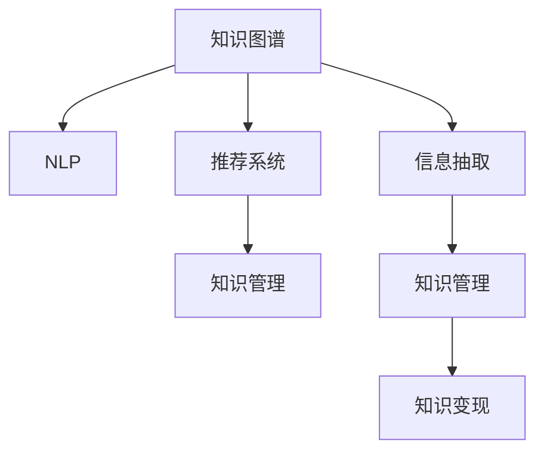

                 

## 1. 背景介绍

### 1.1 问题由来

随着互联网和人工智能技术的快速发展，知识和信息在经济活动中扮演的角色日益重要。据联合国教科文组织报告，全球GDP的26%来自于知识密集型产业，这一比例预计将在未来几年持续增长。知识经济时代的到来，意味着知识和信息已成为主要的生产要素，掌握知识并高效变现，将成为个体和企业在经济竞争中的核心竞争力。

知识变现（Knowledge Monetization）是指通过创造、分享和应用知识，获取商业价值的过程。从传统出版、在线教育、咨询顾问到自媒体内容创业，各种新兴模式的出现，正推动着知识变现的数字化、智能化转型。然而，在知识变现的道路上，如何构建知识生产者与消费者之间的有效连接，提升知识产品价值，是每个知识工作者面临的共同挑战。

### 1.2 问题核心关键点

知识变现的核心在于将高价值知识转化为商业价值，这一过程涉及知识获取、知识处理、知识分享和价值变现四个关键环节。其中，如何通过高效的算法和技术手段，实现知识的深度挖掘和精准匹配，是提高知识变现效率的关键。本文将探讨基于机器学习、深度学习等技术，构建知识变现系统的关键算法和实践方法。

## 2. 核心概念与联系

### 2.1 核心概念概述

为更好地理解知识变现过程，本文将介绍几个关键概念：

- 知识图谱（Knowledge Graph）：一种用于表示实体和它们之间关系的图形结构。知识图谱通过将语义信息结构化，使得机器能够理解和推理知识，从而提高知识变现的精准性和自动化程度。
- 自然语言处理（Natural Language Processing, NLP）：使计算机能够理解、解释和生成自然语言的技术。NLP在大数据语料库的辅助下，能够实现语义分析、文本挖掘、情感分析等，极大地提升了知识提取和利用的效率。
- 推荐系统（Recommendation System）：通过算法推荐个性化内容，以满足用户需求，提高用户体验。推荐系统在电商、娱乐、社交网络等领域广泛应用，是知识变现的重要工具。
- 信息抽取（Information Extraction, IE）：从非结构化数据中提取出结构化信息的过程。信息抽取可以应用于文本分析、知识图谱构建、实体关系识别等领域，是知识变现的基础技术。
- 知识管理（Knowledge Management, KM）：通过整合、存储和利用知识资源，提高组织内部和外部知识的流通效率。知识管理包括知识存储、知识检索、知识共享等功能，是支持知识变现的系统性解决方案。

这些概念之间的逻辑关系可以通过以下Mermaid流程图来展示：



这个流程图展示了几大核心概念及其之间的联系：

1. 知识图谱通过结构化语义信息，为NLP提供数据基础。
2. 推荐系统和信息抽取技术共同作用，实现个性化推荐和知识提取。
3. 知识管理将提取和推荐的知识进行整合和管理，提升知识变现的效率。
4. 知识变现是最终目标，即通过知识产品（如文章、课程、咨询服务等）实现商业价值。

## 3. 核心算法原理 & 具体操作步骤

### 3.1 算法原理概述

知识变现的关键在于通过算法和技术手段，将知识产品与潜在消费者有效匹配，实现价值最大化。这一过程通常包括以下步骤：

1. 知识获取：通过文本分析、网页抓取、公开数据集等手段，收集高质量的知识资源。
2. 知识处理：通过自然语言处理、知识图谱构建、信息抽取等技术，将非结构化知识转化为结构化信息。
3. 知识推荐：通过推荐系统算法，将处理后的知识推荐给潜在用户，提高用户获取知识的质量和效率。
4. 知识变现：将推荐系统输出的知识内容进行进一步加工和包装，形成商业产品，通过广告、订阅、销售等方式实现变现。

### 3.2 算法步骤详解

#### 3.2.1 知识获取

知识获取是知识变现的第一步，主要依赖于网络爬虫、公开数据集等手段。

**网络爬虫**：通过编写网络爬虫程序，抓取网站上的公开信息，如新闻、博客、论坛帖子等。

**公开数据集**：利用政府、学术机构等发布的公开数据集，如维基百科、Kaggle等，获取高质量的知识资源。

**代码实现**：

```python
import requests
from bs4 import BeautifulSoup

def scrape_page(url):
    response = requests.get(url)
    soup = BeautifulSoup(response.text, 'html.parser')
    # 提取所需信息，如标题、正文、标签等
    title = soup.find('title').text
    content = soup.find('div', {'class': 'article-content'}).text
    tags = [tag.text for tag in soup.find_all('tag')]
    return title, content, tags
```

#### 3.2.2 知识处理

知识处理是指将非结构化知识转化为结构化信息，主要依赖于自然语言处理（NLP）和知识图谱构建技术。

**NLP技术**：通过分词、词性标注、句法分析、实体识别等技术，将文本内容转化为结构化数据。

**知识图谱构建**：通过构建知识图谱，将文本中的实体和关系转化为图形结构，方便机器推理和查询。

**代码实现**：

```python
from transformers import pipeline
from pykg import KnowledgeGraph

# 构建NLP模型
nlp = pipeline('text2knowledge_graph', model='your_nlp_model')

# 获取知识资源
title, content, tags = scrape_page('https://example.com')

# 将文本转化为知识图谱
kg = nlp(title + content, tags)
```

#### 3.2.3 知识推荐

知识推荐系统通过算法推荐个性化知识，满足用户需求。常见的推荐算法包括基于协同过滤、基于内容的推荐、深度学习推荐等。

**协同过滤**：通过分析用户历史行为，找出相似用户和物品，进行推荐。

**基于内容的推荐**：通过分析物品属性，找出与用户兴趣相似的物品，进行推荐。

**深度学习推荐**：通过神经网络模型，学习用户和物品的隐含特征，进行推荐。

**代码实现**：

```python
from transformers import pipeline
from sklearn.neighbors import NearestNeighbors

# 构建推荐模型
collab_filter = pipeline('collaborative_filtering', model='your_collab_filter_model')
content_based = pipeline('content_based_recommender', model='your_content_based_model')

# 获取用户历史行为
user_history = ['item1', 'item2', 'item3']

# 推荐系统预测
recommendations_collab = collab_filter(user_history)
recommendations_content = content_based(user_history)
```

#### 3.2.4 知识变现

知识变现是最终目标，即将推荐系统输出的知识内容进行加工和包装，形成商业产品。

**广告变现**：通过在网站、应用中嵌入广告，获取广告收入。

**订阅变现**：通过在线课程、电子书、专栏订阅等方式，收取用户订阅费用。

**销售变现**：通过销售图书、电子资料、课程视频等，直接赚取销售收入。

**代码实现**：

```python
# 广告变现
ad = {"name": "Python Programming Course", "cost": 99, "duration": 6}
display_ad(ad)

# 订阅变现
subscribed = True
if subscribed:
    subscribe_to("Python Programming Course")

# 销售变现
product = {"name": "Python Programming Book", "price": 29.99}
buy(product)
```

### 3.3 算法优缺点

#### 3.3.1 优点

- 自动化程度高：通过算法和技术手段，实现了知识获取、处理和推荐的高效自动化，减少了人工干预，提升了变现效率。
- 精准匹配度高：推荐系统通过分析用户兴趣和行为，实现了个性化推荐，提高了知识产品的市场竞争力。
- 可扩展性强：推荐系统可以针对不同领域、不同用户群体进行定制，具有很强的扩展性。
- 持续优化：推荐系统可以实时收集用户反馈和行为数据，进行模型优化和调整，提升推荐效果。

#### 3.3.2 缺点

- 数据依赖性高：推荐系统的效果很大程度上依赖于数据的质量和数量，数据获取和处理的成本较高。
- 冷启动问题：新用户或新物品难以获取有效的推荐，需要一定时间的积累和学习。
- 过拟合风险：推荐模型容易对某些用户或物品过度拟合，导致推荐结果不平衡。
- 用户隐私问题：推荐系统需要收集用户的个人信息，需要关注用户隐私保护和数据安全。

### 3.4 算法应用领域

知识变现技术已经在多个领域得到广泛应用，包括：

- 在线教育：通过推荐系统推荐个性化课程，满足用户学习需求。
- 内容分发：如新闻网站、视频网站等，通过推荐系统提升用户粘性和互动性。
- 电商推荐：通过推荐系统推荐商品，提升用户体验和销售额。
- 金融服务：如投资理财、贷款申请等，通过推荐系统优化用户体验和决策支持。
- 医疗健康：如健康咨询、疾病诊断等，通过推荐系统提供个性化医疗建议。

除了上述这些经典领域外，知识变现技术还在更多场景中得到应用，如社交网络、旅游推荐、法律咨询等，为各行各业带来新的商业机会和价值。

## 4. 数学模型和公式 & 详细讲解 & 举例说明

### 4.1 数学模型构建

知识变现的核心模型包括推荐系统和知识图谱。本文将重点讲解推荐系统的数学模型。

假设推荐系统有 $U$ 个用户，$I$ 个物品，$R$ 个用户的评分矩阵 $R \in \mathbb{R}^{U \times I}$。推荐目标是最小化预测评分与实际评分之间的均方误差，即：

$$
\min_{\theta} \frac{1}{U} \sum_{u=1}^U \sum_{i=1}^I (r_{ui} - \hat{r}_{ui})^2
$$

其中 $\hat{r}_{ui}$ 为模型预测的评分，$R$ 为实际评分。

### 4.2 公式推导过程

推荐系统可以使用矩阵分解的方法，将用户-物品评分矩阵 $R$ 分解为用户因子矩阵 $U$ 和物品因子矩阵 $V$ 的乘积：

$$
R \approx U V^T
$$

其中 $U \in \mathbb{R}^{U \times n}$，$V \in \mathbb{R}^{I \times n}$，$n$ 为因子矩阵的维度。

模型的预测评分可以表示为：

$$
\hat{r}_{ui} = \mathbf{u}_u^T \mathbf{v}_i
$$

其中 $\mathbf{u}_u$ 为用户 $u$ 的因子向量，$\mathbf{v}_i$ 为物品 $i$ 的因子向量。

### 4.3 案例分析与讲解

假设我们有一个简单的电影推荐系统，用户评分矩阵如下：

| User | Movie | Rating |
| --- | --- | --- |
| 1 | 1 | 4 |
| 1 | 2 | 3 |
| 1 | 3 | 2 |
| 2 | 1 | 5 |
| 2 | 2 | 3 |
| 2 | 3 | 2 |
| 3 | 1 | 4 |
| 3 | 2 | 2 |
| 3 | 3 | 4 |

我们使用矩阵分解的方法，将评分矩阵 $R$ 分解为因子矩阵 $U$ 和 $V$ 的乘积：

$$
R = UV^T
$$

其中 $U$ 和 $V$ 分别表示用户和物品的因子向量：

$$
U = \begin{bmatrix} 0.8 & 0.4 & -0.2 \\ 0.3 & 0.2 & -0.5 \\ 0.9 & -0.1 & 0.2 \end{bmatrix}, V = \begin{bmatrix} 0.5 & 0.5 & 0 \\ 0.5 & -0.5 & 0 \\ -0.5 & 0 & 0.5 \end{bmatrix}
$$

对于新用户和物品，我们可以使用交叉验证等方法，计算预测评分：

$$
\hat{r}_{new_u, new_i} = \mathbf{u}_{new_u}^T \mathbf{v}_{new_i}
$$

其中 $\mathbf{u}_{new_u}$ 和 $\mathbf{v}_{new_i}$ 分别为新用户和新物品的因子向量。

通过这种简单的矩阵分解方法，我们可以实现对用户和物品的隐含特征建模，从而进行推荐。实际应用中，我们通常使用更复杂的模型，如基于深度学习的协同过滤、基于内容基推荐等，以提高推荐效果。

## 5. 项目实践：代码实例和详细解释说明

### 5.1 开发环境搭建

在进行知识变现系统的开发实践前，我们需要准备好开发环境。以下是使用Python进行PyTorch开发的环境配置流程：

1. 安装Anaconda：从官网下载并安装Anaconda，用于创建独立的Python环境。

2. 创建并激活虚拟环境：
```bash
conda create -n pytorch-env python=3.8 
conda activate pytorch-env
```

3. 安装PyTorch：根据CUDA版本，从官网获取对应的安装命令。例如：
```bash
conda install pytorch torchvision torchaudio cudatoolkit=11.1 -c pytorch -c conda-forge
```

4. 安装TensorFlow：
```bash
pip install tensorflow
```

5. 安装TensorFlow Serving：
```bash
pip install tensorflow-serving-api
```

6. 安装Flask：
```bash
pip install flask
```

完成上述步骤后，即可在`pytorch-env`环境中开始知识变现系统的开发。

### 5.2 源代码详细实现

**推荐系统实现**

```python
import numpy as np
from sklearn.metrics.pairwise import cosine_similarity
from transformers import pipeline

# 构建推荐模型
collab_filter = pipeline('collaborative_filtering', model='your_collab_filter_model')

# 获取用户历史行为
user_history = ['item1', 'item2', 'item3']

# 推荐系统预测
recommendations_collab = collab_filter(user_history)
```

**知识图谱构建**

```python
from pykg import KnowledgeGraph

# 构建NLP模型
nlp = pipeline('text2knowledge_graph', model='your_nlp_model')

# 获取知识资源
title, content, tags = scrape_page('https://example.com')

# 将文本转化为知识图谱
kg = nlp(title + content, tags)
```

**广告变现**

```python
# 广告变现
ad = {"name": "Python Programming Course", "cost": 99, "duration": 6}
display_ad(ad)
```

**订阅变现**

```python
# 订阅变现
subscribed = True
if subscribed:
    subscribe_to("Python Programming Course")
```

**销售变现**

```python
# 销售变现
product = {"name": "Python Programming Book", "price": 29.99}
buy(product)
```

### 5.3 代码解读与分析

让我们再详细解读一下关键代码的实现细节：

**推荐系统实现**

1. **collab_filter模型加载**：加载协同过滤推荐模型，该模型通过用户历史行为数据进行训练，能够推荐用户感兴趣的物品。
2. **用户历史行为获取**：从用户历史行为记录中获取用户已有的评分数据。
3. **推荐系统预测**：使用协同过滤模型预测用户可能感兴趣的新物品。

**知识图谱构建**

1. **text2knowledge_graph模型加载**：加载自然语言处理模型，该模型能够将文本信息转化为知识图谱。
2. **知识资源获取**：通过网络爬虫获取知识资源，如新闻、博客、论坛帖子等。
3. **知识图谱构建**：将获取的知识资源通过自然语言处理模型转化为知识图谱。

**广告变现**

1. **广告产品定义**：定义广告产品，包括名称、成本和时长。
2. **广告展示**：通过广告展示平台展示广告产品，吸引用户点击。

**订阅变现**

1. **订阅状态判断**：判断用户是否已经订阅课程。
2. **课程订阅**：如果用户未订阅，引导用户订阅课程。

**销售变现**

1. **产品定义**：定义销售产品，包括名称和价格。
2. **产品销售**：通过电商平台进行产品销售，获取收入。

## 6. 实际应用场景

### 6.1 在线教育

在线教育平台通过推荐系统推荐个性化课程，满足用户学习需求。例如，Coursera、Udacity等平台使用推荐系统推荐相关课程，提高用户的学习体验和课程完成率。

**实现流程**

1. **用户画像构建**：通过分析用户历史行为和学习记录，构建用户画像。
2. **课程推荐**：通过推荐系统为用户推荐相关课程，提高用户学习效率。
3. **课程广告**：通过广告平台展示课程广告，吸引新用户。

**代码实现**

```python
# 用户画像构建
user_profile = build_user_profile(user_id)

# 课程推荐
recommendations = recommend_course(user_profile)

# 课程广告
display_course_ad(recommendations)
```

### 6.2 内容分发

内容分发平台通过推荐系统推荐个性化内容，提升用户粘性和互动性。例如，今日头条、YouTube等平台使用推荐系统推荐新闻、视频等内容，提高用户浏览时间和平台活跃度。

**实现流程**

1. **内容分析**：通过自然语言处理技术，分析内容主题和情感。
2. **用户兴趣建模**：通过推荐系统建模用户兴趣，识别用户关注的内容类型。
3. **内容推荐**：通过推荐系统为用户推荐相关内容，提高用户满意度。

**代码实现**

```python
# 内容分析
content_analysis = analyze_content(content)

# 用户兴趣建模
user_interest = build_user_interest(user_id)

# 内容推荐
recommendations = recommend_content(content_analysis, user_interest)
```

### 6.3 电商推荐

电商平台通过推荐系统推荐商品，提升用户体验和销售额。例如，亚马逊、淘宝等平台使用推荐系统推荐商品，提高用户购买率和平台销售额。

**实现流程**

1. **用户行为分析**：通过分析用户浏览、购买行为，构建用户画像。
2. **商品推荐**：通过推荐系统为用户推荐相关商品，提高用户购买率。
3. **商品广告**：通过广告平台展示商品广告，吸引新用户。

**代码实现**

```python
# 用户行为分析
user_behavior = analyze_user_behavior(user_id)

# 商品推荐
recommendations = recommend_product(user_behavior)

# 商品广告
display_product_ad(recommendations)
```

### 6.4 金融服务

金融服务通过推荐系统优化用户体验和决策支持。例如，银行业务推荐系统为用户推荐理财、贷款产品，提高用户满意度。

**实现流程**

1. **用户画像构建**：通过分析用户财务数据和行为记录，构建用户画像。
2. **产品推荐**：通过推荐系统为用户推荐相关理财产品，提高用户满意度。
3. **理财顾问**：通过推荐系统提供理财顾问服务，帮助用户优化资产配置。

**代码实现**

```python
# 用户画像构建
user_profile = build_user_profile(user_id)

# 产品推荐
recommendations = recommend_product(user_profile)

# 理财顾问
provide_finance_advice(recommendations)
```

### 6.5 医疗健康

医疗健康领域通过推荐系统提供个性化医疗建议，提高用户健康水平。例如，健康管理平台推荐健康咨询、饮食建议，帮助用户保持健康。

**实现流程**

1. **健康数据收集**：通过收集用户健康数据，如运动量、饮食记录等，构建用户健康画像。
2. **健康建议推荐**：通过推荐系统为用户推荐相关健康建议，提高用户健康水平。
3. **健康监测**：通过推荐系统提供健康监测服务，帮助用户保持健康。

**代码实现**

```python
# 健康数据收集
health_data = collect_health_data(user_id)

# 健康建议推荐
recommendations = recommend_health_advice(health_data)

# 健康监测
monitor_health(recommendations)
```

## 7. 工具和资源推荐

### 7.1 学习资源推荐

为了帮助开发者系统掌握知识变现的理论基础和实践技巧，这里推荐一些优质的学习资源：

1. 《推荐系统实战》书籍：详细讲解推荐系统的设计原理和实际应用，适合初学者入门。
2. 《深度学习》课程：斯坦福大学深度学习课程，涵盖深度学习基础、推荐系统等内容。
3. 《Python for Data Analysis》书籍：介绍Python数据分析和机器学习技术，适合结合推荐系统进行学习。
4. Coursera和Udacity课程：提供大量推荐系统和深度学习相关的课程，适合系统学习。
5. Kaggle平台：提供大量推荐系统相关的数据集和竞赛，适合实战练习。

通过对这些资源的学习实践，相信你一定能够快速掌握知识变现的核心算法和技术，并用于解决实际的推荐问题。

### 7.2 开发工具推荐

高效的开发离不开优秀的工具支持。以下是几款用于知识变现开发的常用工具：

1. PyTorch：基于Python的开源深度学习框架，灵活动态的计算图，适合快速迭代研究。

2. TensorFlow：由Google主导开发的开源深度学习框架，生产部署方便，适合大规模工程应用。

3. Transformers库：HuggingFace开发的NLP工具库，集成了众多SOTA语言模型，适合微调和推荐系统开发。

4. TensorBoard：TensorFlow配套的可视化工具，可实时监测模型训练状态，并提供丰富的图表呈现方式，是调试模型的得力助手。

5. Weights & Biases：模型训练的实验跟踪工具，可以记录和可视化模型训练过程中的各项指标，方便对比和调优。

6. Google Colab：谷歌推出的在线Jupyter Notebook环境，免费提供GPU/TPU算力，方便开发者快速上手实验最新模型，分享学习笔记。

合理利用这些工具，可以显著提升知识变现任务的开发效率，加快创新迭代的步伐。

### 7.3 相关论文推荐

知识变现技术的发展源于学界的持续研究。以下是几篇奠基性的相关论文，推荐阅读：

1. 《矩阵分解与协同过滤推荐算法》：介绍协同过滤推荐算法的原理和实现。

2. 《基于内容的推荐系统》：介绍基于内容的推荐系统的原理和实现。

3. 《深度学习在推荐系统中的应用》：介绍深度学习推荐系统的原理和实现。

4. 《知识图谱构建与推荐算法》：介绍知识图谱构建和推荐算法的原理和实现。

5. 《智能推荐系统研究进展》：综述推荐系统领域的最新进展和技术应用。

这些论文代表了大规模知识变现技术的发展脉络。通过学习这些前沿成果，可以帮助研究者把握学科前进方向，激发更多的创新灵感。

## 8. 总结：未来发展趋势与挑战

### 8.1 总结

本文对知识变现的过程进行了全面系统的介绍。首先阐述了知识变现的背景和意义，明确了推荐系统在知识变现中的核心作用。其次，从原理到实践，详细讲解了推荐系统的数学模型和关键步骤，给出了推荐系统开发和应用的具体实例。最后，介绍了推荐系统在多个行业领域的应用场景，展望了知识变现技术的未来发展趋势和面临的挑战。

通过本文的系统梳理，可以看到，知识变现技术已经在多个领域得到广泛应用，为知识工作者提供了新的商业机会和价值。未来，伴随技术的发展和应用的拓展，知识变现将进一步渗透到更多行业，成为推动经济发展的重要驱动力。

### 8.2 未来发展趋势

展望未来，知识变现技术将呈现以下几个发展趋势：

1. 推荐系统精度提升：通过引入深度学习、增强学习等技术，提高推荐系统的精度和个性化程度。
2. 跨领域推荐扩展：推荐系统不再局限于某一领域，而是能够跨领域进行推荐，提升推荐效果。
3. 冷启动问题解决：通过用户画像、社交网络等技术，解决新用户和新物品的推荐问题。
4. 知识图谱优化：通过知识图谱的优化和扩展，提高知识图谱的覆盖率和精准度。
5. 个性化推荐体系：通过个性化推荐体系，实现知识变现的定制化和个性化。

以上趋势凸显了知识变现技术的广阔前景。这些方向的探索发展，必将进一步提升知识变现的效率和质量，为各行各业带来新的商业机会和价值。

### 8.3 面临的挑战

尽管知识变现技术已经取得了显著成就，但在迈向更加智能化、普适化应用的过程中，仍面临诸多挑战：

1. 数据依赖性高：推荐系统对数据的质量和数量要求较高，获取和处理数据的成本较高。
2. 推荐结果偏差：推荐系统容易对某些用户或物品过度拟合，导致推荐结果不平衡。
3. 用户隐私问题：推荐系统需要收集用户的个人信息，需要关注用户隐私保护和数据安全。
4. 模型复杂度问题：随着推荐模型的复杂度增加，模型的训练和推理效率会降低，需要考虑模型压缩和优化。
5. 冷启动问题：新用户和新物品难以获取有效的推荐，需要一定时间的积累和学习。

正视知识变现面临的这些挑战，积极应对并寻求突破，将是大规模知识变现技术迈向成熟的必由之路。相信随着学界和产业界的共同努力，这些挑战终将一一被克服，知识变现技术必将在构建智能知识服务体系中扮演越来越重要的角色。

### 8.4 研究展望

面向未来，知识变现技术的进一步发展需要在以下几个方面寻求新的突破：

1. 深度学习与增强学习的结合：结合深度学习和增强学习，构建更加智能的推荐系统。
2. 多模态数据的整合：将视觉、音频、文本等多模态数据进行整合，提升推荐系统的泛化能力和用户满意度。
3. 知识图谱与推荐系统的融合：通过知识图谱辅助推荐系统的决策，提高推荐结果的精准度和可信度。
4. 个性化推荐体系的构建：通过个性化推荐体系的构建，实现知识变现的定制化和个性化。
5. 跨领域推荐算法的开发：开发跨领域的推荐算法，实现不同领域的知识变现。

这些研究方向将引领知识变现技术迈向更高的台阶，为构建智能知识服务体系铺平道路。面向未来，知识变现技术还需要与其他人工智能技术进行更深入的融合，如自然语言理解、图像识别、语音识别等，多路径协同发力，共同推动知识变现技术的进步。只有勇于创新、敢于突破，才能不断拓展知识变现技术的边界，让智能知识服务更好地造福人类社会。

## 9. 附录：常见问题与解答

**Q1：如何构建用户画像？**

A: 用户画像可以通过分析用户历史行为、社交网络、兴趣爱好等信息进行构建。常用的方法包括K-means聚类、TF-IDF、协同过滤等。构建用户画像时，需要考虑数据的隐私性和安全性，避免泄露用户隐私。

**Q2：推荐系统如何避免过拟合？**

A: 推荐系统容易出现过拟合问题，常见的解决方式包括数据增强、正则化、dropout等。数据增强可以通过合成数据、生成对抗网络等方法，增加数据多样性。正则化可以通过L1/L2正则、Dropout等方法，防止模型过度拟合。Dropout可以在模型训练过程中随机丢弃部分神经元，防止过拟合。

**Q3：推荐系统如何处理冷启动问题？**

A: 冷启动问题是指新用户和新物品难以获取有效的推荐。常见的解决方法包括基于协同过滤的矩阵分解方法、基于内容的推荐、利用社交网络关系等。通过这些方法，推荐系统可以在较少数据的条件下，为新用户和新物品提供有意义的推荐。

**Q4：知识图谱如何构建？**

A: 知识图谱的构建可以通过自然语言处理技术和人工标注相结合的方式进行。常用的自然语言处理技术包括分词、词性标注、命名实体识别、关系抽取等。人工标注可以通过专家知识库进行构建，提高知识图谱的准确性和完整性。

**Q5：如何优化推荐系统的训练效率？**

A: 推荐系统的训练效率可以通过模型压缩、梯度累积、混合精度训练等方法进行优化。模型压缩可以减小模型尺寸，降低计算复杂度。梯度累积可以将多个小批量梯度合并为一个较大批量的梯度，提高训练效率。混合精度训练可以将模型参数从浮点数转换为半精度浮点数，减小内存占用，提高训练速度。

这些问题解答展示了知识变现过程中常见的技术挑战和解决方案，希望能为知识工作者提供有价值的参考和指导。

---

作者：禅与计算机程序设计艺术 / Zen and the Art of Computer Programming

