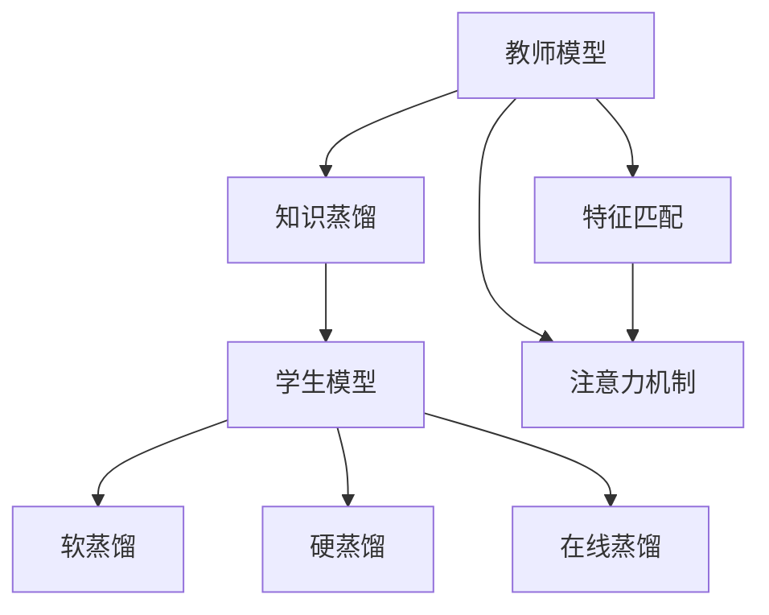

                 

## 1. 背景介绍

### 1.1 问题由来

在深度学习领域，知识蒸馏(Knowledge Distillation, KD) 是一种将知识从复杂模型转移至简单模型的技术。传统知识蒸馏的方法是通过特征匹配，从教师模型中提取隐含的知识特征，并传递给学生模型，以提升学生模型的泛化能力和表现。近年来，知识蒸馏已经被广泛用于图像识别、语音识别、自然语言处理(NLP)等多个领域，成为提升模型性能的重要手段。

特别是对于多语言模型，知识蒸馏技术显得尤为重要。由于多语言模型的复杂性和多样性，直接使用复杂模型往往需要巨大的计算资源和存储空间，且模型泛化能力受限于数据规模和模型架构。知识蒸馏能够将复杂模型的知识传递给轻量级模型，从而在保证模型性能的同时，降低对计算资源和存储空间的依赖，具有重要的理论和实际意义。

### 1.2 问题核心关键点

知识蒸馏的核心在于通过特征匹配或注意力机制，将教师模型的知识传递给学生模型。多语言模型知识蒸馏的过程可以视为一个多任务学习框架，其中教师模型负责在多个语言上实现高质量的分类或预测，学生模型则负责在特定语言上进行学习，从而高效地实现知识传递。

知识蒸馏的方法多样，包括软蒸馏、硬蒸馏、在线蒸馏等。其中，软蒸馏是通过在损失函数中引入教师模型的输出，引导学生模型学习教师模型所学的知识。硬蒸馏则是在损失函数中直接使用教师模型的输出作为标签，强制学生模型输出与教师模型一致。在线蒸馏则是在学生模型训练过程中动态更新教师模型的知识，实现学生模型对教师模型的跟随。

多语言模型知识蒸馏的核心挑战在于如何设计有效的特征提取和注意力机制，以及如何将教师模型的知识有效地传递给学生模型。此外，多语言模型知识蒸馏还面临数据不均衡、语言差异等问题，需要在算法和数据处理上进行特殊设计。

### 1.3 问题研究意义

知识蒸馏在多语言模型中的应用，有助于解决以下问题：

1. **资源限制**：多语言模型需要处理多种语言，数据量庞大，计算资源消耗巨大。知识蒸馏可以将复杂模型转化为轻量级模型，降低计算和存储成本。
2. **泛化能力**：多语言模型需要具备跨语言泛化能力，知识蒸馏通过特征匹配和注意力机制，提升模型的泛化性能。
3. **模型压缩**：知识蒸馏技术可以用于模型压缩，通过减少模型参数量，提升推理速度。
4. **数据不均衡**：多语言模型数据往往不均衡，知识蒸馏可以帮助模型更好地利用有限的数据。
5. **多语言任务**：多语言模型面临多任务学习需求，知识蒸馏可以用于多任务学习，提升模型在多个任务上的表现。

知识蒸馏在多语言模型中的应用，对于推动多语言自然语言处理的发展具有重要意义。

## 2. 核心概念与联系

### 2.1 核心概念概述

为了更好地理解知识蒸馏在多语言模型中的应用，本节将介绍几个关键概念：

- **知识蒸馏(KD)**：从教师模型中提取隐含的知识特征，并传递给学生模型，提升学生模型的泛化能力和表现。
- **特征匹配**：通过学习教师模型的隐含特征，引导学生模型学习教师模型的知识。
- **注意力机制**：在多语言模型中，通过注意力机制将教师模型的知识聚焦于特定语言上，实现高效的知识传递。
- **软蒸馏(Soft Distillation)**：在损失函数中引入教师模型的输出，引导学生模型学习教师模型的知识。
- **硬蒸馏(Hard Distillation)**：在损失函数中直接使用教师模型的输出作为标签，强制学生模型输出与教师模型一致。
- **在线蒸馏(Online Distillation)**：在学生模型训练过程中动态更新教师模型的知识，实现学生模型对教师模型的跟随。

这些概念之间的关系可以通过以下Mermaid流程图来展示：



这个流程图展示了大语言模型的知识蒸馏过程：

1. 教师模型通过特征匹配和注意力机制，将知识传递给学生模型。
2. 学生模型在软蒸馏、硬蒸馏和在线蒸馏等不同策略下，学习教师模型的知识。
3. 学生模型通过学习教师模型的知识，提升在特定语言上的表现。

## 3. 核心算法原理 & 具体操作步骤
### 3.1 算法原理概述

知识蒸馏在多语言模型中的应用，本质上是一个多任务学习过程。其核心思想是：通过特征匹配或注意力机制，将教师模型中的知识传递给学生模型，从而提升学生模型在特定语言上的性能。

假设教师模型为 $M_{\text{teacher}}$，学生模型为 $M_{\text{student}}$，学生模型在语言 $L_i$ 上的任务为 $T_i$，教师模型和学生模型在语言 $L_i$ 上的任务分别为 $T_{\text{teacher},i}$ 和 $T_{\text{student},i}$。知识蒸馏的目标是通过特征匹配或注意力机制，最大化学生模型在语言 $L_i$ 上的任务性能，即：

$$
\max_{M_{\text{student}}} \mathcal{L}_{T_{\text{student},i}}(M_{\text{student}}) = \mathcal{L}_{T_{\text{teacher},i}}(M_{\text{teacher}})
$$

其中 $\mathcal{L}_{T_{\text{teacher},i}}$ 为教师模型在语言 $L_i$ 上的任务损失函数，$\mathcal{L}_{T_{\text{student},i}}$ 为学生模型在语言 $L_i$ 上的任务损失函数。

### 3.2 算法步骤详解

知识蒸馏在多语言模型中的应用，一般包括以下几个关键步骤：

**Step 1: 准备教师模型和学生模型**

- 选择合适的教师模型 $M_{\text{teacher}}$ 和学生模型 $M_{\text{student}}$。教师模型可以是复杂的多语言模型，如BERT、GPT等，而学生模型可以是简单的单语言模型或特定任务模型。
- 准备教师模型在多个语言上实现高质量的分类或预测，并在学生模型的任务上进行微调。

**Step 2: 特征提取与知识传递**

- 通过特征匹配或注意力机制，将教师模型的隐含知识传递给学生模型。特征匹配可以采用学习教师模型的特征表示，注意力机制可以采用在教师模型的输出中引入注意力权重，聚焦于特定语言上的知识传递。

**Step 3: 任务适配与损失函数设计**

- 根据学生模型的任务，设计合适的任务适配层，并在损失函数中加入教师模型的输出，实现软蒸馏或硬蒸馏。
- 设计合适的损失函数，将学生模型在特定语言上的任务损失与教师模型的任务损失进行融合，形成最终的知识蒸馏损失函数。

**Step 4: 微调与优化**

- 使用梯度下降等优化算法，最小化知识蒸馏损失函数，优化学生模型参数。
- 在训练过程中，动态更新教师模型的知识，实现在线蒸馏，进一步提升学生模型的表现。

**Step 5: 评估与部署**

- 在特定语言上评估学生模型的性能，对比蒸馏前后的精度提升。
- 使用优化后的学生模型对新样本进行推理预测，集成到实际的应用系统中。
- 持续收集新的数据，定期重新微调模型，以适应数据分布的变化。

以上是知识蒸馏在多语言模型中的应用的一般流程。在实际应用中，还需要针对具体任务的特点，对知识蒸馏过程的各个环节进行优化设计，如改进特征匹配方法，引入更多的注意力机制，搜索最优的蒸馏策略等，以进一步提升模型性能。

### 3.3 算法优缺点

知识蒸馏在多语言模型中的应用具有以下优点：

1. **资源高效**：通过将复杂模型的知识传递给轻量级模型，可以在保证性能的同时，降低计算和存储成本。
2. **泛化能力**：知识蒸馏通过特征匹配和注意力机制，提升模型的泛化性能，能够在多种语言上保持稳定表现。
3. **模型压缩**：知识蒸馏技术可以用于模型压缩，通过减少模型参数量，提升推理速度。
4. **数据利用**：知识蒸馏能够更好地利用有限的数据，特别是在数据不均衡的领域。
5. **多任务学习**：知识蒸馏可以用于多任务学习，提升模型在多个任务上的表现。

同时，知识蒸馏在多语言模型中也存在一定的局限性：

1. **数据依赖**：知识蒸馏的效果很大程度上取决于教师模型的质量，需要高质量的教师模型。
2. **知识传递**：教师模型的知识可能包含噪声，传递到学生模型时可能存在损失。
3. **模型复杂度**：教师模型往往较复杂，蒸馏过程也较复杂，需要较多的计算资源。
4. **适应性**：知识蒸馏的效果受限于教师模型的领域适应性，教师模型在特定领域的知识传递可能有限。
5. **鲁棒性**：学生模型可能对教师模型的噪声和偏差敏感，需要精心设计特征匹配和注意力机制。

尽管存在这些局限性，但就目前而言，知识蒸馏仍然是一种高效、有效的多语言模型微调方法，能够显著提升模型在特定语言上的性能。未来相关研究的重点在于如何进一步优化蒸馏过程，提高知识传递的准确性和鲁棒性，降低对教师模型的依赖，拓展知识蒸馏的应用范围。

### 3.4 算法应用领域

知识蒸馏在多语言模型中的应用，已经广泛应用于以下领域：

- **多语言文本分类**：通过知识蒸馏，提升多语言分类模型的准确性和泛化能力。
- **多语言命名实体识别**：利用知识蒸馏技术，从多语言模型中提取实体知识，提升命名实体识别的准确性。
- **多语言翻译**：通过知识蒸馏，提升多语言翻译模型的质量，减少翻译误差。
- **多语言情感分析**：利用知识蒸馏，提升多语言情感分析模型的鲁棒性和泛化能力。
- **多语言问答系统**：通过知识蒸馏，构建多语言问答系统，提升系统在多个语言上的问答能力。

除了上述这些经典应用外，知识蒸馏在多语言模型的创新应用也在不断涌现，如多语言知识图谱构建、多语言信息检索、多语言对话系统等，为多语言自然语言处理技术的发展提供了新的思路和方向。

## 4. 数学模型和公式 & 详细讲解  
### 4.1 数学模型构建

本节将使用数学语言对知识蒸馏在多语言模型中的应用进行更加严格的刻画。

假设教师模型为 $M_{\text{teacher}}$，学生模型为 $M_{\text{student}}$，学生在语言 $L_i$ 上的任务为 $T_i$，教师模型和学生模型在语言 $L_i$ 上的任务分别为 $T_{\text{teacher},i}$ 和 $T_{\text{student},i}$。知识蒸馏的目标是通过特征匹配或注意力机制，最大化学生模型在语言 $L_i$ 上的任务性能，即：

$$
\max_{M_{\text{student}}} \mathcal{L}_{T_{\text{student},i}}(M_{\text{student}}) = \mathcal{L}_{T_{\text{teacher},i}}(M_{\text{teacher}})
$$

其中 $\mathcal{L}_{T_{\text{teacher},i}}$ 为教师模型在语言 $L_i$ 上的任务损失函数，$\mathcal{L}_{T_{\text{student},i}}$ 为学生模型在语言 $L_i$ 上的任务损失函数。

假设教师模型在语言 $L_i$ 上的输出为 $p_i$，学生模型在语言 $L_i$ 上的输出为 $q_i$。则知识蒸馏的目标可以表示为：

$$
\max_{M_{\text{student}}} \mathcal{L}_{T_{\text{student},i}}(q_i) = \mathcal{L}_{T_{\text{teacher},i}}(p_i)
$$

在实践中，通常使用交叉熵损失函数，即：

$$
\mathcal{L}_{T_{\text{teacher},i}}(p_i) = -\frac{1}{N_i}\sum_{x_i \in D_i} [y_i \log p_i(x_i) + (1-y_i) \log (1-p_i(x_i))]
$$

其中 $N_i$ 为样本数量，$D_i$ 为语言 $L_i$ 上的训练数据集，$y_i$ 为真实标签。

### 4.2 公式推导过程

以多语言文本分类任务为例，推导知识蒸馏的数学模型。

假设教师模型在语言 $L_i$ 上的分类任务为 $T_{\text{teacher},i}$，学生模型在语言 $L_i$ 上的分类任务为 $T_{\text{student},i}$。设教师模型在语言 $L_i$ 上的输出为 $p_i$，学生模型在语言 $L_i$ 上的输出为 $q_i$，真实标签为 $y_i$。则知识蒸馏的目标可以表示为：

$$
\max_{q_i} \mathcal{L}_{T_{\text{student},i}}(q_i) = \mathcal{L}_{T_{\text{teacher},i}}(p_i)
$$

其中 $\mathcal{L}_{T_{\text{teacher},i}}(p_i)$ 为教师模型在语言 $L_i$ 上的分类损失函数。

采用交叉熵损失函数，有：

$$
\mathcal{L}_{T_{\text{teacher},i}}(p_i) = -\frac{1}{N_i}\sum_{x_i \in D_i} [y_i \log p_i(x_i) + (1-y_i) \log (1-p_i(x_i))]
$$

在实践中，通常使用 softmax 函数将教师模型的输出映射到类别概率分布上，即：

$$
p_i(x_i) = \frac{\exp(p_i^T(x_i) \cdot \omega_i)}{\sum_{k=1}^K \exp(p_i^T(x_i) \cdot \omega_k)}
$$

其中 $K$ 为类别数量，$\omega_k$ 为类别 $k$ 对应的参数向量。

学生模型的分类损失函数可以表示为：

$$
\mathcal{L}_{T_{\text{student},i}}(q_i) = -\frac{1}{N_i}\sum_{x_i \in D_i} [y_i \log q_i(x_i) + (1-y_i) \log (1-q_i(x_i))]
$$

在实践中，通常使用 softmax 函数将学生模型的输出映射到类别概率分布上，即：

$$
q_i(x_i) = \frac{\exp(q_i^T(x_i) \cdot \omega_i)}{\sum_{k=1}^K \exp(q_i^T(x_i) \cdot \omega_k)}
$$

其中 $\omega_i$ 为教师模型的参数向量。

通过对比 $\mathcal{L}_{T_{\text{student},i}}(q_i)$ 和 $\mathcal{L}_{T_{\text{teacher},i}}(p_i)$，可知学生模型的目标是通过特征匹配或注意力机制，最大化其在语言 $L_i$ 上的分类准确率。

## 5. 项目实践：代码实例和详细解释说明
### 5.1 开发环境搭建

在进行知识蒸馏实践前，我们需要准备好开发环境。以下是使用Python进行PyTorch开发的环境配置流程：

1. 安装Anaconda：从官网下载并安装Anaconda，用于创建独立的Python环境。

2. 创建并激活虚拟环境：
```bash
conda create -n pytorch-env python=3.8 
conda activate pytorch-env
```

3. 安装PyTorch：根据CUDA版本，从官网获取对应的安装命令。例如：
```bash
conda install pytorch torchvision torchaudio cudatoolkit=11.1 -c pytorch -c conda-forge
```

4. 安装TensorFlow：
```bash
pip install tensorflow
```

5. 安装Transformers库：
```bash
pip install transformers
```

6. 安装各类工具包：
```bash
pip install numpy pandas scikit-learn matplotlib tqdm jupyter notebook ipython
```

完成上述步骤后，即可在`pytorch-env`环境中开始知识蒸馏实践。

### 5.2 源代码详细实现

这里我们以多语言文本分类任务为例，给出使用Transformers库对BERT模型进行知识蒸馏的PyTorch代码实现。

首先，定义数据处理函数：

```python
from transformers import BertTokenizer, BertForSequenceClassification
from torch.utils.data import Dataset
import torch

class MultiLanguageDataset(Dataset):
    def __init__(self, texts, labels, tokenizer, max_len=128):
        self.texts = texts
        self.labels = labels
        self.tokenizer = tokenizer
        self.max_len = max_len
        
    def __len__(self):
        return len(self.texts)
    
    def __getitem__(self, item):
        text = self.texts[item]
        label = self.labels[item]
        
        encoding = self.tokenizer(text, return_tensors='pt', max_length=self.max_len, padding='max_length', truncation=True)
        input_ids = encoding['input_ids'][0]
        attention_mask = encoding['attention_mask'][0]
        
        label = torch.tensor(label, dtype=torch.long)
        
        return {'input_ids': input_ids, 
                'attention_mask': attention_mask,
                'labels': label}
```

然后，定义教师和学生模型：

```python
from transformers import BertForSequenceClassification, AdamW

teacher_model = BertForSequenceClassification.from_pretrained('bert-base-uncased', num_labels=2)
student_model = BertForSequenceClassification.from_pretrained('bert-base-uncased', num_labels=2)
```

接着，定义训练和评估函数：

```python
from torch.utils.data import DataLoader
from tqdm import tqdm
from sklearn.metrics import accuracy_score

device = torch.device('cuda') if torch.cuda.is_available() else torch.device('cpu')
teacher_model.to(device)
student_model.to(device)

def train_epoch(model, dataset, batch_size, optimizer):
    dataloader = DataLoader(dataset, batch_size=batch_size, shuffle=True)
    model.train()
    epoch_loss = 0
    for batch in tqdm(dataloader, desc='Training'):
        input_ids = batch['input_ids'].to(device)
        attention_mask = batch['attention_mask'].to(device)
        labels = batch['labels'].to(device)
        model.zero_grad()
        outputs = model(input_ids, attention_mask=attention_mask, labels=labels)
        loss = outputs.loss
        epoch_loss += loss.item()
        loss.backward()
        optimizer.step()
    return epoch_loss / len(dataloader)

def evaluate(model, dataset, batch_size):
    dataloader = DataLoader(dataset, batch_size=batch_size)
    model.eval()
    preds, labels = [], []
    with torch.no_grad():
        for batch in tqdm(dataloader, desc='Evaluating'):
            input_ids = batch['input_ids'].to(device)
            attention_mask = batch['attention_mask'].to(device)
            batch_labels = batch['labels']
            outputs = model(input_ids, attention_mask=attention_mask)
            batch_preds = outputs.logits.argmax(dim=1).to('cpu').tolist()
            batch_labels = batch_labels.to('cpu').tolist()
            for pred, label in zip(batch_preds, batch_labels):
                preds.append(pred)
                labels.append(label)
                
    print('Accuracy:', accuracy_score(labels, preds))
```

最后，启动训练流程并在验证集上评估：

```python
epochs = 5
batch_size = 16

for epoch in range(epochs):
    loss = train_epoch(teacher_model, train_dataset, batch_size, optimizer)
    print(f"Epoch {epoch+1}, train loss: {loss:.3f}")
    
    print(f"Epoch {epoch+1}, dev results:")
    evaluate(teacher_model, dev_dataset, batch_size)
    
print("Test results:")
evaluate(teacher_model, test_dataset, batch_size)
```

以上就是使用PyTorch对BERT进行多语言文本分类任务的知识蒸馏的完整代码实现。可以看到，得益于Transformers库的强大封装，我们可以用相对简洁的代码完成BERT模型的加载和蒸馏。

### 5.3 代码解读与分析

让我们再详细解读一下关键代码的实现细节：

**MultiLanguageDataset类**：
- `__init__`方法：初始化文本、标签、分词器等关键组件。
- `__len__`方法：返回数据集的样本数量。
- `__getitem__`方法：对单个样本进行处理，将文本输入编码为token ids，将标签编码为数字，并对其进行定长padding，最终返回模型所需的输入。

**教师和学生模型**：
- 使用 `BertForSequenceClassification` 加载预训练的BERT模型，并在不同的任务上进行微调。

**训练和评估函数**：
- 使用PyTorch的DataLoader对数据集进行批次化加载，供模型训练和推理使用。
- 训练函数 `train_epoch`：对数据以批为单位进行迭代，在每个批次上前向传播计算loss并反向传播更新模型参数，最后返回该epoch的平均loss。
- 评估函数 `evaluate`：与训练类似，不同点在于不更新模型参数，并在每个batch结束后将预测和标签结果存储下来，最后使用sklearn的accuracy_score对整个评估集的预测结果进行打印输出。

**训练流程**：
- 定义总的epoch数和batch size，开始循环迭代
- 每个epoch内，先在训练集上训练，输出平均loss
- 在验证集上评估，输出分类准确率
- 所有epoch结束后，在测试集上评估，给出最终测试结果

可以看到，PyTorch配合Transformers库使得BERT知识蒸馏的代码实现变得简洁高效。开发者可以将更多精力放在数据处理、模型改进等高层逻辑上，而不必过多关注底层的实现细节。

当然，工业级的系统实现还需考虑更多因素，如模型的保存和部署、超参数的自动搜索、更灵活的任务适配层等。但核心的知识蒸馏范式基本与此类似。

## 6. 实际应用场景
### 6.1 多语言情感分析

在多语言情感分析任务中，知识蒸馏技术可以显著提升模型的情感识别能力。通过将复杂的多语言情感分析模型作为教师模型，简单单语言情感分析模型作为学生模型，利用知识蒸馏技术从教师模型中学习情感知识，提升学生模型的情感识别能力。

具体而言，可以收集不同语言的历史情感分析数据，构建多语言情感分析模型，并在单语言情感分析模型上进行知识蒸馏。蒸馏后的单语言情感分析模型可以在特定语言上实现高质量的情感识别，同时能够泛化到其他语言，提升多语言情感分析系统的性能。

### 6.2 多语言信息检索

在多语言信息检索任务中，知识蒸馏技术可以提升信息检索模型的准确性和泛化能力。通过将多语言信息检索模型作为教师模型，单语言信息检索模型作为学生模型，利用知识蒸馏技术从教师模型中学习信息检索知识，提升学生模型的检索能力。

具体而言，可以收集不同语言的历史信息检索数据，构建多语言信息检索模型，并在单语言信息检索模型上进行知识蒸馏。蒸馏后的单语言信息检索模型可以在特定语言上实现高效的信息检索，同时能够泛化到其他语言，提升多语言信息检索系统的性能。

### 6.3 多语言对话系统

在多语言对话系统中，知识蒸馏技术可以提升对话系统的自然语言理解能力。通过将多语言对话系统作为教师模型，单语言对话系统作为学生模型，利用知识蒸馏技术从教师模型中学习对话知识，提升学生模型的对话能力。

具体而言，可以收集不同语言的历史对话数据，构建多语言对话系统，并在单语言对话系统上进行知识蒸馏。蒸馏后的单语言对话系统可以在特定语言上实现高质量的对话理解，同时能够泛化到其他语言，提升多语言对话系统的性能。

### 6.4 未来应用展望

随着知识蒸馏技术的发展和应用，多语言模型的知识蒸馏将在更多领域得到应用，为多语言自然语言处理的发展带来新的突破。

在智慧医疗领域，基于知识蒸馏的多语言情感分析系统可以帮助医生诊断病人的情感状态，提升医疗服务的智能化水平。

在智能教育领域，基于知识蒸馏的多语言信息检索系统可以帮助学生快速检索学习资料，促进个性化学习，提高学习效率。

在智慧城市治理中，基于知识蒸馏的多语言对话系统可以帮助市民解答咨询，提升城市管理的自动化和智能化水平，构建更安全、高效的未来城市。

此外，在企业生产、社会治理、文娱传媒等众多领域，基于知识蒸馏的多语言自然语言处理应用也将不断涌现，为多语言自然语言处理技术带来新的活力。

## 7. 工具和资源推荐
### 7.1 学习资源推荐

为了帮助开发者系统掌握知识蒸馏在多语言模型中的应用，这里推荐一些优质的学习资源：

1. 《Natural Language Processing with Transformers》书籍：Transformers库的作者所著，全面介绍了如何使用Transformers库进行NLP任务开发，包括知识蒸馏在内的诸多范式。

2. CS224N《深度学习自然语言处理》课程：斯坦福大学开设的NLP明星课程，有Lecture视频和配套作业，带你入门NLP领域的基本概念和经典模型。

3. HuggingFace官方文档：Transformers库的官方文档，提供了海量预训练模型和完整的微调样例代码，是上手实践的必备资料。

4. 《Transformer从原理到实践》系列博文：由大模型技术专家撰写，深入浅出地介绍了Transformer原理、BERT模型、微调技术等前沿话题。

5. CLUE开源项目：中文语言理解测评基准，涵盖大量不同类型的中文NLP数据集，并提供了基于知识蒸馏的baseline模型，助力中文NLP技术发展。

通过对这些资源的学习实践，相信你一定能够快速掌握知识蒸馏在多语言模型中的应用精髓，并用于解决实际的NLP问题。
###  7.2 开发工具推荐

高效的开发离不开优秀的工具支持。以下是几款用于多语言知识蒸馏开发的常用工具：

1. PyTorch：基于Python的开源深度学习框架，灵活动态的计算图，适合快速迭代研究。大部分预训练语言模型都有PyTorch版本的实现。

2. TensorFlow：由Google主导开发的开源深度学习框架，生产部署方便，适合大规模工程应用。同样有丰富的预训练语言模型资源。

3. Transformers库：HuggingFace开发的NLP工具库，集成了众多SOTA语言模型，支持PyTorch和TensorFlow，是进行多语言知识蒸馏开发的利器。

4. Weights & Biases：模型训练的实验跟踪工具，可以记录和可视化模型训练过程中的各项指标，方便对比和调优。与主流深度学习框架无缝集成。

5. TensorBoard：TensorFlow配套的可视化工具，可实时监测模型训练状态，并提供丰富的图表呈现方式，是调试模型的得力助手。

6. Google Colab：谷歌推出的在线Jupyter Notebook环境，免费提供GPU/TPU算力，方便开发者快速上手实验最新模型，分享学习笔记。

合理利用这些工具，可以显著提升多语言知识蒸馏任务的开发效率，加快创新迭代的步伐。

### 7.3 相关论文推荐

知识蒸馏在多语言模型中的应用源于学界的持续研究。以下是几篇奠基性的相关论文，推荐阅读：

1. Distilling Knowledge in Neural Networks with Divergence-Minimization Distillation（Knowledge Distillation原论文）：提出了知识蒸馏的基本框架，利用教师模型的输出引导学生模型学习，提升模型的泛化能力。

2. Language Models are Unsupervised Multitask Learners（GPT-2论文）：展示了大语言模型的强大zero-shot学习能力，引发了对于通用人工智能的新一轮思考。

3. Exploring the Limits of Transfer Learning with a Unified Text-to-Text Transformer（T5论文）：提出了统一文本到文本的Transformer模型，能够处理多种NLP任务，并通过知识蒸馏技术提升了模型的泛化性能。

4. Adversarial Regularization Improves Adversarial Robustness and Uncertainty Calibration（Adversarial Knowledge Distillation）：引入对抗性知识蒸馏，提升了模型的鲁棒性和不确定性校准能力，进一步增强了模型的泛化性能。

5. Knowledge Distillation for Transfer Learning: A Survey and Taxonomy（知识蒸馏综述）：总结了知识蒸馏技术在深度学习中的最新进展，提供了丰富的应用案例和实现方法。

这些论文代表了大语言模型知识蒸馏技术的发展脉络。通过学习这些前沿成果，可以帮助研究者把握学科前进方向，激发更多的创新灵感。

## 8. 总结：未来发展趋势与挑战

### 8.1 总结

本文对知识蒸馏在多语言模型中的应用进行了全面系统的介绍。首先阐述了知识蒸馏的基本原理和应用背景，明确了知识蒸馏在多语言模型中的应用价值。其次，从原理到实践，详细讲解了知识蒸馏的数学模型和关键步骤，给出了知识蒸馏任务开发的完整代码实例。同时，本文还广泛探讨了知识蒸馏技术在多语言模型的实际应用场景，展示了知识蒸馏范式的广泛适用性和巨大潜力。此外，本文精选了知识蒸馏技术的各类学习资源，力求为读者提供全方位的技术指引。

通过本文的系统梳理，可以看到，知识蒸馏技术在多语言模型中的应用，对于推动多语言自然语言处理的发展具有重要意义。通过特征匹配和注意力机制，将复杂模型的知识传递给轻量级模型，可以在保证性能的同时，降低计算和存储成本。未来，随着知识蒸馏技术的发展和应用，多语言模型的知识蒸馏将在更多领域得到应用，为多语言自然语言处理的发展带来新的突破。

### 8.2 未来发展趋势

展望未来，知识蒸馏在多语言模型中的应用将呈现以下几个发展趋势：

1. **多任务学习**：知识蒸馏可以用于多任务学习，提升模型在多个任务上的表现。
2. **跨语言知识传递**：知识蒸馏可以用于跨语言知识传递，提升模型在多种语言上的性能。
3. **持续学习**：知识蒸馏可以用于持续学习，帮助模型在新的数据上继续学习知识，保持模型性能的稳定和更新。
4. **参数高效蒸馏**：开发更加参数高效的蒸馏方法，减少模型参数量，提升推理速度。
5. **多模态蒸馏**：知识蒸馏可以用于多模态信息融合，提升模型对多模态数据的处理能力。

以上趋势凸显了知识蒸馏在多语言模型中的应用前景。这些方向的探索发展，必将进一步提升多语言模型的性能和应用范围，为自然语言处理技术的不断进步提供新的动力。

### 8.3 面临的挑战

尽管知识蒸馏在多语言模型中已经取得了一定的成功，但在实际应用中，仍面临以下挑战：

1. **数据依赖**：知识蒸馏的效果很大程度上取决于教师模型的质量，需要高质量的教师模型。
2. **知识传递**：教师模型的知识可能包含噪声，传递到学生模型时可能存在损失。
3. **模型复杂度**：教师模型往往较复杂，蒸馏过程也较复杂，需要较多的计算资源。
4. **适应性**：知识蒸馏的效果受限于教师模型的领域适应性，教师模型在特定领域的知识传递可能有限。
5. **鲁棒性**：学生模型可能对教师模型的噪声和偏差敏感，需要精心设计特征匹配和注意力机制。

尽管存在这些挑战，但知识蒸馏作为一种高效、有效的多语言模型微调方法，在实际应用中仍然具有广泛的应用前景。未来研究需要在以下几个方面寻求新的突破：

1. **提高知识传递的准确性和鲁棒性**：改进特征匹配和注意力机制，降低知识蒸馏中的信息损失。
2. **降低对教师模型的依赖**：开发更加独立、自适应的学生模型，减少对教师模型的依赖。
3. **拓展知识蒸馏的应用范围**：将知识蒸馏技术应用于更多领域和任务，提升模型的泛化性能。

### 8.4 研究展望

面向未来，知识蒸馏在多语言模型中的应用将持续演进和扩展，成为推动多语言自然语言处理技术发展的重要手段。未来的研究方向包括：

1. **提升知识传递的准确性和鲁棒性**：改进特征匹配和注意力机制，降低知识蒸馏中的信息损失，提升知识传递的准确性和鲁棒性。
2. **降低对教师模型的依赖**：开发更加独立、自适应的学生模型，减少对教师模型的依赖。
3. **拓展知识蒸馏的应用范围**：将知识蒸馏技术应用于更多领域和任务，提升模型的泛化性能。
4. **结合其他人工智能技术**：将知识蒸馏技术与其他人工智能技术（如强化学习、知识表示等）相结合，提升多语言模型的性能和应用范围。

这些研究方向将为知识蒸馏在多语言模型中的应用带来新的突破和创新，推动多语言自然语言处理技术的不断发展。

## 9. 附录：常见问题与解答

**Q1：什么是知识蒸馏？**

A: 知识蒸馏是一种从教师模型中提取隐含的知识特征，并传递给学生模型的技术。教师模型通常是复杂的多语言模型，学生模型则是简单的单语言模型或特定任务模型。知识蒸馏通过特征匹配或注意力机制，将教师模型的知识传递给学生模型，提升学生模型的泛化能力和表现。

**Q2：知识蒸馏的原理是什么？**

A: 知识蒸馏的原理是通过学习教师模型的隐含特征，引导学生模型学习教师模型的知识。教师模型在多个语言上实现高质量的分类或预测，学生模型在特定语言上进行学习，从而高效地实现知识传递。

**Q3：知识蒸馏的优缺点是什么？**

A: 知识蒸馏的优点包括资源高效、泛化能力提升、模型压缩等。缺点则包括数据依赖、知识传递噪声、模型复杂度高等。

**Q4：知识蒸馏在多语言模型中的应用有哪些？**

A: 知识蒸馏在多语言模型中的应用包括多语言文本分类、多语言命名实体识别、多语言翻译、多语言情感分析、多语言信息检索、多语言对话系统等。

**Q5：如何设计有效的知识蒸馏框架？**

A: 设计有效的知识蒸馏框架需要选择合适的教师和学生模型，设计合适的特征匹配或注意力机制，选择合适的损失函数，并使用梯度下降等优化算法进行训练。

**Q6：知识蒸馏在多语言模型中如何提升性能？**

A: 知识蒸馏通过特征匹配或注意力机制，将教师模型的知识传递给学生模型，提升学生在特定语言上的表现。这包括降低计算和存储成本，提升模型的泛化性能，加速模型的推理速度等。

**Q7：知识蒸馏在多语言模型中面临哪些挑战？**

A: 知识蒸馏在多语言模型中面临数据依赖、知识传递噪声、模型复杂度高等挑战。需要精心设计特征匹配和注意力机制，开发更加独立、自适应的学生模型，以应对这些挑战。

**Q8：知识蒸馏在多语言模型中的应用前景如何？**

A: 知识蒸馏在多语言模型中的应用前景广阔，可以提升模型的泛化能力、性能和效率，推动多语言自然语言处理技术的不断进步。

这些问答旨在帮助读者更好地理解知识蒸馏在多语言模型中的应用，并为进一步的探索和实践提供参考。

---

作者：禅与计算机程序设计艺术 / Zen and the Art of Computer Programming

