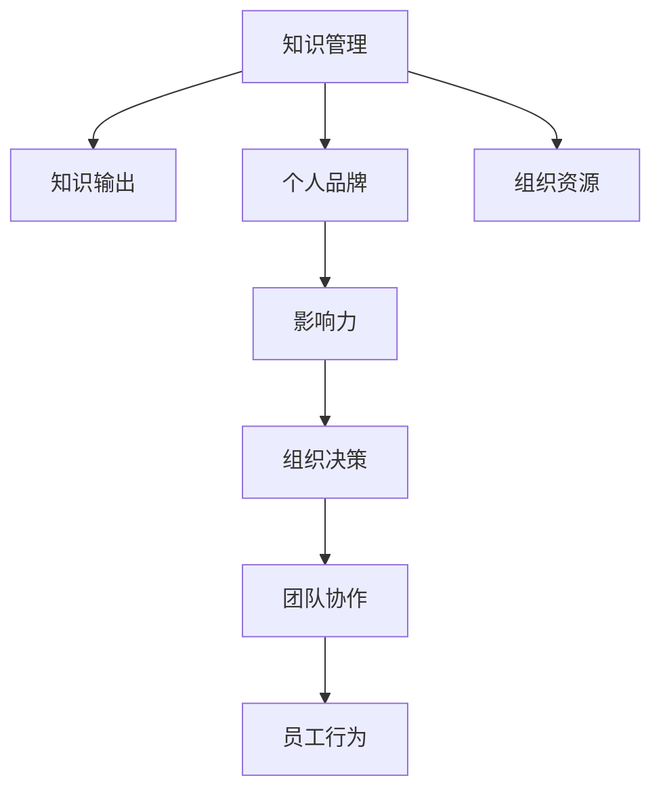

                 

# 知识输出与管理者个人影响力的提升

> 关键词：知识管理,影响力提升,组织决策,团队协作,个人品牌,领导力

## 1. 背景介绍

在现代社会中，知识输出和个人影响力的提升成为了管理者获取成功和保持竞争力的关键。在高度信息化的环境下，管理者需要不仅要有扎实的专业知识和丰富的管理经验，还需要具备良好的知识输出能力和强大的个人影响力，以便更好地指导团队、推动组织决策和提升组织的整体绩效。

### 1.1 问题的由来
随着科技的迅猛发展和全球化的深入，市场竞争日益激烈，企业对管理者的期望也随之提高。管理者不仅需要具备解决复杂问题的能力，还必须能够有效地输出和传播知识，以提升团队和组织的整体绩效。同时，管理者作为组织的决策者和领导者，其个人影响力在企业内部和外部的决策过程中起着至关重要的作用。

### 1.2 问题的核心关键点
管理者提升个人影响力和知识输出能力的核心关键点在于：
- 构建和维护个人品牌，增强自己在组织内外部的知名度和认可度。
- 掌握系统化的知识输出方法，使知识传播更具有条理性和说服力。
- 建立强有力的沟通和协作网络，促进团队协作和知识共享。
- 有效利用组织资源和平台，促进知识的积累和传播。

### 1.3 问题的研究意义
提升个人影响力和知识输出能力，对于管理者个人职业发展和组织绩效提升具有重要意义：
1. 提升个人影响力有助于管理者更好地引导团队和推动组织战略实施。
2. 有效知识输出可以增强团队协作和组织创新能力，提升整体竞争力。
3. 管理者影响力在企业内外的决策过程中起着关键作用，提升其影响力有利于企业在竞争中取得优势。

## 2. 核心概念与联系

### 2.1 核心概念概述

为了更好地理解如何通过知识输出提升个人影响力，首先需要明确几个核心概念：

- **知识管理(Knowledge Management, KM)**：通过有效利用和共享组织中的知识和信息，来提升组织和个体的绩效。
- **知识输出(Knowledge Dissemination)**：将知识转化为易于传播和理解的形式，通过多种渠道和方式传递给目标受众。
- **个人品牌(Personal Brand)**：管理者通过系统化地展示其专业知识和领导能力，建立独特而积极的品牌形象，增强在组织内外部的认可度。
- **影响力(Influence)**：管理者利用其专业知识和领导能力，对组织决策、团队协作和员工行为产生重要影响的能力。

这些核心概念通过合成的方式，构成了一个相互依赖的管理者知识输出和影响力提升的框架。

### 2.2 核心概念原理和架构的 Mermaid 流程图



这个流程图展示了知识管理的各个环节如何相互关联，最终影响组织的决策、团队协作和员工的个人行为。

## 3. 核心算法原理 & 具体操作步骤

### 3.1 算法原理概述

管理者知识输出和影响力提升的过程，可以视为一种系统化的学习、分析和传播过程。这一过程通过以下几个步骤实现：

1. **知识获取**：通过阅读、培训、学习和实践等方式获取新的知识和信息。
2. **知识分析**：对获取的知识进行分类、整合和提炼，形成易于理解和传播的结构化内容。
3. **知识传播**：通过演讲、报告、博客、视频等形式将知识传递给目标受众。
4. **反馈优化**：根据受众的反馈，不断调整和优化知识传播的方式和内容。

这一过程是持续迭代和优化的，通过不断的学习和改进，管理者能够不断提升个人影响力。

### 3.2 算法步骤详解

#### 3.2.1 知识获取

管理者获取知识的方法和渠道多种多样，包括：

- **阅读和学习**：通过书籍、研究论文、行业报告等获取新的知识。
- **培训和研讨会**：参加各类培训和研讨会，与行业专家和同行交流学习。
- **实践和经验总结**：通过实际工作中的学习和经验积累，不断更新和丰富自己的知识库。
- **网络资源**：利用互联网和各类在线资源，获取最新的行业动态和专业资讯。

#### 3.2.2 知识分析

在获取知识后，管理者需要进行分析、整理和提炼，使其更具条理性和结构化：

- **分类整合**：将获取的知识按照不同的主题或领域进行分类，形成系统化的知识体系。
- **提炼总结**：通过提炼和总结，将复杂的知识转化为易于理解的关键要点和实用技巧。
- **可视化呈现**：利用图表、思维导图等方式，将知识可视化，便于理解和传播。

#### 3.2.3 知识传播

知识传播是知识输出的关键步骤，具体方法包括：

- **演讲和报告**：通过在公司内部或行业研讨会上的演讲和报告，分享最新的知识和见解。
- **博客和文章**：撰写专业博客和文章，发表在各类平台，如Medium、LinkedIn、CSDN等。
- **培训和课程**：开设内部培训和课程，传授知识和技能。
- **社交媒体**：通过LinkedIn、Twitter等社交媒体平台，分享和讨论专业内容。
- **团队协作工具**：在团队协作工具如Slack、Confluence中分享知识，促进知识共享。

#### 3.2.4 反馈优化

知识输出是一个动态的过程，管理者需要根据反馈不断调整和优化传播方式：

- **收集反馈**：通过问卷、反馈表、讨论会等方式，收集受众的反馈意见。
- **分析反馈**：对反馈意见进行分析，识别出知识传播中存在的问题和不足。
- **调整优化**：根据分析结果，调整传播策略和方式，提高知识传播的效果。

### 3.3 算法优缺点

管理者知识输出和影响力提升的算法具有以下优点：

- **系统化管理**：通过系统化的知识获取、分析、传播和优化，提升知识输出的效率和效果。
- **结构化输出**：将知识转化为易于理解和传播的结构化内容，提高传播的效果。
- **持续改进**：通过不断的反馈和优化，不断提升知识输出的质量和影响力。

同时，这一过程也存在一些局限性：

- **时间和精力成本**：知识获取、分析和传播需要大量的时间和精力，可能对日常工作产生影响。
- **依赖受众反馈**：知识传播的效果依赖受众的反馈，管理者需要不断调整和优化传播策略。
- **专业性和深度要求**：知识传播需要管理者具备较高的专业水平和深度理解，否则可能无法满足受众的需求。

### 3.4 算法应用领域

知识输出和影响力提升的算法广泛应用于多个领域，包括但不限于：

- **企业管理**：提升企业内部管理者的知识和影响力，推动企业战略和决策的实施。
- **人力资源管理**：通过系统化的知识管理，提升员工的整体绩效和组织竞争力。
- **市场营销**：增强市场营销团队的知识传播能力，提升品牌影响力和市场竞争力。
- **技术研发**：提升技术团队的知识传播能力，促进技术和产品的创新和迭代。
- **客户关系管理**：通过知识传播，增强与客户的互动和关系，提升客户满意度和忠诚度。

## 4. 数学模型和公式 & 详细讲解 & 举例说明

### 4.1 数学模型构建

知识输出和影响力提升的过程可以建立如下数学模型：

$$
\text{Influence}_{total} = f(\text{Knowledge}_{acquired}, \text{Knowledge}_{processed}, \text{Knowledge}_{disseminated}, \text{Feedback}_{optimized})
$$

其中，$\text{Influence}_{total}$表示总体影响力，$\text{Knowledge}_{acquired}$表示获取的知识量，$\text{Knowledge}_{processed}$表示处理和提炼的知识量，$\text{Knowledge}_{disseminated}$表示传播的知识量，$\text{Feedback}_{optimized}$表示根据反馈进行的优化调整。

### 4.2 公式推导过程

知识输出和影响力提升的过程可以分解为以下几个子模型：

1. **知识获取模型**：

$$
\text{Knowledge}_{acquired} = \sum_{i=1}^n g_i
$$

其中，$g_i$表示从第$i$个知识源获取的知识量。

2. **知识分析模型**：

$$
\text{Knowledge}_{processed} = \text{Knowledge}_{acquired} \times p
$$

其中，$p$表示知识处理和提炼的效率。

3. **知识传播模型**：

$$
\text{Knowledge}_{disseminated} = \text{Knowledge}_{processed} \times d
$$

其中，$d$表示知识传播的效率。

4. **反馈优化模型**：

$$
\text{Feedback}_{optimized} = \text{Feedback}_{collected} \times o
$$

其中，$\text{Feedback}_{collected}$表示收集到的反馈量，$o$表示反馈优化的效率。

综合以上模型，总体影响力的计算公式为：

$$
\text{Influence}_{total} = f(\text{Knowledge}_{acquired}, \text{Knowledge}_{processed}, \text{Knowledge}_{disseminated}, \text{Feedback}_{optimized})
$$

其中，$f$为非线性函数，表示知识输出和影响力提升的综合效应。

### 4.3 案例分析与讲解

以某知名企业高层管理者为例，分析其如何通过知识输出提升个人影响力：

- **知识获取**：该管理者每年订阅各类行业杂志、参加国内外顶级管理研讨会、阅读最新研究论文，不断获取新的管理知识和经验。
- **知识分析**：将获取的知识进行分类和提炼，形成系统化的管理框架，并通过可视化工具将知识转化为易于传播的报告和PPT。
- **知识传播**：通过公司内部会议、外部演讲和发布管理博客，将知识传播给公司内部员工和外部同行，提升了团队的管理水平和组织的整体绩效。
- **反馈优化**：通过内部问卷和讨论会收集员工反馈，不断调整管理培训和演讲的内容，提升了知识传播的效果。

通过这一过程，该管理者不仅在企业内部建立了深厚的管理知识基础，提升了团队和组织的绩效，还在行业内树立了积极的品牌形象，增强了个人影响力。

## 5. 项目实践：代码实例和详细解释说明

### 5.1 开发环境搭建

知识输出和影响力提升的实践需要借助各种工具和平台，以下是搭建开发环境的步骤：

1. **阅读和学习资源**：订阅各类行业杂志和专业书籍，如《哈佛商业评论》、《麦肯锡报告》等。
2. **培训和研讨会**：参加各类管理培训和研讨会，如国际管理学院EMBA课程、LinkedIn Learning等。
3. **实践和经验总结**：记录和管理日常工作中遇到的问题和解决方案，撰写博客和文章。
4. **网络资源**：利用Google Scholar、arXiv等平台获取最新的管理研究论文和报告。

### 5.2 源代码详细实现

以下是一个简化的知识管理工具的代码实现，用于帮助管理者系统化地管理知识和输出：

```python
class KnowledgeManager:
    def __init__(self, topics):
        self.topics = topics
        self.knowledge_base = {}
    
    def add_knowledge(self, topic, content):
        if topic in self.topics:
            self.knowledge_base[topic].append(content)
        else:
            self.topics.append(topic)
            self.knowledge_base[topic] = [content]
    
    def process_knowledge(self):
        for topic, contents in self.knowledge_base.items():
            # 对知识进行分类、整合和提炼
            processed_content = self.process_topic(contents)
            self.knowledge_base[topic] = processed_content
    
    def process_topic(self, contents):
        # 假设这是一个简单地将知识内容进行归纳和总结的过程
        return " ".join(contents)
    
    def disseminate_knowledge(self):
        for topic, contents in self.knowledge_base.items():
            # 通过演讲、报告、博客、视频等形式传播知识
            self.publish(topic, contents)
    
    def publish(self, topic, contents):
        # 将知识内容发布到不同的平台和渠道
        for platform in platforms:
            platform.publish(topic, contents)
```

### 5.3 代码解读与分析

**KnowledgeManager类**：
- `__init__`方法：初始化知识库，包括主题和知识内容。
- `add_knowledge`方法：将新获取的知识添加到知识库中。
- `process_knowledge`方法：对知识进行分类、整合和提炼。
- `process_topic`方法：对主题下的知识进行归纳和总结。
- `disseminate_knowledge`方法：将处理后的知识通过不同的渠道进行传播。
- `publish`方法：具体实现知识传播的渠道和方法。

**代码实现**：
- 通过`KnowledgeManager`类，管理者可以系统化地管理知识和输出。
- `add_knowledge`方法用于获取和添加新的知识内容。
- `process_knowledge`方法对知识进行分类和整合。
- `disseminate_knowledge`方法将处理后的知识通过不同的渠道进行传播。
- `publish`方法实现具体的知识传播方式。

**运行结果展示**：
通过上述代码实现，管理者可以系统化地管理知识和输出，提升个人影响力和组织绩效。

## 6. 实际应用场景

### 6.1 企业管理

管理者通过知识输出和影响力提升，可以推动企业的战略实施和绩效提升：

- **组织变革**：通过知识传播和分享，推动组织变革，提升管理水平和员工技能。
- **创新驱动**：通过系统化的知识管理，促进创新和产品迭代，提升企业的竞争力。
- **风险管理**：通过知识输出，增强团队对风险的识别和应对能力，提升组织的韧性。

### 6.2 人力资源管理

知识输出和影响力提升在人力资源管理中同样重要：

- **员工培训**：通过系统化的知识管理，提升员工的培训效果，增强其专业能力和综合素质。
- **人才引进**：通过知识输出，吸引和留住优秀人才，提升人力资源管理水平。
- **员工满意度**：通过知识传播和分享，提升员工满意度和归属感，增强团队凝聚力。

### 6.3 市场营销

知识输出和影响力提升在市场营销中同样重要：

- **品牌建设**：通过系统化的知识管理，提升品牌形象和市场认知度。
- **客户关系管理**：通过知识传播和分享，增强客户满意度和忠诚度，提升客户关系管理水平。
- **市场竞争**：通过知识输出，提升市场竞争力和营销效果，推动市场份额的增长。

### 6.4 技术研发

知识输出和影响力提升在技术研发中同样重要：

- **技术创新**：通过系统化的知识管理，促进技术创新和产品迭代，提升研发效率和质量。
- **研发团队管理**：通过知识传播和分享，提升研发团队的协作和创新能力。
- **知识共享**：通过知识输出，促进知识共享和跨部门协作，提升整体研发水平。

## 7. 工具和资源推荐

### 7.1 学习资源推荐

为了帮助管理者提升个人影响力和知识输出能力，以下是一些推荐的学习资源：

1. **《哈佛商业评论》(Harvard Business Review)**：提供全球最顶尖的商业和管理文章和研究，是管理者获取最新知识的重要资源。
2. **LinkedIn Learning**：提供在线课程和培训，涵盖各类管理知识和技能，帮助管理者系统化地提升知识和技能。
3. **Coursera**：提供各类在线课程和专业证书，涵盖管理和技术等多个领域，是管理者获取系统化知识的重要平台。
4. **CSDN**：提供各类技术和管理文章和社区讨论，是管理者获取最新技术和知识的重要平台。
5. **《哈佛大学公开课》(Harvard OpenCourseWare)**：提供哈佛大学的各类公开课程和讲义，是管理者获取高质量知识和研究资源的重要渠道。

### 7.2 开发工具推荐

以下工具和平台可以帮助管理者提升知识输出和影响力：

1. **Confluence**：协同文档和知识管理平台，帮助团队系统化地存储和管理知识。
2. **Slack**：团队协作工具，支持实时沟通和知识共享。
3. **Trello**：项目管理工具，支持任务分配和进度跟踪。
4. **Zoom**：视频会议工具，支持远程沟通和知识传播。
5. **Google Scholar**：学术搜索引擎，帮助管理者获取最新的研究成果和报告。

### 7.3 相关论文推荐

以下是一些关于知识管理、知识输出和影响力的经典论文，推荐阅读：

1. **《知识管理：一个战略框架》(Knowledge Management: A Strategic Framework)**：Karl Erik Sveiby, Carl William Sveiby, Bjørn Tronnorma和James Quittance，探讨了知识管理的战略框架和实践方法。
2. **《影响力：心理学的研究》(Influence: The Psychology of Persuasion)**：罗伯特·西奥迪尼(Robert B. Cialdini)，详细分析了影响力和说服力的心理学原理。
3. **《知识传播的路径》(The Knowledge Spiral: How More and Better Information Can Lead to Better Decisions and Better Decisions)**：David Spender，探讨了知识传播的路径和机制，如何通过知识传播提升决策质量。
4. **《知识管理的价值链》(The Value Chain of Knowledge Management)**：Gary Hamel和C.K. Prahalad，提出了知识管理的价值链模型，强调知识管理和组织绩效的关系。
5. **《影响力在组织中的角色》(Influence in Organizations)**：Deborah L. Walker，探讨了影响力在组织中的作用机制，如何通过影响力和知识传播提升组织绩效。

## 8. 总结：未来发展趋势与挑战

### 8.1 研究成果总结

本文通过系统化的分析，揭示了知识输出和影响力提升的核心概念和实践方法。通过不断的学习和改进，管理者可以系统化地管理知识和输出，提升个人影响力和组织绩效。

### 8.2 未来发展趋势

知识输出和影响力提升的未来趋势如下：

1. **数据驱动的管理**：通过大数据和人工智能技术，实现更加精准的知识管理和知识输出。
2. **知识共享和协作**：通过知识平台和协作工具，实现知识共享和团队协作的自动化和智能化。
3. **跨领域知识融合**：将跨领域知识与行业知识结合，提升知识输出的广度和深度。
4. **知识输出的多样化**：通过多渠道、多形式的输出，提高知识传播的效果和影响力。
5. **知识管理的智能化**：通过智能推荐和个性化推送，提升知识管理的效率和效果。

### 8.3 面临的挑战

知识输出和影响力提升在实际应用中也面临一些挑战：

1. **时间和精力的限制**：知识管理和输出需要大量的时间和精力，可能影响日常工作。
2. **知识更新的速度**：知识快速更新，管理者需要不断学习和适应，才能跟上最新的行业趋势。
3. **跨领域知识的融合**：跨领域知识的融合需要综合多种学科的知识，难度较大。
4. **知识输出的效果评估**：知识输出的效果难以量化，需要建立有效的评估机制。
5. **知识管理的智能化**：智能推荐和个性化推送需要大量的技术支持和数据支持。

### 8.4 研究展望

未来的研究可以从以下几个方向进行：

1. **知识管理的智能化**：利用人工智能和大数据技术，实现知识管理的自动化和智能化。
2. **跨领域知识融合**：将跨领域知识与行业知识结合，提升知识输出的广度和深度。
3. **知识传播的多渠道化**：通过多渠道、多形式的输出，提高知识传播的效果和影响力。
4. **知识输出的效果评估**：建立有效的评估机制，量化知识输出的效果和影响力。
5. **跨领域知识管理平台**：构建跨领域知识管理平台，促进知识的交流和共享。

通过持续探索和创新，知识输出和影响力提升将为管理者提供更加强大的工具和方法，帮助他们在复杂多变的商业环境中取得更大的成功。

## 9. 附录：常见问题与解答

### Q1: 如何系统化地管理知识？

A: 系统化地管理知识需要借助知识管理工具和平台，如Confluence、Trello等。管理者可以通过分类、整合和提炼，将知识转化为易于理解和传播的结构化内容，并通过可视化工具呈现。

### Q2: 知识输出和影响力提升的过程如何评估？

A: 知识输出和影响力提升的效果可以通过多种方式进行评估，如员工满意度调查、客户满意度调查、团队绩效评估等。同时，管理者也可以通过反馈机制和优化调整，不断提高知识输出和影响力提升的效果。

### Q3: 如何提升跨领域知识的融合能力？

A: 提升跨领域知识的融合能力需要跨学科的学习和实践，可以通过参加跨领域的研讨会、课程和工作坊，学习相关领域的知识和技能。同时，管理者也需要具备良好的跨学科思维和整合能力，能够将不同领域的知识有机结合。

### Q4: 如何提高知识传播的效果和影响力？

A: 提高知识传播的效果和影响力，可以通过多种渠道和形式进行传播，如演讲、报告、博客、视频等。同时，管理者也需要根据受众的反馈不断调整和优化传播策略，提高传播的效果。

### Q5: 知识输出和影响力提升对管理者的职业发展有什么帮助？

A: 知识输出和影响力提升对管理者的职业发展有重要帮助，可以提升其在组织内外部的知名度和认可度，增强其领导力和决策能力，推动组织的战略实施和绩效提升。

作者：禅与计算机程序设计艺术 / Zen and the Art of Computer Programming

