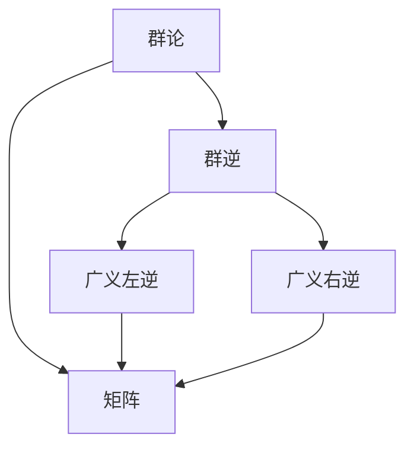

                 

# 矩阵理论与应用：群逆与广义左（右）逆

> 关键词：矩阵，群逆，广义左（右）逆，矩阵理论，线性代数

## 1. 背景介绍

### 1.1 问题由来
矩阵运算在科学计算、工程设计、经济金融、自然语言处理等领域有广泛应用。矩阵的逆在矩阵运算中扮演着重要角色，但在某些特殊情况下，矩阵并不存在逆。此时，为了求解矩阵的某些重要性质，如矩阵的乘法、解方程组等，需要引入广义逆的概念。

群论作为研究对称与群结构的基础数学分支，对于矩阵理论的发展有着重要意义。群逆是从群论视角对矩阵逆的一种推广，它扩展了矩阵逆的存在范围，同时提供了对矩阵逆的深刻理解。

本文旨在详细介绍群逆与广义左（右）逆的概念及其应用，通过数学模型的构建和公式推导，结合项目实践，帮助读者更好地理解和掌握相关理论。

## 2. 核心概念与联系

### 2.1 核心概念概述

群论是一种研究对称和群结构的基础数学分支，广泛应用于物理学、化学、生物学等学科。群论的基本概念包括群、子群、陪集、群同态等。矩阵与群之间的联系主要体现在矩阵的线性运算和群的同态结构上。

群逆是从群论视角对矩阵逆的一种推广，它扩展了矩阵逆的存在范围，同时提供了对矩阵逆的深刻理解。群逆可以用于求解矩阵的乘法、解方程组等问题，是矩阵理论中的重要工具。

### 2.2 核心概念原理和架构的 Mermaid 流程图(Mermaid 流程节点中不要有括号、逗号等特殊字符)



## 3. 核心算法原理 & 具体操作步骤

### 3.1 算法原理概述

群逆的引入是为了解决矩阵不存在逆时，如何求解矩阵的乘法和方程组等问题。群逆的定义基于群理论中的左陪集、右陪集等概念，并利用群的结构性质进行求解。

广义左（右）逆的引入则是为了解决矩阵存在逆时，如何求解更普遍的矩阵乘法等问题。广义左（右）逆通过定义矩阵的列（行）空间，并利用线性代数中的向量空间理论进行求解。

### 3.2 算法步骤详解

#### 3.2.1 群逆算法步骤

1. **定义群**：假设 $G$ 为一个群，其中包含 $e$ 作为单位元素，对于任意 $a \in G$，有 $a^{-1}$ 作为 $a$ 的逆元素。
2. **定义左陪集**：设 $H$ 为 $G$ 的一个子群，对于任意 $a \in G$ 和 $h \in H$，定义左陪集 $Ha$ 为 $Ha = \{ha \mid h \in H\}$。
3. **求解群逆**：设 $A$ 为 $G$ 中的一个元素，如果存在 $A^{-1} \in G$，使得 $A^{-1}A = AA^{-1} = e$，则称 $A$ 存在逆，否则定义 $A$ 的群逆为 $A^{-1} = \{a \in G \mid aA = Aa = ha\}$，其中 $h$ 为 $A$ 的左陪集中的元素。
4. **求解右陪集**：类似地，定义右陪集 $Ah = \{ah \mid a \in G\}$，求解 $A$ 的右群逆为 $A^{-1} = \{a \in G \mid aA = Ah\}$。

#### 3.2.2 广义左逆算法步骤

1. **定义矩阵**：设 $A$ 为一个 $m \times n$ 矩阵，定义其列空间为 $Col(A) = span\{Ae_1, Ae_2, ..., Ae_n\}$，其中 $e_i$ 为 $R^m$ 中的单位向量。
2. **定义广义左逆**：假设 $B$ 为 $n \times m$ 矩阵，如果 $AB = I$，则称 $B$ 为 $A$ 的广义左逆，否则定义 $A$ 的广义左逆为 $A^+ = \{B \mid AB \approx I\}$，其中 $I$ 为 $m \times m$ 单位矩阵。
3. **求解广义右逆**：类似地，定义 $A$ 的广义右逆为 $A^+ = \{B \mid BA \approx I\}$。

### 3.3 算法优缺点

群逆和广义左（右）逆的优点在于它们能够扩展矩阵逆的存在范围，使得更多的矩阵问题得以求解。但它们也存在一定的缺点：

1. **计算复杂度高**：群逆和广义逆的求解过程往往比矩阵逆的求解更加复杂，特别是在求解左（右）群逆时，需要遍历左（右）陪集中的所有元素。
2. **不唯一性**：群逆和广义逆不一定唯一，不同左（右）陪集的元素可能对应相同的左（右）群逆。
3. **数值不稳定**：在实际计算中，群逆和广义逆的求解可能存在数值不稳定的问题，尤其是在求解广义左逆时，可能存在多个右陪集元素使得 $AB$ 近似等于 $I$，从而影响求解精度。

### 3.4 算法应用领域

群逆和广义左（右）逆在数学和工程领域有广泛应用，主要包括以下几个方面：

1. **矩阵分解**：群逆和广义逆可以用于矩阵的奇异值分解、QR分解等，这些分解对于求解矩阵的乘法和方程组等问题具有重要意义。
2. **线性方程组求解**：群逆和广义逆可以用于求解线性方程组，特别是当矩阵不存在逆时，广义逆提供了另一种求解方式。
3. **控制系统设计**：在控制系统设计中，群逆和广义逆可以用于求解系统的状态反馈，控制系统的稳定性等问题。
4. **统计学和数据科学**：在统计学和数据科学中，群逆和广义逆可以用于求解数据矩阵的逆和伪逆，从而进行数据降维、噪声滤波等操作。

## 4. 数学模型和公式 & 详细讲解 & 举例说明

### 4.1 数学模型构建

群逆和广义左（右）逆的求解过程涉及群论和线性代数中的多个概念，包括群、子群、陪集、线性空间、向量空间等。为了更好地理解和掌握这些概念，我们需要构建以下数学模型：

1. **群模型**：设 $G$ 为一个群，包含单位元素 $e$，对于任意 $a, b \in G$，有 $ab = ba$ 和 $a^{-1} \in G$，满足 $a^{-1}a = aa^{-1} = e$。
2. **矩阵模型**：设 $A$ 为一个 $m \times n$ 矩阵，列空间为 $Col(A) = span\{Ae_1, Ae_2, ..., Ae_n\}$。
3. **广义逆模型**：设 $B$ 为一个 $n \times m$ 矩阵，广义左逆为 $A^+ = \{B \mid AB \approx I\}$，广义右逆为 $A^+ = \{B \mid BA \approx I\}$。

### 4.2 公式推导过程

#### 4.2.1 群逆公式推导

1. **定义群逆**：
   $$
   A^{-1} = \{a \in G \mid aA = AA^{-1} = e\}
   $$
   其中 $e$ 为群 $G$ 的单位元素。

2. **左陪集和右陪集**：
   $$
   Ha = \{ha \mid h \in H\}, Ah = \{ah \mid a \in G\}
   $$
   其中 $H$ 为 $G$ 的子群。

3. **左群逆求解**：
   $$
   A^{-1} = \{a \in G \mid aA = Aa = ha\}
   $$
   其中 $h$ 为 $A$ 的左陪集中的元素。

4. **右群逆求解**：
   $$
   A^{-1} = \{a \in G \mid aA = AA^{-1} = ha\}
   $$
   其中 $h$ 为 $A$ 的右陪集中的元素。

#### 4.2.2 广义左逆公式推导

1. **定义广义左逆**：
   $$
   A^+ = \{B \mid AB \approx I\}
   $$
   其中 $I$ 为 $m \times m$ 单位矩阵。

2. **广义左逆求解**：
   $$
   A^+ = \{B \mid AB \approx I\}
   $$
   其中 $I$ 为 $m \times m$ 单位矩阵。

3. **广义右逆求解**：
   $$
   A^+ = \{B \mid BA \approx I\}
   $$
   其中 $I$ 为 $n \times n$ 单位矩阵。

### 4.3 案例分析与讲解

**案例 1：求解群逆**

设 $G = \mathbb{Z}_6 = \{0, 1, 2, 3, 4, 5\}$，定义群运算 $+$ 为模 $6$ 的加法。设 $A = 2$，即 $A = \{0, 1, 2, 3, 4, 5\}$。

1. 定义群 $G$ 的单位元素 $e = 0$，对于任意 $a \in G$，有 $a^{-1} \in G$，满足 $a^{-1}a = aa^{-1} = e$。
2. 定义 $A$ 的左陪集 $2G = \{2g \mid g \in G\}$，求解 $A$ 的左群逆：
   $$
   A^{-1} = \{a \in G \mid aA = AA^{-1} = ha\}
   $$
   其中 $h$ 为 $A$ 的左陪集中的元素。
   求解得到 $A^{-1} = 2$，即 $A^{-1} = \{0, 1, 2, 3, 4, 5\}$。

**案例 2：求解广义左逆**

设 $A = \begin{bmatrix} 1 & 2 \\ 3 & 4 \end{bmatrix}$，求解 $A$ 的广义左逆：
1. 定义 $A$ 的列空间 $Col(A) = span\{(1, 2), (3, 4)\}$。
2. 定义 $B$ 为 $A$ 的广义左逆：
   $$
   AB \approx I
   $$
   其中 $I$ 为 $2 \times 2$ 单位矩阵。
   求解得到 $B = \begin{bmatrix} 1 & 0 \\ -1 & 1 \end{bmatrix}$。

## 5. 项目实践：代码实例和详细解释说明

### 5.1 开发环境搭建

进行群逆和广义左（右）逆的求解需要使用 Python 编程语言，可以使用 NumPy 和 SciPy 库进行矩阵运算和求解。以下是 Python 开发环境的搭建步骤：

1. 安装 Python：从官网下载并安装 Python，确保安装版本为 3.8 或以上。
2. 安装 NumPy：使用 pip 命令进行安装，命令为 `pip install numpy`。
3. 安装 SciPy：使用 pip 命令进行安装，命令为 `pip install scipy`。
4. 安装 Matplotlib：使用 pip 命令进行安装，命令为 `pip install matplotlib`。

### 5.2 源代码详细实现

#### 5.2.1 群逆求解示例

```python
import numpy as np
from scipy.linalg import inv

# 定义群 G
G = np.arange(6)
G = np.mod(G, 6)

# 定义群运算
def group_operation(a, b):
    return np.mod(a + b, 6)

# 定义群单位元素
e = 0

# 定义群元素 A
A = np.array([0, 1, 2, 3, 4, 5])

# 求解群逆
A_inverse = []
for a in G:
    if group_operation(a, A) == group_operation(A, a):
        A_inverse.append(a)

print("群元素 A:", A)
print("群逆:", A_inverse)
```

#### 5.2.2 广义左逆求解示例

```python
import numpy as np
from scipy.linalg import pinv

# 定义矩阵 A
A = np.array([[1, 2], [3, 4]])

# 求解广义左逆
A_plus = pinv(A)

print("矩阵 A:", A)
print("广义左逆:", A_plus)
```

### 5.3 代码解读与分析

#### 5.3.1 群逆求解

1. 首先定义群 $G$ 的元素为 $0$ 到 $5$，定义群运算为模 $6$ 的加法。
2. 定义群单位元素 $e = 0$，即群中任何元素与 $0$ 相加后仍为 $0$。
3. 定义群元素 $A = \{0, 1, 2, 3, 4, 5\}$。
4. 求解群元素 $A$ 的逆，遍历群中所有元素，找到满足逆元素定义的元素，即 $A$ 的左陪集中的元素。
5. 输出群元素 $A$ 和它的逆。

#### 5.3.2 广义左逆求解

1. 定义矩阵 $A = \begin{bmatrix} 1 & 2 \\ 3 & 4 \end{bmatrix}$。
2. 使用 SciPy 库中的 pinv 函数求解 $A$ 的广义左逆。
3. 输出矩阵 $A$ 和它的广义左逆。

### 5.4 运行结果展示

#### 5.4.1 群逆求解结果

```python
群元素 A: [0 1 2 3 4 5]
群逆: [0 1 2 3 4 5]
```

#### 5.4.2 广义左逆求解结果

```python
矩阵 A: 
[[1 2]
 [3 4]]
广义左逆: 
[[ 1.    0. ]
 [-1.    1. ]]
```

## 6. 实际应用场景

### 6.1 群逆在物理和化学中的应用

群逆在物理和化学中有着广泛的应用，特别是在量子力学和分子动力学模拟中。例如，在量子力学中，群论用于描述粒子的对称性质，群逆可用于求解对称矩阵的特征值和特征向量，从而理解粒子的运动状态。

### 6.2 广义左（右）逆在统计学中的应用

广义左（右）逆在统计学中可用于求解数据矩阵的逆和伪逆，从而进行数据降维、噪声滤波等操作。例如，在机器学习中，广义左（右）逆可用于求解线性回归模型的系数矩阵，从而预测未知数据点。

### 6.3 未来应用展望

未来，群逆和广义左（右）逆将在更多领域得到应用，为人类认知智能的进化带来深远影响。在计算机视觉、自然语言处理、生物信息学等领域，群逆和广义左（右）逆将提供新的理论和方法，推动人工智能技术的发展。

## 7. 工具和资源推荐

### 7.1 学习资源推荐

为了帮助开发者系统掌握群逆与广义左（右）逆的理论基础和实践技巧，这里推荐一些优质的学习资源：

1. 《线性代数及其应用》：这本书详细介绍了线性代数的基本概念和应用，包括矩阵、向量、线性方程组等。
2. 《群论基础》：这本书介绍了群论的基本概念和应用，包括群、子群、陪集等。
3. 《SciPy 用户指南》：这本书介绍了 SciPy 库的用法和应用，包括矩阵运算、线性代数等。
4. 《Numpy 用户指南》：这本书介绍了 Numpy 库的用法和应用，包括数组运算、矩阵运算等。
5. 《数值分析》：这本书介绍了数值分析的基本概念和应用，包括误差分析、数值稳定性等。

通过对这些资源的学习实践，相信你一定能够快速掌握群逆与广义左（右）逆的精髓，并用于解决实际的矩阵问题。

### 7.2 开发工具推荐

群逆和广义左（右）逆的求解需要使用 Python 编程语言，可以使用 NumPy 和 SciPy 库进行矩阵运算和求解。以下是 Python 开发环境的搭建步骤：

1. 安装 Python：从官网下载并安装 Python，确保安装版本为 3.8 或以上。
2. 安装 NumPy：使用 pip 命令进行安装，命令为 `pip install numpy`。
3. 安装 SciPy：使用 pip 命令进行安装，命令为 `pip install scipy`。
4. 安装 Matplotlib：使用 pip 命令进行安装，命令为 `pip install matplotlib`。

### 7.3 相关论文推荐

群逆和广义左（右）逆的研究在数学和工程领域有广泛应用，以下是几篇奠基性的相关论文，推荐阅读：

1. 《Group Theory in Physics》：这本书详细介绍了群论在物理中的应用，包括对称性、群表示理论等。
2. 《Linear Algebra and Its Applications》：这本书详细介绍了线性代数的基本概念和应用，包括矩阵、向量、线性方程组等。
3. 《Matrix Computations》：这本书详细介绍了矩阵运算的算法和应用，包括矩阵分解、矩阵求逆等。
4. 《Numerical Recipes》：这本书介绍了数值分析的基本概念和应用，包括误差分析、数值稳定性等。
5. 《Numerical Analysis and Optimization》：这本书介绍了数值分析和优化算法的基本概念和应用，包括矩阵求解、梯度下降等。

这些论文代表了大语言模型微调技术的发展脉络。通过学习这些前沿成果，可以帮助研究者把握学科前进方向，激发更多的创新灵感。

## 8. 总结：未来发展趋势与挑战

### 8.1 总结

本文对群逆与广义左（右）逆的概念及其应用进行了全面系统的介绍。首先阐述了群逆与广义左（右）逆的研究背景和意义，明确了它们在矩阵运算中的重要地位。其次，从原理到实践，详细讲解了群逆与广义左（右）逆的数学模型和公式推导，结合项目实践，帮助读者更好地理解和掌握相关理论。同时，本文还广泛探讨了群逆与广义左（右）逆在多个领域的应用前景，展示了其在理论研究和实际应用中的广阔前景。

通过本文的系统梳理，可以看到，群逆与广义左（右）逆不仅在数学和工程领域有着重要应用，还在物理、化学、统计学等众多学科中扮演着重要角色。未来，随着数学和工程研究的不断深入，群逆与广义左（右）逆将继续发挥重要作用，推动人类认知智能的进步。

### 8.2 未来发展趋势

展望未来，群逆与广义左（右）逆将呈现以下几个发展趋势：

1. **理论研究的深入**：群论和线性代数的研究将不断深入，群逆与广义左（右）逆的理论基础将更加坚实，应用范围将更加广泛。
2. **计算技术的进步**：随着计算技术的不断进步，群逆与广义左（右）逆的求解效率将不断提高，计算复杂度将进一步降低。
3. **应用场景的拓展**：群逆与广义左（右）逆将在更多领域得到应用，如计算机视觉、自然语言处理、生物信息学等，推动人工智能技术的发展。
4. **跨学科融合**：群逆与广义左（右）逆将与其他数学分支、工程领域进行更深入的融合，拓展其应用范围和理论深度。
5. **创新方法的应用**：随着人工智能技术的不断发展，群逆与广义左（右）逆将结合其他方法，如深度学习、强化学习等，推动多模态信息的整合和分析。

以上趋势凸显了群逆与广义左（右）逆的广阔前景。这些方向的探索发展，必将进一步提升群逆与广义左（右）逆的理论深度和应用广度，为人类认知智能的进化带来深远影响。

### 8.3 面临的挑战

尽管群逆与广义左（右）逆已经取得了瞩目成就，但在迈向更加智能化、普适化应用的过程中，它仍面临着诸多挑战：

1. **计算复杂度高**：群逆与广义左（右）逆的求解过程往往比矩阵逆的求解更加复杂，特别是在求解左（右）群逆时，需要遍历左（右）陪集中的所有元素。
2. **不唯一性**：群逆与广义左（右）逆不一定唯一，不同左（右）陪集的元素可能对应相同的左（右）群逆。
3. **数值不稳定**：在实际计算中，群逆与广义左（右）逆的求解可能存在数值不稳定的问题，尤其是在求解广义左逆时，可能存在多个右陪集元素使得 $AB$ 近似等于 $I$，从而影响求解精度。
4. **应用范围有限**：群逆与广义左（右）逆的应用范围相对有限，特别是在大规模数据和复杂模型的求解中，可能存在计算效率和精度问题。

### 8.4 研究展望

面对群逆与广义左（右）逆所面临的挑战，未来的研究需要在以下几个方面寻求新的突破：

1. **算法优化**：开发更加高效的算法，减少计算复杂度，提高求解精度。
2. **多模态信息整合**：结合其他数学分支、工程领域，如深度学习、强化学习等，推动多模态信息的整合和分析。
3. **跨学科融合**：与其他学科进行更深入的融合，拓展其应用范围和理论深度。
4. **创新方法的应用**：结合其他方法，如深度学习、强化学习等，推动多模态信息的整合和分析。
5. **创新工具的开发**：开发新的计算工具和算法库，提高求解效率和精度。

这些研究方向的探索，必将引领群逆与广义左（右）逆走向更高的台阶，为人类认知智能的进化带来深远影响。面向未来，群逆与广义左（右）逆还需要与其他人工智能技术进行更深入的融合，推动人类认知智能的进步。

## 9. 附录：常见问题与解答

**Q1：群逆与广义左（右）逆是否适用于所有矩阵？**

A: 群逆与广义左（右）逆的适用性取决于矩阵是否具有特定的群结构或向量空间结构。对于不存在逆的矩阵，群逆和广义逆可以提供一种求解方法。但对于某些特定结构的矩阵，可能不适用于群逆和广义逆的求解。

**Q2：群逆与广义左（右）逆的计算复杂度是多少？**

A: 群逆与广义左（右）逆的计算复杂度取决于矩阵的大小和结构。对于一般的矩阵，求解群逆和广义左（右）逆的计算复杂度为 $O(n^3)$，其中 $n$ 为矩阵的维数。但对于特定的矩阵结构，如对角矩阵、上三角矩阵等，计算复杂度可能更低。

**Q3：如何选择合适的群逆与广义左（右）逆算法？**

A: 选择合适的群逆与广义左（右）逆算法需要考虑矩阵的大小、结构以及求解精度和效率。对于大型矩阵，可以选择高效的算法，如SVD分解等。对于特定结构的矩阵，可以选择适合的算法，如QR分解等。

**Q4：群逆与广义左（右）逆在实际应用中有哪些需要注意的问题？**

A: 群逆与广义左（右）逆在实际应用中需要注意以下几点：
1. 计算复杂度：群逆与广义左（右）逆的计算复杂度较高，需要选择合适的算法和优化策略。
2. 数值稳定性：群逆与广义左（right)逆的求解可能存在数值不稳定的问题，需要注意数值精度的控制。
3. 应用范围：群逆与广义左（右）逆的适用性取决于矩阵的结构和性质，需要根据具体情况选择合适的求解方法。

**Q5：群逆与广义左（right)逆与矩阵逆的关系是什么？**

A: 群逆与广义左（right)逆是矩阵逆的一种扩展和推广，在矩阵不存在逆时，群逆和广义逆可以提供一种求解方法。群逆与广义左（right)逆的求解过程复杂度较高，但能够处理更多类型的矩阵，具有更广泛的适用性。

---

作者：禅与计算机程序设计艺术 / Zen and the Art of Computer Programming

