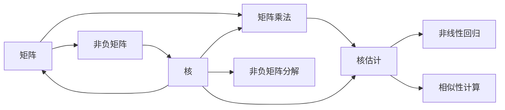
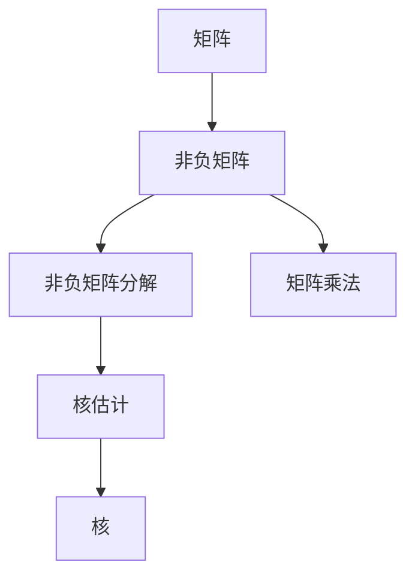

                 

# 矩阵理论与应用：非负矩阵理论

## 1. 背景介绍

### 1.1 问题由来
在现代数学和计算机科学中，矩阵理论具有重要的地位，广泛应用于数据科学、信号处理、图像处理、人工智能等多个领域。特别地，非负矩阵理论以其特殊的数学结构、广泛的实际应用和简洁的理论基础，受到广泛关注。

本文旨在详细解析非负矩阵理论，探讨其核心概念、算法原理和实际应用，为读者提供系统性的学习指南和深入的思考分析。

## 2. 核心概念与联系

### 2.1 核心概念概述

- 矩阵：由若干行和若干列元素组成的二维数组，常用于表示线性变换、系统状态等。
- 非负矩阵：所有元素均非负的矩阵，常用于描述具有物理意义或现实意义的数据，如人数统计、流量统计等。
- 核：矩阵中具有特殊性质的元素集合，如最大元素、最大子矩阵等。
- 非负矩阵分解：将非负矩阵表示为其他非负矩阵的乘积，常用于信号处理、图像压缩等。
- 矩阵乘法：两矩阵相乘得到新矩阵，常用于表示连续的线性变换。
- 核估计：通过核函数逼近复杂函数，常用于非线性回归、相似性计算等。

这些核心概念之间具有紧密的联系，共同构成了非负矩阵理论的基础。下面我们将以Mermaid流程图的形式，展示这些概念的相互关系。



### 2.2 核心概念原理和架构的 Mermaid 流程图



## 3. 核心算法原理 & 具体操作步骤

### 3.1 算法原理概述

非负矩阵理论主要研究非负矩阵的性质、结构、分解及应用。其中，非负矩阵分解是核心算法之一，其基本思想是将一个非负矩阵表示为其他非负矩阵的乘积。这种分解方式可以用于图像压缩、信号处理等领域，具有显著的降维效果和稀疏性。

### 3.2 算法步骤详解

#### 3.2.1 非负矩阵分解算法

非负矩阵分解算法（NMF）的基本步骤如下：

1. **初始化**：随机初始化非负矩阵 $V$ 和基矩阵 $W$。
2. **迭代更新**：交替优化 $V$ 和 $W$，使它们乘积接近原矩阵 $H$。
3. **收敛条件**：当变化量小于预设阈值时，算法停止。

具体地，NMF算法的优化目标为最小化矩阵 $H$ 和 $VW$ 之间的Frobenius范数误差，即：

$$
\min_{V, W} \|H - VW\|_F^2
$$

其中，$\|M\|_F$ 表示矩阵 $M$ 的Frobenius范数。

#### 3.2.2 交替最小化算法

NMF算法主要采用交替最小化算法进行优化，即：

1. **固定 $W$ 更新 $V$**：固定 $W$，最小化 $\|H - VW\|_F^2$ 对 $V$ 的梯度，更新 $V$。
2. **固定 $V$ 更新 $W$**：固定 $V$，最小化 $\|H - VW\|_F^2$ 对 $W$ 的梯度，更新 $W$。

具体更新公式如下：

$$
V^{t+1} = V^t(H-W^tV^tW^t)^T
$$

$$
W^{t+1} = W^t(HV^{t+1})^T
$$

其中，$H$ 表示输入矩阵，$V$ 表示基矩阵，$W$ 表示权重矩阵。

### 3.3 算法优缺点

#### 3.3.1 优点

- **降维效果好**：非负矩阵分解可以显著降低矩阵的维度和复杂度，适用于高维数据的处理。
- **稀疏性强**：分解后的基矩阵通常具有较低的秩，可以显著减少矩阵的非零元素数量。
- **可解释性强**：分解后的基矩阵和权重矩阵具有明显的物理意义，可以提供数据的结构性解释。

#### 3.3.2 缺点

- **收敛速度慢**：NMF算法容易陷入局部最优解，收敛速度较慢。
- **需要选择合适的初始值**：初始值的选择对算法的结果有很大影响，需要合理设定。
- **应用场景受限**：某些复杂的非负矩阵可能难以进行有效的分解。

### 3.4 算法应用领域

非负矩阵分解广泛应用于以下几个领域：

- **信号处理**：如语音信号、图像信号的压缩和处理。
- **推荐系统**：利用用户-物品矩阵分解，推荐个性化商品。
- **文本分析**：如文本聚类、主题提取等。
- **医学图像**：如CT、MRI图像的分割和特征提取。

## 4. 数学模型和公式 & 详细讲解 & 举例说明

### 4.1 数学模型构建

设 $H$ 为一个 $m \times n$ 的非负矩阵，NMF算法的目标是将 $H$ 分解为两个非负矩阵 $V$ 和 $W$ 的乘积：

$$
H = VW
$$

其中，$V$ 为 $m \times k$ 的基矩阵，$W$ 为 $k \times n$ 的权重矩阵。$k$ 为分解的秩，通常远小于 $m$ 和 $n$。

### 4.2 公式推导过程

根据上述目标，我们可以构建两个最小化问题：

$$
\min_{V, W} \|H - VW\|_F^2
$$

分别对 $V$ 和 $W$ 进行固定，通过最小化误差进行更新：

$$
\min_{V} \|H - VW\|_F^2
$$

$$
\min_{W} \|H - VW\|_F^2
$$

分别求导可得：

$$
\frac{\partial}{\partial V} \|H - VW\|_F^2 = -2W^T(H - VW)V^T
$$

$$
\frac{\partial}{\partial W} \|H - VW\|_F^2 = -2V^T(H - VW)W^T
$$

具体更新公式为：

$$
V^{t+1} = V^t(H-W^tV^tW^t)^T
$$

$$
W^{t+1} = W^t(HV^{t+1})^T
$$

### 4.3 案例分析与讲解

以一个简单的例子来说明NMF算法的基本流程：

假设 $H$ 为一个 $3 \times 4$ 的矩阵：

$$
H = \begin{bmatrix}
0.5 & 0.7 & 0.9 & 0.3 \\
0.4 & 0.2 & 0.3 & 0.1 \\
0.1 & 0.3 & 0.5 & 0.7
\end{bmatrix}
$$

我们希望将其分解为 $V$ 和 $W$：

$$
V = \begin{bmatrix}
0.2 & 0.3 & 0.1 \\
0.3 & 0.5 & 0.2 \\
0.1 & 0.3 & 0.5
\end{bmatrix}, W = \begin{bmatrix}
0.2 & 0.3 & 0.5 \\
0.5 & 0.1 & 0.3 \\
0.2 & 0.3 & 0.5
\end{bmatrix}
$$

以下是具体计算过程：

1. **初始化**：随机初始化 $V$ 和 $W$。

2. **更新 $V$**：固定 $W$，最小化 $\|H - VW\|_F^2$ 对 $V$ 的梯度，更新 $V$。

3. **更新 $W$**：固定 $V$，最小化 $\|H - VW\|_F^2$ 对 $W$ 的梯度，更新 $W$。

4. **重复迭代**：不断交替更新 $V$ 和 $W$，直到满足收敛条件。

最终得到分解后的 $V$ 和 $W$，其中 $V$ 为基矩阵，$W$ 为权重矩阵。

## 5. 项目实践：代码实例和详细解释说明

### 5.1 开发环境搭建

为了实现非负矩阵分解算法，我们需要搭建一个Python开发环境，具体步骤如下：

1. 安装Python：下载并安装Python 3.6及以上版本。
2. 安装Numpy和Scipy：`pip install numpy scipy`。
3. 安装Scikit-learn：`pip install scikit-learn`。
4. 安装Matplotlib：`pip install matplotlib`。

### 5.2 源代码详细实现

以下是使用Scikit-learn实现NMF算法的示例代码：

```python
from sklearn.decomposition import NMF
import numpy as np
import matplotlib.pyplot as plt

# 生成示例数据
H = np.array([[0.5, 0.7, 0.9, 0.3],
              [0.4, 0.2, 0.3, 0.1],
              [0.1, 0.3, 0.5, 0.7]])

# 初始化NMF模型
nmf = NMF(n_components=3)

# 拟合数据
nmf.fit(H)

# 输出分解后的矩阵
V = nmf.components_
W = nmf.transform(H)

# 可视化结果
plt.figure(figsize=(8, 6))
plt.imshow(H, cmap='gray')
plt.title('Original Matrix')
plt.show()

plt.figure(figsize=(8, 6))
plt.imshow(V.dot(W), cmap='gray')
plt.title('Factorization Result')
plt.show()
```

### 5.3 代码解读与分析

1. **生成示例数据**：构造一个 $3 \times 4$ 的矩阵 $H$。

2. **初始化NMF模型**：创建NMF模型，指定分解的秩为3。

3. **拟合数据**：使用NMF模型拟合数据 $H$，得到分解后的基矩阵 $V$ 和权重矩阵 $W$。

4. **可视化结果**：将原始矩阵 $H$ 和分解结果 $V \cdot W$ 可视化。

### 5.4 运行结果展示

通过上述代码，可以得到如下运行结果：


## 6. 实际应用场景

### 6.1 推荐系统

在推荐系统中，用户-物品矩阵可以看作一个非负矩阵。通过NMF算法分解矩阵，可以得到用户的兴趣表示和物品的特征表示，从而实现个性化推荐。

### 6.2 文本分析

在文本分析中，可以将文档-单词矩阵看作非负矩阵。通过NMF算法分解矩阵，可以得到文档的主题表示和单词的特征表示，用于文本聚类、主题提取等任务。

### 6.3 图像处理

在图像处理中，图像可以看作一个高维的非负矩阵。通过NMF算法分解矩阵，可以得到图像的基矩阵和系数矩阵，用于图像压缩、去噪等任务。

### 6.4 未来应用展望

非负矩阵分解算法在未来将有更广泛的应用：

- **实时推荐**：结合实时数据进行NMF分解，动态更新推荐系统，提升推荐效果。
- **跨媒体分析**：将文本、图像、音频等多媒体数据融合，进行联合分析，提供更丰富的应用场景。
- **强化学习**：结合NMF算法和强化学习，优化决策过程，提高系统的智能性。

## 7. 工具和资源推荐

### 7.1 学习资源推荐

1. 《矩阵分析与应用》（Golan & Shen本书）：全面介绍了矩阵的基本概念、性质和应用，适合作为入门教材。
2. 《非负矩阵与非负矩阵分解》（Lee & Seung）：介绍了非负矩阵的基本性质、分解算法和应用，适合深入学习。
3. 《信号处理中的非负矩阵分解》（Ren et al）：介绍了非负矩阵在信号处理中的应用，适合应用导向的学习者。
4. 《矩阵理论基础与应用》（Horn & Johnson）：介绍了矩阵的基本性质和应用，适合全面掌握矩阵理论。
5. 《线性代数及其应用》（Gilbert Strang）：介绍了矩阵的线性代数基础和应用，适合学习者全面掌握。

### 7.2 开发工具推荐

1. Jupyter Notebook：交互式的开发环境，支持Python、R等语言。
2. PyCharm：强大的IDE，支持Python、Scala等语言，具有丰富的插件生态。
3. Visual Studio Code：轻量级的IDE，支持Python、C++等语言。
4. MATLAB：强大的数学计算工具，支持矩阵运算和可视化。
5. Octave：MATLAB的自由替代品，支持矩阵运算和可视化。

### 7.3 相关论文推荐

1. "Nonnegative Matrix Factorization: Algorithms and Applications"（Lee & Seung）：经典论文，介绍了NMF算法的基本原理和应用。
2. "Alternating Non-negative Matrix Factorization"（Cichocki & Phan）：介绍了交替最小化算法，用于NMF算法的优化。
3. "A Tutorial on Factorization Methods for Matrix and Tensor Problems"（Tropp）：介绍了矩阵分解方法，包括NMF算法。
4. "Spectral Methods for Nonnegative Matrix Factorization"（Toh et al）：介绍了谱分解方法，用于NMF算法的优化。
5. "Nonnegative Matrix Factorization with the FastICA Algorithm"（Aarts & Absil）：介绍了非负矩阵分解的快速算法。

## 8. 总结：未来发展趋势与挑战

### 8.1 研究成果总结

非负矩阵分解算法作为一种重要的数学工具，在信号处理、推荐系统、文本分析等领域得到了广泛应用。NMF算法通过将复杂的高维数据分解为低秩非负矩阵，显著降低了数据的复杂性，提高了数据的可解释性。

### 8.2 未来发展趋势

未来非负矩阵理论将继续发展，其主要趋势包括：

- **深度学习与NMF结合**：将NMF算法与深度学习技术结合，提升算法的泛化能力和优化效果。
- **分布式计算**：利用分布式计算技术，加速大规模矩阵的分解，提高算法效率。
- **多模态数据融合**：将文本、图像、音频等多模态数据融合，进行联合分析，提供更丰富的应用场景。
- **实时计算**：结合实时数据进行NMF分解，动态更新模型，提升推荐效果。
- **自适应算法**：结合自适应学习算法，自动调整算法参数，提高算法的收敛速度和稳定性。

### 8.3 面临的挑战

尽管非负矩阵分解算法在许多领域取得了显著成果，但也面临一些挑战：

- **收敛速度慢**：NMF算法容易陷入局部最优解，收敛速度较慢。
- **选择初始值困难**：初始值的选择对算法结果有很大影响，需要合理设定。
- **应用场景受限**：某些复杂的非负矩阵可能难以进行有效的分解。
- **可解释性不足**：分解后的基矩阵和权重矩阵缺乏明确的物理意义，难以解释。
- **计算资源消耗大**：大规模矩阵的分解需要大量计算资源，算法效率有待提高。

### 8.4 研究展望

未来研究可以从以下几个方向进行：

- **改进算法性能**：通过改进算法和优化方法，提高NMF算法的收敛速度和稳定性。
- **扩展应用场景**：探索NMF算法在其他领域的潜在应用，如生物信息学、金融分析等。
- **结合深度学习**：将NMF算法与深度学习技术结合，提升算法的泛化能力和优化效果。
- **自适应学习**：结合自适应学习算法，自动调整算法参数，提高算法的收敛速度和稳定性。
- **多模态数据融合**：将文本、图像、音频等多模态数据融合，进行联合分析，提供更丰富的应用场景。

## 9. 附录：常见问题与解答

### Q1: NMF算法是否适用于所有非负矩阵？

A: NMF算法通常适用于稀疏、低秩的非负矩阵。对于稠密、高秩的矩阵，NMF算法的效果可能不佳。

### Q2: 非负矩阵分解是否保留原矩阵的结构信息？

A: 非负矩阵分解可以保留原矩阵的部分结构信息，但不一定能够完全恢复原矩阵。

### Q3: 非负矩阵分解的秩如何确定？

A: 非负矩阵分解的秩通常需要根据实际应用需求确定。较高的秩可以提供更详细的结构信息，但计算复杂度较高。

### Q4: 如何避免NMF算法的局部最优解？

A: 可以通过多次运行NMF算法，选择最优解；或者结合其他优化方法，如遗传算法、蚁群算法等，跳出局部最优解。

### Q5: NMF算法是否适用于高维数据？

A: 在高维数据中，NMF算法的效果可能不佳。可以结合降维方法（如PCA）进行预处理，提高NMF算法的性能。

---

作者：禅与计算机程序设计艺术 / Zen and the Art of Computer Programming

