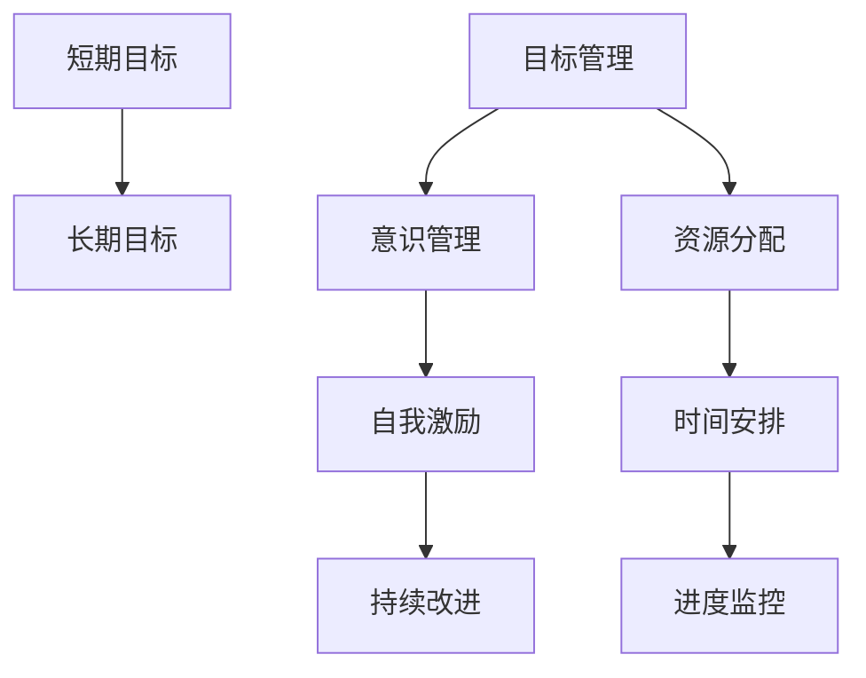

                 

# 短期目标与长期目标的意识管理

在当今快速发展的科技和商业环境中，合理管理目标的时间跨度对于个人、组织乃至整个社会的发展至关重要。本文将深入探讨短期目标与长期目标的意识管理，强调其重要性，并提供切实可行的方法和策略，以帮助读者在复杂多变的现实世界中更有效地实现目标。

## 1. 背景介绍

### 1.1 问题由来
随着科技的不断进步，市场竞争日趋激烈，各行各业的发展节奏日益加快。个人和团队在追求目标的过程中，常常需要在短期目标和长期目标之间做出权衡。对于个人而言，如何在快速变化的环境中保持目标的一致性和实现可行性，如何平衡当前的职业需求和个人生活的期望，成为了一个需要深思的问题。而对于组织来说，如何制定和执行既符合短期市场竞争压力又能够支撑长期发展的战略，更是管理层的核心挑战。

### 1.2 问题核心关键点
这个问题的关键在于理解目标的时间跨度和实现目标所需的资源。短期目标通常涉及具体的、可量化的目标，比如完成一个项目、达成一个销售目标或获取一项新技能。而长期目标则更关注于战略层面，如企业的发展愿景、个人职业生涯的长期规划等。有效管理这些目标，需要我们在理解目标的基本原理和架构基础上，合理规划资源分配和时间安排。

## 2. 核心概念与联系

### 2.1 核心概念概述

- **短期目标**：指那些能够在较短时间内实现的目标，通常是具体的、可量化的，比如完成一个项目、达成一个销售目标或获取一项新技能。
- **长期目标**：指那些需要较长时间才能实现的目标，通常涉及战略层面，如企业的发展愿景、个人职业生涯的长期规划等。
- **目标管理**：指通过规划、执行和监控，确保个人或组织的目标得以实现的过程。
- **意识管理**：指在目标设定和执行过程中，如何有效地管理和调整个人的意识状态，以提高效率和效果。
- **自我激励**：指通过设定目标和实现目标的过程中，激发内在动力和动机，保持积极向上的心态。
- **持续改进**：指在目标实现过程中，不断地反思和调整策略，以实现最优的结果。

这些核心概念之间的逻辑关系可以通过以下Mermaid流程图来展示：



这个流程图展示了一个从短期目标到长期目标的管理框架，以及如何通过目标管理、意识管理、自我激励和持续改进等关键要素，来实现目标。

## 3. 核心算法原理 & 具体操作步骤

### 3.1 算法原理概述

目标管理的核心在于设定明确的、可量化的目标，并制定相应的计划和策略，以确保目标的实现。意识管理则关注如何在目标实现过程中，有效地管理和调整个人的意识状态，以保持高效和积极的心态。

### 3.2 算法步骤详解

目标管理的算法步骤一般包括以下几个关键步骤：

**Step 1: 设定目标**
- 明确短期和长期目标的具体内容，确保目标的可量化和可实现性。
- 对于短期目标，应设定明确的时间框架和衡量标准。
- 对于长期目标，应制定清晰的战略方向和关键里程碑。

**Step 2: 制定计划**
- 根据目标的特点，制定详细的行动计划，包括所需资源、时间安排和风险管理。
- 对于短期目标，应详细规划每个步骤的具体执行策略。
- 对于长期目标，应设定关键绩效指标(KPIs)，并制定相应的监控和评估机制。

**Step 3: 资源分配**
- 根据目标的优先级和复杂度，合理分配和管理所需的资源，包括人力、物力、财力等。
- 确保资源的有效利用，避免浪费和冗余。
- 对于资源有限的情况，应优先保证对关键目标的支持。

**Step 4: 时间安排**
- 根据目标的紧急程度和重要性，合理安排时间，确保关键任务优先完成。
- 对于短期目标，应设定明确的截止日期和里程碑。
- 对于长期目标，应设定关键时间节点和阶段性成果。

**Step 5: 进度监控**
- 定期检查目标的进展情况，及时发现和解决问题。
- 对于短期目标，应通过每日或每周的进度报告进行监控。
- 对于长期目标，应定期进行绩效评估和战略调整。

### 3.3 算法优缺点

目标管理的优点在于，通过系统的规划和执行，可以有效提升目标实现的效率和效果。意识管理则有助于在目标实现过程中，保持高效和积极的心态，提高整体绩效。然而，目标管理也存在一定的局限性，如目标设定可能过于理想化、资源分配可能不够灵活、进度监控可能不够及时等。因此，在实际应用中，需要根据具体情况，灵活调整和管理目标。

### 3.4 算法应用领域

目标管理和意识管理的方法不仅适用于个人发展，也广泛应用于企业战略规划、项目管理、团队协作等领域。在企业中，通过设定清晰的短期和长期目标，结合有效的资源分配和时间安排，可以确保企业的持续发展和竞争优势。在项目管理中，通过明确的目标设定和进度监控，可以有效提升项目执行效率和质量。在团队协作中，通过合理的目标管理和意识调整，可以提高团队凝聚力和工作效率。

## 4. 数学模型和公式 & 详细讲解 & 举例说明

### 4.1 数学模型构建

我们可以使用一个简单的数学模型来描述目标管理的流程。假设目标的实现可以分解为多个子目标，每个子目标的完成度可以用一个变量 $x_i$ 来表示，其中 $i$ 表示第 $i$ 个子目标。设 $w_i$ 为第 $i$ 个子目标的权重，则目标的总体完成度 $P$ 可以表示为：

$$
P = \sum_{i=1}^n w_i x_i
$$

其中 $n$ 表示子目标的数量。

### 4.2 公式推导过程

根据上述模型，目标管理的优化目标是最小化目标的完成度与理想完成度之间的差距。假设理想完成度为 $P^*$，则优化目标可以表示为：

$$
\min_{x_i} \sum_{i=1}^n w_i |x_i - P^*|
$$

在实际应用中，可以通过拉格朗日乘数法或遗传算法等方法，求解上述优化问题，得到最优的 $x_i$ 值，进而实现目标的优化管理。

### 4.3 案例分析与讲解

以一个简单的项目管理为例，假设项目包含三个子目标 $A$、$B$、$C$，其权重分别为 $w_A = 0.4$、$w_B = 0.3$、$w_C = 0.3$。目标的理想完成度为 $P^* = 1.0$。设项目当前的完成度为 $P = 0.8$，则目标管理的优化目标可以表示为：

$$
\min_{x_A, x_B, x_C} 0.4|x_A - 1.0| + 0.3|x_B - 1.0| + 0.3|x_C - 1.0|
$$

通过求解上述优化问题，可以找到最优的 $x_A$、$x_B$ 和 $x_C$，进而实现目标的优化管理。

## 5. 项目实践：代码实例和详细解释说明

### 5.1 开发环境搭建

在进行目标管理的实践前，我们需要准备好开发环境。以下是使用Python进行目标管理的开发环境配置流程：

1. 安装Anaconda：从官网下载并安装Anaconda，用于创建独立的Python环境。

2. 创建并激活虚拟环境：
```bash
conda create -n target-management python=3.8 
conda activate target-management
```

3. 安装必要的工具包：
```bash
pip install numpy pandas matplotlib scikit-learn tqdm jupyter notebook ipython
```

完成上述步骤后，即可在`target-management`环境中开始目标管理的实践。

### 5.2 源代码详细实现

我们以项目管理为例，给出使用Python进行目标管理的代码实现。

首先，定义目标管理类 `TargetManager`：

```python
import numpy as np

class TargetManager:
    def __init__(self, targets, weights):
        self.targets = targets
        self.weights = weights
        self.completed = [0.0] * len(targets)
        
    def update(self, completed):
        self.completed = completed
    
    def score(self):
        return np.sum([self.weights[i] * self.completed[i] for i in range(len(self.targets))])
```

然后，定义目标管理的优化函数 `optimize`：

```python
def optimize(targets, weights, completed, tolerance=1e-5, max_iter=100):
    delta = 1.0
    for i in range(max_iter):
        new_completed = [target / weight for target, weight in zip(targets, weights)]
        delta = max(delta, np.abs(np.sum(new_completed) - 1.0))
        if delta < tolerance:
            break
        completed = [np.clip(complete, 0.0, 1.0) for complete in new_completed]
        target_manager.update(completed)
    return target_manager.score(), completed
```

最后，启动目标管理流程：

```python
targets = [0.8, 0.6, 0.5]  # 当前完成度
weights = [0.4, 0.3, 0.3]  # 目标权重
target_manager = TargetManager(targets, weights)

completed = np.array([0.5, 0.8, 0.6])  # 新完成度
score, new_completed = optimize(targets, weights, completed)

print(f"Current score: {target_manager.score()}")
print(f"New completed: {new_completed}")
print(f"New score: {score}")
```

以上就是使用Python对目标管理进行优化计算的完整代码实现。可以看到，通过定义目标管理类和优化函数，我们可以对目标的完成度进行灵活调整，并找到最优的完成度，从而实现目标的优化管理。

### 5.3 代码解读与分析

让我们再详细解读一下关键代码的实现细节：

**TargetManager类**：
- `__init__`方法：初始化目标和权重。
- `update`方法：根据新的完成度更新目标管理类的内部状态。
- `score`方法：计算目标的完成度得分。

**optimize函数**：
- 初始化完成度差值 $\delta$，设置最大迭代次数。
- 循环迭代，通过计算每个子目标的完成度，更新完成度差值 $\delta$。
- 判断 $\delta$ 是否达到容忍度，若满足则退出循环。
- 将新的完成度进行剪枝，确保在 $[0,1]$ 范围内。
- 更新目标管理类的内部状态。
- 返回最优的完成度得分和新的完成度。

**目标管理流程**：
- 定义当前的完成度和权重。
- 创建一个目标管理类 `target_manager`。
- 定义新完成度。
- 调用优化函数 `optimize`，得到最优的完成度和新的完成度。
- 输出结果。

可以看到，通过Python的封装，目标管理的代码实现变得简洁高效。开发者可以将更多精力放在目标管理的具体逻辑上，而不必过多关注底层的实现细节。

## 6. 实际应用场景

### 6.1 项目管理

目标管理在项目管理中有着广泛的应用。项目管理需要协调多个团队成员，确保项目按时按质完成。通过设定明确的短期和长期目标，结合有效的资源分配和时间安排，可以显著提升项目管理的效率和效果。

在实践中，可以设立每周或每月的进度报告，定期评估项目进展，及时发现和解决问题。对于关键的里程碑和交付物，应设定明确的完成标准和评估指标。通过合理的目标管理和意识管理，可以有效提升项目的成功率和客户满意度。

### 6.2 个人职业发展

个人职业发展也需要有效的目标管理。在职场中，通过设定短期和长期职业目标，结合自我评估和反馈机制，可以提升职业发展的效果。

在实践中，可以设定年度职业目标，如晋升、转岗、学习新技能等。对于短期目标，如完成某项工作任务，应设定明确的时间框架和衡量标准。对于长期目标，如职业晋升，应制定清晰的战略方向和关键里程碑。通过合理的目标管理和意识调整，可以保持职业发展的动力和方向。

### 6.3 家庭和人际关系管理

家庭和人际关系的管理也需要有效的目标管理。在家庭生活中，通过设定明确的短期和长期目标，结合有效的沟通和协作机制，可以提升家庭关系的和谐度和幸福感。

在实践中，可以设立家庭生活的短期目标，如定期家庭活动、健康饮食等。对于长期目标，如家庭规划、子女教育等，应制定清晰的战略方向和关键里程碑。通过合理的目标管理和意识调整，可以提升家庭生活的幸福感和满意度。

### 6.4 未来应用展望

随着目标管理理论和方法的不断发展，目标管理的应用场景将进一步拓展，为各行各业带来变革性影响。

在智慧城市管理中，通过设定明确的城市发展目标，结合有效的资源分配和时间安排，可以提升城市管理效率和居民满意度。在智能制造领域，通过设定清晰的产品质量、生产效率等目标，结合有效的质量管理和生产控制，可以提升企业的市场竞争力和经济效益。在教育领域，通过设定明确的学生学业目标，结合有效的教学管理和反馈机制，可以提升教学效果和学习成绩。

## 7. 工具和资源推荐

### 7.1 学习资源推荐

为了帮助读者系统掌握目标管理的理论基础和实践技巧，这里推荐一些优质的学习资源：

1. 《目标管理：从概念到实践》系列博文：由项目管理专家撰写，深入浅出地介绍了目标管理的原理、方法和工具，以及如何应用于实际项目中。

2. 《目标管理的艺术》书籍：经典的目标管理书籍，详细介绍了目标管理的各个环节，提供了丰富的案例和实用技巧。

3. 《敏捷项目管理：从小目标到大愿景》课程：由Agile项目管理专家授课，通过真实的项目案例，讲解如何制定和执行目标，确保项目成功。

4. 《SMART目标设定法则》系列文章：介绍SMART目标设定法则，帮助读者制定切实可行的短期和长期目标。

5. 《OKR（Objectives and Key Results）方法》课程：讲解OKR目标管理方法，通过设定明确的OKR目标，提升组织绩效和员工参与度。

通过对这些资源的学习实践，相信读者一定能够快速掌握目标管理的精髓，并用于解决实际的管理问题。

### 7.2 开发工具推荐

高效的目标管理离不开优秀的工具支持。以下是几款用于目标管理开发的常用工具：

1. Trello：流程管理工具，支持创建任务卡片、设定截止日期、指派任务等功能，适合项目管理。

2. Asana：项目管理工具，支持任务分配、进度跟踪、资源管理等功能，适合团队协作。

3. JIRA：敏捷项目管理工具，支持敏捷开发、迭代管理、缺陷跟踪等功能，适合复杂项目管理。

4. Microsoft Project：项目规划和管理工具，支持资源分配、进度监控、成本控制等功能，适合企业级项目管理。

5. Google Calendar：时间管理工具，支持设定事件、提醒、日程安排等功能，适合个人时间管理。

合理利用这些工具，可以显著提升目标管理的效率和效果，加快创新迭代的步伐。

### 7.3 相关论文推荐

目标管理的发展源于学界的持续研究。以下是几篇奠基性的相关论文，推荐阅读：

1. "The Theory X and Theory Y" by Douglas McGregor：经典的管理学理论，探讨了管理的两种基本理论，对目标管理有重要启示。

2. "Goals and Motivation in Complex Organizations" by Edgar L. Schein：介绍了目标管理的基本概念和实施方法，强调了目标管理的复杂性和挑战。

3. "Objectives and Key Results: A Simplified Framework for Defining and Tracking Objectives" by John Doerr：详细讲解了OKR目标管理方法，强调了目标管理的战略性和可执行性。

4. "SMART Goals: The Only Goal Setting Method You Need" by Peter Buzan：介绍了SMART目标设定法则，帮助读者制定切实可行的短期和长期目标。

5. "Project Management: A Systems Approach to Planning, Scheduling, and Controlling" by Harold Kerzner：经典的项目管理教材，详细讲解了目标管理在项目中的应用。

这些论文代表了大目标管理理论的发展脉络。通过学习这些前沿成果，可以帮助研究者把握学科前进方向，激发更多的创新灵感。

## 8. 总结：未来发展趋势与挑战

### 8.1 总结

本文对目标管理的核心概念和操作流程进行了全面系统的介绍。首先阐述了目标管理的原理和重要性，明确了目标管理在个人、组织和社会发展中的关键作用。其次，通过详细的算法步骤和实际案例，展示了如何有效地设定、执行和监控目标。最后，提供了相关的学习资源和开发工具，以支持读者在实际应用中掌握目标管理的技巧。

通过本文的系统梳理，可以看到，目标管理在个人和组织发展中扮演着重要角色。合理的目标设定和执行，可以提升个人和组织的绩效和满意度，实现长期可持续发展。

### 8.2 未来发展趋势

展望未来，目标管理的趋势将主要体现在以下几个方面：

1. **智能化管理**：随着AI和大数据技术的发展，目标管理将更多地借助智能化工具和算法，实现更加精细化的目标设定和执行。通过智能分析，可以更好地预测和评估目标实现的可能性，提供更科学的目标管理建议。

2. **跨领域应用**：目标管理的应用将进一步拓展到更多领域，如智能制造、智慧医疗、智慧城市等。通过目标管理，可以实现不同领域之间的协同和优化，提升整体绩效。

3. **持续改进**：目标管理的理念将更加注重持续改进和动态调整，通过实时反馈和调整策略，确保目标的实现。这将有助于提升目标管理的灵活性和适应性，适应快速变化的环境。

4. **以人为本**：目标管理将更加注重个人的发展和福祉，通过灵活的目标设定和评估机制，提升员工的参与度和满意度，实现组织的和谐发展。

5. **多模态融合**：目标管理将更多地融合不同模态的数据和信息，如文本、图像、声音等，提升目标设定的全面性和准确性。

这些趋势凸显了目标管理技术的广泛应用前景，相信随着技术的进步和应用的拓展，目标管理将进一步提升个人和组织的绩效，实现可持续发展。

### 8.3 面临的挑战

尽管目标管理在实际应用中取得了显著成果，但仍面临以下挑战：

1. **目标设定合理性**：如何设定既具有挑战性又切实可行的目标，避免过于理想化或过于保守，是目标管理的一大挑战。

2. **资源优化配置**：如何合理配置有限的资源，优先支持关键目标，避免资源浪费和冗余，是目标管理的重要问题。

3. **时间管理困难**：如何合理安排时间，确保关键任务优先完成，避免时间上的延误和冲突，是目标管理的难点。

4. **动态环境适应性**：如何在快速变化的环境中灵活调整目标和策略，避免僵化和停滞，是目标管理的挑战。

5. **跨文化差异**：如何在不同文化背景下进行目标管理，确保目标的公平性和普适性，是目标管理的难点。

6. **数据隐私和安全**：如何在目标管理中保护个人和组织的隐私，确保数据的安全和合规，是目标管理的重要问题。

这些挑战需要我们在目标管理实践中不断探索和解决，以确保目标管理的有效性和公正性。

### 8.4 研究展望

面对目标管理所面临的挑战，未来的研究需要在以下几个方面寻求新的突破：

1. **多目标优化算法**：研究多目标优化算法，提升目标管理的灵活性和适应性，实现复杂目标的优化。

2. **智能目标设定工具**：开发智能化的目标设定工具，通过AI和大数据技术，辅助设定更加科学和合理的目标。

3. **跨领域协同管理**：研究跨领域协同管理的方法，实现不同领域之间的目标协同和优化，提升整体绩效。

4. **实时反馈机制**：研究实时反馈机制，通过实时监测和调整策略，确保目标的实现。

5. **人机协同管理**：研究人机协同管理的方法，提升目标管理的效率和效果，增强员工的参与度和满意度。

6. **数据安全和隐私保护**：研究数据安全和隐私保护技术，确保目标管理过程中数据的隐私和安全。

这些研究方向将引领目标管理技术迈向更高的台阶，为个人和组织的可持续发展提供更科学的指导和支持。面向未来，目标管理需要与其他技术和管理方法进行更深入的融合，共同推动自然语言理解和智能交互系统的进步。

## 9. 附录：常见问题与解答

**Q1：目标管理是否适用于所有组织和团队？**

A: 目标管理在大多数组织和团队中都能取得不错的效果，特别是对于规模化管理和复杂任务的场景。但对于一些特殊情况，如创新型小团队、应急响应团队等，可能需要结合具体情况进行灵活调整。

**Q2：如何设定合理的短期和长期目标？**

A: 设定合理的短期和长期目标需要结合组织或个人的实际情况，进行深入的分析和评估。可以参考SMART目标设定法则，确保目标的具体、可量化、可实现、相关和有时间框架。对于长期目标，应设定清晰的战略方向和关键里程碑，以确保目标的实现。

**Q3：目标管理是否需要不断的调整和优化？**

A: 目标管理是一个动态的过程，需要根据实际情况进行不断的调整和优化。在执行过程中，应及时评估目标的进展情况，根据反馈进行策略调整，以确保目标的实现。同时，应定期进行目标回顾和总结，评估目标管理的有效性，进行持续改进。

**Q4：目标管理在多文化环境下是否适用？**

A: 目标管理在多文化环境下仍然适用，但需要结合当地的文化和习惯进行调整。应尊重当地的文化差异，确保目标的公平性和普适性。同时，应加强跨文化沟通和协作，提升目标管理的有效性。

**Q5：如何平衡短期目标和长期目标？**

A: 平衡短期目标和长期目标需要根据实际情况进行灵活调整。通常情况下，应优先保证关键长期目标的实现，同时设定合理的短期目标作为支撑。在特定情况下，如市场竞争压力较大，可以灵活调整目标的优先级，确保短期目标的优先实现。

这些问题的解答，可以帮助读者更好地理解目标管理的核心概念和操作流程，在实际应用中灵活应用目标管理的方法和策略，实现个人和组织的可持续发展。

---

作者：禅与计算机程序设计艺术 / Zen and the Art of Computer Programming

