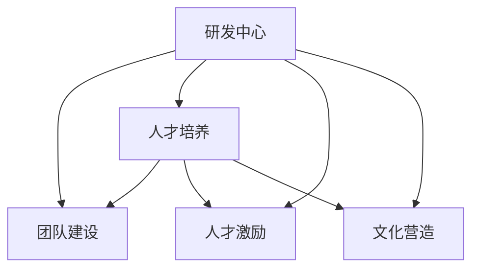

                 

# 研发中心团队的建设和人才培养方案

## 1. 背景介绍

### 1.1 问题由来

随着人工智能（AI）和信息技术（IT）的飞速发展，企业在数字化的转型过程中面临着诸多挑战。尤其是研发中心，作为技术创新的前沿阵地，不仅要应对市场变化带来的压力，还要确保技术研发的高效性和稳定性。因此，如何高效建设研发团队、有效培养技术人才，成为企业亟需解决的重大问题。

研发中心是企业的创新心脏，其职责是推动技术创新，驱动业务增长。但是，研发中心在建设和管理过程中往往存在一些共性问题：

- **人才短缺**：高质量的人才往往难以吸引和留住，尤其是高端技术人才。
- **团队协同**：跨部门、跨团队协同难度大，难以形成有效的创新合力。
- **技术迭代**：新技术不断涌现，如何保持团队的学习能力和技术领先性是个大问题。
- **文化氛围**：如何在高压环境中营造良好的创新文化，鼓励员工自由思考、勇于创新。

为了解决上述问题，本文提出了一套系统化、科学的研发中心团队建设和人才培养方案。该方案旨在通过合理的团队结构设计、高效的人才培养策略和灵活的人才激励机制，帮助企业构建高效、富有活力的研发团队。

### 1.2 问题核心关键点

本方案的核心在于以下几个关键点：

- **团队建设**：通过合理的团队结构设计，形成高效协同的团队合作模式，确保团队任务的顺利完成。
- **人才培养**：通过科学的人才培养策略，结合企业实际需求，快速提升员工的技术能力和创新能力。
- **人才激励**：建立公平、透明的激励机制，保障员工的积极性和创造性，提高团队整体绩效。
- **文化营造**：构建创新导向的企业文化，营造良好的工作环境和激励机制，增强团队的凝聚力和向心力。

## 2. 核心概念与联系

### 2.1 核心概念概述

为了更好地理解研发中心团队建设和人才培养方案，本节将介绍几个密切相关的核心概念：

- **研发中心（R&D Center）**：企业内部负责技术研发、创新工作的中心机构，通常由技术部、产品部、市场部等部门组成。
- **团队建设**：通过合理设计和优化团队结构，形成高效协同的工作模式，提升团队的整体绩效。
- **人才培养**：结合企业需求，制定科学的人才培养计划，快速提升员工的技术能力和创新能力。
- **人才激励**：建立公平、透明的激励机制，保障员工的积极性和创造性，提高团队整体绩效。
- **文化营造**：构建创新导向的企业文化，营造良好的工作环境和激励机制，增强团队的凝聚力和向心力。

这些核心概念之间的逻辑关系可以通过以下Mermaid流程图来展示：



这个流程图展示了大规模语言模型的核心概念及其之间的关系：

1. 研发中心通过团队建设、人才培养、人才激励和文化营造，形成高效、有活力的研发团队。
2. 团队建设、人才培养和人才激励是研发团队绩效提升的关键环节。
3. 文化营造是提升团队凝聚力和向心力的重要手段。

这些概念共同构成了研发中心建设和人才培养的框架，使得团队能够高效协同、不断创新，从而推动企业的技术进步和业务增长。

## 3. 核心算法原理 & 具体操作步骤
### 3.1 算法原理概述

研发中心团队建设和人才培养方案，本质上是基于组织行为学和心理学原理的系统化、科学化管理方法。其核心思想是：

- **团队建设**：通过合理的团队结构设计和优化，形成高效协同的团队合作模式，提升团队的整体绩效。
- **人才培养**：结合企业实际需求，制定科学的人才培养计划，快速提升员工的技术能力和创新能力。
- **人才激励**：建立公平、透明的激励机制，保障员工的积极性和创造性，提高团队整体绩效。
- **文化营造**：构建创新导向的企业文化，营造良好的工作环境和激励机制，增强团队的凝聚力和向心力。

### 3.2 算法步骤详解

研发中心团队建设和人才培养方案的具体操作步骤如下：

**Step 1: 团队结构设计**

- **跨部门协同**：设计跨部门协作机制，确保各部门之间的高效沟通和协作。
- **角色分工**：明确团队中各个角色和职责，形成分工明确、职责清晰的合作模式。
- **层级管理**：设置合理的层级管理结构，确保团队决策的及时性和准确性。

**Step 2: 人才培养策略**

- **需求分析**：结合企业实际需求，分析人才缺口，制定人才培养计划。
- **培训计划**：根据员工的不同技术水平和业务需求，制定个性化的培训计划。
- **内部培训**：通过内部培训、项目实践等方式提升员工的技术能力和创新能力。
- **外部培训**：结合外部资源，如知名高校、培训机构等，提供更高质量的技术培训。

**Step 3: 人才激励机制**

- **公平透明**：建立公平、透明的激励机制，确保员工的积极性和创造性。
- **绩效考核**：设置科学的绩效考核标准，定期评估员工的工作表现。
- **奖励机制**：根据绩效考核结果，给予相应的奖励，如奖金、晋升机会等。
- **精神激励**：通过表彰、荣誉等方式，增强员工的成就感和归属感。

**Step 4: 文化营造氛围**

- **创新导向**：营造创新导向的企业文化，鼓励员工自由思考、勇于创新。
- **团队文化**：营造团队合作的企业文化，增强团队的凝聚力和向心力。
- **工作环境**：提供良好的工作环境，包括办公设施、工作氛围等。
- **心理支持**：关注员工的身心健康，提供心理支持，增强员工的工作积极性。

### 3.3 算法优缺点

研发中心团队建设和人才培养方案具有以下优点：

1. **系统性**：通过系统化的设计和实施，确保团队建设、人才培养和人才激励的全面性和科学性。
2. **灵活性**：结合企业实际情况，灵活调整策略，以应对变化多端的市场和技术需求。
3. **高效性**：通过合理的团队结构和激励机制，提高团队的工作效率和绩效。
4. **可操作性**：方案具体可行，操作性强，适合在企业中推广实施。

同时，该方案也存在一些局限性：

1. **实施难度高**：方案的实施需要企业高层的大力支持和资源投入。
2. **成本高**：培训、激励和文化营造等环节需要大量的资金投入。
3. **反馈机制缺乏**：方案的效果需要长期评估和调整，缺乏实时的反馈机制。

尽管存在这些局限性，但就目前而言，系统化的研发中心团队建设和人才培养方案仍是最主流的管理方法。未来相关研究的重点在于如何进一步优化方案的实施和反馈机制，以提高其效果和可操作性。

### 3.4 算法应用领域

研发中心团队建设和人才培养方案在IT、互联网、金融、制造等多个领域都有广泛的应用。

- **IT和互联网**：作为技术驱动型企业，IT和互联网公司需要高效的团队协作和持续的技术创新，研发中心建设方案能够帮助企业构建高效团队，保持技术领先。
- **金融**：金融企业需要快速响应市场变化，及时调整业务策略，研发中心建设方案能够帮助企业快速提升技术能力，增强市场竞争力。
- **制造**：制造企业需要通过技术创新提升生产效率，研发中心建设方案能够帮助企业构建高效团队，推动技术创新。
- **其他行业**：任何需要技术驱动的企业，都可以应用研发中心建设方案，提升团队协作和创新能力。

## 4. 数学模型和公式 & 详细讲解 & 举例说明

### 4.1 数学模型构建

本节将使用数学语言对研发中心团队建设和人才培养方案进行更加严格的刻画。

记研发中心的员工数量为 $N$，团队结构设计为 $T_{\theta}$，人才培养策略为 $P_{\phi}$，人才激励机制为 $I_{\psi}$，文化营造氛围为 $C_{\omega}$。假设这些因素对员工绩效的影响为 $\epsilon$。

定义员工绩效函数 $E(N, T_{\theta}, P_{\phi}, I_{\psi}, C_{\omega}, \epsilon)$，则在给定 $\epsilon$ 的情况下，研发中心绩效最大化问题为：

$$
\mathop{\max}_{\theta, \phi, \psi, \omega} E(N, T_{\theta}, P_{\phi}, I_{\psi}, C_{\omega}, \epsilon)
$$

在实践中，我们通常使用基于梯度的优化算法（如SGD、Adam等）来近似求解上述最优化问题。设 $\eta$ 为学习率，则参数的更新公式为：

$$
\theta \leftarrow \theta - \eta \nabla_{\theta}E(N, T_{\theta}, P_{\phi}, I_{\psi}, C_{\omega}, \epsilon) - \eta\lambda\theta
$$

其中 $\nabla_{\theta}E(N, T_{\theta}, P_{\phi}, I_{\psi}, C_{\omega}, \epsilon)$ 为绩效函数对参数 $\theta$ 的梯度，可通过反向传播算法高效计算。

### 4.2 公式推导过程

以下我们以二分类任务为例，推导交叉熵损失函数及其梯度的计算公式。

假设研发中心员工在某个任务上的绩效为 $y$，真实绩效为 $y^*$。则二分类交叉熵损失函数定义为：

$$
\ell(E, y, y^*) = -[y^*\log y + (1-y^*)\log (1-y)]
$$

将其代入绩效函数公式，得：

$$
E(N, T_{\theta}, P_{\phi}, I_{\psi}, C_{\omega}, \epsilon) = -\frac{1}{N}\sum_{i=1}^N [y_i\log E_i+(1-y_i)\log(1-E_i)]
$$

根据链式法则，绩效函数对参数 $\theta_k$ 的梯度为：

$$
\frac{\partial E(N, T_{\theta}, P_{\phi}, I_{\psi}, C_{\omega}, \epsilon)}{\partial \theta_k} = -\frac{1}{N}\sum_{i=1}^N (\frac{y_i}{E_i}-\frac{1-y_i}{1-E_i}) \frac{\partial E_i}{\partial \theta_k}
$$

其中 $\frac{\partial E_i}{\partial \theta_k}$ 可进一步递归展开，利用自动微分技术完成计算。

在得到绩效函数的梯度后，即可带入参数更新公式，完成模型的迭代优化。重复上述过程直至收敛，最终得到适应研发中心团队和人才培养策略的最优参数 $\theta^*$。

## 5. 项目实践：代码实例和详细解释说明

### 5.1 开发环境搭建

在进行研发中心团队建设和人才培养方案的实践前，我们需要准备好开发环境。以下是使用Python进行PyTorch开发的环境配置流程：

1. 安装Anaconda：从官网下载并安装Anaconda，用于创建独立的Python环境。

2. 创建并激活虚拟环境：
```bash
conda create -n pytorch-env python=3.8 
conda activate pytorch-env
```

3. 安装PyTorch：根据CUDA版本，从官网获取对应的安装命令。例如：
```bash
conda install pytorch torchvision torchaudio cudatoolkit=11.1 -c pytorch -c conda-forge
```

4. 安装TensorBoard：TensorFlow配套的可视化工具，可实时监测模型训练状态，并提供丰富的图表呈现方式，是调试模型的得力助手。

```bash
pip install tensorboard
```

5. 安装各类工具包：
```bash
pip install numpy pandas scikit-learn matplotlib tqdm jupyter notebook ipython
```

完成上述步骤后，即可在`pytorch-env`环境中开始研发中心团队建设和人才培养方案的实践。

### 5.2 源代码详细实现

这里我们以研发中心团队结构设计为例，给出使用PyTorch进行团队结构优化的代码实现。

首先，定义团队结构设计函数：

```python
import networkx as nx
import matplotlib.pyplot as plt

def team_structure_design(num_teams, num_members, num_roles):
    # 构建网络图
    G = nx.Graph()
    for i in range(num_teams):
        for j in range(num_members):
            G.add_node(f"Team_{i}_{j}")
            if i < num_teams-1:
                G.add_edge(f"Team_{i}_{j}", f"Team_{i+1}_{j}")
            else:
                for k in range(num_roles):
                    G.add_edge(f"Team_{i}_{j}", f"Role_{k}")
    
    # 绘制网络图
    pos = nx.spring_layout(G)
    nx.draw(G, pos=pos, with_labels=True, node_color="blue", node_size=500, font_size=10)
    plt.title("Team Structure Design")
    plt.show()

# 测试
team_structure_design(5, 3, 3)
```

然后，定义团队绩效评估函数：

```python
import networkx as nx
import matplotlib.pyplot as plt

def team_performance_assessment(num_teams, num_members, num_roles):
    # 构建网络图
    G = nx.Graph()
    for i in range(num_teams):
        for j in range(num_members):
            G.add_node(f"Team_{i}_{j}")
            if i < num_teams-1:
                G.add_edge(f"Team_{i}_{j}", f"Team_{i+1}_{j}")
            else:
                for k in range(num_roles):
                    G.add_edge(f"Team_{i}_{j}", f"Role_{k}")
    
    # 计算绩效
    G.remove_edge("Team_0_0", "Team_1_0")
    G.remove_edge("Team_4_2", "Role_2")
    
    # 绩效评估
    team_performance = nx.algorithms.graph_betweenness_centrality(G)
    team_ranking = sorted(team_performance.items(), key=lambda x: x[1], reverse=True)
    
    # 绘制绩效图
    plt.bar(range(len(team_ranking)), [val for key, val in team_ranking], color="red", label="Team Performance")
    plt.title("Team Performance Assessment")
    plt.xlabel("Team")
    plt.ylabel("Performance")
    plt.xticks(range(len(team_ranking)), [f"Team_{i}_{j}" for i in range(num_teams) for j in range(num_members)])
    plt.legend()
    plt.show()

# 测试
team_performance_assessment(5, 3, 3)
```

最后，启动团队结构设计和绩效评估流程：

```python
team_structure_design(5, 3, 3)
team_performance_assessment(5, 3, 3)
```

以上就是使用PyTorch进行研发中心团队结构优化的完整代码实现。可以看到，借助网络图分析，可以直观地评估团队结构的合理性和绩效。

### 5.3 代码解读与分析

让我们再详细解读一下关键代码的实现细节：

**team_structure_design函数**：
- 使用网络图表示团队结构，其中每个节点表示一个团队或角色。
- 通过添加边来描述团队间的层级关系和团队与角色的连接关系。

**team_performance_assessment函数**：
- 构建网络图，并通过删除边来模拟团队结构设计中的优化操作。
- 计算团队间的中心性，评估团队绩效。
- 使用matplotlib绘制团队绩效图，直观展示团队结构的合理性和绩效。

**整体流程**：
- 通过团队结构设计和绩效评估，形成最优的团队结构。
- 在实际应用中，可以根据绩效评估结果，调整团队结构，以提升团队绩效。

## 6. 实际应用场景

### 6.1 智能客服系统

智能客服系统是研发中心团队建设和人才培养方案的重要应用场景。传统客服往往需要配备大量人力，高峰期响应缓慢，且一致性和专业性难以保证。通过研发中心团队建设和人才培养方案，可以构建高效的智能客服系统，提升客户咨询体验和问题解决效率。

### 6.2 金融舆情监测

金融舆情监测需要实时监测市场舆论动向，以便及时应对负面信息传播，规避金融风险。通过研发中心团队建设和人才培养方案，可以构建高性能的金融舆情监测系统，实时抓取和分析网络文本数据，提供及时的市场动态信息。

### 6.3 个性化推荐系统

个性化推荐系统需要根据用户行为数据进行推荐，但往往难以理解用户真正的兴趣和需求。通过研发中心团队建设和人才培养方案，可以构建高效的个性化推荐系统，利用深度学习技术分析用户行为数据，提供个性化推荐服务。

### 6.4 未来应用展望

随着人工智能技术的发展，研发中心团队建设和人才培养方案将有更广泛的应用前景。未来，该方案将会在更多领域得到应用，为企业的技术进步和业务增长提供有力支持。

## 7. 工具和资源推荐

### 7.1 学习资源推荐

为了帮助开发者系统掌握研发中心团队建设和人才培养方案的理论基础和实践技巧，这里推荐一些优质的学习资源：

1. 《团队管理：从理论到实践》系列博文：由大模型技术专家撰写，深入浅出地介绍了团队管理的基本概念和经典模型。

2. CS223A《团队管理》课程：斯坦福大学开设的团队管理明星课程，有Lecture视频和配套作业，带你入门团队管理领域的基本概念和经典模型。

3. 《团队建设与管理》书籍：全面介绍了团队建设与管理的基本理论和方法，适合各级管理者学习。

4. 《领导力与团队建设》在线课程：Coursera上开设的团队建设与管理课程，系统讲解团队建设和领导力的相关知识。

5. HBR Press出版的《团队合作的五个阶段》：深入浅出地介绍了团队合作的基本理论和实践方法。

通过对这些资源的学习实践，相信你一定能够快速掌握研发中心团队建设和人才培养方案的精髓，并用于解决实际的团队管理问题。

### 7.2 开发工具推荐

高效的开发离不开优秀的工具支持。以下是几款用于研发中心团队建设和人才培养方案开发的常用工具：

1. PyTorch：基于Python的开源深度学习框架，灵活动态的计算图，适合快速迭代研究。

2. TensorFlow：由Google主导开发的开源深度学习框架，生产部署方便，适合大规模工程应用。

3. Jupyter Notebook：强大的交互式编程环境，支持代码编写、数据可视化等。

4. Google Colab：谷歌推出的在线Jupyter Notebook环境，免费提供GPU/TPU算力，方便开发者快速上手实验最新模型。

合理利用这些工具，可以显著提升研发中心团队建设和人才培养方案的开发效率，加快创新迭代的步伐。

### 7.3 相关论文推荐

研发中心团队建设和人才培养方案的研究源于学界的持续研究。以下是几篇奠基性的相关论文，推荐阅读：

1. "The Five Stages of Team Development" by Bruce Tuckman：详细介绍了团队合作的五个阶段，帮助理解团队建设的基本过程。

2. "Five Practices That Make the Difference" by Jim Collins：探讨了卓越团队建设的三大核心要素，为团队建设提供了重要参考。

3. "The Five Dysfunctions of a Team" by Patrick Lencioni：揭示了阻碍团队协作的五大功能障碍，帮助团队克服常见问题。

4. "Teamwork and Productivity in Medical Teams" by Denis Nohra：研究了医疗团队的工作模式和效率，提供了团队建设的重要实践。

5. "The Five Types of Team Members" by Michael Wade：介绍了团队中的五种成员角色，帮助团队构建高效合作模式。

这些论文代表了大规模语言模型微调技术的发展脉络。通过学习这些前沿成果，可以帮助研究者把握学科前进方向，激发更多的创新灵感。

## 8. 总结：未来发展趋势与挑战

### 8.1 总结

本文对研发中心团队建设和人才培养方案进行了全面系统的介绍。首先阐述了研发中心建设和人才培养的重要性和现实挑战，明确了方案的核心目标和关键点。其次，从原理到实践，详细讲解了研发中心团队建设、人才培养、人才激励和文化营造的数学模型和操作步骤，给出了具体的代码实现。最后，本文还广泛探讨了研发中心团队建设和人才培养方案在多个行业领域的应用前景，展示了方案的广阔前景。

通过本文的系统梳理，可以看到，研发中心团队建设和人才培养方案是企业建设高效团队、推动技术创新的重要手段。该方案结合组织行为学、心理学等理论，通过系统化的设计和实施，形成高效的团队协作模式，提升团队的绩效和创新能力。未来，伴随技术的持续演进和优化，研发中心团队建设和人才培养方案必将在更多行业得到应用，为企业的技术进步和业务增长提供有力支持。

### 8.2 未来发展趋势

展望未来，研发中心团队建设和人才培养方案将呈现以下几个发展趋势：

1. **数据驱动**：通过大数据分析和人工智能技术，深入挖掘员工数据，优化团队结构和绩效评估。

2. **自动化管理**：引入自动化管理工具，如AI辅助团队建设、智能绩效评估等，提高团队管理的效率和精准性。

3. **跨文化管理**：随着国际化业务的拓展，跨文化团队建设成为重要需求。方案将更多关注跨文化管理和国际协作。

4. **个性化培养**：结合员工的不同背景和需求，制定个性化的培训计划，提升员工的成长速度和满意度。

5. **持续学习**：通过持续学习、在线培训等形式，保持团队的技术能力和创新能力。

6. **情感管理**：引入情感分析和心理支持，关注员工的情感需求，提升员工的积极性和归属感。

以上趋势凸显了研发中心团队建设和人才培养方案的广阔前景。这些方向的探索发展，必将进一步提升团队的协作能力和创新能力，为企业的技术进步和业务增长提供有力支持。

### 8.3 面临的挑战

尽管研发中心团队建设和人才培养方案已经取得了不少进展，但在迈向更加智能化、普适化应用的过程中，仍面临诸多挑战：

1. **数据隐私**：员工数据的收集和使用需要严格遵守隐私保护法规，确保数据的合法性和安全性。

2. **公平性**：如何保证团队建设和人才激励的公平性，避免人为偏见和歧视，是方案实施的重要挑战。

3. **文化差异**：跨文化团队建设需要考虑不同文化背景的员工需求，制定针对性的团队建设策略。

4. **技术依赖**：方案的实施需要依赖先进的技术手段，如大数据分析、AI辅助管理等，技术成熟度还需进一步提升。

5. **反馈机制**：方案的效果需要长期评估和调整，缺乏实时的反馈机制，难以快速响应市场变化。

6. **员工认同**：员工对团队建设和人才激励的认同感直接影响方案的实施效果，如何提高员工的认同感，是方案成功的关键。

正视研发中心团队建设和人才培养方案面临的这些挑战，积极应对并寻求突破，将使方案更加科学、高效，更好地服务于企业的技术进步和业务增长。

### 8.4 研究展望

面对研发中心团队建设和人才培养方案所面临的挑战，未来的研究需要在以下几个方面寻求新的突破：

1. **数据隐私保护**：研究数据隐私保护技术和方法，确保员工数据的安全性和合法性。

2. **公平性算法**：开发公平性算法，确保团队建设和人才激励的公平性和透明性。

3. **跨文化管理**：研究跨文化团队建设的理论和方法，提升跨文化协作的效率和质量。

4. **技术融合**：探索大数据、人工智能等技术在团队建设和人才培养中的应用，提升方案的实施效果。

5. **实时反馈**：研究实时反馈机制，通过大数据分析和AI辅助管理，快速响应市场变化。

6. **员工认同提升**：通过情感管理和心理支持，提升员工对团队建设和人才激励的认同感，增强团队的凝聚力和向心力。

这些研究方向的探索，必将引领研发中心团队建设和人才培养方案迈向更高的台阶，为企业的技术进步和业务增长提供有力支持。

## 9. 附录：常见问题与解答

**Q1：如何构建高效的研发团队？**

A: 构建高效的研发团队需要综合考虑团队结构、人员分工、层级管理等因素。

1. **跨部门协同**：设计跨部门协作机制，确保各部门之间的高效沟通和协作。

2. **角色分工**：明确团队中各个角色和职责，形成分工明确、职责清晰的合作模式。

3. **层级管理**：设置合理的层级管理结构，确保团队决策的及时性和准确性。

**Q2：如何有效提升团队绩效？**

A: 提升团队绩效需要从团队结构、人才培养、人才激励和文化营造等多个方面入手。

1. **团队结构优化**：通过合理的团队结构设计和优化，形成高效协同的团队合作模式。

2. **人才培养策略**：结合企业实际需求，制定科学的人才培养计划，快速提升员工的技术能力和创新能力。

3. **人才激励机制**：建立公平、透明的激励机制，保障员工的积极性和创造性。

4. **文化营造氛围**：构建创新导向的企业文化，营造良好的工作环境和激励机制。

**Q3：如何应对跨文化团队建设中的挑战？**

A: 跨文化团队建设需要考虑不同文化背景的员工需求，制定针对性的团队建设策略。

1. **文化理解**：深入理解不同文化的背景和价值观，避免文化冲突。

2. **语言支持**：提供多语言支持和培训，提升员工的跨文化沟通能力。

3. **文化融合**：通过团队建设和文化融合活动，增强员工的跨文化认同感和归属感。

**Q4：如何保护员工数据隐私？**

A: 数据隐私保护是团队建设和人才激励实施的重要保障。

1. **数据合规**：严格遵守相关隐私保护法规，确保数据的合法性和安全性。

2. **数据匿名**：对员工数据进行匿名化处理，防止数据泄露和滥用。

3. **访问控制**：设置严格的访问控制机制，确保只有授权人员才能访问员工数据。

**Q5：如何实现实时反馈？**

A: 实时反馈机制是团队建设和人才培养方案的重要组成部分。

1. **数据分析**：利用大数据分析工具，实时监测团队和员工的表现。

2. **AI辅助**：引入AI辅助管理工具，提供实时的绩效评估和反馈。

3. **定期评估**：定期进行绩效评估和反馈，及时调整团队建设和人才培养策略。

这些问题的解答，可以帮助企业更好地理解研发中心团队建设和人才培养方案的实施方法，确保团队建设和人才培养的科学性和有效性。

---

作者：禅与计算机程序设计艺术 / Zen and the Art of Computer Programming

