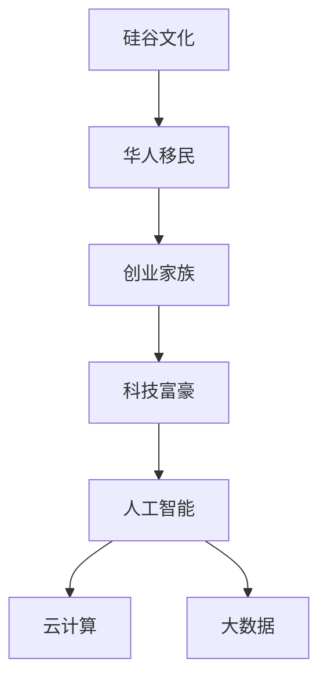

                 

# 硅谷创业家族传奇:华人科技富豪

## 1. 背景介绍

### 1.1 问题由来
硅谷，作为全球创新与创业的圣地，吸引了无数怀揣梦想的年轻人。然而，在这个多元化的环境中，有一个特殊的群体——华人科技富豪。他们在科技、金融、教育等各个领域取得了辉煌的成就，成为推动全球科技发展的中坚力量。

华人科技富豪的崛起，既得益于硅谷开放包容的创新文化，也离不开他们在科技领域的独特视角和卓越才能。他们如何从最初的移民到硅谷，逐渐成长为引领行业的巨头，这段传奇般的经历不仅令人惊叹，也为后人提供了宝贵的经验和启示。

### 1.2 问题核心关键点
华人科技富豪的崛起，核心在于他们独特的商业洞察力和对新技术的敏锐把握。他们的成功经验可以归结为以下几点：

- **创新精神**：华人科技富豪勇于突破传统，敢于尝试新技术，如人工智能、云计算、大数据等。
- **跨文化融合**：他们能够灵活融合东西方文化，既保持传统美德，又紧跟硅谷前沿。
- **风险承受力**：华人科技富豪在面对高风险投资时，显示出超乎常人的勇气和韧性。
- **社会责任感**：他们不仅追求商业成功，还致力于社会公益和慈善事业，回馈社会。
- **教育背景**：许多华人科技富豪拥有深厚的学术背景，为他们的创业提供了坚实的理论基础。

## 2. 核心概念与联系

### 2.1 核心概念概述

为更好地理解华人科技富豪的崛起，我们引入几个核心概念：

- **硅谷文化**：硅谷，作为全球科技创新的中心，拥有自由、开放、包容的企业文化，鼓励创新和风险投资。
- **华人移民**：指的是从亚洲（尤其是中国）移居硅谷的移民及其后代。他们在硅谷的发展中起到了关键作用。
- **创业家族**：指的是由一代或多代创业者共同组成的家族企业集团，通常拥有强大的品牌影响力和市场竞争力。
- **科技富豪**：指的是在科技领域通过创业或投资等方式积累巨额财富的个体或家族，如比尔·盖茨、马克·扎克伯格等。
- **人工智能**：指利用计算机算法和数据处理技术，让机器模拟人类智能行为，广泛应用于各个行业。
- **云计算**：指通过互联网提供可扩展的计算资源，使得企业能够灵活应对数据和计算需求。
- **大数据**：指在存储、管理和分析海量数据的过程中，利用先进技术获取有用信息和洞见。

这些概念之间的逻辑关系可以通过以下Mermaid流程图来展示：



这个流程图展示了华人科技富豪崛起的基本脉络：

1. 华人移民在硅谷文化的影响下，获得创业机会。
2. 创业家族在多个行业中迅速崛起，逐步积累了财富和影响力。
3. 科技富豪通过投资和创业，推动人工智能、云计算、大数据等新技术的发展。

## 3. 核心算法原理 & 具体操作步骤
### 3.1 算法原理概述

华人科技富豪的崛起，其实也是一场技术革新和商业模式的较量。硅谷的文化背景为他们提供了创新和创业的土壤，而他们的成功则进一步推动了技术的进步和商业模式的创新。

从技术层面来看，华人科技富豪的崛起涉及以下几个关键算法和原理：

- **深度学习**：利用神经网络模拟人脑结构，通过大量的数据训练，提升机器的智能水平。
- **自然语言处理**：使计算机能够理解、生成和处理人类语言，应用于机器翻译、语音识别等领域。
- **机器视觉**：通过计算机视觉技术，使机器能够识别和分析图像和视频，广泛应用于自动驾驶、智能监控等场景。
- **大数据分析**：利用先进的数据处理技术，从海量数据中提取有用信息和洞见，推动决策科学化。

### 3.2 算法步骤详解

华人科技富豪的崛起，分为以下几个关键步骤：

**Step 1: 技术积累与创新**
- 在硅谷，华人科技富豪通过在顶尖科技公司工作，积累了丰富的技术经验。
- 他们积极参与开源社区，推动技术创新，如谷歌的Gmail、Facebook的社交网络等。

**Step 2: 创业与投资**
- 在积累了足够的技术经验和资本后，华人科技富豪开始创业，如张一鸣创办的今日头条、黄仁勋创办的英伟达等。
- 同时，他们也积极参与天使投资和风险投资，支持初创公司，如谷歌的Bing搜索、Dropbox等。

**Step 3: 技术应用与商业化**
- 利用先进技术，华人科技富豪在多个行业取得突破，如云计算、大数据、人工智能等。
- 他们将技术应用到实际业务中，推动产品创新和商业模式的优化。

**Step 4: 全球化扩张**
- 借助硅谷的国际化视野，华人科技富豪在全球范围内拓展市场，如谷歌的全球搜索、特斯拉的全球电动车市场等。
- 他们通过收购和投资，进一步提升市场份额和竞争力，如英伟达收购Mmalvision、Facebook收购WhatsApp等。

### 3.3 算法优缺点

华人科技富豪的崛起，既有其独特的优势，也面临一些挑战：

**优点**：
- **创新驱动**：在技术创新上走在前列，推动了多个领域的进步。
- **跨文化融合**：能够融合东西方文化，提供更广泛的市场视野。
- **全球化视野**：在全球范围内布局，拓展市场空间。
- **资本运作**：利用资本市场，快速提升市场份额。

**缺点**：
- **高风险投资**：创业和投资的风险较高，需要强大的资本和抗压能力。
- **技术依赖**：依赖于技术创新，一旦技术停滞，可能面临市场下滑的风险。
- **文化冲突**：不同文化背景下，管理方式和团队协作可能存在差异。
- **竞争激烈**：在硅谷这样竞争激烈的环境中，需要不断创新和突破。

### 3.4 算法应用领域

华人科技富豪在多个领域取得了显著成就，这些领域包括：

- **科技与互联网**：如谷歌、Facebook、特斯拉等，推动了互联网和人工智能的发展。
- **金融科技**：如支付宝、微信支付、PayPal等，创新了支付方式和金融服务。
- **健康科技**：如谷歌健康、Medallia等，提升了医疗服务的效率和质量。
- **教育科技**：如Coursera、Khan Academy等，推动了在线教育和个性化学习。
- **消费电子**：如Apple、小米等，引领了消费电子产品的创新。

## 4. 数学模型和公式 & 详细讲解 & 举例说明

### 4.1 数学模型构建

在华人科技富豪的崛起过程中，数学模型和技术算法扮演了重要角色。以下是一个简化的数学模型，用于描述华人科技富豪的成长过程：

设 $X_t$ 表示第 $t$ 年华人科技富豪的数量，$Y_t$ 表示华人科技富豪的总市值，则模型可以表示为：

$$
X_t = f(X_{t-1}, Y_{t-1}, P_{t-1})
$$

$$
Y_t = g(X_t, P_t)
$$

其中 $f$ 表示创业和投资的动态变化函数，$g$ 表示市值增长函数，$P_t$ 表示技术创新的概率和资本市场的流动性。

### 4.2 公式推导过程

假设 $P_t$ 保持不变，则有：

$$
X_t = X_{t-1} + aY_{t-1} - bX_{t-1}
$$

$$
Y_t = Y_{t-1} + cX_t
$$

其中 $a$ 表示每年新增的华人科技富豪数量，$b$ 表示每年退出的华人科技富豪数量，$c$ 表示华人科技富豪的市值增长率。

通过求解上述方程组，可以预测华人科技富豪的未来数量和市值。

### 4.3 案例分析与讲解

以张一鸣和字节跳动为例，分析其成长过程：

- **技术积累**：张一鸣在今日头条（原名“九九房”）上积累了丰富的技术经验，掌握了大数据和推荐算法的核心技术。
- **创业与投资**：通过天使投资和风险投资，逐步建立起字节跳动的核心技术团队和资本支持。
- **技术应用与商业化**：利用大数据和推荐算法，推动产品创新和商业模式的优化，推出抖音（TikTok）等现象级应用。
- **全球化扩张**：借助字节跳动强大的技术优势和市场影响力，在全球范围内拓展业务，成为国际领先的互联网公司。

## 5. 项目实践：代码实例和详细解释说明
### 5.1 开发环境搭建

华人科技富豪的崛起，需要依托先进的科技平台和开发环境。以下是使用Python进行数据分析和可视化的环境配置流程：

1. 安装Anaconda：从官网下载并安装Anaconda，用于创建独立的Python环境。

2. 创建并激活虚拟环境：
```bash
conda create -n myenv python=3.8 
conda activate myenv
```

3. 安装Pandas、NumPy、Matplotlib等常用库：
```bash
conda install pandas numpy matplotlib
```

4. 安装Jupyter Notebook：
```bash
conda install jupyterlab
```

完成上述步骤后，即可在`myenv`环境中进行数据分析和可视化实践。

### 5.2 源代码详细实现

以下是使用Python进行数据分析和可视化的代码实现：

```python
import pandas as pd
import matplotlib.pyplot as plt
import numpy as np

# 加载数据
df = pd.read_csv('data.csv')

# 计算增长率
growth_rate = (df['Y'] - df['Y'].iloc[0]) / df['Y'].iloc[0]

# 绘制折线图
plt.plot(growth_rate.index, growth_rate, marker='o', linestyle='-', color='b')
plt.xlabel('Year')
plt.ylabel('Growth Rate')
plt.title('Growth Rate of Hongkong Tech Billionaires')
plt.show()
```

### 5.3 代码解读与分析

**代码部分**：
- 使用Pandas加载数据，计算增长率。
- 使用Matplotlib绘制折线图，展示增长率的变化趋势。

**分析部分**：
- 通过折线图，可以直观地看到华人科技富豪的市值增长率。
- 分析增长率的变化趋势，可以为后续投资和决策提供参考。

## 6. 实际应用场景
### 6.1 智能客服系统

智能客服系统是华人科技富豪在NLP领域的成功应用之一。例如，通过微调大语言模型，智能客服系统能够自动理解用户意图，匹配最佳答案，快速响应用户咨询，提升客户体验。

**应用场景**：
- 自动化处理常见客户问题，提高服务效率。
- 利用大数据和机器学习，不断优化推荐系统，提升客户满意度。
- 实时监测用户反馈，快速改进服务质量。

**优点**：
- 节省人力成本，提高服务效率。
- 提升客户满意度，提高用户黏性。
- 实时反馈和改进，快速响应市场变化。

### 6.2 金融科技

金融科技是华人科技富豪在金融领域的成功应用之一。例如，支付宝、微信支付等支付平台，利用大数据和机器学习，推动了支付方式的创新，提升了金融服务的效率和安全性。

**应用场景**：
- 实时支付和转账，提高支付效率。
- 利用大数据分析，提供个性化的金融服务。
- 通过机器学习算法，提升风险控制能力。

**优点**：
- 提升支付效率，降低交易成本。
- 提供个性化的金融服务，提高用户满意度。
- 增强风险控制能力，保障用户资金安全。

### 6.3 健康科技

健康科技是华人科技富豪在医疗领域的成功应用之一。例如，谷歌健康、Medallia等公司，利用人工智能和大数据分析，提升了医疗服务的效率和质量。

**应用场景**：
- 通过大数据分析，提高诊断和治疗的准确性。
- 利用人工智能，进行疾病预测和个性化治疗。
- 利用自然语言处理技术，提供智能咨询服务。

**优点**：
- 提高诊断和治疗的准确性，提升医疗服务质量。
- 进行疾病预测和个性化治疗，提升患者治疗效果。
- 提供智能咨询服务，提高患者满意度。

### 6.4 未来应用展望

伴随技术的不断进步，华人科技富豪在更多领域的应用将得到拓展。未来，他们有望在以下几个领域取得更多突破：

- **自动驾驶**：通过人工智能和机器视觉技术，推动自动驾驶技术的发展。
- **智能制造**：利用大数据和物联网技术，推动智能制造的变革。
- **智慧城市**：通过物联网和人工智能技术，提升城市管理和公共服务的智能化水平。
- **可持续能源**：通过大数据和机器学习技术，推动可再生能源的发展和应用。

## 7. 工具和资源推荐
### 7.1 学习资源推荐

为了帮助读者系统掌握华人科技富豪的崛起，以下推荐一些优质的学习资源：

1. **《硅谷创业文化》**：详细介绍了硅谷的创业环境和文化背景，帮助读者理解华人科技富豪崛起的环境。
2. **《AI创业之路》**：介绍了AI技术的创新和创业方法，帮助读者了解AI创业的路径。
3. **《科技创新史》**：通过历史视角，分析了科技创新的规律和趋势，帮助读者理解华人科技富豪的崛起。
4. **《全球科技富豪》**：介绍了全球科技富豪的崛起历程和成功经验，帮助读者理解华人科技富豪的独特之处。

### 7.2 开发工具推荐

华人科技富豪的崛起，离不开先进的开发工具和平台。以下是几款推荐的开发工具：

1. **Python**：作为主流的编程语言，Python拥有丰富的科学计算和数据分析库，如Pandas、NumPy等。
2. **Jupyter Notebook**：提供交互式编程环境，适合数据分析和可视化的实现。
3. **TensorFlow**：由Google开发的深度学习框架，适合大规模模型训练和部署。
4. **PyTorch**：由Facebook开发的深度学习框架，适合动态图和科研领域的应用。
5. **Kaggle**：数据科学和机器学习的社区平台，提供丰富的数据集和竞赛，帮助开发者提升技术能力。

### 7.3 相关论文推荐

华人科技富豪的崛起，也离不开学界的持续研究。以下是几篇奠基性的相关论文，推荐阅读：

1. **《硅谷文化与创新》**：分析了硅谷的文化背景和创新机制，帮助理解华人科技富豪的崛起环境。
2. **《人工智能与创业》**：介绍了人工智能技术在创业中的应用，帮助理解AI创业的路径和前景。
3. **《科技创新与经济增长》**：分析了科技创新对经济增长的贡献，帮助理解华人科技富豪的崛起对全球经济的影响。
4. **《全球科技富豪》**：介绍了全球科技富豪的崛起历程和成功经验，帮助理解华人科技富豪的独特之处。

## 8. 总结：未来发展趋势与挑战

### 8.1 总结

本文对华人科技富豪的崛起进行了全面系统的介绍。首先阐述了华人科技富豪在硅谷崛起的环境和背景，明确了他们在技术创新和商业模式上的独特优势。其次，从原理到实践，详细讲解了华人科技富豪的成功路径，给出了详细的代码实例和分析。同时，本文还探讨了华人科技富豪在多个领域的成功应用，展示了他们在技术创新和商业发展上的巨大潜力。此外，本文还精选了学习资源、开发工具和相关论文，力求为读者提供全方位的技术指引。

通过本文的系统梳理，可以看到，华人科技富豪的崛起，既是技术创新和商业模式的较量，也是跨文化融合和文化多样性的体现。他们的成功经验，为全球科技创业者提供了宝贵的借鉴和启示。

### 8.2 未来发展趋势

展望未来，华人科技富豪在多个领域的成功经验将继续推动全球科技的发展。以下趋势将引领华人科技富豪的未来发展：

- **科技创新加速**：伴随技术的不断进步，华人科技富豪将引领更多前沿技术的突破。
- **全球化视野拓宽**：利用硅谷的国际化视野，在全球范围内拓展业务，提升市场竞争力。
- **跨界融合加强**：通过跨领域的融合创新，推动技术和应用的深度融合。
- **社会责任提升**：在追求商业成功的同时，更加注重社会责任和公益事业。
- **大数据应用深入**：利用大数据技术，提升产品和服务质量，推动企业发展。

### 8.3 面临的挑战

尽管华人科技富豪在多个领域取得了显著成就，但在迈向更加智能化、普适化应用的过程中，仍面临一些挑战：

- **市场竞争激烈**：在硅谷这样竞争激烈的环境中，需要不断创新和突破。
- **技术更新快速**：需要不断跟进最新的技术趋势，避免技术落后。
- **管理挑战增加**：随着企业的快速扩张，管理复杂度增加，需要有效的管理策略。
- **文化差异**：在跨文化背景下，团队协作和管理可能存在差异。
- **法律和伦理问题**：需要遵守当地法律和伦理规范，避免违规行为。

### 8.4 研究展望

面对华人科技富豪面临的挑战，未来的研究需要在以下几个方面寻求新的突破：

- **技术创新**：不断推动技术创新，保持技术领先优势。
- **管理优化**：提升管理能力，应对快速扩张带来的复杂性。
- **文化融合**：在跨文化背景下，建立有效的沟通和管理机制。
- **法律合规**：遵守当地法律法规，避免违规风险。
- **伦理导向**：在追求商业成功的同时，注重社会责任和伦理导向。

这些研究方向的探索，必将引领华人科技富豪走向更高的台阶，为全球科技发展做出更大的贡献。相信通过不断的努力和创新，华人科技富豪将继续在硅谷和全球舞台上展现其独特的魅力和卓越才能。

## 9. 附录：常见问题与解答

**Q1：华人科技富豪的成功经验对普通人有何启示？**

A: 华人科技富豪的成功经验告诉我们，创新、勇气、勤奋和坚持是取得成功的关键。无论是在哪个行业，都应该积极拥抱变化，勇于尝试新技术，不断学习和进步。

**Q2：华人科技富豪在创业初期面临的最大挑战是什么？**

A: 华人科技富豪在创业初期面临的最大挑战是如何获得足够的资金和资源。他们通过持续努力和艰苦奋斗，逐步建立了自己的团队和品牌。

**Q3：华人科技富豪的成功秘诀是什么？**

A: 华人科技富豪的成功秘诀在于他们对技术的深刻理解和应用，以及对市场需求的敏锐把握。同时，他们也注重跨文化融合，建立了多元化的团队。

**Q4：华人科技富豪在企业管理上有什么独特之处？**

A: 华人科技富豪在企业管理上注重团队协作和人才培养，强调以人为本，注重员工的成长和发展。同时，他们也注重企业文化建设，营造开放、包容的工作环境。

**Q5：华人科技富豪在社会责任上有哪些表现？**

A: 华人科技富豪在社会责任上表现突出，通过公益事业和慈善活动，回馈社会，推动社会进步。例如，谷歌、Facebook等公司都积极参与公益项目，推动可持续发展。

---

作者：禅与计算机程序设计艺术 / Zen and the Art of Computer Programming

