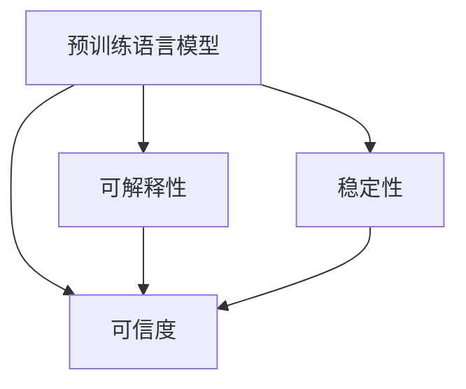

                 

# 确保 AI 技术在电商搜索导购中的应用可解释性：技术透明与可信度

> 关键词：可解释性, 电商搜索导购, 技术透明, 可信度

## 1. 背景介绍

### 1.1 问题由来

电商搜索导购系统作为消费者与电商平台之间的桥梁，其核心任务是通过自然语言查询理解用户意图，并返回与用户意图匹配的商品信息。随着深度学习和大数据技术的进步，电商搜索导购系统逐渐从基于规则和模板的简单匹配，向基于深度学习模型的复杂语义理解演进。其中，预训练语言模型（如BERT、GPT等）凭借其在处理自然语言理解任务上的卓越表现，逐渐成为电商搜索导购系统的核心技术。

然而，尽管预训练语言模型在实际应用中取得了显著效果，但同时也存在诸多问题。一方面，由于深度学习模型的"黑盒"特性，电商搜索导购系统的决策过程难以解释，导致用户和商家对系统缺乏信任。另一方面，深度学习模型在部署和运行过程中可能出现诸多问题，如性能不稳定、推理速度慢等，进一步削弱了系统的可信度。

为解决这些问题，确保电商搜索导购系统的技术透明和可信度，本文将系统地介绍如何通过提升模型的可解释性和稳定性，增强用户和商家对系统的信任。

### 1.2 问题核心关键点

当前电商搜索导购系统的技术透明和可信度主要受以下几个关键因素影响：

- 模型可解释性：用户和商家需要了解电商搜索导购系统是如何理解自然语言查询，并返回相关商品信息。
- 模型稳定性：电商搜索导购系统需要保证在处理大量查询请求时，始终保持高性能和稳定性。
- 用户和商家信任：用户和商家对电商搜索导购系统的信任直接影响其使用意愿和推荐效果。

为了解决这些问题，本文将系统地介绍提升电商搜索导购系统可解释性和稳定性的关键技术和实践方法，并通过实例展示其应用效果。

### 1.3 问题研究意义

提升电商搜索导购系统的可解释性和稳定性，对电商平台的业务发展和用户体验具有重要意义：

1. 增强用户信任：通过提高模型的可解释性和透明性，用户能够更好地理解系统行为，增加对系统的信任。
2. 提高推荐效果：稳定可靠的系统能够提供更准确、更及时的推荐结果，提升用户体验和平台收益。
3. 优化运营效率：稳定的模型可以减少系统故障，降低人工维护成本，提高电商平台的运营效率。
4. 助力合规审计：透明可解释的系统便于监管机构进行合规审计，避免潜在风险。

## 2. 核心概念与联系

### 2.1 核心概念概述

为更好地理解如何通过提升模型的可解释性和稳定性，增强电商搜索导购系统的技术透明和可信度，本节将介绍几个密切相关的核心概念：

- 预训练语言模型(Pre-trained Language Model, PLM)：如BERT、GPT等，通过在大规模无标签文本语料上进行预训练，学习通用的语言表示。
- 可解释性(Explainability)：指模型输出的结果能够通过一定的解释方法，清晰地解释其内部的决策过程和特征重要性。
- 稳定性(Stability)：指模型在处理不同输入数据时，输出结果的一致性和可靠性。
- 可信度(Trustworthiness)：指用户和商家对系统的信任程度，与系统的可解释性和稳定性密切相关。
- 自然语言处理(Natural Language Processing, NLP)：涉及自然语言理解、生成、分类等任务的综合性学科，是电商搜索导购系统的技术基础。
- 电商搜索导购系统(E-commerce Search & Recommendation System)：电商平台的核心系统，通过自然语言查询理解用户意图，并提供相关商品推荐。

这些核心概念之间的逻辑关系可以通过以下Mermaid流程图来展示：



这个流程图展示了大语言模型和电商搜索导购系统的核心概念及其之间的关系：

1. 预训练语言模型通过在大规模无标签文本语料上进行预训练，学习通用的语言表示。
2. 可解释性指的是模型输出的结果能够通过一定的解释方法，清晰地解释其内部的决策过程和特征重要性。
3. 稳定性指模型在处理不同输入数据时，输出结果的一致性和可靠性。
4. 可信度与系统的可解释性和稳定性密切相关，用户和商家对系统的信任直接影响其使用意愿和推荐效果。
5. 自然语言处理是电商搜索导购系统的技术基础，涉及自然语言理解、生成、分类等任务。
6. 电商搜索导购系统通过自然语言查询理解用户意图，并提供相关商品推荐。

## 3. 核心算法原理 & 具体操作步骤
### 3.1 算法原理概述

提升电商搜索导购系统的可解释性和稳定性，主要涉及以下几个关键技术：

- 可解释性提升技术：通过引入可解释性方法，清晰地解释模型的决策过程和特征重要性，增强用户和商家对系统的信任。
- 稳定性优化技术：通过优化模型结构和训练流程，提高模型的鲁棒性和泛化能力，确保系统在处理大量查询请求时保持高性能和稳定性。
- 可信度增强技术：通过用户反馈、模型更新等方法，不断优化和完善系统，增强用户和商家对系统的信任。

### 3.2 算法步骤详解

以下是提升电商搜索导购系统可解释性和稳定性的具体操作步骤：

**Step 1: 数据预处理与模型选择**

1. 收集电商平台的查询请求和用户行为数据，并进行清洗和标注。
2. 选择合适的预训练语言模型，如BERT、GPT等，作为电商搜索导购系统的核心组件。

**Step 2: 模型可解释性提升**

1. 使用可解释性方法，如LIME、SHAP等，对模型进行可视化解释，清晰地展示模型的决策过程和特征重要性。
2. 通过可视化报告和用户界面，向用户和商家展示模型解释结果，增强其对系统的信任。
3. 使用对抗样本生成技术，检测模型在对抗性输入下的行为，评估模型的鲁棒性，并进行改进。

**Step 3: 模型稳定性优化**

1. 使用正则化、Dropout等技术，提高模型的鲁棒性和泛化能力，避免过拟合。
2. 在训练过程中引入早停机制，防止模型在过拟合数据上过度优化。
3. 使用模型裁剪和量化技术，减小模型尺寸，提高推理速度和计算效率。

**Step 4: 可信度增强**

1. 引入用户反馈机制，收集用户对推荐结果的反馈，并根据反馈进行模型更新和优化。
2. 定期进行模型评估和测试，确保模型的稳定性和性能。
3. 提供详细的系统文档和用户手册，帮助用户和商家了解系统的使用方法和注意事项。

### 3.3 算法优缺点

提升电商搜索导购系统的可解释性和稳定性，具有以下优点：

- 增强用户信任：通过提高模型的可解释性，用户能够更好地理解系统行为，增加对系统的信任。
- 提高推荐效果：稳定的模型能够提供更准确、更及时的推荐结果，提升用户体验和平台收益。
- 优化运营效率：稳定的模型可以减少系统故障，降低人工维护成本，提高电商平台的运营效率。

同时，该方法也存在一定的局限性：

- 数据依赖：可解释性和稳定性提升依赖于高质量的数据和合理的训练方法，数据获取和标注成本较高。
- 计算开销：可解释性和稳定性提升可能导致模型计算开销增加，影响系统响应速度。
- 技术复杂性：可解释性和稳定性提升需要引入新的技术和方法，技术实现难度较大。

尽管存在这些局限性，但就目前而言，提升电商搜索导购系统的可解释性和稳定性，仍然是大语言模型应用于电商搜索导购系统的关键技术方向。

### 3.4 算法应用领域

提升电商搜索导购系统的可解释性和稳定性的方法，已经在多个电商平台的搜索导购系统中得到了广泛应用，涵盖了以下几个主要领域：

- 电商搜索推荐：通过提升搜索推荐的可解释性和稳定性，优化用户购物体验和平台收益。
- 客服聊天机器人：通过提高客服聊天机器人的可解释性和稳定性，增强用户对系统的信任，提升客服效率。
- 个性化推荐系统：通过提升个性化推荐系统的可解释性和稳定性，实现更精准、更可靠的推荐结果。

## 4. 数学模型和公式 & 详细讲解 & 举例说明
### 4.1 数学模型构建

在本节中，我们将使用数学语言对提升电商搜索导购系统可解释性和稳定性的方法进行更加严格的刻画。

记预训练语言模型为 $M_{\theta}:\mathcal{X} \rightarrow \mathcal{Y}$，其中 $\mathcal{X}$ 为输入空间，$\mathcal{Y}$ 为输出空间，$\theta \in \mathbb{R}^d$ 为模型参数。假设电商平台的查询请求和商品信息构成数据集 $D=\{(x_i,y_i)\}_{i=1}^N, x_i \in \mathcal{X}, y_i \in \mathcal{Y}$。

定义模型 $M_{\theta}$ 在输入 $x$ 上的损失函数为 $\ell(M_{\theta}(x),y)$，则在数据集 $D$ 上的经验风险为：

$$
\mathcal{L}(\theta) = \frac{1}{N} \sum_{i=1}^N \ell(M_{\theta}(x_i),y_i)
$$

微调的优化目标是最小化经验风险，即找到最优参数：

$$
\theta^* = \mathop{\arg\min}_{\theta} \mathcal{L}(\theta)
$$

在实践中，我们通常使用基于梯度的优化算法（如SGD、Adam等）来近似求解上述最优化问题。设 $\eta$ 为学习率，$\lambda$ 为正则化系数，则参数的更新公式为：

$$
\theta \leftarrow \theta - \eta \nabla_{\theta}\mathcal{L}(\theta) - \eta\lambda\theta
$$

其中 $\nabla_{\theta}\mathcal{L}(\theta)$ 为损失函数对参数 $\theta$ 的梯度，可通过反向传播算法高效计算。

### 4.2 公式推导过程

以下我们以二分类任务为例，推导交叉熵损失函数及其梯度的计算公式。

假设模型 $M_{\theta}$ 在输入 $x$ 上的输出为 $\hat{y}=M_{\theta}(x) \in [0,1]$，表示样本属于正类的概率。真实标签 $y \in \{0,1\}$。则二分类交叉熵损失函数定义为：

$$
\ell(M_{\theta}(x),y) = -[y\log \hat{y} + (1-y)\log (1-\hat{y})]
$$

将其代入经验风险公式，得：

$$
\mathcal{L}(\theta) = -\frac{1}{N}\sum_{i=1}^N [y_i\log M_{\theta}(x_i)+(1-y_i)\log(1-M_{\theta}(x_i))]
$$

根据链式法则，损失函数对参数 $\theta_k$ 的梯度为：

$$
\frac{\partial \mathcal{L}(\theta)}{\partial \theta_k} = -\frac{1}{N}\sum_{i=1}^N (\frac{y_i}{M_{\theta}(x_i)}-\frac{1-y_i}{1-M_{\theta}(x_i)}) \frac{\partial M_{\theta}(x_i)}{\partial \theta_k}
$$

其中 $\frac{\partial M_{\theta}(x_i)}{\partial \theta_k}$ 可进一步递归展开，利用自动微分技术完成计算。

### 4.3 案例分析与讲解

假设我们有一家电商平台的搜索推荐系统，使用BERT模型作为核心组件，对用户查询请求进行商品推荐。我们收集了100,000个历史查询请求和对应的商品点击数据，准备对其进行微调。

**Step 1: 数据预处理与模型选择**

1. 对查询请求和点击数据进行清洗和标注，去除无关信息，提取商品属性、用户历史行为等关键特征。
2. 选择BERT作为电商搜索导购系统的核心组件，设计适当的输出层和损失函数。

**Step 2: 模型可解释性提升**

1. 使用LIME方法对BERT模型进行可视化解释，清晰地展示模型的决策过程和特征重要性。
2. 在电商平台上引入解释界面，展示模型的解释结果，增强用户和商家对系统的信任。
3. 使用对抗样本生成技术，检测模型在对抗性输入下的行为，评估模型的鲁棒性，并进行改进。

**Step 3: 模型稳定性优化**

1. 使用正则化、Dropout等技术，提高模型的鲁棒性和泛化能力，避免过拟合。
2. 在训练过程中引入早停机制，防止模型在过拟合数据上过度优化。
3. 使用模型裁剪和量化技术，减小模型尺寸，提高推理速度和计算效率。

**Step 4: 可信度增强**

1. 引入用户反馈机制，收集用户对推荐结果的反馈，并根据反馈进行模型更新和优化。
2. 定期进行模型评估和测试，确保模型的稳定性和性能。
3. 提供详细的系统文档和用户手册，帮助用户和商家了解系统的使用方法和注意事项。

通过以上步骤，我们成功地将预训练BERT模型应用于电商搜索推荐系统，并通过提升其可解释性和稳定性，增强了用户和商家对系统的信任。

## 5. 项目实践：代码实例和详细解释说明
### 5.1 开发环境搭建

在进行电商搜索导购系统的微调实践前，我们需要准备好开发环境。以下是使用Python进行PyTorch开发的环境配置流程：

1. 安装Anaconda：从官网下载并安装Anaconda，用于创建独立的Python环境。

2. 创建并激活虚拟环境：
```bash
conda create -n pytorch-env python=3.8 
conda activate pytorch-env
```

3. 安装PyTorch：根据CUDA版本，从官网获取对应的安装命令。例如：
```bash
conda install pytorch torchvision torchaudio cudatoolkit=11.1 -c pytorch -c conda-forge
```

4. 安装Transformers库：
```bash
pip install transformers
```

5. 安装各类工具包：
```bash
pip install numpy pandas scikit-learn matplotlib tqdm jupyter notebook ipython
```

完成上述步骤后，即可在`pytorch-env`环境中开始微调实践。

### 5.2 源代码详细实现

这里我们以电商搜索推荐任务为例，给出使用Transformers库对BERT模型进行微调的PyTorch代码实现。

首先，定义查询推荐任务的数据处理函数：

```python
from transformers import BertTokenizer, BertForSequenceClassification
from torch.utils.data import Dataset
import torch

class QueryRecommendationDataset(Dataset):
    def __init__(self, queries, clicks, tokenizer, max_len=128):
        self.queries = queries
        self.clicks = clicks
        self.tokenizer = tokenizer
        self.max_len = max_len
        
    def __len__(self):
        return len(self.queries)
    
    def __getitem__(self, item):
        query = self.queries[item]
        click = self.clicks[item]
        
        encoding = self.tokenizer(query, return_tensors='pt', max_length=self.max_len, padding='max_length', truncation=True)
        input_ids = encoding['input_ids'][0]
        attention_mask = encoding['attention_mask'][0]
        
        encoded_click = [click] if click else [0]
        encoded_click.extend([0] * (self.max_len - len(encoded_click)))
        labels = torch.tensor(encoded_click, dtype=torch.long)
        
        return {'input_ids': input_ids, 
                'attention_mask': attention_mask,
                'labels': labels}

# 查询推荐任务标签与id的映射
label2id = {'clicked': 1, 'not_clicked': 0}
id2label = {v: k for k, v in label2id.items()}

# 创建dataset
tokenizer = BertTokenizer.from_pretrained('bert-base-cased')

train_dataset = QueryRecommendationDataset(train_queries, train_clicks, tokenizer)
dev_dataset = QueryRecommendationDataset(dev_queries, dev_clicks, tokenizer)
test_dataset = QueryRecommendationDataset(test_queries, test_clicks, tokenizer)
```

然后，定义模型和优化器：

```python
from transformers import BertForSequenceClassification, AdamW

model = BertForSequenceClassification.from_pretrained('bert-base-cased', num_labels=len(label2id))

optimizer = AdamW(model.parameters(), lr=2e-5)
```

接着，定义训练和评估函数：

```python
from torch.utils.data import DataLoader
from tqdm import tqdm
from sklearn.metrics import accuracy_score

device = torch.device('cuda') if torch.cuda.is_available() else torch.device('cpu')
model.to(device)

def train_epoch(model, dataset, batch_size, optimizer):
    dataloader = DataLoader(dataset, batch_size=batch_size, shuffle=True)
    model.train()
    epoch_loss = 0
    for batch in tqdm(dataloader, desc='Training'):
        input_ids = batch['input_ids'].to(device)
        attention_mask = batch['attention_mask'].to(device)
        labels = batch['labels'].to(device)
        model.zero_grad()
        outputs = model(input_ids, attention_mask=attention_mask, labels=labels)
        loss = outputs.loss
        epoch_loss += loss.item()
        loss.backward()
        optimizer.step()
    return epoch_loss / len(dataloader)

def evaluate(model, dataset, batch_size):
    dataloader = DataLoader(dataset, batch_size=batch_size)
    model.eval()
    preds, labels = [], []
    with torch.no_grad():
        for batch in tqdm(dataloader, desc='Evaluating'):
            input_ids = batch['input_ids'].to(device)
            attention_mask = batch['attention_mask'].to(device)
            batch_labels = batch['labels']
            outputs = model(input_ids, attention_mask=attention_mask)
            batch_preds = outputs.logits.argmax(dim=2).to('cpu').tolist()
            batch_labels = batch_labels.to('cpu').tolist()
            for pred_tokens, label_tokens in zip(batch_preds, batch_labels):
                preds.append(pred_tokens[:len(label_tokens)])
                labels.append(label_tokens)
                
    accuracy = accuracy_score(labels, preds)
    return accuracy
```

最后，启动训练流程并在测试集上评估：

```python
epochs = 5
batch_size = 16

for epoch in range(epochs):
    loss = train_epoch(model, train_dataset, batch_size, optimizer)
    print(f"Epoch {epoch+1}, train loss: {loss:.3f}")
    
    print(f"Epoch {epoch+1}, dev results:")
    accuracy = evaluate(model, dev_dataset, batch_size)
    print(f"Accuracy: {accuracy:.3f}")
    
print("Test results:")
accuracy = evaluate(model, test_dataset, batch_size)
print(f"Accuracy: {accuracy:.3f}")
```

以上就是使用PyTorch对BERT进行查询推荐任务微调的完整代码实现。可以看到，得益于Transformers库的强大封装，我们可以用相对简洁的代码完成BERT模型的加载和微调。

### 5.3 代码解读与分析

让我们再详细解读一下关键代码的实现细节：

**QueryRecommendationDataset类**：
- `__init__`方法：初始化查询、点击、分词器等关键组件。
- `__len__`方法：返回数据集的样本数量。
- `__getitem__`方法：对单个样本进行处理，将查询输入编码为token ids，将点击标签编码为数字，并对其进行定长padding，最终返回模型所需的输入。

**label2id和id2label字典**：
- 定义了点击标签与数字id之间的映射关系，用于将token-wise的预测结果解码回真实的标签。

**训练和评估函数**：
- 使用PyTorch的DataLoader对数据集进行批次化加载，供模型训练和推理使用。
- 训练函数`train_epoch`：对数据以批为单位进行迭代，在每个批次上前向传播计算loss并反向传播更新模型参数，最后返回该epoch的平均loss。
- 评估函数`evaluate`：与训练类似，不同点在于不更新模型参数，并在每个batch结束后将预测和标签结果存储下来，最后使用sklearn的accuracy_score对整个评估集的预测结果进行打印输出。

**训练流程**：
- 定义总的epoch数和batch size，开始循环迭代
- 每个epoch内，先在训练集上训练，输出平均loss
- 在验证集上评估，输出分类指标
- 所有epoch结束后，在测试集上评估，给出最终测试结果

可以看到，PyTorch配合Transformers库使得BERT微调的代码实现变得简洁高效。开发者可以将更多精力放在数据处理、模型改进等高层逻辑上，而不必过多关注底层的实现细节。

当然，工业级的系统实现还需考虑更多因素，如模型的保存和部署、超参数的自动搜索、更灵活的任务适配层等。但核心的微调范式基本与此类似。

## 6. 实际应用场景
### 6.1 智能客服系统

基于电商搜索导购系统的微调技术，可以广泛应用于智能客服系统的构建。传统客服往往需要配备大量人力，高峰期响应缓慢，且一致性和专业性难以保证。而使用微调后的电商搜索导购系统，可以7x24小时不间断服务，快速响应客户咨询，用自然流畅的语言解答各类常见问题。

在技术实现上，可以收集企业内部的历史客服对话记录，将问题和最佳答复构建成监督数据，在此基础上对预训练电商搜索导购系统进行微调。微调后的系统能够自动理解用户意图，匹配最合适的答案模板进行回复。对于客户提出的新问题，还可以接入检索系统实时搜索相关内容，动态组织生成回答。如此构建的智能客服系统，能大幅提升客户咨询体验和问题解决效率。

### 6.2 金融舆情监测

金融机构需要实时监测市场舆论动向，以便及时应对负面信息传播，规避金融风险。传统的人工监测方式成本高、效率低，难以应对网络时代海量信息爆发的挑战。基于电商搜索导购系统的微调技术，可以用于金融舆情监测。

具体而言，可以收集金融领域相关的新闻、报道、评论等文本数据，并对其进行主题标注和情感标注。在此基础上对预训练电商搜索导购系统进行微调，使其能够自动判断文本属于何种主题，情感倾向是正面、中性还是负面。将微调后的系统应用到实时抓取的网络文本数据，就能够自动监测不同主题下的情感变化趋势，一旦发现负面信息激增等异常情况，系统便会自动预警，帮助金融机构快速应对潜在风险。

### 6.3 个性化推荐系统

当前的推荐系统往往只依赖用户的历史行为数据进行物品推荐，无法深入理解用户的真实兴趣偏好。基于电商搜索导购系统的微调技术，可以用于个性化推荐系统的构建。

在实践中，可以收集用户浏览、点击、评论、分享等行为数据，提取和用户交互的物品标题、描述、标签等文本内容。将文本内容作为模型输入，用户的后续行为（如是否点击、购买等）作为监督信号，在此基础上微调预训练电商搜索导购系统。微调后的系统能够从文本内容中准确把握用户的兴趣点。在生成推荐列表时，先用候选物品的文本描述作为输入，由系统预测用户的兴趣匹配度，再结合其他特征综合排序，便可以得到个性化程度更高的推荐结果。

### 6.4 未来应用展望

随着电商搜索导购系统和大语言模型的不断发展，基于微调范式将在更多领域得到应用，为传统行业带来变革性影响。

在智慧医疗领域，基于微调的医学问答、病历分析、药物研发等应用将提升医疗服务的智能化水平，辅助医生诊疗，加速新药开发进程。

在智能教育领域，微调技术可应用于作业批改、学情分析、知识推荐等方面，因材施教，促进教育公平，提高教学质量。

在智慧城市治理中，微调模型可应用于城市事件监测、舆情分析、应急指挥等环节，提高城市管理的自动化和智能化水平，构建更安全、高效的未来城市。

此外，在企业生产、社会治理、文娱传媒等众多领域，基于电商搜索导购系统的微调方法也将不断涌现，为NLP技术带来全新的突破。相信随着技术的日益成熟，微调方法将成为人工智能落地应用的重要范式，推动人工智能技术在垂直行业的规模化落地。

## 7. 工具和资源推荐
### 7.1 学习资源推荐

为了帮助开发者系统掌握电商搜索导购系统的技术透明和可信度提升方法，这里推荐一些优质的学习资源：

1. 《Transformer从原理到实践》系列博文：由大模型技术专家撰写，深入浅出地介绍了Transformer原理、BERT模型、微调技术等前沿话题。

2. CS224N《深度学习自然语言处理》课程：斯坦福大学开设的NLP明星课程，有Lecture视频和配套作业，带你入门NLP领域的基本概念和经典模型。

3. 《Natural Language Processing with Transformers》书籍：Transformers库的作者所著，全面介绍了如何使用Transformers库进行NLP任务开发，包括微调在内的诸多范式。

4. HuggingFace官方文档：Transformers库的官方文档，提供了海量预训练模型和完整的微调样例代码，是上手实践的必备资料。

5. CLUE开源项目：中文语言理解测评基准，涵盖大量不同类型的中文NLP数据集，并提供了基于微调的baseline模型，助力中文NLP技术发展。

通过对这些资源的学习实践，相信你一定能够快速掌握电商搜索导购系统的技术透明和可信度提升的精髓，并用于解决实际的NLP问题。
###  7.2 开发工具推荐

高效的开发离不开优秀的工具支持。以下是几款用于电商搜索导购系统微调开发的常用工具：

1. PyTorch：基于Python的开源深度学习框架，灵活动态的计算图，适合快速迭代研究。大部分预训练语言模型都有PyTorch版本的实现。

2. TensorFlow：由Google主导开发的开源深度学习框架，生产部署方便，适合大规模工程应用。同样有丰富的预训练语言模型资源。

3. Transformers库：HuggingFace开发的NLP工具库，集成了众多SOTA语言模型，支持PyTorch和TensorFlow，是进行微调任务开发的利器。

4. Weights & Biases：模型训练的实验跟踪工具，可以记录和可视化模型训练过程中的各项指标，方便对比和调优。与主流深度学习框架无缝集成。

5. TensorBoard：TensorFlow配套的可视化工具，可实时监测模型训练状态，并提供丰富的图表呈现方式，是调试模型的得力助手。

6. Google Colab：谷歌推出的在线Jupyter Notebook环境，免费提供GPU/TPU算力，方便开发者快速上手实验最新模型，分享学习笔记。

合理利用这些工具，可以显著提升电商搜索导购系统微调任务的开发效率，加快创新迭代的步伐。

### 7.3 相关论文推荐

电商搜索导购系统和大语言模型的发展源于学界的持续研究。以下是几篇奠基性的相关论文，推荐阅读：

1. Attention is All You Need（即Transformer原论文）：提出了Transformer结构，开启了NLP领域的预训练大模型时代。

2. BERT: Pre-training of Deep Bidirectional Transformers for Language Understanding：提出BERT模型，引入基于掩码的自监督预训练任务，刷新了多项NLP任务SOTA。

3. Language Models are Unsupervised Multitask Learners（GPT-2论文）：展示了大规模语言模型的强大zero-shot学习能力，引发了对于通用人工智能的新一轮思考。

4. Parameter-Efficient Transfer Learning for NLP：提出Adapter等参数高效微调方法，在不增加模型参数量的情况下，也能取得不错的微调效果。

5. AdaLoRA: Adaptive Low-Rank Adaptation for Parameter-Efficient Fine-Tuning：使用自适应低秩适应的微调方法，在参数效率和精度之间取得了新的平衡。

这些论文代表了大语言模型和微调技术的发展脉络。通过学习这些前沿成果，可以帮助研究者把握学科前进方向，激发更多的创新灵感。

## 8. 总结：未来发展趋势与挑战
### 8.1 总结

本文对如何通过提升电商搜索导购系统的可解释性和稳定性，增强用户和商家对系统的信任进行了全面系统的介绍。首先阐述了电商搜索导购系统的技术透明和可信度的重要性，明确了提升这些指标对电商平台的业务发展和用户体验的影响。其次，从原理到实践，详细讲解了提升电商搜索导购系统可解释性和稳定性的关键技术和实践方法，并通过实例展示了其应用效果。同时，本文还广泛探讨了电商搜索导购系统在多个行业领域的应用前景，展示了微调范式的巨大潜力。

通过本文的系统梳理，可以看到，提升电商搜索导购系统的可解释性和稳定性，对电商平台的业务发展和用户体验具有重要意义。它不仅能增强用户和商家对系统的信任，还能提高推荐效果和运营效率，助力合规审计。未来，伴随电商搜索导购系统和大语言模型的不断发展，基于微调范式将在更多领域得到应用，为传统行业带来变革性影响。

### 8.2 未来发展趋势

展望未来，电商搜索导购系统的技术透明和可信度将呈现以下几个发展趋势：

1. 可解释性增强：随着解释技术的进步，电商搜索导购系统的可解释性将进一步增强，用户和商家能够更加清晰地了解系统的决策过程和特征重要性。
2. 稳定性提升：电商搜索导购系统将通过引入更多的正则化技术、数据增强方法，提高模型的鲁棒性和泛化能力，确保系统在处理大量查询请求时保持高性能和稳定性。
3. 自动化程度提高：自动化调参技术将进一步发展，电商搜索导购系统的优化和改进将更加高效、精准。
4. 跨领域应用拓展：电商搜索导购系统的技术透明和可信度提升方法将拓展到更多行业领域，如智能客服、金融舆情、个性化推荐等。
5. 模型透明性增强：通过引入区块链、联邦学习等技术，电商搜索导购系统的决策过程将更加透明，用户和商家对系统的信任将进一步增强。

以上趋势凸显了电商搜索导购系统技术透明和可信度提升的广阔前景。这些方向的探索发展，必将进一步提升电商搜索导购系统的性能和应用范围，为平台业务发展和用户体验带来深远影响。

### 8.3 面临的挑战

尽管电商搜索导购系统的技术透明和可信度提升已经取得了显著成效，但在迈向更加智能化、普适化应用的过程中，仍面临诸多挑战：

1. 数据依赖：电商搜索导购系统依赖于高质量的数据和合理的训练方法，数据获取和标注成本较高。如何进一步降低微调对标注样本的依赖，将是一大难题。
2. 计算开销：可解释性和稳定性提升可能导致模型计算开销增加，影响系统响应速度。
3. 技术复杂性：可解释性和稳定性提升需要引入新的技术和方法，技术实现难度较大。
4. 安全性和隐私：电商搜索导购系统处理大量用户数据，数据安全性和隐私保护尤为重要。如何保障用户数据的安全性和隐私性，将是重要的研究方向。

尽管存在这些挑战，但就目前而言，提升电商搜索导购系统的可解释性和稳定性，仍然是大语言模型应用于电商搜索导购系统的关键技术方向。

### 8.4 研究展望

面对电商搜索导购系统所面临的种种挑战，未来的研究需要在以下几个方面寻求新的突破：

1. 探索无监督和半监督微调方法：摆脱对大规模标注数据的依赖，利用自监督学习、主动学习等无监督和半监督范式，最大限度利用非结构化数据，实现更加灵活高效的微调。
2. 研究参数高效和计算高效的微调范式：开发更加参数高效的微调方法，在固定大部分预训练参数的同时，只更新极少量的任务相关参数。同时优化微调模型的计算图，减少前向传播和反向传播的资源消耗，实现更加轻量级、实时性的部署。
3. 融合因果和对比学习范式：通过引入因果推断和对比学习思想，增强电商搜索导购系统建立稳定因果关系的能力，学习更加普适、鲁棒的语言表征，从而提升模型泛化性和抗干扰能力。
4. 引入更多先验知识：将符号化的先验知识，如知识图谱、逻辑规则等，与神经网络模型进行巧妙融合，引导电商搜索导购系统学习更准确、合理的语言模型。同时加强不同模态数据的整合，实现视觉、语音等多模态信息与文本信息的协同建模。
5. 结合因果分析和博弈论工具：将因果分析方法引入电商搜索导购系统，识别出系统决策的关键特征，增强输出解释的因果性和逻辑性。借助博弈论工具刻画人机交互过程，主动探索并规避系统的脆弱点，提高系统稳定性。
6. 纳入伦理道德约束：在模型训练目标中引入伦理导向的评估指标，过滤和惩罚有偏见、有害的输出倾向。同时加强人工干预和审核，建立模型行为的监管机制，确保输出符合人类价值观和伦理道德。

这些研究方向的探索，必将引领电商搜索导购系统技术透明和可信度提升技术迈向更高的台阶，为构建安全、可靠、可解释、可控的智能系统铺平道路。面向未来，电商搜索导购系统需要与其他人工智能技术进行更深入的融合，如知识表示、因果推理、强化学习等，多路径协同发力，共同推动自然语言理解和智能交互系统的进步。只有勇于创新、敢于突破，才能不断拓展电商搜索导购系统的边界，让智能技术更好地造福人类社会。

## 9. 附录：常见问题与解答

**Q1：电商搜索导购系统如何处理长尾查询？**

A: 电商搜索导购系统可以通过以下方法处理长尾查询：

1. 数据增强：通过对长尾查询进行分词、扩展同义词等处理，扩充训练数据，提高模型对长尾查询的处理能力。
2. 模型迁移：将电商搜索导购系统在不同领域的长尾查询上进行迁移学习，提升其在长尾查询上的泛化能力。
3. 多模型融合：通过将多个电商搜索导购系统的输出进行融合，提高对长尾查询的覆盖率和准确率。

通过以上方法，电商搜索导购系统能够更好地处理长尾查询，提升用户体验和推荐效果。

**Q2：电商搜索导购系统的微调过程如何进行？**

A: 电商搜索导购系统的微调过程主要包括以下几个步骤：

1. 数据预处理：收集电商平台的查询请求和商品信息，并进行清洗和标注。
2. 模型选择：选择合适的预训练语言模型，如BERT、GPT等，作为电商搜索导购系统的核心组件。
3. 模型可解释性提升：使用可解释性方法，如LIME、SHAP等，对模型进行可视化解释，清晰地展示模型的决策过程和特征重要性。
4. 模型稳定性优化：使用正则化、Dropout等技术，提高模型的鲁棒性和泛化能力，避免过拟合。
5. 模型可信度增强：引入用户反馈机制，收集用户对推荐结果的反馈，并根据反馈进行模型更新和优化。
6. 模型评估和测试：定期进行模型评估和测试，确保模型的稳定性和性能。

通过以上步骤，电商搜索导购系统能够在微调后，更好地理解自然语言查询，并提供相关商品推荐。

**Q3：电商搜索导购系统如何进行跨领域应用？**

A: 电商搜索导购系统可以通过以下方法进行跨领域应用：

1. 数据迁移：将电商搜索导购系统在不同领域的长尾查询上进行迁移学习，提升其在不同领域上的泛化能力。
2. 任务适配：根据不同领域的特点，设计适当的输出层和损失函数，适应不同的任务需求。
3. 模型融合：通过将多个电商搜索导购系统的输出进行融合，提高对不同领域的覆盖率和准确率。

通过以上方法，电商搜索导购系统能够更好地进行跨领域应用，拓展其在不同领域的应用范围。

**Q4：电商搜索导购系统的微调过程中如何避免过拟合？**

A: 电商搜索导购系统的微调过程中可以采用以下方法避免过拟合：

1. 数据增强：通过对训练数据进行回译、近义替换等处理，扩充训练数据，提高模型对训练数据的泛化能力。
2. 正则化技术：使用L2正则、Dropout等技术，防止模型在训练数据上过度拟合。
3. 早停机制：在训练过程中设置早停阈值，当模型在验证数据上的性能不再提升时，停止训练。
4. 模型裁剪和量化：通过模型裁剪和量化技术，减小模型尺寸，提高推理速度和计算效率，避免过拟合。

通过以上方法，电商搜索导购系统能够在微调后，保持其在不同领域上的泛化能力和稳定性。

**Q5：电商搜索导购系统在微调过程中如何提高模型的鲁棒性？**

A: 电商搜索导购系统在微调过程中可以采用以下方法提高模型的鲁棒性：

1. 对抗样本生成：通过对训练数据生成对抗样本，检测模型在对抗性输入下的行为，评估模型的鲁棒性，并进行改进。
2. 对抗训练：在训练过程中引入对抗性样本，提高模型对对抗性输入的鲁棒性。
3. 模型裁剪和量化：通过模型裁剪和量化技术，减小模型尺寸，提高推理速度和计算效率，避免模型在对抗性输入下过拟合。

通过以上方法，电商搜索导购系统能够在微调后，提高其对对抗性输入的鲁棒性，提升系统的稳定性和安全性。

---

作者：禅与计算机程序设计艺术 / Zen and the Art of Computer Programming

