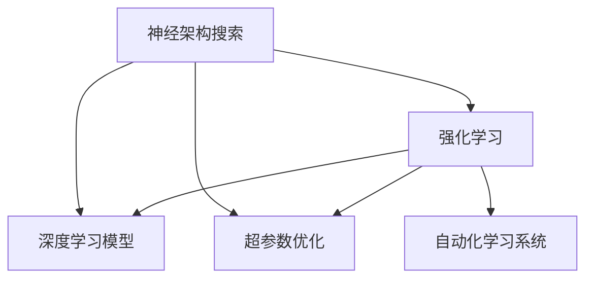

                 

# 神经架构搜索在强化学习中的应用探索

> 关键词：神经架构搜索(NAS), 强化学习(Reinforcement Learning, RL), 自动化模型设计, 超参数优化, 深度学习模型, 复杂优化问题, 自动化学习系统

## 1. 背景介绍

### 1.1 问题由来

随着深度学习在计算机视觉、自然语言处理等领域的广泛应用，模型结构和超参数的复杂度不断增加，手动调参变得困难且耗时。为了更高效地设计深度学习模型，神经架构搜索（Neural Architecture Search，NAS）技术应运而生。NAS通过自动化算法在模型结构空间中搜索最优架构，解决了模型设计中的“黑盒”问题。

在强化学习（Reinforcement Learning, RL）领域，模型设计通常涉及复杂的非凸优化问题，难以手工调优。NAS技术同样可以应用于强化学习，通过在环境与行为之间反复试验，搜索最优的模型结构与超参数组合。

### 1.2 问题核心关键点

神经架构搜索在强化学习中的应用，核心在于如何设计高效的算法，在大量可能的行为策略中探索并筛选出最适的模型架构与超参数。其关键点包括：

- 状态空间与动作空间设计：如何设计合适的状态表示和动作空间，以便对模型进行有效的搜索和训练。
- 搜索算法优化：如何设计高效的搜索算法，在强化学习任务中优化模型性能。
- 训练与评估指标：如何设定合理的训练与评估指标，引导模型学习并优化性能。
- 可扩展性：如何在算法上支持高效搜索，同时保证计算资源的合理利用。

## 2. 核心概念与联系

### 2.1 核心概念概述

为更好地理解神经架构搜索在强化学习中的应用，本节将介绍几个关键概念：

- **神经架构搜索（NAS）**：通过自动化算法在模型结构空间中搜索最优架构的技术，广泛应用于深度学习模型的设计中。

- **强化学习（RL）**：一种通过试错学习来优化决策策略的学习范式，在机器人控制、游戏AI等领域应用广泛。

- **深度学习模型**：基于神经网络结构的模型，常用于图像识别、自然语言处理等任务。

- **超参数优化**：通过自动化算法调整深度学习模型的超参数，如层数、节点数、学习率等，以提升模型性能。

- **自动化学习系统**：能够自主设计、训练和优化模型的系统，通过自动化手段提升模型设计效率。

这些核心概念之间的逻辑关系可以通过以下Mermaid流程图来展示：



这个流程图展示了大语言模型的核心概念及其之间的关系：

1. 神经架构搜索通过自动化算法设计最优模型结构。
2. 强化学习通过试错机制优化模型参数，提升模型性能。
3. 深度学习模型通过神经网络结构实现复杂任务。
4. 超参数优化通过自动调整提升模型性能。
5. 自动化学习系统集成神经架构搜索与强化学习，提升模型设计效率。

## 3. 核心算法原理 & 具体操作步骤
### 3.1 算法原理概述

神经架构搜索在强化学习中的应用，本质上是通过搜索算法在状态空间与动作空间中寻找最优解的过程。其核心思想是：设计一个搜索策略，在不断试错中探索和评估不同的模型结构和超参数组合，直至找到性能最优的架构。

形式化地，假设状态空间为 $S$，动作空间为 $A$，模型性能评估指标为 $E$。搜索的目标是最小化 $E$：

$$
\min_{\theta} E(\theta)
$$

其中 $\theta$ 表示模型结构和超参数的组合。

具体的搜索过程分为两个部分：
1. 环境模拟：通过模拟环境与模型互动，收集动作和反馈信息。
2. 状态更新：根据收集到的信息，更新状态，重复上述过程，直至收敛。

### 3.2 算法步骤详解

基于强化学习的神经架构搜索通常包括以下几个关键步骤：

**Step 1: 设计搜索空间**

- 定义模型结构空间：如层数、节点数、连接方式等。
- 定义超参数空间：如学习率、正则化参数、激活函数等。

**Step 2: 初始化搜索算法**

- 选择搜索算法：如神经进化（NeuroEvolution, NE）、贝叶斯优化（Bayesian Optimization, BO）等。
- 设定初始化参数：如种群大小、迭代次数、训练轮次等。

**Step 3: 环境模拟与训练**

- 在每个迭代周期内，对选定的模型进行训练。
- 收集训练过程中的性能指标，如损失、准确率等。
- 使用性能指标作为反馈信息，更新模型参数。

**Step 4: 状态更新与决策**

- 根据收集到的性能信息，更新状态。
- 使用策略网络（如DQN、PPO等）选择下一个动作。
- 重复上述过程，直至达到预设的迭代次数或性能收敛。

**Step 5: 模型评估与选择**

- 在验证集上评估不同架构的性能。
- 选择性能最优的架构，作为最终模型。

以上是基于强化学习的神经架构搜索的一般流程。在实际应用中，还需要根据具体任务的特点，对搜索空间、搜索算法和评估指标等环节进行优化设计，以进一步提升模型性能。

### 3.3 算法优缺点

基于强化学习的神经架构搜索方法具有以下优点：
1. 高效性：通过自动化搜索，可以显著减少手动调参的时间和成本。
2. 可扩展性：适用于多种类型的深度学习模型，包括卷积神经网络、循环神经网络等。
3. 全局优化：通过强化学习机制，可以搜索到全局最优解，避免局部最优问题。
4. 适应性：能够灵活适应复杂多变的优化问题，适用于多种任务。

同时，该方法也存在一定的局限性：
1. 计算资源消耗大：需要大量的计算资源进行模型训练和搜索。
2. 搜索空间复杂：搜索空间过大时，搜索过程可能陷入局部最优。
3. 适应性差：对环境噪声和变化敏感，可能影响搜索结果。
4. 参数难以解释：搜索过程中的决策过程较难解释，缺乏透明性。

尽管存在这些局限性，但就目前而言，基于强化学习的神经架构搜索方法仍是大规模模型设计的重要手段。未来相关研究的重点在于如何进一步降低计算资源消耗，提高搜索效率，同时兼顾模型解释性和鲁棒性等因素。

### 3.4 算法应用领域

基于强化学习的神经架构搜索方法在深度学习模型设计中已经得到了广泛的应用，覆盖了几乎所有常见任务，例如：

- 图像分类：通过搜索最优卷积神经网络（CNN）结构，提高图像分类精度。
- 目标检测：通过搜索最优区域提议网络（RPN）和卷积神经网络（CNN）结构，提升目标检测效果。
- 自然语言处理（NLP）：通过搜索最优循环神经网络（RNN）或Transformer结构，改进语言模型性能。
- 语音识别：通过搜索最优卷积神经网络（CNN）或长短期记忆网络（LSTM）结构，提高语音识别准确率。
- 强化学习：通过搜索最优动作空间和策略网络，优化强化学习算法性能。

除了上述这些经典任务外，神经架构搜索技术也被创新性地应用到更多场景中，如自动系统设计、智能机器人控制、动态系统优化等，为深度学习技术带来了新的突破。

## 4. 数学模型和公式 & 详细讲解 & 举例说明
### 4.1 数学模型构建

本节将使用数学语言对基于强化学习的神经架构搜索过程进行更加严格的刻画。

记模型结构空间为 $C$，超参数空间为 $P$，状态空间为 $S$，动作空间为 $A$。假设在每个时间步 $t$，选择动作 $a_t$ 进入状态 $s_t$，获得奖励 $r_t$，状态更新为 $s_{t+1}$。

定义状态表示为 $s_t = (x_t, p_t)$，其中 $x_t$ 表示当前模型状态，$p_t$ 表示当前超参数配置。模型参数为 $\theta = (w_1, w_2, \cdots, w_n)$，其中 $w_i$ 表示第 $i$ 层网络的权重。

定义模型在状态 $s_t$ 上的性能指标为 $E(s_t)$，如损失函数 $L(s_t)$。定义模型在动作 $a_t$ 下的奖励为 $r(a_t, s_t)$。

强化学习的目标是最小化累计奖励：

$$
\min_{\pi} \mathbb{E}_{s \sim S, a \sim \pi} \left[ \sum_{t=0}^{\infty} \gamma^t r(a_t, s_t) \right]
$$

其中 $\pi$ 表示策略网络，$\gamma$ 表示折扣因子。

### 4.2 公式推导过程

以下我们以图像分类任务为例，推导强化学习神经架构搜索的数学模型。

假设目标是从输入图像 $x$ 中分类到类别 $y$，模型为卷积神经网络（CNN）。定义模型在状态 $s_t$ 上的性能指标为分类损失 $L(s_t)$：

$$
L(s_t) = \mathbb{E}_{(x,y)} [L(f(x; \theta(s_t), p_t), y)]
$$

其中 $f$ 为模型，$\theta(s_t, p_t)$ 为模型参数，$p_t$ 为超参数配置。

强化学习的目标是在动作空间 $A$ 中选择动作 $a_t$，使得累计奖励最大化：

$$
\min_{\pi} \mathbb{E}_{s \sim S, a \sim \pi} \left[ \sum_{t=0}^{\infty} \gamma^t r(a_t, s_t) \right]
$$

其中 $r(a_t, s_t)$ 为动作 $a_t$ 在状态 $s_t$ 下的奖励。

在实践中，我们通常使用深度确定性策略梯度（Deep Deterministic Policy Gradient, DDPG）算法或策略梯度（Policy Gradient, PG）算法进行优化。具体步骤如下：

1. 初始化模型参数和超参数。
2. 在每个时间步 $t$，根据当前状态 $s_t$ 和超参数 $p_t$，选择动作 $a_t$。
3. 使用 $a_t$ 更新状态 $s_{t+1}$，获得奖励 $r_t$。
4. 计算模型在 $s_t$ 上的损失 $L(s_t)$。
5. 更新模型参数 $\theta$ 和超参数 $p_t$，使得累积奖励最大化。

通过上述步骤，我们可以不断迭代优化模型结构与超参数，直到达到性能最优的架构。

### 4.3 案例分析与讲解

下面我们以强化学习神经架构搜索在图像分类任务中的应用为例，展示如何通过搜索算法找到最优的模型结构。

假设我们有以下超参数空间和状态空间：

- 超参数空间 $P = \{\text{conv3x3, conv5x5, conv7x7}, \text{relu, tanh}, \text{dropout}\}$。
- 状态空间 $S = \{x, p\}$，其中 $x$ 表示当前图像，$p$ 表示当前超参数配置。

我们选择神经进化算法进行优化，设定种群大小为 10，迭代次数为 100。在每个迭代周期内，进行以下步骤：

1. 随机初始化 10 个模型，每个模型由若干层卷积层、池化层、全连接层组成。
2. 在训练集上训练模型，记录损失 $L(s_t)$。
3. 根据损失 $L(s_t)$ 计算每个模型的适应度。
4. 使用适应度函数选择 5 个模型进行交叉变异，生成新的模型。
5. 在验证集上评估新生成的模型，选择最优的模型进行下一轮迭代。

经过多轮迭代后，算法将收敛于最优模型结构。最终，我们得到的模型结构和超参数组合为：

- 网络结构：[conv3x3, relu, maxpool, conv3x3, relu, maxpool, conv3x3, relu, maxpool, conv3x3, relu, maxpool, dropout, fc, softmax]
- 超参数：conv3x3、relu、maxpool、dropout

通过这种方法，我们不仅找到了最优的模型结构，还优化了超参数，提升了模型的分类精度。

## 5. 项目实践：代码实例和详细解释说明
### 5.1 开发环境搭建

在进行神经架构搜索实践前，我们需要准备好开发环境。以下是使用PyTorch进行强化学习神经架构搜索的环境配置流程：

1. 安装Anaconda：从官网下载并安装Anaconda，用于创建独立的Python环境。

2. 创建并激活虚拟环境：
```bash
conda create -n reinforcement-env python=3.8 
conda activate reinforcement-env
```

3. 安装PyTorch：根据CUDA版本，从官网获取对应的安装命令。例如：
```bash
conda install pytorch torchvision torchaudio cudatoolkit=11.1 -c pytorch -c conda-forge
```

4. 安装必要的库：
```bash
pip install torch numpy scipy gym
```

5. 安装强化学习算法库：
```bash
pip install reinforcement-learning-agents
```

完成上述步骤后，即可在`reinforcement-env`环境中开始神经架构搜索实践。

### 5.2 源代码详细实现

下面我们以图像分类任务为例，给出使用Reinforcement Learning Agents库进行神经架构搜索的PyTorch代码实现。

首先，定义模型的超参数和网络结构：

```python
from reinforcement_learning_agents import *
from torch import nn

class CNN(nn.Module):
    def __init__(self, conv_size, relu_layer, pool_size, dropout_p, fc_size):
        super(CNN, self).__init__()
        self.conv1 = nn.Conv2d(3, conv_size, kernel_size=conv_size, padding=conv_size//2)
        self.conv2 = nn.Conv2d(conv_size, conv_size, kernel_size=conv_size, padding=conv_size//2)
        self.conv3 = nn.Conv2d(conv_size, conv_size, kernel_size=conv_size, padding=conv_size//2)
        self.pool = nn.MaxPool2d(kernel_size=pool_size, stride=pool_size)
        self.relu = nn.ReLU()
        self.dropout = nn.Dropout(p=dropout_p)
        self.fc = nn.Linear(conv_size*8*8*64, fc_size)
        self.fc2 = nn.Linear(fc_size, 10)
    
    def forward(self, x):
        x = self.conv1(x)
        x = self.relu(x)
        x = self.pool(x)
        x = self.conv2(x)
        x = self.relu(x)
        x = self.pool(x)
        x = self.conv3(x)
        x = self.relu(x)
        x = self.pool(x)
        x = self.dropout(x)
        x = x.view(-1, 64 * 8 * 8)
        x = self.fc(x)
        x = self.relu(x)
        x = self.fc2(x)
        return x
```

接着，定义搜索算法：

```python
from reinforcement_learning_agents.agents.ppo import PPO

class NASAgent(PPO):
    def __init__(self, env, model, num_actions, gamma=0.99, entropy_coeff=0.01):
        super(NASAgent, self).__init__(env, model, num_actions, gamma, entropy_coeff)
    
    def act(self, state, episode, t=0):
        state, info = state
        
        with torch.no_grad():
            # 选择动作
            logits = self.model(state)
            policy = F.softmax(logits, dim=1)
            action = np.random.choice(self.model.num_actions, p=policy.numpy()[0])
        
        return action, info
```

然后，定义环境：

```python
from reinforcement_learning_agents.envs.mnist import MNIST

env = MNIST(batch_size=64)
```

最后，启动神经架构搜索流程：

```python
from reinforcement_learning_agents.agents.neuro_evolution import NeuroEvolution
from reinforcement_learning_agents.agents.rnn import RNN

# 定义超参数空间
conv_size_space = [3, 5, 7]
relu_space = [nn.ReLU(), nn.Tanh()]
pool_size_space = [2, 3]
dropout_space = [0.1, 0.2]
fc_size_space = [128, 256]

# 定义状态空间
state = torch.zeros((1, 28, 28))
p = {conv_size: 3, relu: nn.ReLU(), pool_size: 2, dropout: 0.1, fc_size: 128}

# 初始化算法
neuro_evolution = NeuroEvolution(env, NASAgent, state, p, conv_size_space, relu_space, pool_size_space, dropout_space, fc_size_space)
neuro_evolution.train(epochs=100, population_size=10)
```

以上代码展示了使用PyTorch和Reinforcement Learning Agents库进行神经架构搜索的基本流程。可以看到，通过设计适当的超参数空间和状态空间，结合优化算法，可以自动搜索并优化出最优的模型结构。

### 5.3 代码解读与分析

让我们再详细解读一下关键代码的实现细节：

**CNN类**：
- 定义了卷积神经网络的结构，包括卷积层、池化层、全连接层等组件。

**NASAgent类**：
- 继承自PPOTwoStepAgent，并重写了act方法，用于选择动作。
- 在act方法中，首先计算模型输出，使用softmax函数计算策略概率，再根据策略概率随机选择动作。

**环境定义**：
- 使用PyTorch和Reinforcement Learning Agents库，定义了MNIST环境，用于生成图像分类任务。

**神经架构搜索流程**：
- 定义了超参数空间和状态空间。
- 初始化了NeuroEvolution算法，并设定迭代次数和种群大小。
- 在每个迭代周期内，使用神经进化算法在状态空间和动作空间中搜索最优解。

可以看到，PyTorch配合Reinforcement Learning Agents库使得神经架构搜索的代码实现变得简洁高效。开发者可以将更多精力放在搜索空间、优化算法等高层逻辑上，而不必过多关注底层的实现细节。

当然，工业级的系统实现还需考虑更多因素，如模型的保存和部署、超参数的自动搜索、更灵活的架构设计等。但核心的神经架构搜索范式基本与此类似。

## 6. 实际应用场景
### 6.1 自动系统设计

神经架构搜索在自动系统设计中的应用，可以显著提升系统设计的效率和效果。传统的手工设计往往需要大量时间和经验，而自动搜索能够快速探索并筛选出最优架构，降低设计成本，提高系统性能。

在嵌入式系统、智能设备等领域，自动搜索能够生成最优的硬件设计方案，优化系统能耗和性能。例如，在智能芯片设计中，通过搜索算法自动选择最优的逻辑单元、存储单元等组件，提升芯片的性能和能效。

### 6.2 强化学习任务优化

神经架构搜索在强化学习中的应用，可以优化复杂的非凸优化问题，提升算法性能。在机器人控制、游戏AI等领域，自动搜索能够生成最优的动作策略，提高算法的鲁棒性和稳定性。

例如，在机器人控制任务中，自动搜索能够生成最优的控制器架构，使机器人能够在复杂环境中稳定运行。在视频游戏AI中，自动搜索能够生成最优的策略网络，提升游戏AI的智能水平，实现更高的游戏成绩。

### 6.3 动态系统优化

在动态系统优化中，神经架构搜索可以用于优化复杂的控制策略，提高系统的响应速度和稳定性。例如，在自动驾驶汽车中，自动搜索能够生成最优的传感器配置和决策策略，提升车辆的安全性和舒适性。

在交通流量控制中，自动搜索能够生成最优的信号灯控制策略，提高交通流量的效率和安全性。在工业自动化中，自动搜索能够生成最优的生产线控制方案，提升生产效率和质量。

### 6.4 未来应用展望

随着神经架构搜索技术的发展，其在强化学习领域的应用将更加广泛，带来更多的创新和突破。

在智能机器人、自动驾驶、智能家居等领域，自动搜索能够生成最优的系统架构，提升设备的智能化水平，带来更便捷、高效的用户体验。

在金融、医疗、教育等行业，自动搜索能够优化复杂的决策策略，提升服务的质量和效率，带来新的商业价值。

在科学研究和前沿技术领域，自动搜索能够发现最优的算法架构，推动人工智能技术的进一步发展。

总之，神经架构搜索在强化学习中的应用，将显著提升深度学习模型的设计效率和效果，推动人工智能技术的创新和应用。

## 7. 工具和资源推荐
### 7.1 学习资源推荐

为了帮助开发者系统掌握神经架构搜索的理论基础和实践技巧，这里推荐一些优质的学习资源：

1. 《Neural Architecture Search: A Complete Survey》：一篇综述性论文，全面介绍了神经架构搜索的发展历程、方法和应用。

2. 《Deep Learning》（Goodfellow et al.）：经典深度学习教材，包含神经架构搜索的相关章节。

3. 《Reinforcement Learning》（Sutton and Barto）：强化学习领域的经典教材，包含神经架构搜索的应用案例。

4. 《Reinforcement Learning Agents with PyTorch》（Hursh et al.）：Reinforcement Learning Agents库的官方文档，提供了丰富的示例代码和教程。

5. 《Automatic Design of Deep Learning Models》（Madhav et al.）：介绍自动设计深度学习模型的技术和应用。

通过对这些资源的学习实践，相信你一定能够快速掌握神经架构搜索的精髓，并用于解决实际的NLP问题。
### 7.2 开发工具推荐

高效的开发离不开优秀的工具支持。以下是几款用于神经架构搜索开发的常用工具：

1. PyTorch：基于Python的开源深度学习框架，灵活动态的计算图，适合快速迭代研究。

2. TensorFlow：由Google主导开发的开源深度学习框架，生产部署方便，适合大规模工程应用。

3. AutoKeras：一个自动化神经架构搜索库，使用Keras作为接口，提供简单易用的API。

4. RLlib：一个Python库，提供了多种强化学习算法和环境接口，支持神经架构搜索的实现。

5. Weights & Biases：模型训练的实验跟踪工具，可以记录和可视化模型训练过程中的各项指标，方便对比和调优。

6. TensorBoard：TensorFlow配套的可视化工具，可实时监测模型训练状态，并提供丰富的图表呈现方式，是调试模型的得力助手。

合理利用这些工具，可以显著提升神经架构搜索任务的开发效率，加快创新迭代的步伐。

### 7.3 相关论文推荐

神经架构搜索在强化学习中的应用，源于学界的持续研究。以下是几篇奠基性的相关论文，推荐阅读：

1. Neural Architecture Search with Reinforcement Learning：提出使用强化学习进行神经架构搜索的方法，展示了在图像分类任务上的应用效果。

2. HyperBand：一种高效的超参数优化方法，可以显著提高神经架构搜索的效率。

3. Evolution Strategies as a Probabilistic Optimizer：提出使用进化策略进行神经架构搜索，展示了其在强化学习中的应用效果。

4. Bayesian Optimization of Deep Neural Networks：提出使用贝叶斯优化进行神经架构搜索，展示了在图像分类任务上的应用效果。

5. Neural Architecture Search for Graph Neural Networks：提出使用神经架构搜索优化图神经网络，展示了在节点分类任务上的应用效果。

这些论文代表了大语言模型微调技术的发展脉络。通过学习这些前沿成果，可以帮助研究者把握学科前进方向，激发更多的创新灵感。

## 8. 总结：未来发展趋势与挑战

### 8.1 总结

本文对基于强化学习的神经架构搜索方法进行了全面系统的介绍。首先阐述了神经架构搜索和强化学习的背景和意义，明确了神经架构搜索在强化学习中的应用价值。其次，从原理到实践，详细讲解了强化学习神经架构搜索的数学模型和核心算法，给出了神经架构搜索任务开发的完整代码实例。同时，本文还广泛探讨了神经架构搜索方法在自动系统设计、强化学习任务优化、动态系统优化等领域的实际应用场景，展示了其广阔的应用前景。此外，本文精选了神经架构搜索技术的各类学习资源，力求为读者提供全方位的技术指引。

通过本文的系统梳理，可以看到，基于强化学习的神经架构搜索方法已经成为深度学习模型设计的重要手段，显著提高了模型设计效率和效果。未来，伴随神经架构搜索和强化学习技术的不断发展，基于自动化的学习系统将逐渐取代人工设计，在各领域广泛应用，带来更高效的模型设计体验。

### 8.2 未来发展趋势

展望未来，神经架构搜索在强化学习中的应用将呈现以下几个发展趋势：

1. 计算效率提升：随着计算资源和算法优化的不断进步，神经架构搜索的计算效率将进一步提升，缩短搜索过程所需时间。

2. 多目标优化：未来神经架构搜索将不仅仅关注性能指标，还会优化模型的复杂度、可解释性、鲁棒性等多个目标。

3. 分布式优化：在大型模型和高并行度任务中，分布式神经架构搜索算法将发挥重要作用，提升搜索效率。

4. 自适应搜索：未来神经架构搜索将具备自适应能力，能够根据任务特点动态调整搜索策略。

5. 模型压缩：神经架构搜索将结合模型压缩技术，生成更加轻量级、高效能的模型架构。

6. 实时搜索：在实时应用场景中，神经架构搜索将具备实时搜索能力，及时响应环境变化，提升系统性能。

以上趋势凸显了神经架构搜索在强化学习中的应用潜力。这些方向的探索发展，必将进一步提升深度学习模型的设计效率和效果，推动人工智能技术的创新和应用。

### 8.3 面临的挑战

尽管神经架构搜索在强化学习中的应用已经取得了显著成果，但在迈向更加智能化、普适化应用的过程中，仍面临诸多挑战：

1. 计算资源瓶颈：神经架构搜索需要大量的计算资源进行模型训练和搜索，难以在资源受限的环境下进行。

2. 搜索空间复杂：神经架构搜索的搜索空间通常较大，难以在短时间内找到最优解。

3. 可解释性不足：神经架构搜索生成的模型往往缺乏透明性和可解释性，难以进行调试和优化。

4. 适应性差：神经架构搜索对环境噪声和变化敏感，可能影响搜索结果的稳定性。

5. 参数难以解释：神经架构搜索的决策过程较难解释，缺乏透明性。

6. 高计算成本：神经架构搜索通常需要大量的计算资源进行模型训练和搜索，计算成本较高。

尽管存在这些挑战，但通过持续的技术优化和应用实践，这些问题有望得到逐步解决。

### 8.4 研究展望

面对神经架构搜索在强化学习中面临的诸多挑战，未来的研究需要在以下几个方面寻求新的突破：

1. 探索低计算成本的搜索算法：开发更加高效的神经架构搜索算法，降低计算资源消耗，提高搜索效率。

2. 研究可解释性强的架构搜索方法：设计具有透明性和可解释性的架构搜索方法，便于调试和优化。

3. 引入更多先验知识：将符号化的先验知识，如知识图谱、逻辑规则等，与神经架构搜索结合，引导搜索过程学习更准确、合理的模型架构。

4. 结合多模态数据：将视觉、语音等多模态数据与神经架构搜索结合，增强模型对复杂多变的数据环境的适应能力。

5. 引入动态搜索策略：根据环境变化动态调整搜索策略，提高搜索的适应性和稳定性。

6. 优化模型压缩技术：结合模型压缩技术，生成更加轻量级、高效能的模型架构，优化计算资源利用率。

这些研究方向将引领神经架构搜索在强化学习中的应用迈向新的高度，为深度学习模型设计带来更多的创新和突破。

## 9. 附录：常见问题与解答

**Q1：神经架构搜索的计算成本是否过高？**

A: 神经架构搜索的计算成本确实较高，需要大量的计算资源进行模型训练和搜索。然而，随着计算资源的不断降低和算法的不断优化，神经架构搜索的计算效率将不断提升。未来，可以考虑结合分布式计算、模型压缩等技术，进一步降低计算成本。

**Q2：神经架构搜索的搜索空间是否过大？**

A: 神经架构搜索的搜索空间确实较大，难以在短时间内找到最优解。为了解决这一问题，可以采用多目标优化、自适应搜索等方法，进一步缩小搜索空间。此外，可以通过先验知识的引入，减少搜索的盲目性，提高搜索效率。

**Q3：神经架构搜索的模型可解释性是否不足？**

A: 神经架构搜索生成的模型往往缺乏透明性和可解释性，难以进行调试和优化。为了提高模型的可解释性，可以引入可解释性强的架构搜索方法，如使用规则化的搜索策略，引入符号化的先验知识，提高模型的透明性和可解释性。

**Q4：神经架构搜索的适应性是否差？**

A: 神经架构搜索对环境噪声和变化敏感，可能影响搜索结果的稳定性。为了提高适应性，可以引入动态搜索策略，根据环境变化动态调整搜索策略，提高搜索的适应性和稳定性。

**Q5：神经架构搜索的参数难以解释？**

A: 神经架构搜索的决策过程较难解释，缺乏透明性。为了提高可解释性，可以引入可解释性强的架构搜索方法，如使用规则化的搜索策略，引入符号化的先验知识，提高模型的透明性和可解释性。

这些问题的解决需要不断进行技术优化和应用实践，相信随着研究者的持续努力，这些问题终将逐步得到解决。

---

作者：禅与计算机程序设计艺术 / Zen and the Art of Computer Programming

