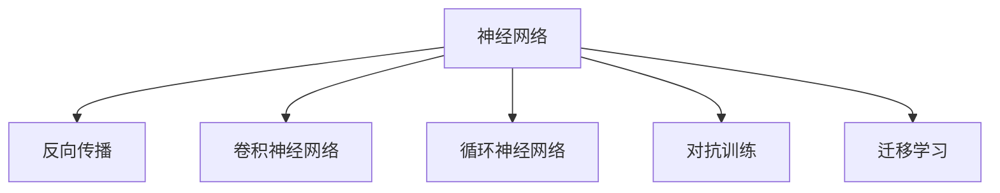

                 

# 神经网络：人类智慧的延伸

## 1. 背景介绍

### 1.1 问题由来

神经网络（Neural Networks）作为人工智能领域的重要工具，其理论基础可追溯至1940年代。然而，受限于当时硬件条件，神经网络的研究进展一度停滞不前。直到1980年代，反向传播算法（Backpropagation）的提出和普及，神经网络才逐渐焕发生机。近年来，随着深度学习技术的突破，大规模、高性能的神经网络在图像识别、语音识别、自然语言处理等领域取得了空前的成功。

神经网络不仅在精度上超越了传统机器学习方法，更通过模拟人脑的复杂计算结构，展示了巨大潜力。它不仅在学术界引起了广泛关注，更在工业界得到了广泛应用，推动了人工智能技术的产业化进程。

### 1.2 问题核心关键点

神经网络之所以能取得如此辉煌的成就，关键在于其强大的非线性建模能力。它通过将输入数据映射到高维空间，捕捉到数据间的复杂关系，从而能够对未见过的样本进行准确预测。然而，尽管神经网络在许多任务上已展示出优于传统方法的性能，其内部运作机制的复杂性和黑盒特性，使得其应用受到一定的限制。

为解决这一问题，研究者们不断优化神经网络的设计，提出了一系列改进方法。其中，参数优化、正则化、迁移学习、对抗训练等技术，为神经网络在实际应用中的推广应用奠定了基础。

### 1.3 问题研究意义

神经网络技术的发展，不仅推动了人工智能技术的跨越式进步，也为各行各业带来了变革性的影响。在医疗领域，神经网络被用于图像诊断、药物研发，大大提高了诊断的准确性和药物研发的效率；在金融领域，它被用于风险评估、智能投顾，提升了风险控制的精准度和投资建议的合理性；在自动驾驶领域，神经网络被用于环境感知、决策制定，推动了自动驾驶技术从实验室走向现实。

此外，神经网络技术的发展还对教育、娱乐、交通、能源等众多领域产生了深远影响，推动了社会的数字化、智能化转型。神经网络技术的普及应用，不仅提升了各行业的生产效率，也为社会进步带来了新的动力。

## 2. 核心概念与联系

### 2.1 核心概念概述

为更好地理解神经网络的基本原理和运作机制，本节将介绍几个关键的概念：

- 神经网络（Neural Network）：由一系列线性或非线性处理单元组成的计算模型，通过多层连接模拟人脑的复杂计算过程。
- 反向传播算法（Backpropagation）：神经网络中最常用的训练算法，通过链式法则计算每个参数的梯度，并据此更新权重，最小化预测误差。
- 卷积神经网络（Convolutional Neural Network, CNN）：针对图像等二维结构数据的神经网络结构，通过卷积层提取局部特征，减少参数量。
- 循环神经网络（Recurrent Neural Network, RNN）：针对序列数据，通过循环结构实现信息的传递和积累，适用于文本、语音等序列数据的处理。
- 对抗训练（Adversarial Training）：通过引入对抗样本，增强模型的鲁棒性，使其能够识别并抵御恶意攻击。
- 迁移学习（Transfer Learning）：通过预训练模型在某任务上的知识迁移，在另一相似任务上进行微调，提升模型性能。

这些核心概念之间的逻辑关系可以通过以下Mermaid流程图来展示：



这个流程图展示了几类常见神经网络及其关联技术的基本关系。

## 3. 核心算法原理 & 具体操作步骤
### 3.1 算法原理概述

神经网络通过多层非线性变换，将输入数据映射到高维空间，从而捕捉到数据间复杂的关系。反向传播算法作为神经网络中最常用的训练算法，通过链式法则计算每个参数的梯度，并据此更新权重，最小化预测误差。其主要步骤包括：

1. 前向传播：将输入数据送入神经网络，通过一系列线性或非线性变换，生成预测输出。
2. 计算误差：将预测输出与真实标签进行对比，计算损失函数。
3. 反向传播：通过链式法则计算每个参数的梯度，并据此更新权重，以减小损失函数。
4. 迭代优化：重复执行前向传播和反向传播，直至损失函数收敛。

### 3.2 算法步骤详解

神经网络的训练流程大致分为以下几个步骤：

**Step 1: 准备数据集和模型**
- 准备训练集和验证集，标注好样本标签。
- 选择合适的神经网络结构，并初始化权重。

**Step 2: 前向传播**
- 将训练集数据输入模型，进行前向传播计算。
- 生成预测输出，并与真实标签进行对比。

**Step 3: 计算损失**
- 根据预测输出和真实标签，计算损失函数。
- 常见损失函数包括均方误差（MSE）、交叉熵（Cross Entropy）等。

**Step 4: 反向传播**
- 使用反向传播算法计算每个参数的梯度。
- 根据梯度更新模型权重，减小损失函数。

**Step 5: 迭代优化**
- 重复执行前向传播和反向传播，直至损失函数收敛。
- 在验证集上评估模型性能，防止过拟合。

**Step 6: 测试和应用**
- 在测试集上评估模型性能，确保模型泛化能力。
- 将模型应用到实际任务中，进行推理预测。

以上步骤展示了神经网络训练的基本流程，但在实际应用中，还需要根据任务特点进行优化设计，如选择适合的优化算法、正则化技术、数据增强方法等。

### 3.3 算法优缺点

神经网络在许多任务上已展示出优于传统方法的性能，但同时也存在一些局限性：

优点：
1. 强大的非线性建模能力，能够处理复杂数据关系。
2. 适用于各种数据类型，如图像、文本、语音等。
3. 具有较高的泛化能力，可以应用于不同领域。

缺点：
1. 训练过程复杂，需要大量标注数据和计算资源。
2. 模型结构复杂，难以解释和调试。
3. 容易过拟合，特别是在数据量较少的情况下。
4. 对异常值和噪声数据敏感。

尽管存在这些局限性，神经网络技术的进展仍在不断突破，通过引入更多的正则化技术、对抗训练、参数高效微调等方法，神经网络正在向更加高效、鲁棒、可解释的方向发展。

### 3.4 算法应用领域

神经网络技术在许多领域都得到了广泛应用，以下是几个典型的应用场景：

**计算机视觉：**
- 图像分类：通过卷积神经网络（CNN）对图像进行分类，如猫狗识别、车辆识别等。
- 物体检测：通过Faster R-CNN、YOLO等网络结构检测图像中的物体，并标出位置和类别。
- 图像分割：通过U-Net、DeepLab等网络结构，对图像进行像素级别的分割。

**自然语言处理（NLP）：**
- 文本分类：通过RNN、Transformer等网络结构对文本进行分类，如情感分析、主题分类等。
- 机器翻译：通过Seq2Seq模型和Transformer模型，将一种语言翻译成另一种语言。
- 问答系统：通过LSTM等网络结构对问答数据进行建模，回答用户问题。

**语音识别：**
- 自动语音识别（ASR）：通过卷积神经网络（CNN）和循环神经网络（RNN）等结构，将语音信号转化为文本。
- 语音合成（TTS）：通过深度生成模型（如WaveNet）生成自然流畅的语音信号。

此外，神经网络技术还被应用于推荐系统、智能控制、游戏AI等领域，推动了各行各业的数字化、智能化转型。

## 4. 数学模型和公式 & 详细讲解  
### 4.1 数学模型构建

神经网络的数学模型可以描述为：

$$
f(x;w) = \sigma(W_{L} \sigma(W_{L-1} \cdots \sigma(W_1 x) \cdots))
$$

其中，$x$ 为输入数据，$w$ 为模型参数，$W$ 为权重矩阵，$\sigma$ 为激活函数。

神经网络的前向传播过程为：

$$
h_1 = W_1 x + b_1
$$

$$
h_2 = \sigma(h_1)
$$

$$
\vdots
$$

$$
h_L = \sigma(W_L h_{L-1} + b_L)
$$

其中，$h_1, h_2, \cdots, h_L$ 为中间变量，$x$ 为输入，$b$ 为偏置项。

### 4.2 公式推导过程

以简单的多层感知器（MLP）为例，推导其前向传播和反向传播的计算过程。

前向传播计算如下：

$$
h_1 = W_1 x + b_1
$$

$$
h_2 = \sigma(h_1)
$$

$$
\vdots
$$

$$
h_L = \sigma(W_L h_{L-1} + b_L)
$$

其中，$x$ 为输入数据，$h_1, h_2, \cdots, h_L$ 为中间变量，$W$ 为权重矩阵，$b$ 为偏置项，$\sigma$ 为激活函数。

反向传播计算如下：

$$
\delta_L = (h_L - y) f'(h_L)
$$

$$
\delta_{L-1} = \delta_L \cdot W_L^T \cdot f'(h_{L-1})
$$

$$
\vdots
$$

$$
\delta_1 = \delta_2 \cdot W_2^T \cdot f'(h_1) \cdots \delta_L \cdot W_L^T \cdot f'(h_1)
$$

其中，$y$ 为真实标签，$\delta$ 为误差项，$f'$ 为激活函数的导数。

### 4.3 案例分析与讲解

以手写数字识别为例，展示神经网络的前向传播和反向传播过程。

手写数字识别任务通常使用MNIST数据集，包含60,000个训练图像和10,000个测试图像，每张图像为28x28像素。

前向传播计算如下：

$$
h_1 = W_1 x + b_1
$$

$$
h_2 = \sigma(h_1)
$$

$$
\vdots
$$

$$
h_L = \sigma(W_L h_{L-1} + b_L)
$$

其中，$x$ 为输入图像的像素值向量，$h_1, h_2, \cdots, h_L$ 为中间变量，$W$ 为权重矩阵，$b$ 为偏置项，$\sigma$ 为激活函数。

反向传播计算如下：

$$
\delta_L = (h_L - y) f'(h_L)
$$

$$
\delta_{L-1} = \delta_L \cdot W_L^T \cdot f'(h_{L-1})
$$

$$
\vdots
$$

$$
\delta_1 = \delta_2 \cdot W_2^T \cdot f'(h_1) \cdots \delta_L \cdot W_L^T \cdot f'(h_1)
$$

其中，$y$ 为真实标签，$\delta$ 为误差项，$f'$ 为激活函数的导数。

通过这些计算，神经网络可以从大量训练数据中学习到图像与数字之间的映射关系，从而实现对新数字图像的准确识别。

## 5. 项目实践：代码实例和详细解释说明
### 5.1 开发环境搭建

在进行神经网络项目开发前，我们需要准备好开发环境。以下是使用Python进行TensorFlow和Keras开发的环境配置流程：

1. 安装Anaconda：从官网下载并安装Anaconda，用于创建独立的Python环境。

2. 创建并激活虚拟环境：
```bash
conda create -n tf-env python=3.8 
conda activate tf-env
```

3. 安装TensorFlow：根据CUDA版本，从官网获取对应的安装命令。例如：
```bash
pip install tensorflow
```

4. 安装Keras：
```bash
pip install keras
```

5. 安装各类工具包：
```bash
pip install numpy pandas scikit-learn matplotlib tqdm jupyter notebook ipython
```

完成上述步骤后，即可在`tf-env`环境中开始神经网络项目的开发。

### 5.2 源代码详细实现

下面我们以手写数字识别（MNIST）任务为例，给出使用TensorFlow和Keras对多层感知器（MLP）模型进行训练的代码实现。

首先，定义数据处理函数：

```python
from tensorflow.keras.datasets import mnist
from tensorflow.keras.utils import to_categorical
from tensorflow.keras.models import Sequential
from tensorflow.keras.layers import Dense, Flatten

def load_mnist():
    (x_train, y_train), (x_test, y_test) = mnist.load_data()
    x_train = x_train.reshape(-1, 28 * 28)
    x_test = x_test.reshape(-1, 28 * 28)
    x_train, x_test = x_train / 255.0, x_test / 255.0
    y_train = to_categorical(y_train)
    y_test = to_categorical(y_test)
    return x_train, y_train, x_test, y_test

# 加载数据
x_train, y_train, x_test, y_test = load_mnist()
```

然后，定义模型和训练函数：

```python
model = Sequential([
    Dense(128, activation='relu', input_shape=(784,)),
    Dense(64, activation='relu'),
    Dense(10, activation='softmax')
])

model.compile(optimizer='adam', loss='categorical_crossentropy', metrics=['accuracy'])

def train_epoch(model, x_train, y_train, batch_size):
    dataloader = (x_train[i::batch_size] for i in range(len(x_train)))
    for batch, (x_batch, y_batch) in enumerate(dataloader):
        with tf.GradientTape() as tape:
            output = model(x_batch)
            loss = tf.reduce_mean(tf.keras.losses.categorical_crossentropy(output, y_batch))
        gradients = tape.gradient(loss, model.trainable_variables)
        optimizer.apply_gradients(zip(gradients, model.trainable_variables))
    return loss.numpy().mean()

def evaluate(model, x_test, y_test):
    test_loss = model.evaluate(x_test, y_test)
    return test_loss[1]
```

接着，启动训练流程并在测试集上评估：

```python
epochs = 10
batch_size = 32

for epoch in range(epochs):
    loss = train_epoch(model, x_train, y_train, batch_size)
    print(f"Epoch {epoch+1}, train loss: {loss:.3f}")
    
    print(f"Epoch {epoch+1}, test loss: {evaluate(model, x_test, y_test):.3f}")
```

以上就是使用TensorFlow和Keras对MLP模型进行手写数字识别任务训练的完整代码实现。可以看到，得益于TensorFlow和Keras的强大封装，我们能够以相对简洁的代码完成模型的训练和评估。

### 5.3 代码解读与分析

让我们再详细解读一下关键代码的实现细节：

**load_mnist函数**：
- 定义数据加载函数，将MNIST数据集加载并转换为模型所需的格式。

**模型定义**：
- 定义多层感知器模型，包括输入层、隐藏层和输出层。
- 使用ReLU激活函数和softmax激活函数。

**train_epoch函数**：
- 定义训练函数，对每个批次的数据进行前向传播和反向传播，更新模型参数。
- 使用Adam优化器，交叉熵损失函数，评估模型精度。

**evaluate函数**：
- 定义评估函数，计算测试集的损失函数。
- 使用模型评估接口进行评估。

**训练流程**：
- 定义总的epoch数和批大小，开始循环迭代。
- 每个epoch内，在训练集上训练，输出平均损失。
- 在验证集上评估，输出测试损失。

可以看到，TensorFlow和Keras提供的高层封装，使得神经网络模型的开发和训练过程变得相对简单，开发者可以将更多精力放在数据处理、模型改进等高层逻辑上，而不必过多关注底层的实现细节。

当然，工业级的系统实现还需考虑更多因素，如模型的保存和部署、超参数的自动搜索、更灵活的模型结构等。但核心的训练范式基本与此类似。

## 6. 实际应用场景
### 6.1 智能推荐系统

智能推荐系统（Recommender System）利用神经网络算法，对用户行为数据进行建模，从而为用户推荐个性化的商品或内容。推荐系统通过分析用户的浏览、购买、评价等行为数据，使用神经网络算法学习用户偏好，生成推荐列表。

在技术实现上，推荐系统通常分为两个阶段：离线训练和在线推理。离线训练阶段，使用神经网络模型对历史数据进行训练，生成推荐模型。在线推理阶段，将新用户的行为数据输入模型，生成个性化推荐结果。

神经网络推荐系统的优点在于能够处理非结构化数据，具有良好的可解释性，适用于多种推荐场景。但其缺点在于需要大量标注数据进行训练，且模型的复杂度较高，对计算资源的需求较大。

### 6.2 自动驾驶系统

自动驾驶系统（Autonomous Driving System）利用神经网络算法，对环境数据进行感知和决策，从而实现车辆的自主导航。自动驾驶系统通过安装在车上的传感器（如相机、雷达、激光雷达等）收集环境数据，使用神经网络算法进行数据处理和特征提取，生成决策结果。

在技术实现上，自动驾驶系统通常分为感知、决策、控制三个子系统。感知系统使用神经网络算法对传感器数据进行分类和定位，生成环境模型。决策系统使用神经网络算法对环境模型进行分析和预测，生成导航指令。控制系统使用神经网络算法对导航指令进行控制，实现车辆的自主导航。

神经网络自动驾驶系统的优点在于能够实时处理大量数据，具有较强的适应性和鲁棒性，适用于复杂多变的驾驶环境。但其缺点在于需要大量的实验数据和计算资源进行训练和优化，且系统安全性仍需进一步提升。

### 6.3 金融风险评估

金融风险评估（Financial Risk Assessment）利用神经网络算法，对金融数据进行建模和分析，从而识别出潜在的风险点。金融风险评估通过分析历史交易数据、市场数据、财务数据等，使用神经网络算法学习数据间的复杂关系，生成风险评估模型。

在技术实现上，金融风险评估通常分为两个阶段：特征工程和模型训练。特征工程阶段，使用神经网络算法对原始数据进行特征提取和处理。模型训练阶段，使用神经网络算法对处理后的数据进行建模和分析，生成风险评估模型。

神经网络金融风险评估的优点在于能够处理非结构化数据，具有良好的泛化能力，适用于多种风险评估场景。但其缺点在于需要大量标注数据进行训练，且模型的复杂度较高，对计算资源的需求较大。

### 6.4 未来应用展望

随着神经网络技术的不断发展，其在更多领域的应用前景将更加广阔。以下是几个未来可能的神经网络应用场景：

**智能客服系统：**
- 使用神经网络算法对客户咨询数据进行建模和分析，生成智能客服模型。智能客服模型能够自动理解用户意图，匹配最合适的答案模板，提供个性化的客服服务。

**智能制造系统：**
- 使用神经网络算法对生产数据进行建模和分析，生成智能制造模型。智能制造模型能够实时监测生产状态，预测生产故障，优化生产流程，提高生产效率和质量。

**智能医疗系统：**
- 使用神经网络算法对医疗数据进行建模和分析，生成智能医疗模型。智能医疗模型能够辅助医生进行诊断和治疗，提高医疗服务的智能化水平，降低医疗成本。

**智能交通系统：**
- 使用神经网络算法对交通数据进行建模和分析，生成智能交通模型。智能交通模型能够实时监测交通状态，预测交通拥堵，优化交通流，提高交通效率和安全性。

这些未来应用场景展示了神经网络技术的强大潜力和广阔前景。随着技术的进一步发展，神经网络技术必将在更多领域得到应用，为人类生活带来新的便利和创新。

## 7. 工具和资源推荐
### 7.1 学习资源推荐

为帮助开发者系统掌握神经网络的基本原理和实践技巧，这里推荐一些优质的学习资源：

1. 《深度学习》系列书籍：由Ian Goodfellow等人编写，全面介绍了深度学习的基本概念、算法和应用，是深度学习领域的经典教材。

2. CS231n《卷积神经网络》课程：斯坦福大学开设的计算机视觉领域顶级课程，涵盖了卷积神经网络的基本原理和应用。

3. DeepLearning.AI《深度学习专项课程》：由Andrew Ng等人开设的深度学习专项课程，系统介绍了深度学习的基本理论和实践技巧。

4. TensorFlow官方文档：TensorFlow的官方文档，提供了丰富的模型和算法示例，是学习TensorFlow的重要资源。

5. Keras官方文档：Keras的官方文档，提供了简洁易用的API接口，是学习Keras的重要资源。

通过对这些资源的学习实践，相信你一定能够快速掌握神经网络技术的精髓，并用于解决实际的计算机视觉、自然语言处理、推荐系统等任务。

### 7.2 开发工具推荐

高效的开发离不开优秀的工具支持。以下是几款用于神经网络开发的常用工具：

1. TensorFlow：由Google主导开发的开源深度学习框架，灵活动态的计算图，适合快速迭代研究。支持CPU/GPU计算。

2. PyTorch：由Facebook主导开发的开源深度学习框架，支持动态计算图，易于调试和开发。支持CPU/GPU计算。

3. Keras：基于TensorFlow和Theano的高层API封装，提供了简洁易用的API接口，适合快速搭建模型。支持CPU/GPU计算。

4. MXNet：由亚马逊主导开发的开源深度学习框架，支持多种编程语言和硬件平台，适合分布式计算。

5. Caffe：由Berkeley Vision and Learning Center开发的深度学习框架，适用于计算机视觉领域的研究和开发。

6. OpenCV：开源计算机视觉库，提供了丰富的图像处理和计算机视觉算法，支持多种编程语言。

合理利用这些工具，可以显著提升神经网络开发和训练的效率，加速创新迭代的步伐。

### 7.3 相关论文推荐

神经网络技术的发展源于学界的持续研究。以下是几篇奠基性的相关论文，推荐阅读：

1. A Few Useful Things to Know About Deep Learning（深度学习实用指南）：由Ian Goodfellow等人撰写，介绍了深度学习的基本概念和实用技巧。

2. ImageNet Classification with Deep Convolutional Neural Networks（深度卷积神经网络在ImageNet分类上的应用）：由Alex Krizhevsky等人撰写，展示了卷积神经网络在计算机视觉领域的应用。

3. Learning Deep Architectures for AI（深度学习架构的探索）：由Yoshua Bengio等人撰写，探讨了深度学习架构的多种设计方法。

4. Deep Residual Learning for Image Recognition（深度残差网络在图像识别上的应用）：由Kaiming He等人撰写，展示了深度残差网络在图像分类上的应用。

5. Attention Is All You Need（自注意力机制）：由Ashish Vaswani等人撰写，展示了自注意力机制在自然语言处理领域的应用。

这些论文代表了大神经网络技术的发展脉络。通过学习这些前沿成果，可以帮助研究者把握学科前进方向，激发更多的创新灵感。

## 8. 总结：未来发展趋势与挑战

### 8.1 总结

本文对神经网络的基本原理和实践技巧进行了全面系统的介绍。首先阐述了神经网络的发展历程和研究背景，明确了神经网络在许多任务上的强大性能。其次，从原理到实践，详细讲解了神经网络的基本结构和训练流程，给出了神经网络项目开发的完整代码实例。同时，本文还广泛探讨了神经网络技术在智能推荐、自动驾驶、金融风险评估等多个领域的应用前景，展示了神经网络技术的广阔前景。此外，本文精选了神经网络技术的各类学习资源，力求为读者提供全方位的技术指引。

通过本文的系统梳理，可以看到，神经网络技术不仅在学术界引起了广泛关注，更在工业界得到了广泛应用，推动了人工智能技术的产业化进程。神经网络技术的发展，不仅提升了各行业的生产效率，也为社会进步带来了新的动力。

### 8.2 未来发展趋势

展望未来，神经网络技术的发展趋势主要包括以下几个方向：

1. 模型规模持续增大。随着算力成本的下降和数据规模的扩张，神经网络的参数量还将持续增长。超大规模神经网络蕴含的丰富知识，有望支撑更加复杂多变的任务处理。

2. 训练效率不断提高。随着硬件条件的提升和算法优化，神经网络的训练速度将不断加快，训练时间将进一步缩短。

3. 可解释性逐渐增强。神经网络模型的可解释性一直是研究热点。未来，通过引入因果推断、可解释性模型等方法，神经网络模型将具备更强的可解释性，有助于更好地理解模型的内部运作机制。

4. 多模态融合不断深化。神经网络技术将不断拓展到图像、语音、视频等更多模态数据的处理。多模态数据的融合，将显著提升模型对现实世界的理解和建模能力。

5. 跨领域迁移不断普及。神经网络模型将在更多领域得到应用，通过跨领域迁移学习，解决各领域的特定问题。

6. 实时性不断提升。神经网络模型将更多地应用于实时性要求较高的场景，如自动驾驶、智能制造等。模型的推理速度和计算效率将不断提升。

以上趋势展示了神经网络技术的未来发展方向，预示着神经网络技术将更加智能化、高效化、通用化。

### 8.3 面临的挑战

尽管神经网络技术已经取得了瞩目成就，但在迈向更加智能化、普适化应用的过程中，它仍面临着诸多挑战：

1. 数据质量瓶颈。神经网络模型的性能高度依赖于训练数据的数量和质量。对于标注数据不足或噪声数据较多的场景，模型的性能可能难以达到理想水平。

2. 过拟合问题。神经网络模型在训练过程中容易过拟合，特别是在数据量较少的情况下。过拟合问题严重影响了模型的泛化能力，需要在训练过程中采取相应的正则化方法。

3. 计算资源限制。神经网络模型的训练和推理过程需要大量的计算资源。计算资源不足可能导致模型训练时间过长，推理速度过慢，难以实际应用。

4. 模型安全性问题。神经网络模型在实际应用中可能存在安全漏洞，如对抗样本攻击、模型逆向工程等。模型安全性问题严重影响了系统的可靠性。

5. 伦理道德问题。神经网络模型在处理敏感数据时可能存在伦理道德风险，如隐私保护、数据偏见等。模型伦理道德问题严重影响了系统的公平性和安全性。

6. 可解释性不足。神经网络模型通常是一个黑盒系统，难以解释其内部运作机制和决策逻辑。对于医疗、金融等高风险应用，算法的可解释性和可审计性尤为重要。

这些挑战需要在未来的研究中进一步解决，才能更好地推动神经网络技术在实际应用中的广泛应用。

### 8.4 研究展望

面对神经网络技术所面临的诸多挑战，未来的研究需要在以下几个方面寻求新的突破：

1. 探索更高效的数据获取和标注方法。通过自动化标注、主动学习等方法，减少对标注数据的依赖，降低数据质量和数量对模型性能的影响。

2. 研究更高效的模型训练方法。通过引入因果推断、对抗训练等方法，提升模型的泛化能力和鲁棒性，降低过拟合风险。

3. 开发更高效的计算资源利用方法。通过模型压缩、剪枝、量化等方法，提升模型的推理速度和计算效率，降低计算资源的需求。

4. 增强神经网络模型的可解释性。通过引入可解释性模型、因果推断等方法，提升模型的可解释性和可审计性，增强用户的信任感。

5. 研究更安全、可靠的神经网络模型。通过引入对抗训练、隐私保护等方法，提升模型的安全性，保护用户隐私。

6. 构建更加公平、公正的神经网络模型。通过引入伦理道德约束、公平性算法等方法，提升模型的公平性，保障各群体的权益。

这些研究方向的探索，必将引领神经网络技术迈向更高的台阶，为构建安全、可靠、可解释、可控的智能系统铺平道路。面向未来，神经网络技术还需要与其他人工智能技术进行更深入的融合，如知识表示、因果推理、强化学习等，多路径协同发力，共同推动自然语言理解和智能交互系统的进步。只有勇于创新、敢于突破，才能不断拓展神经网络的边界，让智能技术更好地造福人类社会。

## 9. 附录：常见问题与解答

**Q1：神经网络中的激活函数有何作用？**

A: 神经网络中的激活函数主要作用在于引入非线性，使神经网络具备处理非线性关系的能力。常见的激活函数包括Sigmoid、ReLU、Tanh等。ReLU函数因其简单易用、计算效率高、避免梯度消失等问题，成为最常用的激活函数。

**Q2：如何缓解神经网络的过拟合问题？**

A: 神经网络的过拟合问题可以通过以下方法缓解：

1. 数据增强：通过数据增强技术，增加训练集的多样性，减少模型对训练集的依赖。

2. 正则化：使用L1/L2正则化、Dropout等方法，限制模型参数的大小，防止模型过拟合。

3. 早停法：在训练过程中，当验证集上的性能不再提升时，停止训练，防止过拟合。

4. 模型集成：通过集成多个模型的预测结果，减少单一模型的过拟合风险。

**Q3：神经网络在实际应用中需要考虑哪些因素？**

A: 神经网络在实际应用中需要考虑以下因素：

1. 模型结构设计：选择合适的神经网络结构和层数，保证模型具有足够的表达能力。

2. 数据处理：对原始数据进行预处理和特征提取，保证数据的质量和一致性。

3. 超参数调优：选择适当的学习率、批大小、优化器等超参数，优化模型性能。

4. 模型部署：将训练好的模型部署到实际应用中，保证模型的高效性和稳定性。

5. 数据隐私保护：在处理敏感数据时，确保数据隐私和安全性，防止数据泄露和滥用。

6. 模型解释和可审计性：确保模型的可解释性和可审计性，增强用户对模型的信任。

**Q4：神经网络模型在推荐系统中的应用有哪些？**

A: 神经网络模型在推荐系统中的应用包括：

1. 协同过滤：使用神经网络模型对用户行为数据进行建模，生成推荐列表。

2. 物品特征学习：使用神经网络模型对物品特征进行学习，提升推荐精度。

3. 多任务学习：使用神经网络模型对用户行为和物品特征进行联合建模，生成推荐结果。

4. 生成式推荐：使用生成模型，生成个性化推荐结果。

**Q5：神经网络在图像处理中的应用有哪些？**

A: 神经网络在图像处理中的应用包括：

1. 图像分类：使用卷积神经网络（CNN）对图像进行分类，如猫狗识别、车辆识别等。

2. 物体检测：使用Faster R-CNN、YOLO等网络结构检测图像中的物体，并标出位置和类别。

3. 图像分割：使用U-Net、DeepLab等网络结构，对图像进行像素级别的分割。

4. 图像生成：使用生成模型，生成新的图像数据，如GAN、VAE等。

通过这些应用，神经网络在图像处理领域展示了强大的潜力和应用前景。

