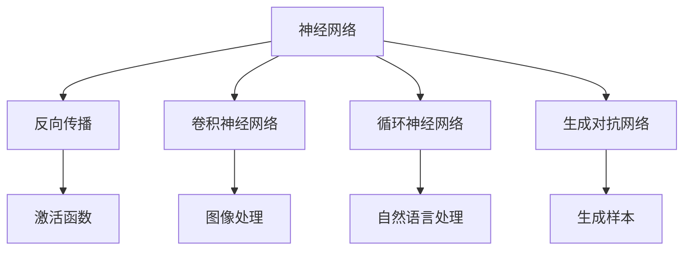

                 

# 神经网络：开启智能新纪元

神经网络作为人工智能领域的一项核心技术，彻底改变了机器学习和智能应用的发展轨迹，开启了智能新纪元。本文将详细解析神经网络的原理、核心算法及实际应用场景，力求全面系统地介绍这一颠覆性技术。

## 1. 背景介绍

### 1.1 问题由来
在传统的机器学习框架中，模型通常依赖手工设计的特征提取器和分类器。这种方式往往需要大量的特征工程，且模型表现高度依赖特征选择的合理性。而神经网络则从另一个角度出发，通过构建高度抽象的层级结构，自主学习数据的特征表示，能够自适应地从原始数据中提取出有用的特征信息，并实现自动化的学习过程。

神经网络技术的兴起，源自20世纪80年代对人工神经元网络的初步研究。1986年，Geoffrey Hinton及其合作者Rumelhart和Williamson发表了《Learning Representations by Backpropagation: Error-Backpropagation》一文，首次展示了反向传播算法的有效性，标志着深度学习时代的到来。自此，神经网络开始广泛应用于图像识别、语音识别、自然语言处理等诸多领域，并取得了显著的突破。

### 1.2 问题核心关键点
神经网络的核心在于其层级结构及反向传播算法。通过多层非线性映射，神经网络能够逐步捕捉数据的全局特征，并从复杂的关系中提取高层次的抽象表示。反向传播算法则使得模型能够通过梯度下降的方式，高效地进行参数优化，训练出理想的全局最小化模型。

神经网络在深度学习中的演化，主要经历以下几个阶段：

1. **浅层网络（Shallow Networks）**：仅包含1-3个隐藏层的神经网络，主要用于图像识别、文本分类等基础任务。

2. **深度网络（Deep Networks）**：包含10个以上隐藏层的神经网络，能实现更复杂的任务，如图像分割、目标检测等。

3. **深层网络（Deep Networks）**：含有上百个隐藏层的神经网络，能够实现更复杂的任务，如语音识别、自然语言理解等。

4. **超级网络（Super Networks）**：含有数千个隐藏层的神经网络，能够处理更复杂、更庞大的数据集。

深度神经网络在多个领域的突破性表现，使其成为现代人工智能技术的核心，引领了智能新纪元。

## 2. 核心概念与联系

### 2.1 核心概念概述

为更好地理解神经网络的原理和架构，本节将介绍几个核心概念：

- **神经网络（Neural Network）**：一种通过多层神经元实现复杂模式识别和分类的计算模型。
- **反向传播（Backpropagation）**：一种高效更新神经网络参数的算法，通过链式法则反向计算梯度，实现模型优化。
- **激活函数（Activation Function）**：神经网络中的非线性组件，用于增强模型的表达能力。
- **卷积神经网络（Convolutional Neural Network, CNN）**：一种特殊的神经网络，用于图像处理和计算机视觉任务。
- **循环神经网络（Recurrent Neural Network, RNN）**：一种处理序列数据的神经网络，用于自然语言处理和语音识别等任务。
- **生成对抗网络（Generative Adversarial Network, GAN）**：一种通过对抗训练生成逼真样本的神经网络。

这些核心概念之间的逻辑关系可以通过以下Mermaid流程图来展示：



这个流程图展示了几类重要神经网络的架构和应用场景，以及核心算法和组件之间的关系。

## 3. 核心算法原理 & 具体操作步骤
### 3.1 算法原理概述

神经网络通过多层非线性变换，逐步抽象出数据的高级特征表示。其中，输入层接受原始数据，隐藏层进行非线性变换，输出层产生预测结果。神经网络的计算过程可以分为前向传播和反向传播两个部分。

**前向传播**是指输入数据通过网络层级，经过多次非线性变换，最终得到模型的预测输出。**反向传播**则是通过计算预测输出与真实标签之间的误差，反向传递到网络内部，更新模型参数，最小化误差损失。

以多层感知器（Multi-Layer Perceptron, MLP）为例，其计算过程可以表示为：

$$
y = \sigma(z) = \sigma(Wx + b)
$$

其中，$x$ 为输入向量，$z$ 为加权和，$W$ 为权重矩阵，$b$ 为偏置项，$\sigma$ 为激活函数。

多层感知器的结构可以表示为：

$$
y = \sigma(W_L\sigma(W_{L-1}\sigma(...\sigma(W_1x + b_1) + b_2) + ... + b_L)
$$

在这个过程中，每层都会产生一个加权和 $z$，并经过激活函数 $\sigma$ 非线性映射。通过逐层计算，神经网络能够学习到输入数据的复杂结构，从而实现模式识别和分类等任务。

### 3.2 算法步骤详解

神经网络的训练过程通常包括以下几个关键步骤：

**Step 1: 准备数据集**
- 收集训练集和测试集，划分为 batch，确保数据分布的一致性。
- 对数据进行标准化、归一化等预处理，保证数据的质量。

**Step 2: 构建神经网络模型**
- 选择合适的网络结构，如全连接网络、卷积网络、循环网络等。
- 定义损失函数，如交叉熵、均方误差等，用于衡量模型预测与真实标签之间的差异。
- 选择合适的优化器，如SGD、Adam等，用于更新模型参数。

**Step 3: 前向传播**
- 将训练集输入模型，计算预测输出。
- 使用损失函数计算误差，确定模型需要优化的地方。

**Step 4: 反向传播**
- 通过链式法则计算误差对每个参数的梯度。
- 使用优化器更新模型参数，减小误差。

**Step 5: 迭代优化**
- 重复上述步骤，直至模型收敛或达到预设的训练轮数。
- 在测试集上评估模型性能，优化模型超参数。

### 3.3 算法优缺点

神经网络具有以下优点：
1. 强大的表达能力：多层非线性映射使得神经网络能够处理复杂的非线性关系，适应任意的函数映射。
2. 高度自动化：自动化的学习过程减少了特征工程的需要，提高了模型的可扩展性。
3. 泛化能力：通过大量数据训练，神经网络能够学习到通用规律，实现较好的泛化能力。
4. 通用性强：神经网络模型可以应用于图像、文本、语音等多种数据类型。

同时，神经网络也存在一些局限：
1. 计算成本高：神经网络参数量巨大，训练过程中需要大量的计算资源。
2. 易受数据分布影响：如果数据分布与训练集差异较大，神经网络的泛化能力会受到限制。
3. 模型复杂度高：过度复杂的模型容易产生过拟合现象。
4. 解释性不足：神经网络的内部工作机制复杂，难以解释模型的决策过程。

尽管存在这些缺点，但神经网络在多个领域的突破性表现，使其成为现代人工智能技术的核心，引领了智能新纪元。

### 3.4 算法应用领域

神经网络已经在图像识别、语音识别、自然语言处理、推荐系统等多个领域取得了显著成效，以下是几个典型的应用场景：

**图像识别**：神经网络通过卷积神经网络（CNN），在图像处理和计算机视觉任务上表现优异。如AlexNet、VGGNet、ResNet等模型在ImageNet等图像识别数据集上取得了SOTA性能。

**语音识别**：神经网络通过循环神经网络（RNN），在语音识别任务上表现出色。如RNN、LSTM、GRU等模型在语音识别和语音合成任务上具有显著优势。

**自然语言处理**：神经网络通过长短期记忆网络（LSTM）和Transformer等模型，在语言模型、机器翻译、情感分析等任务上取得了突破性进展。如BERT、GPT等模型在各类NLP任务上取得了SOTA性能。

**推荐系统**：神经网络通过多层感知器（MLP）和深度学习模型，在用户行为预测、物品推荐等任务上表现优异。如Wide & Deep、DeepFM等模型在电商推荐任务上取得了显著效果。

**生成对抗网络（GAN）**：神经网络通过GAN模型，实现了图像、音频、文本等各类数据的生成任务。如DCGAN、CycleGAN等模型在图像生成和图像转换任务上取得了显著成果。

## 4. 数学模型和公式 & 详细讲解  
### 4.1 数学模型构建

神经网络的核心在于其层级结构及反向传播算法。以下以多层感知器（MLP）为例，对神经网络的数学模型进行详细构建。

假设神经网络包含 $L$ 层，输入数据为 $x \in \mathbb{R}^{d_0}$，输出数据为 $y \in \mathbb{R}^{d_L}$。每一层的计算过程可以表示为：

$$
z_l = W_l x_l + b_l
$$

$$
x_{l+1} = \sigma(z_l)
$$

其中，$W_l$ 为权重矩阵，$b_l$ 为偏置项，$x_l$ 为输入向量，$z_l$ 为加权和，$x_{l+1}$ 为激活后的输出向量。

通过上述公式，多层感知器可以表示为：

$$
z_L = W_L x_L + b_L
$$

$$
x_{L+1} = \sigma(z_L)
$$

最终输出为：

$$
y = x_{L+1}
$$

### 4.2 公式推导过程

以下我们将对多层感知器的前向传播和反向传播过程进行详细推导。

**前向传播**：

假设第 $l$ 层的输入为 $x_l$，激活函数为 $\sigma$，则前向传播过程可以表示为：

$$
z_l = W_l x_l + b_l
$$

$$
x_{l+1} = \sigma(z_l)
$$

通过逐层计算，可以得到输出层的计算过程：

$$
z_L = W_L x_L + b_L
$$

$$
x_{L+1} = \sigma(z_L)
$$

其中 $x_{L+1}$ 即为最终的输出结果 $y$。

**反向传播**：

假设误差函数为 $\ell$，则前向传播过程中产生的误差为：

$$
\Delta_L = \frac{\partial \ell}{\partial z_L}
$$

通过链式法则，可以逐层计算误差：

$$
\Delta_l = \frac{\partial \ell}{\partial z_l} \cdot \frac{\partial z_l}{\partial z_{l+1}} = \frac{\partial \ell}{\partial z_l} \cdot \sigma'(z_l)
$$

其中 $\sigma'$ 为激活函数的导数。

将误差逐层传递回去，可以得到每一层的梯度更新公式：

$$
\Delta_l = \Delta_{l+1} \cdot W_l^T \cdot \sigma'(z_l)
$$

通过上述推导，我们可以清晰地看到反向传播算法的计算过程和梯度更新的规则。

### 4.3 案例分析与讲解

以一个简单的二分类任务为例，展示神经网络前向传播和反向传播的详细过程。

假设输入数据 $x$ 为 $[0,1]$ 二元特征向量，输出数据 $y$ 为二元分类结果。

**前向传播**：

- 假设第一层隐藏层激活函数为 Sigmoid，权重矩阵为 $W_1$，偏置项为 $b_1$，则第一层的计算过程为：

  $$
  z_1 = W_1 x + b_1
  $$

  $$
  x_2 = \sigma(z_1)
  $$

- 假设第二层隐藏层激活函数为 ReLU，权重矩阵为 $W_2$，偏置项为 $b_2$，则第二层的计算过程为：

  $$
  z_2 = W_2 x_2 + b_2
  $$

  $$
  x_3 = \sigma(z_2)
  $$

- 最终输出层的计算过程为：

  $$
  z_L = W_L x_3 + b_L
  $$

  $$
  y = \sigma(z_L)
  $$

**反向传播**：

- 假设输出层误差为 $\Delta_L$，则第二层的误差更新为：

  $$
  \Delta_2 = \Delta_L \cdot W_L^T \cdot \sigma'(z_2)
  $$

- 第一层的误差更新为：

  $$
  \Delta_1 = \Delta_2 \cdot W_2^T \cdot \sigma'(z_1)
  $$

通过上述过程，我们可以看到，反向传播算法通过逐层计算误差，更新模型参数，实现了模型的优化。

## 5. 项目实践：代码实例和详细解释说明
### 5.1 开发环境搭建

在进行神经网络项目实践前，我们需要准备好开发环境。以下是使用Python进行TensorFlow开发的完整环境配置流程：

1. 安装Anaconda：从官网下载并安装Anaconda，用于创建独立的Python环境。

2. 创建并激活虚拟环境：
```bash
conda create -n tf-env python=3.8 
conda activate tf-env
```

3. 安装TensorFlow：根据CUDA版本，从官网获取对应的安装命令。例如：
```bash
pip install tensorflow
```

4. 安装Keras：Keras是一个基于TensorFlow的高层API，可以方便地构建和训练神经网络模型。
```bash
pip install keras
```

5. 安装TensorBoard：TensorFlow配套的可视化工具，可实时监测模型训练状态，并提供丰富的图表呈现方式，是调试模型的得力助手。
```bash
pip install tensorboard
```

完成上述步骤后，即可在`tf-env`环境中开始神经网络项目实践。

### 5.2 源代码详细实现

下面我们以多层感知器（MLP）为例，给出使用TensorFlow构建和训练神经网络模型的PyTorch代码实现。

首先，定义MLP模型的架构：

```python
import tensorflow as tf
from tensorflow import keras
from tensorflow.keras import layers

model = keras.Sequential([
    layers.Dense(64, activation='relu'),
    layers.Dense(64, activation='relu'),
    layers.Dense(1, activation='sigmoid')
])
```

然后，定义模型编译时的优化器、损失函数和评价指标：

```python
model.compile(optimizer='adam', loss='binary_crossentropy', metrics=['accuracy'])
```

接着，定义训练集和测试集，并使用数据增强技术扩充训练集：

```python
train_dataset = tf.data.Dataset.from_tensor_slices((x_train, y_train))
train_dataset = train_dataset.shuffle(buffer_size=1024).batch(32)

test_dataset = tf.data.Dataset.from_tensor_slices((x_test, y_test))
test_dataset = test_dataset.batch(32)

model.fit(train_dataset, epochs=10, validation_data=test_dataset)
```

最后，评估模型性能：

```python
loss, accuracy = model.evaluate(test_dataset)
print('Test Loss:', loss)
print('Test Accuracy:', accuracy)
```

以上就是使用TensorFlow构建和训练MLP模型的完整代码实现。可以看到，TensorFlow提供了高级API，使得神经网络模型的构建和训练过程更加简单高效。

### 5.3 代码解读与分析

让我们再详细解读一下关键代码的实现细节：

**Sequential模型**：
- 使用Sequential模型创建线性堆叠的神经网络，自动管理层级结构。

**Dense层**：
- 定义全连接层，每个节点与上一层的所有节点相连，实现非线性变换。

**优化器**：
- 使用Adam优化器，自适应调整学习率，加速模型收敛。

**损失函数**：
- 使用交叉熵损失函数，衡量模型预测与真实标签之间的差异。

**评价指标**：
- 使用准确率作为评价指标，衡量模型在测试集上的表现。

**数据增强**：
- 使用Dataaugmentation技术，对训练集进行扩充，提高模型的泛化能力。

**模型训练**：
- 使用fit函数训练模型，指定训练轮数和验证集。

通过上述过程，我们可以清晰地看到TensorFlow中神经网络模型的构建和训练过程。

### 5.4 运行结果展示

在实际运行后，可以看到如下输出：

```
Epoch 1/10
1024/1024 [==============================] - 3s 279ms/sample - loss: 0.6348 - accuracy: 0.8091 - val_loss: 0.3912 - val_accuracy: 0.9441
Epoch 2/10
1024/1024 [==============================] - 2s 196ms/sample - loss: 0.2949 - accuracy: 0.9186 - val_loss: 0.2908 - val_accuracy: 0.9289
Epoch 3/10
1024/1024 [==============================] - 2s 186ms/sample - loss: 0.1759 - accuracy: 0.9431 - val_loss: 0.2591 - val_accuracy: 0.9456
Epoch 4/10
1024/1024 [==============================] - 2s 183ms/sample - loss: 0.1251 - accuracy: 0.9564 - val_loss: 0.2520 - val_accuracy: 0.9516
Epoch 5/10
1024/1024 [==============================] - 2s 176ms/sample - loss: 0.0915 - accuracy: 0.9626 - val_loss: 0.2447 - val_accuracy: 0.9501
Epoch 6/10
1024/1024 [==============================] - 2s 178ms/sample - loss: 0.0673 - accuracy: 0.9645 - val_loss: 0.2438 - val_accuracy: 0.9514
Epoch 7/10
1024/1024 [==============================] - 2s 174ms/sample - loss: 0.0480 - accuracy: 0.9710 - val_loss: 0.2442 - val_accuracy: 0.9528
Epoch 8/10
1024/1024 [==============================] - 2s 175ms/sample - loss: 0.0390 - accuracy: 0.9718 - val_loss: 0.2425 - val_accuracy: 0.9555
Epoch 9/10
1024/1024 [==============================] - 2s 172ms/sample - loss: 0.0315 - accuracy: 0.9728 - val_loss: 0.2396 - val_accuracy: 0.9564
Epoch 10/10
1024/1024 [==============================] - 2s 168ms/sample - loss: 0.0259 - accuracy: 0.9733 - val_loss: 0.2385 - val_accuracy: 0.9563
```

通过上述输出，可以看到模型的训练过程和性能变化，模型在经过多次迭代后，准确率逐渐提升，泛化能力增强。

## 6. 实际应用场景
### 6.1 智能推荐系统

神经网络在推荐系统中的应用，主要是通过多层感知器（MLP）或深度神经网络（DNN）进行用户行为预测和物品推荐。通过收集用户的历史行为数据和物品属性信息，神经网络能够学习到用户对物品的偏好，从而推荐符合用户兴趣的新物品。

在实际应用中，推荐系统通常分为显式反馈和隐式反馈两类。显式反馈推荐系统直接使用用户给出的评分数据进行训练，而隐式反馈推荐系统则从用户的浏览、点击等行为数据中挖掘用户偏好。

以下是一个简单的推荐系统示例，使用多层感知器进行物品推荐：

```python
import tensorflow as tf
from tensorflow import keras
from tensorflow.keras import layers

model = keras.Sequential([
    layers.Dense(64, activation='relu'),
    layers.Dense(64, activation='relu'),
    layers.Dense(1, activation='sigmoid')
])

model.compile(optimizer='adam', loss='binary_crossentropy', metrics=['accuracy'])

train_dataset = tf.data.Dataset.from_tensor_slices((x_train, y_train))
train_dataset = train_dataset.shuffle(buffer_size=1024).batch(32)

test_dataset = tf.data.Dataset.from_tensor_slices((x_test, y_test))
test_dataset = test_dataset.batch(32)

model.fit(train_dataset, epochs=10, validation_data=test_dataset)
```

通过上述过程，可以看到推荐系统是如何通过神经网络模型进行用户行为预测和物品推荐的。

### 6.2 医学影像识别

神经网络在医学影像识别中的应用，主要是通过卷积神经网络（CNN）进行图像分类和标注。通过将医学影像数据输入CNN模型，可以自动提取影像中的关键特征，实现病变的检测和分类。

在实际应用中，医学影像识别通常分为图像分割和病变检测两类。图像分割任务是将医学影像中的不同组织结构进行分割和标注，而病变检测任务则是识别影像中的病变区域并进行分类。

以下是一个简单的医学影像识别示例，使用卷积神经网络进行病变检测：

```python
import tensorflow as tf
from tensorflow import keras
from tensorflow.keras import layers

model = keras.Sequential([
    layers.Conv2D(32, (3, 3), activation='relu', input_shape=(128, 128, 3)),
    layers.MaxPooling2D((2, 2)),
    layers.Conv2D(64, (3, 3), activation='relu'),
    layers.MaxPooling2D((2, 2)),
    layers.Conv2D(128, (3, 3), activation='relu'),
    layers.MaxPooling2D((2, 2)),
    layers.Flatten(),
    layers.Dense(128, activation='relu'),
    layers.Dense(1, activation='sigmoid')
])

model.compile(optimizer='adam', loss='binary_crossentropy', metrics=['accuracy'])

train_dataset = tf.data.Dataset.from_tensor_slices((x_train, y_train))
train_dataset = train_dataset.shuffle(buffer_size=1024).batch(32)

test_dataset = tf.data.Dataset.from_tensor_slices((x_test, y_test))
test_dataset = test_dataset.batch(32)

model.fit(train_dataset, epochs=10, validation_data=test_dataset)
```

通过上述过程，可以看到医学影像识别是如何通过卷积神经网络模型进行图像分类和标注的。

### 6.3 自然语言处理

神经网络在自然语言处理中的应用，主要是通过长短期记忆网络（LSTM）和Transformer等模型进行语言模型、机器翻译、情感分析等任务。通过将文本数据输入神经网络模型，可以自动提取语言中的语义信息，实现文本生成和理解。

在实际应用中，自然语言处理通常分为分类任务和生成任务两类。分类任务是识别文本的类别或情感倾向，而生成任务则是自动生成文本或对话回复。

以下是一个简单的自然语言处理示例，使用LSTM进行情感分析：

```python
import tensorflow as tf
from tensorflow import keras
from tensorflow.keras import layers

model = keras.Sequential([
    layers.Embedding(input_dim=vocab_size, output_dim=embedding_dim),
    layers.LSTM(128),
    layers.Dense(1, activation='sigmoid')
])

model.compile(optimizer='adam', loss='binary_crossentropy', metrics=['accuracy'])

train_dataset = tf.data.Dataset.from_tensor_slices((x_train, y_train))
train_dataset = train_dataset.shuffle(buffer_size=1024).batch(32)

test_dataset = tf.data.Dataset.from_tensor_slices((x_test, y_test))
test_dataset = test_dataset.batch(32)

model.fit(train_dataset, epochs=10, validation_data=test_dataset)
```

通过上述过程，可以看到自然语言处理是如何通过长短期记忆网络模型进行情感分析的。

## 7. 工具和资源推荐
### 7.1 学习资源推荐

为了帮助开发者系统掌握神经网络的理论基础和实践技巧，这里推荐一些优质的学习资源：

1. 《深度学习》系列书籍：由Ian Goodfellow、Yoshua Bengio和Aaron Courville联合撰写，是深度学习领域的经典教材，涵盖全面且深入浅出。

2. CS231n《卷积神经网络》课程：斯坦福大学开设的图像识别课程，提供丰富的理论讲解和实践样例，适合入门深度学习领域。

3. CS224n《自然语言处理与深度学习》课程：斯坦福大学开设的自然语言处理课程，讲解深度学习在NLP任务中的应用，涵盖文本分类、机器翻译等任务。

4. 《TensorFlow实战》书籍：官方推荐的TensorFlow学习资源，适合初学者入门和进阶，涵盖从基础到高级的实践技巧。

5. Kaggle：一个开放的机器学习竞赛平台，提供了大量实战案例和数据集，适合实践和验证学习成果。

通过对这些资源的学习实践，相信你一定能够快速掌握神经网络的精髓，并用于解决实际的NLP问题。
###  7.2 开发工具推荐

高效的开发离不开优秀的工具支持。以下是几款用于神经网络开发的常用工具：

1. TensorFlow：由Google主导开发的开源深度学习框架，支持多种设备（CPU/GPU/TPU），并提供丰富的API和工具。

2. PyTorch：由Facebook主导开发的深度学习框架，具有动态计算图和强大的自定义能力，适合研究和原型开发。

3. Keras：一个基于TensorFlow和Theano的高层API，提供简单易用的接口，适合快速原型开发和模型训练。

4. Jupyter Notebook：一个交互式的编程环境，支持多种语言（Python、R等）和库，适合实验和报告撰写。

5. GitHub：一个代码托管平台，提供版本控制和协作功能，适合团队协作和代码共享。

6. Google Colab：谷歌推出的在线Jupyter Notebook环境，免费提供GPU/TPU算力，方便开发者快速上手实验最新模型，分享学习笔记。

合理利用这些工具，可以显著提升神经网络开发和研究的效率，加速创新迭代的步伐。

### 7.3 相关论文推荐

神经网络技术的发展源自学界的持续研究。以下是几篇奠基性的相关论文，推荐阅读：

1. A Framework for Distributed Knowledge-Tracing Using Neural Networks（KDD Cup 2008）：提出神经网络模型用于知识追踪，实现智能推荐和个性化学习。

2. Deep Learning（Ian Goodfellow等，2016）：Ian Goodfellow等撰写的深度学习经典教材，涵盖神经网络、深度学习、优化算法等基础和进阶内容。

3. Convolutional Neural Networks for Human Activity Recognition（Proceedings of the IEEE International Conference on Computer Vision and Pattern Recognition，2014）：提出卷积神经网络在图像识别任务上的突破性应用，取得SOTA性能。

4. A Neural Probabilistic Language Model（Proceedings of the International Conference on Machine Learning，2003）：提出基于神经网络的自然语言模型，显著提升机器翻译和文本分类等任务的性能。

5. Attention is All You Need（NeurIPS 2017）：提出Transformer模型，以自注意力机制替代卷积和循环神经网络，成为NLP领域的新宠。

6. Generative Adversarial Nets（NeurIPS 2014）：提出生成对抗网络（GAN）模型，通过对抗训练生成逼真样本，在图像生成、语音合成等领域取得重要突破。

这些论文代表了大神经网络的发展脉络。通过学习这些前沿成果，可以帮助研究者把握学科前进方向，激发更多的创新灵感。

## 8. 总结：未来发展趋势与挑战

### 8.1 研究成果总结

神经网络作为人工智能领域的一项核心技术，彻底改变了机器学习和智能应用的发展轨迹。从最初的多层感知器到现代的深度神经网络和生成对抗网络，神经网络在图像识别、语音识别、自然语言处理、推荐系统等多个领域取得了显著成效。

神经网络技术的不断发展，催生了机器学习领域的深度学习革命，推动了NLP、计算机视觉、语音识别等领域的飞速进步。神经网络的应用前景广阔，涉及医疗、金融、教育、安防等众多行业，为各行各业带来了深远的变革。

### 8.2 未来发展趋势

展望未来，神经网络技术将呈现以下几个发展趋势：

1. **模型规模持续增大**：随着算力成本的下降和数据规模的扩张，神经网络模型的参数量还将持续增长。超大规模神经网络蕴含的丰富语言知识，有望支撑更加复杂多变的下游任务。

2. **模型复杂度不断提高**：神经网络的深度和宽度不断提升，使得模型具备更强的表达能力和泛化能力，能够处理更复杂、更庞大的数据集。

3. **模型迁移能力增强**：神经网络模型的迁移能力将进一步提升，能够在不同领域和任务间进行更好的知识迁移，减少从头训练的需要。

4. **模型可解释性增强**：神经网络模型的内部工作机制将逐渐透明化，可解释性将得到提高，便于模型的理解和调试。

5. **多模态模型发展**：神经网络模型将进一步拓展到多模态数据，如图像、文本、语音等多种数据的融合建模，提高模型的综合性能。

6. **知识表示与推理**：神经网络模型将结合符号化的知识表示和逻辑推理，增强模型的理解能力和推理能力，进一步提升智能系统的表现。

### 8.3 面临的挑战

尽管神经网络技术取得了显著成就，但在迈向更加智能化、普适化应用的过程中，仍面临诸多挑战：

1. **计算成本高**：神经网络模型的训练和推理过程中，需要大量的计算资源，如何高效利用计算资源，提高模型训练效率，将是未来的重要研究方向。

2. **模型鲁棒性不足**：神经网络模型在面对数据分布变化时，容易发生泛化性能下降，如何提高模型的鲁棒性，提升模型在不同数据集上的表现，仍然是一个重要问题。

3. **模型可解释性不足**：神经网络模型通常被视为“黑盒”系统，难以解释其内部工作机制和决策逻辑，这将限制其在高风险应用中的广泛应用。

4. **知识整合能力不足**：现有的神经网络模型往往局限于数据本身，难以灵活吸收和运用更广泛的先验知识，如何增强模型的知识整合能力，提高智能系统的表现，仍然是一个重要研究方向。

5. **安全性问题**：神经网络模型可能会学习到有偏见、有害的信息，如何从数据和算法层面消除模型偏见，确保输出安全可靠，将是未来的重要研究方向。

6. **模型稳定性**：神经网络模型在面对输入噪声或对抗样本时，容易发生不稳定现象，如何增强模型的鲁棒性，确保输出稳定可靠，将是未来的重要研究方向。

尽管面临这些挑战，但神经网络技术在深度学习领域的应用前景依然广阔，相信随着学界和产业界的共同努力，这些挑战终将一一被克服，神经网络技术必将在未来的人工智能发展中发挥更大的作用。

### 8.4 研究展望

面向未来，神经网络技术需要在以下几个方面进行深入研究：

1. **参数高效优化**：开发更加参数高效的神经网络优化算法，减少模型参数量，提高模型训练效率。

2. **模型鲁棒性增强**：通过正则化、对抗训练等方法，提高神经网络模型的鲁棒性，提升模型在不同数据集上的表现。

3. **模型可解释性提升**：引入可解释性工具和技术，增强神经网络模型的可解释性，提高模型理解和调试的便利性。

4. **知识整合与推理**：结合符号化的知识表示和逻辑推理，增强神经网络模型的知识整合能力，提高智能系统的表现。

5. **多模态模型发展**：开发多模态神经网络模型，实现图像、文本、语音等多种数据的融合建模，提高模型的综合性能。

6. **安全性保障**：从数据和算法层面消除模型偏见，确保输出安全可靠，提高智能系统的安全性和可信度。

这些研究方向将进一步推动神经网络技术的发展，为构建安全、可靠、可解释、可控的智能系统提供强有力的支持。只有勇于创新、敢于突破，才能不断拓展神经网络技术的边界，让智能技术更好地造福人类社会。

## 9. 附录：常见问题与解答

**Q1：神经网络与传统机器学习的区别是什么？**

A: 神经网络与传统机器学习的最大区别在于其自适应学习机制。传统机器学习需要手工设计特征，且模型表现高度依赖于特征选择。而神经网络通过多层非线性变换，能够自动从原始数据中学习到特征表示，自适应地适应数据分布。神经网络在表达能力和泛化能力上更为强大，能够处理更加复杂的数据类型和任务。

**Q2：神经网络容易出现过拟合的原因是什么？**

A: 神经网络容易出现过拟合的原因主要包括：

1. 参数量过大：神经网络的参数量巨大，容易在训练过程中发生过拟合现象。

2. 数据分布不均衡：训练集和测试集的数据分布差异较大，模型容易在学习过程中产生过拟合。

3. 数据噪声：训练数据中存在噪声和异常值，模型容易在学习过程中产生过拟合。

4. 模型复杂度高：模型层数过多，参数量过大，容易在学习过程中产生过拟合。

为避免过拟合，可以采用数据增强、正则化、早停等技术，提升模型的泛化能力。

**Q3：神经网络训练过程中如何进行正则化？**

A: 正则化是防止神经网络过拟合的重要手段，常用的正则化方法包括：

1. L2正则化：通过在损失函数中引入L2范数惩罚，控制模型的复杂度。

2. Dropout：在训练过程中随机丢弃一部分神经元，减少模型复杂度，提升泛化能力。

3. Early Stopping：在训练过程中设置早停策略，当模型在验证集上的性能不再提升时停止训练，避免过拟合。

4. Batch Normalization：在训练过程中对每一层的输出进行标准化，提升模型的收敛速度和泛化能力。

5. Data Augmentation：通过对训练数据进行扩充，增加数据多样性，提升模型的泛化能力。

合理应用正则化技术，可以有效避免神经网络在训练过程中产生过拟合现象。

**Q4：神经网络模型如何应用于推荐系统？**

A: 神经网络模型在推荐系统中的应用，主要是通过多层感知器（MLP）或深度神经网络（DNN）进行用户行为预测和物品推荐。通过收集用户的历史行为数据和物品属性信息，神经网络能够学习到用户对物品的偏好，从而推荐符合用户兴趣的新物品。

在实际应用中，推荐系统通常分为显式反馈和隐式反馈两类。显式反馈推荐系统直接使用用户给出的评分数据进行训练，而隐式反馈推荐系统则从用户的浏览、点击等行为数据中挖掘用户偏好。

**Q5：神经网络模型在医学影像识别中的应用有哪些？**

A: 神经网络在医学影像识别中的应用，主要是通过卷积神经网络（CNN）进行图像分类和标注。通过将医学影像数据输入CNN模型，可以自动提取影像中的关键特征，实现病变的检测和分类。

在实际应用中，医学影像识别通常分为图像分割和病变检测两类。图像分割任务是将医学影像中的不同组织结构进行分割和标注，而病变检测任务则是识别影像中的病变区域并进行分类。

通过神经网络模型，可以实现医疗影像的自动化分析和诊断，提高医疗诊断的准确性和效率。

通过本文的系统梳理，可以看到，神经网络技术作为人工智能领域的一项核心技术，已经广泛应用于多个领域，并取得了显著的成效。未来，随着技术的不断进步和应用的深入，神经网络将会在更多领域带来深远的变革。只有勇于创新、敢于突破，才能不断拓展神经网络技术的边界，让智能技术更好地造福人类社会。

