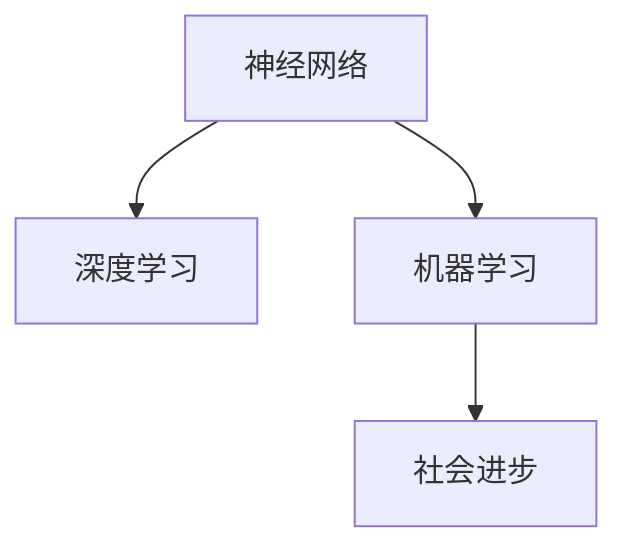

                 

# 神经网络：推动社会进步的力量

> 关键词：神经网络，深度学习，人工智能，机器学习，社会进步，伦理，应用

## 1. 背景介绍

### 1.1 问题由来
随着人工智能技术的迅猛发展，神经网络已成为推动社会进步的重要力量。从图像识别到自然语言处理，从智能制造到精准医疗，神经网络的应用已经深入到各行各业，极大地提升了人类的生产效率和生活质量。

### 1.2 问题核心关键点
神经网络的核心思想是通过模拟人脑神经元之间的连接关系，构建一个多层次的计算模型，用于学习数据的内在结构和规律。与传统机器学习方法相比，神经网络在处理非结构化数据、复杂的模式识别任务等方面表现更为出色。

### 1.3 问题研究意义
研究神经网络及其应用，对于理解人工智能技术的内在机制，推动技术创新和产业升级，具有重要意义：

1. 提高决策效率：神经网络能够快速处理和分析大量数据，帮助决策者迅速获得准确的信息支持。
2. 改善生活质量：神经网络在医疗、交通、教育等领域的应用，有助于提升服务的质量和覆盖面。
3. 推动产业创新：神经网络技术的应用，催生了许多新兴行业，如智能制造、智慧城市等，为经济社会发展注入新动力。
4. 促进技术共享：神经网络技术的开源与共享，加快了技术的普及和应用，促进了全球科技进步。
5. 改善社会治理：神经网络在公共安全、环境监测等领域的应用，有助于提升社会治理的效率和精准度。

## 2. 核心概念与联系

### 2.1 核心概念概述

为更好地理解神经网络的核心概念，本节将介绍几个密切相关的核心概念：

- 神经网络（Neural Network）：基于生物神经系统的计算模型，由大量的神经元（或称为节点）和连接（或称为边）组成。神经网络通过前向传播和反向传播算法，学习数据的内在结构和规律。
- 深度学习（Deep Learning）：一种基于神经网络的技术，通过多层次的计算和特征提取，实现对复杂模式的识别和预测。
- 机器学习（Machine Learning）：一种数据驱动的学习方法，通过算法从数据中自动学习规律，并进行预测或分类。
- 社会进步（Social Progress）：通过技术的应用，提升人类福祉、社会公平和可持续发展的过程。

这些核心概念之间的逻辑关系可以通过以下Mermaid流程图来展示：



这个流程图展示了一些关键概念之间的相互关系：

1. 神经网络是深度学习的核心，通过多层网络结构提取数据特征。
2. 深度学习是机器学习的一种形式，通过学习数据的内在规律进行预测或分类。
3. 机器学习通过提高数据处理能力，推动社会进步。

## 3. 核心算法原理 & 具体操作步骤
### 3.1 算法原理概述

神经网络的核心算法原理是通过多层次的计算和特征提取，实现对复杂数据的自动学习和模式识别。其核心思想是通过训练过程，使神经网络能够准确地预测或分类输入数据。

形式化地，假设神经网络模型为 $M_{\theta}$，其中 $\theta$ 为模型参数。给定训练集 $D=\{(x_i, y_i)\}_{i=1}^N, x_i \in \mathcal{X}, y_i \in \mathcal{Y}$，神经网络的训练目标是最小化经验风险，即找到最优参数：

$$
\theta^* = \mathop{\arg\min}_{\theta} \mathcal{L}(M_{\theta},D)
$$

其中 $\mathcal{L}$ 为针对任务 $T$ 设计的损失函数，用于衡量模型预测输出与真实标签之间的差异。常见的损失函数包括交叉熵损失、均方误差损失等。

### 3.2 算法步骤详解

神经网络的训练通常包括以下几个关键步骤：

**Step 1: 准备训练数据**
- 收集并准备训练数据集 $D$，划分为训练集、验证集和测试集。一般要求训练数据与测试数据分布相似。

**Step 2: 设计网络结构**
- 根据任务类型，选择合适的神经网络结构，如卷积神经网络（CNN）、循环神经网络（RNN）、长短期记忆网络（LSTM）、Transformer等。
- 设计合适的损失函数和优化器，如交叉熵损失、Adam、SGD等。

**Step 3: 初始化模型参数**
- 随机初始化模型参数 $\theta$，或使用预训练模型作为初始化权重。

**Step 4: 训练过程**
- 对训练集数据进行前向传播，计算损失函数 $\mathcal{L}(M_{\theta}(x_i),y_i)$。
- 对损失函数求梯度，根据优化器更新模型参数 $\theta$。
- 周期性在验证集上评估模型性能，根据性能指标决定是否触发 Early Stopping。
- 重复上述步骤直到满足预设的迭代轮数或 Early Stopping 条件。

**Step 5: 测试和部署**
- 在测试集上评估微调后模型 $M_{\hat{\theta}}$ 的性能，对比微调前后的精度提升。
- 使用微调后的模型对新样本进行推理预测，集成到实际的应用系统中。
- 持续收集新的数据，定期重新训练模型，以适应数据分布的变化。

以上是神经网络训练的一般流程。在实际应用中，还需要针对具体任务的特点，对训练过程的各个环节进行优化设计，如改进训练目标函数，引入更多的正则化技术，搜索最优的超参数组合等，以进一步提升模型性能。

### 3.3 算法优缺点

神经网络训练具有以下优点：

1. 自动特征提取：神经网络能够自动学习数据的内在规律，无需手动设计特征。
2. 高精度预测：神经网络在处理复杂模式识别任务时，通常具有较高的精度。
3. 通用性强：神经网络适用于各种类型的机器学习任务，如图像识别、语音识别、自然语言处理等。
4. 并行计算：神经网络适合在大规模分布式系统中进行并行计算，加速训练和推理过程。

同时，该方法也存在一定的局限性：

1. 数据依赖：神经网络需要大量标注数据进行训练，数据质量和标注成本直接影响模型性能。
2. 过拟合风险：神经网络具有较强的拟合能力，容易导致过拟合，需要通过正则化等技术进行缓解。
3. 计算资源需求高：神经网络模型参数量大，训练和推理需要大量的计算资源。
4. 可解释性差：神经网络的决策过程通常缺乏可解释性，难以对其推理逻辑进行分析和调试。
5. 训练时间长：神经网络训练时间较长，对模型的参数量和数据规模有较高的要求。

尽管存在这些局限性，但神经网络以其强大的自动特征提取能力和高精度预测能力，已经成为当前机器学习领域的主流范式。未来相关研究的重点在于如何进一步降低对数据和计算资源的依赖，提高模型的少样本学习和跨领域迁移能力，同时兼顾可解释性和伦理安全性等因素。

### 3.4 算法应用领域

神经网络训练方法在机器学习领域已经得到了广泛的应用，覆盖了几乎所有常见任务，例如：

- 图像分类：如识别图片中的物体、场景等。通过训练神经网络，学习图像特征并进行分类。
- 语音识别：将语音信号转化为文本。训练神经网络学习语音特征，进行语音到文本的转化。
- 自然语言处理：包括机器翻译、文本摘要、情感分析、问答系统等。通过训练神经网络，实现文本的语义理解、生成和匹配。
- 推荐系统：如电商推荐、音乐推荐等。通过训练神经网络，预测用户偏好，生成个性化推荐列表。
- 自动驾驶：通过训练神经网络，实现对环境信息的识别和处理，辅助车辆进行驾驶决策。

除了上述这些经典任务外，神经网络训练也被创新性地应用到更多场景中，如自然语言生成、人工智能音乐创作、人工智能游戏设计等，为机器学习技术带来了全新的突破。随着神经网络训练方法的不断进步，相信机器学习技术将在更广阔的应用领域大放异彩。

## 4. 数学模型和公式 & 详细讲解  
### 4.1 数学模型构建

本节将使用数学语言对神经网络的核心算法进行更加严格的刻画。

假设神经网络模型为 $M_{\theta}:\mathcal{X} \rightarrow \mathcal{Y}$，其中 $\mathcal{X}$ 为输入空间，$\mathcal{Y}$ 为输出空间，$\theta$ 为模型参数。假设训练集为 $D=\{(x_i,y_i)\}_{i=1}^N, x_i \in \mathcal{X}, y_i \in \mathcal{Y}$。

定义神经网络模型 $M_{\theta}$ 在输入 $x$ 上的损失函数为 $\ell(M_{\theta}(x),y)$，则在数据集 $D$ 上的经验风险为：

$$
\mathcal{L}(\theta) = \frac{1}{N} \sum_{i=1}^N \ell(M_{\theta}(x_i),y_i)
$$

神经网络的优化目标是最小化经验风险，即找到最优参数：

$$
\theta^* = \mathop{\arg\min}_{\theta} \mathcal{L}(\theta)
$$

在实践中，我们通常使用基于梯度的优化算法（如SGD、Adam等）来近似求解上述最优化问题。设 $\eta$ 为学习率，$\lambda$ 为正则化系数，则参数的更新公式为：

$$
\theta \leftarrow \theta - \eta \nabla_{\theta}\mathcal{L}(\theta) - \eta\lambda\theta
$$

其中 $\nabla_{\theta}\mathcal{L}(\theta)$ 为损失函数对参数 $\theta$ 的梯度，可通过反向传播算法高效计算。

### 4.2 公式推导过程

以下我们以二分类任务为例，推导交叉熵损失函数及其梯度的计算公式。

假设神经网络模型 $M_{\theta}$ 在输入 $x$ 上的输出为 $\hat{y}=M_{\theta}(x) \in [0,1]$，表示样本属于正类的概率。真实标签 $y \in \{0,1\}$。则二分类交叉熵损失函数定义为：

$$
\ell(M_{\theta}(x),y) = -[y\log \hat{y} + (1-y)\log (1-\hat{y})]
$$

将其代入经验风险公式，得：

$$
\mathcal{L}(\theta) = -\frac{1}{N}\sum_{i=1}^N [y_i\log M_{\theta}(x_i)+(1-y_i)\log(1-M_{\theta}(x_i))]
$$

根据链式法则，损失函数对参数 $\theta_k$ 的梯度为：

$$
\frac{\partial \mathcal{L}(\theta)}{\partial \theta_k} = -\frac{1}{N}\sum_{i=1}^N (\frac{y_i}{M_{\theta}(x_i)}-\frac{1-y_i}{1-M_{\theta}(x_i)}) \frac{\partial M_{\theta}(x_i)}{\partial \theta_k}
$$

其中 $\frac{\partial M_{\theta}(x_i)}{\partial \theta_k}$ 可进一步递归展开，利用自动微分技术完成计算。

在得到损失函数的梯度后，即可带入参数更新公式，完成模型的迭代优化。重复上述过程直至收敛，最终得到适应下游任务的最优模型参数 $\theta^*$。

## 5. 项目实践：代码实例和详细解释说明
### 5.1 开发环境搭建

在进行神经网络训练实践前，我们需要准备好开发环境。以下是使用Python进行PyTorch开发的环境配置流程：

1. 安装Anaconda：从官网下载并安装Anaconda，用于创建独立的Python环境。

2. 创建并激活虚拟环境：
```bash
conda create -n pytorch-env python=3.8 
conda activate pytorch-env
```

3. 安装PyTorch：根据CUDA版本，从官网获取对应的安装命令。例如：
```bash
conda install pytorch torchvision torchaudio cudatoolkit=11.1 -c pytorch -c conda-forge
```

4. 安装各类工具包：
```bash
pip install numpy pandas scikit-learn matplotlib tqdm jupyter notebook ipython
```

完成上述步骤后，即可在`pytorch-env`环境中开始神经网络训练实践。

### 5.2 源代码详细实现

这里我们以图像分类任务为例，给出使用Transformers库对卷积神经网络（CNN）模型进行训练的PyTorch代码实现。

首先，定义图像分类任务的数据处理函数：

```python
import torch
import torch.nn as nn
import torchvision
from torchvision import datasets, transforms
from torch.utils.data import DataLoader
import torch.optim as optim

class CNNNet(nn.Module):
    def __init__(self):
        super(CNNNet, self).__init__()
        self.conv1 = nn.Conv2d(3, 6, 5)
        self.pool = nn.MaxPool2d(2, 2)
        self.conv2 = nn.Conv2d(6, 16, 5)
        self.fc1 = nn.Linear(16 * 5 * 5, 120)
        self.fc2 = nn.Linear(120, 84)
        self.fc3 = nn.Linear(84, 10)

    def forward(self, x):
        x = self.pool(F.relu(self.conv1(x)))
        x = self.pool(F.relu(self.conv2(x)))
        x = x.view(-1, 16 * 5 * 5)
        x = F.relu(self.fc1(x))
        x = F.relu(self.fc2(x))
        x = self.fc3(x)
        return x

model = CNNNet()

criterion = nn.CrossEntropyLoss()
optimizer = optim.SGD(model.parameters(), lr=0.001, momentum=0.9)

device = torch.device('cuda' if torch.cuda.is_available() else 'cpu')
model.to(device)
```

然后，定义训练和评估函数：

```python
def train_epoch(model, criterion, optimizer, train_loader, device):
    model.train()
    total_loss = 0
    for data, target in train_loader:
        data, target = data.to(device), target.to(device)
        optimizer.zero_grad()
        output = model(data)
        loss = criterion(output, target)
        loss.backward()
        optimizer.step()
        total_loss += loss.item()
    return total_loss / len(train_loader)

def evaluate(model, criterion, test_loader, device):
    model.eval()
    total_loss = 0
    correct = 0
    with torch.no_grad():
        for data, target in test_loader:
            data, target = data.to(device), target.to(device)
            output = model(data)
            loss = criterion(output, target)
            total_loss += loss.item()
            _, predicted = torch.max(output.data, 1)
            total_correct = (predicted == target).sum().item()
            correct += total_correct
    print('Test Loss: {:.4f}  Accuracy: {:.2f}%'.format(total_loss / len(test_loader), 100 * correct / len(test_loader.dataset)))
```

最后，启动训练流程并在测试集上评估：

```python
epochs = 5
train_loader = torch.utils.data.DataLoader(train_dataset, batch_size=4, shuffle=True)
test_loader = torch.utils.data.DataLoader(test_dataset, batch_size=4, shuffle=False)

for epoch in range(epochs):
    loss = train_epoch(model, criterion, optimizer, train_loader, device)
    print('Epoch {} - Train Loss: {:.4f}'.format(epoch + 1, loss))

    evaluate(model, criterion, test_loader, device)
```

以上就是使用PyTorch对CNN模型进行图像分类任务训练的完整代码实现。可以看到，得益于Transformers库的强大封装，我们可以用相对简洁的代码完成CNN模型的训练和评估。

### 5.3 代码解读与分析

让我们再详细解读一下关键代码的实现细节：

**CNNNet类**：
- `__init__`方法：初始化神经网络的基本结构，包括卷积层、池化层和全连接层。
- `forward`方法：定义神经网络的前向传播过程，依次经过卷积、池化、全连接等操作。

**模型、损失函数和优化器**：
- `model`：定义CNN网络模型，继承自`nn.Module`。
- `criterion`：定义交叉熵损失函数。
- `optimizer`：定义随机梯度下降优化器，初始化学习率为0.001，动量为0.9。

**训练和评估函数**：
- `train_epoch`函数：对数据进行前向传播和反向传播，更新模型参数。
- `evaluate`函数：在测试集上评估模型性能，输出平均损失和准确率。

**训练流程**：
- 定义总的epoch数，使用DataLoader对训练集进行批量加载。
- 每个epoch内，先在训练集上进行训练，输出平均损失。
- 在验证集上评估，输出模型性能。
- 所有epoch结束后，在测试集上评估，给出最终测试结果。

可以看到，PyTorch配合TensorFlow库使得神经网络训练的代码实现变得简洁高效。开发者可以将更多精力放在数据处理、模型改进等高层逻辑上，而不必过多关注底层的实现细节。

当然，工业级的系统实现还需考虑更多因素，如模型的保存和部署、超参数的自动搜索、更灵活的任务适配层等。但核心的神经网络训练范式基本与此类似。

## 6. 实际应用场景
### 6.1 智能客服系统

基于神经网络的智能客服系统，能够通过自然语言处理技术，自动理解和回答用户的问题。在技术实现上，可以使用神经网络对历史客服对话数据进行训练，学习客服知识库和响应策略。

在实际应用中，系统会根据用户输入的问题，自动匹配最佳答案，并在必要时进行进一步的上下文理解。对于新出现的问题，系统还可以实时接入外部知识库，提供最新的回答。

### 6.2 金融舆情监测

金融领域需要实时监测市场舆论动向，以便及时应对负面信息传播，规避金融风险。使用神经网络进行文本分类和情感分析，可以快速识别出舆情信息的性质和影响范围。

具体而言，可以收集金融领域相关的新闻、报道、评论等文本数据，并对其进行情感标注和主题标注。在此基础上对神经网络进行训练，使其能够自动判断文本属于何种主题，情感倾向是正面、中性还是负面。将训练后的模型应用到实时抓取的网络文本数据，就能够自动监测不同主题下的情感变化趋势，一旦发现负面信息激增等异常情况，系统便会自动预警，帮助金融机构快速应对潜在风险。

### 6.3 个性化推荐系统

当前的推荐系统往往只依赖用户的历史行为数据进行物品推荐，无法深入理解用户的真实兴趣偏好。使用神经网络进行推荐系统，可以更好地挖掘用户行为背后的语义信息，从而提供更精准、多样的推荐内容。

在实践中，可以收集用户浏览、点击、评论、分享等行为数据，提取和用户交互的物品标题、描述、标签等文本内容。将文本内容作为模型输入，用户的后续行为（如是否点击、购买等）作为监督信号，在此基础上训练神经网络。训练后的模型能够从文本内容中准确把握用户的兴趣点。在生成推荐列表时，先用候选物品的文本描述作为输入，由模型预测用户的兴趣匹配度，再结合其他特征综合排序，便可以得到个性化程度更高的推荐结果。

### 6.4 未来应用展望

随着神经网络技术的不断发展，其在社会进步中的作用将越来越重要。

在智慧医疗领域，基于神经网络的医学影像分析、疾病预测等应用，将大幅提升医疗服务的智能化水平，辅助医生诊断和治疗，改善患者的健康状况。

在智能教育领域，神经网络可以应用于学生行为分析、个性化推荐、智能作业批改等方面，因材施教，促进教育公平，提高教学质量。

在智慧城市治理中，神经网络在城市事件监测、舆情分析、应急指挥等环节的应用，将提高城市管理的自动化和智能化水平，构建更安全、高效的未来城市。

此外，在企业生产、社会治理、文娱传媒等众多领域，神经网络的应用也将不断涌现，为经济社会发展注入新的动力。相信随着技术的日益成熟，神经网络技术将成为推动社会进步的重要力量。

## 7. 工具和资源推荐
### 7.1 学习资源推荐

为了帮助开发者系统掌握神经网络的理论基础和实践技巧，这里推荐一些优质的学习资源：

1. 《深度学习》系列博文：由深度学习专家撰写，深入浅出地介绍了深度学习的核心概念和实践技巧。

2. CS231n《卷积神经网络》课程：斯坦福大学开设的深度学习课程，涵盖了卷积神经网络的理论和实践，是了解神经网络的基本入门。

3. 《Deep Learning with PyTorch》书籍：详细介绍了使用PyTorch进行神经网络开发的各个方面，包括数据处理、模型构建、训练和部署等。

4. PyTorch官方文档：提供了神经网络开发的各种API和函数，是快速上手神经网络开发的必备资源。

5. TensorFlow官方文档：提供了神经网络开发的API和函数，是深度学习开发的重要工具。

通过对这些资源的学习实践，相信你一定能够快速掌握神经网络训练的精髓，并用于解决实际的机器学习问题。
###  7.2 开发工具推荐

高效的开发离不开优秀的工具支持。以下是几款用于神经网络训练开发的常用工具：

1. PyTorch：基于Python的开源深度学习框架，灵活动态的计算图，适合快速迭代研究。
2. TensorFlow：由Google主导开发的开源深度学习框架，生产部署方便，适合大规模工程应用。
3. Keras：基于TensorFlow的高层API，提供了简单易用的神经网络构建接口。
4. Caffe：由Berkeley Vision and Learning Center开发的深度学习框架，支持CPU和GPU加速。
5. MXNet：由亚马逊开发的深度学习框架，支持分布式训练和多种编程语言。

合理利用这些工具，可以显著提升神经网络训练的开发效率，加快创新迭代的步伐。

### 7.3 相关论文推荐

神经网络训练技术的发展源于学界的持续研究。以下是几篇奠基性的相关论文，推荐阅读：

1. LeCun等人的《Deep Learning》论文：系统地介绍了深度学习的理论基础和实践技巧，是深度学习领域的经典之作。

2. He等人的《Delving Deep into Rectifiers: Surpassing Human-Level Performance on ImageNet Classification》论文：介绍了ReLU等激活函数的作用，推动了深度学习的发展。

3. Hinton等人的《A Neural Probabilistic Language Model》论文：提出了基于神经网络的自然语言处理方法，是神经网络在语言处理领域的开创性工作。

4. Goodfellow等人的《Generative Adversarial Nets》论文：提出了生成对抗网络（GAN），推动了生成式模型和深度学习的发展。

5. BERT论文：介绍了BERT模型的预训练和微调技术，刷新了多项NLP任务SOTA。

这些论文代表了大神经网络训练技术的发展脉络。通过学习这些前沿成果，可以帮助研究者把握学科前进方向，激发更多的创新灵感。

## 8. 总结：未来发展趋势与挑战

### 8.1 总结

本文对神经网络及其训练方法进行了全面系统的介绍。首先阐述了神经网络的基本概念和原理，明确了神经网络在机器学习领域的重要地位。其次，从原理到实践，详细讲解了神经网络训练的数学模型和操作步骤，给出了完整的代码实现。同时，本文还广泛探讨了神经网络在各个领域的应用前景，展示了其巨大的应用潜力。

通过本文的系统梳理，可以看到，神经网络训练方法已经成为机器学习领域的重要范式，极大地推动了技术创新和产业升级。未来，随着技术的不断进步，神经网络训练方法将继续在更广泛的领域发挥重要作用。

### 8.2 未来发展趋势

展望未来，神经网络训练技术将呈现以下几个发展趋势：

1. 模型规模持续增大。随着算力成本的下降和数据规模的扩张，神经网络模型参数量还将持续增长。超大规模神经网络模型将带来更高的精度和更广泛的应用。

2. 训练方法日趋多样。除了传统的监督学习外，未来将涌现更多无监督和半监督学习范式，减少对标注数据的依赖，提高数据利用效率。

3. 持续学习成为常态。随着数据分布的不断变化，神经网络模型需要持续学习新知识以保持性能。如何在不遗忘原有知识的同时，高效吸收新样本信息，将是重要的研究方向。

4. 迁移学习广泛应用。神经网络在跨领域迁移学习中的表现将越来越重要，未来将涌现更多迁移学习范式，提升模型的泛化能力。

5. 模型压缩和加速技术进步。神经网络模型压缩和加速技术将不断进步，使大规模模型能够在资源受限的环境中快速运行，提高模型的应用价值。

6. 融合多模态数据。神经网络将越来越多地融合多模态数据，如图像、语音、文本等，提升对复杂场景的理解能力。

这些趋势凸显了神经网络训练技术的广阔前景。这些方向的探索发展，必将进一步提升神经网络训练的精度和效率，为机器学习技术的应用带来新的突破。

### 8.3 面临的挑战

尽管神经网络训练技术已经取得了瞩目成就，但在迈向更加智能化、普适化应用的过程中，它仍面临着诸多挑战：

1. 标注成本瓶颈。神经网络训练通常需要大量标注数据，数据质量和标注成本直接影响模型性能。如何进一步降低标注成本，将是一大难题。

2. 模型鲁棒性不足。神经网络面对域外数据时，泛化性能往往大打折扣。对于测试样本的微小扰动，神经网络模型也容易发生波动。如何提高神经网络的鲁棒性，避免灾难性遗忘，还需要更多理论和实践的积累。

3. 推理效率有待提高。神经网络模型虽然精度高，但在实际部署时往往面临推理速度慢、内存占用大等效率问题。如何在保证性能的同时，简化模型结构，提升推理速度，优化资源占用，将是重要的优化方向。

4. 可解释性亟需加强。神经网络模型的决策过程通常缺乏可解释性，难以对其推理逻辑进行分析和调试。对于医疗、金融等高风险应用，算法的可解释性和可审计性尤为重要。如何赋予神经网络更强的可解释性，将是亟待攻克的难题。

5. 安全性有待保障。神经网络模型难免会学习到有偏见、有害的信息，通过迁移学习传递到下游任务，产生误导性、歧视性的输出，给实际应用带来安全隐患。如何从数据和算法层面消除模型偏见，避免恶意用途，确保输出的安全性，也将是重要的研究课题。

6. 知识整合能力不足。现有的神经网络模型往往局限于任务内数据，难以灵活吸收和运用更广泛的先验知识。如何让神经网络过程更好地与外部知识库、规则库等专家知识结合，形成更加全面、准确的信息整合能力，还有很大的想象空间。

正视神经网络训练面临的这些挑战，积极应对并寻求突破，将是神经网络训练技术走向成熟的必由之路。相信随着学界和产业界的共同努力，这些挑战终将一一被克服，神经网络训练技术必将引领人工智能技术的发展方向。

### 8.4 研究展望

面对神经网络训练所面临的种种挑战，未来的研究需要在以下几个方面寻求新的突破：

1. 探索无监督和半监督学习范式。摆脱对大规模标注数据的依赖，利用自监督学习、主动学习等无监督和半监督范式，最大限度利用非结构化数据，实现更加灵活高效的神经网络训练。

2. 研究参数高效和计算高效的训练范式。开发更加参数高效的训练方法，在固定大部分神经网络参数的同时，只更新极少量的任务相关参数。同时优化神经网络计算图，减少前向传播和反向传播的资源消耗，实现更加轻量级、实时性的部署。

3. 融合因果和对比学习范式。通过引入因果推断和对比学习思想，增强神经网络模型建立稳定因果关系的能力，学习更加普适、鲁棒的语言表征，从而提升模型泛化性和抗干扰能力。

4. 引入更多先验知识。将符号化的先验知识，如知识图谱、逻辑规则等，与神经网络模型进行巧妙融合，引导神经网络过程学习更准确、合理的语言模型。同时加强不同模态数据的整合，实现视觉、语音等多模态信息与文本信息的协同建模。

5. 结合因果分析和博弈论工具。将因果分析方法引入神经网络模型，识别出模型决策的关键特征，增强输出解释的因果性和逻辑性。借助博弈论工具刻画人机交互过程，主动探索并规避模型的脆弱点，提高系统稳定性。

6. 纳入伦理道德约束。在神经网络训练目标中引入伦理导向的评估指标，过滤和惩罚有偏见、有害的输出倾向。同时加强人工干预和审核，建立神经网络行为的监管机制，确保输出符合人类价值观和伦理道德。

这些研究方向的探索，必将引领神经网络训练技术迈向更高的台阶，为构建安全、可靠、可解释、可控的智能系统铺平道路。面向未来，神经网络训练技术还需要与其他人工智能技术进行更深入的融合，如知识表示、因果推理、强化学习等，多路径协同发力，共同推动神经网络技术的进步。只有勇于创新、敢于突破，才能不断拓展神经网络的边界，让智能技术更好地造福人类社会。

## 9. 附录：常见问题与解答

**Q1：神经网络训练是否适用于所有机器学习任务？**

A: 神经网络训练在大多数机器学习任务上都能取得不错的效果，特别是对于数据量较大的任务。但对于一些特定领域的任务，如医学、法律等，仅仅依靠通用数据进行训练，难以很好地适应。此时需要在特定领域数据上进一步训练，才能获得理想效果。此外，对于一些需要时效性、个性化很强的任务，如推荐、对话等，神经网络训练方法也需要针对性的改进优化。

**Q2：训练神经网络时需要设置哪些超参数？**

A: 训练神经网络时，需要设置的超参数包括学习率、批大小、迭代轮数、正则化系数等。学习率一般需要从大到小进行调参，找到最优的学习率阈值。批大小通常需要根据数据集大小和计算资源进行选择。迭代轮数和正则化系数也需要根据具体任务进行调整，以避免过拟合和欠拟合。

**Q3：如何提高神经网络的鲁棒性？**

A: 提高神经网络的鲁棒性，可以从以下几个方面入手：
1. 数据增强：通过数据增强技术，扩充训练数据集，减少模型对单一数据样本的依赖。
2. 正则化：使用L2正则、Dropout、Early Stopping等技术，避免模型过拟合。
3. 对抗训练：引入对抗样本，提高模型的鲁棒性，增强模型对抗噪声和攻击的能力。
4. 参数共享：通过参数共享技术，减少模型参数量，提高模型的泛化能力。

这些技术可以在神经网络训练过程中进行组合使用，以进一步提升模型的鲁棒性。

**Q4：神经网络训练时如何避免过拟合？**

A: 避免过拟合，可以从以下几个方面入手：
1. 数据增强：通过数据增强技术，扩充训练数据集，减少模型对单一数据样本的依赖。
2. 正则化：使用L2正则、Dropout、Early Stopping等技术，避免模型过拟合。
3. 对抗训练：引入对抗样本，提高模型的鲁棒性，增强模型对抗噪声和攻击的能力。
4. 参数共享：通过参数共享技术，减少模型参数量，提高模型的泛化能力。

这些技术可以在神经网络训练过程中进行组合使用，以进一步提升模型的泛化能力。

**Q5：如何提高神经网络的推理效率？**

A: 提高神经网络的推理效率，可以从以下几个方面入手：
1. 模型压缩：通过模型压缩技术，减少模型参数量，提高推理速度。
2. 量化加速：将浮点模型转为定点模型，压缩存储空间，提高计算效率。
3. 服务化封装：将模型封装为标准化服务接口，便于集成调用。
4. 弹性伸缩：根据请求流量动态调整资源配置，平衡服务质量和成本。

这些技术可以在神经网络部署过程中进行组合使用，以进一步提升模型的推理效率。

**Q6：神经网络训练时如何进行迁移学习？**

A: 进行迁移学习，可以从以下几个方面入手：
1. 预训练：在大规模数据上预训练神经网络模型，学习通用特征。
2. 微调：在特定任务上微调预训练模型，使其适应新的任务需求。
3. 迁移学习范式：通过迁移学习范式，将预训练模型和微调模型结合起来，提高模型的泛化能力。

这些技术可以在神经网络训练过程中进行组合使用，以进一步提升模型的泛化能力。

**Q7：神经网络训练时如何进行参数高效训练？**

A: 进行参数高效训练，可以从以下几个方面入手：
1. 冻结预训练参数：在微调过程中，只更新部分层或部分参数，固定大部分预训练权重不变，以提高微调效率。
2. 参数共享：通过参数共享技术，减少模型参数量，提高微调效率。
3. 任务适配层：在预训练模型顶部添加任务适配层，只训练与特定任务相关的参数。

这些技术可以在神经网络训练过程中进行组合使用，以进一步提升模型训练效率和效果。

---

作者：禅与计算机程序设计艺术 / Zen and the Art of Computer Programming

