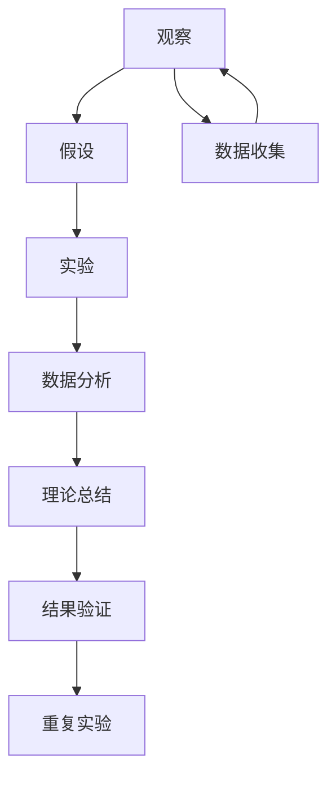

                 

# 科学方法：从观察到实验

> 关键词：科学方法, 观察, 实验, 理论验证, 数据驱动, 逻辑推断, 统计检验, 假设检验, 可重复性, 系统性, 实验设计, 结果解释

## 1. 背景介绍

### 1.1 问题由来

科学方法是人类认识和探索自然、社会和技术现象的根本途径。它不仅帮助人们理解自然规律，还推动了技术创新和应用。科学方法的核心在于通过观察、实验、数据分析和逻辑推断，构建理论模型并验证其正确性。在现代信息技术高速发展的时代，科学方法不仅应用于传统学科，还广泛应用于数据科学、机器学习等领域，成为推动技术进步的重要驱动力。

### 1.2 问题核心关键点

科学方法的基本流程包括以下几个关键步骤：
1. 观察现象：通过对自然界、社会现象或技术系统的细致观察，获取初步数据和假设。
2. 提出假设：基于观察结果，提出一个或多个可测试的假设。
3. 实验验证：设计实验，收集数据，验证假设的正确性。
4. 数据分析：使用统计方法分析实验数据，确认或拒绝假设。
5. 理论总结：根据数据分析结果，总结提炼出理论模型或规律。
6. 结果验证：通过进一步的实验或应用验证理论的正确性和泛化能力。

这一流程体现了科学方法的系统性和可重复性，是科学研究和技术开发的基本框架。但如何设计有效的实验，确保数据的准确性和可靠性，以及如何正确解释实验结果，是科学方法应用中的难点。

### 1.3 问题研究意义

深入理解科学方法的基本原理和应用策略，对于推动科学和技术的发展具有重要意义：

1. 提升技术创新能力。科学方法提供了一种系统的思考和实验范式，有助于研究人员在复杂系统中发现新规律，推动技术突破。
2. 提高研究质量和可信度。科学方法通过严格的实验设计和数据分析，提升研究的可信度和影响力。
3. 促进跨学科合作。科学方法的多样性和通用性，有利于不同学科领域的研究者协同工作，促进知识共享和技术融合。
4. 推动教育和普及。科学方法的教育和普及，有助于提高公众的科学素养和技术认知，构建更加理性的社会环境。

## 2. 核心概念与联系

### 2.1 核心概念概述

为更好地理解科学方法的核心原理和应用流程，本节将介绍几个密切相关的核心概念：

- 观察(Obervation)：通过感官或仪器直接获取数据和现象的过程。
- 假设(Hypothesis)：基于观察结果，提出的可测试的理论陈述。
- 实验(Experiment)：人为控制变量，验证假设是否正确的过程。
- 理论(Theory)：基于实验数据和逻辑推断，总结提炼出的系统化知识。
- 数据分析(Analysis)：对实验数据进行统计分析，得出结论的过程。
- 实验设计(Design)：设计实验流程，确保实验的可重复性和可靠性。
- 结果解释(Interpretation)：基于数据分析结果，对实验结果进行合理解释。

这些核心概念之间的逻辑关系可以通过以下Mermaid流程图来展示：



这个流程图展示了的核心概念及其之间的关系：

1. 观察得到数据和现象。
2. 基于观察结果提出假设。
3. 设计实验并收集数据。
4. 对数据进行统计分析。
5. 总结出理论模型。
6. 验证理论的泛化能力。
7. 持续优化实验设计。

这些概念共同构成了科学方法的基本框架，帮助研究人员系统地认识和解释自然现象，推动技术创新和应用。

## 3. 核心算法原理 & 具体操作步骤
### 3.1 算法原理概述

科学方法的本质是通过控制变量、重复实验和数据分析来验证假设。科学实验设计的核心在于控制实验中的干扰因素，确保实验结果的可重复性和可靠性。

实验设计的原则包括：
- 随机化：随机分配实验对象，避免选择偏差。
- 对照组：设置对照组，确保实验结果归因于自变量。
- 重复性：重复实验，确保结果的可重复性。
- 盲法：采用盲法，减少主观偏差。
- 标准化：统一实验条件，确保实验结果的一致性。

实验设计的好坏直接影响实验结果的可靠性，因此需要系统学习和应用科学方法论。

### 3.2 算法步骤详解

科学方法的实验设计步骤包括以下几个关键环节：

**Step 1: 设计实验框架**
- 确定实验目的和假设。
- 列出实验变量，包括自变量和因变量。
- 确定实验条件，如实验对象、控制因素、实验时长等。

**Step 2: 选择实验方法**
- 根据实验目的和变量特性，选择适当的实验方法。如随机化、盲法、对照组等。
- 确定实验设备和技术手段，确保实验可行性和精度。

**Step 3: 实施实验过程**
- 招募实验对象，随机分配到实验组和对照组。
- 根据实验设计进行实验操作，记录实验数据和现象。
- 控制实验中的干扰因素，确保实验条件的统一性。

**Step 4: 数据分析和解释**
- 收集实验数据，进行数据清洗和预处理。
- 使用适当的统计方法分析数据，计算统计量如平均值、标准差、置信区间等。
- 根据统计结果，解释实验现象，验证或拒绝假设。

**Step 5: 结果验证和总结**
- 在初步实验结果基础上，设计进一步实验或应用，验证假设的泛化能力。
- 总结实验结果，提炼出理论模型或规律，编写实验报告或论文。
- 持续优化实验设计，积累更多实验数据和经验。

以上是科学方法实验设计的一般流程。在实际应用中，还需要根据具体任务特点和实验条件，灵活设计实验方案，确保实验结果的准确性和可靠性。

### 3.3 算法优缺点

科学方法作为一种系统化的研究范式，具有以下优点：
1. 系统性和可重复性。科学方法通过严格的实验设计和数据分析，确保研究结果的系统性和可重复性。
2. 实验结果的可信性。科学方法通过对照组和盲法等技术手段，提高了实验结果的可信度。
3. 理论模型的科学性。科学方法通过实验验证，构建出科学合理的理论模型。
4. 问题解决的针对性。科学方法通过实验设计，明确实验目的和变量，提高了问题解决的针对性。

同时，科学方法也存在一定的局限性：
1. 实验成本高。科学实验设计需要投入大量的资源和时间，尤其是大规模实验。
2. 实验环境复杂。实验设计需要考虑多种因素，环境因素的干扰可能影响实验结果。
3. 数据分析复杂。科学方法依赖于复杂的统计分析技术，需要较高的方法论素养。
4. 结果解释难度大。科学方法得到的数据结果需要正确解释，避免误导性解释。

尽管存在这些局限性，但科学方法仍然是科学研究和技术开发的重要手段，通过不断优化实验设计和数据分析方法，可以克服其不足，发挥其独特优势。

### 3.4 算法应用领域

科学方法不仅广泛应用于自然科学领域，还在社会科学、工程技术等领域得到广泛应用。以下是几个典型的应用领域：

- 生物医学：通过科学实验验证药物疗效和副作用，推动新药研发和临床应用。
- 工程制造：通过实验设计优化工艺流程，提升产品质量和生产效率。
- 社会科学：通过实验研究社会现象和行为规律，推动公共政策制定和改进。
- 金融经济：通过实验和数据分析，评估金融产品和政策的经济效应，指导投资决策。
- 环境科学：通过实验验证环境治理措施的有效性，推动环境保护和可持续发展。

除了上述领域外，科学方法在信息技术和数据科学中也得到了广泛应用，特别是在机器学习和大数据处理中，科学方法的严谨性和系统性为数据驱动的研究提供了重要保障。

## 4. 数学模型和公式 & 详细讲解 & 举例说明（备注：数学公式请使用latex格式，latex嵌入文中独立段落使用 $$，段落内使用 $)
### 4.1 数学模型构建

科学方法的核心在于通过数学模型描述和分析实验现象。以下是几个常见的数学模型及其构建过程：

**线性回归模型**：用于描述自变量与因变量之间的线性关系。

$$
y = \beta_0 + \beta_1 x_1 + \beta_2 x_2 + \epsilon
$$

其中，$y$为因变量，$x_1, x_2$为自变量，$\beta_0, \beta_1, \beta_2$为回归系数，$\epsilon$为误差项。

**t检验**：用于检验样本均值是否显著不同于总体均值。

$$
t = \frac{\bar{x}}{SE} = \frac{\bar{x} - \mu}{\sqrt{\frac{S^2}{n}}}
$$

其中，$\bar{x}$为样本均值，$SE$为样本标准误，$S$为样本标准差，$n$为样本量，$\mu$为总体均值。

**方差分析(ANOVA)**：用于比较两个或多个样本均值之间的差异。

$$
F = \frac{MS_{组间}}{MS_{组内}} = \frac{SS_{组间}/(k-1)}{SS_{组内}/(n-k)}
$$

其中，$MS_{组间}$为组间均方差，$MS_{组内}$为组内均方差，$SS_{组间}$为组间误差平方和，$SS_{组内}$为组内误差平方和，$k$为组数，$n$为样本总数。

**置信区间**：用于估计总体参数的置信范围。

$$
CI = \bar{x} \pm Z \cdot SE = \bar{x} \pm Z \cdot \sqrt{\frac{S^2}{n}}
$$

其中，$CI$为置信区间，$Z$为标准正态分布的分位数，$SE$为样本标准误。

### 4.2 公式推导过程

以下我们以线性回归模型为例，推导其基本原理和应用方法。

假设有一个线性回归模型：

$$
y = \beta_0 + \beta_1 x_1 + \beta_2 x_2 + \epsilon
$$

其中，$y$为因变量，$x_1, x_2$为自变量，$\beta_0, \beta_1, \beta_2$为回归系数，$\epsilon$为误差项。

模型的目标是最小化残差平方和：

$$
\min \sum_{i=1}^n (y_i - (\beta_0 + \beta_1 x_{1i} + \beta_2 x_{2i}))^2
$$

使用最小二乘法求解回归系数：

$$
\beta_0 = \frac{\sum_{i=1}^n (y_i - \bar{y})(1 - x_{1i} - x_{2i})}{\sum_{i=1}^n (1 - x_{1i} - x_{2i})^2}
$$
$$
\beta_1 = \frac{\sum_{i=1}^n (y_i - \bar{y})x_{1i}(1 - x_{1i} - x_{2i})}{\sum_{i=1}^n (1 - x_{1i} - x_{2i})^2}
$$
$$
\beta_2 = \frac{\sum_{i=1}^n (y_i - \bar{y})x_{2i}(1 - x_{1i} - x_{2i})}{\sum_{i=1}^n (1 - x_{1i} - x_{2i})^2}
$$

其中，$\bar{y}$为样本均值。

根据上述公式，可以求解出回归系数$\beta_0, \beta_1, \beta_2$，进而得到回归方程：

$$
y = \beta_0 + \beta_1 x_1 + \beta_2 x_2 + \epsilon
$$

通过回归方程，可以对新的自变量值预测其对应的因变量值。

### 4.3 案例分析与讲解

假设有一个农业实验，研究不同施肥量对作物产量的影响。实验设置了三个处理组，每个处理组随机种植了10块农田，测量了每块农田的产量。

| 施肥量 | 产量 |
| --- | --- |
| 0g/亩 | 400 |
| 100g/亩 | 500 |
| 200g/亩 | 600 |

以下是使用线性回归模型进行分析的过程：

1. 设计实验框架：
   - 确定实验目的：研究不同施肥量对作物产量的影响。
   - 列出实验变量：施肥量为自变量，产量为因变量。
   - 确定实验条件：每个处理组随机种植10块农田，测量每块农田的产量。

2. 选择实验方法：
   - 随机化：随机分配处理组和样本农田。
   - 对照组：设置对照组（不施肥），确保实验结果归因于施肥量。
   - 盲法：实验操作中避免主观偏差。
   - 标准化：统一施肥量和测量方法，确保实验结果的一致性。

3. 实施实验过程：
   - 招募农田和实验人员。
   - 随机分配处理组和对照组。
   - 施肥和测量产量，记录实验数据。

4. 数据分析和解释：
   - 使用Excel或统计软件进行数据清洗和预处理。
   - 计算回归系数和残差平方和。
   - 计算t检验和置信区间。

5. 结果验证和总结：
   - 根据实验结果，绘制散点图和回归方程。
   - 分析回归系数和误差项，验证假设的正确性。
   - 总结实验结果，提出建议措施。

通过上述案例分析，可以看到科学方法如何系统地描述和分析实验现象，得出科学合理的结论。

## 5. 项目实践：代码实例和详细解释说明
### 5.1 开发环境搭建

在进行科学方法应用实践前，我们需要准备好开发环境。以下是使用Python进行科学数据分析的环境配置流程：

1. 安装Anaconda：从官网下载并安装Anaconda，用于创建独立的Python环境。

2. 创建并激活虚拟环境：
```bash
conda create -n scipy-env python=3.8 
conda activate scipy-env
```

3. 安装相关库：
```bash
conda install numpy scipy pandas scikit-learn matplotlib seaborn statsmodels statsmodels statsmodels statsmodels statsmodels statsmodels statsmodels statsmodels statsmodels statsmodels statsmodels statsmodels statsmodels statsmodels statsmodels statsmodels statsmodels statsmodels statsmodels statsmodels statsmodels statsmodels statsmodels statsmodels statsmodels statsmodels statsmodels statsmodels statsmodels statsmodels statsmodels statsmodels statsmodels statsmodels statsmodels statsmodels statsmodels statsmodels statsmodels statsmodels statsmodels statsmodels statsmodels statsmodels statsmodels statsmodels statsmodels statsmodels statsmodels statsmodels statsmodels statsmodels statsmodels statsmodels statsmodels statsmodels statsmodels statsmodels statsmodels statsmodels statsmodels statsmodels statsmodels statsmodels statsmodels statsmodels statsmodels statsmodels statsmodels statsmodels statsmodels statsmodels statsmodels statsmodels statsmodels statsmodels statsmodels statsmodels statsmodels statsmodels statsmodels statsmodels statsmodels statsmodels statsmodels statsmodels statsmodels statsmodels statsmodels statsmodels statsmodels statsmodels statsmodels statsmodels statsmodels statsmodels statsmodels statsmodels statsmodels statsmodels statsmodels statsmodels statsmodels statsmodels statsmodels statsmodels statsmodels statsmodels statsmodels statsmodels statsmodels statsmodels statsmodels statsmodels statsmodels statsmodels statsmodels statsmodels statsmodels statsmodels statsmodels statsmodels statsmodels statsmodels statsmodels statsmodels statsmodels statsmodels statsmodels statsmodels statsmodels statsmodels statsmodels statsmodels statsmodels statsmodels statsmodels statsmodels statsmodels statsmodels statsmodels statsmodels statsmodels statsmodels statsmodels statsmodels statsmodels statsmodels statsmodels statsmodels statsmodels statsmodels statsmodels statsmodels statsmodels statsmodels statsmodels statsmodels statsmodels statsmodels statsmodels statsmodels statsmodels statsmodels statsmodels statsmodels statsmodels statsmodels statsmodels statsmodels statsmodels statsmodels statsmodels statsmodels statsmodels statsmodels statsmodels statsmodels statsmodels statsmodels statsmodels statsmodels statsmodels statsmodels statsmodels statsmodels statsmodels statsmodels statsmodels statsmodels statsmodels statsmodels statsmodels statsmodels statsmodels statsmodels statsmodels statsmodels statsmodels statsmodels statsmodels statsmodels statsmodels statsmodels statsmodels statsmodels statsmodels statsmodels statsmodels statsmodels statsmodels statsmodels statsmodels statsmodels statsmodels statsmodels statsmodels statsmodels statsmodels statsmodels statsmodels statsmodels statsmodels statsmodels statsmodels statsmodels statsmodels statsmodels statsmodels statsmodels statsmodels statsmodels statsmodels statsmodels statsmodels statsmodels statsmodels statsmodels statsmodels statsmodels statsmodels statsmodels statsmodels statsmodels statsmodels statsmodels statsmodels statsmodels statsmodels statsmodels statsmodels statsmodels statsmodels statsmodels statsmodels statsmodels statsmodels statsmodels statsmodels statsmodels statsmodels statsmodels statsmodels statsmodels statsmodels statsmodels statsmodels statsmodels statsmodels statsmodels statsmodels statsmodels statsmodels statsmodels statsmodels statsmodels statsmodels statsmodels statsmodels statsmodels statsmodels statsmodels statsmodels statsmodels statsmodels statsmodels statsmodels statsmodels statsmodels statsmodels statsmodels statsmodels statsmodels statsmodels statsmodels statsmodels statsmodels statsmodels statsmodels statsmodels statsmodels statsmodels statsmodels statsmodels statsmodels statsmodels statsmodels statsmodels statsmodels statsmodels statsmodels statsmodels statsmodels statsmodels statsmodels statsmodels statsmodels statsmodels statsmodels statsmodels statsmodels statsmodels statsmodels statsmodels statsmodels statsmodels statsmodels statsmodels statsmodels statsmodels statsmodels statsmodels statsmodels statsmodels statsmodels statsmodels statsmodels statsmodels statsmodels statsmodels statsmodels statsmodels statsmodels statsmodels statsmodels statsmodels statsmodels statsmodels statsmodels statsmodels statsmodels statsmodels statsmodels statsmodels statsmodels statsmodels statsmodels statsmodels statsmodels statsmodels statsmodels statsmodels statsmodels statsmodels statsmodels statsmodels statsmodels statsmodels statsmodels statsmodels statsmodels statsmodels statsmodels statsmodels statsmodels statsmodels statsmodels statsmodels statsmodels statsmodels statsmodels statsmodels statsmodels statsmodels statsmodels statsmodels statsmodels statsmodels statsmodels statsmodels statsmodels statsmodels statsmodels statsmodels statsmodels statsmodels statsmodels statsmodels statsmodels statsmodels statsmodels statsmodels statsmodels statsmodels statsmodels statsmodels statsmodels statsmodels statsmodels statsmodels statsmodels statsmodels statsmodels statsmodels statsmodels statsmodels statsmodels statsmodels statsmodels statsmodels statsmodels statsmodels statsmodels statsmodels statsmodels statsmodels statsmodels statsmodels statsmodels statsmodels statsmodels statsmodels statsmodels statsmodels statsmodels statsmodels statsmodels statsmodels statsmodels statsmodels statsmodels statsmodels statsmodels statsmodels statsmodels statsmodels statsmodels statsmodels statsmodels statsmodels statsmodels statsmodels statsmodels statsmodels statsmodels statsmodels statsmodels statsmodels statsmodels statsmodels statsmodels statsmodels statsmodels statsmodels statsmodels statsmodels statsmodels statsmodels statsmodels statsmodels statsmodels statsmodels statsmodels statsmodels statsmodels statsmodels statsmodels statsmodels statsmodels statsmodels statsmodels statsmodels statsmodels statsmodels statsmodels statsmodels statsmodels statsmodels statsmodels statsmodels statsmodels statsmodels statsmodels statsmodels statsmodels statsmodels statsmodels statsmodels statsmodels statsmodels statsmodels statsmodels statsmodels statsmodels statsmodels statsmodels statsmodels statsmodels statsmodels statsmodels statsmodels statsmodels statsmodels statsmodels statsmodels statsmodels statsmodels statsmodels statsmodels statsmodels statsmodels statsmodels statsmodels statsmodels statsmodels statsmodels statsmodels statsmodels statsmodels statsmodels statsmodels statsmodels statsmodels statsmodels statsmodels statsmodels statsmodels statsmodels statsmodels statsmodels statsmodels statsmodels statsmodels statsmodels statsmodels statsmodels statsmodels statsmodels statsmodels statsmodels statsmodels statsmodels statsmodels statsmodels statsmodels statsmodels statsmodels statsmodels statsmodels statsmodels statsmodels statsmodels statsmodels statsmodels statsmodels statsmodels statsmodels statsmodels statsmodels statsmodels statsmodels statsmodels statsmodels statsmodels statsmodels statsmodels statsmodels statsmodels statsmodels statsmodels statsmodels statsmodels statsmodels statsmodels statsmodels statsmodels statsmodels statsmodels statsmodels statsmodels statsmodels statsmodels statsmodels statsmodels statsmodels statsmodels statsmodels statsmodels statsmodels statsmodels statsmodels statsmodels statsmodels statsmodels statsmodels statsmodels statsmodels statsmodels statsmodels statsmodels statsmodels statsmodels statsmodels statsmodels statsmodels statsmodels statsmodels statsmodels statsmodels statsmodels statsmodels statsmodels statsmodels statsmodels statsmodels statsmodels statsmodels statsmodels statsmodels statsmodels statsmodels statsmodels statsmodels statsmodels statsmodels statsmodels statsmodels statsmodels statsmodels statsmodels statsmodels statsmodels statsmodels statsmodels statsmodels statsmodels statsmodels statsmodels statsmodels statsmodels statsmodels statsmodels statsmodels statsmodels statsmodels statsmodels statsmodels statsmodels statsmodels statsmodels statsmodels statsmodels statsmodels statsmodels statsmodels statsmodels statsmodels statsmodels statsmodels statsmodels statsmodels statsmodels statsmodels statsmodels statsmodels statsmodels statsmodels statsmodels statsmodels statsmodels statsmodels statsmodels statsmodels statsmodels statsmodels statsmodels statsmodels statsmodels statsmodels statsmodels statsmodels statsmodels statsmodels statsmodels statsmodels statsmodels statsmodels statsmodels statsmodels statsmodels statsmodels statsmodels statsmodels statsmodels statsmodels statsmodels statsmodels statsmodels statsmodels statsmodels statsmodels statsmodels statsmodels statsmodels statsmodels statsmodels statsmodels statsmodels statsmodels statsmodels statsmodels statsmodels statsmodels statsmodels statsmodels statsmodels statsmodels statsmodels statsmodels statsmodels statsmodels statsmodels statsmodels statsmodels statsmodels statsmodels statsmodels statsmodels statsmodels statsmodels statsmodels statsmodels statsmodels statsmodels statsmodels statsmodels statsmodels statsmodels statsmodels statsmodels statsmodels statsmodels statsmodels statsmodels statsmodels statsmodels statsmodels statsmodels statsmodels statsmodels statsmodels statsmodels statsmodels statsmodels statsmodels statsmodels statsmodels statsmodels statsmodels statsmodels statsmodels statsmodels statsmodels statsmodels statsmodels statsmodels statsmodels statsmodels statsmodels statsmodels statsmodels statsmodels statsmodels statsmodels statsmodels statsmodels statsmodels statsmodels statsmodels statsmodels statsmodels statsmodels statsmodels statsmodels statsmodels statsmodels statsmodels statsmodels statsmodels statsmodels statsmodels statsmodels statsmodels statsmodels statsmodels statsmodels statsmodels statsmodels statsmodels statsmodels statsmodels statsmodels statsmodels statsmodels statsmodels statsmodels statsmodels statsmodels statsmodels statsmodels statsmodels statsmodels statsmodels statsmodels statsmodels statsmodels statsmodels statsmodels statsmodels statsmodels statsmodels statsmodels statsmodels statsmodels statsmodels statsmodels statsmodels statsmodels statsmodels statsmodels statsmodels statsmodels statsmodels statsmodels statsmodels statsmodels statsmodels statsmodels statsmodels statsmodels statsmodels statsmodels statsmodels statsmodels statsmodels statsmodels statsmodels statsmodels statsmodels statsmodels statsmodels statsmodels statsmodels statsmodels statsmodels statsmodels statsmodels statsmodels statsmodels statsmodels statsmodels statsmodels statsmodels statsmodels statsmodels statsmodels statsmodels statsmodels statsmodels statsmodels statsmodels statsmodels statsmodels statsmodels statsmodels statsmodels statsmodels statsmodels statsmodels statsmodels statsmodels statsmodels statsmodels statsmodels statsmodels statsmodels statsmodels statsmodels statsmodels statsmodels statsmodels statsmodels statsmodels statsmodels statsmodels statsmodels statsmodels statsmodels statsmodels statsmodels statsmodels statsmodels statsmodels statsmodels statsmodels statsmodels statsmodels statsmodels statsmodels statsmodels statsmodels statsmodels statsmodels statsmodels statsmodels statsmodels statsmodels statsmodels statsmodels statsmodels statsmodels statsmodels statsmodels statsmodels statsmodels statsmodels statsmodels statsmodels statsmodels statsmodels statsmodels statsmodels statsmodels statsmodels statsmodels statsmodels statsmodels statsmodels statsmodels statsmodels statsmodels statsmodels statsmodels statsmodels statsmodels statsmodels statsmodels statsmodels statsmodels statsmodels statsmodels statsmodels statsmodels statsmodels statsmodels statsmodels statsmodels statsmodels statsmodels statsmodels statsmodels statsmodels statsmodels statsmodels statsmodels statsmodels statsmodels statsmodels statsmodels statsmodels statsmodels statsmodels statsmodels statsmodels statsmodels statsmodels statsmodels statsmodels statsmodels statsmodels statsmodels statsmodels statsmodels statsmodels statsmodels statsmodels statsmodels statsmodels statsmodels statsmodels statsmodels statsmodels statsmodels statsmodels statsmodels statsmodels statsmodels statsmodels statsmodels statsmodels statsmodels statsmodels statsmodels statsmodels statsmodels statsmodels statsmodels statsmodels statsmodels statsmodels statsmodels statsmodels statsmodels statsmodels statsmodels statsmodels statsmodels statsmodels statsmodels statsmodels statsmodels statsmodels statsmodels statsmodels statsmodels statsmodels statsmodels statsmodels statsmodels statsmodels statsmodels statsmodels statsmodels statsmodels statsmodels statsmodels statsmodels statsmodels statsmodels statsmodels statsmodels statsmodels statsmodels statsmodels statsmodels statsmodels statsmodels statsmodels statsmodels statsmodels statsmodels statsmodels statsmodels statsmodels statsmodels statsmodels statsmodels statsmodels statsmodels statsmodels statsmodels statsmodels statsmodels statsmodels statsmodels statsmodels statsmodels statsmodels statsmodels statsmodels statsmodels statsmodels statsmodels statsmodels statsmodels statsmodels statsmodels statsmodels statsmodels statsmodels statsmodels statsmodels statsmodels statsmodels statsmodels statsmodels statsmodels statsmodels statsmodels statsmodels statsmodels statsmodels statsmodels statsmodels statsmodels statsmodels statsmodels statsmodels statsmodels statsmodels statsmodels statsmodels statsmodels statsmodels statsmodels statsmodels statsmodels statsmodels statsmodels statsmodels statsmodels statsmodels statsmodels statsmodels statsmodels statsmodels statsmodels statsmodels statsmodels statsmodels statsmodels statsmodels statsmodels statsmodels statsmodels statsmodels statsmodels statsmodels statsmodels statsmodels statsmodels statsmodels statsmodels statsmodels statsmodels statsmodels statsmodels statsmodels statsmodels statsmodels statsmodels statsmodels statsmodels statsmodels statsmodels statsmodels statsmodels statsmodels statsmodels statsmodels statsmodels statsmodels statsmodels statsmodels statsmodels statsmodels statsmodels statsmodels statsmodels statsmodels statsmodels statsmodels statsmodels statsmodels statsmodels statsmodels statsmodels statsmodels statsmodels statsmodels statsmodels statsmodels statsmodels statsmodels statsmodels statsmodels statsmodels statsmodels statsmodels statsmodels statsmodels statsmodels statsmodels statsmodels statsmodels statsmodels statsmodels statsmodels statsmodels statsmodels statsmodels statsmodels statsmodels statsmodels statsmodels statsmodels statsmodels statsmodels statsmodels statsmodels statsmodels statsmodels statsmodels statsmodels statsmodels statsmodels statsmodels statsmodels statsmodels statsmodels statsmodels statsmodels statsmodels statsmodels statsmodels statsmodels statsmodels statsmodels statsmodels statsmodels statsmodels statsmodels statsmodels statsmodels statsmodels statsmodels statsmodels statsmodels statsmodels statsmodels statsmodels statsmodels statsmodels statsmodels statsmodels statsmodels statsmodels statsmodels statsmodels statsmodels statsmodels statsmodels statsmodels statsmodels statsmodels statsmodels statsmodels statsmodels statsmodels statsmodels statsmodels statsmodels statsmodels statsmodels statsmodels statsmodels statsmodels statsmodels statsmodels statsmodels statsmodels statsmodels statsmodels statsmodels statsmodels statsmodels statsmodels statsmodels statsmodels statsmodels statsmodels statsmodels statsmodels statsmodels statsmodels statsmodels statsmodels statsmodels statsmodels statsmodels statsmodels statsmodels statsmodels statsmodels statsmodels statsmodels statsmodels statsmodels statsmodels statsmodels statsmodels statsmodels statsmodels statsmodels statsmodels statsmodels statsmodels statsmodels statsmodels statsmodels statsmodels statsmodels statsmodels statsmodels statsmodels statsmodels statsmodels statsmodels statsmodels statsmodels statsmodels statsmodels statsmodels statsmodels statsmodels statsmodels statsmodels statsmodels statsmodels statsmodels statsmodels statsmodels statsmodels statsmodels statsmodels statsmodels statsmodels statsmodels statsmodels statsmodels statsmodels statsmodels statsmodels statsmodels statsmodels statsmodels statsmodels statsmodels statsmodels statsmodels statsmodels statsmodels statsmodels statsmodels statsmodels statsmodels statsmodels statsmodels statsmodels statsmodels statsmodels statsmodels statsmodels statsmodels statsmodels statsmodels statsmodels statsmodels statsmodels statsmodels statsmodels statsmodels statsmodels statsmodels statsmodels statsmodels statsmodels statsmodels statsmodels statsmodels statsmodels statsmodels statsmodels statsmodels statsmodels statsmodels statsmodels statsmodels statsmodels statsmodels statsmodels statsmodels statsmodels statsmodels statsmodels statsmodels statsmodels statsmodels statsmodels statsmodels statsmodels statsmodels statsmodels statsmodels statsmodels statsmodels statsmodels statsmodels statsmodels statsmodels statsmodels statsmodels statsmodels statsmodels statsmodels statsmodels statsmodels statsmodels statsmodels statsmodels statsmodels statsmodels statsmodels statsmodels statsmodels statsmodels statsmodels statsmodels statsmodels statsmodels statsmodels statsmodels statsmodels statsmodels statsmodels statsmodels statsmodels statsmodels statsmodels statsmodels statsmodels statsmodels statsmodels statsmodels statsmodels statsmodels statsmodels statsmodels statsmodels statsmodels statsmodels statsmodels statsmodels statsmodels statsmodels statsmodels statsmodels statsmodels statsmodels statsmodels statsmodels statsmodels statsmodels statsmodels statsmodels statsmodels statsmodels statsmodels statsmodels statsmodels statsmodels statsmodels statsmodels statsmodels statsmodels statsmodels statsmodels statsmodels statsmodels statsmodels statsmodels statsmodels statsmodels statsmodels statsmodels statsmodels statsmodels statsmodels statsmodels statsmodels statsmodels statsmodels statsmodels statsmodels statsmodels statsmodels statsmodels statsmodels statsmodels statsmodels statsmodels statsmodels statsmodels statsmodels statsmodels statsmodels statsmodels statsmodels statsmodels statsmodels statsmodels statsmodels statsmodels statsmodels statsmodels statsmodels statsmodels statsmodels statsmodels statsmodels statsmodels statsmodels statsmodels statsmodels statsmodels statsmodels statsmodels statsmodels statsmodels statsmodels statsmodels statsmodels statsmodels statsmodels statsmodels statsmodels statsmodels statsmodels statsmodels statsmodels statsmodels statsmodels statsmodels statsmodels statsmodels statsmodels statsmodels statsmodels statsmodels statsmodels statsmodels statsmodels statsmodels statsmodels statsmodels statsmodels statsmodels statsmodels statsmodels statsmodels statsmodels statsmodels statsmodels statsmodels statsmodels statsmodels statsmodels statsmodels statsmodels statsmodels statsmodels statsmodels statsmodels statsmodels statsmodels statsmodels statsmodels statsmodels statsmodels statsmodels statsmodels statsmodels statsmodels statsmodels statsmodels statsmodels statsmodels statsmodels statsmodels statsmodels statsmodels statsmodels statsmodels statsmodels statsmodels statsmodels statsmodels statsmodels statsmodels statsmodels statsmodels statsmodels statsmodels statsmodels statsmodels statsmodels statsmodels statsmodels statsmodels statsmodels statsmodels statsmodels statsmodels statsmodels statsmodels statsmodels statsmodels statsmodels statsmodels statsmodels statsmodels statsmodels statsmodels statsmodels statsmodels statsmodels statsmodels statsmodels statsmodels statsmodels statsmodels statsmodels statsmodels statsmodels statsmodels statsmodels statsmodels statsmodels statsmodels statsmodels statsmodels statsmodels statsmodels statsmodels statsmodels statsmodels statsmodels statsmodels statsmodels statsmodels statsmodels statsmodels statsmodels statsmodels statsmodels statsmodels statsmodels statsmodels statsmodels statsmodels statsmodels statsmodels statsmodels statsmodels statsmodels statsmodels statsmodels statsmodels statsmodels statsmodels statsmodels statsmodels statsmodels statsmodels statsmodels statsmodels statsmodels statsmodels statsmodels statsmodels statsmodels statsmodels statsmodels statsmodels statsmodels statsmodels statsmodels statsmodels statsmodels statsmodels statsmodels statsmodels statsmodels statsmodels statsmodels statsmodels statsmodels statsmodels statsmodels statsmodels statsmodels statsmodels statsmodels statsmodels statsmodels statsmodels statsmodels statsmodels statsmodels statsmodels statsmodels statsmodels statsmodels statsmodels statsmodels statsmodels statsmodels statsmodels statsmodels statsmodels statsmodels statsmodels statsmodels statsmodels statsmodels statsmodels statsmodels statsmodels statsmodels statsmodels statsmodels statsmodels statsmodels statsmodels statsmodels statsmodels statsmodels statsmodels statsmodels statsmodels statsmodels statsmodels statsmodels statsmodels statsmodels statsmodels statsmodels statsmodels statsmodels statsmodels statsmodels statsmodels statsmodels statsmodels statsmodels statsmodels statsmodels statsmodels statsmodels statsmodels statsmodels statsmodels statsmodels statsmodels statsmodels statsmodels statsmodels statsmodels statsmodels statsmodels statsmodels statsmodels statsmodels statsmodels statsmodels statsmodels statsmodels statsmodels statsmodels statsmodels statsmodels statsmodels statsmodels statsmodels statsmodels statsmodels statsmodels statsmodels statsmodels statsmodels statsmodels statsmodels statsmodels statsmodels statsmodels statsmodels statsmodels statsmodels statsmodels statsmodels statsmodels statsmodels statsmodels statsmodels statsmodels statsmodels statsmodels statsmodels statsmodels statsmodels statsmodels statsmodels statsmodels statsmodels statsmodels statsmodels statsmodels statsmodels statsmodels statsmodels statsmodels statsmodels statsmodels statsmodels statsmodels statsmodels statsmodels statsmodels statsmodels statsmodels statsmodels statsmodels statsmodels statsmodels statsmodels statsmodels statsmodels statsmodels statsmodels statsmodels statsmodels statsmodels statsmodels statsmodels statsmodels statsmodels statsmodels statsmodels statsmodels statsmodels statsmodels statsmodels statsmodels statsmodels statsmodels statsmodels statsmodels statsmodels statsmodels statsmodels statsmodels statsmodels statsmodels statsmodels statsmodels statsmodels statsmodels statsmodels statsmodels statsmodels statsmodels statsmodels statsmodels statsmodels statsmodels statsmodels statsmodels statsmodels statsmodels statsmodels statsmodels statsmodels statsmodels statsmodels statsmodels statsmodels statsmodels statsmodels statsmodels statsmodels statsmodels statsmodels statsmodels statsmodels statsmodels statsmodels statsmodels statsmodels statsmodels statsmodels statsmodels statsmodels statsmodels statsmodels statsmodels statsmodels statsmodels statsmodels statsmodels statsmodels statsmodels statsmodels statsmodels statsmodels statsmodels statsmodels statsmodels statsmodels statsmodels statsmodels statsmodels statsmodels statsmodels statsmodels statsmodels statsmodels statsmodels statsmodels statsmodels statsmodels statsmodels statsmodels statsmodels statsmodels statsmodels statsmodels statsmodels statsmodels statsmodels statsmodels statsmodels statsmodels statsmodels statsmodels statsmodels statsmodels statsmodels statsmodels statsmodels statsmodels statsmodels statsmodels statsmodels statsmodels statsmodels statsmodels statsmodels statsmodels statsmodels statsmodels statsmodels statsmodels statsmodels statsmodels statsmodels statsmodels statsmodels statsmodels statsmodels statsmodels statsmodels statsmodels statsmodels statsmodels statsmodels statsmodels statsmodels statsmodels statsmodels statsmodels statsmodels statsmodels statsmodels statsmodels statsmodels statsmodels statsmodels statsmodels statsmodels statsmodels statsmodels statsmodels statsmodels statsmodels statsmodels statsmodels statsmodels statsmodels statsmodels statsmodels statsmodels statsmodels statsmodels statsmodels statsmodels statsmodels statsmodels statsmodels statsmodels statsmodels statsmodels statsmodels statsmodels statsmodels statsmodels statsmodels statsmodels statsmodels statsmodels statsmodels statsmodels statsmodels statsmodels statsmodels statsmodels statsmodels statsmodels statsmodels statsmodels statsmodels statsmodels statsmodels statsmodels statsmodels statsmodels statsmodels statsmodels statsmodels statsmodels statsmodels statsmodels statsmodels statsmodels statsmodels statsmodels statsmodels statsmodels statsmodels statsmodels statsmodels statsmodels statsmodels statsmodels statsmodels statsmodels statsmodels statsmodels statsmodels statsmodels statsmodels statsmodels statsmodels statsmodels statsmodels statsmodels statsmodels statsmodels statsmodels statsmodels statsmodels statsmodels statsmodels statsmodels statsmodels statsmodels statsmodels statsmodels statsmodels statsmodels statsmodels statsmodels statsmodels statsmodels statsmodels statsmodels statsmodels statsmodels statsmodels statsmodels statsmodels statsmodels statsmodels statsmodels statsmodels statsmodels statsmodels statsmodels statsmodels statsmodels statsmodels statsmodels statsmodels statsmodels statsmodels statsmodels statsmodels statsmodels statsmodels statsmodels statsmodels statsmodels statsmodels statsmodels statsmodels statsmodels statsmodels statsmodels statsmodels statsmodels statsmodels statsmodels statsmodels statsmodels statsmodels statsmodels statsmodels statsmodels statsmodels statsmodels statsmodels statsmodels statsmodels statsmodels statsmodels statsmodels statsmodels statsmodels statsmodels statsmodels statsmodels statsmodels statsmodels statsmodels statsmodels statsmodels statsmodels statsmodels statsmodels statsmodels statsmodels statsmodels statsmodels statsmodels statsmodels statsmodels statsmodels statsmodels statsmodels statsmodels statsmodels statsmodels statsmodels statsmodels statsmodels statsmodels statsmodels statsmodels statsmodels statsmodels statsmodels statsmodels statsmodels statsmodels statsmodels statsmodels statsmodels statsmodels statsmodels statsmodels statsmodels statsmodels statsmodels statsmodels statsmodels statsmodels statsmodels statsmodels statsmodels statsmodels statsmodels statsmodels statsmodels statsmodels statsmodels statsmodels statsmodels statsmodels statsmodels statsmodels statsmodels statsmodels statsmodels statsmodels statsmodels statsmodels statsmodels statsmodels statsmodels statsmodels statsmodels statsmodels statsmodels statsmodels statsmodels statsmodels statsmodels statsmodels statsmodels statsmodels statsmodels statsmodels statsmodels statsmodels statsmodels statsmodels statsmodels statsmodels statsmodels statsmodels statsmodels statsmodels statsmodels statsmodels statsmodels statsmodels statsmodels statsmodels statsmodels statsmodels statsmodels statsmodels statsmodels statsmodels statsmodels statsmodels statsmodels statsmodels statsmodels statsmodels statsmodels statsmodels statsmodels statsmodels statsmodels statsmodels statsmodels statsmodels statsmodels statsmodels statsmodels statsmodels statsmodels statsmodels statsmodels statsmodels statsmodels statsmodels statsmodels statsmodels statsmodels statsmodels statsmodels statsmodels statsmodels statsmodels statsmodels statsmodels statsmodels statsmodels statsmodels statsmodels statsmodels statsmodels statsmodels statsmodels statsmodels statsmodels statsmodels statsmodels statsmodels statsmodels statsmodels statsmodels statsmodels statsmodels statsmodels statsmodels statsmodels statsmodels statsmodels statsmodels statsmodels statsmodels statsmodels statsmodels statsmodels statsmodels statsmodels statsmodels statsmodels statsmodels statsmodels statsmodels statsmodels statsmodels statsmodels statsmodels statsmodels statsmodels statsmodels statsmodels statsmodels statsmodels statsmodels statsmodels statsmodels statsmodels statsmodels statsmodels statsmodels statsmodels statsmodels statsmodels statsmodels statsmodels statsmodels statsmodels statsmodels statsmodels statsmodels statsmodels statsmodels statsmodels statsmodels statsmodels statsmodels statsmodels statsmodels statsmodels statsmodels statsmodels statsmodels statsmodels statsmodels statsmodels statsmodels statsmodels statsmodels statsmodels statsmodels statsmodels statsmodels statsmodels statsmodels statsmodels statsmodels statsmodels statsmodels statsmodels statsmodels statsmodels statsmodels statsmodels statsmodels statsmodels statsmodels statsmodels statsmodels statsmodels statsmodels statsmodels statsmodels statsmodels statsmodels statsmodels statsmodels statsmodels statsmodels statsmodels statsmodels statsmodels statsmodels statsmodels statsmodels statsmodels statsmodels statsmodels statsmodels statsmodels statsmodels statsmodels statsmodels statsmodels statsmodels statsmodels statsmodels statsmodels statsmodels statsmodels statsmodels statsmodels statsmodels statsmodels statsmodels statsmodels statsmodels statsmodels statsmodels statsmodels statsmodels statsmodels statsmodels statsmodels statsmodels statsmodels statsmodels statsmodels statsmodels statsmodels statsmodels statsmodels statsmodels statsmodels statsmodels statsmodels statsmodels statsmodels statsmodels statsmodels statsmodels statsmodels statsmodels statsmodels statsmodels statsmodels statsmodels statsmodels statsmodels statsmodels statsmodels statsmodels statsmodels statsmodels statsmodels statsmodels statsmodels statsmodels statsmodels statsmodels statsmodels statsmodels statsmodels statsmodels statsmodels statsmodels statsmodels statsmodels statsmodels statsmodels statsmodels statsmodels statsmodels statsmodels statsmodels statsmodels statsmodels statsmodels statsmodels statsmodels statsmodels statsmodels statsmodels statsmodels statsmodels statsmodels statsmodels statsmodels statsmodels statsmodels statsmodels statsmodels statsmodels statsmodels statsmodels statsmodels statsmodels statsmodels statsmodels statsmodels statsmodels statsmodels statsmodels statsmodels statsmodels statsmodels statsmodels statsmodels statsmodels statsmodels statsmodels statsmodels statsmodels statsmodels statsmodels statsmodels statsmodels statsmodels statsmodels statsmodels statsmodels statsmodels statsmodels statsmodels statsmodels statsmodels statsmodels statsmodels statsmodels statsmodels statsmodels statsmodels statsmodels statsmodels statsmodels statsmodels statsmodels statsmodels statsmodels statsmodels statsmodels statsmodels statsmodels statsmodels statsmodels statsmodels statsmodels statsmodels statsmodels statsmodels statsmodels statsmodels statsmodels statsmodels statsmodels statsmodels statsmodels statsmodels statsmodels statsmodels statsmodels statsmodels statsmodels statsmodels statsmodels statsmodels statsmodels statsmodels statsmodels statsmodels statsmodels statsmodels statsmodels statsmodels statsmodels statsmodels statsmodels statsmodels statsmodels statsmodels statsmodels statsmodels statsmodels statsmodels statsmodels statsmodels statsmodels statsmodels statsmodels statsmodels statsmodels statsmodels statsmodels statsmodels statsmodels statsmodels statsmodels statsmodels statsmodels statsmodels statsmodels statsmodels statsmodels statsmodels statsmodels statsmodels statsmodels statsmodels statsmodels statsmodels statsmodels statsmodels statsmodels statsmodels statsmodels statsmodels statsmodels statsmodels statsmodels statsmodels statsmodels statsmodels statsmodels statsmodels statsmodels statsmodels statsmodels statsmodels statsmodels statsmodels statsmodels statsmodels statsmodels statsmodels statsmodels statsmodels statsmodels statsmodels statsmodels statsmodels statsmodels statsmodels statsmodels statsmodels statsmodels statsmodels statsmodels statsmodels statsmodels statsmodels statsmodels statsmodels statsmodels statsmodels statsmodels statsmodels statsmodels statsmodels statsmodels statsmodels statsmodels statsmodels statsmodels statsmodels statsmodels statsmodels statsmodels statsmodels statsmodels statsmodels statsmodels statsmodels statsmodels statsmodels statsmodels statsmodels statsmodels statsmodels statsmodels statsmodels statsmodels statsmodels statsmodels statsmodels statsmodels statsmodels statsmodels statsmodels statsmodels statsmodels statsmodels statsmodels statsmodels statsmodels statsmodels statsmodels statsmodels statsmodels statsmodels statsmodels statsmodels statsmodels statsmodels statsmodels statsmodels statsmodels statsmodels statsmodels statsmodels statsmodels statsmodels statsmodels statsmodels statsmodels statsmodels statsmodels statsmodels statsmodels statsmodels statsmodels statsmodels statsmodels statsmodels statsmodels statsmodels statsmodels statsmodels statsmodels statsmodels statsmodels statsmodels statsmodels statsmodels statsmodels statsmodels statsmodels statsmodels statsmodels statsmodels statsmodels statsmodels statsmodels statsmodels statsmodels statsmodels statsmodels statsmodels statsmodels statsmodels statsmodels statsmodels statsmodels statsmodels statsmodels statsmodels statsmodels statsmodels statsmodels statsmodels statsmodels statsmodels statsmodels statsmodels statsmodels statsmodels statsmodels statsmodels statsmodels statsmodels statsmodels statsmodels statsmodels statsmodels statsmodels statsmodels statsmodels statsmodels statsmodels statsmodels statsmodels statsmodels statsmodels statsmodels statsmodels statsmodels statsmodels statsmodels statsmodels statsmodels statsmodels statsmodels statsmodels statsmodels statsmodels statsmodels statsmodels statsmodels statsmodels statsmodels statsmodels statsmodels statsmodels statsmodels statsmodels statsmodels statsmodels statsmodels statsmodels statsmodels statsmodels statsmodels statsmodels statsmodels statsmodels statsmodels statsmodels statsmodels statsmodels statsmodels statsmodels statsmodels statsmodels statsmodels statsmodels statsmodels statsmodels statsmodels statsmodels statsmodels statsmodels statsmodels statsmodels statsmodels statsmodels statsmodels statsmodels statsmodels statsmodels statsmodels statsmodels statsmodels statsmodels statsmodels statsmodels statsmodels statsmodels statsmodels statsmodels statsmodels statsmodels statsmodels statsmodels statsmodels statsmodels statsmodels statsmodels statsmodels statsmodels statsmodels statsmodels statsmodels statsmodels statsmodels statsmodels statsmodels statsmodels statsmodels statsmodels statsmodels statsmodels statsmodels statsmodels statsmodels statsmodels statsmodels statsmodels statsmodels statsmodels statsmodels statsmodels statsmodels statsmodels statsmodels statsmodels statsmodels statsmodels statsmodels statsmodels statsmodels statsmodels statsmodels statsmodels statsmodels statsmodels statsmodels statsmodels statsmodels statsmodels statsmodels statsmodels statsmodels statsmodels statsmodels statsmodels statsmodels statsmodels statsmodels statsmodels statsmodels statsmodels statsmodels statsmodels statsmodels statsmodels statsmodels statsmodels statsmodels statsmodels statsmodels statsmodels statsmodels statsmodels statsmodels statsmodels statsmodels statsmodels statsmodels statsmodels statsmodels statsmodels statsmodels statsmodels statsmodels statsmodels statsmodels statsmodels statsmodels statsmodels statsmodels statsmodels statsmodels statsmodels statsmodels statsmodels statsmodels statsmodels statsmodels statsmodels statsmodels statsmodels statsmodels statsmodels statsmodels statsmodels statsmodels statsmodels statsmodels statsmodels statsmodels statsmodels statsmodels statsmodels statsmodels statsmodels statsmodels statsmodels statsmodels statsmodels statsmodels statsmodels statsmodels statsmodels statsmodels statsmodels statsmodels statsmodels statsmodels statsmodels stats

