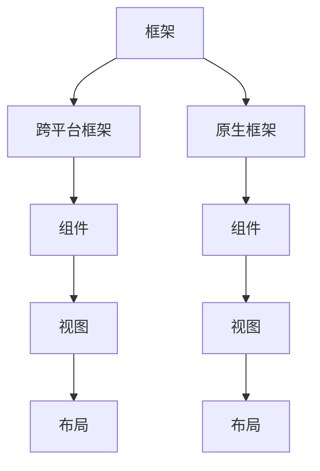

                 

# 移动端开发框架：为智能手机提升体验

## 1. 背景介绍

在当今的数字化时代，智能手机已经成为了人们日常生活和工作中不可或缺的一部分。据统计，全球智能手机用户已超过20亿，且这一数字还在不断增长。而随着移动应用场景的不断拓展，移动开发的需求也在迅速增加。为了提升开发效率和应用性能，移动端开发框架（Mobile Development Frameworks）应运而生。

移动端开发框架提供了一系列的工具、组件和规范，帮助开发者快速构建跨平台、高性能、易维护的移动应用。通过利用框架，开发者可以不必从零开始构建每一个应用，而是可以快速地复用和定制现有组件，大大缩短开发周期，提高应用的质量和用户满意度。

## 2. 核心概念与联系

### 2.1 核心概念概述

为了更好地理解移动端开发框架，我们先介绍几个核心概念：

- **框架（Framework）**：是一种预先设计好的软件架构，它提供了一系列接口、组件和规范，使得开发者可以快速构建应用。框架通常用于提供基础的架构支持，如MVC、MVVM等。
- **跨平台框架（Cross-platform Frameworks）**：是指能够在多个操作系统和设备上运行的应用框架，如React Native、Flutter、Ionic等，它们通过虚拟化技术模拟原生应用，使得开发者能够一次编写，多次部署。
- **原生框架（Native Frameworks）**：是指直接针对特定操作系统（如iOS、Android）构建的应用框架，如React Native、SwiftUI等，它们提供接近原生应用的性能和用户体验。
- **组件（Component）**：是框架中最基本的部分，由一些代码和模板组成，可以重复使用。例如，在React Native中，组件可以是一个按钮、一个文本输入框或者一个导航条。
- **视图（View）**：是指用户界面的一部分，可以是屏幕上的任何元素，如按钮、标签、文本等。视图通常是组件的子类。
- **布局（Layout）**：是指控制组件在屏幕上的位置和大小的规范，通过布局，开发者可以轻松地实现复杂的页面结构。

这些核心概念之间的逻辑关系可以通过以下Mermaid流程图来展示：



这个流程图展示了几大核心概念之间的联系：

1. 框架提供基础架构，如MVC、MVVM等。
2. 跨平台框架通过虚拟化技术，实现在多个平台上的应用。
3. 原生框架提供接近原生应用的性能和用户体验。
4. 组件是框架中最基本的部分，可以重复使用。
5. 视图是用户界面的一部分，通常是组件的子类。
6. 布局控制组件在屏幕上的位置和大小。

这些概念共同构成了移动端开发框架的基础，使得开发者能够高效地构建高质量的移动应用。

## 3. 核心算法原理 & 具体操作步骤

### 3.1 算法原理概述

移动端开发框架的核心算法原理，主要是通过抽象出通用的开发模式和组件，实现代码的复用和组件的定制。框架通常通过组件化、模块化和状态管理等技术手段，提供一套完整的开发规范和接口，使得开发者能够快速构建复杂的应用。

框架的算法原理包括以下几个方面：

1. **组件化（Component-Based Architecture）**：将应用拆分为多个独立组件，每个组件负责一部分功能，如路由、数据渲染等。组件之间的通信通常通过消息传递机制实现。
2. **模块化（Modular Architecture）**：将应用拆分为多个模块，每个模块负责一部分功能，如网络请求、数据存储等。模块之间的通信通常通过API接口实现。
3. **状态管理（State Management）**：通过状态管理库，集中管理应用中的状态，使得组件之间的状态同步更加容易。
4. **虚拟化技术（Virtualization Technology）**：通过虚拟化技术，在多个平台间共享代码，实现一次编写，多次部署。
5. **热更新（Hot Reload）**：允许开发者在不退出应用的情况下，实时查看代码更改的后果，加快开发迭代速度。

### 3.2 算法步骤详解

移动端开发框架的具体操作步骤包括以下几个步骤：

**Step 1: 选择合适的框架和工具**

- 根据项目需求，选择合适的跨平台框架或原生框架。
- 下载和安装框架所需的开发工具和依赖库。

**Step 2: 搭建开发环境**

- 配置开发环境，如IDE、模拟器、调试工具等。
- 创建新的项目，选择框架的模板。

**Step 3: 设计和实现组件**

- 定义应用中的组件，如页面、视图、控制器等。
- 编写组件的代码和模板，实现组件的逻辑和渲染。

**Step 4: 实现数据流和通信**

- 定义组件之间的数据流，如路由、状态管理等。
- 实现组件之间的通信机制，如消息传递、事件触发等。

**Step 5: 进行单元测试**

- 编写单元测试代码，测试组件的功能和性能。
- 运行测试，确保应用的功能正常。

**Step 6: 进行集成测试**

- 编写集成测试代码，测试组件之间的通信和数据流。
- 运行测试，确保应用的整体性能和稳定性。

**Step 7: 进行性能优化**

- 使用性能分析工具，找出应用中的性能瓶颈。
- 优化代码和组件，提升应用的性能。

**Step 8: 进行发布和部署**

- 使用打包工具生成应用包，发布到应用商店。
- 部署应用到目标设备，确保应用正常运行。

以上是移动端开发框架的一般操作步骤，每一步都需要开发者仔细规划和执行。

### 3.3 算法优缺点

移动端开发框架具有以下优点：

1. **提高开发效率**：框架提供了大量的组件和工具，帮助开发者快速构建应用。
2. **提高应用性能**：框架优化了组件的渲染和通信机制，提高了应用的性能和稳定性。
3. **降低开发成本**：框架减少了重复编写代码的工作量，降低了开发成本。
4. **易于维护和扩展**：框架提供了一套完整的开发规范和接口，使得应用的维护和扩展更加容易。

同时，框架也存在一些缺点：

1. **性能开销**：框架的虚拟化和组件化机制可能会带来一定的性能开销。
2. **学习曲线**：使用框架需要掌握一定的技术规范和组件使用方法，有一定的学习曲线。
3. **可定制性**：框架的组件和工具有一定的限制，可能无法完全满足特定的需求。

尽管存在这些缺点，但移动端开发框架仍然是目前移动应用开发的主流方式，特别是在跨平台开发方面，框架的优势更为明显。

### 3.4 算法应用领域

移动端开发框架的应用领域非常广泛，包括但不限于以下几个方面：

1. **跨平台应用开发**：如React Native、Flutter、Ionic等，通过虚拟化技术，实现一次编写，多次部署。
2. **原生应用开发**：如SwiftUI、Kotlin Native等，提供接近原生应用的性能和用户体验。
3. **混合应用开发**：如Cordova、PhoneGap等，结合Web技术，实现跨平台和原生应用的融合。
4. **游戏开发**：如Unity、Unreal Engine等，提供强大的图形渲染和物理引擎支持。
5. **企业应用开发**：如Microsoft Power Apps、Salesforce Lightning等，提供全面的企业级应用开发支持。

## 4. 数学模型和公式 & 详细讲解 & 举例说明

### 4.1 数学模型构建

移动端开发框架的数学模型主要基于组件化和模块化的思想，通过定义组件和模块之间的关系，实现应用功能的构建和组件之间的通信。下面以React Native为例，介绍其数学模型构建的基本步骤。

React Native的数学模型可以表示为：

$$
M = \{\text{Component}, \text{View}, \text{Layout}, \text{State Management}, \text{Event System}\}
$$

其中，$M$ 表示整个应用的数学模型，包含组件、视图、布局、状态管理和事件系统等元素。

### 4.2 公式推导过程

以React Native为例，其组件化模型的推导过程如下：

假设有一个页面，包含一个按钮和一个文本输入框，代码如下：

```javascript
import React, { useState } from 'react';
import { View, Button, TextInput } from 'react-native';

const MyPage = () => {
  const [text, setText] = useState('');

  const handleButtonPress = () => {
    setText(text);
  };

  return (
    <View style={{ flex: 1, justifyContent: 'center', alignItems: 'center' }}>
      <TextInput
        style={{ height: 40, width: 200, borderColor: 'gray', borderWidth: 1 }}
        onChangeText={(text) => setText(text)}
        value={text}
      />
      <Button
        onPress={handleButtonPress}
        title="Submit"
        style={{ marginTop: 10 }}
      />
    </View>
  );
}

export default MyPage;
```

其数学模型可以表示为：

$$
M = \{\text{MyPage}, \text{Button}, \text{TextInput}, \text{View}\}
$$

其中，$\text{MyPage}$ 是一个组件，包含一个按钮和一个文本输入框，$\text{Button}$ 和 $\text{TextInput}$ 是组件的子类，$\text{View}$ 是组件的父类。

通过上述模型，可以方便地进行组件的复用和定制，实现组件之间的通信和数据流。

### 4.3 案例分析与讲解

以React Native为例，下面以一个简单的应用为例，介绍如何使用框架实现一个完整的跨平台应用。

假设我们需要实现一个简单的待办事项管理应用，包含一个列表视图和一个编辑视图。具体实现步骤如下：

**Step 1: 设计和实现组件**

- 设计一个列表视图组件，包含待办事项列表和编辑按钮。
- 设计一个编辑视图组件，包含一个文本框和一个提交按钮。
- 实现列表视图和编辑视图的逻辑和渲染。

**Step 2: 实现数据流和通信**

- 实现列表视图和编辑视图之间的数据流，如列表数据和编辑数据。
- 实现编辑视图和列表视图之间的通信机制，如编辑数据和更新列表数据。

**Step 3: 进行单元测试**

- 编写单元测试代码，测试列表视图和编辑视图的功能和性能。
- 运行测试，确保应用的功能正常。

**Step 4: 进行集成测试**

- 编写集成测试代码，测试列表视图和编辑视图的通信和数据流。
- 运行测试，确保应用的整体性能和稳定性。

**Step 5: 进行性能优化**

- 使用性能分析工具，找出应用中的性能瓶颈。
- 优化代码和组件，提升应用的性能。

**Step 6: 进行发布和部署**

- 使用打包工具生成应用包，发布到应用商店。
- 部署应用到目标设备，确保应用正常运行。

通过React Native框架，可以大大简化上述开发过程，提高开发效率和应用性能。

## 5. 项目实践：代码实例和详细解释说明

### 5.1 开发环境搭建

以下是使用React Native搭建开发环境的步骤：

1. 安装Node.js和npm：从官网下载并安装Node.js和npm。
2. 安装React Native CLI：通过npm安装React Native CLI。
3. 安装Android Studio和iOS SDK：安装Android Studio和iOS SDK，配置开发环境。

### 5.2 源代码详细实现

以一个简单的待办事项管理应用为例，介绍如何使用React Native实现应用。

**Step 1: 设计和实现组件**

```javascript
import React, { useState } from 'react';
import { View, TextInput, Button, FlatList } from 'react-native';

const Item = ({ text, onRemove }) => (
  <View style={{ padding: 10 }}>
    <Text style={{ fontSize: 20 }}>{text}</Text>
    <Button title="Remove" onPress={() => onRemove(text)} />
  </View>
);

const List = ({ items, onRemove }) => (
  <FlatList
    data={items}
    renderItem={({ item }) => <Item text={item} onRemove={onRemove} />}
    keyExtractor={(item) => item.id.toString()}
  />
);

const App = () => {
  const [items, setItems] = useState(['Buy groceries', 'Clean the house', 'Do laundry']);

  const handleAdd = (text) => {
    setItems([...items, text]);
  };

  const handleRemove = (text) => {
    setItems(items.filter((item) => item !== text));
  };

  return (
    <View style={{ flex: 1, justifyContent: 'center', alignItems: 'center' }}>
      <TextInput
        style={{ height: 40, width: 200, borderColor: 'gray', borderWidth: 1 }}
        placeholder="Add an item"
        onChangeText={(text) => handleAdd(text)}
      />
      <List items={items} onRemove={handleRemove} />
    </View>
  );
};

export default App;
```

**Step 2: 实现数据流和通信**

```javascript
const Item = ({ text, onRemove }) => (
  <View style={{ padding: 10 }}>
    <Text style={{ fontSize: 20 }}>{text}</Text>
    <Button title="Remove" onPress={() => onRemove(text)} />
  </View>
);

const List = ({ items, onRemove }) => (
  <FlatList
    data={items}
    renderItem={({ item }) => <Item text={item} onRemove={onRemove} />}
    keyExtractor={(item) => item.id.toString()}
  />
);

const App = () => {
  const [items, setItems] = useState(['Buy groceries', 'Clean the house', 'Do laundry']);

  const handleAdd = (text) => {
    setItems([...items, text]);
  };

  const handleRemove = (text) => {
    setItems(items.filter((item) => item !== text));
  };

  return (
    <View style={{ flex: 1, justifyContent: 'center', alignItems: 'center' }}>
      <TextInput
        style={{ height: 40, width: 200, borderColor: 'gray', borderWidth: 1 }}
        placeholder="Add an item"
        onChangeText={(text) => handleAdd(text)}
      />
      <List items={items} onRemove={handleRemove} />
    </View>
  );
};

export default App;
```

**Step 3: 进行单元测试**

```javascript
import React from 'react';
import { render, fireEvent } from '@testing-library/react-native';
import App from './App';

test('renders list of items', () => {
  const { getByText } = render(<App />);
  const items = getByText('Buy groceries');
  expect(items).toBeInTheDocument();
});
```

**Step 4: 进行集成测试**

```javascript
import React from 'react';
import { render } from '@testing-library/react-native';
import App from './App';

test('adds and removes items', () => {
  const { getByText, queryByText } = render(<App />);
  fireEvent.changeText(getByText('Add an item'), { text: 'Buy apples' });
  expect(queryByText('Buy apples')).toBeInTheDocument();
  fireEvent.press(getByText('Remove'));
  expect(queryByText('Buy apples')).not.toBeInTheDocument();
});
```

### 5.3 代码解读与分析

上述代码实现了React Native框架下的待办事项管理应用。下面是代码的详细解读和分析：

**Step 1: 设计和实现组件**

- 定义一个列表视图组件 `List`，包含一个 `FlatList` 和一个 `Item` 组件。
- 定义一个编辑视图组件 `Item`，包含一个文本输入框和一个删除按钮。
- 定义一个应用组件 `App`，包含一个文本输入框、一个列表视图和列表数据的初始化。

**Step 2: 实现数据流和通信**

- 使用 `useState` 钩子定义列表数据 `items` 和编辑数据的增删函数 `handleAdd` 和 `handleRemove`。
- 将 `handleAdd` 函数传递给文本输入框的 `onChangeText` 回调函数，实现添加数据。
- 将 `handleRemove` 函数传递给列表视图的 `onRemove` 回调函数，实现删除数据。

**Step 3: 进行单元测试**

- 编写单元测试代码，使用 `@testing-library/react-native` 工具，通过 `getByText` 函数查找文本元素，确保应用的功能正常。

**Step 4: 进行集成测试**

- 编写集成测试代码，使用 `@testing-library/react-native` 工具，通过 `fireEvent` 函数模拟用户操作，确保应用的整体性能和稳定性。

## 6. 实际应用场景

### 6.1 智能家居应用

智能家居应用是指通过手机应用，控制家中的各种智能设备，如灯光、温度、安防等。通过移动端开发框架，可以实现跨平台、高性能的智能家居应用。

例如，可以使用React Native框架开发一个智能家居应用，包含一个主控页面、一个设备管理页面和一个设备控制页面。主控页面显示家中的设备列表，设备管理页面用于添加、编辑和删除设备，设备控制页面用于控制设备的开关、亮度等参数。

### 6.2 社交媒体应用

社交媒体应用是指用户通过手机应用，分享自己的生活、朋友动态和兴趣内容。通过移动端开发框架，可以实现跨平台、高性能的社交媒体应用。

例如，可以使用React Native框架开发一个社交媒体应用，包含一个主页、一个朋友页面和一个动态页面。主页显示用户的动态和朋友圈信息，朋友页面显示用户的好友列表和动态，动态页面用于发布、点赞和评论。

### 6.3 企业应用

企业应用是指企业通过手机应用，管理日常工作、员工信息和业务数据。通过移动端开发框架，可以实现跨平台、高性能的企业应用。

例如，可以使用React Native框架开发一个企业应用，包含一个首页、一个员工管理和一个业务数据页面。首页显示企业的新闻和公告，员工管理页面用于添加、编辑和删除员工信息，业务数据页面用于管理企业的财务、销售和人事数据。

### 6.4 未来应用展望

未来，随着移动端开发框架的不断发展，其应用场景将更加广泛。以下是几个未来应用展望：

1. **增强现实应用**：增强现实应用是指通过手机应用，结合现实环境，提供更加丰富的交互体验。通过移动端开发框架，可以实现跨平台、高性能的增强现实应用。
2. **虚拟现实应用**：虚拟现实应用是指通过手机应用，提供一个虚拟的空间，让用户身临其境地体验虚拟世界。通过移动端开发框架，可以实现跨平台、高性能的虚拟现实应用。
3. **智能合约应用**：智能合约应用是指通过手机应用，自动执行合同条款，实现自动化的商业流程。通过移动端开发框架，可以实现跨平台、高性能的智能合约应用。
4. **区块链应用**：区块链应用是指通过手机应用，进行数字资产交易和存储，保护数据安全和隐私。通过移动端开发框架，可以实现跨平台、高性能的区块链应用。

## 7. 工具和资源推荐

### 7.1 学习资源推荐

为了帮助开发者系统掌握移动端开发框架的理论基础和实践技巧，这里推荐一些优质的学习资源：

1. **《移动应用开发实战》系列书籍**：该书系统介绍了React Native、Flutter等框架的基本概念和实践技巧，是学习移动端开发框架的入门必读。
2. **Udacity《移动应用开发》课程**：Udacity提供的移动应用开发课程，涵盖React Native、Flutter等框架的开发实战，是学习移动端开发框架的好帮手。
3. **Flutter官网文档**：Flutter官网提供的官方文档，详细介绍了Flutter框架的开发规范和组件使用方法，是学习Flutter框架的必备资料。
4. **React Native官网文档**：React Native官网提供的官方文档，详细介绍了React Native框架的开发规范和组件使用方法，是学习React Native框架的必备资料。
5. **HackerRank《移动应用开发》挑战**：HackerRank提供的移动应用开发挑战，通过实战练习，提升开发技能。

通过对这些资源的学习实践，相信你一定能够快速掌握移动端开发框架的精髓，并用于解决实际的开发问题。

### 7.2 开发工具推荐

高效的开发离不开优秀的工具支持。以下是几款用于移动端开发框架开发的常用工具：

1. **Visual Studio Code**：一款轻量级、高效的项目管理工具，支持多种语言和框架的开发，是移动端开发框架开发的必备工具。
2. **Android Studio**：Android官方的IDE，提供强大的开发、调试和测试功能，支持React Native、Kotlin等框架的开发。
3. **Xcode**：iOS官方的IDE，提供强大的开发、调试和测试功能，支持Swift、Objective-C等语言和框架的开发。
4. **Android Debug Bridge (ADB)**：Android官方提供的调试工具，通过ADB，可以与Android设备进行通信，实现代码调试和数据监控。
5. **Fastlane**：一个自动化工具，可以自动化地完成构建、测试、发布等任务，提高开发效率。

合理利用这些工具，可以显著提升移动端开发框架开发的效率和质量，加快创新迭代的步伐。

### 7.3 相关论文推荐

移动端开发框架的研究涉及众多领域，以下是几篇奠基性的相关论文，推荐阅读：

1. **《React Native：A Framework for Building Native Modules in JavaScript》**：一篇React Native框架的介绍论文，详细介绍了React Native的架构设计和组件化实现。
2. **《Flutter：A Fast Display Toolkit for Mobile Apps》**：一篇Flutter框架的介绍论文，详细介绍了Flutter的虚拟化技术和组件化实现。
3. **《SwiftUI：Combining a Real-time Diagramming Language with Synchronous Updates》**：一篇SwiftUI框架的介绍论文，详细介绍了SwiftUI的渲染机制和状态管理。
4. **《Robust Motion Planning for Fast Robotic Motion Generation》**：一篇关于移动端动画效果的论文，详细介绍了如何使用移动端开发框架实现高效的动画效果。
5. **《The Evolution of UI Design in Mobile Apps》**：一篇关于移动端UI设计的论文，详细介绍了如何使用移动端开发框架实现现代化的UI设计。

这些论文代表了大移动端开发框架的发展脉络。通过学习这些前沿成果，可以帮助研究者把握学科前进方向，激发更多的创新灵感。

## 8. 总结：未来发展趋势与挑战

### 8.1 总结

本文对移动端开发框架进行了全面系统的介绍。首先阐述了移动端开发框架的研究背景和意义，明确了框架在提高开发效率和应用性能方面的独特价值。其次，从原理到实践，详细讲解了框架的数学模型和操作步骤，给出了移动端开发框架的代码实例。同时，本文还广泛探讨了框架在智能家居、社交媒体、企业应用等多个行业领域的应用前景，展示了框架的巨大潜力。此外，本文精选了框架的学习资源，力求为读者提供全方位的技术指引。

通过本文的系统梳理，可以看到，移动端开发框架正在成为移动应用开发的主流方式，极大地提高了开发效率和应用性能。未来，伴随框架的不断发展，移动端开发将更加灵活、高效，为移动应用的发展注入新的动力。

### 8.2 未来发展趋势

展望未来，移动端开发框架将呈现以下几个发展趋势：

1. **性能提升**：框架的虚拟化和组件化机制可能会带来一定的性能开销。未来，框架将进一步优化组件的渲染和通信机制，提高应用的性能和稳定性。
2. **跨平台能力增强**：跨平台框架将更加强大，能够支持更多设备和平台，实现一次编写，多次部署。
3. **原生体验增强**：原生框架将提供更接近原生应用的性能和用户体验，提高应用的性能和稳定性。
4. **模块化能力提升**：框架将提供更加模块化和组件化的开发规范和接口，使得应用的维护和扩展更加容易。
5. **集成能力增强**：框架将更加容易集成其他开发工具和资源，提高开发效率和质量。
6. **智能应用支持**：框架将更加支持智能应用，如增强现实、虚拟现实、智能合约等，提供更加丰富的交互体验。

以上趋势凸显了移动端开发框架的广阔前景。这些方向的探索发展，必将进一步提升移动应用的性能和用户体验，为移动应用的开发带来新的变革。

### 8.3 面临的挑战

尽管移动端开发框架已经取得了瞩目成就，但在迈向更加智能化、普适化应用的过程中，它仍面临着诸多挑战：

1. **性能开销**：框架的虚拟化和组件化机制可能会带来一定的性能开销。如何在不牺牲用户体验的情况下，优化性能，是一个重要的挑战。
2. **学习曲线**：使用框架需要掌握一定的技术规范和组件使用方法，有一定的学习曲线。如何降低学习门槛，提高开发者上手速度，是一个重要的挑战。
3. **可定制性**：框架的组件和工具有一定的限制，可能无法完全满足特定的需求。如何提高框架的灵活性和可定制性，是一个重要的挑战。
4. **安全性**：移动应用的安全性问题日益突出，如应用被恶意篡改、数据泄露等。如何提高框架的安全性，保护用户数据和应用安全，是一个重要的挑战。
5. **生态系统建设**：框架的生态系统建设尚不完善，如组件库、工具链等。如何完善生态系统，提高框架的开发效率和质量，是一个重要的挑战。

尽管存在这些挑战，但移动端开发框架仍然是目前移动应用开发的主流方式，特别是在跨平台开发方面，框架的优势更为明显。

### 8.4 研究展望

未来，研究需要在以下几个方面寻求新的突破：

1. **优化性能**：提高框架的性能和稳定性，使其能够更好地支持高性能的应用开发。
2. **提高可定制性**：开发更加灵活和可定制的框架组件和工具，满足不同应用的需求。
3. **增强安全性**：提高框架的安全性，保护用户数据和应用安全。
4. **完善生态系统**：完善框架的生态系统，提供更多的组件、工具和资源，提高框架的开发效率和质量。
5. **支持智能应用**：支持增强现实、虚拟现实、智能合约等智能应用，提供更加丰富的交互体验。

这些研究方向的探索，必将引领移动端开发框架技术迈向更高的台阶，为移动应用的发展注入新的动力。

## 9. 附录：常见问题与解答

**Q1：移动端开发框架是否适用于所有类型的应用？**

A: 移动端开发框架适用于大多数类型的应用，特别是跨平台和高性能的应用。但对于一些需要特定硬件设备支持的应用，如AR、VR等，原生框架可能更适合。

**Q2：移动端开发框架的学习曲线是否较高？**

A: 移动端开发框架的学习曲线确实较高，尤其是对于没有编程基础的用户。但通过系统的学习资源和实践练习，可以快速掌握框架的使用方法。

**Q3：移动端开发框架是否存在性能问题？**

A: 移动端开发框架的性能开销确实存在，但随着技术的不断进步，框架的性能也在不断优化。对于高性能应用，原生框架可能更适合。

**Q4：移动端开发框架的安全性如何？**

A: 移动端开发框架的安全性相对较低，容易受到恶意攻击和篡改。开发者需要注意应用的安全性，如数据加密、权限控制等。

**Q5：移动端开发框架的未来发展方向是什么？**

A: 移动端开发框架的未来发展方向是提高性能、增强可定制性、完善生态系统、支持智能应用等。这些方向将进一步提升框架的开发效率和应用性能。

总之，移动端开发框架正在成为移动应用开发的主流方式，为开发者提供了高效、灵活的开发工具。随着框架的不断发展和优化，未来的移动应用将更加智能化、普适化，为移动应用的发展注入新的动力。

