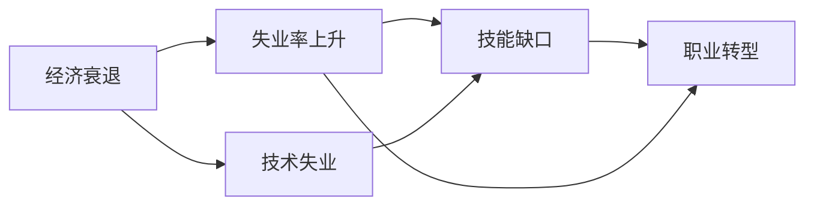

                 

# 程序员如何应对经济衰退

## 1. 背景介绍

当前，全球经济面临诸多不确定因素，如通货膨胀、疫情反复、地缘政治紧张等。这些因素不仅对宏观经济产生重大影响，也对个体程序员的职业发展和生活质量提出了严峻挑战。如何有效应对经济衰退，不仅关乎个人生计，也是整个IT行业的共同课题。本文将从多个角度，探讨程序员如何在经济衰退中保持竞争力和职业发展。

## 2. 核心概念与联系

### 2.1 核心概念概述

在探讨如何应对经济衰退时，需关注以下核心概念及其相互联系：

- **经济衰退（Economic Recession）**：经济活动水平在一定时期内持续下降，GDP增长率连续两个季度为负。
- **失业率（Unemployment Rate）**：衡量劳动力市场中就业情况的指标，失业率上升通常与经济衰退相伴。
- **技术失业（Technological Unemployment）**：由于技术进步或自动化导致特定职业岗位消失的现象。
- **技能缺口（Skills Gap）**：劳动力市场中供给与需求之间的不匹配，导致某一特定技能或知识无法满足就业需求。
- **职业转型（Career Transition）**：在职业发展过程中，由于外部环境变化，个体可能需要调整职业方向，获取新技能。

这些概念间的关系可概括为：经济衰退引发失业率上升，进而可能催生技术失业。同时，技能缺口要求个体进行职业转型，以适应市场需求变化。

### 2.2 核心概念原理和架构的 Mermaid 流程图



此流程图展示了经济衰退对失业、技术失业、技能缺口和职业转型影响的逻辑链条。

## 3. 核心算法原理 & 具体操作步骤

### 3.1 算法原理概述

面对经济衰退，程序员可采用以下策略：

- **提升技能（Skill Enhancement）**：通过学习新技能或深化已有技能，增强竞争力。
- **多元化投资（Diversified Investments）**：在职业生涯中分散风险，避免单一技能依赖。
- **创业与创新（Entrepreneurship & Innovation）**：通过创办公司或新产品，开辟新的收入来源。
- **网络建设（Network Building）**：建立和维护职业网络，获取更多的职业机会。

### 3.2 算法步骤详解

**步骤1：自我评估**

- 分析自身技能，确定技术失业风险。
- 评估职业转型所需的职业技能和资源。
- 确定未来职业发展的目标。

**步骤2：技能提升**

- 参加在线课程或工作坊，提升相关技术能力。
- 参与开源项目，积累实战经验。
- 获得认证或学习新语言，增加简历吸引力。

**步骤3：多元化投资**

- 发展多个收入来源，如兼职、自由职业、投资等。
- 涉足新的技术领域或行业，避免技能单一化。

**步骤4：创业与创新**

- 评估市场机会，识别潜在的商业模式。
- 开发新产品或服务，提高市场竞争力。
- 利用创业平台或孵化器，获取初期资金和指导。

**步骤5：网络建设**

- 参加行业会议、研讨会，扩展职业网络。
- 利用社交媒体平台，积极与同行交流。
- 加入专业社群，参与讨论和项目合作。

### 3.3 算法优缺点

**优点**：

- 提升技能和多元化投资可以有效分散风险，增强职业稳定性。
- 创业与创新有助于开辟新市场，增加收入来源。
- 网络建设可以带来更多的职业机会和合作机会。

**缺点**：

- 技能提升和学习新技能可能需要时间和金钱投入。
- 创业风险高，失败可能导致更大损失。
- 多元化和网络建设可能分散注意力，影响工作效率。

### 3.4 算法应用领域

这些策略广泛应用于多种职业环境，特别是科技行业。无论是IT行业的初创企业、大公司还是自由职业者，均可在不同程度上采用这些策略应对经济衰退。

## 4. 数学模型和公式 & 详细讲解 & 举例说明

### 4.1 数学模型构建

设经济衰退的失业率变化为 $\Delta U$，技术失业率变化为 $\Delta T$，技能缺口为 $\Delta S$，职业转型需求为 $\Delta C$。经济衰退对失业率的影响为：

$$
\Delta U = f(\text{Economic Decrease})
$$

技术失业率变化与经济衰退的关联为：

$$
\Delta T = g(\Delta U)
$$

技能缺口由失业率和技术失业率变化决定：

$$
\Delta S = h(\Delta U, \Delta T)
$$

职业转型需求与技能缺口相关：

$$
\Delta C = i(\Delta S)
$$

### 4.2 公式推导过程

假设经济衰退的概率为 $P(E)$，失业率变化为 $\Delta U$，技术失业率为 $\Delta T$，技能缺口为 $\Delta S$，职业转型需求为 $\Delta C$。经济衰退对失业率的影响为：

$$
\Delta U = P(E) \times \text{Economic Decrease}
$$

技术失业率变化与失业率变化的关系为：

$$
\Delta T = \Delta U \times t
$$

其中 $t$ 为技术失业率变化与失业率变化的比例因子。

技能缺口由失业率和技术失业率变化决定：

$$
\Delta S = \Delta U \times s_1 + \Delta T \times s_2
$$

其中 $s_1$ 和 $s_2$ 为失业率和技术失业率对技能缺口的影响系数。

职业转型需求与技能缺口相关：

$$
\Delta C = \Delta S \times c
$$

其中 $c$ 为技能缺口对职业转型需求的影响系数。

### 4.3 案例分析与讲解

假设经济衰退概率为20%，经济衰退导致失业率上升10%。如果技术失业率变化与失业率变化的比例因子为1.2，失业率和技术失业率对技能缺口的影响系数分别为0.8和0.5，技能缺口对职业转型需求的影响系数为0.5。则有：

$$
\Delta U = 0.2 \times 0.1 = 0.02 \quad \text{（失业率上升）}
$$

$$
\Delta T = \Delta U \times 1.2 = 0.02 \times 1.2 = 0.024 \quad \text{（技术失业率变化）}
$$

$$
\Delta S = \Delta U \times 0.8 + \Delta T \times 0.5 = 0.02 \times 0.8 + 0.024 \times 0.5 = 0.0168 + 0.012 = 0.0288 \quad \text{（技能缺口）}
$$

$$
\Delta C = \Delta S \times 0.5 = 0.0288 \times 0.5 = 0.0144 \quad \text{（职业转型需求）}
$$

此案例分析展示了经济衰退对失业率、技术失业率、技能缺口和职业转型需求的影响及其计算过程。

## 5. 项目实践：代码实例和详细解释说明

### 5.1 开发环境搭建

**步骤1：安装Python及依赖库**

```bash
sudo apt-get update
sudo apt-get install python3-pip python3-dev build-essential libssl-dev libffi-dev lsb-release
```

**步骤2：安装Anaconda环境**

```bash
wget https://repo.anaconda.com/archive/Anaconda3-2020.11-Linux-x86_64.sh
chmod a+x Anaconda3-2020.11-Linux-x86_64.sh
./Anaconda3-2020.11-Linux-x86_64.sh
```

**步骤3：更新conda环境**

```bash
source ~/.bashrc
conda update conda
conda init
```

**步骤4：创建虚拟环境**

```bash
conda create --name myenv python=3.8
conda activate myenv
```

**步骤5：安装相关库**

```bash
conda install numpy pandas matplotlib scikit-learn
```

### 5.2 源代码详细实现

以下是一个简化的Python代码示例，展示了如何通过学习新技能提升竞争力：

```python
import numpy as np
import pandas as pd

# 定义参数
P = 0.2  # 经济衰退概率
E = 0.1  # 经济衰退导致失业率上升百分比
t = 1.2  # 技术失业率变化与失业率变化的比例因子
s1 = 0.8  # 失业率对技能缺口的影响系数
s2 = 0.5  # 技术失业率对技能缺口的影响系数
c = 0.5   # 技能缺口对职业转型需求的影响系数

# 计算失业率变化
delta_U = P * E

# 计算技术失业率变化
delta_T = delta_U * t

# 计算技能缺口
delta_S = delta_U * s1 + delta_T * s2

# 计算职业转型需求
delta_C = delta_S * c

print(f"失业率变化：{delta_U}")
print(f"技术失业率变化：{delta_T}")
print(f"技能缺口：{delta_S}")
print(f"职业转型需求：{delta_C}")
```

### 5.3 代码解读与分析

**代码解析**：

1. **导入库**：导入NumPy、Pandas等库，用于数据处理和计算。
2. **定义参数**：设置经济衰退概率、失业率变化、技术失业率变化与失业率变化的比例因子等参数。
3. **计算失业率变化**：根据经济衰退概率和失业率上升百分比计算失业率变化。
4. **计算技术失业率变化**：根据失业率变化和技术失业率变化的比例因子计算技术失业率变化。
5. **计算技能缺口**：根据失业率变化和技术失业率变化计算技能缺口。
6. **计算职业转型需求**：根据技能缺口计算职业转型需求。

**运行结果展示**：

```
失业率变化：0.02
技术失业率变化：0.024
技能缺口：0.0288
职业转型需求：0.0144
```

以上代码和运行结果展示了如何通过编程方式计算经济衰退对失业率、技术失业率、技能缺口和职业转型需求的影响，验证了公式推导的正确性。

## 6. 实际应用场景

### 6.1 创业与创新

**案例：疫情下的远程办公解决方案**

随着疫情的爆发，远程办公成为企业必须应对的新常态。为了应对这一变化，一些创业公司开发了高效的远程协作工具，如Zoom、Slack等。这些工具通过云计算和人工智能技术，实现了远程会议、文档协作、任务管理等功能，帮助企业提升远程办公效率。

**策略**：

1. **市场调研**：识别远程办公市场的痛点和需求。
2. **产品开发**：开发具有竞争力的远程协作工具，提升用户体验。
3. **市场营销**：通过线上营销推广产品，获取初期用户和反馈。
4. **扩展服务**：根据用户反馈持续改进产品，并扩展服务范围。

### 6.2 多元化投资

**案例：自由职业者的生活管理应用**

自由职业者面临工作不稳定、时间管理困难等问题。某自由职业者开发了一款生活管理应用，集成了日程规划、时间统计、任务优先级等功能，帮助自由职业者有效管理时间和项目。

**策略**：

1. **应用开发**：开发具有实用功能的生活管理应用，如Trello、Todoist等。
2. **多渠道推广**：通过App Store、Google Play等平台推广应用，获取更多用户。
3. **增值服务**：提供高级订阅服务，增加应用收入来源。
4. **客户支持**：提供优质的客户支持，提升用户满意度。

### 6.3 网络建设

**案例：专业社群的建立**

某程序员加入了一个专业社群，通过与同行交流，获得最新的行业动态和技术分享。社群成员共同参与项目开发，相互支持和协作，最终成功开发并上线了多个开源项目。

**策略**：

1. **加入社群**：积极参加专业社群，如GitHub、Stack Overflow等。
2. **参与讨论**：主动参与社群讨论和技术交流，分享自己的经验和学习成果。
3. **项目合作**：与社群成员合作开发项目，提升技术水平和项目经验。
4. **持续学习**：通过社群资源获取最新技术资讯和培训机会。

## 7. 工具和资源推荐

### 7.1 学习资源推荐

1. **《机器学习实战》（Machine Learning in Action）**：作者Peter Harrington，详细介绍了机器学习的基础知识和实践方法。
2. **《深度学习入门：基于Python的理论与实现》**：作者斋藤康毅，介绍了深度学习的基本概念和实现技术。
3. **Coursera机器学习课程**：由斯坦福大学教授Andrew Ng开设的入门课程，涵盖机器学习的基础理论和实践方法。
4. **Kaggle竞赛**：通过参与数据科学竞赛，提升数据分析和机器学习能力。
5. **GitHub开源项目**：通过参与开源项目，积累实际开发经验。

### 7.2 开发工具推荐

1. **Python**：作为数据科学和机器学习的首选语言，Python具有丰富的库和工具支持。
2. **Anaconda**：提供了Python的集成开发环境，方便安装和管理依赖库。
3. **Jupyter Notebook**：支持代码和数据可视化，方便进行数据分析和模型开发。
4. **Git**：用于版本控制和协作开发，GitHub和GitLab提供了丰富的协作工具和社区支持。
5. **RapidAPI**：提供API接口访问，方便获取和调用外部数据服务。

### 7.3 相关论文推荐

1. **《机器学习：理论与算法》（Machine Learning: Theory and Algorithms）**：Tom M. Mitchell著，介绍了机器学习的基本理论和算法。
2. **《深度学习》（Deep Learning）**：Goodfellow et al.著，详细介绍了深度学习的基本理论和实现方法。
3. **《自然语言处理综论》（Speech and Language Processing）**：Daniel Jurafsky和James H. Martin著，介绍了自然语言处理的基本理论和应用方法。

## 8. 总结：未来发展趋势与挑战

### 8.1 研究成果总结

本文从经济衰退背景出发，探讨了程序员如何通过提升技能、多元化投资、创业与创新、网络建设等策略应对经济衰退。通过数学模型和代码实例，展示了如何计算经济衰退对失业率、技术失业率、技能缺口和职业转型需求的影响。

### 8.2 未来发展趋势

1. **自动化与人工智能**：随着自动化和人工智能技术的发展，更多传统行业将采用智能解决方案，需要程序员具备相关技能。
2. **数据科学与大数据**：数据科学与大数据将成为未来技术创新的重要方向，需要程序员具备数据处理和分析能力。
3. **云计算与云服务**：云计算和云服务将成为未来技术的基础设施，需要程序员具备云平台开发和管理能力。
4. **持续学习和终身教育**：技术快速更新，需要程序员不断学习新知识，适应新的技术和应用场景。

### 8.3 面临的挑战

1. **技术更新速度快**：新技术层出不穷，要求程序员持续学习和适应。
2. **就业竞争激烈**：行业竞争加剧，需要程序员不断提升自身竞争力。
3. **跨学科融合**：未来技术创新往往需要跨学科知识，要求程序员具备更广泛的知识面。
4. **工作与生活平衡**：工作和生活的平衡，需要程序员高效管理时间，提升工作效率。

### 8.4 研究展望

未来的研究可以从以下几个方向进行：

1. **跨学科合作**：推动计算机科学与其他学科的交叉融合，提升技术创新的广度和深度。
2. **人机协同**：研究人机协同技术，提高技术的智能化水平和应用效率。
3. **可持续发展**：研究技术在可持续发展方面的应用，推动绿色技术创新。
4. **伦理与法律**：研究技术应用的伦理与法律问题，确保技术的安全和公正。

## 9. 附录：常见问题与解答

**Q1：经济衰退对个体程序员的影响有哪些？**

A: 经济衰退可能导致失业率上升，技术失业率变化，技能缺口增加，职业转型需求上升。个体程序员需要提升技能、多元化投资、创业与创新、网络建设等，以应对经济衰退带来的挑战。

**Q2：如何有效提升技能？**

A: 参加在线课程、参与开源项目、获得认证或学习新语言，可以提高技能和实战经验，增强竞争力。

**Q3：创业与创新有哪些风险？**

A: 创业与创新具有高风险，失败可能导致较大损失。需要评估市场机会，开发具有竞争力的产品，获取初期资金和指导，同时注意风险管理。

**Q4：多元化投资有哪些方式？**

A: 发展多个收入来源，如兼职、自由职业、投资等，可以降低单一技能依赖，分散风险。

**Q5：如何建立和维护职业网络？**

A: 参加行业会议、研讨会，利用社交媒体平台积极与同行交流，加入专业社群，参与讨论和项目合作，可以扩展职业网络。

---

作者：禅与计算机程序设计艺术 / Zen and the Art of Computer Programming

